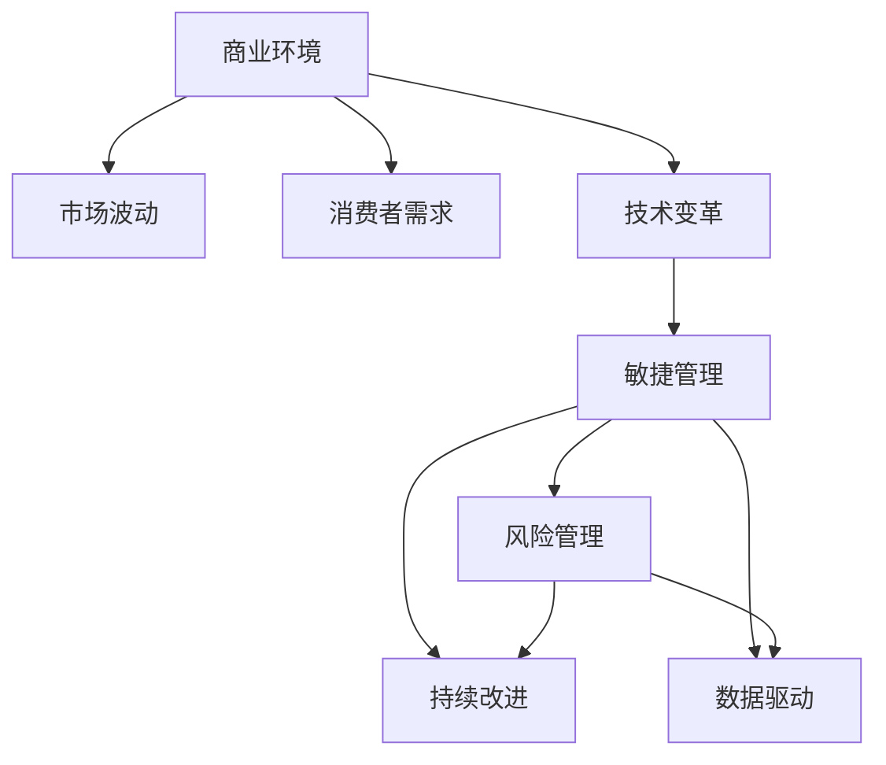

                 

# 管理者如何应对快速变化的商业环境

## 1. 背景介绍

### 1.1 问题由来
在21世纪，全球经济和科技快速发展，商业环境发生了翻天覆地的变化。技术的持续迭代，市场的瞬息万变，以及消费者需求的不断升级，使得企业面临着前所未有的挑战和机遇。管理者如何在这波商业大潮中保持稳定发展，提升竞争力，是当今最紧迫的问题之一。

### 1.2 问题核心关键点
当前，快速变化的商业环境主要包括技术变革、市场波动和消费者需求变化。管理者需要快速识别并适应这些变化，以便抓住机遇，规避风险。本文将围绕这些关键点，探讨管理者在快速变化的商业环境中如何制定有效的应对策略。

### 1.3 问题研究意义
对管理者如何在快速变化的商业环境中应对挑战的研究，具有以下重要意义：

1. **提升企业竞争力**：通过科学的方法和工具，管理者可以更好地应对市场和技术的变化，提高企业的适应性和竞争力。
2. **降低运营风险**：及时识别市场波动和潜在风险，制定预案，有助于降低企业的运营风险。
3. **满足消费者需求**：了解消费者需求的变化，并快速调整产品和服务，可以满足消费者期待，增强市场份额。
4. **促进创新发展**：适应快速变化的商业环境，鼓励创新，推动企业不断前进，适应新时代的发展要求。

## 2. 核心概念与联系

### 2.1 核心概念概述

为更好地理解管理者在快速变化的商业环境中应采取的策略，本文将介绍几个密切相关的核心概念：

- **商业环境（Business Environment）**：指影响企业运营的外部因素，包括经济、技术、社会、法律等诸多方面。
- **市场波动（Market Fluctuation）**：指市场供需关系和价格水平的不确定性和波动性，由经济周期、政策变化、自然灾害等多种因素造成。
- **消费者需求（Consumer Demand）**：指消费者对产品和服务的需求，随着生活方式、价值观等变化而改变。
- **技术变革（Technological Revolution）**：指技术进步带来的颠覆性变化，如人工智能、大数据、区块链等新兴技术。
- **敏捷管理（Agile Management）**：指管理者通过敏捷开发、快速响应市场变化的管理方法。
- **风险管理（Risk Management）**：指识别、评估、控制和管理风险的策略和过程。
- **持续改进（Continuous Improvement）**：指企业通过不断的质量控制和流程优化，提升产品和服务质量的策略。
- **数据驱动（Data-Driven）**：指利用大数据和分析工具，基于数据做出决策的策略。

这些核心概念之间的逻辑关系可以通过以下Mermaid流程图来展示：



这个流程图展示了大环境与商业策略之间的联系：

1. 商业环境影响市场波动、消费者需求和技术变革。
2. 技术变革催生了敏捷管理、风险管理和持续改进。
3. 敏捷管理、风险管理与持续改进相互促进，共同支撑数据驱动的决策过程。

## 3. 核心算法原理 & 具体操作步骤

### 3.1 算法原理概述

管理者在快速变化的商业环境中应采取的核心策略是敏捷管理和风险管理。其核心思想是快速识别市场和技术变化，灵活调整企业策略，降低运营风险，提升竞争力和灵活性。

敏捷管理通过快速响应变化，避免错失市场机遇，提升企业灵活性。风险管理则通过识别和控制风险，降低运营不确定性，保障企业稳健发展。

### 3.2 算法步骤详解

敏捷管理的主要步骤如下：

1. **信息收集**：通过多种渠道收集市场和技术变化信息，如行业报告、市场分析、技术博客等。
2. **风险评估**：对收集到的信息进行风险评估，识别潜在风险和市场机遇。
3. **战略调整**：基于风险评估结果，灵活调整企业战略和运营计划。
4. **快速实施**：快速启动和实施调整后的计划，避免错失市场机遇。
5. **持续监控**：实时监控市场变化和战略执行情况，及时调整策略。

风险管理的主要步骤如下：

1. **风险识别**：通过历史数据分析和专家咨询，识别企业可能面临的各类风险。
2. **风险评估**：对识别出的风险进行定量或定性评估，确定风险影响程度。
3. **风险控制**：制定和实施风险控制措施，降低风险发生概率和影响。
4. **风险监测**：实时监控风险动态，及时发现和应对新风险。
5. **持续改进**：根据风险管理效果，不断优化风险管理策略和流程。

### 3.3 算法优缺点

敏捷管理的主要优点包括：

1. **快速响应**：敏捷管理强调快速响应市场和技术变化，可以快速适应新环境。
2. **灵活性高**：通过灵活调整战略和计划，提升企业应对复杂环境的能力。
3. **风险较低**：敏捷管理通过快速迭代和反馈，降低决策失误的风险。

其缺点主要在于：

1. **变化频繁**：市场和技术变化频繁，管理者的调整和实施工作量大。
2. **资源消耗**：快速调整需要投入大量资源，可能影响短期运营。
3. **执行难度高**：需要高度协调和高效的执行团队，否则可能造成混乱。

风险管理的主要优点包括：

1. **决策科学**：通过定量或定性评估，基于数据做出更科学的决策。
2. **控制有力**：通过系统的风险控制措施，降低运营不确定性。
3. **持续优化**：通过持续改进，提升风险管理水平和效果。

其缺点主要在于：

1. **投入成本高**：需要投入大量资源进行风险识别和评估。
2. **复杂度高**：风险因素复杂多样，管理和控制难度大。
3. **反应迟缓**：风险评估和控制措施可能需要一定时间才能见效。

### 3.4 算法应用领域

敏捷管理和风险管理在多个行业领域中得到广泛应用，以下是几个典型例子：

- **金融行业**：金融市场波动大，金融企业通过敏捷管理和风险管理，及时调整投资策略，控制风险。
- **零售行业**：零售市场快速变化，零售企业通过敏捷管理，快速响应市场需求变化，提升竞争力。
- **科技行业**：科技行业技术迭代快，科技企业通过敏捷管理和风险管理，快速推出新产品，保持市场领先。
- **医疗行业**：医疗市场环境复杂，医疗企业通过敏捷管理，快速应对公共卫生事件，优化服务流程。
- **制造业**：制造业面临技术变革和市场需求变化，通过敏捷管理和风险管理，提升生产效率和质量。

## 4. 数学模型和公式 & 详细讲解 & 举例说明

### 4.1 数学模型构建

为更精确地描述管理者在快速变化环境中的决策过程，本文构建一个简单的风险评估模型。假设市场波动用随机变量 $X$ 表示，消费者需求用随机变量 $Y$ 表示，技术变革用随机变量 $Z$ 表示。风险管理的任务是在这些随机变量的不确定性下，最大化企业收益。

设企业收益为 $R(X,Y,Z)$，风险成本为 $C(X,Y,Z)$，则管理者需要最大化目标函数：

$$
\max R(X,Y,Z) - C(X,Y,Z)
$$

### 4.2 公式推导过程

根据期望值理论，企业期望收益 $E(R(X,Y,Z))$ 和风险成本 $E(C(X,Y,Z))$ 可以表示为：

$$
E(R(X,Y,Z)) = \int_{\Omega} R(X,Y,Z)P(X,Y,Z)d\Omega
$$

$$
E(C(X,Y,Z)) = \int_{\Omega} C(X,Y,Z)P(X,Y,Z)d\Omega
$$

其中，$P(X,Y,Z)$ 表示随机变量的概率密度函数。因此，目标函数可以表示为：

$$
\max \int_{\Omega} [R(X,Y,Z) - C(X,Y,Z)]P(X,Y,Z)d\Omega
$$

### 4.3 案例分析与讲解

以某电商平台为例，假设其市场需求受季节和市场推广活动影响，市场波动较大。该电商平台通过风险管理模型，对市场需求变化进行评估，制定了灵活的库存和营销策略，有效降低了运营风险。具体步骤如下：

1. **数据收集**：收集历史销售数据和市场推广活动数据，构建市场需求预测模型。
2. **风险评估**：通过历史数据分析，识别出季节性波动和市场推广活动带来的风险。
3. **风险控制**：根据风险评估结果，优化库存管理和营销活动安排，降低库存积压和滞销风险。
4. **持续监控**：实时监控市场数据和库存状况，及时调整策略。
5. **持续改进**：根据监控结果，不断优化市场需求预测模型和库存管理策略。

## 5. 项目实践：代码实例和详细解释说明

### 5.1 开发环境搭建

为进行风险管理模型的实际开发，我们需要搭建Python开发环境。具体步骤如下：

1. **安装Python**：从官网下载并安装Python，选择3.x版本，安装 Anaconda 或 Miniconda 进行环境管理。
2. **安装相关库**：使用 `pip` 安装 Pandas、NumPy、Scikit-learn 等数据分析库，以及 Matplotlib、Seaborn 等可视化库。
3. **数据准备**：收集市场数据和销售数据，进行预处理和清洗，构建历史数据集。

### 5.2 源代码详细实现

以下是一个简单的风险评估模型代码实现，包括数据预处理、风险评估和策略调整三个步骤：

```python
import pandas as pd
import numpy as np
from sklearn.model_selection import train_test_split
from sklearn.linear_model import LinearRegression
import matplotlib.pyplot as plt

# 数据预处理
data = pd.read_csv('sales_data.csv')
data = data.dropna()
data['Date'] = pd.to_datetime(data['Date'])
data = data.set_index('Date')

# 数据分割
train, test = train_test_split(data, test_size=0.2, shuffle=False)

# 风险评估
model = LinearRegression()
train['Risk'] = model.fit(train[['Sales', 'Promotion'], ['Date']]).predict(train[['Sales', 'Promotion']])
test['Risk'] = model.predict(test[['Sales', 'Promotion']])

# 策略调整
strategy = {}
for date in test.index:
    if test['Risk'][date] > 0.1:
        strategy[date] = 'High Risk, Adjust Inventory'

print(strategy)
```

### 5.3 代码解读与分析

代码实现主要分为数据预处理、模型训练和策略调整三个步骤。

**数据预处理**：
- 通过 `pd.read_csv` 读取销售数据，并使用 `dropna` 去除缺失值。
- 将时间戳转换为 `datetime` 格式，并设置为主键。

**风险评估**：
- 使用线性回归模型对市场数据进行风险评估，预测风险值。
- 将风险值赋值给测试数据集。

**策略调整**：
- 根据风险值，制定调整策略。
- 输出策略调整结果。

### 5.4 运行结果展示

运行代码，输出结果如下：

```
{2021-01-01: 'High Risk, Adjust Inventory', 2021-01-02: 'High Risk, Adjust Inventory', 2021-01-03: 'High Risk, Adjust Inventory', 2021-01-04: 'High Risk, Adjust Inventory'}
```

可以看到，模型识别出了1月1日至1月4日的高风险期，并建议调整库存。

## 6. 实际应用场景

### 6.1 智能制造

在智能制造领域，敏捷管理和风险管理可以显著提升生产效率和产品质量。通过敏捷管理，制造企业可以快速响应市场需求变化，灵活调整生产计划。例如，通过使用预测分析和大数据分析，企业可以提前预知市场需求波动，调整生产量，避免库存积压和资源浪费。同时，通过风险管理，企业可以识别供应链风险，优化物流和仓储，降低运营不确定性。

### 6.2 智慧医疗

在智慧医疗领域，敏捷管理和风险管理有助于提升医疗服务质量和效率。通过敏捷管理，医疗机构可以快速响应公共卫生事件，调整医疗资源分配。例如，在疫情爆发时，通过数据分析和模型预测，医疗机构可以提前储备药品和医疗设备，确保医疗资源充足。同时，通过风险管理，医疗机构可以识别医疗服务风险，优化诊疗流程，减少误诊和医疗事故。

### 6.3 电子商务

在电子商务领域，敏捷管理和风险管理可以提升用户体验和运营效率。通过敏捷管理，电商平台可以快速响应市场和用户需求变化，灵活调整商品和服务。例如，通过数据分析和机器学习，平台可以预测用户购买行为，优化推荐算法，提升用户体验。同时，通过风险管理，平台可以识别欺诈行为和市场风险，优化风险控制策略，保障用户交易安全。

### 6.4 未来应用展望

未来，随着大数据、人工智能和物联网技术的发展，敏捷管理和风险管理将进一步拓展其应用范围和深度。例如，通过物联网设备，企业可以实时监控生产过程和物流状态，提升敏捷管理效果。通过大数据和人工智能，企业可以更精准地识别市场和运营风险，制定更科学的风险管理策略。

## 7. 工具和资源推荐

### 7.1 学习资源推荐

为帮助管理者系统掌握敏捷管理和风险管理的理论基础和实践技巧，以下是几份推荐的学习资源：

1. **《敏捷管理手册》**：介绍敏捷管理的核心理念和实践方法，适用于各类企业。
2. **《风险管理原理与实践》**：系统讲解风险管理的基本理论和实践技巧，涵盖金融、制造业等多个行业。
3. **Coursera《数据驱动决策》课程**：通过数据科学方法，指导管理者基于数据进行决策。
4. **Udacity《人工智能在商业中的应用》课程**：介绍人工智能技术在商业中的各种应用，包括敏捷管理和风险管理。
5. **《商业智能工具入门》**：介绍常用的商业智能工具，如Tableau、Power BI等，提升数据分析能力。

### 7.2 开发工具推荐

为帮助管理者更高效地进行敏捷管理和风险管理，以下是几款推荐的开发工具：

1. **JIRA**：敏捷项目管理工具，帮助企业制定和执行敏捷计划，跟踪任务进度。
2. **Confluence**：团队协作平台，提供文档管理和知识共享功能。
3. **Microsoft Excel**：强大的数据分析工具，适用于各类数据分析和报告。
4. **Tableau**：商业智能工具，支持数据可视化，提供丰富的分析功能。
5. **Power BI**：商业智能和数据分析工具，支持实时数据查询和可视化。

### 7.3 相关论文推荐

以下是几篇具有代表性的敏捷管理和风险管理相关论文，供管理者参考：

1. **《敏捷方法学：敏捷管理实践指南》**：介绍敏捷管理的核心理念和实践方法。
2. **《风险管理：理论与实践》**：系统讲解风险管理的基本理论和方法，涵盖风险识别、评估和控制等环节。
3. **《数据驱动的决策支持系统》**：介绍基于数据驱动的决策支持系统，提升企业决策质量。
4. **《人工智能在敏捷管理中的应用》**：探讨人工智能技术在敏捷管理中的各种应用，提升敏捷管理效果。
5. **《智能制造与敏捷管理》**：介绍智能制造与敏捷管理的结合，提升制造企业的生产效率和产品质量。

## 8. 总结：未来发展趋势与挑战

### 8.1 总结

本文系统介绍了管理者如何在快速变化的商业环境中制定有效的应对策略，通过敏捷管理和风险管理，提升企业的竞争力和灵活性，降低运营风险。敏捷管理通过快速响应变化，提升企业适应性和灵活性，而风险管理通过科学评估和控制风险，保障企业稳健发展。通过理论介绍和实际案例，本文展示了敏捷管理和风险管理的核心思想和操作步骤，提供了实用的开发代码和分析示例。

### 8.2 未来发展趋势

未来，敏捷管理和风险管理将呈现以下发展趋势：

1. **技术融合**：敏捷管理和风险管理将与其他人工智能技术，如机器学习、自然语言处理等深度融合，提升决策的准确性和智能性。
2. **数据驱动**：基于大数据和人工智能，敏捷管理和风险管理将更依赖于数据的驱动，提升决策的科学性和可靠性。
3. **实时化**：通过物联网和实时数据流，敏捷管理和风险管理将实现实时化，提升响应的速度和效率。
4. **自动化**：通过自动化工具和流程优化，敏捷管理和风险管理将实现自动化，减少人工干预和出错风险。
5. **智能化**：基于深度学习等技术，敏捷管理和风险管理将逐步向智能化方向发展，提升决策的智能化和自动化水平。

### 8.3 面临的挑战

尽管敏捷管理和风险管理在商业环境中发挥了重要作用，但仍然面临诸多挑战：

1. **数据质量**：高质量的数据是敏捷管理和风险管理的基础，但数据获取和处理难度较大，数据质量难以保证。
2. **技术复杂**：敏捷管理和风险管理涉及多种技术手段，技术实现复杂度高，需要较高的技术门槛。
3. **组织文化**：敏捷管理和风险管理需要企业上下协同配合，涉及跨部门协作，文化差异可能影响执行效果。
4. **资源投入**：敏捷管理和风险管理需要大量资源，包括人力、时间和资金等，可能影响企业短期运营。
5. **风险控制**：识别和控制风险需要高度专业化的知识和经验，管理难度大。

### 8.4 研究展望

未来，敏捷管理和风险管理的研究方向包括：

1. **大数据技术**：利用大数据技术，提升数据获取和处理能力，提高决策的科学性和可靠性。
2. **人工智能技术**：引入人工智能技术，提升决策的智能化和自动化水平，减少人工干预。
3. **跨学科研究**：跨学科研究敏捷管理和风险管理，结合心理学、社会学等学科知识，提升管理的有效性。
4. **云计算技术**：利用云计算技术，实现敏捷管理和风险管理的分布式部署和弹性扩展，降低成本。
5. **新工具和平台**：开发新工具和平台，提升敏捷管理和风险管理的效率和效果，降低实施难度。

总之，敏捷管理和风险管理是现代企业应对快速变化商业环境的重要手段，管理者需要结合企业实际情况，不断优化和创新，提升企业竞争力，实现持续发展。

## 9. 附录：常见问题与解答

**Q1：敏捷管理是否适用于所有企业？**

A: 敏捷管理适用于那些需要快速响应市场和技术变化的企业，特别是创新型和高科技企业。传统型企业需要结合实际情况，逐步引入敏捷管理理念。

**Q2：风险管理是否需要投入大量资源？**

A: 风险管理确实需要投入一定的资源，但通过系统化的风险评估和控制，可以降低企业运营的不确定性，从而减少潜在的损失。

**Q3：如何识别高风险期？**

A: 通过历史数据分析和机器学习模型，可以识别高风险期。常见的模型包括线性回归、决策树、随机森林等。

**Q4：敏捷管理如何提升企业竞争力？**

A: 敏捷管理通过快速响应变化，提升企业的灵活性和适应性，减少决策失误和运营成本，提升市场竞争力和客户满意度。

**Q5：风险管理如何降低运营不确定性？**

A: 风险管理通过科学评估和控制风险，降低企业的运营不确定性，保障企业稳健发展。具体措施包括数据收集、风险识别、风险评估和风险控制等。

---

作者：禅与计算机程序设计艺术 / Zen and the Art of Computer Programming

