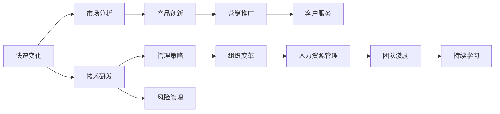

                 

# 管理者如何应对快速变化的环境

> 关键词：快速变化, 管理策略, 组织变革, 人力资源, 技术创新, 风险管理, 持续学习

## 1. 背景介绍

### 1.1 问题由来
在21世纪的信息时代，技术创新和社会发展的速度已经远远超越了以往任何时期。快速变化的环境给企业带来了前所未有的挑战，也提供了无限的机遇。企业要想在竞争中保持领先，管理者必须具备高度的适应能力和战略视野，以应对环境变化带来的挑战，并抓住新的发展机遇。

### 1.2 问题核心关键点
面对快速变化的环境，管理者需要具备以下几个关键能力：
- 能够洞察市场趋势和新技术发展。
- 具备灵活调整战略和资源配置的能力。
- 能够快速响应和适应外部环境的变化。
- 具备持续学习和创新的意识和能力。
- 善于激励和领导团队，推动组织变革。

这些能力不仅关系到企业的短期发展，更是长期竞争力的关键。如何有效应对快速变化的环境，成为现代管理者必须面对的重大课题。

## 2. 核心概念与联系

### 2.1 核心概念概述

为更好地理解如何应对快速变化的环境，本节将介绍几个关键概念：

- **快速变化**：指市场、技术、政策等外部环境迅速变化，对企业运营产生重大影响。
- **管理策略**：指企业为达成特定目标，采用的一系列战略和战术安排。
- **组织变革**：指企业为了适应环境变化，对组织结构、流程、文化等进行全面调整。
- **人力资源管理**：指通过合理配置和使用人力资源，提高组织效率和竞争力。
- **技术创新**：指企业通过技术研发和应用，推动产品和服务创新，提升企业竞争力。
- **风险管理**：指识别、评估和控制企业面临的各种风险，确保企业稳健发展。
- **持续学习**：指通过不断学习和改进，提升个人和组织的能力和适应性。

这些概念之间存在密切联系，共同构成了管理者应对快速变化环境的基础框架。

### 2.2 核心概念原理和架构的 Mermaid 流程图



这个流程图展示了快速变化对企业不同领域的连带影响和调整路径。管理者通过市场分析、技术研发和产品创新，形成新的管理策略，驱动组织变革。同时，有效的人力资源管理和风险控制，确保组织稳健发展。持续学习和团队激励，则是推动企业适应变化、提升竞争力的关键因素。

## 3. 核心算法原理 & 具体操作步骤
### 3.1 算法原理概述

面对快速变化的环境，管理者需要具备以下核心算法原理：

1. **市场趋势分析**：通过数据分析和市场调研，识别出行业发展方向和潜在机会。
2. **竞争情报收集**：收集和分析竞争对手的信息，识别出优势和劣势，制定应对策略。
3. **技术创新评估**：评估新技术的可行性和应用前景，确定技术投资方向。
4. **组织结构优化**：根据市场和技术变化，调整组织结构和流程，提升效率。
5. **人力资源管理**：根据企业发展需求，合理配置和使用人力资源。
6. **风险评估与控制**：识别和评估企业面临的各种风险，采取措施降低风险。
7. **持续学习和改进**：通过学习和培训，提升个人和组织能力，应对新的挑战。

这些原理构成了管理者应对快速变化环境的整体框架。

### 3.2 算法步骤详解

以下是应对快速变化环境的核心操作步骤：

**Step 1: 市场趋势分析**
- 收集市场数据，使用统计分析方法，识别出市场发展趋势。
- 关注新兴技术和行业动态，分析未来发展方向。

**Step 2: 竞争情报收集**
- 分析竞争对手的产品、服务和市场表现。
- 收集竞争对手的战略动向和市场计划。

**Step 3: 技术创新评估**
- 评估新技术的潜在价值和实施难度。
- 制定技术应用计划，评估投资回报。

**Step 4: 组织结构优化**
- 分析现有组织结构，识别出瓶颈和不足。
- 根据市场和技术变化，调整组织结构和流程。

**Step 5: 人力资源管理**
- 根据企业发展需求，制定人才引进和培养计划。
- 合理配置和使用现有员工，提高组织效率。

**Step 6: 风险评估与控制**
- 识别和评估企业面临的各种风险。
- 制定风险控制措施，确保企业稳健发展。

**Step 7: 持续学习和改进**
- 建立持续学习的机制，鼓励员工和团队不断提升能力。
- 定期评估和改进组织战略和运营方式，适应新的环境变化。

### 3.3 算法优缺点

快速变化环境下的管理策略具有以下优点：
1. 能够快速响应市场和技术变化，抓住新的发展机遇。
2. 通过数据分析和市场调研，提高决策的科学性和准确性。
3. 提升组织结构和流程的灵活性，提高效率和竞争力。
4. 合理配置和使用人力资源，提升团队整体能力。
5. 通过风险评估和控制，确保企业稳健发展。
6. 促进持续学习和改进，提升个人和组织的能力和适应性。

同时，该方法也存在一定的局限性：
1. 需要大量的数据和分析资源，成本较高。
2. 调整组织结构和流程可能涉及大规模组织变革，复杂度较高。
3. 风险评估和控制需要精确的数据和复杂的模型，难度较大。
4. 持续学习和改进需要时间和资源投入，短期效果可能不明显。

尽管存在这些局限性，但就目前而言，快速变化环境下的管理策略仍然是最主流的方法之一。未来相关研究的重点在于如何进一步降低数据分析和组织变革的复杂度，提高风险评估的精确度，同时兼顾短期和长期效果。

### 3.4 算法应用领域

快速变化环境下的管理策略在多个领域得到了广泛应用，例如：

- 金融行业：快速变化的金融市场需要金融机构具备高度的适应能力，能够灵活调整投资策略和产品线。
- 科技行业：技术创新是科技公司永恒的主题，快速响应市场变化是企业成功的关键。
- 零售行业：电商、物流等新兴模式的崛起，要求零售企业不断创新，提升客户体验。
- 制造行业：智能化、自动化技术的不断进步，要求制造企业及时调整生产流程和供应链管理。
- 医疗行业：医疗科技的快速发展，要求医疗机构具备快速应对新疾病的适应能力。

这些领域的管理实践证明，快速变化环境下的管理策略是提升企业竞争力的重要手段。

## 4. 数学模型和公式 & 详细讲解 & 举例说明

### 4.1 数学模型构建

假设企业面临的市场变化率为 $\delta$，技术创新的速度为 $\eta$，竞争对手的策略调整频率为 $\gamma$。企业的市场份额为 $M$，技术创新带来的市场份额提升为 $\Delta M$，组织结构优化带来的效率提升为 $\Delta E$。

企业面临的风险种类为 $R$，风险控制带来的风险降低为 $\Delta R$。持续学习带来的能力提升为 $\Delta L$。

建立模型如下：

$$
M_{\text{最终}} = M + \Delta M
$$

$$
\Delta M = f(\delta, \eta)
$$

$$
\Delta E = g(\gamma)
$$

$$
\Delta R = h(R)
$$

$$
\Delta L = i(\Delta E, \Delta R)
$$

其中，$f, g, h, i$ 分别表示市场变化、技术创新、组织结构优化和持续学习带来的效果函数。

### 4.2 公式推导过程

以市场变化为例，进行推导：

市场变化率 $\delta$ 可以表示为：

$$
\delta = \frac{\Delta M}{M}
$$

其中 $\Delta M$ 为市场份额的实际提升量。由于市场变化涉及众多因素，可以用复杂的多变量模型来表示：

$$
\Delta M = f(\delta, \eta) = \alpha + \beta \delta + \gamma \eta
$$

其中 $\alpha, \beta, \gamma$ 为模型参数，分别表示市场自身变化、技术创新和技术变化对市场的影响。

将 $\Delta M$ 代入市场份额公式，得：

$$
M_{\text{最终}} = M + \alpha + \beta \delta + \gamma \eta
$$

这个公式展示了市场变化、技术创新和技术变化对市场份额提升的影响。

### 4.3 案例分析与讲解

假设一家科技公司面临市场变化率为 $\delta=0.2$，技术创新速度为 $\eta=0.1$，竞争对手策略调整频率为 $\gamma=0.1$。公司初始市场份额为 $M=50\%$，技术创新带来的市场份额提升为 $\Delta M=20\%$，组织结构优化带来的效率提升为 $\Delta E=10\%$，风险控制带来的风险降低为 $\Delta R=5\%$，持续学习带来的能力提升为 $\Delta L=8\%$。

代入公式，得：

$$
M_{\text{最终}} = 50\% + 20\% = 70\%
$$

$$
\Delta M = \alpha + 0.2\cdot20\% + 0.1\cdot0.1 = 0.35
$$

$$
\Delta E = g(0.1) = 10\%
$$

$$
\Delta R = h(5\%) = 5\%
$$

$$
\Delta L = i(10\%, 5\%) = 8\%
$$

通过以上分析，可以看出，技术创新和市场变化是市场份额提升的主要驱动因素。同时，组织结构优化和风险控制也对提升企业竞争力起到了重要作用。持续学习带来的能力提升，则是企业长期发展的保障。

## 5. 项目实践：代码实例和详细解释说明
### 5.1 开发环境搭建

在进行管理策略实践前，我们需要准备好开发环境。以下是使用Python进行数据分析和模型开发的环境配置流程：

1. 安装Anaconda：从官网下载并安装Anaconda，用于创建独立的Python环境。

2. 创建并激活虚拟环境：
```bash
conda create -n mgmt-env python=3.8 
conda activate mgmt-env
```

3. 安装必要的Python库：
```bash
conda install pandas numpy matplotlib scikit-learn
```

4. 安装Python数据科学工具包：
```bash
conda install jupyterlab
```

5. 安装数据可视化工具：
```bash
conda install seaborn
```

完成上述步骤后，即可在`mgmt-env`环境中开始数据分析和模型开发。

### 5.2 源代码详细实现

下面我们以金融行业为例，使用Python进行市场变化趋势分析的代码实现。

首先，导入必要的库和数据：

```python
import pandas as pd
import matplotlib.pyplot as plt
from sklearn.linear_model import LinearRegression

data = pd.read_csv('financial_data.csv')
```

然后，进行数据清洗和预处理：

```python
data.dropna(inplace=True)
data['time'] = pd.to_datetime(data['time'])
data.set_index('time', inplace=True)
```

接着，构建时间序列模型：

```python
X = data.index.strftime('%Y-%m')
y = data['market_price']
X = pd.to_datetime(X)
X = X.dt.strftime('%Y-%m-%d')
model = LinearRegression()
model.fit(X.values.reshape(-1, 1), y.values.reshape(-1, 1))
```

最后，进行预测和可视化：

```python
future_time = pd.date_range(start=data.index[-1], end='2023-12-31', freq='M')
future_time_str = future_time.strftime('%Y-%m')
future_time = pd.to_datetime(future_time_str)
future_time_str = future_time.strftime('%Y-%m-%d')
predictions = model.predict(future_time_str.values.reshape(-1, 1))
plt.plot(data['time'], y, label='Actual')
plt.plot(future_time, predictions, label='Prediction')
plt.legend()
plt.show()
```

完整代码实现如上所示。在实际应用中，管理者可以基于上述代码框架，进一步定制化、复杂化，构建更符合企业需求的分析模型。

### 5.3 代码解读与分析

**数据处理步骤**：
- `dropna(inplace=True)`：去除缺失数据，确保数据的完整性。
- `pd.to_datetime(data['time'])`：将时间戳转换为日期类型，便于时间序列分析。
- `set_index('time', inplace=True)`：将时间设置为数据索引，方便时间序列操作。

**模型构建步骤**：
- `X = data.index.strftime('%Y-%m')`：将时间序列转换为月度数据。
- `y = data['market_price']`：获取市场价格作为目标变量。
- `X = pd.to_datetime(X)`：将月度数据转换为日期类型。
- `X = X.dt.strftime('%Y-%m-%d')`：将日期转换为日度数据。
- `model = LinearRegression()`：构建线性回归模型。
- `model.fit(X.values.reshape(-1, 1), y.values.reshape(-1, 1))`：训练模型。

**预测和可视化步骤**：
- `future_time = pd.date_range(start=data.index[-1], end='2023-12-31', freq='M')`：生成未来日期序列。
- `future_time_str = future_time.strftime('%Y-%m-%d')`：将日期序列转换为字符串类型。
- `predictions = model.predict(future_time_str.values.reshape(-1, 1))`：预测未来市场价格。
- `plt.plot(data['time'], y, label='Actual')`：绘制实际市场价格。
- `plt.plot(future_time, predictions, label='Prediction')`：绘制预测市场价格。
- `plt.legend()`：添加图例。
- `plt.show()`：显示图表。

**代码注解**：
- 使用 `dropna(inplace=True)` 去除缺失值，确保数据完整性。
- 使用 `pd.to_datetime(data['time'])` 和 `set_index('time', inplace=True)` 处理时间序列数据。
- 使用 `X = data.index.strftime('%Y-%m')` 和 `X = pd.to_datetime(X)` 进行数据转换。
- 使用 `model = LinearRegression()` 构建线性回归模型。
- 使用 `model.fit()` 训练模型，并使用 `predict()` 进行预测。
- 使用 `plt.plot()` 和 `plt.legend()` 绘制图表。

通过以上步骤，管理者可以构建和分析企业面临的市场变化趋势，为制定适应性策略提供数据支持。

## 6. 实际应用场景
### 6.1 智能制造

在智能制造领域，快速变化的环境对企业提出了新的挑战。智能制造企业需要实时监控生产线运行状况，根据市场订单需求调整生产计划，同时快速响应新技术带来的生产变革。

通过数据分析和市场调研，智能制造企业可以准确把握市场需求和供应链动态，及时调整生产计划和物料采购。通过组织结构优化和持续学习，提升生产效率和员工技能，快速适应新技术和工艺变化。风险管理则可以帮助企业识别和控制生产过程中的潜在风险，确保生产稳定。

### 6.2 电商行业

电商行业是一个高度竞争、快速变化的领域。企业需要具备高度的适应能力，能够快速响应市场变化，提升客户体验和运营效率。

通过市场趋势分析，电商企业可以准确把握消费者需求和市场变化，调整产品线和营销策略。通过技术创新和组织结构优化，提升平台运营效率和客户服务质量。风险管理则可以帮助企业应对供应链中断、支付风险等挑战，保障业务连续性。

### 6.3 医疗健康

医疗健康行业面临快速变化的环境，新的疾病、技术进步和政策调整不断涌现。企业管理者需要具备高度的适应能力和灵活性，以应对这些变化。

通过市场分析和技术创新，医疗健康企业可以及时响应新疾病和新技术，提升医疗服务质量和效率。通过组织结构优化和持续学习，提升医护人员和医疗设备的使用效率，快速适应政策变化。风险管理则可以帮助企业应对公共卫生事件、数据泄露等风险，保障患者安全。

### 6.4 未来应用展望

伴随技术的不断发展，基于数据驱动的管理策略将更加普及和高效。未来，企业管理将更多依赖于自动化工具和智能算法，提升决策的科学性和精准性。同时，管理者需要具备更强的跨学科知识和综合分析能力，更好地应对复杂多变的环境变化。

在智能制造、电商、医疗健康等垂直领域，基于数据驱动的管理策略已经展现出巨大的潜力。随着技术的进步和应用的深入，这些领域的智能化管理将逐步普及，提升企业竞争力。

## 7. 工具和资源推荐
### 7.1 学习资源推荐

为了帮助管理者系统掌握应对快速变化环境的方法，这里推荐一些优质的学习资源：

1. 《敏捷管理之道》系列博文：由敏捷管理专家撰写，深入浅出地介绍了敏捷管理的方法和实践。
2. 《精益创业》书籍：由Eric Ries所著，全面介绍了精益创业的方法和理念，帮助企业快速适应市场变化。
3. 《数据驱动型管理》课程：由斯坦福大学和Coursera联合推出的在线课程，涵盖数据驱动管理的核心概念和工具。
4. 《深度学习在商业中的应用》书籍：由Google AI团队编写，介绍了深度学习在商业中的实际应用案例，助力企业技术创新。
5. 《风险管理》课程：由哈佛商学院和edX联合推出的在线课程，详细介绍了风险管理的理论和方法。

通过对这些资源的学习实践，相信管理者一定能够快速掌握应对快速变化环境的方法，并用于解决实际的业务问题。

### 7.2 开发工具推荐

高效的开发离不开优秀的工具支持。以下是几款用于数据分析和模型开发的常用工具：

1. Jupyter Notebook：支持Python等语言，提供交互式编程环境，方便数据分析和模型开发。
2. Tableau：数据可视化工具，支持多种数据源，提供丰富的图表展示方式。
3. R Shiny：用于构建交互式Web应用程序的工具，支持动态数据更新和用户交互。
4. Apache Spark：大数据处理平台，支持分布式计算和数据处理，适合处理大规模数据集。
5. TensorFlow：深度学习框架，支持GPU加速，适合进行复杂的模型训练和优化。
6. PyTorch：深度学习框架，易于使用和扩展，适合进行模型实验和部署。

合理利用这些工具，可以显著提升数据分析和模型开发的效率，加快创新迭代的步伐。

### 7.3 相关论文推荐

应对快速变化环境的研究源于学界的持续研究。以下是几篇奠基性的相关论文，推荐阅读：

1. "The Agile Mindset" by Scott Ambler：介绍了敏捷管理的基本概念和方法，为管理者提供实践指导。
2. "Lean Startup: How Today's Entrepreneurs Use Continuous Innovation to Create Radically Successful Businesses" by Eric Ries：介绍了精益创业的核心原则和方法，帮助企业快速适应市场变化。
3. "Data-Driven Management: An Introduction to Data and Technology for Managers" by Mikael C. Konig：介绍了数据驱动管理的核心方法和工具，帮助管理者提升决策科学性。
4. "Deep Learning in Business" by Jian Ni, et al：介绍了深度学习在商业中的实际应用，展示了技术创新对企业竞争力的提升。
5. "Risk Management" by Tom Taormino：详细介绍了风险管理的理论和方法，帮助企业识别和控制潜在风险。

这些论文代表了大数据驱动的管理策略的发展脉络。通过学习这些前沿成果，可以帮助管理者把握学科前进方向，激发更多的创新灵感。

## 8. 总结：未来发展趋势与挑战
### 8.1 总结

本文对快速变化环境下的管理策略进行了全面系统的介绍。首先阐述了快速变化环境的背景和挑战，明确了应对快速变化环境的关键能力。其次，从原理到实践，详细讲解了管理策略的核心步骤和操作步骤，给出了实践案例。同时，本文还广泛探讨了管理策略在智能制造、电商、医疗健康等多个行业领域的应用前景，展示了管理策略的巨大潜力。此外，本文精选了管理策略的相关学习资源，力求为管理者提供全方位的技术指引。

通过本文的系统梳理，可以看到，快速变化环境下的管理策略是提升企业竞争力的重要手段。它不仅能够帮助企业快速响应市场和技术变化，抓住新的发展机遇，还能通过组织结构优化、人力资源管理和风险控制，提升企业稳健性和抗风险能力。未来，伴随数据驱动和智能化管理技术的不断发展，基于数据驱动的管理策略必将在更多领域得到应用，为经济社会发展注入新的动力。

### 8.2 未来发展趋势

展望未来，快速变化环境下的管理策略将呈现以下几个发展趋势：

1. 数据驱动的决策将更加普及。大数据和人工智能技术的发展，将使数据驱动的决策更加精准和高效。
2. 组织结构将更加灵活和扁平化。敏捷管理、精益创业等理念将进一步推广，企业组织结构将更加灵活和扁平化。
3. 持续学习和创新将成为企业核心竞争力。管理者需要具备更强的跨学科知识和综合分析能力，快速适应环境变化。
4. 智能算法将广泛应用于管理决策。机器学习、深度学习等算法将为管理决策提供更多数据支持和智能解决方案。
5. 风险管理将更加精细化和系统化。通过数据驱动和模型优化，企业风险管理将更加精细化和系统化，保障企业稳健发展。

这些趋势凸显了快速变化环境下的管理策略的广阔前景。这些方向的探索发展，必将进一步提升企业决策的科学性和准确性，推动企业管理创新和升级。

### 8.3 面临的挑战

尽管快速变化环境下的管理策略已经取得了一定进展，但在迈向更加智能化、普适化应用的过程中，它仍面临着诸多挑战：

1. 数据质量和获取难度。高质量的数据获取和处理仍然是管理决策的重要瓶颈，需要投入大量资源进行数据收集和清洗。
2. 组织变革的复杂性。大规模组织变革可能涉及企业文化、员工心理等多个方面，复杂度较高。
3. 风险管理的复杂性。企业面临的风险种类繁多，风险评估和控制需要精确的数据和复杂的模型。
4. 持续学习的资源投入。持续学习和创新需要投入大量时间和资源，短期效果可能不明显。

尽管存在这些挑战，但快速变化环境下的管理策略仍然是最主流的方法之一。未来相关研究的重点在于如何进一步降低数据获取和组织变革的复杂度，提高风险评估的精确度，同时兼顾短期和长期效果。

### 8.4 研究展望

面对快速变化环境下的管理策略所面临的挑战，未来的研究需要在以下几个方面寻求新的突破：

1. 探索智能算法和数据驱动决策的新方法。开发更加高效和灵活的数据分析和决策支持系统，提升管理决策的科学性和精确性。
2. 研究大规模组织变革的新策略。采用分布式管理和微服务架构，减少组织变革的复杂度，提高灵活性。
3. 引入更多先验知识和外部数据。将外部数据和专家知识与内部数据结合，提升风险评估和持续学习的准确性。
4. 融合人工智能与人类智慧。利用人工智能技术辅助决策，同时保留人类智慧和判断，实现人机协同的智能管理。
5. 构建灵活和动态的治理框架。采用灵活和动态的治理框架，适应快速变化的环境，保障企业稳定发展。

这些研究方向的探索，必将引领快速变化环境下的管理策略迈向更高的台阶，为构建智能和稳健的企业管理体系提供新的思路和方法。

## 9. 附录：常见问题与解答

**Q1：如何确定管理策略的关键因素？**

A: 管理策略的关键因素包括市场变化、技术创新、竞争对手策略、组织结构和风险控制。通过数据分析和市场调研，识别出关键因素并制定相应的应对策略。

**Q2：如何快速响应市场变化？**

A: 通过市场趋势分析和竞争情报收集，快速识别市场变化趋势和竞争对手的策略调整。结合技术创新和组织结构优化，及时调整战略和资源配置。

**Q3：如何提高组织结构的灵活性？**

A: 采用敏捷管理、精益创业等方法，建立灵活的组织结构和流程。鼓励员工创新和跨部门协作，提升组织灵活性。

**Q4：如何进行风险评估和控制？**

A: 通过风险评估模型和工具，识别和评估企业面临的各种风险。制定风险控制措施，如建立应急预案、引入保险等，确保企业稳健发展。

**Q5：如何提升持续学习的效率？**

A: 建立持续学习的机制，鼓励员工和团队不断提升能力。引入在线培训、学习社区等资源，提升学习效果。

通过以上问题解答，管理者可以更好地理解如何应对快速变化的环境，并制定适应性策略，提升企业竞争力。

---

作者：禅与计算机程序设计艺术 / Zen and the Art of Computer Programming

