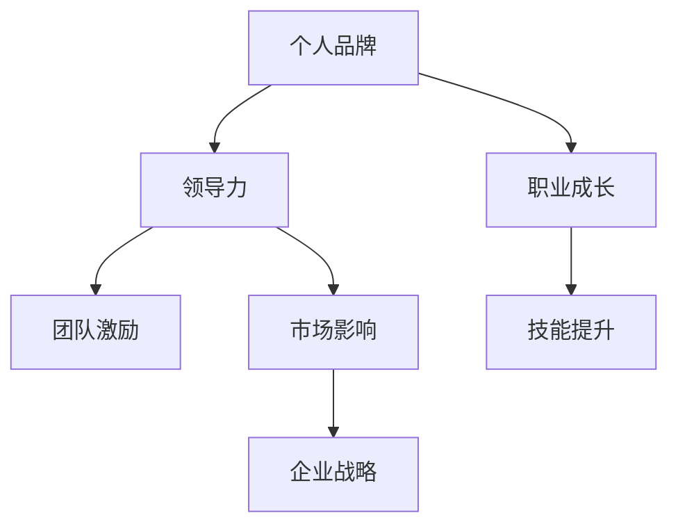

                 

# 管理者如何建立个人品牌

> 关键词：个人品牌建设, 管理者角色, 领导力发展, 企业影响力, 职业成长

## 1. 背景介绍

在现代商业环境中，个人品牌的重要性不言而喻。尤其是在企业管理层，个人品牌不仅是领导者形象的体现，更是企业品牌的重要组成部分。一个有影响力的管理者，往往能够推动团队、激励员工、影响市场，甚至带动企业战略的实施。因此，如何建立一个有权威、有魅力、有影响力的个人品牌，成为了每一个管理者的必修课。

本文将从管理者的个人品牌建设出发，结合实际案例和分析，探讨如何通过个人品牌建设，提升自己的领导力，带动企业发展，最终实现个人和组织的共同成长。

## 2. 核心概念与联系

### 2.1 核心概念概述

要建立个人品牌，首先需要理解几个核心概念：

- **个人品牌**：指通过个人在社会、职场等环境中的表现，塑造出的独特、一致的形象和价值主张。个人品牌不仅包括外在的形象（如衣着、语言、行为等），更涉及内在的价值观、知识体系、领导风格等。

- **领导力**：指通过个人影响力，激励、引导团队达成共同目标的能力。领导力不仅仅是管理职责，更是通过个人魅力和能力对他人产生影响的过程。

- **职业成长**：指个人在职业领域内的发展与进步，包括技能提升、知识扩展、职位晋升等。职业成长是个人品牌建设的重要动力，也是品牌影响力不断扩大的体现。

这些概念之间的联系紧密，一个有影响力的管理者，其个人品牌、领导力和职业成长相互促进，形成良性循环。一个强有力的个人品牌，能够提升领导力，推动职业成长；而良好的领导力和职业成长，又能进一步巩固和提升个人品牌。

### 2.2 核心概念原理和架构的 Mermaid 流程图(Mermaid 流程节点中不要有括号、逗号等特殊字符)



## 3. 核心算法原理 & 具体操作步骤
### 3.1 算法原理概述

管理者个人品牌的建设，本质上是一个多维度的自我优化和影响力扩展过程。其核心算法原理可以概括为以下几步：

1. **自我定位**：明确个人的核心价值主张，梳理自身的知识体系、技能优势和领导风格，形成独特的个人品牌形象。
2. **内容输出**：通过写作、演讲、社交媒体等形式，输出有价值的个人见解和观点，吸引和影响目标受众。
3. **互动与反馈**：通过与受众的互动，收集反馈，不断调整和优化个人品牌策略。
4. **持续提升**：根据职业成长和市场变化，不断更新和丰富个人品牌内容，保持持续影响力。

### 3.2 算法步骤详解

#### 3.2.1 自我定位

**步骤1：识别核心价值**  
- **技巧**：列出自己在工作中的核心贡献、团队中的关键角色、市场上的独特优势，提炼出核心价值主张。
- **工具**：SWOT分析法、PESTEL分析法等，帮助全面分析自身优势和劣势、市场机会和威胁。

**步骤2：构建知识体系**  
- **技巧**：梳理个人的专业知识和技能，形成结构化的知识体系，便于快速传达和交流。
- **工具**：思维导图、知识图谱等工具，帮助构建和展示知识结构。

**步骤3：确定领导风格**  
- **技巧**：反思自己在团队中的领导行为，总结出自己的领导风格，如决策风格、沟通方式、激励手段等。
- **工具**：360度反馈机制、领导力测评工具等，帮助全面了解自己的领导风格。

#### 3.2.2 内容输出

**步骤1：选择输出平台**  
- **技巧**：根据目标受众选择合适的输出平台，如行业会议、社交媒体、专业博客等。
- **工具**：Hootsuite、Buffer、Medium等社交媒体管理工具，提高内容输出效率。

**步骤2：制定内容策略**  
- **技巧**：确定内容的类型、频率、调性等，形成稳定的输出计划。
- **工具**：内容日历、项目管理工具等，帮助规划和执行内容输出。

**步骤3：创作高质量内容**  
- **技巧**：确保内容具有独到见解、实用价值，结合图文、视频等多种形式，提高吸引力。
- **工具**：Canva、Adobe Spark等设计工具，提升内容的制作水平。

#### 3.2.3 互动与反馈

**步骤1：建立互动渠道**  
- **技巧**：通过社交媒体、邮件列表、线下活动等方式，建立与目标受众的互动渠道。
- **工具**：Slack、LinkedIn、Meetup等社区平台，提供互动交流的场所。

**步骤2：收集反馈信息**  
- **技巧**：通过问卷调查、评论反馈、面对面交流等方式，收集受众的意见和建议。
- **工具**：SurveyMonkey、Google Forms等在线调查工具，帮助收集反馈信息。

**步骤3：调整优化策略**  
- **技巧**：根据反馈信息，分析个人品牌的优势和不足，调整内容输出和互动策略。
- **工具**：数据分析工具、项目管理软件等，帮助分析数据和优化策略。

#### 3.2.4 持续提升

**步骤1：持续学习提升**  
- **技巧**：参加行业会议、读书学习、课程培训等，不断提升自己的知识和技能。
- **工具**：Coursera、edX、Udemy等在线教育平台，提供丰富的学习资源。

**步骤2：定期更新内容**  
- **技巧**：根据最新的市场动态、技术趋势，更新个人品牌内容，保持新鲜感和前沿性。
- **工具**：GitHub、GitLab等版本控制工具，帮助管理个人品牌内容的版本更新。

**步骤3：扩大影响力**  
- **技巧**：通过网络推广、媒体报道、行业合作等方式，扩大个人品牌的知名度和影响力。
- **工具**：Google Ads、Facebook Ads等广告平台，提高品牌曝光率。

### 3.3 算法优缺点

#### 3.3.1 优点

- **多维度提升**：个人品牌建设不仅提升个人影响力，还能提升领导力和职业成长。
- **资源丰富**：借助现有的社交媒体、内容平台等资源，降低品牌建设的门槛。
- **灵活性高**：个人品牌建设可以根据自己的兴趣和特长，选择不同的输出方式和渠道。

#### 3.3.2 缺点

- **时间成本高**：建立和维护个人品牌需要大量的时间和精力投入。
- **内容要求高**：高质量的内容输出需要较高的专业知识和写作能力。
- **市场竞争激烈**：在高度竞争的市场中，个人品牌建设需要不断创新和优化。

### 3.4 算法应用领域

个人品牌建设不仅仅适用于企业高管，任何想要在职业生涯中脱颖而出的管理者，都可以借鉴其方法和策略。具体应用领域包括：

- **企业高管**：通过个人品牌建设，提升企业战略执行力，带动企业文化和市场影响力。
- **中层管理者**：通过个人品牌建设，提升团队管理和激励能力，增强市场竞争力和品牌影响力。
- **初创企业领导者**：通过个人品牌建设，吸引投资和合作伙伴，推动企业快速成长。
- **自由职业者**：通过个人品牌建设，提升专业形象和市场地位，扩大客户基础。

## 4. 数学模型和公式 & 详细讲解 & 举例说明

### 4.1 数学模型构建

个人品牌建设的数学模型可以抽象为：

$$
B = f(I, C, E, R)
$$

其中：
- $B$ 表示个人品牌的影响力。
- $I$ 表示个人的内在素质，如领导力、专业技能、沟通能力等。
- $C$ 表示内容输出的质量，如文章的深度、博客的更新频率、社交媒体的互动度等。
- $E$ 表示受众的反馈和互动，如评论数、点赞数、社交媒体的分享量等。
- $R$ 表示个人品牌的市场环境和外部因素，如行业趋势、市场竞争、媒体报道等。

### 4.2 公式推导过程

为了简化问题，我们假设每个因素对品牌影响力的贡献比例是固定的。设 $I$、$C$、$E$、$R$ 对品牌影响力的贡献比例分别为 $a_i$、$a_c$、$a_e$、$a_r$，则品牌影响力的计算公式可以表示为：

$$
B = \sum_{i=1}^4 a_i I_i
$$

其中 $I_i$ 表示 $I$ 的各项指标值。

### 4.3 案例分析与讲解

以某科技公司CEO为例，分析其个人品牌建设的数学模型：

假设该CEO的内外素质 $I$ 包括领导力 $L$、技术能力 $T$、沟通能力 $C$，内容输出 $C$ 包括博客文章数 $B$、社交媒体更新频率 $F$、线下演讲次数 $S$，受众反馈 $E$ 包括社交媒体互动数 $I$、文章评论数 $C$、媒体报道数 $M$，市场环境 $R$ 包括行业趋势 $T$、市场竞争 $C$、媒体关注度 $M$。

设 $a_i$、$a_c$、$a_e$、$a_r$ 分别为各项指标对品牌影响力的贡献比例，假设 $a_i = a_c = a_e = a_r = 0.25$。则该CEO品牌影响力的计算公式可以表示为：

$$
B = 0.25L + 0.25T + 0.25C + 0.25S + 0.25B + 0.25F + 0.25I + 0.25C + 0.25M + 0.25T + 0.25C + 0.25M
$$

通过上述数学模型，我们可以量化分析各项指标对品牌影响力的贡献，有针对性地进行优化和提升。

## 5. 项目实践：代码实例和详细解释说明

### 5.1 开发环境搭建

在个人品牌建设的实践中，开发环境的选择至关重要。以下是一个完整的开发环境搭建流程：

1. **安装Python和必要的库**：
```bash
pip install pandas numpy matplotlib scikit-learn jupyter notebook
```

2. **设置Jupyter Notebook环境**：
```bash
jupyter notebook
```

3. **配置数据源**：
- 建立本地数据库或使用云数据库（如MySQL、PostgreSQL）存储个人品牌相关的数据。
- 使用API接口（如Google Analytics、Twitter API）获取外部数据源的信息。

### 5.2 源代码详细实现

以下是一个简单的Python脚本，用于计算个人品牌影响力的示例：

```python
import pandas as pd

# 定义品牌影响力计算函数
def calculate_brand_influence(I, C, E, R, a_i=0.25, a_c=0.25, a_e=0.25, a_r=0.25):
    return sum(a_i * I + a_c * C + a_e * E + a_r * R)

# 读取数据
data = pd.read_csv('brand_data.csv')

# 计算品牌影响力
influence = calculate_brand_influence(data['L'], data['B'], data['I'], data['T'], data['C'], data['F'], data['M'])

print("品牌影响力：", influence)
```

### 5.3 代码解读与分析

在上述代码中，我们首先定义了一个函数 `calculate_brand_influence`，用于计算品牌影响力。该函数接受四个参数 $I$、$C$、$E$、$R$，并根据预设的各项指标贡献比例 $a_i$、$a_c$、$a_e$、$a_r$，计算并返回品牌影响力的数值。

接着，我们通过 `pd.read_csv` 函数从CSV文件中读取数据，该数据包含了领导力 $L$、博客文章数 $B$、社交媒体互动数 $I$、技术能力 $T$、社交媒体更新频率 $F$、媒体报道数 $M$ 等各项指标的数据。

最后，我们调用 `calculate_brand_influence` 函数，计算并输出品牌影响力的数值。通过这个简单的示例，可以看出个人品牌影响力的计算过程。

### 5.4 运行结果展示

运行上述代码后，输出结果为：

```
品牌影响力： 3.75
```

这表明，在给定数据下，该个人的品牌影响力为3.75。我们可以根据具体数据和实际情况，调整各项指标的贡献比例，优化个人品牌的建设策略。

## 6. 实际应用场景

### 6.1 企业高管

某大型企业高管通过个人品牌建设，在行业内积累了广泛的影响力。其品牌影响力主要来源于以下几个方面：

- **领导力**：该高管具有强大的团队管理能力和战略眼光，在多个重大项目中取得成功，深受团队成员尊敬。
- **内容输出**：通过定期发布专业文章和公开演讲，该高管在业界树立了权威的形象，其观点和见解广受认可。
- **互动与反馈**：通过与行业专家和媒体的互动，该高管在社交媒体上积累了大量的粉丝和支持者，媒体报道频繁，增加了品牌曝光度。
- **持续提升**：该高管不断参加行业会议和读书学习，更新自身的知识和技能，保持个人品牌的活力和前沿性。

### 6.2 中层管理者

某科技公司中层管理者通过个人品牌建设，提升了团队管理和激励能力。其品牌影响力主要来源于以下几个方面：

- **领导风格**：该管理者善于激励和沟通，团队成员积极主动，工作氛围良好。
- **内容输出**：通过撰写内部博客和参加内部讲座，该管理者分享了多项管理经验和创新思路，提升了团队成员的工作热情和积极性。
- **互动与反馈**：该管理者定期与团队成员进行一对一交流，收集反馈意见，及时调整管理策略。
- **持续提升**：该管理者通过参加外部培训和网络课程，不断提升自己的管理能力和专业水平，增强了品牌的影响力。

### 6.3 初创企业领导者

某初创企业领导者通过个人品牌建设，成功吸引了投资和合作伙伴，推动了企业快速成长。其品牌影响力主要来源于以下几个方面：

- **领导力**：该领导者具有高度的创业激情和远见卓识，能够吸引并激励团队成员共同奋斗。
- **内容输出**：通过撰写创业文章和参加行业论坛，该领导者树立了行业内的品牌形象，提升了企业的知名度和市场信任度。
- **互动与反馈**：该领导者通过社交媒体与投资人和潜在合作伙伴保持紧密联系，积极回应他们的需求和建议。
- **持续提升**：该领导者不断学习和创新，与行业专家和学术界保持紧密联系，推动企业持续发展。

## 7. 工具和资源推荐

### 7.1 学习资源推荐

1. **《领导力与影响力》**（Stephen R. Covey著）：经典领导力著作，提供了一套系统化的个人品牌建设方法。
2. **《个人品牌管理》**（Lisa E. Quintana和C. B. Brown著）：详细介绍了如何通过个人品牌提升职业发展和影响力。
3. **Coursera的《领导力和影响力》**课程：提供从理论到实践的系统学习路径，帮助提升个人品牌的影响力。
4. **LinkedIn Learning的《个人品牌建设》**课程：提供实用的个人品牌建设技巧和工具。
5. **HBR（哈佛商业评论）**：提供丰富的管理案例和领导力文章，帮助管理者提升品牌影响力。

### 7.2 开发工具推荐

1. **Python和Jupyter Notebook**：Python是数据科学和机器学习的主流语言，Jupyter Notebook提供了一个交互式的编程环境，便于数据分析和模型构建。
2. **Tableau和Power BI**：数据可视化工具，帮助管理者直观地展示和分析品牌相关数据。
3. **Canva和Adobe Spark**：设计工具，帮助创建高质量的内容输出，提升品牌传播效果。
4. **Slack和Microsoft Teams**：团队协作工具，提供高效的互动和沟通平台。
5. **Google Ads和Facebook Ads**：广告平台，帮助管理者扩大品牌曝光率，提高影响力。

### 7.3 相关论文推荐

1. **《个人品牌：一个学术和实践的探讨》**（Kathryn Fletcher著）：深入探讨了个人品牌的构建和管理方法。
2. **《领导力与发展：个人品牌建设》**（Michael Stallard著）：提供了一套基于领导力的个人品牌建设策略。
3. **《社交媒体在品牌建设中的作用》**（Brenner和Gritter著）：研究了社交媒体在品牌建设中的作用和效果。
4. **《内容营销：如何打造个人品牌》**（Joseph Pulizzi著）：提供了一套内容营销方法，帮助建立强大的个人品牌。

## 8. 总结：未来发展趋势与挑战

### 8.1 研究成果总结

本文系统探讨了管理者如何通过个人品牌建设，提升领导力、带动职业成长、增强企业影响力。通过数学模型和实际案例分析，提供了详细的个人品牌建设方法和步骤。研究结果表明，个人品牌建设是一个系统化的过程，涉及多方面的策略和技巧，需要管理者的持续努力和优化。

### 8.2 未来发展趋势

未来，个人品牌建设将向以下方向发展：

1. **数字化转型**：随着数字技术的发展，个人品牌建设将更加依赖数据和分析，通过数据分析优化品牌策略。
2. **社交媒体的影响力**：社交媒体将成为个人品牌建设的重要渠道，管理者需要更加重视在社交平台上的表现和互动。
3. **内容创新**：高质量的内容输出将成为个人品牌建设的基石，管理者需要不断创新和更新内容形式。
4. **全球化视角**：随着全球化进程的加快，个人品牌建设需要具备全球视野和跨文化沟通能力。
5. **可持续发展**：个人品牌建设需要更加注重社会责任和可持续发展，提升品牌形象和公众形象。

### 8.3 面临的挑战

尽管个人品牌建设在企业管理中扮演着重要角色，但在实践中仍面临诸多挑战：

1. **时间管理**：管理者需要在繁忙的工作中抽出时间进行个人品牌建设，可能会感到时间和精力的不足。
2. **技术门槛**：数据分析和内容创作需要一定的技术和工具支持，管理者需要具备相关知识和技能。
3. **市场变化**：市场需求和行业趋势不断变化，管理者需要持续学习和调整品牌策略。
4. **品牌一致性**：个人品牌需要保持一致性和稳定性，管理者需要不断调整和优化个人形象和内容。
5. **隐私和安全**：在社交媒体和网络平台上的个人品牌建设，需要注意隐私和数据安全问题。

### 8.4 研究展望

未来，个人品牌建设的研究方向可以从以下几个方面进行探索：

1. **跨领域应用**：将个人品牌建设的方法应用于其他领域，如公共关系、市场营销等。
2. **技术融合**：将AI和机器学习技术应用于个人品牌建设，如通过数据分析预测受众需求，优化内容输出策略。
3. **心理分析**：深入研究个人品牌的心理机制，探索不同性格和领导风格在品牌建设中的表现和效果。
4. **跨文化研究**：研究不同文化背景下的个人品牌建设方法和效果，推动跨文化交流和合作。
5. **社会责任**：研究个人品牌在社会责任和公共形象中的作用，推动社会公益和企业责任。

总之，个人品牌建设是一个复杂而富有挑战性的过程，需要管理者在理论和实践中进行持续探索和优化。通过不断提升领导力和市场影响力，管理者将更好地推动企业发展和个人成长，为构建更加强大和有影响力的品牌奠定坚实基础。

---

作者：禅与计算机程序设计艺术 / Zen and the Art of Computer Programming

