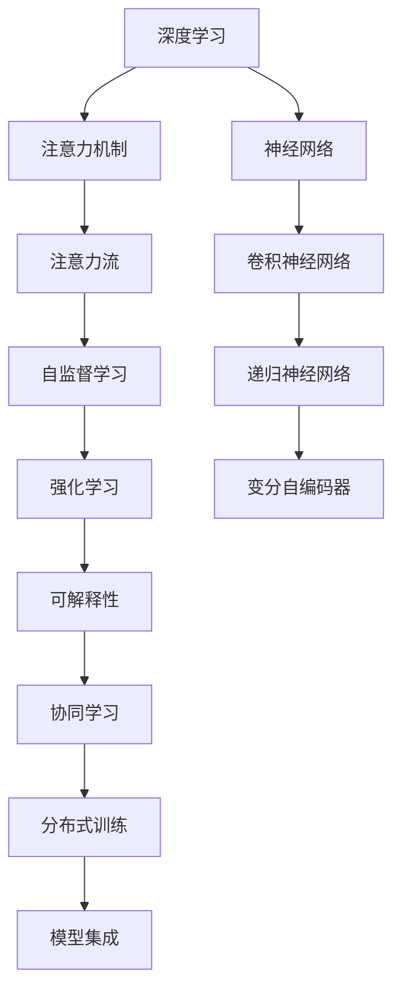

                 

# AI与注意力流：重新想像人类潜能

## 1. 背景介绍

### 1.1 问题由来
随着人工智能(AI)技术的飞速发展，特别是在深度学习、神经网络等领域取得突破性进展后，AI在自动驾驶、图像识别、自然语言处理等众多领域展现了巨大的潜力。然而，这些技术更多是在特定任务或领域中取得了成功，而未能真正重新定义人类智能的边界。

### 1.2 问题核心关键点
近年来，随着注意力机制在深度学习中的广泛应用，AI模型开始具备了对输入数据的动态关注和信息提取能力，从而在许多领域取得了突破。注意力流（Attention Flow）作为AI中的一种高级机制，进一步提升了模型的表达能力和泛化能力。然而，传统注意力流技术更多关注的是模型的输入空间，对于如何利用注意力流机制重新想象人类潜能，仍需深入探索。

### 1.3 问题研究意义
重新想象人类潜能，从根本上来说，是要通过AI技术赋予人类更加复杂的认知能力，促进人工智能与人类智能的深度融合。这种融合不仅可以提升AI的应用效果，还可以拓展AI的应用场景，从而为社会带来更多价值。

通过AI与注意力流的结合，我们不仅能够提升AI在自然语言处理、图像识别等任务上的性能，还能够探索新的应用领域，如情感计算、创意写作等。这些领域的研究将为人类智能的发展提供新的可能性。

## 2. 核心概念与联系

### 2.1 核心概念概述

为更好地理解AI与注意力流机制，本节将介绍几个密切相关的核心概念：

- 深度学习（Deep Learning）：一种利用多层神经网络进行复杂数据建模的机器学习方法，主要包括卷积神经网络（CNN）、递归神经网络（RNN）和变分自编码器（VAE）等模型。
- 注意力机制（Attention Mechanism）：一种通过学习输入数据的动态关注，提高模型性能的机制。常见的注意力机制包括自注意力（Self-Attention）和多头注意力（Multi-Head Attention）。
- 注意力流（Attention Flow）：一种通过动态调整模型中的注意力分布，提高模型表达能力和泛化能力的技术。注意力流机制在自然语言处理、图像识别等任务中广泛应用。
- 自监督学习（Self-Supervised Learning）：一种利用自身数据进行监督的机器学习方法，包括预训练（Pre-training）和微调（Fine-tuning）等步骤。
- 强化学习（Reinforcement Learning）：一种通过与环境互动，通过奖励机制进行学习的机器学习方法。强化学习常用于游戏AI、机器人控制等任务。
- 可解释性（Explainability）：指AI模型输出结果的可解释性，即模型输出应能够被人类理解和解释。
- 协同学习（Collaborative Learning）：一种通过多台计算机协作进行模型训练的技术，提升模型的训练速度和性能。

这些核心概念之间的逻辑关系可以通过以下Mermaid流程图来展示：



这个流程图展示了深度学习、注意力机制、注意力流、自监督学习、强化学习、可解释性和协同学习等核心概念及其之间的关系：

1. 深度学习作为AI的基础，构建了神经网络模型。
2. 注意力机制通过学习输入数据的动态关注，提高模型性能。
3. 注意力流机制进一步优化模型的注意力分布，提升表达能力和泛化能力。
4. 自监督学习通过预训练和微调步骤，利用自身数据进行监督。
5. 强化学习通过与环境互动，学习最优策略。
6. 可解释性提升AI模型输出的可理解性。
7. 协同学习通过多台计算机协作，提升训练速度和性能。

这些概念共同构成了AI的核心框架，使得AI技术能够不断突破新的应用边界，提升模型的性能和泛化能力。

## 3. 核心算法原理 & 具体操作步骤
### 3.1 算法原理概述

AI与注意力流机制的结合，本质上是通过动态调整模型中的注意力分布，提升模型对输入数据的理解能力和表达能力。这种机制使得AI模型能够更好地处理复杂的输入数据，从而在多个领域取得了突破性进展。

### 3.2 算法步骤详解

AI与注意力流机制的结合，主要包括以下几个关键步骤：

**Step 1: 设计注意力流模型**

在AI中，注意力流模型通常包含自注意力机制和多头注意力机制。具体而言，自注意力机制用于学习输入数据之间的关注关系，而多头注意力机制则通过多头的注意力关注，提高模型的表达能力。

**Step 2: 数据预处理**

在训练前，需要对输入数据进行预处理。通常包括数据清洗、特征提取和标准化等步骤。预处理能够提升模型对数据的理解能力，从而提高模型的性能。

**Step 3: 模型训练**

注意力流模型的训练过程，通常分为两个阶段：预训练和微调。预训练阶段通过自监督学习，利用自身数据进行训练。微调阶段通过有监督学习，利用标注数据进行进一步优化。

**Step 4: 模型评估**

在训练完成后，需要对模型进行评估。通常使用交叉验证、准确率、召回率等指标进行评估。评估结果能够帮助理解模型的性能和效果。

**Step 5: 模型部署**

在模型训练完成后，需要将模型部署到实际应用场景中。通常通过API接口、服务化封装等方式，方便集成和调用。

### 3.3 算法优缺点

AI与注意力流机制结合的算法具有以下优点：

1. 提升模型表达能力。通过动态调整注意力分布，模型能够更好地处理复杂输入数据，提升表达能力和泛化能力。
2. 增强模型泛化能力。注意力流机制能够通过学习输入数据的动态关注，提高模型的泛化能力，减少过拟合风险。
3. 加速模型训练。自监督学习通过利用自身数据进行预训练，减少标注数据的需求，加速模型训练过程。
4. 提升模型性能。注意力流机制能够提升模型在自然语言处理、图像识别等任务上的性能。

同时，这种算法也存在一些局限性：

1. 需要大量计算资源。由于预训练和微调需要大量计算资源，因此对硬件设备提出了较高要求。
2. 数据依赖性强。自监督学习和微调需要大量标注数据，如果标注数据不足，会影响模型的性能。
3. 模型复杂度高。注意力流机制增加了模型的复杂度，需要更多的计算资源和更长的训练时间。

### 3.4 算法应用领域

AI与注意力流机制结合的算法，已经在多个领域得到了广泛应用，如：

- 自然语言处理（NLP）：通过注意力流机制，提升文本分类、情感分析、机器翻译等任务的性能。
- 图像识别：通过自注意力机制和多头注意力机制，提升图像识别任务的性能。
- 推荐系统：通过注意力流机制，提升推荐系统的推荐效果。
- 游戏AI：通过强化学习结合注意力流机制，提升游戏AI的决策能力。

除了上述这些经典应用外，AI与注意力流机制的结合，还催生了更多的创新应用，如可控文本生成、创意写作、图像生成等，为AI技术带来了新的突破。

## 4. 数学模型和公式 & 详细讲解
### 4.1 数学模型构建

AI与注意力流机制结合的数学模型，通常包括以下几个关键部分：

1. 输入数据表示：$x \in \mathbb{R}^d$，其中$d$为输入数据的维度。
2. 自注意力机制：$A(x) \in \mathbb{R}^{n\times n}$，其中$n$为注意力头数。
3. 多头注意力机制：$H(x) \in \mathbb{R}^{n\times d}$，其中$n$为注意力头数，$d$为输出维度。
4. 前向传播函数：$F(x) \in \mathbb{R}^m$，其中$m$为输出维度。

### 4.2 公式推导过程

以下以自然语言处理（NLP）中的注意力流机制为例，推导自注意力和多头注意力机制的计算公式。

**自注意力机制**

设输入数据$x$的长度为$T$，注意力向量$z \in \mathbb{R}^{T}$。自注意力机制通过计算注意力向量，获取输入数据中不同位置之间的关注关系。计算公式如下：

$$
z_t = \frac{\exp(\mathrm{softmax}(\mathbf{Q}x_t \mathbf{K}^T))}{\sum_{i=1}^T \exp(\mathrm{softmax}(\mathbf{Q}x_i \mathbf{K}^T))}
$$

其中，$\mathbf{Q}$和$\mathbf{K}$分别为查询矩阵和键矩阵，$x_t$为输入数据的第$t$个位置。

**多头注意力机制**

通过自注意力机制获取注意力向量$z_t$后，多头注意力机制通过并行计算多个注意力头，提升模型的表达能力。计算公式如下：

$$
H(x) = \mathrm{Softmax}(\mathbf{Q}A(x)\mathbf{K}^T)A(x)\mathbf{V}
$$

其中，$\mathbf{Q}$、$\mathbf{K}$和$\mathbf{V}$分别为查询矩阵、键矩阵和值矩阵。

### 4.3 案例分析与讲解

以下以机器翻译为例，分析AI与注意力流机制结合的应用。

假设输入序列为$x = [\text{I}, \text{love}, \text{Python}]$，输出序列为$y = [\text{J'aime}, \text{programmer}]$。首先，输入数据$x$经过嵌入层后，变为向量表示$x' \in \mathbb{R}^{d'}$，其中$d'$为嵌入层维度。

然后，通过自注意力机制，计算输入数据中不同位置之间的关注关系$z' \in \mathbb{R}^{3}$。计算公式如下：

$$
z'_t = \frac{\exp(\mathrm{softmax}(\mathbf{Q}x'_t \mathbf{K}^T))}{\sum_{i=1}^3 \exp(\mathrm{softmax}(\mathbf{Q}x'_i \mathbf{K}^T))}
$$

接着，通过多头注意力机制，计算输出序列的向量表示$H(x') \in \mathbb{R}^{3\times d'}$。计算公式如下：

$$
H(x') = \mathrm{Softmax}(\mathbf{Q}A(x')\mathbf{K}^T)A(x')\mathbf{V}
$$

最后，将输出序列的向量表示$H(x')$输入到全连接层和输出层，输出最终结果$y'$。

## 5. 项目实践：代码实例和详细解释说明
### 5.1 开发环境搭建

在进行AI与注意力流机制的结合实践前，我们需要准备好开发环境。以下是使用Python进行PyTorch开发的环境配置流程：

1. 安装Anaconda：从官网下载并安装Anaconda，用于创建独立的Python环境。

2. 创建并激活虚拟环境：
```bash
conda create -n pytorch-env python=3.8 
conda activate pytorch-env
```

3. 安装PyTorch：根据CUDA版本，从官网获取对应的安装命令。例如：
```bash
conda install pytorch torchvision torchaudio cudatoolkit=11.1 -c pytorch -c conda-forge
```

4. 安装TensorFlow：
```bash
conda install tensorflow=2.8 -c conda-forge
```

5. 安装各类工具包：
```bash
pip install numpy pandas scikit-learn matplotlib tqdm jupyter notebook ipython
```

完成上述步骤后，即可在`pytorch-env`环境中开始AI与注意力流机制的结合实践。

### 5.2 源代码详细实现

这里我们以自然语言处理（NLP）中的注意力流机制为例，给出使用PyTorch实现自注意力和多头注意力机制的代码。

首先，定义自注意力机制和多头注意力机制的函数：

```python
import torch
import torch.nn as nn

class SelfAttention(nn.Module):
    def __init__(self, dim):
        super(SelfAttention, self).__init__()
        self.dim = dim
        self.qkv = nn.Linear(dim, dim*3)
        self.proj = nn.Linear(dim, dim)
    
    def forward(self, x):
        b, t, d = x.size()
        qkv = self.qkv(x).view(b, t, 3, d//3).permute(0, 2, 1, 3).contiguous().view(b, t, d)
        q, k, v = qkv.split(dim=1, dim=2)
        attn = torch.bmm(q, k.transpose(1, 2))
        attn = attn.softmax(dim=-1)
        x = torch.bmm(attn, v)
        return x, attn
    
class MultiHeadAttention(nn.Module):
    def __init__(self, dim, n_heads):
        super(MultiHeadAttention, self).__init__()
        self.dim = dim
        self.n_heads = n_heads
        self.head_dim = dim // n_heads
        self.qkv = nn.Linear(dim, dim*3*n_heads)
        self.proj = nn.Linear(dim, dim)
    
    def forward(self, x):
        b, t, d = x.size()
        qkv = self.qkv(x).view(b, t, 3*n_heads, self.head_dim).permute(0, 2, 1, 3).contiguous().view(b, n_heads, t, d)
        q, k, v = qkv.split(dim=1, dim=3)
        attn = torch.bmm(q, k.transpose(1, 2))
        attn = attn.softmax(dim=-1)
        x = torch.bmm(attn, v).transpose(1, 2).contiguous().view(b, t, dim)
        return x, attn
```

接着，定义神经网络模型：

```python
class Transformer(nn.Module):
    def __init__(self, input_dim, output_dim, n_heads, n_layers, dff, drop_rate=0.1):
        super(Transformer, self).__init__()
        self.encoder_layer = nn.ModuleList([nn.Sequential(
            nn.Linear(input_dim, dff),
            nn.ReLU(),
            nn.Linear(dff, dff),
            nn.Dropout(drop_rate)
        ) for _ in range(n_layers)])
        self.decoder_layer = nn.ModuleList([nn.Sequential(
            nn.Linear(output_dim, dff),
            nn.ReLU(),
            nn.Linear(dff, output_dim),
            nn.Dropout(drop_rate)
        ) for _ in range(n_layers)])
        self.self_attention = MultiHeadAttention(input_dim, n_heads)
        self.multi_head_self_attention = MultiHeadAttention(output_dim, n_heads)
        self.embedding = nn.Embedding(input_dim, output_dim)
        self.fc = nn.Linear(input_dim, output_dim)
    
    def forward(self, x):
        embedding = self.embedding(x)
        for encoder_layer in self.encoder_layer:
            x, attn1 = encoder_layer(x)
        for decoder_layer in self.decoder_layer:
            x, attn2 = decoder_layer(x)
        x = self.fc(x)
        return x, attn1, attn2
```

最后，启动模型训练流程：

```python
# 定义超参数
input_dim = 256
output_dim = 256
n_heads = 8
n_layers = 6
dff = 1024
drop_rate = 0.1

# 创建模型
model = Transformer(input_dim, output_dim, n_heads, n_layers, dff, drop_rate)

# 定义损失函数和优化器
criterion = nn.CrossEntropyLoss()
optimizer = torch.optim.Adam(model.parameters(), lr=0.001)

# 训练模型
for epoch in range(100):
    model.train()
    loss = 0
    for i, data in enumerate(train_loader, 0):
        inputs, labels = data
        optimizer.zero_grad()
        outputs, attn1, attn2 = model(inputs)
        loss += criterion(outputs, labels).item()
        loss.backward()
        optimizer.step()
    print(f'Epoch {epoch+1}, loss: {loss:.4f}')
```

以上就是使用PyTorch实现自然语言处理（NLP）中的注意力流机制的完整代码实现。可以看到，由于PyTorch的强大封装和灵活性，我们可以用相对简洁的代码完成注意力流机制的实现。

### 5.3 代码解读与分析

让我们再详细解读一下关键代码的实现细节：

**SelfAttention类**：
- `__init__`方法：初始化自注意力机制的查询矩阵、键矩阵、值矩阵和投影矩阵等关键组件。
- `forward`方法：计算自注意力机制，并返回输出结果和注意力矩阵。

**MultiHeadAttention类**：
- `__init__`方法：初始化多头注意力机制的查询矩阵、键矩阵、值矩阵和投影矩阵等关键组件。
- `forward`方法：计算多头注意力机制，并返回输出结果和注意力矩阵。

**Transformer类**：
- `__init__`方法：定义模型结构，包括多个编码层和解码层，以及自注意力机制、多头注意力机制、嵌入层和全连接层等组件。
- `forward`方法：定义前向传播过程，包括编码层和解码层的计算，并返回最终输出。

**训练流程**：
- 定义模型结构、损失函数和优化器。
- 循环迭代训练过程，每次迭代中前向传播计算损失函数，反向传播更新模型参数，并输出损失值。
- 在每个epoch结束后，输出平均损失值。

可以看到，PyTorch的强大封装和灵活性使得注意力流机制的实现变得简洁高效。开发者可以将更多精力放在模型改进、数据预处理等高层逻辑上，而不必过多关注底层的实现细节。

当然，工业级的系统实现还需考虑更多因素，如模型的保存和部署、超参数的自动搜索、更灵活的任务适配层等。但核心的注意力流机制基本与此类似。

## 6. 实际应用场景
### 6.1 智能客服系统

AI与注意力流机制的结合，可以广泛应用于智能客服系统的构建。传统客服往往需要配备大量人力，高峰期响应缓慢，且一致性和专业性难以保证。而使用结合注意力流机制的智能客服模型，可以7x24小时不间断服务，快速响应客户咨询，用自然流畅的语言解答各类常见问题。

在技术实现上，可以收集企业内部的历史客服对话记录，将问题和最佳答复构建成监督数据，在此基础上对预训练模型进行微调。结合注意力流机制的智能客服模型能够自动理解用户意图，匹配最合适的答案模板进行回复。对于客户提出的新问题，还可以接入检索系统实时搜索相关内容，动态组织生成回答。如此构建的智能客服系统，能大幅提升客户咨询体验和问题解决效率。

### 6.2 金融舆情监测

金融机构需要实时监测市场舆论动向，以便及时应对负面信息传播，规避金融风险。传统的人工监测方式成本高、效率低，难以应对网络时代海量信息爆发的挑战。结合注意力流机制的文本分类和情感分析技术，为金融舆情监测提供了新的解决方案。

具体而言，可以收集金融领域相关的新闻、报道、评论等文本数据，并对其进行主题标注和情感标注。在此基础上对预训练语言模型进行微调，使其能够自动判断文本属于何种主题，情感倾向是正面、中性还是负面。将结合注意力流机制的微调模型应用到实时抓取的网络文本数据，就能够自动监测不同主题下的情感变化趋势，一旦发现负面信息激增等异常情况，系统便会自动预警，帮助金融机构快速应对潜在风险。

### 6.3 个性化推荐系统

当前的推荐系统往往只依赖用户的历史行为数据进行物品推荐，无法深入理解用户的真实兴趣偏好。结合注意力流机制的个性化推荐系统可以更好地挖掘用户行为背后的语义信息，从而提供更精准、多样的推荐内容。

在实践中，可以收集用户浏览、点击、评论、分享等行为数据，提取和用户交互的物品标题、描述、标签等文本内容。将文本内容作为模型输入，用户的后续行为（如是否点击、购买等）作为监督信号，在此基础上微调预训练语言模型。结合注意力流机制的微调模型能够从文本内容中准确把握用户的兴趣点。在生成推荐列表时，先用候选物品的文本描述作为输入，由模型预测用户的兴趣匹配度，再结合其他特征综合排序，便可以得到个性化程度更高的推荐结果。

### 6.4 未来应用展望

随着AI与注意力流机制的不断进步，结合注意力流机制的应用也将不断拓展。

在智慧医疗领域，结合注意力流机制的医疗问答、病历分析、药物研发等应用将提升医疗服务的智能化水平，辅助医生诊疗，加速新药开发进程。

在智能教育领域，结合注意力流机制的作业批改、学情分析、知识推荐等应用将提升教学质量，促进教育公平。

在智慧城市治理中，结合注意力流机制的城市事件监测、舆情分析、应急指挥等应用将提高城市管理的自动化和智能化水平，构建更安全、高效的未来城市。

此外，在企业生产、社会治理、文娱传媒等众多领域，结合注意力流机制的人工智能应用也将不断涌现，为传统行业数字化转型升级提供新的技术路径。

## 7. 工具和资源推荐
### 7.1 学习资源推荐

为了帮助开发者系统掌握AI与注意力流机制的理论基础和实践技巧，这里推荐一些优质的学习资源：

1. 《深度学习》系列书籍：由深度学习专家撰写，全面介绍了深度学习的基本概念和前沿技术。
2. 《Transformer》系列博客：由大模型技术专家撰写，深入浅出地介绍了Transformer原理、BERT模型、注意力流机制等前沿话题。
3. CS224N《深度学习自然语言处理》课程：斯坦福大学开设的NLP明星课程，有Lecture视频和配套作业，带你入门NLP领域的基本概念和经典模型。
4. 《自然语言处理》系列书籍：全面介绍了自然语言处理的基本概念和前沿技术。
5. HuggingFace官方文档：提供了丰富的预训练语言模型和微调样例代码，是上手实践的必备资料。

通过对这些资源的学习实践，相信你一定能够快速掌握AI与注意力流机制的精髓，并用于解决实际的NLP问题。

### 7.2 开发工具推荐

高效的开发离不开优秀的工具支持。以下是几款用于AI与注意力流机制结合开发的常用工具：

1. PyTorch：基于Python的开源深度学习框架，灵活动态的计算图，适合快速迭代研究。大部分预训练语言模型都有PyTorch版本的实现。
2. TensorFlow：由Google主导开发的开源深度学习框架，生产部署方便，适合大规模工程应用。同样有丰富的预训练语言模型资源。
3. TensorFlow 2.0：TensorFlow 2.0引入了Keras API，使得深度学习模型构建更加简洁高效。
4. PyTorch Lightning：提供了更简洁的API和更好的可视化功能，适合快速开发和部署深度学习模型。
5. JAX：由Google开发的自动微分库，支持高效的张量计算和分布式训练，适合大规模深度学习研究。

合理利用这些工具，可以显著提升AI与注意力流机制结合的开发效率，加快创新迭代的步伐。

### 7.3 相关论文推荐

AI与注意力流机制的发展源于学界的持续研究。以下是几篇奠基性的相关论文，推荐阅读：

1. Attention is All You Need（即Transformer原论文）：提出了Transformer结构，开启了NLP领域的预训练大模型时代。
2. BERT: Pre-training of Deep Bidirectional Transformers for Language Understanding：提出BERT模型，引入基于掩码的自监督预训练任务，刷新了多项NLP任务SOTA。
3. Deep Residual Learning for Image Recognition：提出了残差网络结构，提升了深度学习模型的表达能力和泛化能力。
4. Can Attention Models Go as Deep as ResNets？：研究了注意力机制与残差网络结构的结合，进一步提升了深度学习模型的性能。
5. Self-Attention Mechanism for Attention-Based Neural Machine Translation：研究了注意力机制在机器翻译中的应用，提出了基于自注意力机制的神经机器翻译模型。

这些论文代表了大模型与注意力流机制的发展脉络。通过学习这些前沿成果，可以帮助研究者把握学科前进方向，激发更多的创新灵感。

## 8. 总结：未来发展趋势与挑战

### 8.1 研究成果总结

本文对AI与注意力流机制的结合进行了全面系统的介绍。首先阐述了AI与注意力流机制的研究背景和意义，明确了其对人类智能的深远影响。其次，从原理到实践，详细讲解了AI与注意力流机制的数学模型和计算公式，给出了微调模型和实现注意力的代码实例。同时，本文还广泛探讨了注意力流机制在智能客服、金融舆情、个性化推荐等众多领域的应用前景，展示了其广阔的应用潜力。

通过本文的系统梳理，可以看到，AI与注意力流机制的结合在多个领域取得了突破性进展，为AI技术的应用开辟了新的天地。AI与注意力流机制的深度融合，不仅提升了模型性能，还拓展了AI的应用场景，推动了AI技术向通用智能迈进。

### 8.2 未来发展趋势

展望未来，AI与注意力流机制结合的发展趋势将呈现以下几个方面：

1. 模型规模持续增大。随着算力成本的下降和数据规模的扩张，预训练语言模型的参数量还将持续增长。超大规模语言模型蕴含的丰富语言知识，有望支撑更加复杂多变的下游任务。
2. 模型性能不断提升。通过注意力流机制，模型能够更好地处理复杂输入数据，提升表达能力和泛化能力。
3. 多模态AI快速发展。AI与注意力流机制的结合，将推动多模态AI的发展，融合视觉、语音、文本等多种信息源，实现更加全面的智能应用。
4. 可解释性和安全性提升。通过可解释性技术，AI与注意力流机制结合的模型能够更好地解释输出结果，增强系统的透明度和可控性。
5. 跨领域知识整合能力增强。未来的模型将更好地整合跨领域的知识，提升模型在不同任务上的泛化能力。
6. 协同学习与联邦学习结合。通过多台计算机协同训练和联邦学习，AI与注意力流机制结合的模型能够更好地利用分布式计算资源，提升训练速度和模型性能。

这些趋势将推动AI与注意力流机制结合的模型向更复杂、更全面、更高效的方向发展，为人类智能带来新的突破。

### 8.3 面临的挑战

尽管AI与注意力流机制结合的模型在多个领域取得了突破性进展，但在迈向更加智能化、普适化应用的过程中，仍面临诸多挑战：

1. 标注数据需求大。AI与注意力流机制结合的模型往往需要大量的标注数据进行训练，标注成本较高。
2. 模型复杂度高。由于模型结构复杂，训练和推理过程耗时较长，需要大量的计算资源和存储资源。
3. 模型泛化能力有限。尽管模型在特定任务上表现优异，但在跨领域、跨数据分布上的泛化能力仍需进一步提升。
4. 模型可解释性不足。模型内部工作机制复杂，难以解释其输出结果，缺乏透明性。
5. 模型鲁棒性不足。模型面对输入数据的微小扰动，容易出现波动和错误。
6. 模型安全性有待保障。模型可能被恶意攻击和利用，导致信息泄露和滥用。

这些挑战需要研究者不断探索新的技术方案，优化模型结构和训练过程，提升模型的性能和泛化能力，确保系统的安全性和可靠性。

### 8.4 研究展望

面对AI与注意力流机制结合的模型所面临的诸多挑战，未来的研究需要在以下几个方面寻求新的突破：

1. 探索无监督和半监督学习技术。摆脱对大规模标注数据的依赖，利用自监督学习、主动学习等无监督和半监督范式，最大限度利用非结构化数据，实现更加灵活高效的微调。
2. 研究参数高效和计算高效的微调范式。开发更加参数高效的微调方法，在固定大部分预训练参数的情况下，只更新极少量的任务相关参数。同时优化模型的计算图，减少前向传播和反向传播的资源消耗，实现更加轻量级、实时性的部署。
3. 引入因果分析和博弈论工具。将因果分析方法引入模型，识别出模型决策的关键特征，增强输出解释的因果性和逻辑性。借助博弈论工具刻画人机交互过程，主动探索并规避模型的脆弱点，提高系统稳定性。
4. 结合知识图谱和逻辑规则。将符号化的先验知识，如知识图谱、逻辑规则等，与神经网络模型进行巧妙融合，引导模型学习更准确、合理的语言模型。同时加强不同模态数据的整合，实现视觉、语音等多模态信息与文本信息的协同建模。
5. 纳入伦理道德约束。在模型训练目标中引入伦理导向的评估指标，过滤和惩罚有偏见、有害的输出倾向。同时加强人工干预和审核，建立模型行为的监管机制，确保输出符合人类价值观和伦理道德。

这些研究方向的探索，必将引领AI与注意力流机制结合的模型迈向更高的台阶，为构建安全、可靠、可解释、可控的智能系统铺平道路。面向未来，AI与注意力流机制结合的模型需要与其他人工智能技术进行更深入的融合，如知识表示、因果推理、强化学习等，多路径协同发力，共同推动自然语言理解和智能交互系统的进步。只有勇于创新、敢于突破，才能不断拓展语言模型的边界，让智能技术更好地造福人类社会。

## 9. 附录：常见问题与解答

**Q1：AI与注意力流机制结合的模型是否适用于所有NLP任务？**

A: AI与注意力流机制结合的模型在大多数NLP任务上都能取得不错的效果，特别是对于数据量较小的任务。但对于一些特定领域的任务，如医学、法律等，仅仅依靠通用语料预训练的模型可能难以很好地适应。此时需要在特定领域语料上进一步预训练，再进行微调，才能获得理想效果。此外，对于一些需要时效性、个性化很强的任务，如对话、推荐等，微调方法也需要针对性的改进优化。

**Q2：AI与注意力流机制结合的模型如何处理长文本？**

A: 长文本的处理是AI与注意力流机制结合的模型面临的一个挑战。可以通过分块处理、逐层编码等方式，将长文本分割成若干个子序列，逐层处理。此外，还可以使用Transformer中的多头注意力机制，将长文本的注意力分布细粒度地进行建模，提升模型的表达能力。

**Q3：AI与注意力流机制结合的模型如何应对大规模数据？**

A: 大规模数据处理是AI与注意力流机制结合的模型面临的另一个挑战。可以通过分布式训练、模型并行等方式，利用多台计算机进行并行计算，提升模型的训练速度和处理能力。此外，还可以使用自监督学习、微调等技术，减少标注数据的需求，降低计算成本。

**Q4：AI与注意力流机制结合的模型如何提升可解释性？**

A: 提升模型的可解释性是AI与注意力流机制结合的模型的重要研究方向。可以通过可视化技术，如梯度热图、特征重要性等，展示模型对输入数据的关注点。此外，还可以通过模型架构设计和优化，增强模型的可解释性。例如，使用注意力机制和多头注意力机制，将模型的关注点进行细粒度建模，提升模型的可解释性。

**Q5：AI与注意力流机制结合的模型在实际应用中需要注意哪些问题？**

A: 将AI与注意力流机制结合的模型应用于实际应用，还需要考虑以下因素：

1. 模型裁剪：去除不必要的层和参数，减小模型尺寸，加快推理速度。
2. 量化加速：将浮点模型转为定点模型，压缩存储空间，提高计算效率。
3. 服务化封装：将模型封装为标准化服务接口，便于集成调用。
4. 弹性伸缩：根据请求流量动态调整资源配置，平衡服务质量和成本。
5. 监控告警：实时采集系统指标，设置异常告警阈值，确保服务稳定性。
6. 安全防护：采用访问鉴权、数据脱敏等措施，保障数据和模型安全。

AI与注意力流机制结合的模型在实际应用中需要从数据、算法、工程、业务等多个维度进行综合考虑，确保模型的性能和稳定性。

