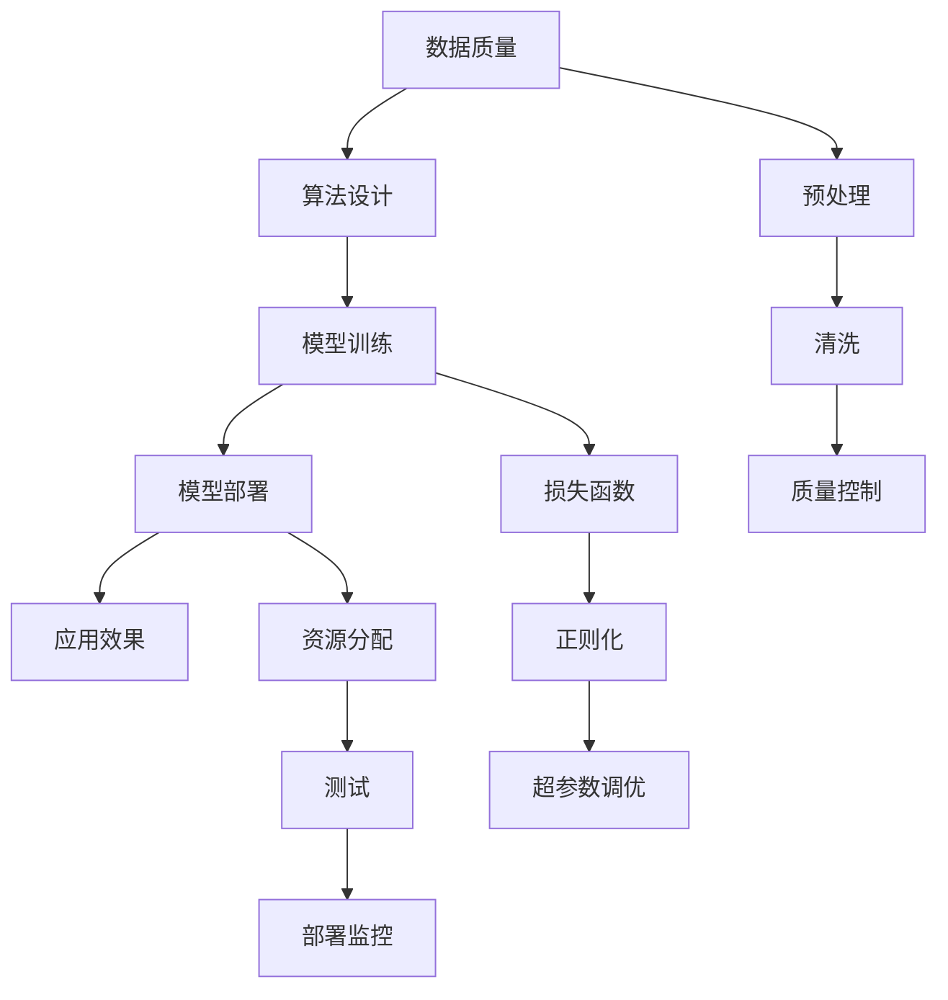

                 

## 1. 背景介绍

在人工智能（AI）技术迅猛发展的今天，AI伦理困境已经成为社会广泛关注的焦点。如何确保AI提供的信息准确性和可靠性，成为了决定AI发展方向的关键问题。本文将深入探讨AI信息准确性和可靠性的问题，分析其在当前社会中的挑战和影响，并提出一些可能的解决策略。

### 1.1 问题由来
随着深度学习和大数据技术的应用，AI在图像识别、语音识别、自然语言处理等领域取得了显著进展。AI系统的广泛应用不仅带来了生产效率的提升，也为许多社会问题提供了新的解决方案。然而，这些系统在运行过程中，由于数据的偏见、模型的缺陷、算法的漏洞等因素，可能导致错误的信息输出。这不仅影响了用户的决策，也可能对社会稳定和公共利益产生负面影响。

### 1.2 问题核心关键点
确保AI信息准确性和可靠性是一个多维度、多层次的问题，涉及数据质量、算法设计、模型训练、应用部署等多个环节。主要包括以下几个方面：
- **数据质量**：AI系统的输入数据往往需要经过预处理和清洗，以保证数据的质量和一致性。
- **算法设计**：算法的设计和实现是否合理，直接决定了AI系统的输出质量。
- **模型训练**：模型在训练过程中是否考虑到了各种边缘情况，是否存在过拟合等问题。
- **应用部署**：模型在实际应用中的表现是否稳定可靠，是否存在安全漏洞。

## 2. 核心概念与联系

### 2.1 核心概念概述

为更好地理解AI信息准确性和可靠性问题，本节将介绍几个关键概念：

- **数据质量**：指数据在采集、存储、处理、传输等各个环节中，是否存在缺失、噪声、错误等质量问题。
- **算法设计**：指AI系统在设计和实现过程中，是否遵循了良好的编程规范、是否考虑了算法的鲁棒性和可解释性。
- **模型训练**：指模型在训练过程中，是否使用合适的损失函数、是否进行了正则化处理、是否进行了超参数调优等。
- **模型部署**：指模型在实际应用中，是否进行了合理的资源分配、是否进行了充分的测试、是否存在安全漏洞等。

这些核心概念之间的逻辑关系可以通过以下Mermaid流程图来展示：



这个流程图展示了一系列AI系统从数据输入到模型输出的完整流程，以及各个环节对信息准确性和可靠性的影响。

## 3. 核心算法原理 & 具体操作步骤

### 3.1 算法原理概述

确保AI信息准确性和可靠性的核心思想是构建一个鲁棒、可解释、可控的AI系统。这个系统需要在各个环节上，对数据进行严格的质量控制，对算法进行合理的设计和实现，对模型进行科学的训练，并在部署过程中进行充分的测试和监控。

### 3.2 算法步骤详解

构建一个鲁棒、可解释、可控的AI系统，一般包括以下几个关键步骤：

**Step 1: 数据预处理与质量控制**
- 收集原始数据，进行清洗、去重、格式化等预处理操作。
- 对数据进行质量控制，确保数据的一致性、完整性、准确性。

**Step 2: 算法设计与实现**
- 选择合适的算法模型，进行科学的设计和实现。
- 遵循良好的编程规范，保证算法的可读性、可维护性。
- 对算法进行鲁棒性测试，确保其在不同场景下的表现稳定。

**Step 3: 模型训练与验证**
- 选择合适的损失函数，设计合适的优化器，进行模型的训练。
- 对模型进行正则化处理，防止过拟合。
- 进行超参数调优，找到最优的模型参数。

**Step 4: 模型部署与监控**
- 选择合适的部署平台，进行模型的部署。
- 进行充分的测试，确保模型在实际应用中的表现可靠。
- 对模型进行持续监控，及时发现和修复漏洞。

### 3.3 算法优缺点

确保AI信息准确性和可靠性的算法具有以下优点：
- **鲁棒性强**：通过严格的质量控制和鲁棒性测试，确保算法在不同场景下的表现稳定。
- **可解释性强**：通过可解释性算法设计和输出解释，增强用户对AI系统的信任。
- **可控性好**：通过合理的模型训练和超参数调优，确保模型的性能可控。

同时，这些算法也存在一定的局限性：
- **成本高**：高质量的数据和复杂的算法设计、训练过程需要投入大量的人力和物力。
- **复杂度高**：算法的鲁棒性、可解释性和可控性设计，往往需要复杂的工程实现。

### 3.4 算法应用领域

确保AI信息准确性和可靠性的算法在多个领域中得到了广泛应用，例如：

- **医疗健康**：AI在医疗影像、基因分析等领域的广泛应用，需要确保信息准确性和可靠性，以避免误诊和漏诊。
- **金融领域**：AI在风险评估、信用评分等方面的应用，需要确保信息的准确性和可靠性，以防止金融风险。
- **交通管理**：AI在交通流量预测、智能交通管理等方面的应用，需要确保信息的准确性和可靠性，以提高交通效率。
- **智能制造**：AI在智能制造、质量检测等方面的应用，需要确保信息的准确性和可靠性，以提高生产效率和产品质量。

## 4. 数学模型和公式 & 详细讲解 & 举例说明

### 4.1 数学模型构建

确保AI信息准确性和可靠性的数学模型，通常基于统计学、概率论等理论，构建模型输入、输出和损失函数的数学关系。

假设AI系统的输入为 $x$，输出为 $y$，损失函数为 $\mathcal{L}$，则期望的数学模型为：

$$
y = f(x; \theta)
$$

其中，$f(\cdot)$ 为模型函数，$\theta$ 为模型参数。

### 4.2 公式推导过程

以下我们以一个简单的回归任务为例，推导模型的损失函数及其梯度计算公式。

假设模型函数为线性回归模型 $y = \mathbf{w}^T \mathbf{x} + b$，其中 $\mathbf{w}$ 为权重向量，$\mathbf{x}$ 为输入向量，$b$ 为偏置项。模型损失函数为均方误差损失：

$$
\mathcal{L}(\mathbf{w}, b) = \frac{1}{N}\sum_{i=1}^N (y_i - \mathbf{w}^T \mathbf{x}_i - b)^2
$$

将损失函数对 $\mathbf{w}$ 和 $b$ 分别求导，得到梯度公式：

$$
\frac{\partial \mathcal{L}}{\partial \mathbf{w}} = -2 \frac{1}{N}\sum_{i=1}^N (y_i - \mathbf{w}^T \mathbf{x}_i - b)\mathbf{x}_i
$$

$$
\frac{\partial \mathcal{L}}{\partial b} = -2 \frac{1}{N}\sum_{i=1}^N (y_i - \mathbf{w}^T \mathbf{x}_i - b)
$$

### 4.3 案例分析与讲解

**案例分析：**
假设一个AI系统用于预测房价，输入为房屋特征（如面积、地理位置等），输出为房价。我们需要确保该系统的信息准确性和可靠性。

**讲解：**
1. **数据预处理**：收集历史房价数据，进行清洗、去重、格式化等预处理操作，确保数据质量。
2. **算法设计**：选择线性回归模型，进行科学的设计和实现。
3. **模型训练**：选择合适的损失函数（均方误差损失），进行模型的训练，并进行正则化处理（如L2正则），防止过拟合。
4. **模型部署**：选择合适的部署平台，进行模型的部署，并进行充分的测试，确保模型在实际应用中的表现可靠。
5. **模型监控**：对模型进行持续监控，及时发现和修复漏洞，确保信息准确性和可靠性。

## 5. 项目实践：代码实例和详细解释说明

### 5.1 开发环境搭建

在进行项目实践前，我们需要准备好开发环境。以下是使用Python进行Scikit-learn开发的环境配置流程：

1. 安装Anaconda：从官网下载并安装Anaconda，用于创建独立的Python环境。

2. 创建并激活虚拟环境：
```bash
conda create -n sklearn-env python=3.8 
conda activate sklearn-env
```

3. 安装Scikit-learn：
```bash
conda install scikit-learn
```

4. 安装其他必要的库：
```bash
pip install numpy pandas matplotlib tqdm jupyter notebook ipython
```

完成上述步骤后，即可在`sklearn-env`环境中开始项目实践。

### 5.2 源代码详细实现

我们以一个简单的线性回归模型为例，演示数据预处理、算法设计和模型训练的过程。

首先，导入必要的库：

```python
import numpy as np
from sklearn.model_selection import train_test_split
from sklearn.linear_model import LinearRegression
from sklearn.metrics import mean_squared_error
from sklearn.preprocessing import StandardScaler
```

然后，加载和预处理数据：

```python
# 假设我们有一组房屋特征数据，包括面积、地理位置等
X = np.array([[10, 5], [15, 3], [8, 4], [12, 6]])
y = np.array([300000, 200000, 180000, 250000])

# 将数据划分为训练集和测试集
X_train, X_test, y_train, y_test = train_test_split(X, y, test_size=0.2, random_state=42)

# 对数据进行标准化处理
scaler = StandardScaler()
X_train = scaler.fit_transform(X_train)
X_test = scaler.transform(X_test)
```

接着，构建线性回归模型并进行训练：

```python
# 构建线性回归模型
model = LinearRegression()

# 训练模型
model.fit(X_train, y_train)
```

最后，进行模型评估：

```python
# 对模型进行评估
y_pred = model.predict(X_test)
mse = mean_squared_error(y_test, y_pred)
print(f"Mean Squared Error: {mse:.2f}")
```

### 5.3 代码解读与分析

让我们再详细解读一下关键代码的实现细节：

**导入必要的库**：
- `numpy`：用于数据处理和计算
- `sklearn.model_selection`：用于数据划分
- `sklearn.linear_model`：用于线性回归模型的实现
- `sklearn.metrics`：用于模型评估
- `sklearn.preprocessing`：用于数据标准化

**加载和预处理数据**：
- 通过`np.array`创建输入特征`X`和目标变量`y`的NumPy数组。
- 使用`train_test_split`将数据划分为训练集和测试集，并设置随机种子，确保结果可复现。
- 使用`StandardScaler`对数据进行标准化处理，以提高模型的训练效果。

**构建线性回归模型并进行训练**：
- 使用`LinearRegression`类创建线性回归模型对象。
- 使用`fit`方法对模型进行训练，传入训练集数据`X_train`和`y_train`。

**进行模型评估**：
- 使用`predict`方法对测试集进行预测，得到预测值`y_pred`。
- 使用`mean_squared_error`计算均方误差，评估模型的预测效果。

可以看到，Scikit-learn库使得线性回归模型的构建和训练过程变得简单高效。开发者可以将更多精力放在数据处理和模型调参等高层逻辑上，而不必过多关注底层的实现细节。

## 6. 实际应用场景

### 6.1 医疗健康

在医疗领域，AI系统广泛应用于疾病诊断、治疗方案推荐等方面。确保这些系统的信息准确性和可靠性，对于患者的健康和生命安全至关重要。

在实践中，可以通过收集大量的医疗数据，进行数据预处理、特征选择和模型训练，构建一个鲁棒、可解释、可控的AI诊断系统。通过持续监控和更新模型，确保其在实际应用中的表现稳定可靠，避免误诊和漏诊。

### 6.2 金融领域

在金融领域，AI系统用于风险评估、信用评分等。确保这些系统的信息准确性和可靠性，对于金融机构的稳定运行和客户权益保护具有重要意义。

在实践中，可以通过收集用户的历史交易数据和行为数据，进行数据预处理、特征选择和模型训练，构建一个鲁棒、可解释、可控的AI信用评分系统。通过持续监控和更新模型，确保其在实际应用中的表现稳定可靠，避免金融风险。

### 6.3 交通管理

在交通领域，AI系统用于交通流量预测、智能交通管理等方面。确保这些系统的信息准确性和可靠性，对于交通效率和安全具有重要意义。

在实践中，可以通过收集历史交通数据，进行数据预处理、特征选择和模型训练，构建一个鲁棒、可解释、可控的AI交通流量预测系统。通过持续监控和更新模型，确保其在实际应用中的表现稳定可靠，提高交通效率和安全。

### 6.4 智能制造

在智能制造领域，AI系统用于质量检测、生产优化等方面。确保这些系统的信息准确性和可靠性，对于提高生产效率和产品质量具有重要意义。

在实践中，可以通过收集历史生产数据，进行数据预处理、特征选择和模型训练，构建一个鲁棒、可解释、可控的AI质量检测系统。通过持续监控和更新模型，确保其在实际应用中的表现稳定可靠，提高生产效率和产品质量。

## 7. 工具和资源推荐

### 7.1 学习资源推荐

为了帮助开发者系统掌握AI信息准确性和可靠性的理论基础和实践技巧，这里推荐一些优质的学习资源：

1. 《机器学习实战》系列博文：由机器学习专家撰写，深入浅出地介绍了机器学习的基本概念和算法原理，适合入门学习。

2. 《深度学习》课程：斯坦福大学开设的深度学习课程，涵盖了深度学习的基本概念、算法原理和实践技巧，适合系统学习。

3. 《Python数据科学手册》：这本书介绍了Python在数据科学中的应用，包括数据处理、特征工程、模型训练等，适合实战练习。

4. Kaggle：数据科学竞赛平台，提供丰富的数据集和开源代码，适合实践练习和经验交流。

5. GitHub：开源代码托管平台，提供大量的机器学习和数据科学项目，适合学习和借鉴。

通过对这些资源的学习实践，相信你一定能够快速掌握AI信息准确性和可靠性的精髓，并用于解决实际的AI问题。

### 7.2 开发工具推荐

高效的开发离不开优秀的工具支持。以下是几款用于AI信息准确性和可靠性开发的常用工具：

1. Python：作为数据科学和机器学习的主流语言，Python具备丰富的库和框架，适合进行数据分析、模型训练和部署。

2. Scikit-learn：基于Python的机器学习库，提供了丰富的算法和工具，适合进行数据处理、特征工程、模型训练等。

3. TensorFlow：由Google主导开发的深度学习框架，支持分布式计算和GPU加速，适合进行大规模模型训练和部署。

4. PyTorch：基于Python的深度学习框架，支持动态图和GPU加速，适合进行深度学习模型的研究和开发。

5. Jupyter Notebook：交互式编程环境，支持代码块、输出和注释，适合进行实验和交流。

6. Weights & Biases：模型训练的实验跟踪工具，可以记录和可视化模型训练过程中的各项指标，方便对比和调优。

合理利用这些工具，可以显著提升AI信息准确性和可靠性的开发效率，加快创新迭代的步伐。

### 7.3 相关论文推荐

AI信息准确性和可靠性的研究源于学界的持续研究。以下是几篇奠基性的相关论文，推荐阅读：

1. 《线性回归与逻辑回归》：介绍了线性回归和逻辑回归的基本概念和算法原理，适合入门学习。

2. 《机器学习：实践指南》：介绍了机器学习的基本概念、算法原理和实践技巧，适合系统学习。

3. 《深度学习：构建神经网络》：介绍了深度学习的基本概念和算法原理，适合深入研究。

4. 《数据科学导论》：介绍了数据科学的基本概念、算法原理和实践技巧，适合系统学习。

5. 《大数据时代：机器学习的挑战与机遇》：介绍了大数据和机器学习的挑战与机遇，适合深入研究。

这些论文代表了大数据和机器学习领域的发展脉络。通过学习这些前沿成果，可以帮助研究者把握学科前进方向，激发更多的创新灵感。

## 8. 总结：未来发展趋势与挑战

### 8.1 总结

本文对AI信息准确性和可靠性的问题进行了全面系统的介绍。首先阐述了AI信息准确性和可靠性的研究背景和意义，明确了其在当前社会中的挑战和影响，并提出了一些可能的解决策略。

通过本文的系统梳理，可以看到，确保AI信息准确性和可靠性是一个复杂而系统的工程，需要在数据质量、算法设计、模型训练和应用部署等多个环节进行全面优化。AI信息准确性和可靠性的实现，需要学界和产业界的共同努力，才能真正落地应用。

### 8.2 未来发展趋势

展望未来，AI信息准确性和可靠性的发展趋势将呈现以下几个方面：

1. **自动化数据预处理**：随着自动化数据处理技术的进步，数据清洗、去重、格式化等预处理过程将更加自动化，减少人工干预，提高数据质量。

2. **深度学习算法优化**：深度学习算法的不断优化，将使得AI系统的准确性和可靠性进一步提升，如改进模型结构、优化超参数等。

3. **联邦学习应用**：联邦学习技术将使得数据分布式处理成为可能，避免了数据的集中存储和传输风险，同时保证了数据隐私和安全。

4. **模型解释和可控性增强**：通过引入可解释性算法和模型可控性技术，使得AI系统的决策过程更加透明和可控，增强用户信任。

5. **多模态数据融合**：将视觉、语音、文本等多模态数据进行融合，提升AI系统的信息准确性和可靠性。

以上趋势将推动AI信息准确性和可靠性技术的不断进步，为各行各业带来更大的价值。

### 8.3 面临的挑战

尽管AI信息准确性和可靠性的技术在不断进步，但在迈向更加智能化、普适化应用的过程中，仍面临诸多挑战：

1. **数据隐私和安全**：在数据收集和处理过程中，如何保护用户的隐私和安全，避免数据泄露和滥用，是一个重要的挑战。

2. **算法鲁棒性和稳定性**：在复杂多变的环境下，如何确保算法的鲁棒性和稳定性，避免模型过拟合和泛化能力不足，是一个重要的挑战。

3. **资源消耗和成本**：在处理大规模数据时，如何降低计算资源消耗和成本，是一个重要的挑战。

4. **模型可解释性和可控性**：在模型应用过程中，如何提高模型的可解释性和可控性，增强用户信任，是一个重要的挑战。

5. **技术标准化**：在AI技术普及过程中，如何建立统一的技术标准和规范，确保技术的兼容性和可扩展性，是一个重要的挑战。

这些挑战需要在技术、法律、伦理等多个层面进行综合应对，才能推动AI信息准确性和可靠性的技术不断进步。

### 8.4 研究展望

面对AI信息准确性和可靠性的诸多挑战，未来的研究需要在以下几个方面寻求新的突破：

1. **自动化数据预处理技术**：开发更加自动化、高效的数据预处理工具，减少人工干预，提高数据质量。

2. **深度学习算法优化**：深入研究深度学习算法的优化方法，如改进模型结构、优化超参数等，提升AI系统的准确性和可靠性。

3. **联邦学习应用**：深入研究联邦学习技术，确保数据分布式处理的同时，保护数据隐私和安全。

4. **模型解释和可控性增强**：开发更加可解释和可控的AI模型，提高模型的透明性和用户信任。

5. **多模态数据融合**：研究多模态数据融合技术，提升AI系统的信息准确性和可靠性。

这些研究方向的探索，必将推动AI信息准确性和可靠性的技术不断进步，为各行各业带来更大的价值。

## 9. 附录：常见问题与解答

**Q1：如何确保AI系统的数据质量？**

A: 确保AI系统的数据质量，需要从数据收集、清洗、去重、格式化等各个环节进行严格的质量控制。具体措施包括：

1. **数据收集**：确保数据来源可靠，避免数据采集过程中的失真和偏差。
2. **数据清洗**：对数据进行去重、去噪、填补缺失值等处理，确保数据的完整性和一致性。
3. **数据标准化**：对数据进行标准化处理，如数据归一化、特征缩放等，提高模型的训练效果。

**Q2：如何在AI系统中进行模型解释和可控性增强？**

A: 增强AI系统的模型解释和可控性，可以通过以下方法实现：

1. **模型可视化**：使用可视化工具，如Shap、LIME等，展示模型决策过程和特征重要性，增强模型的可解释性。
2. **模型可控性**：通过引入可控性算法，如LIME、SHAP等，增强模型的可控性和用户信任。
3. **规则嵌入**：将符号化的先验知识，如知识图谱、逻辑规则等，与神经网络模型进行融合，增强模型的可解释性和可控性。

**Q3：如何在AI系统中进行持续学习和模型更新？**

A: 持续学习和模型更新是确保AI系统长期可靠的关键措施，可以通过以下方法实现：

1. **在线学习**：利用在线学习算法，如增量学习、联邦学习等，使AI系统能够实时学习新数据和新知识。
2. **模型重构**：定期对AI系统进行模型重构，避免模型过时和泛化能力下降。
3. **监控和评估**：通过持续监控和评估模型性能，及时发现和修复漏洞，确保模型的稳定性和可靠性。

通过这些措施，可以确保AI系统的数据质量、模型解释和可控性，推动AI技术的持续发展和应用。

---

作者：禅与计算机程序设计艺术 / Zen and the Art of Computer Programming

