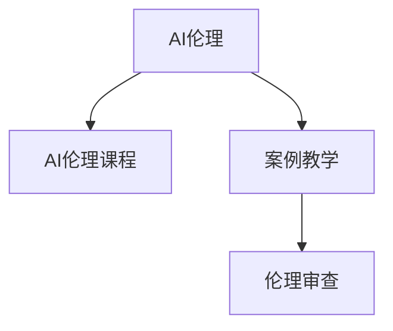

                 

# AI伦理的教育实践:伦理课程设置和案例教学

## 1. 背景介绍

### 1.1 问题由来
人工智能(AI)技术的迅猛发展，正在重塑各行各业的业务模式和人类社会的运作方式。AI系统的广泛应用，带来的不仅仅是效率提升和经济增长，更引发了一系列伦理、法律、社会等复杂问题。例如，自动驾驶可能导致交通事故责任归属不明；AI招聘系统可能加剧职场歧视；AI面部识别技术可能侵犯个人隐私；AI辅助医疗决策可能带来误诊风险等。这些问题凸显了AI伦理教育的重要性，需要在AI教育和训练中融入伦理考量，培养具备全面素养、伦理责任的AI从业者。

### 1.2 问题核心关键点
AI伦理教育的核心在于如何在AI技术培训中渗透伦理考量，培养AI从业者的伦理责任和伦理判断力。具体来说，包括以下几个关键点：

- **伦理课程设置**：在AI课程中加入伦理课程，系统教授AI伦理理论、原则和案例。
- **案例教学**：通过具体案例分析，使学生掌握伦理判断的实际应用，理解伦理问题的复杂性。
- **伦理决策训练**：提供模拟情境，让学生在虚拟环境中练习伦理决策，强化伦理实践能力。
- **伦理审查机制**：建立AI系统开发的伦理审查流程，确保AI系统符合伦理标准。

### 1.3 问题研究意义
AI伦理教育对于构建负责任的AI社会具有重要意义：

- **提升从业者素养**：通过伦理教育，提升AI从业者的伦理认知和伦理决策能力，推动AI技术的良性发展。
- **保障伦理规范**：在AI系统开发和应用中融入伦理考量，避免潜在的伦理风险。
- **推动社会共识**：通过教育普及，推动社会对AI伦理问题的广泛讨论和认知，形成共识，共同规范AI应用。
- **增强法律合规**：通过伦理教育，确保AI系统开发和应用符合相关法律法规，规避法律风险。

## 2. 核心概念与联系

### 2.1 核心概念概述

为更好地理解AI伦理教育的系统框架，本节将介绍几个关键概念：

- **AI伦理(Ethics in AI)**：指在AI技术和应用中融入伦理考量，确保AI系统设计、开发和应用过程中，遵循道德原则、社会责任和法律法规。
- **AI伦理课程(Ethics Courses in AI)**：在AI教育和培训中开设的专门课程，系统讲解AI伦理的理论、原则和实践。
- **案例教学(Case-Based Teaching)**：通过分析具体案例，使学生在实际情境中理解伦理问题的复杂性，掌握伦理判断和决策的能力。
- **伦理审查(Ethics Review)**：在AI系统开发和应用过程中，对AI系统的伦理合规性进行评估和审查，确保其符合伦理标准和法律法规。

这些核心概念之间的逻辑关系可以通过以下Mermaid流程图来展示：



这个流程图展示了大语言模型的核心概念及其之间的关系：

1. AI伦理教育从AI伦理概念出发，涉及课程设置和案例教学。
2. 课程设置旨在传授AI伦理知识，培养学生的伦理认知。
3. 案例教学通过实际情境的模拟，强化学生伦理判断和决策能力。
4. 伦理审查确保AI系统符合伦理标准，避免伦理风险。

这些概念共同构成了AI伦理教育的基础框架，通过系统的课程和教学方法，使学生能够具备全面、系统的伦理认知和决策能力。

## 3. 核心算法原理 & 具体操作步骤
### 3.1 算法原理概述

AI伦理教育的算法原理，主要围绕如何在AI教育中系统地传授伦理知识和培养伦理判断力。这包括两个核心步骤：

1. **伦理课程设计与教学**：将AI伦理理论、原则和案例融入AI课程中，形成系统的伦理课程体系。
2. **案例教学实施与评价**：通过具体案例分析，学生在模拟情境中学习伦理问题的处理和决策，并由教师进行评估和反馈。

### 3.2 算法步骤详解

#### 3.2.1 伦理课程设计与教学

1. **课程体系构建**：根据AI教育的层次和特点，构建不同级别的伦理课程体系。从基础伦理知识到高级伦理决策，由浅入深。

2. **教学内容编制**：编制系统的伦理课程教学大纲，包括伦理理论、伦理案例、伦理决策等模块。

3. **教学资源开发**：开发多样化的教学资源，如教材、视频、案例库等，丰富教学形式和内容。

4. **教学方法设计**：采用互动式、案例式、项目式等多样化的教学方法，提升学生的学习兴趣和效果。

5. **教学效果评估**：通过考试、项目报告、课堂表现等形式，对学生的学习效果进行评估，及时反馈和改进。

#### 3.2.2 案例教学实施与评价

1. **案例库建设**：收集整理各类AI伦理案例，涵盖技术、社会、法律等多方面，形成丰富的案例库。

2. **案例分析指导**：设计详细的案例分析指导手册，帮助学生理解案例背景、伦理问题和解决策略。

3. **模拟情境练习**：通过模拟真实情境，让学生在虚拟环境中进行伦理决策练习，巩固伦理判断能力。

4. **教师指导与反馈**：教师在案例分析过程中进行指导和点评，及时纠正学生思维偏差，提供改进建议。

5. **案例分析报告**：学生撰写案例分析报告，对伦理问题进行深度分析，提升思维深度和写作能力。

### 3.3 算法优缺点

#### 3.3.1 优点

1. **系统性**：通过课程设计与案例教学，系统地传授AI伦理知识，构建全面、系统的伦理认知。
2. **实践性**：通过案例教学，学生在实际情境中学习伦理问题的处理，提升伦理判断和决策能力。
3. **互动性**：多样化的教学方法和丰富的教学资源，提升了学生的学习兴趣和效果。
4. **评估性**：通过评估和反馈，及时了解学生的学习效果，进行针对性的改进和优化。

#### 3.3.2 缺点

1. **教学资源丰富度不足**：伦理课程和案例库建设需要大量时间和资源，初期投入较大。
2. **教师指导依赖度高**：教师的指导和点评对于案例教学的效果至关重要，但教师资源有限。
3. **案例复杂度不一**：不同行业的AI伦理案例复杂度不一，学生需要具有较强的抽象和分析能力。
4. **教学效果个体差异**：学生的学习效果和兴趣差异较大，需要因材施教，个性化教学。

### 3.4 算法应用领域

AI伦理教育不仅适用于高校和研究机构，还可广泛应用到以下领域：

- **人工智能企业**：在员工培训中融入AI伦理课程，提升员工的伦理认知和判断力。
- **科研机构**：在科研项目管理和成果应用中，建立伦理审查机制，确保科研伦理合规。
- **政府部门**：在AI政策和法律法规制定中，培养具备伦理知识的决策者，确保AI应用的合法合规。
- **教育培训机构**：在AI相关课程中加入伦理教育，培养具备全面素养的AI从业者。

## 4. 数学模型和公式 & 详细讲解 & 举例说明
### 4.1 数学模型构建

在AI伦理教育中，可以通过构建数学模型来分析和评估AI系统的伦理合规性。主要包括以下几个模型：

- **伦理风险评估模型**：用于量化AI系统的伦理风险，识别潜在的伦理问题。
- **伦理合规评估模型**：用于评估AI系统是否符合法律法规和伦理原则，确保合规性。
- **伦理决策支持模型**：用于辅助决策者进行伦理判断，提升决策效果。

### 4.2 公式推导过程

#### 4.2.1 伦理风险评估模型

假设一个AI系统存在两种伦理风险，记为 $R_1$ 和 $R_2$，其风险值分别为 $r_1$ 和 $r_2$。设该系统的伦理风险总值 $R$，则有：

$$
R = R_1 + R_2
$$

其中，$R_1$ 和 $R_2$ 的计算公式分别为：

$$
R_1 = w_1 \cdot r_1 + w_2 \cdot r_2
$$

$$
R_2 = w_1 \cdot r_1 + w_2 \cdot r_2
$$

其中，$w_1$ 和 $w_2$ 为伦理风险的权重，根据不同情境进行赋值。

#### 4.2.2 伦理合规评估模型

假设一个AI系统的合规性为 $C$，包括技术合规 $C_t$ 和伦理合规 $C_e$。设该系统的总合规性 $C$，则有：

$$
C = C_t \cdot f(C_t) + C_e \cdot f(C_e)
$$

其中，$f$ 为合规性函数的映射关系，可以通过函数形式进行建模。

#### 4.2.3 伦理决策支持模型

假设一个AI系统的伦理决策为 $D$，包括技术决策 $D_t$ 和伦理决策 $D_e$。设该系统的总决策 $D$，则有：

$$
D = D_t + D_e
$$

其中，$D_t$ 和 $D_e$ 为技术决策和伦理决策的值，可以通过专家打分或模型计算得到。

### 4.3 案例分析与讲解

#### 案例一：自动驾驶伦理决策

**案例描述**：
一辆自动驾驶汽车在路口遇到交通信号灯，有三种选择：
1. 继续行驶，可能撞到行人。
2. 停止，但后面车辆可能追尾。
3. 转向，可能冲入人行道。

**伦理分析**：
1. **技术决策**：根据路况和传感器数据，评估不同决策的风险。
2. **伦理决策**：根据伦理原则，评估不同决策的道德责任。

**伦理风险评估**：
- 若选择继续行驶，则伦理风险 $R_1$ 和 $R_2$ 分别为 $0.8$ 和 $0.5$。
- 若选择停止，则伦理风险 $R_1$ 和 $R_2$ 分别为 $0.5$ 和 $0.2$。
- 若选择转向，则伦理风险 $R_1$ 和 $R_2$ 分别为 $0.4$ 和 $0.4$。

**伦理合规评估**：
- 技术合规 $C_t$ 为 $0.9$，伦理合规 $C_e$ 为 $0.8$。

**伦理决策支持**：
- 综合技术决策和伦理决策，选择伦理最优的决策。

通过以上模型和案例分析，学生可以系统地理解AI伦理决策的复杂性和多样性，掌握伦理判断和决策的方法。

## 5. 项目实践：代码实例和详细解释说明
### 5.1 开发环境搭建

在进行AI伦理教育项目实践前，我们需要准备好开发环境。以下是使用Python进行PyTorch开发的环境配置流程：

1. 安装Anaconda：从官网下载并安装Anaconda，用于创建独立的Python环境。

2. 创建并激活虚拟环境：
```bash
conda create -n pytorch-env python=3.8 
conda activate pytorch-env
```

3. 安装PyTorch：根据CUDA版本，从官网获取对应的安装命令。例如：
```bash
conda install pytorch torchvision torchaudio cudatoolkit=11.1 -c pytorch -c conda-forge
```

4. 安装TensorFlow：从官网下载并安装TensorFlow，支持Python 3.8及以上版本。

5. 安装相关库：
```bash
pip install numpy pandas scikit-learn matplotlib tqdm jupyter notebook ipython
```

完成上述步骤后，即可在`pytorch-env`环境中开始AI伦理教育实践。

### 5.2 源代码详细实现

下面是使用PyTorch开发AI伦理课程的示例代码，包括课程设计、案例分析和伦理决策模拟：

```python
import torch
import torch.nn as nn
import torch.optim as optim
from torch.utils.data import Dataset, DataLoader
import pandas as pd
import numpy as np

# 定义伦理课程数据集
class EthicsDataset(Dataset):
    def __init__(self, data_path):
        self.data = pd.read_csv(data_path)
        self.labels = self.data['label'].values
        self.features = self.data[['feature1', 'feature2', 'feature3']].values

    def __len__(self):
        return len(self.data)

    def __getitem__(self, idx):
        x = self.features[idx]
        y = self.labels[idx]
        return torch.tensor(x, dtype=torch.float), torch.tensor(y, dtype=torch.long)

# 定义伦理课程模型
class EthicsModel(nn.Module):
    def __init__(self, input_dim, hidden_dim, output_dim):
        super(EthicsModel, self).__init__()
        self.fc1 = nn.Linear(input_dim, hidden_dim)
        self.fc2 = nn.Linear(hidden_dim, hidden_dim)
        self.fc3 = nn.Linear(hidden_dim, output_dim)

    def forward(self, x):
        x = torch.relu(self.fc1(x))
        x = torch.relu(self.fc2(x))
        x = self.fc3(x)
        return x

# 定义训练函数
def train_model(model, data_loader, criterion, optimizer, num_epochs):
    device = torch.device('cuda' if torch.cuda.is_available() else 'cpu')
    model.to(device)

    for epoch in range(num_epochs):
        model.train()
        for batch_idx, (features, labels) in enumerate(data_loader):
            features, labels = features.to(device), labels.to(device)
            optimizer.zero_grad()
            outputs = model(features)
            loss = criterion(outputs, labels)
            loss.backward()
            optimizer.step()

    return model

# 加载数据集并进行训练
data_path = 'ethics.csv'
dataset = EthicsDataset(data_path)
dataloader = DataLoader(dataset, batch_size=32, shuffle=True)
model = EthicsModel(input_dim=3, hidden_dim=64, output_dim=2)
criterion = nn.CrossEntropyLoss()
optimizer = optim.Adam(model.parameters(), lr=0.001)

model = train_model(model, dataloader, criterion, optimizer, num_epochs=10)

# 使用模型进行伦理决策模拟
def ethics_decision(model, features):
    model.eval()
    with torch.no_grad():
        outputs = model(torch.tensor(features, dtype=torch.float))
        _, predicted = torch.max(outputs, 1)
        return predicted.item()

# 模拟案例：自动驾驶决策
features = np.array([0.8, 0.5, 0.4])
predicted = ethics_decision(model, features)
print(f"伦理决策结果为：{predicted}")
```

### 5.3 代码解读与分析

**EthicsDataset类**：
- `__init__`方法：加载数据集，初始化特征和标签。
- `__len__`方法：返回数据集长度。
- `__getitem__`方法：获取指定样本的特征和标签。

**EthicsModel类**：
- `__init__`方法：定义模型结构，包括三个全连接层。
- `forward`方法：前向传播，计算模型输出。

**train_model函数**：
- 在GPU上加载模型，进行模型训练。

**ethics_decision函数**：
- 在GPU上加载模型，进行伦理决策模拟。

## 6. 实际应用场景
### 6.1 智能客服系统

在智能客服系统中，AI伦理教育可以确保客服系统在处理用户请求时，遵守隐私保护和伦理准则，避免侵犯用户隐私和伦理风险。具体来说：

1. **隐私保护培训**：在客服培训中加入隐私保护知识，确保客服人员理解隐私政策，保护用户数据安全。
2. **伦理决策训练**：通过模拟情境练习，让客服人员在面对复杂的伦理决策时，能够做出合乎伦理的判断。
3. **伦理审查机制**：在客服系统中引入伦理审查机制，确保系统设计和使用符合伦理标准。

### 6.2 金融领域AI应用

在金融领域，AI伦理教育可以确保AI系统在处理客户数据和做出金融决策时，遵守法律法规和伦理准则。具体来说：

1. **法律法规培训**：在AI开发和应用过程中，加入法律法规培训，确保AI系统符合相关规定。
2. **伦理风险评估**：在金融决策过程中，使用伦理风险评估模型，识别潜在的伦理风险。
3. **伦理合规评估**：在AI系统上线前，进行伦理合规评估，确保系统符合伦理标准。

### 6.3 医疗领域AI应用

在医疗领域，AI伦理教育可以确保AI系统在辅助医生诊断和治疗时，遵守伦理准则和法律法规。具体来说：

1. **伦理决策训练**：在AI医生培训中加入伦理决策训练，确保医生能够做出合乎伦理的医疗决策。
2. **伦理合规评估**：在AI辅助诊断系统中，引入伦理合规评估机制，确保系统的决策符合伦理标准。
3. **伦理审查机制**：在AI系统的开发和应用过程中，建立伦理审查机制，确保系统的设计和使用符合伦理准则。

## 7. 工具和资源推荐
### 7.1 学习资源推荐

为了帮助开发者系统掌握AI伦理教育的理论基础和实践技巧，这里推荐一些优质的学习资源：

1. **《人工智能伦理导论》**：这是一本系统介绍AI伦理的入门书籍，适合初学者和从业人员阅读。
2. **《人工智能伦理与实践》**：这本书深入探讨了AI伦理的多个方面，包括伦理理论、伦理决策、伦理审查等。
3. **AI伦理教育课程**：包括Coursera、edX等在线教育平台上的相关课程，提供系统化的伦理教育内容。
4. **伦理案例库**：如Kaggle上的AI伦理案例，提供丰富的案例资源，供学习参考。
5. **伦理审查工具**：如ETI、AI4Good等工具，提供伦理审查的自动化评估服务。

通过对这些资源的学习实践，相信你一定能够快速掌握AI伦理教育的核心内容，并应用于实际的AI系统开发和应用中。

### 7.2 开发工具推荐

高效的开发离不开优秀的工具支持。以下是几款用于AI伦理教育开发的常用工具：

1. **Jupyter Notebook**：开源的交互式计算环境，支持代码编写、数据可视化、模型训练等功能，方便开发和调试。
2. **TensorBoard**：TensorFlow的可视化工具，可实时监测模型训练状态，提供丰富的图表呈现方式，是调试模型的得力助手。
3. **Weights & Biases**：模型训练的实验跟踪工具，可以记录和可视化模型训练过程中的各项指标，方便对比和调优。
4. **Kaggle**：数据科学和机器学习的社区平台，提供丰富的数据集、竞赛和案例资源，供学习和实践使用。
5. **GitHub**：代码托管平台，提供代码版本控制和协作功能，方便团队开发和项目管理。

合理利用这些工具，可以显著提升AI伦理教育的开发效率，加快创新迭代的步伐。

### 7.3 相关论文推荐

AI伦理教育的研究源于学界的持续探索。以下是几篇奠基性的相关论文，推荐阅读：

1. **《人工智能伦理与法律》**：系统探讨了AI伦理的法律基础和规范问题，提出了AI伦理治理的框架和建议。
2. **《AI伦理决策模型》**：研究了AI伦理决策的理论模型和应用方法，提出了多目标优化决策模型。
3. **《AI伦理课程设计与实施》**：探讨了AI伦理课程的体系构建和教学方法，提出了多样化的教学策略和评估机制。
4. **《AI伦理风险评估方法》**：研究了AI伦理风险的量化评估方法，提出了多种风险评估模型。
5. **《AI伦理合规评估模型》**：研究了AI伦理合规的评估方法，提出了基于模型的合规性评估框架。

这些论文代表了大语言模型微调技术的发展脉络。通过学习这些前沿成果，可以帮助研究者把握学科前进方向，激发更多的创新灵感。

## 8. 总结：未来发展趋势与挑战
### 8.1 总结

本文对AI伦理教育进行了全面系统的介绍。首先阐述了AI伦理教育的重要性，明确了伦理课程设置和案例教学的关键点。其次，从原理到实践，详细讲解了伦理课程设计和案例教学的算法原理和具体操作步骤。最后，介绍了AI伦理教育在多个领域的应用，推荐了相关资源和工具。

通过本文的系统梳理，可以看到，AI伦理教育在构建负责任的AI社会、保障AI系统伦理合规性方面具有重要意义。未来，AI伦理教育需要在课程设计、教学方法、伦理审查等方面不断优化，确保AI从业者具备全面的伦理认知和决策能力。

### 8.2 未来发展趋势

展望未来，AI伦理教育将呈现以下几个发展趋势：

1. **课程体系丰富化**：随着AI技术的不断发展，伦理课程内容将更加丰富和系统，涵盖更多领域的伦理问题。
2. **教学方法多样化**：引入更多创新教学方法，如虚拟现实、游戏化教学等，提升学生的学习兴趣和效果。
3. **伦理审查自动化**：引入自动化伦理审查工具，提高伦理审查的效率和准确性。
4. **伦理决策支持模型**：进一步完善伦理决策支持模型，提供更加智能和全面的决策辅助。
5. **伦理知识普及化**：通过AI伦理教育的普及，形成社会对AI伦理问题的广泛共识，推动AI技术的健康发展。

### 8.3 面临的挑战

尽管AI伦理教育取得了一定进展，但在走向成熟的过程中，仍面临以下挑战：

1. **课程设计难度大**：伦理问题的复杂性和多样性，使得课程设计需要高度的抽象和概括能力。
2. **教学资源不足**：高质量的伦理案例库和教师资源仍较为缺乏，制约了教学效果的提升。
3. **伦理决策复杂性高**：伦理决策需要考虑多方面的因素，如法律、社会、道德等，增加了决策难度。
4. **伦理审查标准不一**：不同领域的伦理标准和法律法规存在差异，难以统一审查标准。
5. **学生理解能力参差**：学生对伦理问题的理解和判断能力存在较大差异，需要因材施教。

### 8.4 研究展望

面对AI伦理教育面临的挑战，未来的研究需要在以下几个方面寻求新的突破：

1. **构建伦理知识图谱**：通过构建伦理知识图谱，系统地整合伦理理论、法律法规、案例等知识，提供统一的知识框架。
2. **开发伦理教育平台**：利用AI和数据科学技术，开发智能化的伦理教育平台，提升教学效果和效率。
3. **引入多学科交叉**：引入心理学、社会学、法律学等多学科知识，深入理解伦理问题的复杂性和多样性。
4. **推广AI伦理教育**：通过各种渠道推广AI伦理教育，提升全社会对AI伦理问题的认知和重视。
5. **建立伦理标准体系**：建立统一的AI伦理标准和审查机制，确保AI系统符合伦理准则和法律法规。

这些研究方向将推动AI伦理教育的不断完善和发展，为构建负责任的AI社会奠定坚实基础。

## 9. 附录：常见问题与解答

**Q1：AI伦理教育如何与现有课程体系融合？**

A: AI伦理教育可以融入现有的AI课程体系中，成为课程的重要组成部分。例如，可以在机器学习、深度学习、自然语言处理等课程中，增加伦理模块的教学内容，系统讲解伦理知识和案例。

**Q2：如何评估AI伦理课程的教学效果？**

A: 评估AI伦理课程的教学效果可以从多个维度进行，包括课程大纲的覆盖度、案例库的丰富度、学生的伦理认知和伦理决策能力等。可以通过课程考试、项目报告、课堂表现等形式进行评估，及时反馈和改进。

**Q3：AI伦理教育需要哪些资源支持？**

A: AI伦理教育需要丰富的伦理课程资源、高质量的伦理案例库、多样化的教学方法、高质量的教师资源等。需要多方共同努力，提供充足的资源支持，才能实现高质量的教学效果。

**Q4：AI伦理教育对AI从业者的重要性体现在哪里？**

A: AI伦理教育对AI从业者的重要性体现在以下几个方面：
1. 提升从业者的伦理认知和伦理决策能力，避免潜在的伦理风险。
2. 确保AI系统的设计和使用符合伦理标准和法律法规，保护用户隐私和权益。
3. 推动AI技术的健康发展，形成社会对AI伦理问题的广泛共识，构建负责任的AI社会。

**Q5：AI伦理教育对AI系统开发的影响是什么？**

A: AI伦理教育对AI系统开发的影响主要体现在以下几个方面：
1. 确保AI系统的设计和开发符合伦理准则和法律法规，避免潜在的伦理风险。
2. 引入伦理审查机制，对AI系统进行伦理合规性评估，确保系统的合规性。
3. 引入伦理决策支持模型，辅助决策者进行伦理判断，提升决策效果。

总之，AI伦理教育对于构建负责任的AI社会、保障AI系统伦理合规性具有重要意义。未来，随着AI伦理教育的不断完善和发展，将为AI技术的健康发展提供坚实的保障。

---

作者：禅与计算机程序设计艺术 / Zen and the Art of Computer Programming

