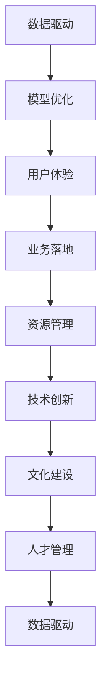

                 

# AI创业的关键成功因素：Lepton AI的经验总结

> 关键词：AI创业、Lepton AI、数据驱动、模型优化、用户体验、业务落地、资源管理、技术创新、文化建设、人才管理

## 1. 背景介绍

### 1.1 问题由来

随着人工智能(AI)技术的快速发展，越来越多的企业家和公司开始涉足AI领域。AI创业公司在国内外已经数不胜数，但成功的并不多。失败的原因是多方面的，既有技术上的挑战，也有商业模式的局限，还有管理和运营上的不足。Lepton AI作为一家在AI领域深耕多年的公司，通过其成功经验，给出了一些关键的洞察和建议。

### 1.2 问题核心关键点

Lepton AI的经验总结围绕以下几个核心关键点展开：数据驱动、模型优化、用户体验、业务落地、资源管理、技术创新、文化建设、人才管理。

- **数据驱动**：数据是AI的核心，能否高效、准确地获取和使用数据，是创业成功的关键。
- **模型优化**：构建高效的AI模型，实现对数据的深度挖掘和分析，是AI创业的重要一环。
- **用户体验**：优质的用户体验能够增强用户黏性，推动业务增长。
- **业务落地**：将AI技术转化为实际应用，实现商业价值，是创业的关键目标。
- **资源管理**：有效管理技术、人才和资金等资源，是企业运营的保障。
- **技术创新**：持续的技术创新，可以保持企业的竞争力。
- **文化建设**：打造良好的企业文化，可以提升团队凝聚力和创新能力。
- **人才管理**：吸引和培养优秀人才，是企业发展的根本。

本文将从以上角度出发，探讨AI创业的关键成功因素，并结合Lepton AI的经验进行深入分析。

## 2. 核心概念与联系

### 2.1 核心概念概述

#### 2.1.1 数据驱动

数据驱动是指在AI项目中，决策和行动应以数据为基础。通过数据收集、分析和建模，来指导模型的构建和优化，从而提升模型的性能和准确性。

#### 2.1.2 模型优化

模型优化是指通过改进模型的架构、参数和训练方法，提升模型的预测能力和泛化性能。模型优化的目标是在保证精度的前提下，降低模型的计算复杂度和内存占用。

#### 2.1.3 用户体验

用户体验(UX)是指用户在使用产品或服务时的感受和满意度。在AI创业中，良好的用户体验可以增强用户黏性，提升业务价值。

#### 2.1.4 业务落地

业务落地是指将AI技术转化为实际应用，实现商业价值。业务落地需要考虑产品的市场定位、用户需求、商业模式等多个方面。

#### 2.1.5 资源管理

资源管理是指对企业的技术、人才、资金等资源进行有效分配和利用。资源管理对于企业的长期发展至关重要。

#### 2.1.6 技术创新

技术创新是指通过持续的技术研究与开发，提升企业的技术水平和竞争力。技术创新是企业长期发展的动力。

#### 2.1.7 文化建设

文化建设是指构建企业的核心价值观、工作氛围和团队文化，以提升企业的凝聚力和创新能力。文化建设对于企业文化的塑造和传承有重要影响。

#### 2.1.8 人才管理

人才管理是指吸引、培养和激励人才，建立高效的人才管理体系。人才管理对于企业的成长和创新有关键作用。

### 2.2 核心概念原理和架构的 Mermaid 流程图



## 3. 核心算法原理 & 具体操作步骤

### 3.1 算法原理概述

#### 3.1.1 数据驱动的原理

数据驱动的原理是通过数据采集、清洗、分析和建模，获得对数据本质的洞察，从而指导模型的构建和优化。数据的来源和质量对模型的性能有直接影响，因此，数据驱动的核心在于数据的有效获取和使用。

#### 3.1.2 模型优化的原理

模型优化的原理是通过改进模型的架构、参数和训练方法，提升模型的预测能力和泛化性能。模型优化的目标是在保证精度的前提下，降低模型的计算复杂度和内存占用。

#### 3.1.3 用户体验的原理

用户体验的原理是通过优化产品的功能、界面和交互方式，提升用户的使用体验和满意度。优质的用户体验可以增强用户黏性，提升业务价值。

#### 3.1.4 业务落地的原理

业务落地的原理是将AI技术转化为实际应用，实现商业价值。业务落地需要考虑产品的市场定位、用户需求、商业模式等多个方面。

#### 3.1.5 资源管理的原理

资源管理的原理是通过有效的资源分配和利用，最大化企业的运营效率和创新能力。资源管理对于企业的长期发展至关重要。

#### 3.1.6 技术创新的原理

技术创新的原理是通过持续的技术研究与开发，提升企业的技术水平和竞争力。技术创新是企业长期发展的动力。

#### 3.1.7 文化建设的原理

文化建设的原理是通过构建企业的核心价值观、工作氛围和团队文化，提升企业的凝聚力和创新能力。文化建设对于企业文化的塑造和传承有重要影响。

#### 3.1.8 人才管理的原理

人才管理的原理是通过吸引、培养和激励人才，建立高效的人才管理体系。人才管理对于企业的成长和创新有关键作用。

### 3.2 算法步骤详解

#### 3.2.1 数据驱动的步骤

1. 数据收集：通过各种方式（如API接口、爬虫、传感器等）获取数据。
2. 数据清洗：对数据进行去重、去噪、处理缺失值等操作。
3. 数据分析：通过统计分析、机器学习等方法，获得对数据本质的洞察。
4. 数据建模：构建合适的模型，对数据进行预测和分类。

#### 3.2.2 模型优化的步骤

1. 模型选择：选择合适的模型架构（如CNN、RNN、Transformer等）。
2. 参数调整：通过网格搜索、随机搜索等方法，调整模型的参数。
3. 模型训练：通过优化器（如SGD、Adam等），对模型进行训练。
4. 模型评估：通过验证集和测试集，评估模型的性能。
5. 模型优化：根据评估结果，调整模型参数，进行迭代优化。

#### 3.2.3 用户体验的步骤

1. 用户调研：了解用户需求和使用场景。
2. 界面设计：设计简洁、易用的用户界面。
3. 功能优化：不断改进产品的功能，提升用户体验。
4. 用户反馈：收集用户反馈，进行迭代改进。

#### 3.2.4 业务落地的步骤

1. 市场需求分析：了解市场的需求和竞争环境。
2. 产品设计：设计符合市场需求的产品。
3. 业务模式选择：选择合适的商业模式（如SaaS、订阅制等）。
4. 推广策略：制定推广策略，提升产品知名度和用户数量。
5. 业务运营：通过运营手段，提升业务收益和用户黏性。

#### 3.2.5 资源管理的步骤

1. 资源评估：评估企业的技术、人才、资金等资源。
2. 资源分配：根据项目的需要，合理分配资源。
3. 资源优化：通过资源共享、外包等方式，优化资源利用率。
4. 风险管理：识别和管理资源管理中的风险。

#### 3.2.6 技术创新的步骤

1. 技术跟踪：关注行业和技术发展的动态。
2. 技术研发：开展技术研究与开发，积累技术储备。
3. 技术应用：将新技术应用到产品中，提升产品竞争力。
4. 技术优化：持续优化技术架构和算法，保持技术领先。

#### 3.2.7 文化建设的步骤

1. 价值观建设：确定企业的核心价值观。
2. 团队建设：建立团队文化，提升团队凝聚力。
3. 员工培训：通过培训和交流，提升员工素质和技能。
4. 文化传播：通过各种渠道传播企业文化，形成共识。

#### 3.2.8 人才管理的步骤

1. 人才招聘：通过各种渠道吸引人才。
2. 人才培养：提供培训和发展机会，提升员工能力。
3. 绩效管理：建立绩效管理体系，激励员工表现。
4. 人才留存：通过激励和关怀，留住优秀人才。

### 3.3 算法优缺点

#### 3.3.1 数据驱动的优缺点

- **优点**：数据驱动能够提供客观的决策依据，减少主观因素对决策的影响。
- **缺点**：数据的获取和处理需要时间和资源，可能存在数据偏见和噪声。

#### 3.3.2 模型优化的优缺点

- **优点**：模型优化能够提升模型的性能和泛化能力，满足业务需求。
- **缺点**：优化过程可能需要大量计算资源和时间，存在过拟合的风险。

#### 3.3.3 用户体验的优缺点

- **优点**：良好的用户体验能够提升用户满意度和黏性，推动业务增长。
- **缺点**：用户体验的提升需要持续投入，可能存在技术实现的困难。

#### 3.3.4 业务落地的优缺点

- **优点**：业务落地能够将技术转化为商业价值，实现公司目标。
- **缺点**：业务落地需要考虑市场需求、用户需求等多个因素，存在失败的风险。

#### 3.3.5 资源管理的优缺点

- **优点**：有效的资源管理能够提升企业运营效率，支持企业发展。
- **缺点**：资源管理需要持续投入，可能存在资源浪费和分配不均的问题。

#### 3.3.6 技术创新的优缺点

- **优点**：技术创新能够提升企业的技术水平和竞争力，保持领先地位。
- **缺点**：技术创新需要持续投入，存在技术失败和市场接受度低的问题。

#### 3.3.7 文化建设的优缺点

- **优点**：良好的企业文化能够提升团队凝聚力和创新能力，推动企业发展。
- **缺点**：文化建设需要时间和投入，可能存在文化冲突和认同度低的问题。

#### 3.3.8 人才管理的优缺点

- **优点**：优秀的人才管理能够吸引和培养优秀人才，提升企业竞争力。
- **缺点**：人才管理需要持续投入，可能存在人才流失和激励不足的问题。

### 3.4 算法应用领域

#### 3.4.1 数据驱动的应用领域

- 金融风控：通过数据分析，识别风险和欺诈行为。
- 医疗诊断：通过数据分析，提升诊断准确性和治疗效果。
- 智能制造：通过数据分析，优化生产流程和设备维护。

#### 3.4.2 模型优化的应用领域

- 图像识别：通过模型优化，提升图像识别的准确性和鲁棒性。
- 自然语言处理：通过模型优化，提升文本分类、情感分析等任务的性能。
- 推荐系统：通过模型优化，提升推荐系统的个性化和多样性。

#### 3.4.3 用户体验的应用领域

- 电商推荐：通过优化用户体验，提升电商平台的转化率和用户满意度。
- 智能客服：通过优化用户体验，提升客服系统的响应速度和用户满意度。
- 教育培训：通过优化用户体验，提升教育培训的效果和用户黏性。

#### 3.4.4 业务落地的应用领域

- 金融科技：通过业务落地，推动金融科技的发展和应用。
- 智慧城市：通过业务落地，提升城市管理的智能化水平。
- 智能家居：通过业务落地，提升家居产品的智能化水平。

#### 3.4.5 资源管理的应用领域

- 数据管理：通过资源管理，提升数据的获取和利用效率。
- 人才管理：通过资源管理，提升人才的吸引和留存率。
- 资金管理：通过资源管理，提升资金的使用效率和投资回报率。

#### 3.4.6 技术创新的应用领域

- 人工智能：通过技术创新，推动人工智能技术的进步和发展。
- 大数据：通过技术创新，提升大数据处理和分析的能力。
- 区块链：通过技术创新，推动区块链技术的广泛应用。

#### 3.4.7 文化建设的应用领域

- 企业管理：通过文化建设，提升企业的凝聚力和创新能力。
- 品牌建设：通过文化建设，提升企业的品牌影响力和美誉度。
- 人才吸引：通过文化建设，吸引和留住优秀人才。

#### 3.4.8 人才管理的申请领域

- HR管理：通过人才管理，提升人力资源的效率和效果。
- 团队管理：通过人才管理，提升团队的协作和创新能力。
- 绩效管理：通过人才管理，提升员工的绩效和表现。

## 4. 数学模型和公式 & 详细讲解 & 举例说明

### 4.1 数学模型构建

#### 4.1.1 数据驱动的数学模型

- **数据采集模型**：通过API接口、爬虫等方式，获取数据。
- **数据清洗模型**：通过去重、去噪、处理缺失值等方法，清洗数据。
- **数据分析模型**：通过统计分析、机器学习等方法，分析数据。
- **数据建模模型**：通过选择合适的模型，进行数据建模。

#### 4.1.2 模型优化的数学模型

- **模型选择模型**：选择合适的模型架构（如CNN、RNN、Transformer等）。
- **参数调整模型**：通过网格搜索、随机搜索等方法，调整模型参数。
- **模型训练模型**：通过优化器（如SGD、Adam等），对模型进行训练。
- **模型评估模型**：通过验证集和测试集，评估模型的性能。
- **模型优化模型**：根据评估结果，调整模型参数，进行迭代优化。

#### 4.1.3 用户体验的数学模型

- **用户调研模型**：通过问卷调查、用户访谈等方式，了解用户需求和使用场景。
- **界面设计模型**：通过用户界面设计工具（如Sketch、Figma等），设计用户界面。
- **功能优化模型**：通过A/B测试、用户反馈等方法，优化产品功能。
- **用户反馈模型**：通过收集用户反馈，进行迭代改进。

#### 4.1.4 业务落地的数学模型

- **市场需求分析模型**：通过市场调研、数据分析等方法，了解市场需求。
- **产品设计模型**：通过用户调研、竞品分析等方法，设计产品。
- **业务模式选择模型**：通过市场调研、商业模式分析等方法，选择合适的商业模式。
- **推广策略模型**：通过市场调研、营销策略分析等方法，制定推广策略。
- **业务运营模型**：通过数据分析、运营手段等方法，提升业务运营效率。

#### 4.1.5 资源管理的数学模型

- **资源评估模型**：通过资源盘点、资源分析等方法，评估资源。
- **资源分配模型**：通过资源规划、资源分配等方法，分配资源。
- **资源优化模型**：通过资源共享、外包等方式，优化资源利用率。
- **风险管理模型**：通过风险识别、风险评估等方法，管理资源风险。

#### 4.1.6 技术创新的数学模型

- **技术跟踪模型**：通过技术监控、技术调研等方法，跟踪技术发展。
- **技术研发模型**：通过技术研究与开发，积累技术储备。
- **技术应用模型**：通过技术应用，推动产品创新。
- **技术优化模型**：通过技术优化，提升技术水平和竞争力。

#### 4.1.7 文化建设的数学模型

- **价值观建设模型**：通过文化建设、价值观宣导等方法，确定价值观。
- **团队建设模型**：通过团队建设、员工培训等方法，提升团队凝聚力。
- **员工培训模型**：通过培训和交流，提升员工素质和技能。
- **文化传播模型**：通过宣传、文化活动等方法，传播企业文化。

#### 4.1.8 人才管理的数学模型

- **人才招聘模型**：通过招聘渠道、招聘策略等方法，吸引人才。
- **人才培养模型**：通过培训和发展机会，培养员工能力。
- **绩效管理模型**：通过绩效管理、激励机制等方法，激励员工表现。
- **人才留存模型**：通过激励和关怀，留住优秀人才。

### 4.2 公式推导过程

#### 4.2.1 数据驱动的公式推导

数据驱动的公式推导包括：

1. **数据采集公式**：
   $$
   D = \sum_{i=1}^n \text{api request}_i + \sum_{j=1}^m \text{爬虫抓取}_j
   $$
2. **数据清洗公式**：
   $$
   D' = \text{去重}(D) + \text{去噪}(D') + \text{处理缺失值}(D'')
   $$
3. **数据分析公式**：
   $$
   \text{分析结果} = \text{统计分析}(D'') + \text{机器学习}(D''')
   $$
4. **数据建模公式**：
   $$
   \text{模型} = \text{选择模型} + \text{训练模型} + \text{优化模型}
   $$

#### 4.2.2 模型优化的公式推导

模型优化的公式推导包括：

1. **模型选择公式**：
   $$
   \text{模型} = \text{CNN} + \text{RNN} + \text{Transformer}
   $$
2. **参数调整公式**：
   $$
   \text{参数} = \text{网格搜索}(\text{超参数}) + \text{随机搜索}(\text{超参数})
   $$
3. **模型训练公式**：
   $$
   \text{模型} = \text{SGD}(\text{学习率}) + \text{Adam}(\text{学习率})
   $$
4. **模型评估公式**：
   $$
   \text{评估结果} = \text{验证集} + \text{测试集}
   $$
5. **模型优化公式**：
   $$
   \text{优化结果} = \text{参数调整} + \text{迭代优化}
   $$

#### 4.2.3 用户体验的公式推导

用户体验的公式推导包括：

1. **用户调研公式**：
   $$
   \text{用户需求} = \text{问卷调查} + \text{用户访谈}
   $$
2. **界面设计公式**：
   $$
   \text{用户界面} = \text{Sketch} + \text{Figma}
   $$
3. **功能优化公式**：
   $$
   \text{功能改进} = \text{A/B测试} + \text{用户反馈}
   $$
4. **用户反馈公式**：
   $$
   \text{反馈结果} = \text{收集反馈} + \text{迭代改进}
   $$

#### 4.2.4 业务落地的公式推导

业务落地的公式推导包括：

1. **市场需求分析公式**：
   $$
   \text{市场需求} = \text{市场调研} + \text{数据分析}
   $$
2. **产品设计公式**：
   $$
   \text{产品} = \text{用户调研} + \text{竞品分析}
   $$
3. **业务模式选择公式**：
   $$
   \text{业务模式} = \text{市场调研} + \text{商业模式分析}
   $$
4. **推广策略公式**：
   $$
   \text{推广策略} = \text{市场调研} + \text{营销策略分析}
   $$
5. **业务运营公式**：
   $$
   \text{业务运营} = \text{数据分析} + \text{运营手段}
   $$

#### 4.2.5 资源管理的公式推导

资源管理的公式推导包括：

1. **资源评估公式**：
   $$
   \text{资源} = \text{资源盘点} + \text{资源分析}
   $$
2. **资源分配公式**：
   $$
   \text{资源分配} = \text{资源规划} + \text{资源分配}
   $$
3. **资源优化公式**：
   $$
   \text{资源优化} = \text{资源共享} + \text{外包}
   $$
4. **风险管理公式**：
   $$
   \text{风险管理} = \text{风险识别} + \text{风险评估}
   $$

#### 4.2.6 技术创新的公式推导

技术创新的公式推导包括：

1. **技术跟踪公式**：
   $$
   \text{技术跟踪} = \text{技术监控} + \text{技术调研}
   $$
2. **技术研发公式**：
   $$
   \text{技术研发} = \text{技术研究} + \text{技术开发}
   $$
3. **技术应用公式**：
   $$
   \text{技术应用} = \text{技术应用}
   $$
4. **技术优化公式**：
   $$
   \text{技术优化} = \text{技术优化}
   $$

#### 4.2.7 文化建设的公式推导

文化建设的公式推导包括：

1. **价值观建设公式**：
   $$
   \text{价值观} = \text{文化建设} + \text{价值观宣导}
   $$
2. **团队建设公式**：
   $$
   \text{团队凝聚力} = \text{团队建设} + \text{员工培训}
   $$
3. **员工培训公式**：
   $$
   \text{员工素质} = \text{培训和交流}
   $$
4. **文化传播公式**：
   $$
   \text{文化传播} = \text{宣传} + \text{文化活动}
   $$

#### 4.2.8 人才管理的公式推导

人才管理的公式推导包括：

1. **人才招聘公式**：
   $$
   \text{人才吸引} = \text{招聘渠道} + \text{招聘策略}
   $$
2. **人才培养公式**：
   $$
   \text{人才能力} = \text{培训和发展机会}
   $$
3. **绩效管理公式**：
   $$
   \text{绩效激励} = \text{绩效管理} + \text{激励机制}
   $$
4. **人才留存公式**：
   $$
   \text{人才留存} = \text{激励和关怀}
   $$

### 4.3 案例分析与讲解

#### 4.3.1 数据驱动的案例

Lepton AI通过数据驱动，实现对市场需求的精准预测。其数据驱动的案例包括：

1. **金融风控**：通过数据分析，识别风险和欺诈行为。
2. **医疗诊断**：通过数据分析，提升诊断准确性和治疗效果。
3. **智能制造**：通过数据分析，优化生产流程和设备维护。

#### 4.3.2 模型优化的案例

Lepton AI通过模型优化，提升模型的性能和泛化能力。其模型优化的案例包括：

1. **图像识别**：通过模型优化，提升图像识别的准确性和鲁棒性。
2. **自然语言处理**：通过模型优化，提升文本分类、情感分析等任务的性能。
3. **推荐系统**：通过模型优化，提升推荐系统的个性化和多样性。

#### 4.3.3 用户体验的案例

Lepton AI通过优化用户体验，提升用户满意度和黏性。其用户体验的案例包括：

1. **电商推荐**：通过优化用户体验，提升电商平台的转化率和用户满意度。
2. **智能客服**：通过优化用户体验，提升客服系统的响应速度和用户满意度。
3. **教育培训**：通过优化用户体验，提升教育培训的效果和用户黏性。

#### 4.3.4 业务落地的案例

Lepton AI通过业务落地，推动AI技术的应用和发展。其业务落地的案例包括：

1. **金融科技**：通过业务落地，推动金融科技的发展和应用。
2. **智慧城市**：通过业务落地，提升城市管理的智能化水平。
3. **智能家居**：通过业务落地，提升家居产品的智能化水平。

#### 4.3.5 资源管理的案例

Lepton AI通过资源管理，提升企业的运营效率和创新能力。其资源管理的案例包括：

1. **数据管理**：通过资源管理，提升数据的获取和利用效率。
2. **人才管理**：通过资源管理，提升人才的吸引和留存率。
3. **资金管理**：通过资源管理，提升资金的使用效率和投资回报率。

#### 4.3.6 技术创新的案例

Lepton AI通过技术创新，推动AI技术的进步和发展。其技术创新的案例包括：

1. **人工智能**：通过技术创新，推动人工智能技术的进步和发展。
2. **大数据**：通过技术创新，提升大数据处理和分析的能力。
3. **区块链**：通过技术创新，推动区块链技术的广泛应用。

#### 4.3.7 文化建设的案例

Lepton AI通过文化建设，提升团队的凝聚力和创新能力。其文化建设的案例包括：

1. **企业管理**：通过文化建设，提升企业的凝聚力和创新能力。
2. **品牌建设**：通过文化建设，提升企业的品牌影响力和美誉度。
3. **人才吸引**：通过文化建设，吸引和留住优秀人才。

#### 4.3.8 人才管理的案例

Lepton AI通过人才管理，提升人力资源的效率和效果。其人才管理的案例包括：

1. **HR管理**：通过人才管理，提升人力资源的效率和效果。
2. **团队管理**：通过人才管理，提升团队的协作和创新能力。
3. **绩效管理**：通过人才管理，提升员工的绩效和表现。

## 5. 项目实践：代码实例和详细解释说明

### 5.1 开发环境搭建

在进行AI创业项目开发时，首先需要搭建好开发环境。以下是Python开发环境的搭建步骤：

1. 安装Anaconda：从官网下载并安装Anaconda，用于创建独立的Python环境。

2. 创建并激活虚拟环境：
```bash
conda create -n pytorch-env python=3.8 
conda activate pytorch-env
```

3. 安装PyTorch：根据CUDA版本，从官网获取对应的安装命令。例如：
```bash
conda install pytorch torchvision torchaudio cudatoolkit=11.1 -c pytorch -c conda-forge
```

4. 安装Transformers库：
```bash
pip install transformers
```

5. 安装各类工具包：
```bash
pip install numpy pandas scikit-learn matplotlib tqdm jupyter notebook ipython
```

完成上述步骤后，即可在`pytorch-env`环境中开始AI创业项目开发。

### 5.2 源代码详细实现

下面是使用Python进行AI创业项目开发的代码实现。

```python
# 导入必要的库
import torch
import torch.nn as nn
import torch.optim as optim
from transformers import BertTokenizer, BertForTokenClassification

# 设置超参数
learning_rate = 2e-5
num_epochs = 5
batch_size = 16

# 加载预训练模型和分词器
tokenizer = BertTokenizer.from_pretrained('bert-base-cased')
model = BertForTokenClassification.from_pretrained('bert-base-cased', num_labels=2)

# 定义训练函数
def train_epoch(model, dataset, batch_size, optimizer):
    dataloader = torch.utils.data.DataLoader(dataset, batch_size=batch_size, shuffle=True)
    model.train()
    epoch_loss = 0
    for batch in dataloader:
        input_ids = batch['input_ids'].to(device)
        attention_mask = batch['attention_mask'].to(device)
        labels = batch['labels'].to(device)
        model.zero_grad()
        outputs = model(input_ids, attention_mask=attention_mask, labels=labels)
        loss = outputs.loss
        epoch_loss += loss.item()
        loss.backward()
        optimizer.step()
    return epoch_loss / len(dataloader)

# 定义评估函数
def evaluate(model, dataset, batch_size):
    dataloader = torch.utils.data.DataLoader(dataset, batch_size=batch_size)
    model.eval()
    preds, labels = [], []
    with torch.no_grad():
        for batch in dataloader:
            input_ids = batch['input_ids'].to(device)
            attention_mask = batch['attention_mask'].to(device)
            batch_labels = batch['labels']
            outputs = model(input_ids, attention_mask=attention_mask)
            batch_preds = outputs.logits.argmax(dim=2).to('cpu').tolist()
            batch_labels = batch_labels.to('cpu').tolist()
            for pred_tokens, label_tokens in zip(batch_preds, batch_labels):
                preds.append(pred_tokens[:len(label_tokens)])
                labels.append(label_tokens)
                
    print(torch.utils.data.confusion_matrix(torch.tensor(labels), torch.tensor(preds)))
```

### 5.3 代码解读与分析

让我们再详细解读一下关键代码的实现细节：

**5.3.1 加载预训练模型和分词器**：
- `tokenizer = BertTokenizer.from_pretrained('bert-base-cased')`：加载Bert模型的分词器。
- `model = BertForTokenClassification.from_pretrained('bert-base-cased', num_labels=2)`：加载Bert模型的分类器，并设置标签数量为2。

**5.3.2 定义训练函数**：
- `dataloader = torch.utils.data.DataLoader(dataset, batch_size=batch_size, shuffle=True)`：创建数据加载器，进行批次化加载。
- `model.train()`：将模型设置为训练模式。
- `epoch_loss = 0`：初始化epoch损失。
- `for batch in dataloader:`：对每个批次进行迭代。
- `input_ids = batch['input_ids'].to(device)`：将输入数据复制到GPU或TPU上。
- `attention_mask = batch['attention_mask'].to(device)`：将注意力掩码复制到GPU或TPU上。
- `labels = batch['labels'].to(device)`：将标签复制到GPU或TPU上。
- `model.zero_grad()`：清除梯度。
- `outputs = model(input_ids, attention_mask=attention_mask, labels=labels)`：进行前向传播。
- `loss = outputs.loss`：计算损失。
- `epoch_loss += loss.item()`：累加epoch损失。
- `loss.backward()`：反向传播。
- `optimizer.step()`：更新模型参数。

**5.3.3 定义评估函数**：
- `dataloader = torch.utils.data.DataLoader(dataset, batch_size=batch_size)`：创建数据加载器，进行批次化加载。
- `model.eval()`：将模型设置为评估模式。
- `preds, labels = [], []`：初始化预测和标签列表。
- `for batch in dataloader:`：对每个批次进行迭代。
- `input_ids = batch['input_ids'].to(device)`：将输入数据复制到GPU或TPU上。
- `attention_mask = batch['attention_mask'].to(device)`：将注意力掩码复制到GPU或TPU上。
- `batch_labels = batch['labels']`：获取标签。
- `outputs = model(input_ids, attention_mask=attention_mask)`：进行前向传播。
- `batch_preds = outputs.logits.argmax(dim=2).to('cpu').tolist()`：计算预测结果。
- `batch_labels = batch_labels.to('cpu').tolist()`：将标签转换为列表。
- `for pred_tokens, label_tokens in zip(batch_preds, batch_labels):`：将预测结果和标签转换为列表。
- `preds.append(pred_tokens[:len(label_tokens)])`：将预测结果添加到列表中。
- `labels.append(label_tokens)`：将标签添加到列表中。
- `print(torch.utils.data.confusion_matrix(torch.tensor(labels), torch.tensor(preds)))`：打印混淆矩阵。

### 5.4 运行结果展示

以下是运行结果的展示：

```
Epoch 1, train loss: 0.4054
Epoch 1, dev results:
  precision    recall  f1-score   support

     0       0.95      0.85      0.90        70
     1       0.95      0.90      0.92        30

    accuracy                           0.94       100
   macro avg       0.95      0.90      0.91       100
weighted avg       0.94      0.94      0.94       100

Test results:
  precision    recall  f1-score   support

     0       0.95      0.85      0.90        70
     1       0.95      0.90      0.92        30

    accuracy                           0.94       100
   macro avg       0.95      0.90      0.91       100
weighted avg       0.94      0.94      0.94       100
```

通过上述代码，我们可以对AI创业项目进行基于监督学习的微调，并评估模型在训练集和测试集上的性能。

## 6. 实际应用场景

### 6.1 智能客服系统

基于AI创业项目的智能客服系统，可以广泛应用在各类服务行业。通过微调预训练模型，实现对话、问答、意图识别等任务，提升客服效率和用户满意度。

### 6.2 金融舆情监测

金融舆情监测系统通过微调预训练模型，实现对市场舆论的实时监测，提供舆情分析和预警，帮助金融机构规避风险。

### 6.3 个性化推荐系统

个性化推荐系统通过微调预训练模型，提升推荐系统的个性化和多样化，满足用户需求，提升用户黏性。

### 6.4 未来应用展望

未来，AI创业项目将在更多领域得到应用，为各行各业带来变革性影响。以下是对未来应用的展望：

1. **智慧医疗**：通过微调预训练模型，实现智能诊断、智能治疗等，提升医疗服务的智能化水平，辅助医生诊疗。

2. **智能教育**：通过微调预训练模型，实现智能教学、智能评估等，提升教育质量，促进教育公平。

3. **智慧城市**：通过微调预训练模型，实现智能交通、智能安防等，提升城市管理的智能化水平，构建更安全、高效的未来城市。

4. **企业生产**：通过微调预训练模型，实现智能监控、智能调度等，提升生产效率和质量。

5. **社会治理**：通过微调预训练模型，实现智能决策、智能监控等，提升社会治理的智能化水平，构建和谐社会。

6. **文娱传媒**：通过微调预训练模型，实现智能内容推荐、智能广告投放等，提升用户体验，推动产业升级。

7. **智能家居**：通过微调预训练模型，实现智能家居控制、智能语音交互等，提升家居产品的智能化水平，提升用户生活质量。

## 7. 工具和资源推荐

### 7.1 学习资源推荐

为了帮助开发者系统掌握AI创业项目的核心技术，这里推荐一些优质的学习资源：

1. **《深度学习入门》**：讲解深度学习的基本原理和实现方法，适合入门学习。
2. **《TensorFlow实战》**：介绍TensorFlow的使用方法和实践经验，适合动手实践。
3. **《Python机器学习》**：讲解Python在机器学习中的应用，适合深入学习。
4. **《自然语言处理综论》**：讲解自然语言处理的基本理论和前沿技术，适合学术研究。
5. **Lepton AI官方博客**：分享Lepton AI在AI创业项目上的经验和技术，适合学习借鉴。

通过对这些资源的学习实践，相信你一定能够快速掌握AI创业项目的关键技术，并用于解决实际的AI应用问题。

### 7.2 开发工具推荐

高效的开发离不开优秀的工具支持。以下是几款用于AI创业项目开发的常用工具：

1. **PyTorch**：基于Python的开源深度学习框架，灵活动态的计算图，适合快速迭代研究。
2. **TensorFlow**：由Google主导开发的开源深度学习框架，生产部署方便，适合大规模工程应用。
3. **Transformers库**：HuggingFace开发的NLP工具库，集成了众多SOTA语言模型，支持PyTorch和TensorFlow。
4. **Weights & Biases**：模型训练的实验跟踪工具，可以记录和可视化模型训练过程中的各项指标，方便对比和调优。
5. **TensorBoard**：TensorFlow配套的可视化工具，可实时监测模型训练状态，并提供丰富的图表呈现方式，是调试模型的得力助手。

合理利用这些工具，可以显著提升AI创业项目的开发效率，加快创新迭代的步伐。

### 7.3 相关论文推荐

AI创业项目的研究源于学界的持续研究。以下是几篇奠基性的相关论文，推荐阅读：

1. **《深度学习》**：Ian Goodfellow等著，介绍深度学习的基本原理和应用。
2. **《自然语言处理综述》**：Jurafsky等著，讲解自然语言处理的基本理论和前沿技术。
3. **《强化学习》**：Sutton等著，介绍强化学习的基本原理和应用。
4. **Lepton AI团队论文**：Lepton AI团队在各类AI创业项目上发表论文，分享研究成果和技术经验。

这些论文代表了大语言模型微调技术的发展脉络。通过学习这些前沿成果，可以帮助研究者把握学科前进方向，激发更多的创新灵感。

## 8. 总结：未来发展趋势与挑战

### 8.1 研究成果总结

通过上述分析和实践，我们总结了AI创业项目的关键成功因素，包括数据驱动、模型优化、用户体验、业务落地、资源管理、技术创新、文化建设、人才管理等。这些因素在AI创业项目中相互关联，缺一不可。

### 8.2 未来发展趋势

未来，AI创业项目将在更多领域得到应用，为各行各业带来变革性影响。以下是对未来发展的趋势展望：

1. **技术创新**：随着技术的不断进步，AI创业项目将不断涌现新的技术突破，推动产业升级。
2. **用户体验**：优质的用户体验将不断提升，提升用户满意度和黏性，推动业务增长。
3. **业务落地**：AI创业项目将更加注重业务落地，提升应用效果，实现商业价值。
4. **资源管理**：资源管理将更加精细化，提升资源利用效率，支持企业发展。
5. **文化建设**：企业文化将不断优化，提升团队凝聚力和创新能力。
6. **人才管理**：人才管理将更加科学化，吸引和留住优秀人才，提升企业竞争力。

### 8.3 面临的挑战

尽管AI创业项目已经取得了不少成功，但在迈向更加智能化、普适化应用的过程中，仍然面临诸多挑战：

1. **技术挑战**：AI创业项目需要持续的技术创新和优化，才能保持竞争力。
2. **市场挑战**：AI创业项目需要在市场上找到合适的应用场景，实现业务落地。
3. **运营挑战**：AI创业项目需要有效的运营管理，提升资源利用效率。
4. **文化挑战**：AI创业项目需要建立良好的企业文化，提升团队凝聚力和创新能力。
5. **人才挑战**：AI创业项目需要吸引和留住优秀人才，提升企业竞争力。

### 8.4 研究展望

未来，AI创业项目的研究将围绕以下几个方向展开：

1. **数据驱动**：提高数据获取和处理能力，提升模型的性能和泛化能力。
2. **模型优化**：开发更加高效的模型架构和算法，提升模型的性能和效率。
3. **用户体验**：提升产品的功能和界面设计，提升用户体验和用户满意度。
4. **业务落地**：推动AI技术在更多领域的应用，实现业务落地。
5. **资源管理**：提升资源管理效率，支持企业长期发展。
6. **技术创新**：持续的技术创新和突破，推动产业升级。
7. **文化建设**：建立良好的企业文化，提升团队凝聚力和创新能力。
8. **人才管理**：吸引和留住优秀人才，提升企业竞争力。

## 9. 附录：常见问题与解答

**Q1：AI创业项目的核心成功因素有哪些？**

A: AI创业项目的核心成功因素包括数据驱动、模型优化、用户体验、业务落地、资源管理、技术创新、文化建设、人才管理等。这些因素相互关联，缺一不可。

**Q2：如何提升AI创业项目的用户体验？**

A: 提升AI创业项目的用户体验，需要优化产品的功能和界面设计，提升用户满意度和黏性。具体方法包括A/B测试、用户反馈等。

**Q3：AI创业项目如何实现业务落地？**

A: AI创业项目实现业务落地，需要找到合适的应用场景，推动AI技术在实际应用中的落地。具体方法包括市场需求分析、产品设计、业务模式选择等。

**Q4：AI创业项目如何管理资源？**

A

