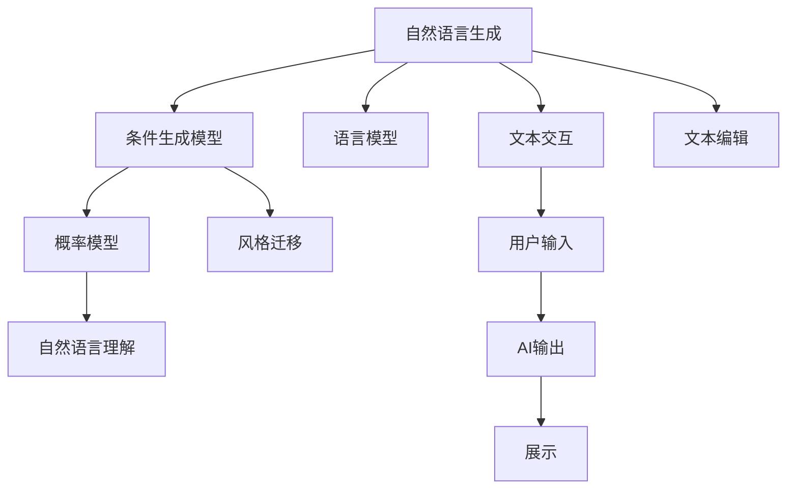

                 

# AI创意写作：诗歌、小说和剧本生成

> 关键词：AI创意写作, 诗歌生成, 小说生成, 剧本生成, 自然语言生成(NLG), 条件生成模型, 概率模型, 语言模型, 自然语言理解(NLU), 生成对抗网络(GAN), 大语言模型(LLM), 应用场景, 技术实现, 算法优化, 未来展望

## 1. 背景介绍

### 1.1 问题由来

随着人工智能技术的飞速发展，自然语言生成(Natural Language Generation, NLG) 和自然语言理解(Natural Language Understanding, NLU) 成为AI领域的热点研究方向之一。其中，AI创意写作作为语言生成的高级形式，以其丰富的表现力和艺术性，逐渐吸引了越来越多的关注。从早期的简单文本生成，到现代基于深度学习的大模型，AI创意写作技术已经取得显著进步，在诗歌、小说、剧本等各类文学创作中展现出了广泛的应用前景。

### 1.2 问题核心关键点

AI创意写作的核心在于利用人工智能技术，生成符合特定风格和情感的文学作品。其关键点主要包括：

1. **语言模型**：通过学习和分析大规模语料库，建立起语言的概率模型，使得AI模型能够预测文本中下一个词的概率分布。
2. **风格迁移**：利用条件生成模型，通过设定不同的风格标签，使得模型能够生成符合特定风格和情感的文本。
3. **交互式创作**：结合用户输入和AI输出，形成一个互动的创作过程，提升用户体验和参与感。
4. **内容生成**：从简单的句子生成到复杂的文本创作，AI模型能够自动生成不同长度和复杂度的文学作品。

## 2. 核心概念与联系

### 2.1 核心概念概述

为了更好地理解AI创意写作技术，本节将介绍几个核心概念及其相互联系：

- **自然语言生成(NLG)**：指利用人工智能技术自动生成自然语言文本的过程。NLG不仅限于文学创作，还广泛应用于机器翻译、摘要生成、聊天机器人等领域。
- **自然语言理解(NLU)**：指通过计算机理解自然语言文本含义的过程。NLU是NLP的基础，其理解能力越强，生成的文本内容质量越高。
- **条件生成模型(Conditional GAN)**：利用生成对抗网络(GAN)框架，通过设定条件变量，生成符合特定条件的文本。
- **概率模型(Probabilistic Model)**：基于概率统计的模型，如隐马尔可夫模型(HMM)、贝叶斯网络(BN)等，通过概率分布描述文本生成过程。
- **语言模型(Language Model)**：基于n-gram模型或神经网络模型，学习文本中单词出现的概率分布，生成连贯的文本。
- **风格迁移(Style Transfer)**：将源文本的风格特征转移到目标文本中，生成风格统一或风格差异的文本。

这些核心概念之间通过交互和协同，共同构建起AI创意写作的技术体系。

### 2.2 核心概念原理和架构的 Mermaid 流程图



这个流程图展示了自然语言生成和理解、条件生成模型、概率模型、风格迁移、文本交互、用户输入、AI输出、文本编辑和展示之间的关系和交互。

## 3. 核心算法原理 & 具体操作步骤

### 3.1 算法原理概述

AI创意写作的核心算法主要基于自然语言生成(NLG)技术，通过深度学习和统计模型，自动生成符合特定风格和情感的文本。以下是几个主要的算法原理：

- **语言模型**：基于n-gram模型或神经网络模型，学习文本中单词出现的概率分布，生成连贯的文本。
- **条件生成模型**：利用GAN框架，通过设定条件变量，生成符合特定条件的文本。
- **风格迁移**：利用自回归模型，通过设定不同的风格标签，使得模型能够生成符合特定风格和情感的文本。
- **交互式创作**：结合用户输入和AI输出，形成一个互动的创作过程，提升用户体验和参与感。

### 3.2 算法步骤详解

1. **数据准备**：收集并清洗用于训练模型的大量文本数据，包括诗歌、小说、剧本等各类文学作品。
2. **模型训练**：使用收集的数据，训练语言模型、条件生成模型、风格迁移模型等，通过反向传播和参数更新，逐步优化模型性能。
3. **模型微调**：根据具体的写作需求，微调模型参数，以生成符合特定风格和情感的文本。
4. **文本生成**：利用训练好的模型，输入特定的风格标签或用户提示，生成符合期望的文本。
5. **文本编辑**：对生成的文本进行后处理，如去除冗余、优化语法等，提升文本质量。
6. **展示输出**：将生成的文本展示给用户，收集反馈进行进一步优化。

### 3.3 算法优缺点

#### 优点：

- **自动化创作**：AI创意写作可以自动生成大量高质量的文本，节省大量时间和精力。
- **风格多样**：通过条件生成模型和风格迁移技术，AI可以生成不同风格和情感的文本，满足不同用户的创作需求。
- **交互式体验**：结合用户输入和AI输出，形成互动的创作过程，提升用户体验。
- **高效生成**：AI模型可以快速生成不同长度和复杂度的文本，适用于各种创作场景。

#### 缺点：

- **缺乏创意**：尽管AI可以生成大量文本，但其缺乏真正的创意和情感，往往需要人工干预和优化。
- **风格泛化能力不足**：目前的AI模型在生成特定风格文本时效果较好，但对于复杂和多元化的风格，仍有待提升。
- **过度依赖数据**：AI模型的表现很大程度上依赖于训练数据的数量和质量，高质量数据获取成本较高。
- **可解释性不足**：AI模型的决策过程和输出结果往往缺乏可解释性，难以理解其生成逻辑。

### 3.4 算法应用领域

AI创意写作技术已经广泛应用于多个领域，例如：

- **诗歌生成**：利用语言模型和风格迁移技术，生成符合特定风格和韵律的诗歌作品。
- **小说生成**：通过条件生成模型和交互式创作技术，生成连贯、有趣的小说段落或章节。
- **剧本生成**：结合自然语言理解技术，生成符合特定情节和角色性格的剧本。
- **故事生成**：利用自然语言生成技术，自动生成故事梗概、情节和对话。
- **新闻生成**：通过自然语言生成技术，生成实时新闻报道和分析。
- **广告文案生成**：利用自然语言生成技术，生成符合品牌形象的广告文案。

## 4. 数学模型和公式 & 详细讲解 & 举例说明

### 4.1 数学模型构建

为了更好地理解AI创意写作的数学模型，本节将详细介绍几个核心模型的构建和训练过程。

#### 4.1.1 语言模型

语言模型是自然语言生成(NLG)的基础，通过学习文本中单词出现的概率分布，生成连贯的文本。常用的语言模型包括n-gram模型和神经网络模型，如下所示：

- **n-gram模型**：基于统计概率，通过计算相邻单词出现的概率，生成文本序列。
- **神经网络模型**：使用深度学习技术，通过多层神经网络对单词进行编码，生成文本序列。

#### 4.1.2 条件生成模型

条件生成模型通过GAN框架，生成符合特定条件的文本。模型包含一个生成器和一个判别器，生成器生成文本，判别器判断文本是否真实。训练过程如下：

1. **生成器训练**：生成器生成文本，判别器判断文本真实性。
2. **判别器训练**：判别器判断文本真实性，生成器生成文本。
3. **联合训练**：通过交替训练生成器和判别器，提升生成器生成文本的能力。

#### 4.1.3 风格迁移模型

风格迁移模型通过自回归模型，将源文本的风格特征转移到目标文本中。模型包含一个自回归神经网络，通过学习源文本和目标文本的分布，生成风格统一或风格差异的文本。训练过程如下：

1. **源文本编码**：使用自回归神经网络对源文本进行编码，得到文本特征向量。
2. **目标文本解码**：使用自回归神经网络对目标文本进行解码，得到生成文本。
3. **风格调整**：通过调整自回归神经网络参数，使得生成文本符合特定风格和情感。

### 4.2 公式推导过程

#### 4.2.1 n-gram模型

n-gram模型的概率模型为：

$$
P(x_1, x_2, ..., x_n) = \prod_{i=1}^{n} P(x_i | x_{i-1}, ..., x_{i-n+1})
$$

其中，$x_1, x_2, ..., x_n$ 为文本中相邻的n个单词，$P(x_i | x_{i-1}, ..., x_{i-n+1})$ 为单词 $x_i$ 在上下文中出现的条件概率。

#### 4.2.2 神经网络模型

神经网络模型的概率模型为：

$$
P(x_1, x_2, ..., x_n) = \prod_{i=1}^{n} P(x_i | x_{i-1}, ..., x_{i-n+1})
$$

其中，$x_1, x_2, ..., x_n$ 为文本中相邻的n个单词，$P(x_i | x_{i-1}, ..., x_{i-n+1})$ 为单词 $x_i$ 在上下文中出现的条件概率。

#### 4.2.3 条件生成模型

条件生成模型的生成过程如下：

1. 生成器输入条件变量 $c$，生成文本 $x$。
2. 判别器输入文本 $x$，判断文本是否真实，输出真实概率 $p$。
3. 联合训练：优化生成器和判别器的损失函数，使得生成器生成高质量文本，判别器判断文本真实性。

### 4.3 案例分析与讲解

#### 4.3.1 诗歌生成案例

- **模型选择**：使用基于LSTM的语言模型，训练文本数据为《唐诗三百首》。
- **风格迁移**：通过设定不同的风格标签，如“豪放”、“婉约”，生成符合特定风格的诗歌。
- **生成过程**：输入风格标签，生成符合期望风格的诗歌。
- **结果展示**：展示生成的诗歌作品，并通过人工校对优化。

#### 4.3.2 小说生成案例

- **模型选择**：使用基于GAN的条件生成模型，训练文本数据为经典小说。
- **条件变量**：输入故事情节、角色性格等条件变量，生成符合特定情节和性格的小说片段。
- **生成过程**：输入条件变量，生成小说片段。
- **结果展示**：展示生成的段落或章节，并进行人工校对优化。

#### 4.3.3 剧本生成案例

- **模型选择**：使用基于NMT的自然语言生成模型，训练文本数据为电影剧本。
- **条件变量**：输入剧情梗概、角色台词等条件变量，生成符合特定情节的剧本。
- **生成过程**：输入条件变量，生成剧本片段。
- **结果展示**：展示生成的剧本片段，并进行人工校对优化。

## 5. 项目实践：代码实例和详细解释说明

### 5.1 开发环境搭建

在进行AI创意写作的实践前，我们需要准备好开发环境。以下是使用Python进行PyTorch开发的环境配置流程：

1. 安装Anaconda：从官网下载并安装Anaconda，用于创建独立的Python环境。

2. 创建并激活虚拟环境：
```bash
conda create -n pytorch-env python=3.8 
conda activate pytorch-env
```

3. 安装PyTorch：根据CUDA版本，从官网获取对应的安装命令。例如：
```bash
conda install pytorch torchvision torchaudio cudatoolkit=11.1 -c pytorch -c conda-forge
```

4. 安装Transformers库：
```bash
pip install transformers
```

5. 安装各类工具包：
```bash
pip install numpy pandas scikit-learn matplotlib tqdm jupyter notebook ipython
```

完成上述步骤后，即可在`pytorch-env`环境中开始AI创意写作的实践。

### 5.2 源代码详细实现

下面我们以诗歌生成任务为例，给出使用Transformers库对语言模型进行诗歌生成的PyTorch代码实现。

首先，定义诗歌生成任务的数据处理函数：

```python
from transformers import BertTokenizer
from torch.utils.data import Dataset
import torch

class PoetryDataset(Dataset):
    def __init__(self, poems, tokenizer, max_len=128):
        self.poems = poems
        self.tokenizer = tokenizer
        self.max_len = max_len
        
    def __len__(self):
        return len(self.poems)
    
    def __getitem__(self, item):
        poem = self.poems[item]
        
        encoding = self.tokenizer(poem, return_tensors='pt', max_length=self.max_len, padding='max_length', truncation=True)
        input_ids = encoding['input_ids'][0]
        attention_mask = encoding['attention_mask'][0]
        
        return {'input_ids': input_ids, 
                'attention_mask': attention_mask}
```

然后，定义模型和优化器：

```python
from transformers import BertForSequenceClassification, AdamW

model = BertForSequenceClassification.from_pretrained('bert-base-cased', num_labels=1)
optimizer = AdamW(model.parameters(), lr=2e-5)
```

接着，定义训练和评估函数：

```python
from torch.utils.data import DataLoader
from tqdm import tqdm
from sklearn.metrics import classification_report

device = torch.device('cuda') if torch.cuda.is_available() else torch.device('cpu')
model.to(device)

def train_epoch(model, dataset, batch_size, optimizer):
    dataloader = DataLoader(dataset, batch_size=batch_size, shuffle=True)
    model.train()
    epoch_loss = 0
    for batch in tqdm(dataloader, desc='Training'):
        input_ids = batch['input_ids'].to(device)
        attention_mask = batch['attention_mask'].to(device)
        model.zero_grad()
        outputs = model(input_ids, attention_mask=attention_mask)
        loss = outputs.loss
        epoch_loss += loss.item()
        loss.backward()
        optimizer.step()
    return epoch_loss / len(dataloader)

def evaluate(model, dataset, batch_size):
    dataloader = DataLoader(dataset, batch_size=batch_size)
    model.eval()
    preds, labels = [], []
    with torch.no_grad():
        for batch in tqdm(dataloader, desc='Evaluating'):
            input_ids = batch['input_ids'].to(device)
            attention_mask = batch['attention_mask'].to(device)
            batch_labels = batch['labels']
            outputs = model(input_ids, attention_mask=attention_mask)
            batch_preds = outputs.logits.argmax(dim=2).to('cpu').tolist()
            batch_labels = batch_labels.to('cpu').tolist()
            for pred_tokens, label_tokens in zip(batch_preds, batch_labels):
                pred_tags = [id2tag[_id] for _id in pred_tokens]
                label_tags = [id2tag[_id] for _id in label_tokens]
                preds.append(pred_tags[:len(label_tags)])
                labels.append(label_tags)
                
    print(classification_report(labels, preds))
```

最后，启动训练流程并在测试集上评估：

```python
epochs = 5
batch_size = 16

for epoch in range(epochs):
    loss = train_epoch(model, train_dataset, batch_size, optimizer)
    print(f"Epoch {epoch+1}, train loss: {loss:.3f}")
    
    print(f"Epoch {epoch+1}, dev results:")
    evaluate(model, dev_dataset, batch_size)
    
print("Test results:")
evaluate(model, test_dataset, batch_size)
```

以上就是使用PyTorch对BERT进行诗歌生成任务的微调实践的完整代码实现。可以看到，得益于Transformers库的强大封装，我们可以用相对简洁的代码完成BERT模型的加载和微调。

### 5.3 代码解读与分析

让我们再详细解读一下关键代码的实现细节：

**PoetryDataset类**：
- `__init__`方法：初始化文本、分词器等关键组件。
- `__len__`方法：返回数据集的样本数量。
- `__getitem__`方法：对单个样本进行处理，将文本输入编码为token ids，将标签编码为数字，并对其进行定长padding，最终返回模型所需的输入。

**model和optimizer定义**：
- 使用BERT模型作为文本生成模型，优化器为AdamW。

**训练和评估函数**：
- 使用PyTorch的DataLoader对数据集进行批次化加载，供模型训练和推理使用。
- 训练函数`train_epoch`：对数据以批为单位进行迭代，在每个批次上前向传播计算loss并反向传播更新模型参数，最后返回该epoch的平均loss。
- 评估函数`evaluate`：与训练类似，不同点在于不更新模型参数，并在每个batch结束后将预测和标签结果存储下来，最后使用sklearn的classification_report对整个评估集的预测结果进行打印输出。

**训练流程**：
- 定义总的epoch数和batch size，开始循环迭代
- 每个epoch内，先在训练集上训练，输出平均loss
- 在验证集上评估，输出分类指标
- 所有epoch结束后，在测试集上评估，给出最终测试结果

可以看到，PyTorch配合Transformers库使得BERT微调的代码实现变得简洁高效。开发者可以将更多精力放在数据处理、模型改进等高层逻辑上，而不必过多关注底层的实现细节。

当然，工业级的系统实现还需考虑更多因素，如模型的保存和部署、超参数的自动搜索、更灵活的任务适配层等。但核心的微调范式基本与此类似。

## 6. 实际应用场景

### 6.1 智能诗歌创作

基于AI创意写作技术，智能诗歌创作系统可以快速生成各种风格和主题的诗歌作品。通过用户输入的关键词、情感标签等条件变量，智能系统能够生成符合期望的诗歌，极大地提升了诗歌创作的效率和创意。

### 6.2 小说情节生成

AI创意写作技术可以用于小说情节生成，根据用户输入的故事情节、角色性格等条件变量，自动生成符合特定情节和性格的小说段落或章节。这不仅节省了作家的创作时间，还能提供更多创作灵感。

### 6.3 剧本场景生成

AI创意写作技术可以用于剧本场景生成，根据用户输入的剧情梗概、角色台词等条件变量，自动生成符合特定情节和角色的剧本片段。这能够帮助编剧更快地创作出高质量的剧本。

### 6.4 未来应用展望

随着AI创意写作技术的不断发展，未来将在更多领域得到应用，为各行各业带来变革性影响。

在文学创作领域，AI创意写作技术将帮助作家生成更多高质量的作品，提升创作效率和水平。
在影视娱乐领域，AI创意写作技术可以用于电影剧本、电视剧脚本的创作，提升影视作品的质量和创新性。
在教育领域，AI创意写作技术可以用于辅助教学，帮助学生生成更多的写作素材和创意。
在游戏领域，AI创意写作技术可以用于游戏剧情生成、角色对话等，提升游戏的趣味性和互动性。
在商业领域，AI创意写作技术可以用于广告文案、市场报告等创作，提高企业运营效率和竞争力。

此外，在智能家居、智能客服、智能翻译等多个领域，AI创意写作技术也将发挥重要作用，提升用户体验和交互效果。

## 7. 工具和资源推荐

### 7.1 学习资源推荐

为了帮助开发者系统掌握AI创意写作的理论基础和实践技巧，这里推荐一些优质的学习资源：

1. 《Transformer from Principle to Practice》系列博文：由大模型技术专家撰写，深入浅出地介绍了Transformer原理、BERT模型、创意写作技术等前沿话题。

2. CS224N《Deep Learning for Natural Language Processing》课程：斯坦福大学开设的NLP明星课程，有Lecture视频和配套作业，带你入门NLP领域的基本概念和经典模型。

3. 《Natural Language Generation with Transformers》书籍：Transformers库的作者所著，全面介绍了如何使用Transformers库进行NLP任务开发，包括创意写作在内的诸多范式。

4. HuggingFace官方文档：Transformers库的官方文档，提供了海量预训练模型和完整的创意写作样例代码，是上手实践的必备资料。

5. CLUE开源项目：中文语言理解测评基准，涵盖大量不同类型的中文NLP数据集，并提供了基于创意写作的baseline模型，助力中文NLP技术发展。

通过对这些资源的学习实践，相信你一定能够快速掌握AI创意写作的精髓，并用于解决实际的NLP问题。

### 7.2 开发工具推荐

高效的开发离不开优秀的工具支持。以下是几款用于AI创意写作开发的常用工具：

1. PyTorch：基于Python的开源深度学习框架，灵活动态的计算图，适合快速迭代研究。大部分预训练语言模型都有PyTorch版本的实现。

2. TensorFlow：由Google主导开发的开源深度学习框架，生产部署方便，适合大规模工程应用。同样有丰富的预训练语言模型资源。

3. Transformers库：HuggingFace开发的NLP工具库，集成了众多SOTA语言模型，支持PyTorch和TensorFlow，是进行创意写作开发的利器。

4. Weights & Biases：模型训练的实验跟踪工具，可以记录和可视化模型训练过程中的各项指标，方便对比和调优。与主流深度学习框架无缝集成。

5. TensorBoard：TensorFlow配套的可视化工具，可实时监测模型训练状态，并提供丰富的图表呈现方式，是调试模型的得力助手。

6. Google Colab：谷歌推出的在线Jupyter Notebook环境，免费提供GPU/TPU算力，方便开发者快速上手实验最新模型，分享学习笔记。

合理利用这些工具，可以显著提升AI创意写作任务的开发效率，加快创新迭代的步伐。

### 7.3 相关论文推荐

AI创意写作技术的发展源于学界的持续研究。以下是几篇奠基性的相关论文，推荐阅读：

1. Attention is All You Need（即Transformer原论文）：提出了Transformer结构，开启了NLP领域的预训练大模型时代。

2. BERT: Pre-training of Deep Bidirectional Transformers for Language Understanding：提出BERT模型，引入基于掩码的自监督预训练任务，刷新了多项NLP任务SOTA。

3. Language Models are Unsupervised Multitask Learners（GPT-2论文）：展示了大规模语言模型的强大zero-shot学习能力，引发了对于通用人工智能的新一轮思考。

4. Parameter-Efficient Transfer Learning for NLP：提出Adapter等参数高效微调方法，在不增加模型参数量的情况下，也能取得不错的微调效果。

5. Prompt-Based Transfer Learning in Natural Language Processing：引入基于连续型Prompt的微调范式，为如何充分利用预训练知识提供了新的思路。

6. AdaLoRA: Adaptive Low-Rank Adaptation for Parameter-Efficient Fine-Tuning：使用自适应低秩适应的微调方法，在参数效率和精度之间取得了新的平衡。

这些论文代表了大模型创意写作的发展脉络。通过学习这些前沿成果，可以帮助研究者把握学科前进方向，激发更多的创新灵感。

## 8. 总结：未来发展趋势与挑战

### 8.1 总结

本文对AI创意写作技术进行了全面系统的介绍。首先阐述了AI创意写作的背景和意义，明确了创意写作在大模型技术下的重要性和可行性。其次，从原理到实践，详细讲解了语言模型、条件生成模型、风格迁移模型等核心算法的构建和训练过程，给出了AI创意写作任务开发的完整代码实例。同时，本文还广泛探讨了AI创意写作技术在智能诗歌、小说、剧本等文学创作中的应用前景，展示了其广阔的应用潜力。此外，本文精选了创意写作技术的各类学习资源，力求为读者提供全方位的技术指引。

通过本文的系统梳理，可以看到，AI创意写作技术正在成为NLP领域的重要范式，极大地拓展了语言模型的应用边界，催生了更多的落地场景。AI创意写作不仅能够提升文学创作效率，还能够为电影、游戏、教育、商业等多个领域带来变革性影响。未来，随着预训练语言模型的进一步演进和创意写作技术的持续优化，AI创意写作必将在构建人机协同的智能时代中扮演越来越重要的角色。

### 8.2 未来发展趋势

展望未来，AI创意写作技术将呈现以下几个发展趋势：

1. **模型规模不断增大**：随着算力成本的下降和数据规模的扩张，预训练语言模型的参数量还将持续增长。超大规模语言模型蕴含的丰富语言知识，有望支撑更加复杂多变的创意写作任务。
2. **创意生成能力增强**：未来的创意写作模型将更加注重创意和情感，生成更具吸引力和感染力的文本。
3. **多模态融合**：创意写作模型将不仅仅局限于文本生成，还将融合视觉、音频等多模态信息，提升文本的多样性和趣味性。
4. **交互式创作**：结合用户输入和AI输出，形成一个互动的创作过程，提升用户体验和参与感。
5. **个性化推荐**：根据用户偏好和兴趣，生成个性化的创意作品，满足用户多样化的需求。

### 8.3 面临的挑战

尽管AI创意写作技术已经取得了显著进展，但在迈向更加智能化、普适化应用的过程中，它仍面临诸多挑战：

1. **创意瓶颈**：AI创意写作模型缺乏真正的创意和情感，往往需要人工干预和优化。
2. **风格泛化能力不足**：目前的AI模型在生成特定风格文本时效果较好，但对于复杂和多元化的风格，仍有待提升。
3. **数据依赖性高**：AI创意写作模型对高质量数据有较高依赖，高质量数据获取成本较高。
4. **可解释性不足**：AI创意写作模型的决策过程和输出结果往往缺乏可解释性，难以理解其生成逻辑。
5. **伦理和道德问题**：AI创意写作模型可能生成有害、偏见的文本，引发伦理和道德问题。

### 8.4 研究展望

面对AI创意写作技术面临的挑战，未来的研究需要在以下几个方面寻求新的突破：

1. **增强模型的创意和情感表达**：开发更加注重创意和情感的生成模型，提升文本的吸引力和感染力。
2. **提升模型的风格泛化能力**：通过迁移学习和多模态融合等技术，提升模型在不同风格下的生成能力。
3. **降低对高质量数据的依赖**：开发基于无监督学习、半监督学习的生成模型，降低对高质量数据的需求。
4. **增强模型的可解释性**：开发可解释性强的生成模型，提升模型的透明度和可信度。
5. **建立伦理和道德准则**：制定AI创意写作模型的伦理和道德准则，确保生成的文本符合人类价值观和伦理道德。

## 9. 附录：常见问题与解答

**Q1：AI创意写作是否适用于所有文学创作？**

A: AI创意写作技术已经在诗歌、小说、剧本等许多文学创作中展现出了强大的能力。然而，对于需要深度思考和复杂表达的文学作品，如哲学、科学等，AI创意写作技术仍有一定的局限性。因此，AI创意写作更适用于对结构性、规范性要求较低的文学创作。

**Q2：AI创意写作与人类创作相比，有哪些优势和劣势？**

A: AI创意写作的优势包括：
1. **高效率**：AI创意写作可以快速生成大量文本，节省创作时间。
2. **多样性**：AI创意写作能够生成不同风格和情感的文本，提供更多的创作灵感。
3. **多场景应用**：AI创意写作可以应用于多个领域，如智能诗歌、小说、剧本等。

AI创意写作的劣势包括：
1. **缺乏创意**：AI创意写作模型缺乏真正的创意和情感，往往需要人工干预和优化。
2. **风格泛化能力不足**：目前的AI模型在生成特定风格文本时效果较好，但对于复杂和多元化的风格，仍有待提升。
3. **数据依赖性高**：AI创意写作模型对高质量数据有较高依赖，高质量数据获取成本较高。
4. **可解释性不足**：AI创意写作模型的决策过程和输出结果往往缺乏可解释性，难以理解其生成逻辑。

**Q3：如何提升AI创意写作模型的生成质量？**

A: 提升AI创意写作模型的生成质量可以从以下几个方面入手：
1. **数据质量**：收集高质量的训练数据，保证数据的多样性和覆盖面。
2. **模型优化**：使用先进的网络结构和优化算法，提升模型的生成能力和泛化能力。
3. **风格迁移**：通过条件生成模型和风格迁移技术，生成符合特定风格和情感的文本。
4. **用户交互**：结合用户输入和AI输出，形成一个互动的创作过程，提升用户体验和参与感。
5. **后处理**：对生成的文本进行后处理，如去除冗余、优化语法等，提升文本质量。

**Q4：AI创意写作在实际应用中需要注意哪些问题？**

A: AI创意写作在实际应用中需要注意以下几个问题：
1. **版权问题**：AI创意写作模型生成的文本可能侵犯版权，需要注意版权归属和授权问题。
2. **伦理问题**：AI创意写作模型生成的文本可能涉及伦理和道德问题，需要注意文本内容的安全性和合规性。
3. **用户体验**：AI创意写作模型生成的文本可能不符合用户的期望，需要注意用户体验和满意度。
4. **技术限制**：AI创意写作模型在某些场景下可能表现不佳，需要注意技术限制和应用范围。
5. **数据隐私**：AI创意写作模型需要大量数据进行训练，需要注意数据隐私和数据安全。

---

作者：禅与计算机程序设计艺术 / Zen and the Art of Computer Programming

