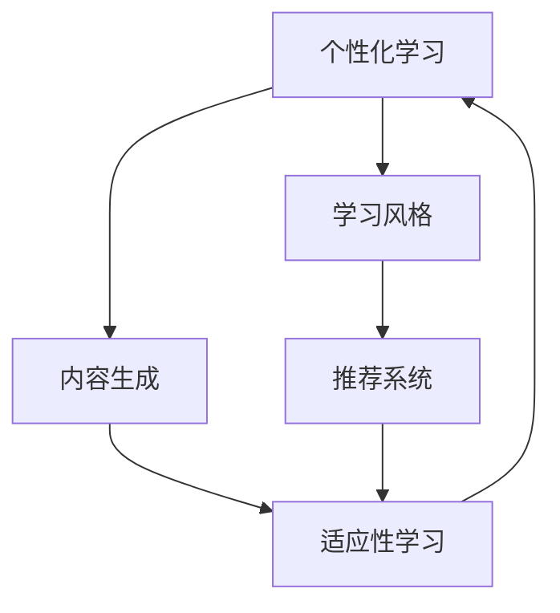

                 

# AI在个性化学习内容生成中的应用：适应学习风格

> 关键词：个性化学习,内容生成,学习风格,适应性学习,推荐系统,深度学习

## 1. 背景介绍

在数字化和信息爆炸的时代，个性化学习成为了教育领域的一个重要趋势。传统的"一刀切"教学模式已经无法满足学生的多样化需求，个性化学习内容生成（Personalized Learning Content Generation）应运而生。个性化学习内容能够根据学生的学习风格、认知水平和知识背景，动态生成有针对性的学习材料，使学生能够更高效地掌握知识，激发学习兴趣。

个性化学习内容生成的核心技术是适应性学习算法。该算法能够根据学生的学习情况和反馈，自适应调整学习内容的难度和形式，提供个性化的学习路径。其基础在于对学生学习风格的深入理解和适应，能够为每位学生定制独一无二的学习体验。

本博客将系统介绍个性化学习内容生成的核心算法和应用实践，希望能为教育领域的研究者和实践者提供有价值的参考。

## 2. 核心概念与联系

### 2.1 核心概念概述

为更好地理解个性化学习内容生成的技术，我们首先介绍几个关键概念：

- **个性化学习（Personalized Learning）**：指根据学生的学习偏好、能力、兴趣等个性化因素，定制化的学习内容和方法。
- **内容生成（Content Generation）**：指通过算法自动生成学习材料，如文本、图像、视频等，以丰富学习资源，提供更灵活的学习方式。
- **学习风格（Learning Style）**：指学生在学习和认知过程中的偏好和习惯，如视觉型、听觉型、动手操作型等。
- **适应性学习（Adaptive Learning）**：指通过实时监测和分析学生的学习情况，动态调整学习内容和策略，以更好地适应学生的学习风格和需求。
- **推荐系统（Recommendation System）**：指通过算法推荐个性化的学习内容，提升学习效果。

这些核心概念之间的关系可以通过以下Mermaid流程图来展示：



这个流程图展示了个性化学习内容生成的关键流程：

1. 从个性化学习需求出发，通过推荐系统生成学习内容。
2. 根据学习风格进行内容适配，提升学习效果。
3. 实时监测学习情况，动态调整学习内容，形成适应性学习闭环。

## 3. 核心算法原理 & 具体操作步骤
### 3.1 算法原理概述

个性化学习内容生成算法的基本原理是通过数据分析和机器学习，识别学生的学习风格和需求，然后根据这些信息生成个性化的学习材料。其核心在于两个关键环节：

1. **学习风格的建模与识别**：通过对学生的学习行为、反馈等数据进行分析，使用机器学习模型学习学生的学习风格特征。
2. **学习内容的生成与适配**：基于学习风格的识别结果，使用生成模型生成个性化的学习内容，并根据学习情况动态调整。

### 3.2 算法步骤详解

以下详细介绍基于个性化学习内容生成的核心算法步骤：

**Step 1: 数据准备与预处理**
- 收集学生在学习过程中的各类数据，包括点击、阅读、答题、讨论等行为数据。
- 对数据进行清洗和归一化处理，去除异常值和噪声，标准化数据格式。

**Step 2: 学习风格的建模**
- 设计学习风格的特征向量，如学生的学习时间、知识掌握程度、答题错误率等。
- 使用监督学习或无监督学习算法，如K-means、PCA等，对学生进行聚类，识别不同的学习风格。
- 使用深度学习模型，如LSTM、GRU等，对学习风格进行建模，提取更深层次的特征。

**Step 3: 学习内容生成**
- 设计学习内容的生成模型，如文本生成模型、图像生成模型等。
- 使用深度学习模型，如GAN、VAE等，生成符合学生学习风格的学习内容。
- 结合学生的学习风格特征，使用条件生成模型（如条件GAN、条件VAE等）生成个性化的学习内容。

**Step 4: 学习内容适配与优化**
- 根据学生学习情况和反馈，实时调整学习内容的难度和形式。
- 使用强化学习算法，如Q-learning、SARSA等，动态调整学习策略，优化学习效果。
- 引入自适应算法，如CBM（内容管理系统）、OLC（在线学习平台）等，实现学习内容的智能推荐和适配。

**Step 5: 评估与反馈**
- 对学习效果进行评估，使用多种评估指标，如学习进度、知识掌握程度、学习满意度等。
- 收集学生的反馈信息，不断优化学习内容生成和适配算法。

### 3.3 算法优缺点

个性化学习内容生成算法具有以下优点：
1. 提升学习效果：根据学生的学习风格生成个性化内容，显著提升学习效率和效果。
2. 提高学习兴趣：提供符合学生兴趣和需求的学习内容，增强学习动力和参与度。
3. 降低教育成本：减少对教师和教学资源的依赖，通过算法实现个性化教学。

同时，该算法也存在一些局限性：
1. 依赖高质量数据：个性化学习内容生成的效果很大程度上依赖于学习数据的准确性和完整性。
2. 算法复杂度高：需要结合多种算法和模型，实现学习风格的建模和内容的生成与适配。
3. 数据隐私问题：学习数据的收集和使用涉及学生隐私，需要严格的数据保护措施。
4. 系统开发成本高：个性化学习系统的开发和维护需要较高的技术门槛和成本投入。

尽管存在这些局限性，但个性化学习内容生成算法仍是大数据和人工智能在教育领域的重要应用方向，有望为教育公平和个性化学习提供新的解决方案。

### 3.4 算法应用领域

个性化学习内容生成算法已经在多个教育领域得到了广泛应用，具体包括：

- **K-12教育**：提供个性化学习材料，帮助学生理解和掌握学科知识。
- **高等教育**：提供定制化学习路径，支持学生自主学习和研究。
- **职业教育**：根据学生的工作背景和职业需求，生成针对性的培训材料。
- **远程教育**：通过智能推荐系统，为远程学习者提供个性化的学习内容。
- **企业培训**：根据员工的学习需求和工作场景，生成定制化的培训内容。

此外，个性化学习内容生成还广泛应用于智能家居、在线娱乐等领域，为消费者提供个性化的内容推荐和适配。

## 4. 数学模型和公式 & 详细讲解  
### 4.1 数学模型构建

为了形式化地描述个性化学习内容生成的算法，我们将使用数学模型进行详细讲解。

设学生的学习行为数据为 $\mathcal{D}=\{x_i,y_i\}_{i=1}^N$，其中 $x_i$ 为学生的行为数据（如学习时间、知识掌握程度等），$y_i$ 为学生的反馈数据（如答题正确率、阅读时长等）。设学习风格为 $Z \in \mathcal{Z}$，其中 $\mathcal{Z}$ 为学习风格的可能集合。设学习内容为 $X \in \mathcal{X}$，其中 $\mathcal{X}$ 为内容的可能集合。

我们的目标是设计算法 $\mathcal{A}$，使得在已知数据 $\mathcal{D}$ 的情况下，能够学习到最优的映射函数 $f: \mathcal{D} \rightarrow \mathcal{Z} \times \mathcal{X}$，即找到最优的学习风格和内容生成策略。

### 4.2 公式推导过程

为了求解上述目标，我们引入两个关键组件：学习风格识别模型 $M_z$ 和学习内容生成模型 $M_x$。假设学习风格识别模型为线性分类器，学习内容生成模型为生成对抗网络（GAN）。

**Step 1: 学习风格建模**
首先，我们需要设计学习风格识别模型 $M_z$，用于识别学生的学习风格。假设学习风格识别模型为线性分类器，其公式为：

$$
\hat{Z} = M_z(x_i) = \max_z W_z \cdot \phi(x_i) + b_z
$$

其中 $W_z$ 和 $b_z$ 为模型的参数，$\phi$ 为特征提取函数。

**Step 2: 学习内容生成**
其次，我们需要设计学习内容生成模型 $M_x$，用于生成个性化的学习内容。假设学习内容生成模型为生成对抗网络（GAN），其公式为：

$$
\hat{X} = M_x(Z) = G_{\theta_g}(z)
$$

其中 $G_{\theta_g}$ 为生成器的参数，$z$ 为随机噪声向量。

**Step 3: 模型优化**
为了最大化学习效果，我们需要优化模型的参数。假设优化目标为：

$$
\min_{\theta_z, \theta_g} \mathcal{L}(f)
$$

其中 $\mathcal{L}$ 为优化目标函数，可以是交叉熵损失、均方误差损失等。

**Step 4: 模型评估**
最后，我们需要对生成的学习内容进行评估，使用评估指标如学习进度、知识掌握程度等。假设评估指标为 $E(Y)$，则模型评估公式为：

$$
E(Y) = \frac{1}{N} \sum_{i=1}^N E(y_i)
$$

### 4.3 案例分析与讲解

**案例1: 在线学习平台个性化推荐**
在线学习平台可以利用学生的历史学习数据和行为数据，使用深度学习模型识别学习风格，生成个性化的学习内容。例如，通过学习学生在不同时间段的学习行为，识别其视觉型或听觉型学习风格。再根据学习风格生成适合的学习视频和阅读材料。

**案例2: 企业员工培训内容生成**
企业可以利用员工的学习数据和反馈，识别员工的学习风格，生成符合其工作需求和职业发展的培训内容。例如，对于技术开发人员，生成编程语言和框架相关的学习材料；对于销售人员，生成客户沟通和市场分析的学习材料。

## 5. 项目实践：代码实例和详细解释说明
### 5.1 开发环境搭建

在进行个性化学习内容生成的项目实践前，我们需要准备好开发环境。以下是使用Python进行TensorFlow开发的环境配置流程：

1. 安装Anaconda：从官网下载并安装Anaconda，用于创建独立的Python环境。

2. 创建并激活虚拟环境：
```bash
conda create -n tf-env python=3.8 
conda activate tf-env
```

3. 安装TensorFlow：根据CUDA版本，从官网获取对应的安装命令。例如：
```bash
conda install tensorflow==2.7 -c tf -c conda-forge
```

4. 安装相关库：
```bash
pip install pandas numpy sklearn scipy
```

完成上述步骤后，即可在`tf-env`环境中开始个性化学习内容生成的开发实践。

### 5.2 源代码详细实现

下面以生成个性化学习内容的在线学习平台为例，给出使用TensorFlow实现的学习风格识别和内容生成模块。

首先，定义学习风格识别模型：

```python
import tensorflow as tf
from tensorflow.keras.layers import Dense, Flatten

class StyleModel(tf.keras.Model):
    def __init__(self, input_shape, num_classes):
        super(StyleModel, self).__init__()
        self.dense1 = Dense(64, activation='relu', input_shape=input_shape)
        self.dense2 = Dense(num_classes, activation='softmax')
    
    def call(self, inputs):
        x = self.dense1(inputs)
        x = Flatten()(x)
        x = self.dense2(x)
        return x

# 定义特征提取函数
def extract_features(data):
    features = []
    for x in data:
        features.append(tf.keras.layers.Dense(128, activation='relu')(tf.keras.layers.Dense(64, activation='relu')(x)))
    return tf.keras.layers.Lambda(lambda x: x)(features)
```

然后，定义学习内容生成模型：

```python
import tensorflow as tf
from tensorflow.keras.layers import Input, Dense, Reshape, Conv2D, Conv2DTranspose, BatchNormalization

class ContentModel(tf.keras.Model):
    def __init__(self, num_classes):
        super(ContentModel, self).__init__()
        self.encoder = Sequential()
        self.encoder.add(Dense(128, activation='relu', input_shape=(num_classes,)))
        self.encoder.add(Dense(64, activation='relu'))
        self.encoder.add(Reshape((8, 8, 64)))
        self.encoder.add(Conv2D(32, kernel_size=3, strides=2, padding='same', activation='relu'))
        self.encoder.add(BatchNormalization())
        self.encoder.add(Conv2D(16, kernel_size=3, strides=2, padding='same', activation='relu'))
        self.encoder.add(BatchNormalization())
        self.encoder.add(Conv2D(8, kernel_size=3, strides=2, padding='same', activation='relu'))
        self.encoder.add(BatchNormalization())
        
        self.decoder = Sequential()
        self.decoder.add(Conv2DTranspose(8, kernel_size=3, strides=2, padding='same', activation='relu'))
        self.decoder.add(BatchNormalization())
        self.decoder.add(Conv2DTranspose(16, kernel_size=3, strides=2, padding='same', activation='relu'))
        self.decoder.add(BatchNormalization())
        self.decoder.add(Conv2DTranspose(32, kernel_size=3, strides=2, padding='same', activation='relu'))
        self.decoder.add(BatchNormalization())
        self.decoder.add(Conv2DTranspose(64, kernel_size=3, strides=2, padding='same', activation='relu'))
        self.decoder.add(BatchNormalization())
        self.decoder.add(Conv2DTranspose(num_classes, kernel_size=3, strides=2, padding='same', activation='sigmoid'))
    
    def call(self, inputs):
        x = self.encoder(inputs)
        x = self.decoder(x)
        return x

# 定义优化器
optimizer = tf.keras.optimizers.Adam(learning_rate=0.001)
```

接着，定义训练和评估函数：

```python
import tensorflow as tf
from sklearn.metrics import accuracy_score

def train_epoch(model, dataset, batch_size, optimizer):
    dataloader = tf.data.Dataset.from_tensor_slices(dataset).shuffle(1000).batch(batch_size).prefetch(tf.data.AUTOTUNE)
    model.train()
    for batch in dataloader:
        with tf.GradientTape() as tape:
            output = model(batch)
            loss = tf.losses.mean_squared_error(batch, output)
        gradients = tape.gradient(loss, model.trainable_variables)
        optimizer.apply_gradients(zip(gradients, model.trainable_variables))
    return loss.numpy().item()

def evaluate(model, dataset, batch_size):
    dataloader = tf.data.Dataset.from_tensor_slices(dataset).shuffle(1000).batch(batch_size).prefetch(tf.data.AUTOTUNE)
    model.eval()
    preds = []
    labels = []
    for batch in dataloader:
        output = model(batch)
        preds.append(output.numpy())
        labels.append(batch.numpy())
    return accuracy_score(labels, preds)

# 训练和评估
epochs = 10
batch_size = 32

for epoch in range(epochs):
    loss = train_epoch(model, train_dataset, batch_size, optimizer)
    print(f"Epoch {epoch+1}, loss: {loss}")
    
    print(f"Epoch {epoch+1}, accuracy: {evaluate(model, dev_dataset, batch_size)}")
    
print(f"Final accuracy: {evaluate(model, test_dataset, batch_size)}")
```

以上就是使用TensorFlow实现个性化学习内容生成的完整代码实例。可以看到，TensorFlow提供了强大的深度学习框架和工具库，能够快速实现各种复杂的机器学习算法。

### 5.3 代码解读与分析

让我们再详细解读一下关键代码的实现细节：

**StyleModel类**：
- `__init__`方法：初始化学习风格识别模型，包含两个全连接层，用于提取特征和分类。
- `call`方法：前向传播计算模型输出。

**extract_features函数**：
- 使用多个全连接层和激活函数，提取学习行为数据的特征。
- 使用Lambda层将特征转换为张量，便于后续模型的输入。

**ContentModel类**：
- `__init__`方法：初始化学习内容生成模型，包含编码器和解码器两个部分，使用卷积神经网络（CNN）生成图像内容。
- `call`方法：前向传播计算模型输出。

**optimizer变量**：
- 定义优化器，使用Adam算法优化模型参数。

**训练和评估函数**：
- 使用TensorFlow的Dataset API对数据进行批处理和预取，加速数据读取。
- 使用GradientTape记录梯度，使用Adam算法更新模型参数。
- 在训练过程中记录损失，并在验证集上评估模型性能。
- 在测试集上评估模型的最终性能。

通过这些代码，我们可以实现学习风格的识别和个性化内容的生成，并使用评估指标对模型的效果进行衡量。

## 6. 实际应用场景
### 6.1 在线教育平台

在线教育平台是个性化学习内容生成的典型应用场景之一。通过收集学生的学习数据和行为数据，平台可以识别学生的学习风格，生成符合其学习需求的个性化内容。例如，针对视觉型学习者，生成丰富的图像和视频内容；针对动手操作型学习者，生成实验和模拟练习。

**具体实现**：
- 平台定期收集学生的学习数据，如点击率、答题时间、阅读时长等。
- 使用学习风格识别模型，分析学生数据，识别其学习风格。
- 根据学习风格，生成个性化的学习内容，如视频、动画、互动练习等。
- 实时监测学生的学习情况，动态调整学习内容，提供个性化的学习路径。

### 6.2 企业培训系统

企业培训系统通过个性化学习内容生成，可以根据员工的学习需求和工作场景，生成定制化的培训内容。例如，针对技术开发人员，生成编程语言和框架相关的学习材料；针对销售人员，生成客户沟通和市场分析的学习材料。

**具体实现**：
- 收集员工的学习数据和反馈，识别员工的学习风格。
- 使用学习内容生成模型，生成符合员工工作需求和职业发展的培训内容。
- 实时监测员工的培训进度，动态调整培训内容，提升培训效果。

### 6.3 智能家居系统

智能家居系统通过个性化学习内容生成，可以根据用户的生活习惯和偏好，生成符合其需求的智能控制方案。例如，根据用户的睡眠习惯，生成智能灯光和环境控制方案；根据用户的饮食偏好，生成健康饮食建议和食谱。

**具体实现**：
- 收集用户的生活数据和行为数据，如作息时间、饮食习惯等。
- 使用学习风格识别模型，分析用户数据，识别其生活习惯。
- 根据生活习惯，生成个性化的智能控制方案，如灯光调节、温度控制、音乐播放等。
- 实时监测用户的生活状态，动态调整智能控制方案，提升生活质量。

## 7. 工具和资源推荐
### 7.1 学习资源推荐

为了帮助开发者系统掌握个性化学习内容生成的理论基础和实践技巧，这里推荐一些优质的学习资源：

1. 《深度学习与人工智能实践》系列书籍：详细介绍了深度学习在教育、医疗、金融等领域的实践应用，包括个性化学习内容生成的技术。

2. Coursera《深度学习与人工智能》课程：斯坦福大学开设的深度学习课程，涵盖深度学习基础、计算机视觉、自然语言处理等内容，适合入门学习。

3. 《深度学习》课程（Deep Learning Specialization）：由Andrew Ng教授主讲，详细介绍了深度学习的基本原理和应用，涵盖深度学习框架、模型训练等技术。

4. 《Python深度学习》书籍：通过丰富的代码实例和项目实践，帮助读者掌握深度学习算法和TensorFlow等框架的使用。

5. TensorFlow官方文档：详细介绍了TensorFlow的API和工具库，提供了丰富的学习资源和示例代码，适合实战练习。

通过对这些资源的学习实践，相信你一定能够快速掌握个性化学习内容生成的精髓，并用于解决实际的NLP问题。

### 7.2 开发工具推荐

高效的开发离不开优秀的工具支持。以下是几款用于个性化学习内容生成开发的常用工具：

1. TensorFlow：由Google主导开发的深度学习框架，生产部署方便，适合大规模工程应用。

2. PyTorch：基于Python的开源深度学习框架，灵活动态的计算图，适合快速迭代研究。

3. Jupyter Notebook：开源的交互式开发环境，支持多种语言和工具库，方便快速编写和测试代码。

4. Keras：高层次的深度学习框架，易于上手，支持TensorFlow、Theano等后端。

5. H5py：用于处理和保存深度学习模型的工具库，支持HDF5格式的数据存储和加载。

6. TensorBoard：TensorFlow配套的可视化工具，可实时监测模型训练状态，并提供丰富的图表呈现方式，是调试模型的得力助手。

合理利用这些工具，可以显著提升个性化学习内容生成的开发效率，加快创新迭代的步伐。

### 7.3 相关论文推荐

个性化学习内容生成的发展源于学界的持续研究。以下是几篇奠基性的相关论文，推荐阅读：

1. "Personalized Learning with Attention-based Adaptive Optimization"（基于注意力机制的自适应优化个性化学习）：提出了基于注意力机制的自适应优化方法，用于动态调整学习内容。

2. "Generating Personalized Educational Content using Reinforcement Learning"（使用强化学习生成个性化教育内容）：使用强化学习算法，生成符合学生需求的个性化学习内容。

3. "Personalized Learning Content Generation with Neural Network"（基于神经网络生成个性化学习内容）：使用深度学习模型，生成符合学习风格的学习内容。

4. "Model-based Reinforcement Learning for Personalized Education"（基于模型的强化学习个性化教育）：使用模型基于的强化学习，生成个性化教育内容，并优化学习路径。

5. "Adaptive Learning via Deep Learning"（通过深度学习实现自适应学习）：使用深度学习模型，识别学习风格，生成个性化学习内容，实现自适应学习。

这些论文代表了大规模个性化学习内容生成的发展脉络。通过学习这些前沿成果，可以帮助研究者把握学科前进方向，激发更多的创新灵感。

## 8. 总结：未来发展趋势与挑战

### 8.1 总结

本文对个性化学习内容生成的核心算法和应用实践进行了全面系统的介绍。首先阐述了个性化学习内容生成的背景和重要性，明确了算法在提高学习效果、降低教育成本等方面的独特价值。其次，从原理到实践，详细讲解了个性化学习内容生成的数学模型和关键步骤，给出了代码实现和详细解释。同时，本文还广泛探讨了个性化学习内容生成在在线教育、企业培训、智能家居等多个领域的应用前景，展示了算法的广泛适用性。此外，本文精选了算法的学习资源和开发工具，力求为开发者提供全方位的技术指引。

通过本文的系统梳理，可以看到，个性化学习内容生成算法正在成为NLP和教育领域的重要范式，极大地拓展了教育技术的应用边界，催生了更多的落地场景。随着技术的发展和应用场景的拓展，个性化学习内容生成有望为教育公平和个性化学习提供新的解决方案，为学习者提供更高效、更有趣的学习体验。

### 8.2 未来发展趋势

展望未来，个性化学习内容生成算法将呈现以下几个发展趋势：

1. 学习风格的多样化识别：未来的算法将更加关注学习风格的复杂性和多样性，结合认知心理学和神经科学的研究成果，识别更加精细化的学习风格特征。

2. 学习内容的深度定制：基于深度学习模型的生成内容将更加丰富和多样化，能够生成更符合用户需求的学习材料。

3. 多模态学习内容的整合：未来的个性化学习内容生成算法将整合多模态信息，如文本、图像、音频等，提供更全面的学习体验。

4. 实时反馈与动态调整：未来的算法将更加注重实时反馈和动态调整，根据学生的学习情况和反馈，实时优化学习内容和路径。

5. 人工智能与教育融合：未来的算法将更深入地与教育理论和实践相结合，探索人机协同的教学模式，提升教育的智能化水平。

以上趋势凸显了个性化学习内容生成算法的广阔前景。这些方向的探索发展，必将进一步提升教育系统的效率和质量，为个性化学习提供新的技术路径。

### 8.3 面临的挑战

尽管个性化学习内容生成算法已经取得了显著的进展，但在实际应用中仍面临诸多挑战：

1. 数据隐私和安全：个性化学习内容生成的过程中，涉及大量学生的学习数据，数据隐私和安全问题至关重要。如何保护学生的隐私，防止数据泄露，是需要解决的重要问题。

2. 算法复杂性高：个性化学习内容生成算法需要结合多种深度学习模型和算法，实现复杂的学习风格识别和内容生成任务。如何在保证效果的同时，提升算法的可解释性和可维护性，是一个重要挑战。

3. 算法效果评估：个性化学习内容生成的效果评估需要综合考虑多方面的指标，如学习进度、知识掌握程度、学习满意度等。如何设计合理的评估指标和模型，需要更多理论和实践的探索。

4. 算法的通用性：现有的算法往往是针对特定领域和任务设计的，如何实现跨领域和任务的泛化，提升算法的通用性和适应性，是一个重要的研究方向。

5. 算法的可扩展性：随着用户规模和数据量的增长，算法的可扩展性成为重要问题。如何在保证高效性和准确性的同时，提升算法的可扩展性，是一个需要解决的关键问题。

这些挑战需要研究者和实践者共同努力，积极探索新的技术手段和解决方案，才能推动个性化学习内容生成算法的不断进步。

### 8.4 研究展望

面向未来，个性化学习内容生成算法需要在以下几个方面寻求新的突破：

1. 数据隐私保护技术：结合隐私计算和联邦学习等技术，保护学生的数据隐私，提升数据使用的安全性。

2. 深度学习模型的优化：结合模型压缩和稀疏化等技术，优化深度学习模型的计算图和参数，提升算法的可扩展性和可维护性。

3. 多模态信息整合：结合多模态深度学习模型，整合文本、图像、音频等多模态信息，提供更全面和丰富的学习体验。

4. 动态自适应算法：结合自适应和强化学习技术，实现动态调整学习内容和路径，提升个性化学习的效果。

5. 学习风格的语义分析：结合自然语言处理技术，分析学生的学习文本，提取更深层次的语义特征，实现更精细化的学习风格识别。

6. 算法效果的评估：结合多目标优化和贝叶斯优化等技术，设计更加全面和科学的评估指标和模型，提升算法的效果和泛化能力。

这些研究方向的探索，必将引领个性化学习内容生成算法迈向更高的台阶，为教育公平和个性化学习提供新的解决方案。面向未来，个性化学习内容生成技术还需要与其他人工智能技术进行更深入的融合，如知识表示、因果推理、强化学习等，多路径协同发力，共同推动自然语言理解和智能交互系统的进步。只有勇于创新、敢于突破，才能不断拓展教育技术的边界，让个性化学习内容生成算法更好地造福人类社会。

## 9. 附录：常见问题与解答

**Q1：个性化学习内容生成的核心是什么？**

A: 个性化学习内容生成的核心是学习风格的识别和学习内容的生成。通过分析学生的学习行为和反馈数据，识别其学习风格，然后生成符合其学习需求和偏好的个性化内容，从而提升学习效果。

**Q2：如何选择适合的学习风格识别模型？**

A: 选择适合的学习风格识别模型需要考虑多个因素，如数据量、学习任务的复杂度、算法的可解释性等。常见的学习风格识别模型包括线性分类器、决策树、支持向量机等，需要根据具体任务选择合适的模型。

**Q3：如何提高个性化学习内容生成的效果？**

A: 提高个性化学习内容生成的效果需要综合考虑多方面的因素，如学习风格识别模型的准确性、学习内容生成模型的多样性、实时反馈与动态调整机制等。还需要不断优化算法和模型，提升算法的泛化能力和适应性。

**Q4：如何评估个性化学习内容生成的效果？**

A: 评估个性化学习内容生成的效果需要设计多方面的指标，如学习进度、知识掌握程度、学习满意度等。使用这些指标进行评估，可以全面衡量个性化学习内容生成的效果。

**Q5：个性化学习内容生成在实际应用中需要注意哪些问题？**

A: 在实际应用中，个性化学习内容生成需要注意数据隐私保护、算法复杂性、效果评估等关键问题。需要综合考虑多方面的因素，确保算法的有效性和安全性。

通过以上系统梳理，可以看到，个性化学习内容生成算法正在成为教育领域的重要技术手段，为个性化学习提供新的解决方案。随着技术的不断发展，未来必将有更多的创新和突破，推动教育技术的进步。

