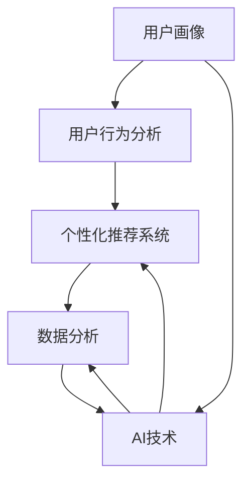

                 

# 精准定位：直达用户内心

> 关键词：精准定位,用户洞察,客户体验,个性化推荐,数据驱动,人工智能,机器学习

## 1. 背景介绍

在数字化转型的浪潮下，企业纷纷转型数字化，通过数据分析和人工智能(AI)技术深入理解用户需求，提升用户体验和满意度。然而，数据量大、维度高、分布复杂，如何精准定位用户需求，并提供个性化的服务和产品，仍然是一个挑战。本文将详细探讨精准定位的原理与实践，帮助企业提升用户洞察能力，打造卓越的客户体验。

### 1.1 问题由来

随着数字营销和电子商务的蓬勃发展，用户行为数据呈指数级增长，这为精准定位提供了丰富素材。但随之而来的是数据处理的复杂性和分析的难度。如何高效利用海量数据，洞察用户行为，制定精准营销策略，提升客户体验，成为众多企业亟需解决的问题。

### 1.2 问题核心关键点

精准定位的核心在于通过数据分析，洞察用户需求，提供个性化服务。具体来说：

- **数据驱动**：企业需要从各种渠道收集用户数据，并利用这些数据驱动决策和行动。
- **个性化推荐**：通过对用户行为和偏好的深入分析，为每位用户提供量身定制的推荐。
- **用户洞察**：利用AI技术，深入理解用户的真实需求和行为模式，制定更具针对性的营销策略。
- **实时反馈**：建立闭环反馈机制，不断优化定位模型和推荐策略，提升用户体验。

## 2. 核心概念与联系

### 2.1 核心概念概述

精准定位涉及以下几个核心概念：

- **用户画像(User Profile)**：描述用户特征和行为的数据集合。通过分析用户行为数据，构建用户画像，描绘用户的完整形象。
- **用户行为分析**：研究用户的行为模式，如浏览记录、购买行为、评价反馈等，挖掘用户需求和兴趣。
- **个性化推荐系统**：根据用户画像和行为数据，推荐个性化的产品和服务，提升用户体验。
- **数据分析**：包括数据采集、清洗、处理、分析等环节，确保数据准确可靠。
- **AI技术**：利用机器学习、深度学习等AI技术，提升数据处理和分析的精度和效率。

这些概念通过一系列的算法和技术手段相互关联，形成了一个完整的精准定位系统。

### 2.2 核心概念原理和架构的 Mermaid 流程图



该图展示了精准定位的核心概念和它们之间的关系。从用户画像出发，通过用户行为分析，进入个性化推荐系统，最终通过数据分析和AI技术支持，实现精准定位。

## 3. 核心算法原理 & 具体操作步骤
### 3.1 算法原理概述

精准定位的本质是通过数据分析和机器学习模型，从海量数据中提取用户行为特征，构建用户画像，进而为用户提供个性化的服务和产品。

### 3.2 算法步骤详解

#### 3.2.1 数据收集

收集用户在各种渠道上的行为数据，如点击记录、浏览记录、购买记录、评价反馈等。这些数据可以是来自网站、APP、社交媒体等渠道。

#### 3.2.2 数据清洗和处理

对收集到的数据进行清洗和预处理，如去重、填充缺失值、数据标准化等，确保数据的质量和一致性。

#### 3.2.3 特征提取

通过统计分析和模型训练，提取用户行为特征，如点击次数、浏览时长、购买金额等。

#### 3.2.4 用户画像构建

利用机器学习算法，如K-means聚类、协同过滤等，将用户按照特征相似度划分为不同的群体，构建用户画像。

#### 3.2.5 个性化推荐

基于用户画像和行为数据，设计推荐算法，如基于内容的推荐、协同过滤、基于深度学习的推荐等，提供个性化的产品和服务。

#### 3.2.6 效果评估

通过A/B测试、用户反馈等手段，评估推荐效果，不断优化推荐策略。

### 3.3 算法优缺点

#### 3.3.1 优点

- **高效性**：通过数据驱动的算法，能够快速响应市场变化，优化推荐策略。
- **个性化**：利用机器学习模型，提供个性化的推荐服务，提升用户体验。
- **精准度**：通过深入分析用户行为数据，精准定位用户需求，提高转化率。

#### 3.3.2 缺点

- **数据隐私**：收集和分析用户行为数据需要遵守隐私保护法规，如GDPR等。
- **数据质量**：数据收集和处理环节容易出现噪声和错误，影响分析和结果。
- **算法复杂**：机器学习算法复杂度高，需要大量的计算资源和专业知识。

### 3.4 算法应用领域

精准定位技术在多个领域得到了广泛应用，包括：

- **电子商务**：通过个性化推荐系统，提升用户购物体验和转化率。
- **金融服务**：利用用户画像和行为分析，设计精准营销策略，提升客户忠诚度和满意度。
- **媒体娱乐**：根据用户偏好，推荐个性化内容，提升用户粘性和满意度。
- **旅游服务**：通过分析用户行为数据，提供个性化的旅游建议和服务。

## 4. 数学模型和公式 & 详细讲解 & 举例说明

### 4.1 数学模型构建

设用户集合为 $U$，特征集合为 $F$，行为集合为 $B$。精准定位模型可以表示为：

$$
M(U, F, B) = \{u \in U | \exists f \in F, b \in B, u \in f \wedge b \in f\}
$$

其中 $u$ 表示用户，$f$ 表示特征，$b$ 表示行为。精准定位模型从特征和行为两个维度，描绘用户画像。

### 4.2 公式推导过程

假设用户 $u$ 在特征 $f$ 上的行为 $b$ 的兴趣值为 $p(u, f, b)$，则用户 $u$ 的兴趣画像可以表示为：

$$
\text{Interest}_u = \sum_{f \in F} \sum_{b \in B} p(u, f, b)
$$

利用协同过滤算法，构建用户兴趣矩阵 $P$，其元素 $P(u, f)$ 表示用户 $u$ 在特征 $f$ 上的兴趣值。协同过滤算法的核心在于利用用户间相似度和物品间相似度，推荐用户可能感兴趣的产品或服务。

### 4.3 案例分析与讲解

假设某电商平台收集了用户的浏览和购买数据，利用协同过滤算法，为用户 $u_1$ 推荐产品 $p_1$ 和 $p_2$。协同过滤算法的基本步骤如下：

1. 计算用户间相似度。
2. 计算物品间相似度。
3. 计算用户对物品的兴趣值。
4. 基于兴趣值，推荐相关物品。

具体实现步骤如下：

1. 计算用户 $u_1$ 和 $u_2$ 的相似度 $sim(u_1, u_2)$。
2. 计算物品 $p_1$ 和 $p_2$ 的相似度 $sim(p_1, p_2)$。
3. 计算用户 $u_1$ 对物品 $p_1$ 和 $p_2$ 的兴趣值 $P(u_1, p_1)$ 和 $P(u_1, p_2)$。
4. 基于 $sim(u_1, u_2)$ 和 $sim(p_1, p_2)$，推荐物品 $p_2$ 给用户 $u_1$。

## 5. 项目实践：代码实例和详细解释说明

### 5.1 开发环境搭建

本节将介绍如何使用Python进行精准定位系统的开发环境搭建。

1. 安装Python：下载并安装Python，如Python 3.7+。
2. 安装依赖包：使用pip安装TensorFlow、Pandas、NumPy等依赖包。
3. 搭建开发环境：使用Jupyter Notebook创建开发环境。

### 5.2 源代码详细实现

以下是一个基于协同过滤算法的个性化推荐系统示例代码。

```python
import numpy as np
import pandas as pd
from scipy.spatial.distance import cosine

# 用户行为数据
data = {
    'user_id': [1, 1, 2, 2, 3, 3, 3],
    'item_id': [1, 2, 3, 4, 5, 6, 7],
    'interest': [1, 0, 1, 0, 0, 1, 1]
}
df = pd.DataFrame(data)

# 用户和物品的相似度矩阵
def similarity_matrix(df):
    user_ids = df['user_id'].unique()
    item_ids = df['item_id'].unique()
    
    similarity = {}
    for user_id in user_ids:
        similarity[user_id] = {}
        for item_id in item_ids:
            similarity[user_id][item_id] = 0
            for other_user_id in user_ids:
                for other_item_id in item_ids:
                    if user_id != other_user_id and item_id != other_item_id:
                        similarity[user_id][item_id] += df[(df['user_id'] == user_id) & (df['item_id'] == other_item_id) & (df['user_id'] == other_user_id) & (df['item_id'] == item_id)]['interest'].mean()
    
    return similarity

similarity = similarity_matrix(df)

# 推荐系统
def recommend_system(similarity, user_id, top_n=5):
    recommendations = {}
    for item_id, similarity_value in similarity[user_id].items():
        recommendations[item_id] = similarity_value
    
    top_n_items = sorted(recommendations, key=recommendations.get, reverse=True)[:top_n]
    return top_n_items

recommendations = recommend_system(similarity, 1)

print(recommendations)
```

### 5.3 代码解读与分析

**similarity_matrix函数**：
- 根据用户行为数据，计算用户和物品的相似度矩阵，即用户对物品的兴趣值。

**recommend_system函数**：
- 根据用户对物品的兴趣值，推荐物品。

## 6. 实际应用场景

### 6.1 智能客服系统

基于精准定位技术，企业可以构建智能客服系统，提升用户满意度。通过分析用户行为数据，识别常见问题和用户需求，智能推荐解决方案，减少客户等待时间，提升用户体验。

### 6.2 金融服务

金融行业通过精准定位技术，可以识别高价值客户和潜在客户，设计个性化营销策略，提升客户忠诚度和满意度。同时，利用用户画像，优化风险控制，减少欺诈行为。

### 6.3 媒体娱乐

媒体娱乐行业通过精准定位技术，推荐个性化内容，提升用户粘性和满意度。如视频平台根据用户观看记录和评分，推荐相关视频和电影，增强用户体验。

### 6.4 旅游服务

旅游行业利用精准定位技术，提供个性化的旅游建议和服务。如根据用户的浏览记录和预订历史，推荐适合的旅游线路和酒店，提升用户满意度。

## 7. 工具和资源推荐

### 7.1 学习资源推荐

1. 《Python数据分析与科学计算》：介绍Python在数据分析和科学计算中的应用。
2. 《深度学习》：介绍深度学习的基础知识和常用算法。
3. 《数据分析实战》：通过实例讲解数据分析的常用方法和工具。
4. 《机器学习实战》：通过案例讲解机器学习模型的应用。
5. 《数据科学基础》：讲解数据科学的基础知识和实践方法。

### 7.2 开发工具推荐

1. Python：广泛使用的编程语言，支持数据处理和机器学习。
2. Jupyter Notebook：交互式开发环境，支持代码编写和数据可视化。
3. TensorFlow：开源机器学习框架，支持深度学习模型的训练和部署。
4. PyTorch：开源机器学习框架，支持深度学习模型的训练和推理。
5. Keras：基于TensorFlow和Theano的高级神经网络API，易于使用。

### 7.3 相关论文推荐

1. "Precision and recall trade-offs in recommendation systems: Why most systems get the wrong answer most of the time"（JRCT 2006）：探讨推荐系统中的精度和召回率问题，提出改进方法。
2. "A probabilistic latent semantic analysis approach to collaborative filtering"（KDD 2001）：提出基于概率潜在语义分析的协同过滤算法。
3. "Collaborative Filtering for Implicit Feedback Datasets"（UAI 2002）：提出基于矩阵分解的协同过滤算法。
4. "A survey of recommender systems"（JASIS 2002）：综述推荐系统的主要方法和应用。
5. "Real-time recommendations with attention and memory networks"（NeurIPS 2015）：提出基于注意力机制和记忆网络的推荐系统。

## 8. 总结：未来发展趋势与挑战

### 8.1 研究成果总结

精准定位技术通过数据驱动和机器学习算法，实现用户行为的深入分析，构建用户画像，提供个性化推荐。目前已经广泛应用于电子商务、金融服务、媒体娱乐、旅游服务等多个领域。

### 8.2 未来发展趋势

未来精准定位技术将呈现以下几个发展趋势：

1. **数据智能化**：通过物联网和传感器技术，收集用户行为数据，提高数据的时效性和准确性。
2. **算法优化**：利用深度学习和强化学习等先进算法，提升推荐系统的精度和效果。
3. **用户隐私保护**：在数据收集和分析过程中，采用差分隐私和联邦学习等技术，保护用户隐私。
4. **跨领域融合**：将精准定位技术与自然语言处理、计算机视觉等技术融合，实现多模态数据的深度分析。
5. **实时响应**：建立实时反馈机制，不断优化推荐策略，提升用户体验。

### 8.3 面临的挑战

精准定位技术在发展过程中，仍面临诸多挑战：

1. **数据质量**：数据收集和处理环节容易出现噪声和错误，影响分析和结果。
2. **用户隐私**：在数据收集和分析过程中，需要遵守隐私保护法规，保护用户隐私。
3. **算法复杂度**：机器学习算法复杂度高，需要大量的计算资源和专业知识。
4. **模型透明性**：推荐模型的决策过程缺乏透明性，难以解释其内部工作机制和决策逻辑。
5. **模型鲁棒性**：推荐模型容易受到数据噪声和干扰，需要进一步提升模型的鲁棒性。

### 8.4 研究展望

未来精准定位技术需要在以下几个方面进行进一步的研究和探索：

1. **多模态融合**：将精准定位技术与自然语言处理、计算机视觉等技术融合，实现多模态数据的深度分析。
2. **联邦学习**：利用联邦学习技术，保护用户隐私的同时，实现跨领域数据的联合分析。
3. **可解释性**：开发可解释性更高的推荐模型，增强模型的透明性和可信度。
4. **实时推荐**：建立实时反馈机制，不断优化推荐策略，提升用户体验。
5. **跨领域应用**：将精准定位技术应用到更多垂直领域，实现更广泛的用户需求洞察和个性化服务。

总之，精准定位技术将持续推动企业数字化转型，提升用户体验和满意度。但同时也面临着数据质量、用户隐私、算法复杂度等诸多挑战，需要企业积极应对，不断创新。相信随着技术的不断进步，精准定位技术将带来更广阔的应用前景，赋能各行各业，引领数字化未来。

---

作者：禅与计算机程序设计艺术 / Zen and the Art of Computer Programming

