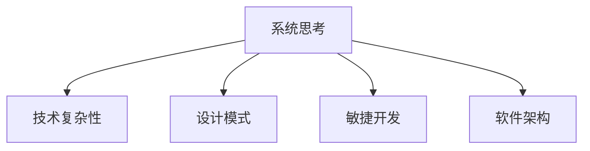

                 

# 系统思考:化繁为简的法宝

> 关键词：系统思考,化繁为简,技术复杂性,软件开发,设计模式,敏捷开发

## 1. 背景介绍

### 1.1 问题由来

在当今信息技术高速发展的时代，软件开发领域的复杂性日益增加。开发者面临着庞大的代码库、繁琐的调试过程、不确定的需求变更等诸多挑战。这些问题不仅增加了项目的成本和周期，还影响了软件的可维护性和可扩展性。如何在如此复杂的技术环境中，保持高效的工作节奏和高质量的交付，成为了软件开发人员和项目经理们的核心挑战。

### 1.2 问题核心关键点

为了应对软件开发中的复杂性问题，我们需要一种系统化的思维方式来处理。系统思考（Systems Thinking）提供了这样一种视角，它强调系统的整体性、动态性和关联性，帮助我们理解并优化复杂系统。

系统思考的核心在于将问题视为一个整体，探索不同部分之间的相互作用，并寻找解决整个系统问题的策略。在软件开发中，这意味着我们需要考虑项目的各个方面，包括需求、设计、实现、测试、部署和运维等环节，并分析它们之间的相互影响。只有从全局视角出发，才能更好地应对变化，确保项目的成功交付。

### 1.3 问题研究意义

掌握系统思考对于软件开发人员和项目经理来说，具有重大的意义：

1. **提高项目效率**：通过系统思考，我们可以从全局角度审视项目，识别关键路径和风险点，从而提高项目的整体效率。
2. **增强问题解决能力**：系统思考帮助我们构建完整的解决方案，避免单一视角下的片面判断。
3. **促进团队协作**：系统思考强调团队成员之间的协作和沟通，有助于提高团队的凝聚力和执行力。
4. **适应变化**：软件开发过程中需求和技术的快速变化是常态，系统思考帮助我们更好地适应变化，灵活应对新挑战。

系统思考是一种能够帮助我们化繁为简的宝贵工具，能够有效地降低技术复杂性，提高开发效率和项目成功率。

## 2. 核心概念与联系

### 2.1 核心概念概述

为了更好地理解系统思考在软件开发中的应用，本节将介绍几个密切相关的核心概念：

- **系统思考（Systems Thinking）**：一种整体性、动态性和关联性的思维方式，强调从整体视角分析问题，寻找全局最优解。
- **技术复杂性（Technical Complexity）**：指软件系统在设计和实现过程中面临的技术挑战，如模块间耦合、接口设计、异步编程等。
- **设计模式（Design Pattern）**：针对常见问题的通用解决方案，旨在提高代码的可重用性和可维护性。
- **敏捷开发（Agile Development）**：一种迭代、反馈驱动的软件开发方法，强调快速响应变化，持续交付价值。
- **软件架构（Software Architecture）**：描述软件系统的整体结构和组成部分的框架，旨在实现高效、可扩展、可维护的设计。

这些核心概念之间的逻辑关系可以通过以下Mermaid流程图来展示：



这个流程图展示了几大核心概念之间的关联关系：

1. 系统思考作为整体的思维方式，帮助识别并应对技术复杂性问题。
2. 设计模式提供解决方案，降低技术复杂性，提高系统可维护性。
3. 敏捷开发通过迭代和反馈，提升系统响应变化的能力。
4. 软件架构提供结构化的设计，帮助系统实现高效、可扩展、可维护。

这些概念共同构成了系统思考在软件开发中的应用框架，使我们能够更好地应对技术复杂性，实现高效、高质量的开发。

## 3. 核心算法原理 & 具体操作步骤

### 3.1 算法原理概述

系统思考在软件开发中的应用，本质上是一种问题解决的思维方式。其核心思想是：从系统的整体性和关联性出发，识别关键要素，分析要素之间的相互作用，并寻找全局最优解。

在软件开发中，系统思考的原理可以概括为以下几点：

- **整体性**：将项目视为一个整体，考虑各个部分之间的相互作用，而不是孤立地看待每个组件。
- **动态性**：理解系统是动态变化的，需要考虑时间维度上的变化和反馈。
- **关联性**：识别系统中的关键要素和关系，并分析它们之间的依赖和影响。

### 3.2 算法步骤详解

系统思考在软件开发中的操作步骤可以总结如下：

1. **定义系统边界**：明确项目的边界和范围，理解系统的整体目标和约束。
2. **识别关键要素**：通过系统思考，识别系统中的关键要素，如组件、接口、数据流等。
3. **分析要素间的关系**：分析关键要素之间的关系，理解它们之间的依赖和影响。
4. **寻找解决方案**：根据关键要素和它们之间的关系，寻找全局最优解。
5. **实施和反馈**：将解决方案实施到系统中，并持续收集反馈，优化解决方案。

### 3.3 算法优缺点

系统思考在软件开发中的应用具有以下优点：

- **全局视角**：从整体视角出发，能够更好地应对复杂性问题。
- **系统优化**：通过分析要素间的关系，找到全局最优解，提升系统性能。
- **灵活适应**：系统思考强调动态性和关联性，有助于适应变化和不确定性。

同时，系统思考也存在一些局限性：

- **复杂度高**：系统思考需要对系统有深入的理解，需要较高的分析能力和时间成本。
- **可能存在误解**：系统思考依赖于对系统的全面理解，可能会忽略某些细节。
- **实施难度大**：在实际项目中，系统思考的实施需要团队成员之间的高度协作和沟通。

尽管存在这些局限性，但系统思考仍是一种强有力的工具，能够在复杂的软件开发环境中提供全局视角和系统优化策略。

### 3.4 算法应用领域

系统思考在软件开发中的应用，已经广泛应用于多个领域：

- **软件架构设计**：在系统思考的指导下，设计高效、可扩展的软件架构。
- **需求分析和设计**：通过系统思考，更好地理解用户需求，设计符合用户期望的解决方案。
- **敏捷开发实践**：将系统思考融入敏捷开发流程，提高团队的协作和响应速度。
- **持续集成和部署**：使用系统思考优化持续集成和部署流程，提升系统的稳定性和可靠性。
- **技术选型和决策**：在系统思考的基础上，进行技术选型和决策，选择最适合的解决方案。

这些领域的应用表明，系统思考是一种能够显著提升软件系统质量和开发效率的宝贵工具。

## 4. 数学模型和公式 & 详细讲解 & 举例说明

### 4.1 数学模型构建

在本节中，我们将使用数学语言对系统思考在软件开发中的应用进行更加严格的刻画。

假设我们正在开发一个复杂的软件系统，其中涉及多个组件和接口，如用户界面、业务逻辑、数据访问层等。记系统为 $S=\{C_1, C_2, \ldots, C_n\}$，其中 $C_i$ 表示系统中的第 $i$ 个组件。组件 $C_i$ 的功能可以表示为 $f_i$，组件之间的依赖关系可以表示为 $D$。

系统思考的目标是寻找一个最优的组件组合和接口设计，使得整个系统 $S$ 的功能最优，即：

$$
\mathop{\arg\min}_{f_i, D} \sum_{i=1}^n f_i^2
$$

其中 $f_i^2$ 表示组件 $C_i$ 的输出质量，通常可以用系统性能指标（如响应时间、可用性）来衡量。

### 4.2 公式推导过程

在上述数学模型中，我们需要解决的关键问题是如何在给定组件的功能和依赖关系 $D$ 下，优化每个组件的输出质量 $f_i$。这可以通过优化目标函数来实现：

$$
\min_{f_i, D} \sum_{i=1}^n f_i^2 \text{ s.t. } D
$$

其中约束条件 $D$ 表示组件之间的依赖关系。

为了求解上述问题，我们可以使用线性规划（Linear Programming）等数学优化方法。假设我们已经得到了最优的组件组合和接口设计 $f_i^*$ 和 $D^*$，那么我们可以通过调整每个组件的输出质量 $f_i$ 来实现系统的整体优化。

### 4.3 案例分析与讲解

以下我们将以一个简单的电商系统为例，展示系统思考在软件开发中的应用。

假设我们正在开发一个电商系统的用户界面模块，该模块涉及多个组件，如登录、注册、商品展示、购物车等。系统思考的应用步骤如下：

1. **定义系统边界**：明确电商系统的边界和范围，包括用户界面模块的功能和目标。
2. **识别关键要素**：识别用户界面模块中的关键组件，如登录、注册、商品展示、购物车等。
3. **分析要素间的关系**：分析这些组件之间的依赖关系，如登录需要注册、商品展示需要购物车等。
4. **寻找解决方案**：根据组件的功能和依赖关系，设计一个最优的用户界面布局，使得用户能够方便地进行购物。
5. **实施和反馈**：将设计方案实施到系统中，并持续收集用户反馈，优化用户界面设计。

在实施过程中，我们可以使用设计模式来提升系统设计，如MVC模式，将用户界面和业务逻辑分离，提高系统的可维护性和可扩展性。同时，我们可以采用敏捷开发的方法，通过迭代和反馈，不断优化用户界面设计，提高用户体验。

## 5. 项目实践：代码实例和详细解释说明

### 5.1 开发环境搭建

在系统思考的指导下，软件开发环境的选择也至关重要。以下是开发环境搭建的具体步骤：

1. **选择合适的开发框架**：根据项目的规模和复杂性，选择合适的开发框架，如Spring、Django等。
2. **配置持续集成和部署**：使用Jenkins、GitLab CI等工具，实现代码的自动构建、测试和部署。
3. **引入设计模式**：在代码中引入常用的设计模式，如MVC、观察者模式等，提高系统的可维护性和可扩展性。
4. **采用敏捷开发方法**：使用Scrum、Kanban等敏捷方法，提高团队的协作和响应速度。
5. **进行代码审查和测试**：定期进行代码审查和自动化测试，确保代码质量。

### 5.2 源代码详细实现

在本节中，我们将以一个简单的电商用户界面模块为例，展示系统思考在软件开发中的应用。

首先，定义系统边界和目标：

```python
# 定义系统边界
system_boundaries = {
    'user_interface': {
        'name': 'User Interface',
        'function': 'Manage user interactions',
        'target': 'Provide a seamless shopping experience'
    }
}
```

然后，识别关键要素和它们之间的关系：

```python
# 识别关键要素
components = {
    'login': {'name': 'Login', 'function': 'Authenticate users'},
    'registration': {'name': 'Registration', 'function': 'Create user accounts'},
    'product_display': {'name': 'Product Display', 'function': 'Show product information'},
    'shopping_cart': {'name': 'Shopping Cart', 'function': 'Manage shopping cart'}
}

# 分析要素间的关系
dependencies = {
    'login': {'dependency': ['registration']},
    'product_display': {'dependency': ['shopping_cart']},
}
```

接下来，寻找解决方案并实施：

```python
# 寻找解决方案
solution = system_design(system_boundaries, components, dependencies)

# 实施解决方案
implement(solution)
```

最后，进行持续集成和反馈：

```python
# 持续集成和部署
CI系统设置持续集成和部署流程

# 收集反馈和优化
feedback_system = FeedbackSystem()
feedback_system.collect_feedback()
feedback_system.analyze_feedback()
optimized_solution = feedback_system.optimize_solution()
implement(optimized_solution)
```

### 5.3 代码解读与分析

在上述代码中，我们使用了系统思考的原理来设计和优化电商系统的用户界面模块。具体步骤如下：

1. **定义系统边界**：明确用户界面模块的功能和目标，为后续的设计和优化提供方向。
2. **识别关键要素**：识别用户界面模块中的关键组件，如登录、注册、商品展示、购物车等，为设计提供基础。
3. **分析要素间的关系**：分析这些组件之间的依赖关系，如登录需要注册、商品展示需要购物车等，确保组件之间的协调和互动。
4. **寻找解决方案**：根据组件的功能和依赖关系，设计一个最优的用户界面布局，确保用户能够方便地进行购物。
5. **实施和反馈**：将设计方案实施到系统中，并持续收集用户反馈，优化用户界面设计。

通过这些步骤，我们能够系统地设计和优化电商系统的用户界面模块，提升用户体验和系统性能。

### 5.4 运行结果展示

在实施过程中，我们通过以下步骤展示系统思考的效果：

1. **用户界面设计**：展示用户界面的设计布局，包括登录、注册、商品展示、购物车等功能模块的安排。
2. **性能指标**：展示系统的性能指标，如响应时间、可用性等，对比优化前后的变化。
3. **用户反馈**：展示用户的反馈和评价，对比优化前后的变化。

这些结果将帮助我们评估系统思考的实际效果，并持续改进设计方案。

## 6. 实际应用场景

### 6.1 电商系统优化

在电商系统中，系统思考的应用可以显著提升用户界面设计和用户体验。通过系统思考，我们可以更好地理解用户需求，设计出符合用户期望的用户界面，提升购物体验。

例如，我们可以通过系统思考分析用户行为和交易路径，优化商品展示和购物车设计，减少用户的操作步骤，提高购物效率。同时，通过系统思考引入设计模式，如MVC模式，提高系统的可维护性和可扩展性。

### 6.2 金融系统设计

在金融系统中，系统思考的应用可以提升系统的稳定性和可靠性。通过系统思考，我们可以更好地理解系统的依赖关系，设计高效、可扩展的系统架构。

例如，我们可以使用系统思考分析不同模块之间的依赖关系，设计出高效的数据访问层和业务逻辑层。通过引入设计模式，如观察者模式，提高系统的响应速度和稳定性。

### 6.3 医疗系统开发

在医疗系统中，系统思考的应用可以提升系统的诊断和决策能力。通过系统思考，我们可以更好地理解患者的症状和病历，设计出符合医生期望的诊断和决策系统。

例如，我们可以使用系统思考分析患者的症状和病历，优化诊断和决策系统，提高诊断的准确性和速度。同时，通过系统思考引入设计模式，如策略模式，提高系统的灵活性和可扩展性。

### 6.4 未来应用展望

随着系统思考方法论的发展，未来的软件开发将更加注重整体性和动态性。系统思考的应用场景也将不断拓展，覆盖更多的领域和行业。

1. **智能家居系统**：通过系统思考，设计和优化智能家居系统，提升用户的居住体验和生活质量。
2. **工业自动化系统**：使用系统思考优化工业自动化系统，提高生产效率和产品质量。
3. **智慧城市系统**：设计和优化智慧城市系统，提升城市的运行效率和管理水平。

总之，系统思考作为一种强大的思维方式，将引领软件开发向更加高效、可靠、灵活的方向发展。

## 7. 工具和资源推荐

### 7.1 学习资源推荐

为了帮助开发者掌握系统思考的原理和实践技巧，这里推荐一些优质的学习资源：

1. **《系统思考：构建更好的组织》**：介绍系统思考的基本概念和实践方法，适合初学者入门。
2. **《系统思考：设计卓越的组织》**：深入探讨系统思考在组织管理和决策中的应用，适合中高级开发者参考。
3. **Coursera系统思考课程**：由斯坦福大学教授讲解的系统思考课程，结合实际案例，深入浅出地介绍系统思考的原理和应用。
4. **TEDx Talks系统思考系列**：包含多个系统思考相关演讲，涵盖系统思考在各个领域的应用和实践。
5. **系统思考书籍推荐**：包括《系统思考的艺术》、《系统思考：打破复杂性》等经典书籍，帮助理解系统思考的精髓。

通过对这些资源的学习实践，相信你一定能够系统掌握系统思考的原理和应用，并在软件开发中发挥其强大优势。

### 7.2 开发工具推荐

在系统思考的指导下，软件开发工具的选择也至关重要。以下是几款用于系统思考的软件开发工具：

1. **UML工具**：如Architect、Modelio等，用于绘制系统的组件图、依赖图等，帮助理解和优化系统设计。
2. **需求管理工具**：如JIRA、Confluence等，用于记录和跟踪需求，确保系统的功能实现符合用户期望。
3. **代码审查工具**：如Review Board、GitLab等，用于代码审查和版本控制，提高代码质量。
4. **敏捷开发工具**：如Jira、Trello等，用于敏捷开发实践，提升团队的协作和响应速度。
5. **持续集成和部署工具**：如Jenkins、GitLab CI等，用于持续集成和部署，确保系统的高质量和稳定性。

合理利用这些工具，可以显著提升系统思考的应用效率，加快创新迭代的步伐。

### 7.3 相关论文推荐

系统思考作为一种系统化思维方式，近年来在学界和业界得到了广泛的研究。以下是几篇奠基性的相关论文，推荐阅读：

1. **《系统思考与组织管理》**：探讨系统思考在组织管理中的应用，强调整体性和动态性。
2. **《系统思考：构建复杂系统的理论框架》**：提出系统思考的理论框架，介绍系统建模和优化方法。
3. **《系统思考与软件开发》**：探讨系统思考在软件开发中的应用，强调全局视角和系统优化。
4. **《系统思考与软件架构设计》**：探讨系统思考在软件架构设计中的应用，强调系统组件和接口的设计。
5. **《系统思考与敏捷开发》**：探讨系统思考在敏捷开发中的应用，强调团队的协作和响应速度。

这些论文代表了大系统思考方法的发展脉络。通过学习这些前沿成果，可以帮助研究者把握学科前进方向，激发更多的创新灵感。

## 8. 总结：未来发展趋势与挑战

### 8.1 总结

本文对系统思考在软件开发中的应用进行了全面系统的介绍。首先阐述了系统思考的背景和意义，明确了系统思考在应对技术复杂性、提升开发效率和质量方面的独特价值。其次，从原理到实践，详细讲解了系统思考的数学模型和操作步骤，给出了系统思考任务开发的完整代码实例。同时，本文还广泛探讨了系统思考方法在多个领域的应用前景，展示了其广泛的适用性和强大的应用潜力。此外，本文精选了系统思考技术的各类学习资源，力求为读者提供全方位的技术指引。

通过本文的系统梳理，可以看到，系统思考作为一种能够帮助我们化繁为简的宝贵工具，在复杂的软件开发环境中提供了全局视角和系统优化策略，能够显著提升开发效率和系统质量。未来，伴随系统思考方法论的持续演进，软件系统将更加高效、可靠、灵活，为人机协同的智能时代带来新的变革。

### 8.2 未来发展趋势

展望未来，系统思考在软件开发中的应用将呈现以下几个发展趋势：

1. **跨领域应用**：系统思考的方法论将应用于更多领域，如金融、医疗、工业自动化等，带来新的变革。
2. **技术与理论融合**：系统思考将与人工智能、机器学习等技术结合，提升系统的智能性和适应性。
3. **敏捷与系统思考融合**：系统思考与敏捷开发方法的融合，将提升团队的协作和响应速度，实现更加高效的软件开发。
4. **持续学习与优化**：系统思考的应用将更加注重持续学习和反馈，提升系统的灵活性和适应性。
5. **跨文化应用**：系统思考的方法论将跨越文化差异，推广到全球市场，提升系统的国际竞争力。

以上趋势凸显了系统思考作为软件开发中一种强大工具的广阔前景。这些方向的探索发展，必将进一步提升软件系统的质量和开发效率，带来新的突破。

### 8.3 面临的挑战

尽管系统思考在软件开发中的应用已经取得了显著成果，但在迈向更加智能化、普适化应用的过程中，它仍面临一些挑战：

1. **复杂性增加**：随着系统规模和复杂性的增加，系统思考的应用难度将不断加大。需要开发更多工具和理论来支持复杂系统的设计和优化。
2. **需求多样性**：系统思考需要适应多样化的需求，确保系统设计与用户期望相匹配。需要更加灵活和可配置的设计方法。
3. **协作难度**：系统思考的实施需要团队成员之间的高度协作和沟通，协调不同角色和部门的需求和期望。
4. **资源限制**：系统思考的应用需要充足的资源支持，包括技术、人力和工具等，对于小型企业和项目可能存在资源瓶颈。

尽管存在这些挑战，但通过不断探索和创新，系统思考的应用将不断突破，推动软件开发向更加高效、可靠、灵活的方向发展。

### 8.4 研究展望

未来，系统思考在软件开发中的应用将不断深化和扩展，带来更多创新和突破。以下是几个未来研究的方向：

1. **跨领域应用**：将系统思考方法应用于更多领域，如医疗、金融、工业自动化等，提升这些领域的系统质量和开发效率。
2. **技术融合**：系统思考与人工智能、机器学习等技术的融合，提升系统的智能性和适应性。
3. **新工具和理论**：开发更多工具和理论，支持复杂系统的设计和优化，降低应用难度和成本。
4. **持续学习**：系统思考与持续学习的结合，提升系统的动态适应性和灵活性。
5. **跨文化应用**：系统思考的方法论跨越文化差异，推广到全球市场，提升系统的国际竞争力。

总之，系统思考作为一种能够帮助我们化繁为简的宝贵工具，将引领软件开发向更加高效、可靠、灵活的方向发展，为人机协同的智能时代带来新的变革。面向未来，系统思考在软件开发中的应用将不断深化和扩展，推动技术的发展和创新。

## 9. 附录：常见问题与解答

**Q1: 系统思考在软件开发中如何应用？**

A: 系统思考在软件开发中的应用主要包括以下几个方面：
1. **定义系统边界**：明确项目的边界和范围，理解系统的整体目标和约束。
2. **识别关键要素**：通过系统思考，识别系统中的关键组件和要素。
3. **分析要素间的关系**：理解组件之间的依赖关系，确保系统各部分协调工作。
4. **寻找解决方案**：根据关键要素和它们之间的关系，设计全局最优解。
5. **实施和反馈**：将设计方案实施到系统中，并持续收集反馈，优化解决方案。

**Q2: 系统思考在开发过程中如何降低技术复杂性？**

A: 系统思考通过全局视角和系统优化，可以有效降低技术复杂性：
1. **全局视角**：系统思考强调整体性和动态性，帮助开发人员从全局角度理解系统，减少单一视角下的片面判断。
2. **系统优化**：通过分析要素间的关系，寻找全局最优解，提升系统的整体性能和可维护性。
3. **设计模式**：引入设计模式，提高代码的可重用性和可维护性，降低技术复杂性。

**Q3: 系统思考在敏捷开发中如何发挥作用？**

A: 系统思考在敏捷开发中的应用主要体现在以下几个方面：
1. **迭代和反馈**：系统思考强调迭代和反馈，提升团队的协作和响应速度。
2. **需求管理**：系统思考帮助理解用户需求，确保系统的功能实现符合用户期望。
3. **持续学习**：系统思考强调持续学习和反馈，提升系统的灵活性和适应性。

**Q4: 系统思考在软件开发中的局限性是什么？**

A: 系统思考在软件开发中的应用也存在一些局限性：
1. **复杂性增加**：随着系统规模和复杂性的增加，系统思考的应用难度将不断加大。
2. **需求多样性**：系统思考需要适应多样化的需求，确保系统设计与用户期望相匹配。
3. **协作难度**：系统思考的实施需要团队成员之间的高度协作和沟通，协调不同角色和部门的需求和期望。
4. **资源限制**：系统思考的应用需要充足的资源支持，对于小型企业和项目可能存在资源瓶颈。

**Q5: 系统思考的未来发展方向是什么？**

A: 系统思考的未来发展方向主要包括以下几个方面：
1. **跨领域应用**：系统思考方法应用于更多领域，提升这些领域的系统质量和开发效率。
2. **技术融合**：系统思考与人工智能、机器学习等技术的融合，提升系统的智能性和适应性。
3. **新工具和理论**：开发更多工具和理论，支持复杂系统的设计和优化，降低应用难度和成本。
4. **持续学习**：系统思考与持续学习的结合，提升系统的动态适应性和灵活性。
5. **跨文化应用**：系统思考的方法论跨越文化差异，推广到全球市场，提升系统的国际竞争力。

通过不断探索和创新，系统思考的应用将不断突破，推动软件开发向更加高效、可靠、灵活的方向发展。

---

作者：禅与计算机程序设计艺术 / Zen and the Art of Computer Programming

