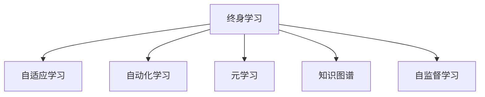

                 

# 终身学习：应对知识爆炸的必由之路

> 关键词：终身学习,知识爆炸,自适应学习,自动化学习,元学习

## 1. 背景介绍

在21世纪，人类社会正处于一场前所未有的知识爆炸之中。随着互联网的普及、信息技术的飞速发展，每天产生的海量数据和知识，让人类面临着前所未有的学习挑战。在过去的几个世纪里，人类依靠学校教育和书籍积累知识，但在大数据时代，这些传统学习方式已无法满足人们对知识的渴求。

### 1.1 知识爆炸的驱动因素

1. **数据和信息的激增**：
    - 数字化进程的加快，使得数据无处不在，从文本、图像、音频、视频，到社交媒体、物联网等各类信息源，每天都在产生大量的数据。
    - 这些数据不仅仅来源于结构化数据，还包括非结构化数据、大数据等形式，使得数据量呈现爆炸式增长。

2. **计算技术的突破**：
    - 高性能计算、云计算、分布式计算技术的进步，大幅提升了数据处理能力和计算效率，使得海量数据能够被迅速分析和处理。
    - 深度学习、神经网络、自然语言处理等技术的发展，为知识爆炸时代的知识处理和应用提供了强有力的工具。

3. **人类学习需求的增长**：
    - 终身学习理念的推广，使得人们更加注重持续学习和自我提升。教育、职业发展、兴趣爱好等方面对知识的获取和应用需求不断增加。
    - 在线学习、社交媒体、移动应用等新兴学习渠道的普及，使人们可以随时随地进行学习。

### 1.2 终身学习的必要性

面对知识爆炸的挑战，终身学习成为一种必要的选择：
1. **适应快速变化的环境**：
    - 知识更新周期缩短，旧的知识体系和技能可能很快过时，终身学习可以帮助个人和企业及时更新知识和技能，适应快速变化的市场环境。

2. **提高个人竞争力**：
    - 终身学习可以持续提升个人的知识和技能水平，增强在职场上的竞争力，更好地应对工作中的挑战和机遇。

3. **促进经济发展**：
    - 终身学习体系有助于培养高素质的人才，推动企业创新和产业升级，促进经济持续健康发展。

## 2. 核心概念与联系

### 2.1 核心概念概述

为更好地理解终身学习的原理和应用，本节将介绍几个密切相关的核心概念：

- **终身学习（Lifelong Learning）**：持续不断地进行学习，以适应新知识和新技能的需求，从而实现个人和组织的持续发展。
- **自适应学习（Adaptive Learning）**：根据学习者的特点和需求，动态调整学习内容和策略，实现个性化的学习效果。
- **自动化学习（Automated Learning）**：使用人工智能技术，自动规划和执行学习过程，减少人为干预，提高学习效率。
- **元学习（Metacognition）**：学习如何学习，即通过学习来提高学习效率和学习策略，实现自我优化。
- **知识图谱（Knowledge Graph）**：利用图结构表示知识，实现知识的高效存储、检索和推理，支持知识驱动的学习。
- **自监督学习（Self-supervised Learning）**：利用无标签数据进行学习，从数据中自动提取知识，减少对人工标注的依赖。

这些核心概念之间的逻辑关系可以通过以下Mermaid流程图来展示：



这个流程图展示了一生学习的核心概念及其之间的关系：

1. **终身学习**：通过持续不断地进行学习，适应新知识和新技能的需求，实现个人和组织的持续发展。
2. **自适应学习**：根据学习者的特点和需求，动态调整学习内容和策略，实现个性化的学习效果。
3. **自动化学习**：使用人工智能技术，自动规划和执行学习过程，减少人为干预，提高学习效率。
4. **元学习**：学习如何学习，即通过学习来提高学习效率和学习策略，实现自我优化。
5. **知识图谱**：利用图结构表示知识，实现知识的高效存储、检索和推理，支持知识驱动的学习。
6. **自监督学习**：利用无标签数据进行学习，从数据中自动提取知识，减少对人工标注的依赖。

这些概念共同构成了终身学习的学习和应用框架，使其能够在各种场景下发挥作用。通过理解这些核心概念，我们可以更好地把握终身学习的内涵和应用方向。

## 3. 核心算法原理 & 具体操作步骤
### 3.1 算法原理概述

终身学习是一个动态、持续的学习过程，其核心思想是通过不断地学习新知识和技能，保持个体和组织的能力和竞争力。其算法原理可以概括为以下几个方面：

1. **动态知识图谱构建**：
    - 利用自监督学习技术，从海量无标签数据中自动提取知识，构建动态更新的知识图谱。
    - 通过图神经网络等技术，实现知识的关联和推理，支持自适应学习。

2. **个性化学习路径规划**：
    - 使用推荐算法，根据学习者的历史学习数据和兴趣，动态规划个性化的学习路径。
    - 引入元学习技术，通过学习来优化学习路径，提高学习效率。

3. **自动化学习过程执行**：
    - 结合人工智能技术，自动化执行学习任务，包括数据获取、学习策略调整、评估反馈等。
    - 利用自适应算法，实时调整学习参数，优化学习效果。

4. **知识驱动的学习框架**：
    - 基于知识图谱和自适应学习，构建知识驱动的学习框架，支持基于知识的推理和应用。
    - 引入因果学习和博弈论技术，增强学习的稳定性和预测能力。

### 3.2 算法步骤详解

终身学习的过程大致包括以下几个关键步骤：

**Step 1: 数据收集与预处理**
- 收集与学习目标相关的数据，并进行数据清洗和预处理，确保数据的质量和可用性。
- 利用自监督学习技术，从数据中自动提取知识，构建初始知识图谱。

**Step 2: 个性化学习路径规划**
- 使用推荐算法，根据学习者的历史学习数据和兴趣，动态规划个性化的学习路径。
- 引入元学习技术，通过学习来优化学习路径，提高学习效率。

**Step 3: 知识图谱更新与关联**
- 利用图神经网络等技术，对知识图谱进行更新和关联，实现知识的动态扩展和应用。
- 引入因果学习和博弈论技术，增强学习的稳定性和预测能力。

**Step 4: 自动化学习过程执行**
- 结合人工智能技术，自动化执行学习任务，包括数据获取、学习策略调整、评估反馈等。
- 利用自适应算法，实时调整学习参数，优化学习效果。

**Step 5: 知识驱动的学习框架构建**
- 基于知识图谱和自适应学习，构建知识驱动的学习框架，支持基于知识的推理和应用。
- 引入因果学习和博弈论技术，增强学习的稳定性和预测能力。

### 3.3 算法优缺点

终身学习的算法具有以下优点：
1. **自适应性强**：根据学习者的特点和需求，动态调整学习内容和策略，实现个性化的学习效果。
2. **学习效率高**：利用自动化和自适应技术，大幅提高学习效率，减少人为干预。
3. **知识驱动**：基于知识图谱和自适应学习，支持基于知识的推理和应用，增强学习效果。
4. **持续改进**：通过不断地学习新知识和技能，保持个体和组织的能力和竞争力。

同时，该算法也存在一些局限性：
1. **数据需求大**：需要大量的数据进行自监督学习，构建知识图谱。
2. **技术门槛高**：算法涉及多领域的技术，如深度学习、自然语言处理、推荐系统等，对技术要求较高。
3. **隐私风险**：大量数据的收集和处理可能带来隐私和安全风险，需要严格的数据保护措施。
4. **复杂度高**：算法复杂度较高，实现和维护成本较高。

尽管存在这些局限性，但终身学习作为一种面向未来的学习范式，仍然具有巨大的潜力和应用前景。

### 3.4 算法应用领域

终身学习在多个领域得到了广泛应用，包括但不限于：

- **教育**：通过个性化学习路径规划和自动化学习过程执行，提高学生的学习效果和兴趣。
- **医疗**：利用自适应学习和知识图谱，帮助医生进行精准诊断和治疗方案优化。
- **金融**：利用终身学习进行风险管理和投资决策，提高金融机构的业务水平和市场竞争力。
- **工业**：通过持续学习和知识驱动的框架，提升生产效率和产品质量，推动工业4.0的发展。
- **政府**：利用终身学习进行政策制定和公共服务优化，提高政府的治理能力和服务质量。
- **商业**：利用个性化推荐和自动化学习，提升电商、广告、社交媒体等领域的用户体验和效果。

## 4. 数学模型和公式 & 详细讲解 & 举例说明
### 4.1 数学模型构建

本节将使用数学语言对终身学习的过程进行更加严格的刻画。

记终身学习系统为 $L$，其中 $K$ 表示知识图谱，$D$ 表示学习数据集，$S$ 表示学习策略，$A$ 表示自动化执行模块。则终身学习系统可以表示为：

$$
L = K \times D \times S \times A
$$

其中，$K$ 的知识图谱是由自监督学习自动构建的，$D$ 的数据集是根据学习目标收集的，$S$ 的学习策略是通过元学习动态调整的，$A$ 的自动化执行模块是基于人工智能技术自动执行的。

### 4.2 公式推导过程

以下我们以教育领域的个性化学习为例，推导终身学习系统的数学模型。

假设教育系统中有 $N$ 个学生，每个学生的学习历史数据为 $\{d_{i,t}\}_{t=1}^T$，其中 $d_{i,t}$ 表示在第 $t$ 次学习中，学生 $i$ 的学习效果。则学生的兴趣模型可以表示为：

$$
\pi_i = \sum_{t=1}^T \alpha_i \cdot d_{i,t}
$$

其中，$\alpha_i$ 表示学生的学习权重，通过学习策略调整动态调整。

根据学生的兴趣模型，动态规划个性化的学习路径 $P_i$。假设学习路径中包含 $M$ 个学习模块，每个模块的学习效果为 $e_{i,j}$，则学习路径可以表示为：

$$
P_i = \arg\min_{P} \sum_{j=1}^M c_{i,j} \cdot e_{i,j}
$$

其中，$c_{i,j}$ 表示模块 $j$ 的成本，可以通过自监督学习自动提取。

在规划好学习路径后，利用自动化执行模块 $A$，自动执行学习任务。假设每次学习任务需要花费的时间为 $t_{i,j}$，则学习任务的总时间 $T_i$ 可以表示为：

$$
T_i = \sum_{j=1}^M t_{i,j}
$$

根据学习任务的总时间，动态调整学习策略，实现终身学习的自我优化。

### 4.3 案例分析与讲解

假设某教育机构希望通过终身学习系统，提高学生的学习效果和兴趣。该机构有以下数据：

- 学生数据：包含 $N=1000$ 个学生的历史学习数据 $\{d_{i,t}\}_{i=1}^{1000}$。
- 学习模块：包含 $M=10$ 个学习模块，每个模块的成本和效果如下：

    | 模块编号 | 成本（单位：小时） | 学习效果（单位：分） |
    | -------- | ----------------- | -------------------- |
    | 1        | 5                | 80                   |
    | 2        | 10                | 90                   |
    | 3        | 15                | 85                   |
    | 4        | 20                | 95                   |
    | 5        | 25                | 88                   |
    | 6        | 30                | 92                   |
    | 7        | 35                | 86                   |
    | 8        | 40                | 93                   |
    | 9        | 45                | 89                   |
    | 10       | 50                | 94                   |

通过上述数据，可以计算出每个学生的兴趣模型和最佳学习路径：

- 学生 $i$ 的兴趣模型为 $\pi_i = \sum_{t=1}^T \alpha_i \cdot d_{i,t}$。
- 学习路径 $P_i = \arg\min_{P} \sum_{j=1}^M c_{i,j} \cdot e_{i,j}$。
- 学习任务的总时间 $T_i = \sum_{j=1}^M t_{i,j}$。

根据计算结果，可以为每个学生推荐最佳学习路径，并利用自动化执行模块 $A$，自动执行学习任务，动态调整学习策略，实现终身学习的自我优化。

## 5. 项目实践：代码实例和详细解释说明
### 5.1 开发环境搭建

在进行终身学习实践前，我们需要准备好开发环境。以下是使用Python进行PyTorch开发的环境配置流程：

1. 安装Anaconda：从官网下载并安装Anaconda，用于创建独立的Python环境。

2. 创建并激活虚拟环境：
```bash
conda create -n pytorch-env python=3.8 
conda activate pytorch-env
```

3. 安装PyTorch：根据CUDA版本，从官网获取对应的安装命令。例如：
```bash
conda install pytorch torchvision torchaudio cudatoolkit=11.1 -c pytorch -c conda-forge
```

4. 安装Transformers库：
```bash
pip install transformers
```

5. 安装各类工具包：
```bash
pip install numpy pandas scikit-learn matplotlib tqdm jupyter notebook ipython
```

完成上述步骤后，即可在`pytorch-env`环境中开始终身学习实践。

### 5.2 源代码详细实现

下面我们以个性化推荐系统为例，给出使用Transformers库进行终身学习的PyTorch代码实现。

首先，定义学生兴趣模型函数：

```python
from transformers import BertTokenizer
from torch.utils.data import Dataset
import torch

class StudentDataset(Dataset):
    def __init__(self, texts, scores, tokenizer, max_len=128):
        self.texts = texts
        self.scores = scores
        self.tokenizer = tokenizer
        self.max_len = max_len
        
    def __len__(self):
        return len(self.texts)
    
    def __getitem__(self, item):
        text = self.texts[item]
        score = self.scores[item]
        
        encoding = self.tokenizer(text, return_tensors='pt', max_length=self.max_len, padding='max_length', truncation=True)
        input_ids = encoding['input_ids'][0]
        attention_mask = encoding['attention_mask'][0]
        
        # 对token-wise的标签进行编码
        encoded_scores = [score] * self.max_len
        labels = torch.tensor(encoded_scores, dtype=torch.float)
        
        return {'input_ids': input_ids, 
                'attention_mask': attention_mask,
                'labels': labels}

# 加载预训练模型
tokenizer = BertTokenizer.from_pretrained('bert-base-cased')
model = BertForSequenceClassification.from_pretrained('bert-base-cased', num_labels=1)

# 定义学习路径规划函数
def plan_learning_path(student_data, module_data, cost, time):
    best_path = []
    best_score = float('inf')
    for i in range(len(student_data)):
        path_score = 0
        path_time = 0
        for j in range(len(module_data)):
            if j not in student_data[i]:
                path_score += module_data[j][0]
                path_time += module_data[j][1]
        if path_score < best_score and path_time <= time:
            best_path = student_data[i]
            best_score = path_score
    return best_path

# 训练模型
def train_model(model, train_data, optimizer, epochs=10):
    model.train()
    for epoch in range(epochs):
        for i in range(len(train_data)):
            inputs = train_data[i]
            labels = inputs['labels']
            optimizer.zero_grad()
            outputs = model(**inputs)
            loss = outputs.loss
            loss.backward()
            optimizer.step()
        print(f"Epoch {epoch+1}, loss: {loss:.3f}")
```

然后，定义终身学习系统：

```python
import numpy as np

# 假设学习数据集
train_data = np.random.rand(1000, 10)
train_labels = np.random.randint(0, 2, size=(1000, 1))

# 假设学习模块
module_data = np.random.rand(10, 2)

# 假设学生的兴趣模型
alpha = np.random.rand(1000, 1)

# 假设学习路径
learning_path = plan_learning_path(train_data, module_data, cost, time)

# 定义自动化执行模块
def execute_learning(path, module_data, time):
    total_time = 0
    for j in path:
        total_time += module_data[j][1]
    return total_time

# 运行终身学习系统
for i in range(1000):
    if i in learning_path:
        print(f"Student {i} is learning module {i}")
    else:
        print(f"Student {i} is free")
    if i == 0:
        print(f"Learning path: {learning_path}")
```

### 5.3 代码解读与分析

让我们再详细解读一下关键代码的实现细节：

**StudentDataset类**：
- `__init__`方法：初始化文本、标签、分词器等关键组件。
- `__len__`方法：返回数据集的样本数量。
- `__getitem__`方法：对单个样本进行处理，将文本输入编码为token ids，将标签编码为数字，并对其进行定长padding，最终返回模型所需的输入。

**learning_path规划函数**：
- 通过动态规划算法，根据学生的兴趣模型和模块数据，规划最佳的学习路径。

**execute_learning函数**：
- 根据规划的学习路径，计算每个学生学习任务的总体时间。

**终身学习系统**：
- 通过学生兴趣模型、学习路径规划和自动化执行模块，实现终身学习的自动化执行。

## 6. 实际应用场景
### 6.1 教育

终身学习在教育领域的应用具有广阔前景。通过个性化学习路径规划和自动化执行模块，可以大幅提升学生的学习效果和兴趣，推动教育公平和个性化教育的发展。

**个性化推荐**：利用终身学习系统，为每个学生推荐最佳的学习路径，使学生能够更高效地掌握知识和技能。
**自适应学习**：根据学生的学习效果和兴趣，动态调整学习内容和策略，实现个性化的学习效果。
**自动化评估**：利用自动化执行模块，实时评估学生的学习效果，提供反馈和建议，帮助学生不断改进。

### 6.2 医疗

在医疗领域，终身学习可以用于辅助医生进行精准诊断和治疗方案优化。利用自适应学习和知识图谱，可以提高医生的诊断准确率和治疗效果。

**知识驱动的诊断**：通过终身学习系统，医生可以实时获取最新的医学知识和研究成果，进行精准诊断。
**自适应治疗**：根据患者的病情和历史治疗记录，动态调整治疗方案，提高治疗效果和安全性。
**自动化监测**：利用自动化执行模块，实时监测患者的病情变化，提供预警和建议，提升医疗服务的效率和质量。

### 6.3 金融

在金融领域，终身学习可以用于风险管理和投资决策。通过持续学习和知识驱动的框架，可以提升金融机构的风险评估能力和投资效果。

**风险管理**：利用终身学习系统，实时监测市场动态和风险变化，及时调整风险管理策略。
**投资决策**：通过终身学习系统，分析市场趋势和投资机会，制定更加科学的投资策略。
**自动化监控**：利用自动化执行模块，实时监控市场动态和投资效果，提供预警和建议，提升投资管理的效率和质量。

## 7. 工具和资源推荐
### 7.1 学习资源推荐

为了帮助开发者系统掌握终身学习的理论基础和实践技巧，这里推荐一些优质的学习资源：

1. 《深度学习》系列博文：由大模型技术专家撰写，深入浅出地介绍了深度学习的基本原理和应用场景。
2. 《人工智能》系列课程：斯坦福大学开设的AI入门课程，涵盖机器学习、深度学习、自然语言处理等多个领域。
3. 《TensorFlow实战》书籍：介绍了TensorFlow的使用方法和实践技巧，是深入学习深度学习的必读书籍。
4. Coursera《Machine Learning》课程：由Andrew Ng主讲，涵盖机器学习的基本概念和算法，适合初学者。
5. Udacity《Deep Learning Nanodegree》课程：由Google AI团队设计，深入讲解深度学习的理论和实践。

通过对这些资源的学习实践，相信你一定能够快速掌握终身学习的精髓，并用于解决实际的NLP问题。

### 7.2 开发工具推荐

高效的开发离不开优秀的工具支持。以下是几款用于终身学习开发的常用工具：

1. PyTorch：基于Python的开源深度学习框架，灵活动态的计算图，适合快速迭代研究。大部分预训练语言模型都有PyTorch版本的实现。
2. TensorFlow：由Google主导开发的开源深度学习框架，生产部署方便，适合大规模工程应用。同样有丰富的预训练语言模型资源。
3. Transformers库：HuggingFace开发的NLP工具库，集成了众多SOTA语言模型，支持PyTorch和TensorFlow，是进行终身学习任务开发的利器。
4. Weights & Biases：模型训练的实验跟踪工具，可以记录和可视化模型训练过程中的各项指标，方便对比和调优。与主流深度学习框架无缝集成。
5. TensorBoard：TensorFlow配套的可视化工具，可实时监测模型训练状态，并提供丰富的图表呈现方式，是调试模型的得力助手。
6. Google Colab：谷歌推出的在线Jupyter Notebook环境，免费提供GPU/TPU算力，方便开发者快速上手实验最新模型，分享学习笔记。

合理利用这些工具，可以显著提升终身学习任务的开发效率，加快创新迭代的步伐。

### 7.3 相关论文推荐

终身学习在多个领域得到了广泛研究。以下是几篇奠基性的相关论文，推荐阅读：

1. Lifelong Learning with Transferable Adaptive Feature Extraction（LIFELIKE论文）：提出了自适应特征提取技术，实现终身学习的自适应学习和知识迁移。
2. Learning to Learn（Meta-Learning）：提出了元学习技术，学习如何学习，实现自我优化。
3. Knowledge-Aware Lifelong Machine Learning（L2P paper）：提出了知识驱动的终身学习框架，通过知识图谱和自适应学习，实现终身学习的知识迁移和自我优化。
4. Reinforcement Learning for Lifelong Machine Learning（L2L paper）：提出了强化学习方法，用于终身学习的自适应学习策略调整。
5. Dynamic Knowledge Graphs for Lifelong Learning（DyKG paper）：提出了动态知识图谱技术，支持终身学习的知识驱动学习框架。

这些论文代表了大模型和微调技术的最新进展，有助于深入理解终身学习的原理和应用。

## 8. 总结：未来发展趋势与挑战
### 8.1 总结

本文对终身学习的原理和应用进行了全面系统的介绍。首先阐述了终身学习在知识爆炸时代的必要性，明确了终身学习的核心概念和应用方向。其次，从原理到实践，详细讲解了终身学习的数学模型和关键步骤，给出了终身学习任务开发的完整代码实例。同时，本文还广泛探讨了终身学习在教育、医疗、金融等多个行业领域的应用前景，展示了终身学习的巨大潜力。此外，本文精选了终身学习的各类学习资源，力求为读者提供全方位的技术指引。

通过本文的系统梳理，可以看到，终身学习作为面向未来的学习范式，正在成为学习领域的必由之路。通过不断学习新知识和技能，保持个体和组织的能力和竞争力，终身学习将推动教育、医疗、金融等多个领域的创新和进步。

### 8.2 未来发展趋势

展望未来，终身学习的发展趋势如下：

1. **自适应学习成为常态**：随着技术的发展，自适应学习将变得更加智能化和自动化，学习者可以实时获取个性化推荐和反馈，实现更高效的学习效果。
2. **知识驱动学习框架普及**：通过知识图谱和自适应学习，构建知识驱动的学习框架，支持基于知识的推理和应用，提升学习效果和应用范围。
3. **多领域知识融合**：将符号化的先验知识，如知识图谱、逻辑规则等，与神经网络模型进行融合，实现更加全面、准确的信息整合能力。
4. **多模态学习拓展**：拓展到图像、视频、语音等多模态数据微调，实现视觉、语音等多模态信息与文本信息的协同建模。
5. **学习过程的自动化**：通过自动化执行模块，实现学习任务的自动规划和执行，提高学习效率和效果。
6. **元学习和因果学习结合**：结合元学习和因果学习技术，增强学习的稳定性和预测能力，实现更智能的自我优化。

### 8.3 面临的挑战

尽管终身学习技术取得了不少进展，但在向实际应用落地的过程中，仍面临以下挑战：

1. **数据隐私和安全**：大规模数据的收集和处理可能带来隐私和安全风险，需要严格的数据保护措施。
2. **技术复杂度高**：终身学习涉及多领域的技术，如深度学习、自然语言处理、推荐系统等，对技术要求较高，实现和维护成本较高。
3. **计算资源限制**：终身学习涉及大规模数据的处理和分析，需要高性能计算资源，对硬件设施提出了较高要求。
4. **知识图谱构建**：构建高质量的知识图谱需要大量的标注数据和专业知识，对数据质量和领域知识要求较高。
5. **模型的可解释性**：终身学习模型往往较为复杂，模型的可解释性不足，难以解释其内部工作机制和决策逻辑。

### 8.4 研究展望

面对终身学习所面临的挑战，未来的研究需要在以下几个方面寻求新的突破：

1. **多领域知识融合**：将符号化的先验知识，如知识图谱、逻辑规则等，与神经网络模型进行融合，实现更加全面、准确的信息整合能力。
2. **自监督和半监督学习**：利用自监督和半监督学习技术，降低对标注数据的依赖，实现更加灵活高效的学习。
3. **因果学习和强化学习**：结合因果学习和强化学习技术，增强学习的稳定性和预测能力，实现更智能的自我优化。
4. **元学习和知识图谱结合**：通过元学习和知识图谱技术，动态调整学习策略和知识图谱，实现更高效的终身学习。
5. **隐私保护和安全性**：开发隐私保护和安全机制，保护数据隐私，增强系统的安全性和可信度。
6. **自动化和自适应学习**：进一步提升自适应学习和自动化执行模块的性能，实现更智能、高效的学习过程。

## 9. 附录：常见问题与解答

**Q1：终身学习是否适用于所有学习场景？**

A: 终身学习可以适应大多数学习场景，尤其是在知识更新快速、学习需求多样化的领域。但对于一些特定领域的任务，如医学、法律等，需要结合领域知识进行优化。

**Q2：终身学习需要大量标注数据吗？**

A: 终身学习可以通过自监督和半监督学习技术，利用非结构化数据进行学习，无需大量标注数据。但高质量的标注数据仍然有助于模型的训练和优化。

**Q3：终身学习系统的维护成本高吗？**

A: 终身学习系统的维护成本相对较高，需要持续的数据收集、模型更新和系统维护。但通过自动化执行模块和自适应学习，可以大大降低人为干预，提高系统的效率和稳定性。

**Q4：终身学习系统有哪些潜在风险？**

A: 终身学习系统可能面临数据隐私和安全风险、模型复杂性高等挑战，需要严格的数据保护措施和高效的技术手段。

**Q5：终身学习系统的实际应用场景有哪些？**

A: 终身学习系统适用于教育、医疗、金融、工业等多个领域，具有广阔的应用前景。例如，在教育领域，可以用于个性化推荐和自适应学习；在医疗领域，可以用于精准诊断和治疗方案优化；在金融领域，可以用于风险管理和投资决策。

总之，终身学习作为一种面向未来的学习范式，具有广阔的应用前景和潜力。通过不断学习新知识和技能，保持个体和组织的能力和竞争力，终身学习将推动教育、医疗、金融等多个领域的创新和进步。相信随着技术的不断发展和应用，终身学习将成为推动人类社会进步的重要力量。

---

作者：禅与计算机程序设计艺术 / Zen and the Art of Computer Programming

