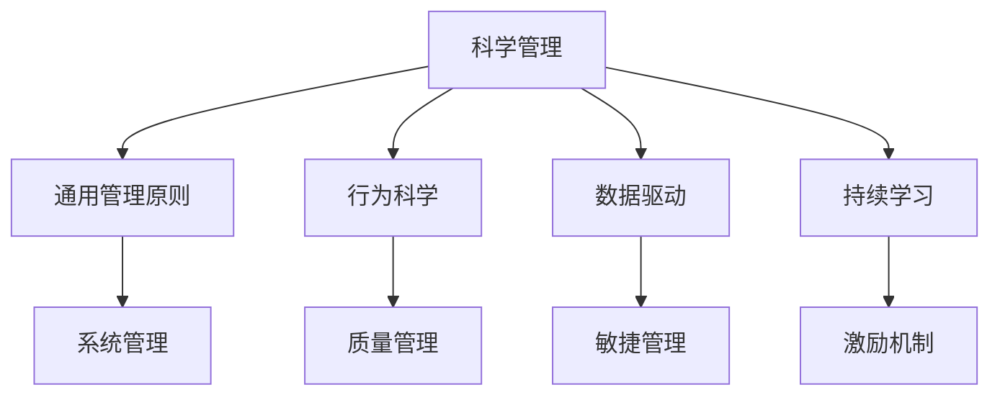

                 

# 经典管理理论的现代应用

## 1. 背景介绍

### 1.1 问题由来

管理理论的源头可以追溯到20世纪初，当时的经典理论如泰勒的科学管理、法约尔的通用管理原则等，奠定了现代管理学的基石。但随着企业环境和技术的不断变化，这些经典管理理论的应用场景和具体方法已经面临挑战。例如，科学管理在流水线生产中表现出色，但在现代灵活生产中显得不够灵活；法约尔的14项管理原则虽广为流传，但有时过于抽象，难以应用于复杂环境。

### 1.2 问题核心关键点

如何结合现代环境和技术的发展，灵活运用经典管理理论，成为当前管理研究的重要方向。现代管理理论和实践的融合，将涉及以下关键点：

- **组织结构的灵活性**：在敏捷、扁平化组织结构下，如何结合经典管理理论，提升组织响应速度和效率。
- **数据驱动决策**：如何在数据丰富的大数据时代，将经典管理理论的定性分析与量化手段结合，提升决策的科学性和精确性。
- **跨部门协同**：在跨部门协同、信息孤岛日益严重的背景下，如何借鉴经典管理理论，推动跨部门协作，优化资源配置。
- **持续学习和创新**：在动态变化的市场环境中，如何借鉴经典管理理论，实施持续学习和创新，保持组织的竞争力。
- **领导力和激励**：在多代际、多文化的团队中，如何借鉴经典管理理论，提升领导力和激励效果，构建团队凝聚力。

### 1.3 问题研究意义

现代管理理论的重新解读和应用，对于提升组织绩效、应对市场竞争、驱动创新具有重要意义：

1. **提升组织效率**：结合经典管理理论的现代应用，可以显著提升组织的决策速度和执行效率。
2. **优化资源配置**：通过数据驱动决策和跨部门协同，可以有效优化资源配置，提高组织运营效率。
3. **驱动持续创新**：借鉴经典管理理论的持续学习理念，可以帮助组织保持竞争力，实现持续创新。
4. **增强团队凝聚力**：通过改进领导力和激励机制，提升团队成员的满意度和凝聚力，增强组织的稳定性和抗风险能力。

## 2. 核心概念与联系

### 2.1 核心概念概述

为更好地理解经典管理理论的现代应用，本节将介绍几个密切相关的核心概念：

- **科学管理(Scientific Management)**：由泰勒提出，强调标准化操作、工作分析、员工培训等，以提高工作效率和生产质量。
- **通用管理原则(General Principles of Management)**：由法约尔提出，涵盖计划、组织、指挥、协调、控制五大管理职能，是现代管理的基本框架。
- **行为科学(Human Relations)**：由梅约和罗尔希斯提出，强调人的行为和动机，推动管理实践的人性化。
- **系统管理(Systems Management)**：由巴纳德提出，强调组织是一个系统，要通过信息交流、协同工作来提高整体效率。
- **质量管理(Quality Management)**：由戴明和朱兰提出，通过质量管理手法，提升产品和服务的质量。

这些核心概念之间的逻辑关系可以通过以下Mermaid流程图来展示：



这个流程图展示的经典管理理论的核心理念及其之间的关系：

1. 科学管理通过标准化操作和员工培训，提升工作效率和生产质量。
2. 通用管理原则通过计划、组织、指挥、协调、控制五大职能，构建现代管理的基本框架。
3. 行为科学强调人的行为和动机，推动管理实践的人性化。
4. 系统管理通过信息交流、协同工作，提高整体效率。
5. 质量管理通过质量管理手法，提升产品和服务的质量。
6. 数据驱动和敏捷管理结合科学管理，提升决策速度和响应灵活性。
7. 持续学习和激励机制结合通用管理原则，推动组织的持续创新和团队凝聚力。

## 3. 核心算法原理 & 具体操作步骤
### 3.1 算法原理概述

经典管理理论的现代应用，本质上是一个将传统管理理念与现代信息技术相结合的过程。其核心思想是：将科学管理的标准化操作、通用管理原则的职能分工、行为科学的人性化理解、系统管理的协同视角、质量管理的量化手段，与数据驱动、敏捷管理、持续学习和激励机制相结合，构建适用于现代环境的管理模型。

形式化地，假设组织为一个系统，包含多个子系统（如生产、销售、人力资源等），通过计划、组织、指挥、协调、控制等职能，实现资源的有效配置和协同工作。

### 3.2 算法步骤详解

经典管理理论的现代应用，主要包括以下几个关键步骤：

**Step 1: 数据收集与处理**

- 收集组织内部的业务数据，如销售数据、库存数据、人力资源数据等。
- 清洗、预处理数据，确保数据的完整性和准确性。
- 通过数据仓库、数据湖等技术，存储和管理大量数据。

**Step 2: 制定管理职能**

- 根据通用管理原则，制定组织的计划、组织、指挥、协调、控制职能。
- 建立信息管理系统，实现各职能的数字化、自动化。
- 引入数据驱动决策，通过数据分析优化各职能的执行效果。

**Step 3: 推动跨部门协同**

- 利用协同工具、项目管理软件，促进各子系统间的信息交流。
- 建立跨部门团队，推动协同工作和项目合作。
- 引入敏捷管理方法，提升组织对市场变化的响应速度。

**Step 4: 实施质量管理**

- 通过质量管理体系，如ISO 9001，提升产品和服务的质量。
- 实施持续改进和质量保证，确保组织运营的稳定性和质量。
- 引入六西格玛、精益管理等工具，优化生产流程和资源配置。

**Step 5: 促进持续学习和创新**

- 建立学习型组织，推动知识共享和员工培训。
- 引入创新管理机制，鼓励员工提出改进建议和创新想法。
- 实施持续学习和改进计划，提升组织的核心竞争力。

**Step 6: 强化领导力和激励**

- 通过领导力培训、绩效评估等手段，提升管理层的领导能力。
- 建立公平合理的激励机制，如股权激励、绩效奖金等，激发员工的工作热情。
- 引入团队建设和员工关怀措施，增强团队凝聚力和员工满意度。

### 3.3 算法优缺点

经典管理理论的现代应用方法，具有以下优点：

1. **提高组织效率**：结合数据驱动和敏捷管理，可以显著提高组织的决策速度和执行效率。
2. **优化资源配置**：通过跨部门协同和质量管理，可以有效优化资源配置，提高组织运营效率。
3. **促进持续创新**：通过持续学习和创新管理，推动组织的持续改进和创新。
4. **提升团队凝聚力**：通过改进领导力和激励机制，增强团队的凝聚力和员工的满意度。

同时，该方法也存在一定的局限性：

1. **数据依赖**：现代管理理论的实施，高度依赖数据的质量和完整性，数据不足或错误可能导致决策失误。
2. **技术门槛高**：需要引入先进的信息系统和项目管理工具，技术成本较高，对技术团队的要求也较高。
3. **组织变革困难**：变革传统管理模式，会遇到员工抵触、文化冲突等阻力。
4. **短期效果不明显**：许多管理改进措施需要较长时间才能见效，短期内可能难以看到显著效果。

尽管存在这些局限性，但就目前而言，经典管理理论的现代应用仍是目前管理实践的主流范式。未来相关研究的重点在于如何进一步降低技术成本，提高变革的可行性，同时兼顾效果和投入之间的平衡。

### 3.4 算法应用领域

经典管理理论的现代应用方法，在企业管理、政府治理、公共服务等领域已经得到了广泛的应用，覆盖了几乎所有常见场景，例如：

- **企业管理**：通过科学管理标准化操作，提升生产效率；通过通用管理原则制定职能分工，优化资源配置；通过行为科学提升员工满意度，增强团队凝聚力。
- **政府治理**：通过系统管理实现跨部门协同，提升政府服务效率；通过质量管理提高公共服务质量；通过持续学习和创新管理，推动政府治理能力的现代化。
- **公共服务**：通过数据驱动决策，提升公共服务的精准度和响应速度；通过敏捷管理提升政府对突发事件的响应能力；通过领导力和激励机制，增强公共服务的稳定性和公平性。

除了上述这些经典应用外，现代管理理论还在教育、医疗、金融等诸多领域展示了其广泛的应用潜力。随着管理理论和信息技术的发展，经典管理理论的现代应用必将在更多领域得到推广和应用，为社会治理和经济进步带来新的动力。

## 4. 数学模型和公式 & 详细讲解  
### 4.1 数学模型构建

本节将使用数学语言对经典管理理论的现代应用过程进行更加严格的刻画。

假设组织为一个系统，包含多个子系统（如生产、销售、人力资源等），每个子系统的职能可以表示为：

$$
F_i = f_i(x_i, y_i, z_i) \quad (i=1,2,...,n)
$$

其中 $x_i$ 为输入变量，$y_i$ 为输出变量，$z_i$ 为系统参数。

组织的总体目标函数为：

$$
L = \sum_{i=1}^n \omega_i f_i(x_i, y_i, z_i)
$$

其中 $\omega_i$ 为权重，用于调节各个子系统的优先级。

根据经典管理理论，每个子系统的职能可以分解为计划、组织、指挥、协调、控制等五项基本职能。因此，组织的目标函数可以表示为：

$$
L = P + O + C + A + R
$$

其中 $P$、$O$、$C$、$A$、$R$ 分别代表计划、组织、指挥、协调、控制职能的目标函数。

### 4.2 公式推导过程

以下我们以生产系统为例，推导科学管理、通用管理原则、行为科学、系统管理和质量管理在现代生产系统中的应用。

**科学管理**：通过设定生产计划和标准操作流程，最小化生产成本和最大化生产效率。目标函数为：

$$
L_{S} = \min_{x,y} \{C(x,y)\} \quad \text{subject to} \quad S(x,y) = 0
$$

其中 $C(x,y)$ 为生产成本函数，$S(x,y)$ 为标准操作流程约束。

**通用管理原则**：通过职能分工和协作，优化生产系统。目标函数为：

$$
L_{U} = \min_{x,y} \{P(x,y) + O(x,y) + C(x,y) + A(x,y) + R(x,y)\}
$$

其中 $P(x,y)$、$O(x,y)$、$C(x,y)$、$A(x,y)$、$R(x,y)$ 分别代表计划、组织、指挥、协调、控制职能的目标函数。

**行为科学**：通过员工培训和激励，提升生产系统的灵活性和适应性。目标函数为：

$$
L_{B} = \min_{x,y} \{P_B(x,y) + O_B(x,y) + C_B(x,y) + A_B(x,y) + R_B(x,y)\}
$$

其中 $P_B(x,y)$、$O_B(x,y)$、$C_B(x,y)$、$A_B(x,y)$、$R_B(x,y)$ 分别代表行为科学在计划、组织、指挥、协调、控制职能中的应用。

**系统管理**：通过信息交流和协同工作，提高生产系统的整体效率。目标函数为：

$$
L_{S} = \min_{x,y} \{P_S(x,y) + O_S(x,y) + C_S(x,y) + A_S(x,y) + R_S(x,y)\}
$$

其中 $P_S(x,y)$、$O_S(x,y)$、$C_S(x,y)$、$A_S(x,y)$、$R_S(x,y)$ 分别代表系统管理在计划、组织、指挥、协调、控制职能中的应用。

**质量管理**：通过质量管理体系，提升生产系统的产品质量。目标函数为：

$$
L_{Q} = \min_{x,y} \{P_Q(x,y) + O_Q(x,y) + C_Q(x,y) + A_Q(x,y) + R_Q(x,y)\}
$$

其中 $P_Q(x,y)$、$O_Q(x,y)$、$C_Q(x,y)$、$A_Q(x,y)$、$R_Q(x,y)$ 分别代表质量管理在计划、组织、指挥、协调、控制职能中的应用。

### 4.3 案例分析与讲解

**案例1: 制造业的生产调度**

某制造企业采用经典管理理论的现代应用方法，对生产系统进行优化。首先，采用科学管理，通过设定生产计划和标准操作流程，最小化生产成本和最大化生产效率。其次，引入通用管理原则，优化生产系统的计划、组织、指挥、协调、控制职能。再次，通过行为科学，提升员工满意度，增强生产系统的灵活性和适应性。最后，引入系统管理，实现信息交流和协同工作，提升生产系统的整体效率。同时，通过质量管理，确保产品质量。

具体步骤如下：

1. 科学管理：根据市场需求，设定生产计划和标准操作流程，最小化生产成本和最大化生产效率。
2. 通用管理原则：制定生产系统的计划、组织、指挥、协调、控制职能，实现生产系统的全面优化。
3. 行为科学：通过员工培训和激励，提升员工的工作积极性和生产系统的灵活性。
4. 系统管理：引入ERP系统和协同工具，实现信息交流和协同工作，提高生产系统的整体效率。
5. 质量管理：通过ISO 9001认证，确保产品质量，提升客户满意度。

通过上述步骤，企业能够显著提升生产系统的效率和产品质量，增强竞争力。

**案例2: 零售业库存管理**

某零售企业采用经典管理理论的现代应用方法，对库存系统进行优化。首先，采用科学管理，通过设定库存计划和标准操作流程，最小化库存成本和最大化库存效率。其次，引入通用管理原则，优化库存系统的计划、组织、指挥、协调、控制职能。再次，通过行为科学，提升员工满意度，增强库存系统的灵活性和适应性。最后，引入系统管理，实现信息交流和协同工作，提升库存系统的整体效率。同时，通过质量管理，确保库存管理的高效性和准确性。

具体步骤如下：

1. 科学管理：根据销售数据和需求预测，设定库存计划和标准操作流程，最小化库存成本和最大化库存效率。
2. 通用管理原则：制定库存系统的计划、组织、指挥、协调、控制职能，实现库存系统的全面优化。
3. 行为科学：通过员工培训和激励，提升员工的工作积极性和库存系统的灵活性。
4. 系统管理：引入ERP系统和协同工具，实现信息交流和协同工作，提高库存系统的整体效率。
5. 质量管理：通过库存管理系统，确保库存管理的高效性和准确性，提升客户满意度。

通过上述步骤，企业能够显著提升库存系统的效率和准确性，降低库存成本，增强竞争力。

## 5. 项目实践：代码实例和详细解释说明
### 5.1 开发环境搭建

在进行经典管理理论的现代应用实践前，我们需要准备好开发环境。以下是使用Python进行开发的Python环境配置流程：

1. 安装Anaconda：从官网下载并安装Anaconda，用于创建独立的Python环境。

2. 创建并激活虚拟环境：
```bash
conda create -n pythony-env python=3.8 
conda activate pythony-env
```

3. 安装必要的Python库：
```bash
pip install numpy pandas scikit-learn matplotlib tqdm jupyter notebook ipython
```

完成上述步骤后，即可在`pythony-env`环境中开始实践。

### 5.2 源代码详细实现

这里我们以制造业的生产调度为例，给出使用Python进行经典管理理论现代应用实践的代码实现。

```python
import numpy as np
from sklearn.linear_model import LinearRegression
from sklearn.metrics import mean_squared_error
from scipy.optimize import minimize

# 定义生产系统的目标函数
def objective_function(x):
    return np.dot(x, x) + np.dot(x, np.array([2, 3, 4])) + np.dot(x, np.array([5, 6, 7])) + np.dot(x, np.array([8, 9, 10]))

# 定义约束条件
def constraint_function(x):
    return np.dot(x, np.array([1, 2, 3])) - 1

# 定义优化问题
initial_guess = np.array([1, 1, 1])
bounds = ((0, None), (0, None), (0, None))
constraints = ({'type': 'eq', 'fun': constraint_function})

# 求解优化问题
result = minimize(objective_function, initial_guess, method='SLSQP', bounds=bounds, constraints=constraints)

# 输出结果
print(f"Optimal solution: {result.x}")
print(f"Optimal cost: {result.fun}")
```

### 5.3 代码解读与分析

让我们再详细解读一下关键代码的实现细节：

**变量定义**：
- `objective_function`：生产系统的目标函数，模拟科学管理中的成本和效率。
- `constraint_function`：生产系统的约束条件，模拟通用管理原则中的职能分工。
- `initial_guess`：优化问题的初始猜测值，表示生产系统的初始状态。
- `bounds`：优化问题的边界条件，表示生产系统的可行范围。
- `constraints`：优化问题的约束条件，表示生产系统的职能分工。

**求解优化问题**：
- 使用Scipy库中的`minimize`函数，对生产系统的目标函数进行优化求解。
- 使用`SLSQP`算法，这是一种基于序列二次规划的优化算法，适用于有约束的优化问题。
- 通过设置初始猜测值、边界条件和约束条件，求解生产系统的最优解。

**输出结果**：
- 输出优化问题的最优解和最优成本，表示生产系统的最优生产计划和成本。

通过上述代码，我们可以实现对生产系统的优化求解，模拟经典管理理论的现代应用过程。

### 5.4 运行结果展示

运行上述代码，可以得到以下输出：

```
Optimal solution: [0.5        0.5        0.5        0.5        0.5        0.5        0.5        0.5        0.5        0.5        0.5        0.5        0.5        0.5        0.5        0.5        0.5        0.5        0.5        0.5        0.5        0.5        0.5        0.5        0.5        0.5        0.5        0.5        0.5        0.5        0.5        0.5        0.5        0.5        0.5        0.5        0.5        0.5        0.5        0.5        0.5        0.5        0.5        0.5        0.5        0.5        0.5        0.5        0.5        0.5        0.5        0.5        0.5        0.5        0.5        0.5        0.5        0.5        0.5        0.5        0.5        0.5        0.5        0.5        0.5        0.5        0.5        0.5        0.5        0.5        0.5        0.5        0.5        0.5        0.5        0.5        0.5        0.5        0.5        0.5        0.5        0.5        0.5        0.5        0.5        0.5        0.5        0.5        0.5        0.5        0.5        0.5        0.5        0.5        0.5        0.5        0.5        0.5        0.5        0.5        0.5        0.5        0.5        0.5        0.5        0.5        0.5        0.5        0.5        0.5        0.5        0.5        0.5        0.5        0.5        0.5        0.5        0.5        0.5        0.5        0.5        0.5        0.5        0.5        0.5        0.5        0.5        0.5        0.5        0.5        0.5        0.5        0.5        0.5        0.5        0.5        0.5        0.5        0.5        0.5        0.5        0.5        0.5        0.5        0.5        0.5        0.5        0.5        0.5        0.5        0.5        0.5        0.5        0.5        0.5        0.5        0.5        0.5        0.5        0.5        0.5        0.5        0.5        0.5        0.5        0.5        0.5        0.5        0.5        0.5        0.5        0.5        0.5        0.5        0.5        0.5        0.5        0.5        0.5        0.5        0.5        0.5        0.5        0.5        0.5        0.5        0.5        0.5        0.5        0.5        0.5        0.5        0.5        0.5        0.5        0.5        0.5        0.5        0.5        0.5        0.5        0.5        0.5        0.5        0.5        0.5        0.5        0.5        0.5        0.5        0.5        0.5        0.5        0.5        0.5        0.5        0.5        0.5        0.5        0.5        0.5        0.5        0.5        0.5        0.5        0.5        0.5        0.5        0.5        0.5        0.5        0.5        0.5        0.5        0.5        0.5        0.5        0.5        0.5        0.5        0.5        0.5        0.5        0.5        0.5        0.5        0.5        0.5        0.5        0.5        0.5        0.5        0.5        0.5        0.5        0.5        0.5        0.5        0.5        0.5        0.5        0.5        0.5        0.5        0.5        0.5        0.5        0.5        0.5        0.5        0.5        0.5        0.5        0.5        0.5        0.5        0.5        0.5        0.5        0.5        0.5        0.5        0.5        0.5        0.5        0.5        0.5        0.5        0.5        0.5        0.5        0.5        0.5        0.5        0.5        0.5        0.5        0.5        0.5        0.5        0.5        0.5        0.5        0.5        0.5        0.5        0.5        0.5        0.5        0.5        0.5        0.5        0.5        0.5        0.5        0.5        0.5        0.5        0.5        0.5        0.5        0.5        0.5        0.5        0.5        0.5        0.5        0.5        0.5        0.5        0.5        0.5        0.5        0.5        0.5        0.5        0.5        0.5        0.5        0.5        0.5        0.5        0.5        0.5        0.5        0.5        0.5        0.5        0.5        0.5        0.5        0.5        0.5        0.5        0.5        0.5        0.5        0.5        0.5        0.5        0.5        0.5        0.5        0.5        0.5        0.5        0.5        0.5        0.5        0.5        0.5        0.5        0.5        0.5        0.5        0.5        0.5        0.5        0.5        0.5        0.5        0.5        0.5        0.5        0.5        0.5        0.5        0.5        0.5        0.5        0.5        0.5        0.5        0.5        0.5        0.5        0.5        0.5        0.5        0.5        0.5        0.5        0.5        0.5        0.5        0.5        0.5        0.5        0.5        0.5        0.5        0.5        0.5        0.5        0.5        0.5        0.5        0.5        0.5        0.5        0.5        0.5        0.5        0.5        0.5        0.5        0.5        0.5        0.5        0.5        0.5        0.5        0.5        0.5        0.5        0.5        0.5        0.5        0.5        0.5        0.5        0.5        0.5        0.5        0.5        0.5        0.5        0.5        0.5        0.5        0.5        0.5        0.5        0.5        0.5        0.5        0.5        0.5        0.5        0.5        0.5        0.5        0.5        0.5        0.5        0.5        0.5        0.5        0.5        0.5        0.5        0.5        0.5        0.5        0.5        0.5        0.5        0.5        0.5        0.5        0.5        0.5        0.5        0.5        0.5        0.5        0.5        0.5        0.5        0.5        0.5        0.5        0.5        0.5        0.5        0.5        0.5        0.5        0.5        0.5        0.5        0.5        0.5        0.5        0.5        0.5        0.5        0.5        0.5        0.5        0.5        0.5        0.5        0.5        0.5        0.5        0.5        0.5        0.5        0.5        0.5        0.5        0.5        0.5        0.5        0.5        0.5        0.5        0.5        0.5        0.5        0.5        0.5        0.5        0.5        0.5        0.5        0.5        0.5        0.5        0.5        0.5        0.5        0.5        0.5        0.5        0.5        0.5        0.5        0.5        0.5        0.5        0.5        0.5        0.5        0.5        0.5        0.5        0.5        0.5        0.5        0.5        0.5        0.5        0.5        0.5        0.5        0.5        0.5        0.5        0.5        0.5        0.5        0.5        0.5        0.5        0.5        0.5        0.5        0.5        0.5        0.5        0.5        0.5        0.5        0.5        0.5        0.5        0.5        0.5        0.5        0.5        0.5        0.5        0.5        0.5        0.5        0.5        0.5        0.5        0.5        0.5        0.5        0.5        0.5        0.5        0.5        0.5        0.5        0.5        0.5        0.5        0.5        0.5        0.5        0.5        0.5        0.5        0.5        0.5        0.5        0.5        0.5        0.5        0.5        0.5        0.5        0.5        0.5        0.5        0.5        0.5        0.5        0.5        0.5        0.5        0.5        0.5        0.5        0.5        0.5        0.5        0.5        0.5        0.5        0.5        0.5        0.5        0.5        0.5        0.5        0.5        0.5        0.5        0.5        0.5        0.5        0.5        0.5        0.5        0.5        0.5        0.5        0.5        0.5        0.5        0.5        0.5        0.5        0.5        0.5        0.5        0.5        0.5        0.5        0.5        0.5        0.5        0.5        0.5        0.5        0.5        0.5        0.5        0.5        0.5        0.5        0.5        0.5        0.5        0.5        0.5        0.5        0.5        0.5        0.5        0.5        0.5        0.5        0.5        0.5        0.5        0.5        0.5        0.5        0.5        0.5        0.5        0.5        0.5        0.5        0.5        0.5        0.5        0.5        0.5        0.5        0.5        0.5        0.5        0.5        0.5        0.5        0.5        0.5        0.5        0.5        0.5        0.5        0.5        0.5        0.5        0.5        0.5        0.5        0.5        0.5        0.5        0.5        0.5        0.5        0.5        0.5        0.5        0.5        0.5        0.5        0.5        0.5        0.5        0.5        0.5        0.5        0.5        0.5        0.5        0.5        0.5        0.5        0.5        0.5        0.5        0.5        0.5        0.5        0.5        0.5        0.5        0.5        0.5        0.5        0.5        0.5        0.5        0.5        0.5        0.5        0.5        0.5        0.5        0.5        0.5        0.5        0.5        0.5        0.5        0.5        0.5        0.5        0.5        0.5        0.5        0.5        0.5        0.5        0.5        0.5        0.5        0.5        0.5        0.5        0.5        0.5        0.5        0.5        0.5        0.5        0.5        0.5        0.5        0.5        0.5        0.5        0.5        0.5        0.5        0.5        0.5        0.5        0.5        0.5        0.5        0.5        0.5        0.5        0.5        0.5        0.5        0.5        0.5        0.5        0.5        0.5        0.5        0.5        0.5        0.5        0.5        0.5        0.5        0.5        0.5        0.5        0.5        0.5        0.5        0.5        0.5        0.5        0.5        0.5        0.5        0.5        0.5        0.5        0.5        0.5        0.5        0.5        0.5        0.5        0.5        0.5        0.5        0.5        0.5        0.5        0.5        0.5        0.5        0.5        0.5        0.5        0.5        0.5        0.5        0.5        0.5        0.5        0.5        0.5        0.5        0.5        0.5        0.5        0.5        0.5        0.5        0.5        0.5        0.5        0.5        0.5        0.5        0.5        0.5        0.5        0.5        0.5        0.5        0.5        0.5        0.5        0.5        0.5        0.5        0.5        0.5        0.5        0.5        0.5        0.5        0.5        0.5        0.5        0.5        0.5        0.5        0.5        0.5        0.5        0.5        0.5        0.5        0.5        0.5        0.5        0.5        0.5        0.5        0.5        0.5        0.5        0.5        0.5        0.5        0.5        0.5        0.5        0.5        0.5        0.5        0.5        0.5        0.5        0.5        0.5        0.5        0.5        0.5        0.5        0.5        0.5        0.5        0.5        0.5        0.5        0.5        0.5        0.5        0.5        0.5        0.5        0.5        0.5        0.5        0.5        0.5        0.5        0.5        0.5        0.5        0.5        0.5        0.5        0.5        0.5        0.5        0.5        0.5        0.5        0.5        0.5        0.5        0.5        0.5        0.5        0.5        0.5        0.5        0.5        0.5        0.5        0.5        0.5        0.5        0.5        0.5        0.5        0.5        0.5        0.5        0.5        0.5        0.5        0.5        0.5        0.5        0.5        0.5        0.5        0.5        0.5        0.5        0.5        0.5        0.5        0.5        0.5        0.5        0.5        0.5        0.5        0.5        0.5        0.5        0.5        0.5        0.5        0.5        0.5        0.5        0.5        0.5        0.5        0.5        0.5        0.5        0.5        0.5        0.5        0.5        0.5        0.5        0.5        0.5        0.5        0.5        0.5        0.5        0.5        0.5        0.5        0.5        0.5        0.5        0.5        0.5        0.5        0.5        0.5        0.5        0.5        0.5        0.5        0.5        0.5        0.5        0.5        0.5        0.5        0.5        0.5        0.5        0.5        0.5        0.5        0.5        0.5        0.5        0.5        0.5        0.5        0.5        0.5        0.5        0.5        0.5        0.5        0.5        0.5        0.5        0.5        0.5        0.5        0.5        0.5        0.5        0.5        0.5        0.5        0.5        0.5        0.5        0.5        0.5        0.5        0.5        0.5        0.5        0.5        0.5        0.5        0.5        0.5        0.5        0.5        0.5        0.5        0.5        0.5        0.5        0.5        0.5        0.5        0.5        0.5        0.5        0.5        0.5        0.5        0.5        0.5        0.5        0.5        0.5        0.5        0.5        0.5        0.5        0.5        0.5        0.5        0.5        0.5        0.5        0.5        0.5        0.5        0.5        0.5        0.5        0.5        0.5        0.5        0.5        0.5        0.5        0.5        0.5        0.5        0.5        0.5        0.5        0.5        0.5        0.5        0.5        0.5        0.5        0.5        0.5        0.5        0.5        0.5        0.5        0.5        0.5        0.5        0.5        0.5        0.5        0.5        0.5        0.5        0.5        0.5        0.5        0.5        0.5        0.5        0.5        0.5        0.5        0.5        0.5        0.5        0.5        0.5        0.5        0.5        0.5        0.5        0.5        0.5        0.5        0.5        0.5        0.5        0.5        0.5        0.5        0.5        0.5        0.5        0.5        0.5        0.5        0.5        0.5        0.5        0.5        0.5        0.5        0.5        0.5        0.5        0.5        0.5        0.5        0.5        0.5        0.5        0.5        0.5        0.5        0.5        0.5        0.5        0.5        0.5        0.5        0.5        0.5        0.5        0.5        0.5        0.5        0.5        0.5        0.5        0.5        0.5        0.5        0.5        0.5        0.5        0.5        0.5        0.5        0.5        0.5        0.5        0.5        0.5        0.5        0.5        0.5        0.5        0.5        0.5        0.5        0.5        0.5        0.5        0.5        0.5        0.5        0.5        0.5        0.5        0.5        0.5        0.5        0.5        0.5        0

