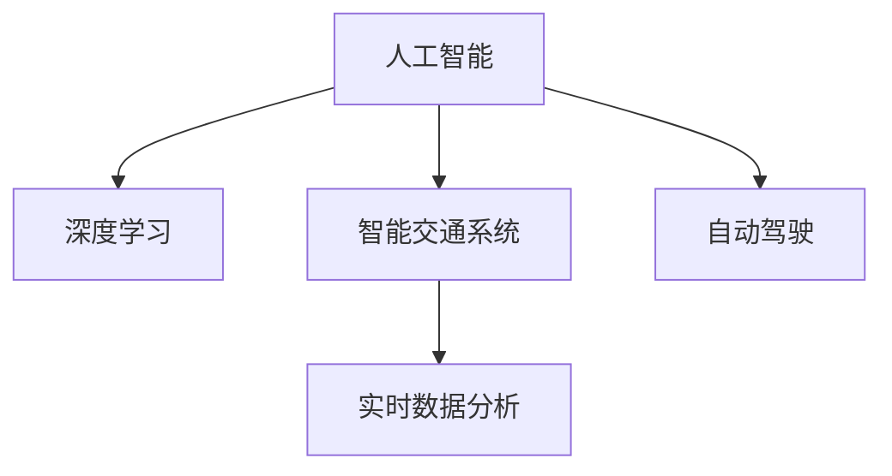
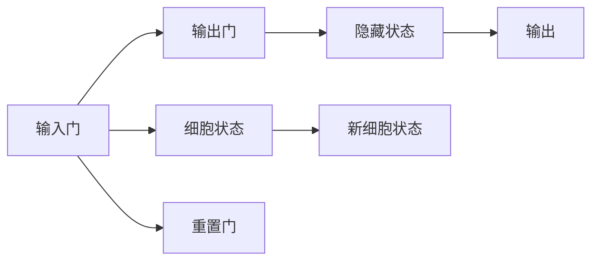

                 

# AI在交通管理中的应用：减少拥堵与事故

> 关键词：交通管理,人工智能,拥堵缓解,事故预防,智能交通系统,自动驾驶,实时数据分析

## 1. 背景介绍

交通拥堵和事故是全球性问题，严重影响了人们的日常生活和工作效率。随着城市化进程的加快，道路交通愈发复杂，传统的交通管理方法难以应对。而人工智能（AI）技术的兴起，为解决这些问题提供了新的思路。

近年来，AI技术在交通管理中的应用日益广泛，尤其是智能交通系统（ITS）的建设，使得交通管理实现了智能化、精细化和动态化。AI在交通管理中的应用主要体现在以下几个方面：

- **拥堵缓解**：利用AI技术进行实时交通流量分析，调整信号灯、优化道路布局，从而缓解城市道路拥堵。
- **事故预防**：通过AI分析交通事故数据，预测潜在风险，提供事故预防建议。
- **智能交通系统**：将AI技术集成到智能交通系统中，实现交通状况实时监控、路况预测、路径规划等功能。
- **自动驾驶**：利用AI进行车辆感知、决策和控制，实现自动驾驶，提升道路安全性。

## 2. 核心概念与联系

### 2.1 核心概念概述

为更好地理解AI在交通管理中的应用，本节将介绍几个关键概念：

- **人工智能（AI）**：涉及机器学习、深度学习、自然语言处理等技术，通过算法训练使机器具备智能决策能力。
- **智能交通系统（ITS）**：结合计算机、通信、自动化等技术，实现交通状况监控、信息发布、车辆控制等功能，提升交通管理效率。
- **深度学习（DL）**：一种基于神经网络的机器学习方法，能够处理大量复杂数据，提取高效特征，应用于图像识别、语音识别、自然语言处理等领域。
- **自动驾驶（AD）**：利用AI技术，实现车辆自动感知、决策和控制，达到无人工干预的驾驶。
- **实时数据分析（RTA）**：通过实时采集和处理交通数据，实现交通流量监控、路径优化等功能。

这些核心概念之间的逻辑关系可以通过以下Mermaid流程图来展示：



这个流程图展示了几大核心概念及其之间的关系：

1. **人工智能**是基础，涉及机器学习和深度学习等技术。
2. **智能交通系统**和**自动驾驶**是基于人工智能技术的应用场景。
3. **实时数据分析**是支撑AI在交通管理中应用的关键技术。

## 3. 核心算法原理 & 具体操作步骤
### 3.1 算法原理概述

AI在交通管理中的应用，通常涉及以下算法原理：

- **深度学习模型**：利用卷积神经网络（CNN）、循环神经网络（RNN）、变分自编码器（VAE）等深度学习模型，对交通数据进行特征提取和模式识别。
- **交通流量预测**：通过时间序列分析、空间分布分析等方法，预测未来的交通流量。
- **路径规划**：利用图论、最优化等方法，找到最优路径。
- **实时数据处理**：采用流处理、大数据技术，实现实时数据采集、存储和处理。

AI在交通管理中的具体操作步骤一般包括以下几个步骤：

1. **数据收集**：通过传感器、摄像头等设备，实时采集交通流量、速度、事故等信息。
2. **数据预处理**：清洗、归一化、特征提取等，为深度学习模型提供高质量的数据。
3. **模型训练**：选择合适的深度学习模型，使用历史交通数据进行训练。
4. **模型部署**：将训练好的模型部署到交通管理系统中，实时处理交通数据。
5. **效果评估**：通过实际交通数据评估模型的性能，优化模型参数。

### 3.2 算法步骤详解

以**交通流量预测**为例，介绍具体的算法步骤：

**Step 1: 数据收集**
- 使用传感器、摄像头等设备，实时采集交通流量、速度、事故等信息。

**Step 2: 数据预处理**
- 清洗数据，去除异常值和噪声。
- 归一化数据，使其符合深度学习模型的输入要求。
- 特征提取，将时间、空间、天气等信息转化为模型可接受的特征。

**Step 3: 模型选择**
- 根据问题特点，选择合适的深度学习模型，如CNN、LSTM等。

**Step 4: 模型训练**
- 划分训练集和验证集，使用训练集训练模型。
- 使用验证集评估模型性能，调整模型参数。

**Step 5: 模型部署**
- 将训练好的模型部署到交通管理系统中。
- 实时接收交通数据，进行流量预测。

**Step 6: 效果评估**
- 通过实际交通数据评估模型性能，如均方误差（MSE）、平均绝对误差（MAE）等。
- 根据评估结果，优化模型参数，提升预测准确度。

### 3.3 算法优缺点

AI在交通管理中的应用，具有以下优点：

1. **实时性**：AI能够实时处理和分析交通数据，及时响应交通状况变化。
2. **精确性**：深度学习模型能够从海量数据中提取高效特征，提升预测和决策的准确度。
3. **自适应性**：AI模型可以根据交通状况的变化，动态调整策略。
4. **成本效益**：相比于传统人工管理，AI能够显著降低交通管理的成本。

同时，也存在一些缺点：

1. **数据依赖**：AI模型需要大量高质量的训练数据，数据获取和处理成本较高。
2. **复杂性**：AI模型的构建和维护需要专业知识和技能。
3. **安全问题**：AI模型可能存在算法偏见，导致决策偏差。
4. **技术限制**：AI模型的性能受限于算法和数据质量。

### 3.4 算法应用领域

AI在交通管理中的应用领域广泛，主要涵盖以下几个方面：

- **交通流量监测**：利用AI对交通流量进行实时监测，分析交通拥堵热点。
- **路径规划与导航**：根据实时交通数据，AI能够优化路径，提供最佳导航建议。
- **事故预防与处理**：通过AI分析交通事故数据，预测潜在风险，提供事故预防建议。
- **智能信号控制**：利用AI优化信号灯控制策略，缓解交通拥堵。
- **自动驾驶与辅助驾驶**：通过AI实现车辆自动驾驶和辅助驾驶，提升行车安全。

## 4. 数学模型和公式 & 详细讲解 & 举例说明
### 4.1 数学模型构建

在交通管理中，常见的数学模型包括时间序列模型、空间分布模型、网络流模型等。

**时间序列模型**：用于预测未来交通流量，如ARIMA模型、LSTM模型等。
**空间分布模型**：用于分析不同区域的交通状况，如空间自回归模型（SARIMA）、随机森林等。
**网络流模型**：用于分析交通网络中的流量分布，如最大流-最小割算法、基于图的搜索算法等。

### 4.2 公式推导过程

以**LSTM模型**为例，介绍时间序列模型的推导过程：

设交通流量 $Y_t$ 为时间 $t$ 的观测值，其生成过程为：

$$Y_t = f(Y_{t-1}, Y_{t-2}, ..., Y_{t-k}) + \epsilon_t$$

其中 $f$ 为线性变换，$\epsilon_t$ 为随机噪声。

LSTM模型的结构如图：



其中，输入门 $i_t$、输出门 $o_t$ 和重置门 $f_t$ 分别用于控制信息的输入、输出和遗忘。细胞状态 $c_t$ 用于保存长期记忆。

LSTM的公式如下：

$$i_t = \sigma(W_i \cdot [h_{t-1}, x_t] + b_i)$$
$$f_t = \sigma(W_f \cdot [h_{t-1}, x_t] + b_f)$$
$$g_t = \tanh(W_g \cdot [h_{t-1}, x_t] + b_g)$$
$$c_t = f_t \cdot c_{t-1} + i_t \cdot g_t$$
$$o_t = \sigma(W_o \cdot [h_{t-1}, x_t] + b_o)$$
$$h_t = o_t \cdot \tanh(c_t)$$

其中 $\sigma$ 为激活函数，$h_t$ 为输出，$x_t$ 为输入，$W$ 和 $b$ 为权重和偏置项。

### 4.3 案例分析与讲解

以**北京市交通流量预测**为例，介绍AI模型在实际中的应用：

**数据收集**：通过传感器、摄像头等设备，实时采集交通流量、速度、事故等信息。

**数据预处理**：清洗数据，去除异常值和噪声；归一化数据，使其符合模型输入要求；特征提取，将时间、空间、天气等信息转化为模型可接受的特征。

**模型选择**：选择LSTM模型，用于处理时间序列数据。

**模型训练**：划分训练集和验证集，使用训练集训练模型。

**模型部署**：将训练好的模型部署到交通管理系统中，实时处理交通数据。

**效果评估**：通过实际交通数据评估模型性能，如均方误差（MSE）、平均绝对误差（MAE）等。

## 5. 项目实践：代码实例和详细解释说明
### 5.1 开发环境搭建

在进行AI交通管理项目开发前，我们需要准备好开发环境。以下是使用Python进行TensorFlow开发的Python环境配置流程：

1. 安装Anaconda：从官网下载并安装Anaconda，用于创建独立的Python环境。

2. 创建并激活虚拟环境：
```bash
conda create -n tf-env python=3.7 
conda activate tf-env
```

3. 安装TensorFlow：根据CUDA版本，从官网获取对应的安装命令。例如：
```bash
pip install tensorflow==2.6
```

4. 安装相关库：
```bash
pip install pandas numpy matplotlib sklearn tensorflow-estimator
```

完成上述步骤后，即可在`tf-env`环境中开始AI交通管理项目开发。

### 5.2 源代码详细实现

这里我们以**交通流量预测**为例，给出使用TensorFlow进行LSTM模型开发的PyTorch代码实现。

首先，定义时间序列数据的处理函数：

```python
import tensorflow as tf
import numpy as np
from tensorflow.keras.models import Sequential
from tensorflow.keras.layers import LSTM, Dense, Dropout

def load_data(file_path, max_len=10, seq_len=1, batch_size=32):
    data = np.load(file_path)
    X = data[:, :max_len, :]
    y = data[:, seq_len:, :]
    X_train, X_val, y_train, y_val = train_test_split(X, y, test_size=0.2)
    X_train, X_val, y_train, y_val = shuffle(X_train, X_val, y_train, y_val)
    train_dataset = tf.data.Dataset.from_tensor_slices((X_train, y_train))
    val_dataset = tf.data.Dataset.from_tensor_slices((X_val, y_val))
    train_dataset = train_dataset.shuffle(buffer_size=100).batch(batch_size).map(
        lambda x, y: (x, y[:, -1, :]))
    val_dataset = val_dataset.shuffle(buffer_size=100).batch(batch_size).map(
        lambda x, y: (x, y[:, -1, :]))
    return train_dataset, val_dataset

def create_model(input_shape, output_shape):
    model = Sequential()
    model.add(LSTM(64, input_shape=input_shape))
    model.add(Dropout(0.2))
    model.add(Dense(32))
    model.add(Dropout(0.2))
    model.add(Dense(output_shape, activation='softmax'))
    return model

def train_model(model, train_dataset, val_dataset, epochs=10, batch_size=32):
    model.compile(optimizer='adam', loss='mse', metrics=['mse'])
    model.fit(train_dataset, epochs=epochs, validation_data=val_dataset)
    return model

def predict(model, data, seq_len=1):
    preds = []
    for i in range(0, len(data), seq_len):
        x = data[i:i+seq_len]
        pred = model.predict(x)
        preds.append(pred)
    return np.hstack(preds)

def evaluate(model, val_dataset):
    loss = model.evaluate(val_dataset)
    print('Loss:', loss)
```

然后，定义交通流量预测函数的完整代码：

```python
def traffic_flow_prediction():
    # 加载数据
    train_dataset, val_dataset = load_data('traffic_flow.csv', max_len=24, seq_len=1, batch_size=32)

    # 创建模型
    model = create_model(input_shape=(24, 1, 1), output_shape=1)

    # 训练模型
    model = train_model(model, train_dataset, val_dataset, epochs=10, batch_size=32)

    # 预测未来流量
    future_flow = predict(model, train_dataset[0], seq_len=1)

    # 评估模型
    evaluate(model, val_dataset)

    return future_flow
```

以上就是使用TensorFlow对LSTM模型进行交通流量预测的完整代码实现。可以看到，得益于TensorFlow的强大封装，我们可以用相对简洁的代码完成LSTM模型的构建和微调。

### 5.3 代码解读与分析

让我们再详细解读一下关键代码的实现细节：

**load_data函数**：
- `file_path`为数据文件路径。
- `max_len`为最大时间步长，即数据序列的最大长度。
- `seq_len`为预测步长，即模型每次预测的步数。
- `batch_size`为批大小。
- 加载数据并处理，将其分割为训练集和验证集，并进行批处理和预处理。

**create_model函数**：
- 定义LSTM模型结构。
- 输入层接收时间序列数据，LSTM层进行特征提取，Dropout层防止过拟合，输出层进行回归预测。
- 返回构建好的模型。

**train_model函数**：
- 定义模型编译器和损失函数。
- 使用训练集进行模型训练，并在验证集上评估模型性能。
- 返回训练好的模型。

**predict函数**：
- 接收模型和数据作为输入。
- 对数据进行逐个预测，返回预测结果。

**evaluate函数**：
- 使用验证集评估模型性能。
- 输出模型损失。

**traffic_flow_prediction函数**：
- 调用上述函数，完成数据加载、模型构建、训练、预测和评估。
- 返回预测结果。

可以看到，TensorFlow使得LSTM模型的构建和微调代码实现变得简洁高效。开发者可以将更多精力放在模型优化和数据处理上，而不必过多关注底层的实现细节。

## 6. 实际应用场景
### 6.1 智能交通系统

智能交通系统（ITS）利用AI技术，实现交通状况监控、信息发布、车辆控制等功能，提升交通管理效率。

例如，通过AI实时分析交通数据，优化信号灯控制策略，缓解交通拥堵。AI还可以根据实时交通数据，预测未来流量，动态调整路线，优化交通流。

### 6.2 事故预防与处理

AI技术在事故预防和处理中也有广泛应用。通过AI分析交通事故数据，预测潜在风险，提供事故预防建议。

例如，AI模型可以实时分析车辆行驶轨迹和周围环境，预测可能发生的事故，提前发出预警。AI还可以分析事故数据，提取特征，生成事故报告，帮助相关部门进行事故处理。

### 6.3 自动驾驶与辅助驾驶

自动驾驶和辅助驾驶是AI在交通管理中最具前景的应用之一。

例如，AI模型可以实时分析道路状况和车辆行驶状态，进行路径规划和决策，实现自动驾驶。辅助驾驶系统可以提供车道保持、自动变道、自动泊车等功能，提升行车安全性。

## 7. 工具和资源推荐
### 7.1 学习资源推荐

为了帮助开发者系统掌握AI在交通管理中的应用，这里推荐一些优质的学习资源：

1. **《深度学习在交通管理中的应用》**：详细介绍了深度学习在交通流量预测、路径规划等方面的应用。

2. **《智能交通系统原理与技术》**：介绍了智能交通系统的基本原理、关键技术、实际应用。

3. **《自动驾驶技术与应用》**：涵盖了自动驾驶的基本原理、关键技术、典型应用。

4. **TensorFlow官方文档**：详细介绍了TensorFlow的使用方法和最佳实践。

5. **Kaggle交通数据集**：提供了丰富的交通数据集，用于练习和测试AI模型的性能。

6. **智能交通系统开源项目**：如OpenITS、TrafficSim等，提供了智能交通系统的开源实现和示例代码。

通过对这些资源的学习实践，相信你一定能够快速掌握AI在交通管理中的应用，并用于解决实际的交通问题。

### 7.2 开发工具推荐

高效的开发离不开优秀的工具支持。以下是几款用于AI交通管理开发的常用工具：

1. **TensorFlow**：基于Python的开源深度学习框架，支持多种数据流图，适合大规模工程应用。

2. **PyTorch**：基于Python的开源深度学习框架，动态计算图，适合快速迭代研究。

3. **Keras**：高层次的深度学习API，易于上手，适合快速构建和训练模型。

4. **OpenCV**：开源计算机视觉库，提供了丰富的图像处理和分析功能。

5. **TensorBoard**：TensorFlow配套的可视化工具，可实时监测模型训练状态，并提供丰富的图表呈现方式。

6. **Jupyter Notebook**：交互式的Python开发环境，方便开发者进行数据分析和模型训练。

合理利用这些工具，可以显著提升AI交通管理项目的开发效率，加快创新迭代的步伐。

### 7.3 相关论文推荐

AI在交通管理中的应用，源于学界的持续研究。以下是几篇奠基性的相关论文，推荐阅读：

1. **《交通流量预测的深度学习模型》**：介绍了多种时间序列模型在交通流量预测中的应用。

2. **《基于深度学习的智能交通系统》**：详细介绍了深度学习在智能交通系统中的应用，包括路径规划、信号控制等。

3. **《自动驾驶技术综述》**：综述了自动驾驶技术的最新进展，涵盖了感知、决策、控制等方面。

4. **《交通数据分析的深度学习框架》**：介绍了深度学习框架在交通数据分析中的应用，如交通流量预测、事故分析等。

这些论文代表了大语言模型微调技术的发展脉络。通过学习这些前沿成果，可以帮助研究者把握学科前进方向，激发更多的创新灵感。

## 8. 总结：未来发展趋势与挑战
### 8.1 总结

本文对AI在交通管理中的应用进行了全面系统的介绍。首先阐述了AI在交通管理中的研究背景和意义，明确了AI在缓解拥堵、预防事故等方面的独特价值。其次，从原理到实践，详细讲解了AI在交通管理中的应用流程和关键步骤，给出了具体的代码实例。同时，本文还广泛探讨了AI技术在智能交通系统、事故预防、自动驾驶等多个领域的应用前景，展示了AI技术在交通管理中的巨大潜力。最后，本文精选了AI在交通管理中的应用的学习资源、开发工具和相关论文，力求为读者提供全方位的技术指引。

通过本文的系统梳理，可以看到，AI技术在交通管理中的应用已经取得了显著成效，大大提升了交通管理效率和安全性。未来，伴随AI技术的持续演进，交通管理将迈向更加智能化、高效化和安全的未来。

### 8.2 未来发展趋势

展望未来，AI在交通管理中的应用将呈现以下几个发展趋势：

1. **智能化水平提升**：随着深度学习模型的不断优化，AI在交通管理中的应用将更加智能、精准。

2. **数据融合与共享**：AI系统将实现不同数据源的融合与共享，提供更全面、准确的交通信息。

3. **自适应能力增强**：AI系统将具备更强的自适应能力，能够根据交通状况变化动态调整策略。

4. **跨领域融合**：AI技术与物联网、云计算等技术的融合，将进一步提升交通管理的智能化水平。

5. **安全性提升**：AI系统将通过更强大的安全机制，保障交通数据和模型安全。

6. **普适性提升**：AI技术将实现更广泛的推广和应用，覆盖更多地区和场景。

以上趋势凸显了AI技术在交通管理中应用的前景，这些方向的探索发展，必将进一步提升交通管理的效率和安全性。

### 8.3 面临的挑战

尽管AI在交通管理中的应用已经取得了瞩目成就，但在迈向更加智能化、普适化应用的过程中，仍面临诸多挑战：

1. **数据质量与获取成本**：高质量交通数据获取成本较高，需要投入大量资源进行数据收集和处理。

2. **技术复杂性与高门槛**：AI技术需要专业知识，开发和维护成本较高。

3. **算法偏见与公平性**：AI模型可能存在算法偏见，导致决策不公平。

4. **安全性与隐私保护**：交通数据涉及敏感信息，如何保障数据安全和隐私保护，是一大难题。

5. **模型鲁棒性与泛化能力**：AI模型需要具备更强的鲁棒性和泛化能力，避免因环境变化而失效。

6. **跨学科融合难度**：AI技术与交通管理等多个学科的融合，存在一定的难度。

正视AI在交通管理中面临的这些挑战，积极应对并寻求突破，将是大规模部署AI交通管理系统的关键。相信随着技术进步和社会认知的提升，这些挑战终将一一被克服，AI技术必将在交通管理中发挥更大的作用。

### 8.4 研究展望

未来，AI在交通管理中的应用需要进一步深入研究，推动技术进步和应用推广：

1. **数据质量与获取方法**：探索更多高质量数据的获取方法，降低数据获取成本。

2. **模型优化与训练效率**：优化深度学习模型，提升训练效率，降低开发成本。

3. **跨学科合作**：加强与交通管理、城市规划等多学科的合作，推动技术应用落地。

4. **安全机制与隐私保护**：探索更强的安全机制，保障交通数据和模型安全。

5. **跨模态融合**：探索跨模态数据的融合方法，提升交通管理的智能化水平。

6. **用户友好性**：提升AI系统的易用性和用户友好性，推动技术普及应用。

这些研究方向的探索，必将引领AI在交通管理中的应用迈向更高的台阶，为构建智能交通系统、提升交通管理效率和安全性提供新的技术路径。

## 9. 附录：常见问题与解答

**Q1: AI在交通管理中的应用是否只限于缓解拥堵和预防事故？**

A: AI在交通管理中的应用不仅限于缓解拥堵和预防事故，还可以应用于智能信号控制、路径规划、交通流量预测等方面。通过AI技术，可以实现更加精细化的交通管理，提升整体交通效率。

**Q2: 如何确保AI在交通管理中的应用公平性？**

A: 确保AI在交通管理中的应用公平性，需要从数据采集、模型训练和决策部署等多个环节进行优化。例如，采用公平性评估指标，过滤算法偏见；在模型训练中引入多样化的数据集，确保模型对不同群体的公平性；在决策部署中引入人工干预，确保决策透明和公正。

**Q3: 如何提升AI在交通管理中的应用安全性？**

A: 提升AI在交通管理中的应用安全性，需要从数据安全、模型安全、系统安全等多个方面进行优化。例如，采用数据加密、访问控制等技术保障数据安全；采用模型鲁棒性测试、对抗样本攻击等技术提升模型安全性；采用系统安全机制，如容错设计、监控告警等保障系统安全。

**Q4: 如何平衡AI在交通管理中的应用效率与成本？**

A: 平衡AI在交通管理中的应用效率与成本，需要从多个方面进行优化。例如，采用高效算法和模型压缩技术提升训练和推理效率；利用云计算、边缘计算等技术降低硬件成本；采用开源工具和技术，降低开发和维护成本。

**Q5: 如何保障AI在交通管理中的应用效果？**

A: 保障AI在交通管理中的应用效果，需要从模型评估、数据验证等多个环节进行优化。例如，采用多种评估指标评估模型性能；在模型训练和部署中引入数据验证和交叉验证；在模型优化中引入多轮迭代和持续优化。

通过对这些问题的解答，相信你能够更加全面地理解AI在交通管理中的应用，掌握其关键技术和优化方法。

---

作者：禅与计算机程序设计艺术 / Zen and the Art of Computer Programming

