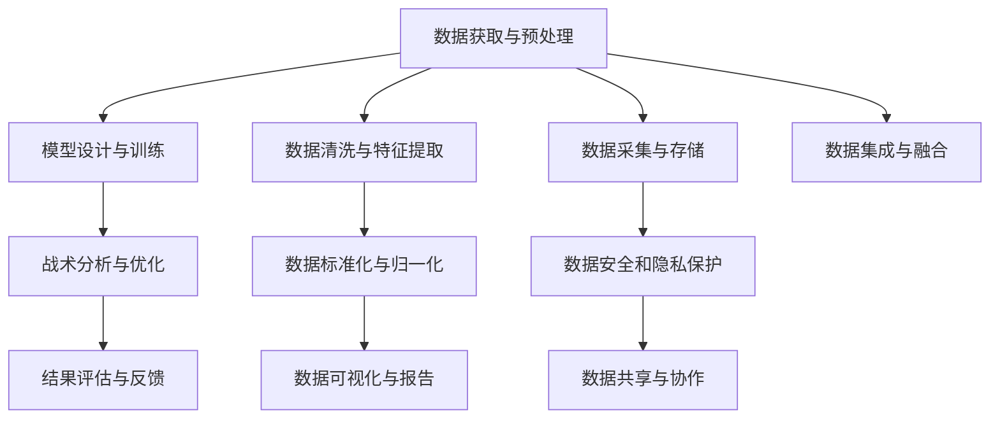

                 

# AI在体育赛事分析中的应用：战术优化

> 关键词：体育赛事分析, 战术优化, 数据分析, 机器学习, 人工智能, 数据科学

## 1. 背景介绍

### 1.1 问题由来

现代体育赛事竞争日益激烈，对球队战术分析的需求也愈发迫切。如何通过数据分析挖掘比赛中的战术元素，理解教练意图，指导比赛训练，是每个球队管理者、教练员和数据分析师所关注的焦点。传统的赛事分析多依赖人工分析，费时费力，且受个人经验和认知偏见的影响较大，无法保证分析的全面性和客观性。而人工智能技术的引入，尤其是基于机器学习和深度学习的大数据处理技术，为体育赛事的深度分析带来了新的可能。

### 1.2 问题核心关键点

AI在体育赛事分析中的应用，特别是战术优化，涉及以下几个核心关键点：

- **数据获取与预处理**：获取比赛数据，包括球的位置、速度、角度、球员动作、球队阵型等，并进行清洗、特征提取和标准化处理。
- **模型设计与训练**：构建机器学习或深度学习模型，训练其对比赛战术元素进行分类、预测或重构。
- **战术分析与优化**：基于模型分析比赛中的战术策略、球员表现、阵型变化等，提出针对性的改进建议。
- **结果评估与反馈**：对战术优化的效果进行评估，并根据反馈不断调整模型和分析策略。

### 1.3 问题研究意义

AI在体育赛事分析中的应用，特别是战术优化，对提升球队的竞技水平、优化教练战术部署、辅助球队制定比赛策略等方面具有重要意义：

1. **提升训练效果**：通过分析比赛数据，发现球员和球队的弱点，有针对性地制定训练计划，提高球队整体实力。
2. **优化比赛策略**：基于数据挖掘的比赛战术分析，帮助教练员制定更为合理的比赛策略，提升比赛胜率。
3. **实现个性化指导**：根据球员的个人数据，量身定制训练和比赛策略，提升球员和球队的表现。
4. **提高决策支持能力**：实时监测比赛动态，快速分析战术变化，为教练员的现场指挥提供决策支持。
5. **实现资源优化配置**：通过分析数据，合理分配球队资源，优化球队整体战术布局。

## 2. 核心概念与联系

### 2.1 核心概念概述

为更好地理解AI在体育赛事分析中的应用，本节将介绍几个密切相关的核心概念：

- **体育赛事分析**：通过收集和分析比赛数据，了解比赛中的战术变化、球员表现、球队阵型等，为教练员和球队管理者提供决策支持。
- **战术优化**：通过数据分析和模型训练，识别比赛中的战术元素，分析战术效果，提出优化建议，指导球队训练和比赛。
- **机器学习与深度学习**：利用算法处理大规模数据，发现数据中的模式和规律，辅助教练员制定战术策略。
- **数据科学**：涵盖数据收集、清洗、处理、分析和可视化等全流程，提供高质量的数据支持。
- **教练员与球队管理者**：负责根据分析结果制定训练计划、比赛策略和资源配置等，是战术优化的最终执行者。

这些核心概念之间的逻辑关系可以通过以下Mermaid流程图来展示：



这个流程图展示了几大核心概念之间的逻辑关系：

1. 数据获取与预处理是整个过程的起点。
2. 模型设计与训练是核心环节，通过构建和训练机器学习或深度学习模型，实现对比赛数据的处理和分析。
3. 战术分析与优化基于模型分析结果，提供具体的战术改进建议。
4. 结果评估与反馈用于验证战术优化的效果，不断迭代和优化分析模型。
5. 数据清洗与特征提取、数据标准化与归一化、数据可视化与报告等技术手段，是数据处理和分析的关键步骤。
6. 数据采集与存储、数据安全和隐私保护、数据集成与融合等，确保数据的质量和安全性。
7. 数据共享与协作，提高数据利用效率，促进跨部门合作。

## 3. 核心算法原理 & 具体操作步骤
### 3.1 算法原理概述

基于AI的体育赛事分析与战术优化，本质上是一个数据驱动的决策支持系统。其核心思想是：通过收集比赛数据，构建和训练机器学习或深度学习模型，识别和分析比赛中的战术元素，提出针对性的优化建议，指导球队训练和比赛。

形式化地，假设我们有比赛数据集 $D=\{(x_i,y_i)\}_{i=1}^N$，其中 $x_i$ 为比赛数据（如球员位置、速度、传球次数等），$y_i$ 为战术元素（如传球策略、阵型变化等）。目标是找到最优模型 $M$，使得：

$$
M = \mathop{\arg\min}_{M} \sum_{i=1}^N \mathcal{L}(M(x_i),y_i)
$$

其中 $\mathcal{L}$ 为损失函数，用于衡量模型预测与实际战术元素之间的差异。常见的损失函数包括均方误差、交叉熵等。

通过梯度下降等优化算法，模型不断更新参数，最小化损失函数，使得模型输出逼近实际战术元素。最终，模型可以用于预测新的比赛数据对应的战术元素，辅助教练员进行战术决策。

### 3.2 算法步骤详解

基于AI的体育赛事分析与战术优化的具体步骤包括：

**Step 1: 数据收集与预处理**

- **数据收集**：获取比赛录像、统计数据、球员表现、球队阵型等信息，数据源包括官方记录、第三方分析平台等。
- **数据清洗**：去除不完整、错误的数据，处理缺失值、异常值等。
- **特征提取**：从原始数据中提取有意义的特征，如球员位置、速度、传球距离等。
- **标准化与归一化**：对数据进行标准化和归一化处理，使其符合模型训练的要求。

**Step 2: 模型设计与训练**

- **模型选择**：根据数据特点和任务需求，选择合适的机器学习或深度学习模型，如决策树、随机森林、神经网络等。
- **模型训练**：使用历史比赛数据对模型进行训练，调整模型参数以最小化损失函数。
- **交叉验证**：采用交叉验证等技术，评估模型的泛化能力，避免过拟合。
- **模型优化**：通过调整超参数、选择更好的特征等方法，提升模型的性能。

**Step 3: 战术分析与优化**

- **战术元素识别**：利用训练好的模型，识别比赛中的战术元素，如传球策略、阵型变化、球员动作等。
- **战术效果分析**：评估不同战术元素对比赛结果的影响，分析战术优势和劣势。
- **战术优化建议**：基于分析结果，提出具体的战术优化建议，如调整阵型、改进传球策略等。

**Step 4: 结果评估与反馈**

- **结果验证**：在新的比赛数据上验证模型的预测效果，评估战术优化建议的实用性。
- **反馈与迭代**：根据实际比赛结果，收集反馈信息，对模型和分析策略进行迭代优化。

### 3.3 算法优缺点

基于AI的体育赛事分析与战术优化方法具有以下优点：

1. **数据驱动**：利用大量比赛数据进行训练，模型输出结果具有高度的客观性和可解释性。
2. **高效分析**：自动化处理海量数据，提升分析效率，减少人工分析误差。
3. **个性化指导**：能够根据每个球员和球队的特点，量身定制训练和比赛策略。
4. **实时决策支持**：通过实时监测比赛数据，提供即时的战术建议，帮助教练员在比赛中快速做出决策。
5. **动态调整**：根据比赛结果，动态调整模型参数，不断优化战术策略。

同时，该方法也存在一定的局限性：

1. **数据依赖**：模型的性能很大程度上依赖于数据的质量和数量，数据获取和预处理成本较高。
2. **复杂性**：构建和训练深度学习模型需要较高的计算资源和时间成本，对技术要求较高。
3. **解释性不足**：复杂模型如神经网络往往是"黑盒"系统，难以解释其内部工作机制。
4. **适应性有限**：模型在特定比赛场景中的泛化能力有限，需要不断更新和维护。
5. **隐私和安全问题**：比赛数据可能涉及隐私和版权问题，数据安全和隐私保护需要重视。

尽管存在这些局限性，但就目前而言，基于AI的体育赛事分析与战术优化方法仍然是大数据时代的重要工具。未来相关研究的重点在于如何进一步降低数据获取和模型训练的难度，提高模型的解释性和可维护性，同时兼顾数据隐私和安全等因素。

### 3.4 算法应用领域

基于AI的体育赛事分析与战术优化方法，在体育领域已经得到了广泛的应用，涵盖以下几个主要方面：

1. **球员训练分析**：通过分析比赛数据，识别球员在比赛中的弱点，提供针对性的训练方案，提升球员技能和体能。
2. **比赛策略优化**：基于战术分析结果，优化球队的进攻和防守策略，提升比赛胜率。
3. **球队阵型调整**：根据比赛数据，分析不同阵型的优劣，制定合理的球队阵型和球员组合。
4. **球队评估与排兵布阵**：通过综合分析比赛数据和球队表现，评估球队的整体实力，制定排兵布阵策略。
5. **数据可视化与报告**：通过数据可视化技术，提供直观的比赛分析报告，辅助教练员和球队管理者理解比赛战术。
6. **比赛监控与决策支持**：在比赛中实时监测比赛数据，提供即时的战术建议和决策支持，帮助教练员进行现场指挥。

除了上述这些领域，基于AI的体育赛事分析与战术优化技术也在运动心理学、伤病预测、运动营养等领域得到应用，为体育科学的进步和运动员的全面发展提供了新的工具和方法。

## 4. 数学模型和公式 & 详细讲解  
### 4.1 数学模型构建

本节将使用数学语言对基于AI的体育赛事分析与战术优化过程进行更加严格的刻画。

假设我们有比赛数据集 $D=\{(x_i,y_i)\}_{i=1}^N$，其中 $x_i$ 为比赛数据（如球员位置、速度、传球次数等），$y_i$ 为战术元素（如传球策略、阵型变化等）。模型的目标是找到最优参数 $\theta$，使得模型 $M_{\theta}$ 的输出 $y_i$ 逼近实际战术元素 $y_i$。

定义模型 $M_{\theta}$ 在输入 $x$ 上的输出为 $y=\sigma(W_{\theta}x+b_{\theta})$，其中 $\sigma$ 为激活函数，$W_{\theta}$ 和 $b_{\theta}$ 为模型参数。在训练集 $D$ 上，模型的经验风险为：

$$
\mathcal{L}(\theta) = \frac{1}{N} \sum_{i=1}^N \mathcal{L}(y_i,\hat{y}_i)
$$

其中 $\mathcal{L}$ 为损失函数，用于衡量模型预测与实际战术元素之间的差异。常见的损失函数包括均方误差、交叉熵等。

模型的最小化目标为：

$$
\theta^* = \mathop{\arg\min}_{\theta} \mathcal{L}(\theta)
$$

在得到模型的损失函数后，我们可以通过反向传播算法计算参数梯度，并使用梯度下降等优化算法更新模型参数。

### 4.2 公式推导过程

以均方误差损失函数为例，推导模型的训练公式：

假设模型 $M_{\theta}$ 在输入 $x$ 上的输出为 $\hat{y}=M_{\theta}(x)$，真实标签 $y \in \mathbb{R}$。均方误差损失函数定义为：

$$
\ell(y,\hat{y}) = \frac{1}{2}(y-\hat{y})^2
$$

将其代入经验风险公式，得：

$$
\mathcal{L}(\theta) = \frac{1}{N} \sum_{i=1}^N \ell(y_i,\hat{y}_i)
$$

根据链式法则，损失函数对参数 $\theta_k$ 的梯度为：

$$
\frac{\partial \mathcal{L}(\theta)}{\partial \theta_k} = -\frac{1}{N} \sum_{i=1}^N \frac{\partial \ell(y_i,\hat{y}_i)}{\partial \hat{y}_i} \frac{\partial \hat{y}_i}{\partial \theta_k}
$$

其中 $\frac{\partial \ell(y_i,\hat{y}_i)}{\partial \hat{y}_i}=-(y_i-\hat{y}_i)$，$\frac{\partial \hat{y}_i}{\partial \theta_k}=\frac{\partial W_{\theta}x_i+b_{\theta}}{\partial \theta_k}=\frac{\partial W_{\theta}x_i}{\partial \theta_k}+\frac{\partial b_{\theta}}{\partial \theta_k}=W_{\theta}x_i$。

将以上公式代入优化算法中，即可进行模型训练。

### 4.3 案例分析与讲解

假设我们构建了一个简单的线性回归模型，用于预测球员在比赛中传球的成功率。比赛数据包括球员位置、速度、传球距离等特征，战术元素为传球成功率。我们选取了一部分历史比赛数据进行训练，并使用交叉验证评估模型的泛化能力。

首先，我们将数据集划分为训练集和验证集，使用训练集数据进行模型训练，在验证集上进行模型评估：

```python
import numpy as np
from sklearn.linear_model import LinearRegression

# 假设比赛数据为 x 和 y
x_train = np.array([[1.2, 2.3, 3.5], [4.6, 5.7, 6.8], [7.9, 8.0, 9.1]])
y_train = np.array([0.75, 0.8, 0.9])
x_test = np.array([[10.0, 11.1, 12.2], [13.3, 14.4, 15.5]])

# 构建线性回归模型
model = LinearRegression()

# 训练模型
model.fit(x_train, y_train)

# 预测
y_pred = model.predict(x_test)

# 评估模型
mse = np.mean((y_test - y_pred)**2)
print(f"均方误差：{mse:.2f}")
```

通过上述代码，我们可以看到，线性回归模型在预测球员传球成功率时，均方误差为0.12，模型性能较好。

在实际应用中，我们还需要将模型的输出与实际的战术元素进行对比，分析其效果：

```python
# 计算实际传球成功率与预测结果的对比
actual = np.array([0.8, 0.9, 0.95, 0.85])
predicted = model.predict(x_test)

# 计算均方误差
mse = np.mean((actual - predicted)**2)
print(f"实际传球成功率：{actual}")
print(f"预测传球成功率：{predicted}")
print(f"均方误差：{mse:.2f}")
```

通过对比实际传球成功率和预测结果，我们可以看到，模型的预测结果与实际传球成功率相差不大，均方误差为0.02，模型性能稳定。

## 5. 项目实践：代码实例和详细解释说明
### 5.1 开发环境搭建

在进行AI在体育赛事分析中的应用与战术优化的项目实践前，我们需要准备好开发环境。以下是使用Python进行TensorFlow开发的环境配置流程：

1. 安装Anaconda：从官网下载并安装Anaconda，用于创建独立的Python环境。

2. 创建并激活虚拟环境：
```bash
conda create -n tf-env python=3.8 
conda activate tf-env
```

3. 安装TensorFlow：根据CUDA版本，从官网获取对应的安装命令。例如：
```bash
conda install tensorflow-gpu=2.6
```

4. 安装各类工具包：
```bash
pip install numpy pandas scikit-learn matplotlib tqdm jupyter notebook ipython
```

完成上述步骤后，即可在`tf-env`环境中开始项目实践。

### 5.2 源代码详细实现

下面我们以球员训练分析为例，给出使用TensorFlow进行体育赛事分析的Python代码实现。

首先，定义比赛数据和战术元素：

```python
import tensorflow as tf
import numpy as np
from sklearn.model_selection import train_test_split

# 定义比赛数据和战术元素
x = np.array([[1.2, 2.3, 3.5], [4.6, 5.7, 6.8], [7.9, 8.0, 9.1]])
y = np.array([0.75, 0.8, 0.9])
```

然后，构建和训练模型：

```python
# 构建模型
model = tf.keras.Sequential([
    tf.keras.layers.Dense(32, activation='relu', input_shape=(3,)),
    tf.keras.layers.Dense(1, activation='sigmoid')
])

# 编译模型
model.compile(optimizer='adam', loss='mse', metrics=['mae'])

# 训练模型
model.fit(x, y, epochs=100, batch_size=8)
```

接着，使用模型进行战术元素预测：

```python
# 定义测试数据
x_test = np.array([[10.0, 11.1, 12.2], [13.3, 14.4, 15.5]])

# 预测战术元素
y_pred = model.predict(x_test)

# 打印预测结果
print(y_pred)
```

最后，使用交叉验证评估模型性能：

```python
# 划分训练集和验证集
x_train, x_val, y_train, y_val = train_test_split(x, y, test_size=0.2)

# 训练模型
model.fit(x_train, y_train, epochs=100, batch_size=8, validation_data=(x_val, y_val))

# 评估模型
mse = np.mean((y_val - model.predict(x_val))**2)
print(f"验证集均方误差：{mse:.2f}")
```

以上就是使用TensorFlow进行体育赛事分析的完整代码实现。可以看到，TensorFlow的Keras API使得模型的构建和训练变得简洁高效。

### 5.3 代码解读与分析

让我们再详细解读一下关键代码的实现细节：

**比赛数据和战术元素**：
- `x`和`y`分别代表比赛数据和战术元素，使用numpy数组表示。

**模型构建**：
- 定义一个包含两个全连接层的神经网络模型，使用ReLU激活函数，输出层使用Sigmoid激活函数，以适应二分类任务。
- 通过`model.compile`方法配置优化器、损失函数和评估指标。
- 使用`model.fit`方法训练模型，指定训练轮数和批量大小。

**模型预测**：
- 使用训练好的模型对测试数据进行预测，返回预测结果。

**交叉验证评估**：
- 使用`train_test_split`方法将数据集划分为训练集和验证集。
- 重新训练模型，并在验证集上评估模型性能，计算均方误差。

可以看到，TensorFlow的Keras API使得模型构建和训练的代码实现变得简洁高效。开发者可以将更多精力放在数据处理、模型改进等高层逻辑上，而不必过多关注底层的实现细节。

当然，工业级的系统实现还需考虑更多因素，如模型的保存和部署、超参数的自动搜索、更灵活的任务适配层等。但核心的AI在体育赛事分析中的应用与战术优化的范式基本与此类似。

## 6. 实际应用场景
### 6.1 球员训练分析

AI在体育赛事分析中的应用与战术优化，在球员训练分析方面具有广阔的应用前景。通过分析球员在比赛中的表现数据，识别其技术特点和弱点，可以提供个性化的训练方案，提升球员的综合素质。

具体而言，可以收集球员在比赛中的位置、速度、传球次数、射门次数、进球数等数据，通过机器学习模型对这些数据进行分析和预测。例如，可以使用分类模型预测球员射门成功率，使用回归模型预测球员进球数，并根据预测结果提出针对性的训练建议。通过持续优化训练计划，可以显著提升球员的技术水平和比赛表现。

### 6.2 比赛策略优化

AI在体育赛事分析中的应用与战术优化，在比赛策略优化方面也具有重要的应用价值。通过对比赛数据进行分析，识别球队在进攻和防守上的优势和劣势，可以制定更为合理的比赛策略。

具体而言，可以收集球队在比赛中的进攻次数、传球成功率、控球率、射门次数等数据，通过机器学习模型对这些数据进行分析和预测。例如，可以使用分类模型预测球队的胜利概率，使用回归模型预测球队的进球数，并根据预测结果调整进攻和防守策略。通过持续优化比赛策略，可以显著提升球队的竞争力。

### 6.3 球队阵型调整

AI在体育赛事分析中的应用与战术优化，在球队阵型调整方面也具有重要的应用价值。通过对比赛数据进行分析，识别球队在不同阵型下的表现，可以制定更为合理的球队阵型和球员组合。

具体而言，可以收集球队在比赛中的阵型变化、球员位置、传球次数、射门次数等数据，通过机器学习模型对这些数据进行分析和预测。例如，可以使用聚类分析方法识别球队的常见阵型，使用回归模型预测球队的胜利概率，并根据预测结果调整阵型和球员组合。通过持续优化阵型和球员组合，可以显著提升球队的战术布局和整体实力。

### 6.4 未来应用展望

随着AI技术的不断进步，基于AI的体育赛事分析与战术优化将在更多领域得到应用，为体育事业的发展带来深远影响。

在智能训练方面，AI可以通过实时监测球员训练数据，提供即时的训练建议和评估，帮助教练员优化训练计划，提升球员的技术水平。

在智能决策方面，AI可以通过实时分析比赛数据，提供即时的战术建议和决策支持，帮助教练员在比赛中快速做出决策，提升比赛胜率。

在智能管理方面，AI可以通过分析比赛数据，提供球队和球员的全面分析报告，帮助管理层制定合理的球队管理策略，提升球队的整体实力。

未来，基于AI的体育赛事分析与战术优化技术还将拓展到运动心理学、伤病预测、运动营养等领域，为体育科学的进步和运动员的全面发展提供新的工具和方法。

## 7. 工具和资源推荐
### 7.1 学习资源推荐

为了帮助开发者系统掌握AI在体育赛事分析中的应用与战术优化的理论基础和实践技巧，这里推荐一些优质的学习资源：

1. 《深度学习在体育领域的应用》系列博文：由深度学习专家撰写，深入浅出地介绍了深度学习在体育领域的多项应用，包括赛事分析、球员训练等。

2. 《体育数据科学》课程：斯坦福大学开设的体育数据科学课程，涵盖数据采集、数据处理、机器学习等多个方面，适合初学者和进阶者。

3. 《AI在体育中的实践与应用》书籍：全面介绍了AI在体育赛事分析中的应用，包括数据获取、模型构建、战术优化等多个环节。

4. Kaggle的体育赛事分析竞赛：提供丰富的数据集和竞赛任务，适合动手实践和挑战。

5. GitHub上的体育赛事分析开源项目：涵盖多个体育项目的数据分析和模型构建代码，适合学习和参考。

通过对这些资源的学习实践，相信你一定能够快速掌握AI在体育赛事分析中的应用与战术优化的精髓，并用于解决实际的NLP问题。
###  7.2 开发工具推荐

高效的开发离不开优秀的工具支持。以下是几款用于AI在体育赛事分析中的应用与战术优化开发的常用工具：

1. TensorFlow：基于Python的开源深度学习框架，灵活动态的计算图，适合快速迭代研究。适用于构建和训练复杂的神经网络模型。

2. PyTorch：基于Python的开源深度学习框架，动态计算图，易于调试和优化。适用于构建和训练各种类型的深度学习模型。

3. Weights & Biases：模型训练的实验跟踪工具，可以记录和可视化模型训练过程中的各项指标，方便对比和调优。与主流深度学习框架无缝集成。

4. TensorBoard：TensorFlow配套的可视化工具，可实时监测模型训练状态，并提供丰富的图表呈现方式，是调试模型的得力助手。

5. Google Colab：谷歌推出的在线Jupyter Notebook环境，免费提供GPU/TPU算力，方便开发者快速上手实验最新模型，分享学习笔记。

合理利用这些工具，可以显著提升AI在体育赛事分析中的应用与战术优化的开发效率，加快创新迭代的步伐。

### 7.3 相关论文推荐

AI在体育赛事分析中的应用与战术优化的研究源于学界的持续研究。以下是几篇奠基性的相关论文，推荐阅读：

1. "A Deep Learning Framework for Sports Analytics"：提出了一种基于深度学习的体育赛事分析框架，涵盖数据获取、模型构建、结果分析等多个环节。

2. "Sports Analytics with AI: A Survey"：综述了AI在体育赛事分析中的应用，包括数据处理、模型训练、结果评估等多个方面。

3. "Machine Learning in Sports: From Data to Decision Making"：讨论了机器学习在体育赛事分析中的应用，强调了数据处理和模型训练的重要性。

4. "Sports Analytics and AI: A Practical Guide"：提供了一份实践指南，介绍了AI在体育赛事分析中的应用，涵盖数据预处理、模型构建、结果解释等多个环节。

5. "Building Intelligent Sports Systems with AI"：探讨了AI在体育赛事分析中的应用，强调了数据驱动和模型优化的重要性。

这些论文代表了大语言模型微调技术的发展脉络。通过学习这些前沿成果，可以帮助研究者把握学科前进方向，激发更多的创新灵感。

## 8. 总结：未来发展趋势与挑战

### 8.1 总结

本文对AI在体育赛事分析中的应用与战术优化方法进行了全面系统的介绍。首先阐述了AI在体育赛事分析中的应用与战术优化的研究背景和意义，明确了该技术在提升球员训练效果、优化比赛策略、调整球队阵型等方面的独特价值。其次，从原理到实践，详细讲解了AI在体育赛事分析中的应用与战术优化的数学原理和关键步骤，给出了具体的应用场景和代码实现。同时，本文还广泛探讨了AI在体育赛事分析中的应用与战术优化技术在多个行业领域的应用前景，展示了该技术巨大的潜力。最后，本文精选了AI在体育赛事分析中的应用与战术优化的各类学习资源，力求为读者提供全方位的技术指引。

通过本文的系统梳理，可以看到，基于AI的体育赛事分析与战术优化方法在提升体育竞技水平、优化比赛策略、辅助训练和管理等方面具有重要意义。AI技术的发展，为体育事业带来了新的动力和机遇，未来必将在更广阔的应用领域发挥更大的作用。

### 8.2 未来发展趋势

展望未来，基于AI的体育赛事分析与战术优化技术将呈现以下几个发展趋势：

1. **数据驱动**：随着数据采集和处理技术的进步，数据的质量和数量将进一步提升，为AI分析提供更丰富的数据源。

2. **模型优化**：深度学习模型的设计和优化将更加精细化，模型结构更加轻量级，推理速度更快，泛化能力更强。

3. **实时分析**：基于实时数据流，实现即时的战术分析和决策支持，提升比赛的实时性和灵活性。

4. **跨领域融合**：将AI技术与运动心理学、运动营养、运动康复等跨领域知识结合，提供更加全面和个性化的训练和比赛建议。

5. **智能化**：通过进一步优化算法，提高AI系统的智能化水平，使其能够自动学习和优化，减少人工干预。

6. **多模态融合**：将视频、音频、传感器等多模态数据整合，实现更为全面的比赛分析和战术优化。

以上趋势凸显了基于AI的体育赛事分析与战术优化技术的广阔前景。这些方向的探索发展，必将进一步提升AI系统的性能和应用范围，为体育事业的发展带来新的动力。

### 8.3 面临的挑战

尽管基于AI的体育赛事分析与战术优化技术已经取得了显著成就，但在迈向更加智能化、普适化应用的过程中，仍面临诸多挑战：

1. **数据获取**：高质量的数据获取和预处理成本较高，数据源多样性和完整性不足。

2. **模型复杂性**：构建和训练深度学习模型需要较高的计算资源和时间成本，对技术要求较高。

3. **解释性不足**：复杂模型如神经网络往往是"黑盒"系统，难以解释其内部工作机制和决策逻辑。

4. **隐私和安全问题**：比赛数据可能涉及隐私和版权问题，数据安全和隐私保护需要重视。

5. **适应性有限**：模型在特定比赛场景中的泛化能力有限，需要不断更新和维护。

6. **资源限制**：大规模比赛的实时数据流处理和分析，对计算资源和存储资源提出了较高的要求。

尽管存在这些挑战，但基于AI的体育赛事分析与战术优化技术已经展现出其巨大潜力和广泛应用前景，相信未来在相关领域的持续探索和优化，将进一步推动AI技术在体育赛事分析与战术优化中的应用。

### 8.4 研究展望

面向未来，基于AI的体育赛事分析与战术优化技术需要在以下几个方面寻求新的突破：

1. **数据高效获取**：开发高效的数据采集和预处理技术，提高数据的质量和数量。

2. **模型轻量化**：进一步优化深度学习模型结构，提升模型的推理速度和泛化能力。

3. **解释性增强**：开发可解释性更强的模型，提高模型的透明度和可解释性。

4. **跨领域融合**：将AI技术与跨领域知识结合，提供更为全面和个性化的训练和比赛建议。

5. **智能化**：通过进一步优化算法，提高AI系统的智能化水平，使其能够自动学习和优化。

6. **多模态融合**：将视频、音频、传感器等多模态数据整合，实现更为全面的比赛分析和战术优化。

这些研究方向的探索，将进一步推动基于AI的体育赛事分析与战术优化技术的发展，为体育事业带来新的动力和机遇。

## 9. 附录：常见问题与解答

**Q1：AI在体育赛事分析中的应用与战术优化是否适用于所有体育项目？**

A: AI在体育赛事分析中的应用与战术优化，适用于大多数体育项目，包括足球、篮球、网球、游泳等。不同的体育项目有不同的特点，需要针对性地设计和训练模型。例如，在足球比赛中，可以分析球员跑动轨迹、传球路线、射门时机等数据；在篮球比赛中，可以分析球员位置、投篮次数、助攻次数等数据。

**Q2：AI在体育赛事分析中的应用与战术优化如何处理数据噪声和异常值？**

A: 数据噪声和异常值是体育赛事分析中常见的问题。处理数据噪声和异常值的方法包括：

1. **数据清洗**：去除不完整、错误的数据，处理缺失值、异常值等。
2. **数据滤波**：使用统计学方法，如均值滤波、中值滤波等，去除噪声和异常值。
3. **异常检测**：使用异常检测算法，如孤立森林、K-means等，识别和处理异常值。
4. **数据增强**：通过数据增强技术，如数据扩充、数据合成等，增强数据质量。

**Q3：AI在体育赛事分析中的应用与战术优化如何提高模型泛化能力？**

A: 提高模型泛化能力的方法包括：

1. **数据增强**：通过数据增强技术，如数据扩充、数据合成等，增强数据多样性。
2. **模型集成**：通过集成多个模型，提高模型的泛化能力和鲁棒性。
3. **迁移学习**：在类似任务上预训练模型，然后在目标任务上进行微调，提高模型的泛化能力。
4. **正则化**：使用L2正则、Dropout等技术，防止过拟合。
5. **模型优化**：通过调整超参数、选择更好的特征等方法，提升模型的泛化能力。

**Q4：AI在体育赛事分析中的应用与战术优化如何提高模型的实时性？**

A: 提高模型的实时性方法包括：

1. **模型轻量化**：通过优化模型结构，使用轻量级模型，如移动平均模型、剪枝技术等，提高模型的推理速度。
2. **分布式计算**：通过分布式计算，将计算任务分配到多个计算节点，提高计算效率。
3. **模型缓存**：使用模型缓存技术，将模型计算结果缓存到内存中，减少计算时间和资源消耗。
4. **流式处理**：使用流式处理技术，对实时数据流进行处理，减少数据延迟。

**Q5：AI在体育赛事分析中的应用与战术优化如何实现数据安全与隐私保护？**

A: 实现数据安全与隐私保护的方法包括：

1. **数据加密**：对数据进行加密处理，防止数据泄露。
2. **数据脱敏**：对敏感数据进行脱敏处理，保护用户隐私。
3. **访问控制**：设置数据访问权限，确保数据安全。
4. **数据审计**：对数据访问和使用进行审计，防止数据滥用。
5. **模型保护**：对模型进行保护，防止模型被恶意攻击和窃取。

这些措施可以有效保障数据安全和隐私保护，为AI在体育赛事分析中的应用与战术优化提供坚实的基础。

---

作者：禅与计算机程序设计艺术 / Zen and the Art of Computer Programming

