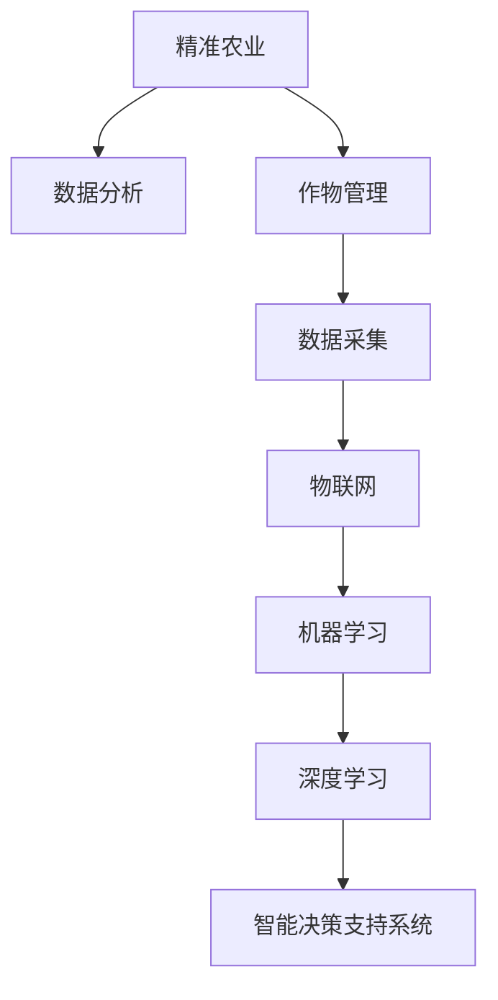

                 

# AI在农业科技中的应用：精准农业与作物管理

> 关键词：AI, 精准农业, 作物管理, 数据分析, 物联网, 机器学习, 深度学习

## 1. 背景介绍

### 1.1 问题由来

农业作为人类赖以生存的基石，其生产效率直接关系到食品供给和环境保护。传统农业依赖经验与人工劳动，面临生产效率低、资源利用率不高、环境污染严重等诸多问题。随着信息技术的飞速发展，智能技术被引入农业领域，通过精准农业和作物管理等技术手段，实现资源的有效利用和农业生产智能化，推动农业向更加可持续、高效、智能的方向发展。

近年来，全球范围内的智慧农业发展迅速，多个国家在政策层面予以支持，并积极推动智慧农业的发展。AI在农业科技中的应用，尤其是精准农业和作物管理的结合，已成为现代农业的关键方向。本文将从背景、核心概念、算法原理、实际应用和未来发展趋势等多个维度，详细探讨AI在精准农业与作物管理中的应用。

### 1.2 问题核心关键点

AI在精准农业与作物管理中的应用，主要涉及以下几个核心关键点：

1. **数据分析与处理**：利用AI技术对农田数据进行采集、存储和分析，包括气候数据、土壤数据、作物生长数据等。
2. **物联网技术应用**：通过物联网传感器和设备，实时监测农田环境和作物生长状态，获取动态数据。
3. **机器学习与深度学习**：通过机器学习模型进行数据分析和模式识别，深度学习模型则用于更复杂的数据处理和预测。
4. **智能决策支持系统**：基于数据分析和机器学习结果，构建智能决策支持系统，提供农业生产管理建议。
5. **无人机与机器人**：利用无人机和机器人进行自动化作业，如播撒、收割等。

这些关键点共同构成了AI在精准农业与作物管理中的主要技术框架，有助于实现农业生产的精准化和智能化。

## 2. 核心概念与联系

### 2.1 核心概念概述

为了更好地理解AI在精准农业与作物管理中的应用，本文将介绍几个核心概念及其联系：

- **精准农业(Precision Agriculture)**：利用信息技术和智能技术，对农田进行精确管理，实现资源的高效利用和农业生产的智能化。精准农业主要涉及数据采集、处理和分析，以及智能决策支持系统等技术手段。
- **作物管理(Crop Management)**：指在农业生产中，通过科学方法对作物进行种、管、收等环节的全面管理，确保作物健康生长和产量最大化。作物管理强调对田间管理措施的精确控制，提高农业生产效率。
- **数据分析(Analytics)**：通过收集、处理和分析农田数据，获取作物生长状态、土壤肥力、气象信息等关键信息，为精准农业和作物管理提供数据支持。
- **物联网(IoT)**：利用传感器和设备，实时监测农田环境和作物生长状态，收集动态数据。物联网为精准农业提供了数据获取的基础。
- **机器学习(Machine Learning)**：通过构建数据模型，对农田数据进行分析和预测，识别作物生长状态和健康状况。机器学习在精准农业中用于模式识别和决策支持。
- **深度学习(Deep Learning)**：相较于传统机器学习，深度学习能够处理更加复杂的数据结构，适用于作物生长状态预测、病虫害检测等高难度任务。
- **智能决策支持系统(Intelligent Decision Support System, IDSS)**：基于数据分析和机器学习结果，构建智能决策支持系统，提供农业生产管理建议，辅助决策。

这些核心概念之间的逻辑关系可以通过以下Mermaid流程图来展示：



这个流程图展示了大语言模型的核心概念及其之间的关系：

1. 精准农业通过数据分析和作物管理技术，实现资源的高效利用和农业生产的智能化。
2. 数据分析涉及数据采集和物联网技术，实时获取农田动态数据。
3. 机器学习和深度学习技术用于处理分析农田数据，提取有用的信息。
4. 智能决策支持系统基于数据分析和机器学习结果，提供科学决策建议。

## 3. 核心算法原理 & 具体操作步骤
### 3.1 算法原理概述

AI在精准农业与作物管理中的应用，主要基于数据分析和机器学习技术，通过构建数据模型，对农田数据进行分析和预测，实现智能决策和精准管理。其核心算法原理如下：

1. **数据采集与处理**：利用物联网设备实时采集农田数据，包括气候数据、土壤数据、作物生长数据等。
2. **特征提取**：对采集到的数据进行预处理和特征提取，提取出对作物生长和产量预测有用的特征。
3. **模型训练**：基于提取出的特征，使用机器学习或深度学习模型进行训练，构建预测模型。
4. **模型评估与优化**：对训练好的模型进行评估，根据评估结果进行模型优化。
5. **智能决策**：根据预测结果，智能决策支持系统提供农业生产管理建议，实现精准农业和作物管理。

### 3.2 算法步骤详解

AI在精准农业与作物管理中的应用，主要包括以下几个关键步骤：

**Step 1: 数据采集与预处理**
- 利用物联网传感器和设备，实时监测农田环境（如温度、湿度、光照等）和作物生长状态（如叶面积、生长高度等），获取动态数据。
- 对采集到的数据进行预处理，包括清洗、补全和标准化等操作，确保数据的准确性和一致性。

**Step 2: 特征提取与选择**
- 利用统计方法和领域知识，从预处理后的数据中提取出对作物生长和产量预测有用的特征。例如，土壤中的氮、磷、钾含量，天气状况等。
- 选择关键特征，构建特征向量，用于后续的机器学习或深度学习模型的训练。

**Step 3: 模型训练与优化**
- 根据选择的特征向量，使用机器学习或深度学习模型进行训练，构建预测模型。
- 对训练好的模型进行评估，根据评估结果调整模型参数，优化模型性能。
- 采用交叉验证等方法，防止模型过拟合，提高模型的泛化能力。

**Step 4: 智能决策与支持**
- 根据训练好的模型，对新的农田数据进行预测，获取作物的生长状态和产量预测。
- 利用智能决策支持系统，结合领域知识，提供农业生产管理建议，如施肥、灌溉、病虫害防治等。
- 实时监测预测结果与实际生产数据的差异，及时调整管理策略，确保精准农业和作物管理的有效性。

### 3.3 算法优缺点

AI在精准农业与作物管理中的应用，具有以下优点：

1. **提高生产效率**：利用智能技术对农田进行精确管理，实现资源的有效利用，提高农业生产效率。
2. **减少资源浪费**：通过精确管理，减少资源浪费，降低农业生产成本。
3. **改善环境**：减少化肥和农药的使用，降低对环境的污染，实现可持续农业。

同时，这些技术也存在一些缺点：

1. **技术复杂性高**：涉及到数据分析、机器学习、深度学习等多个技术领域，技术实现复杂。
2. **初始投入高**：需要投入大量的设备和技术资源，对技术和资金的要求较高。
3. **数据获取难度大**：需要获取大量的农田数据，数据获取和处理难度较大。
4. **模型解释性不足**：深度学习模型的黑盒特性，难以解释其决策过程，影响模型的可信度。

### 3.4 算法应用领域

AI在精准农业与作物管理中的应用，主要涉及以下几个领域：

1. **气象数据分析**：利用AI技术对气象数据进行分析，预测天气变化，指导农业生产。
2. **土壤肥力分析**：通过AI分析土壤数据，判断土壤肥力，指导施肥和灌溉。
3. **作物生长预测**：利用AI模型预测作物生长状态和产量，优化种植方案。
4. **病虫害防治**：基于AI技术，实时监测农田病虫害状态，及时采取防治措施。
5. **农业机器人应用**：利用无人机和机器人进行自动化作业，提高作业效率和精准度。

这些应用领域展示了AI在精准农业与作物管理中的广泛应用，推动了农业生产方式的变革。

## 4. 数学模型和公式 & 详细讲解 & 举例说明
### 4.1 数学模型构建

本文以作物生长预测为例，介绍如何使用数学模型进行精准农业与作物管理。

设作物生长状态为 $y$，影响因素包括土壤肥力 $x_1$、气候条件 $x_2$、病虫害状态 $x_3$ 等。构建多元线性回归模型：

$$
y = \beta_0 + \beta_1 x_1 + \beta_2 x_2 + \beta_3 x_3 + \epsilon
$$

其中 $\beta_0$ 为截距，$\beta_1$、$\beta_2$、$\beta_3$ 为回归系数，$\epsilon$ 为误差项。

### 4.2 公式推导过程

利用多元线性回归模型，通过对历史数据 $D=\{(x_i, y_i)\}_{i=1}^N$ 进行最小二乘法回归，得到回归系数 $\beta$：

$$
\beta = \mathop{\arg\min}_{\beta} \sum_{i=1}^N (y_i - \beta_0 - \beta_1 x_{1,i} - \beta_2 x_{2,i} - \beta_3 x_{3,i})^2
$$

对 $D$ 中的每一个数据点 $(x_i, y_i)$，构建预测方程：

$$
y_i = \beta_0 + \beta_1 x_{1,i} + \beta_2 x_{2,i} + \beta_3 x_{3,i}
$$

通过模型预测，可以实时监测和预测作物的生长状态，为精准农业和作物管理提供科学依据。

### 4.3 案例分析与讲解

以某农场的数据为例，展示如何利用数学模型进行作物生长预测：

- 数据集：某农场2018-2022年的气象数据、土壤数据和作物生长数据。
- 目标：预测2023年作物的生长状态。
- 特征：气象条件、土壤肥力、病虫害状态。
- 模型：多元线性回归模型。
- 步骤：
  1. 数据预处理：清洗、补全数据，进行标准化处理。
  2. 特征选择：选择关键特征，构建特征向量。
  3. 模型训练：使用最小二乘法回归，得到回归系数。
  4. 模型评估：利用交叉验证，评估模型性能。
  5. 预测：对2023年数据进行预测，获取作物生长状态。

实际应用中，利用机器学习或深度学习模型，可以对数据进行更复杂、更准确的分析和预测。例如，使用决策树、随机森林、神经网络等模型，可以在复杂环境中实现更加精确的预测。

## 5. 项目实践：代码实例和详细解释说明
### 5.1 开发环境搭建

在进行项目实践前，我们需要准备好开发环境。以下是使用Python进行PyTorch开发的环境配置流程：

1. 安装Anaconda：从官网下载并安装Anaconda，用于创建独立的Python环境。

2. 创建并激活虚拟环境：
```bash
conda create -n pytorch-env python=3.8 
conda activate pytorch-env
```

3. 安装PyTorch：根据CUDA版本，从官网获取对应的安装命令。例如：
```bash
conda install pytorch torchvision torchaudio cudatoolkit=11.1 -c pytorch -c conda-forge
```

4. 安装其他相关库：
```bash
pip install pandas numpy scikit-learn matplotlib pyproj cygnet
```

完成上述步骤后，即可在`pytorch-env`环境中开始项目实践。

### 5.2 源代码详细实现

我们以作物生长预测为例，展示如何使用PyTorch进行模型的训练和预测。

首先，准备数据集：

```python
import pandas as pd
from sklearn.model_selection import train_test_split

# 加载数据集
data = pd.read_csv('crop_data.csv')

# 特征工程
features = data[['temperature', 'humidity', 'soil_nitrogen', 'soil_phosphorus', 'soil_potassium']]
target = data['growth_state']

# 分割数据集
train_features, val_features, train_target, val_target = train_test_split(features, target, test_size=0.2, random_state=42)
```

接着，定义模型：

```python
import torch
from torch import nn

class CropRegression(nn.Module):
    def __init__(self, input_dim, output_dim):
        super(CropRegression, self).__init__()
        self.fc1 = nn.Linear(input_dim, 64)
        self.fc2 = nn.Linear(64, output_dim)
        
    def forward(self, x):
        x = torch.relu(self.fc1(x))
        x = self.fc2(x)
        return x
```

定义损失函数和优化器：

```python
criterion = nn.MSELoss()
optimizer = torch.optim.Adam(model.parameters(), lr=0.01)
```

然后，训练模型：

```python
def train_model(model, features, targets, epochs):
    for epoch in range(epochs):
        model.train()
        optimizer.zero_grad()
        predictions = model(features)
        loss = criterion(predictions, targets)
        loss.backward()
        optimizer.step()
        
        if (epoch+1) % 10 == 0:
            print(f'Epoch {epoch+1}, Loss: {loss.item():.4f}')
```

最后，进行预测和评估：

```python
def evaluate_model(model, features, targets):
    model.eval()
    predictions = model(features)
    loss = criterion(predictions, targets)
    mse = loss.item()
    print(f'Validation Loss: {mse:.4f}')
    
def predict(model, new_features):
    model.eval()
    predictions = model(new_features)
    return predictions

# 训练模型
train_model(model, train_features, train_target, epochs=100)

# 评估模型
evaluate_model(model, val_features, val_target)

# 进行预测
new_features = torch.tensor([[24, 70, 2.5, 0.5, 0.1]])
prediction = predict(model, new_features)
print(f'Prediction: {prediction.item():.4f}')
```

### 5.3 代码解读与分析

让我们再详细解读一下关键代码的实现细节：

**特征工程**：
- 利用pandas库，对原始数据进行清洗、补全和标准化处理，提取关键特征。
- 数据集分割：利用train_test_split函数，将数据集分为训练集和验证集。

**模型定义**：
- 定义一个简单的神经网络模型CropRegression，包含两个全连接层。
- 使用ReLU激活函数，增加模型的非线性表达能力。

**损失函数与优化器**：
- 定义均方误差损失函数，用于评估模型预测结果与真实标签的差异。
- 使用Adam优化器，进行模型参数的更新。

**训练与评估**：
- 定义训练函数train_model，用于模型训练。
- 在每个epoch结束后，输出模型损失。
- 定义评估函数evaluate_model，用于模型验证集上的评估。
- 定义预测函数predict，用于对新数据进行预测。

通过以上代码实现，我们可以快速搭建一个基于PyTorch的作物生长预测模型，进行训练和评估。

## 6. 实际应用场景

### 6.1 智能灌溉系统

智能灌溉系统是精准农业中的重要应用之一。通过实时监测土壤水分和气象条件，智能灌溉系统可以自动调整灌溉策略，确保作物水分供给的精准化和合理化。

以某农场为例，智能灌溉系统由以下几个部分组成：
- 传感器：土壤湿度传感器、气象站等，实时监测农田环境。
- 数据采集器：将传感器数据采集并上传至云端。
- 云端平台：利用机器学习模型进行数据分析，生成灌溉策略。
- 执行器：根据灌溉策略，控制灌溉设备。

智能灌溉系统的工作流程如下：
1. 传感器实时采集农田数据，上传至云端平台。
2. 云端平台利用机器学习模型，分析数据并生成灌溉策略。
3. 执行器根据灌溉策略，自动调整灌溉设备，实现精准灌溉。

智能灌溉系统通过数据分析和智能决策，实现农业生产的精准化，提高资源利用率，减少水资源浪费。

### 6.2 病虫害防治系统

病虫害防治是作物管理中的重要环节。利用AI技术，可以实现病虫害的早期预警和智能防治，减少农药的使用，提高农业生产的可持续性。

以某果园为例，病虫害防治系统由以下几个部分组成：
- 传感器：病虫害检测传感器，实时监测农田病虫害状态。
- 数据采集器：将传感器数据采集并上传至云端。
- 云端平台：利用深度学习模型进行病虫害检测和预测。
- 执行器：根据病虫害检测结果，自动调整防治策略。

病虫害防治系统的工作流程如下：
1. 传感器实时监测农田病虫害状态，上传至云端平台。
2. 云端平台利用深度学习模型，进行病虫害检测和预测。
3. 执行器根据检测结果，自动调整防治策略，如喷洒农药、隔离处理等。

病虫害防治系统通过深度学习模型，实时监测和预测病虫害状态，减少农药的使用，提高农业生产的可持续性。

### 6.3 精准施肥系统

精准施肥是提高作物产量和品质的重要手段。利用AI技术，可以实现对农田土壤肥力的精准评估和科学施肥。

以某农场为例，精准施肥系统由以下几个部分组成：
- 传感器：土壤肥力传感器，实时监测土壤肥力状况。
- 数据采集器：将传感器数据采集并上传至云端。
- 云端平台：利用机器学习模型进行土壤肥力评估和推荐施肥方案。
- 执行器：根据施肥方案，控制施肥设备。

精准施肥系统的工作流程如下：
1. 传感器实时监测土壤肥力，上传至云端平台。
2. 云端平台利用机器学习模型，评估土壤肥力并推荐施肥方案。
3. 执行器根据施肥方案，自动调整施肥设备，实现精准施肥。

精准施肥系统通过数据分析和智能决策，实现对土壤肥力的精准评估和科学施肥，提高作物的产量和品质。

## 7. 工具和资源推荐
### 7.1 学习资源推荐

为了帮助开发者系统掌握AI在精准农业与作物管理中的应用，这里推荐一些优质的学习资源：

1. 《智慧农业技术与应用》：全面介绍智慧农业的概念、技术体系和应用场景。
2. 《机器学习实战》：讲解机器学习基本原理和实际应用，适合初学者入门。
3. 《深度学习》（Ian Goodfellow）：深度学习领域的经典教材，系统讲解深度学习的基本理论和应用。
4. 《PyTorch官方文档》：PyTorch官方文档，提供了详细的API和示例代码，适合开发者进行学习和实践。
5. 《OpenCV计算机视觉》：讲解计算机视觉基本原理和应用，适合开发者进行视觉数据分析。

通过对这些资源的学习实践，相信你一定能够快速掌握AI在精准农业与作物管理中的应用，并用于解决实际的农业问题。
###  7.2 开发工具推荐

高效的开发离不开优秀的工具支持。以下是几款用于AI在精准农业与作物管理中的开发工具：

1. PyTorch：基于Python的开源深度学习框架，灵活动态的计算图，适合快速迭代研究。
2. TensorFlow：由Google主导开发的开源深度学习框架，生产部署方便，适合大规模工程应用。
3. Transformers库：HuggingFace开发的NLP工具库，集成了众多SOTA语言模型，支持PyTorch和TensorFlow，适合进行文本数据分析。
4. Weights & Biases：模型训练的实验跟踪工具，可以记录和可视化模型训练过程中的各项指标，方便对比和调优。
5. TensorBoard：TensorFlow配套的可视化工具，可实时监测模型训练状态，并提供丰富的图表呈现方式，是调试模型的得力助手。
6. Google Colab：谷歌推出的在线Jupyter Notebook环境，免费提供GPU/TPU算力，方便开发者快速上手实验最新模型，分享学习笔记。

合理利用这些工具，可以显著提升AI在精准农业与作物管理中的开发效率，加快创新迭代的步伐。

### 7.3 相关论文推荐

AI在精准农业与作物管理中的应用，是一个跨学科的研究领域，涉及计算机科学、农业科学、统计学等多个学科。以下是几篇奠基性的相关论文，推荐阅读：

1. 《精确农业中的统计分析》：利用统计分析方法，对农田数据进行分析和建模，指导精准农业实践。
2. 《基于机器学习的精准农业决策支持系统》：介绍机器学习在精准农业中的应用，构建智能决策支持系统。
3. 《深度学习在农业中的应用》：系统介绍深度学习在作物生长预测、病虫害检测等任务中的应用。
4. 《基于无人机和机器人的精准农业技术》：探讨无人机和机器人在精准农业中的应用，提高作业效率和精准度。

这些论文代表了大语言模型微调技术的发展脉络。通过学习这些前沿成果，可以帮助研究者把握学科前进方向，激发更多的创新灵感。

## 8. 总结：未来发展趋势与挑战

### 8.1 总结

本文对AI在精准农业与作物管理中的应用进行了全面系统的介绍。首先阐述了AI技术在农业领域的重要性，明确了精准农业和作物管理的核心概念和关键技术。其次，从原理到实践，详细讲解了AI在精准农业与作物管理中的应用方法，并给出了完整代码实例。同时，本文还广泛探讨了AI在智能灌溉、病虫害防治、精准施肥等诸多实际场景中的应用，展示了AI在农业生产中的巨大潜力。此外，本文精选了AI在精准农业与作物管理中的学习资源、开发工具和相关论文，力求为读者提供全方位的技术指引。

通过本文的系统梳理，可以看到，AI技术在精准农业与作物管理中的应用前景广阔，具有极高的实用价值和创新潜力。AI技术的引入，将推动农业生产向更加智能、精准、可持续的方向发展，为全球食品安全和环境保护做出重要贡献。

### 8.2 未来发展趋势

展望未来，AI在精准农业与作物管理中的应用将呈现以下几个发展趋势：

1. **智能化程度提升**：随着技术进步，AI在精准农业中的应用将更加智能化，能够实现更精确的作物生长预测、病虫害防治和智能灌溉等。
2. **多模态数据融合**：利用视觉、听觉、嗅觉等多模态数据，实现对作物生长状态的全方位监测和预测。
3. **深度学习应用普及**：深度学习技术在精准农业中的应用将更加广泛，提高模型的预测精度和鲁棒性。
4. **数据平台化建设**：建立统一的数据平台，实现数据的集中存储和高效利用，为精准农业提供数据支持。
5. **机器人自动化作业**：利用机器人进行自动化作业，提高农业生产的效率和精度。
6. **全球协作与共享**：推动全球范围内的智慧农业协作，实现知识和技术的共享，推动智慧农业的发展。

以上趋势凸显了AI在精准农业与作物管理中的广阔前景。这些方向的探索发展，必将进一步提升农业生产的智能化水平，为实现可持续农业和食品安全做出重要贡献。

### 8.3 面临的挑战

尽管AI在精准农业与作物管理中的应用已经取得了显著进展，但在迈向更加智能化、普适化应用的过程中，它仍面临着诸多挑战：

1. **技术复杂性高**：涉及到数据分析、机器学习、深度学习等多个技术领域，技术实现复杂。
2. **数据获取难度大**：需要获取大量的农田数据，数据获取和处理难度较大。
3. **模型鲁棒性不足**：模型在面对新数据时，泛化性能可能大打折扣，需要进一步提高模型的鲁棒性。
4. **硬件资源需求高**：AI技术的应用需要高性能计算资源，对硬件设备的要求较高。
5. **模型解释性不足**：深度学习模型的黑盒特性，难以解释其决策过程，影响模型的可信度。

### 8.4 研究展望

面对AI在精准农业与作物管理中的应用所面临的挑战，未来的研究需要在以下几个方面寻求新的突破：

1. **数据获取与预处理**：开发更加便捷的数据采集和预处理技术，降低数据获取难度。
2. **模型鲁棒性提升**：提高模型的泛化性能，确保模型在不同环境下的稳定性和可靠性。
3. **硬件优化与成本降低**：优化模型结构，降低计算资源需求，提高模型应用的经济性。
4. **模型解释性增强**：开发可解释性模型，增强模型的可信度和可接受度。
5. **多模态数据融合**：开发能够高效融合多模态数据的AI模型，实现全方位监测和预测。
6. **全球智慧农业协作**：推动全球智慧农业的协作与共享，实现知识和技术的共享，推动智慧农业的发展。

这些研究方向的探索，必将引领AI在精准农业与作物管理中的应用迈向更高的台阶，为实现可持续农业和食品安全做出重要贡献。

## 9. 附录：常见问题与解答

**Q1：AI在精准农业中的应用是否适用于所有类型的农场？**

A: AI在精准农业中的应用主要依赖于数据采集和传感器技术，不同类型和规模的农场在设备和技术投入上存在差异。对于设备和技术投入较高的现代化农场，AI的应用效果更加显著。而对于设备和技术投入较低的传统农场，可能需要结合实际情况进行合理规划和逐步推进。

**Q2：如何选择合适的传感器和数据采集器？**

A: 选择传感器和数据采集器时，需要考虑农田的具体需求和环境条件。例如，土壤湿度传感器适用于监测土壤水分，气象站适用于监测气温、湿度等环境参数。此外，还应考虑传感器的精度、可靠性和成本等因素，选择适合自身需求的设备。

**Q3：AI在精准农业中的数据处理和分析方法有哪些？**

A: AI在精准农业中的数据处理和分析方法包括：
1. 数据清洗和补全：清洗缺失数据，补全不完整数据，确保数据质量。
2. 数据标准化：将不同单位和格式的数据进行标准化处理，方便后续分析。
3. 特征工程：提取对作物生长和产量预测有用的特征，构建特征向量。
4. 机器学习和深度学习模型：利用统计方法和深度学习模型，对数据进行分析和预测。
5. 数据可视化：通过图表和可视化工具，直观展示数据和分析结果，辅助决策。

**Q4：AI在精准农业中的应用是否会对环境造成负面影响？**

A: AI在精准农业中的应用，主要是通过数据分析和智能决策，实现资源的高效利用和农业生产的智能化。其本身并不会对环境造成负面影响。然而，在实际应用中，仍需注意以下几点：
1. 减少化学农药和化肥的使用，降低对环境的污染。
2. 合理利用资源，避免过度灌溉和施肥，减少资源浪费。
3. 定期监测和维护设备，确保其正常运行，减少能源消耗。

通过合理的技术应用和规范的管理，AI在精准农业中的应用可以最大限度地减少对环境的负面影响，实现可持续农业。

**Q5：AI在精准农业中的应用是否需要高昂的技术和资金投入？**

A: AI在精准农业中的应用，确实需要一定的技术和资金投入，包括数据采集设备、传感器、云计算平台等。但随着技术的进步和设备的普及，这些投入将逐渐降低，技术的成本效益将逐步显现。此外，通过与科研机构、技术公司等合作，可以获得更多的技术支持和资金补贴，降低应用门槛。

---

作者：禅与计算机程序设计艺术 / Zen and the Art of Computer Programming

