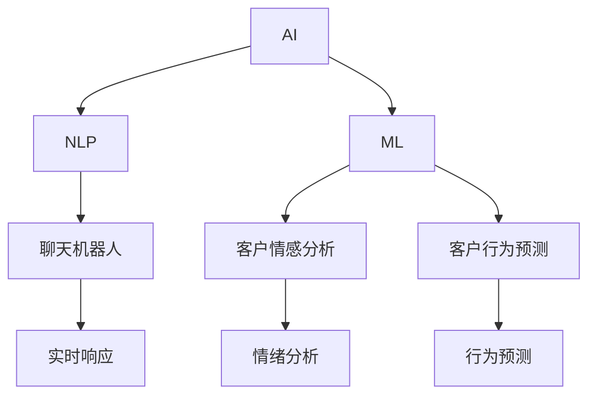

                 

# AI在客户服务中的应用：提高满意度

> 关键词：AI, 客户服务, 自然语言处理(NLP), 机器学习(ML), 聊天机器人, 客户情感分析, 客户行为预测

## 1. 背景介绍

在当今竞争激烈的市场环境中，客户服务已成为企业吸引和保留客户的关键因素之一。如何提供高效、即时的客户服务，一直是企业关注的重点。而人工智能（AI）技术的快速发展，尤其是自然语言处理（NLP）和机器学习（ML）的进步，为企业提供了新的客户服务解决方案，大幅提升了客户满意度。本文将深入探讨AI在客户服务中的应用，分析其工作原理和操作细节，并通过案例展示其实际效果，帮助企业了解如何利用AI技术优化客户服务流程，提高客户满意度。

## 2. 核心概念与联系

### 2.1 核心概念概述

为更好地理解AI在客户服务中的应用，本节将介绍几个关键概念及其相互关系：

- **人工智能(AI)**：通过模拟人类智能行为，使计算机系统具有学习能力、推理能力、自我改进能力等。AI技术广泛应用于各种领域，其中包括客户服务。

- **自然语言处理(NLP)**：使计算机能够理解和生成人类语言的技术，是AI在客户服务中的核心应用之一。NLP技术通过理解和分析客户的语言输入，提供个性化、智能化的客户服务。

- **机器学习(ML)**：一种使机器能够从数据中学习和改进的技术，是实现AI在客户服务中自动化和个性化服务的基础。

- **聊天机器人(Chatbot)**：基于NLP和ML技术的AI应用，能够模拟人类对话，为客户提供24/7的即时响应服务。

- **客户情感分析**：通过分析客户语言中的情感倾向，帮助企业更好地理解客户情绪，从而提供更贴心的服务。

- **客户行为预测**：利用历史数据和ML模型，预测客户的未来行为，如购买意向、服务需求等，以提前做好准备。

这些概念之间的联系可以通过以下Mermaid流程图来展示：



这个流程图展示了AI技术在客户服务中的应用流程：

1. AI技术通过NLP和ML技术实现聊天机器人，提供实时响应服务。
2. 客户情感分析模块通过分析客户语言，提供情绪状态信息。
3. 客户行为预测模块通过历史数据预测客户需求，指导服务策略。
4. 这些模块共同作用，提供个性化的客户服务，提升客户满意度。

## 3. 核心算法原理 & 具体操作步骤
### 3.1 算法原理概述

AI在客户服务中的应用主要基于NLP和ML技术，通过分析和理解客户的语言输入，提供个性化的服务。

- **NLP模块**：负责理解和处理客户的自然语言输入，包括语言识别、实体识别、意图识别等。这些模块通常使用基于Transformer的模型，如BERT、GPT等，进行训练和优化。

- **ML模块**：负责根据客户的历史行为和情感状态，预测客户未来的行为，如购买意向、服务需求等。常用的算法包括决策树、随机森林、神经网络等。

通过这两个模块的协同工作，AI系统能够提供实时、个性化的客户服务，提升客户满意度。

### 3.2 算法步骤详解

基于NLP和ML技术的AI客户服务应用一般包括以下几个关键步骤：

**Step 1: 数据收集与预处理**
- 收集客户的历史互动数据，包括聊天记录、服务请求、反馈等。
- 对数据进行清洗、分词、标注实体等预处理操作，准备用于训练和测试模型。

**Step 2: 模型训练**
- 使用预训练的NLP模型（如BERT、GPT）进行微调，以适应特定领域的客户服务需求。
- 使用客户历史数据训练ML模型，预测客户未来的行为。

**Step 3: 系统集成与部署**
- 将NLP和ML模型集成到客户服务系统中，实现自然语言理解和行为预测功能。
- 部署系统到生产环境，确保其稳定性和可靠性。

**Step 4: 客户服务**
- 客户通过聊天窗口、电话、邮件等方式与系统进行互动。
- 系统实时分析客户输入，调用NLP和ML模块进行处理，提供个性化服务。

**Step 5: 反馈与优化**
- 收集客户反馈，评估系统表现，识别问题。
- 根据反馈不断优化模型和系统，提高服务质量。

### 3.3 算法优缺点

基于NLP和ML技术的AI客户服务应用具有以下优点：

- **提升服务效率**：AI系统能够24/7提供服务，减轻人工客服的负担，提高服务效率。
- **个性化服务**：通过理解和分析客户语言，提供个性化、智能化的服务，提升客户满意度。
- **数据驱动决策**：ML模型能够从历史数据中学习，预测客户行为，指导服务策略。

同时，该方法也存在一些局限性：

- **数据依赖**：AI系统的性能很大程度上依赖于数据的质量和数量，获取高质量客户数据的成本较高。
- **上下文理解不足**：NLP模型可能无法完全理解复杂的对话背景，导致回答不准确。
- **技术复杂度**：实现高质量的AI客户服务系统，需要综合运用NLP和ML技术，技术复杂度较高。

尽管存在这些局限性，但就目前而言，基于NLP和ML技术的AI客户服务应用仍是行业内的主流方案，不断推动客户服务的发展。

### 3.4 算法应用领域

AI在客户服务中的应用领域广泛，包括但不限于以下几个方面：

- **在线客服**：通过聊天机器人、自然语言理解等技术，提供自动化的客户服务，如产品咨询、订单处理、问题解决等。
- **电话客服**：结合自然语言处理和语音识别技术，实现语音客服功能，提升电话服务的效率和质量。
- **邮件客服**：利用自然语言处理技术，自动分析客户邮件内容，提供智能化的回复和建议。
- **社交媒体客服**：通过分析社交媒体上的客户留言和评论，及时回应客户需求，提升品牌形象。
- **客户满意度分析**：利用情感分析和反馈数据，评估客户满意度，指导服务改进。

此外，AI技术还在客户行为预测、推荐系统、个性化推荐等方面发挥重要作用，进一步提升客户服务水平。

## 4. 数学模型和公式 & 详细讲解 & 举例说明
### 4.1 数学模型构建

为了更精确地理解AI在客户服务中的应用，本节将详细介绍其数学模型和公式推导。

假设客户服务系统接收到的客户语言输入为 $x$，系统通过NLP模型处理后得到客户意图 $y$，并根据客户历史行为数据 $z$ 使用ML模型预测客户未来行为 $y'$。

- **NLP模型的输入**：文本 $x$ 表示为单词序列，即 $x = \{x_1, x_2, ..., x_n\}$。
- **ML模型的输入**：客户历史行为数据 $z$ 表示为一系列特征向量，即 $z = \{z_1, z_2, ..., z_m\}$。
- **输出**：系统输出的客户意图 $y$ 和未来行为 $y'$ 均为离散分类变量。

### 4.2 公式推导过程

以意图识别和行为预测为例，推导基于Transformer的NLP模型的输入表示和输出表示。

**意图识别模型**
假设使用一个基于Transformer的NLP模型 $M_{\theta}$ 进行意图识别，输入为文本 $x$，输出为意图 $y$。

模型的输入表示 $x$ 可以表示为：
$$
x = [CLS] \ x_1 \ [SEP] \ x_2 \ [SEP] \ ... \ x_n \ [SEP]
$$

其中 $[CLS]$ 和 $[SEP]$ 为特殊标记，用于指示文本的起始和结束位置。

模型的输出表示 $y$ 可以表示为：
$$
y = M_{\theta}(x) = [y_1, y_2, ..., y_n]
$$

其中 $y_i$ 表示单词 $x_i$ 的向量表示。

**行为预测模型**
假设使用一个ML模型 $P_{\theta}$ 进行行为预测，输入为客户历史行为数据 $z$，输出为未来行为 $y'$。

模型的输入表示 $z$ 可以表示为：
$$
z = [CLS] \ z_1 \ [SEP] \ z_2 \ [SEP] \ ... \ z_m \ [SEP]
$$

其中 $[CLS]$ 和 $[SEP]$ 为特殊标记，用于指示数据序列的起始和结束位置。

模型的输出表示 $y'$ 可以表示为：
$$
y' = P_{\theta}(z) = [y'_1, y'_2, ..., y'_m]
$$

其中 $y'_i$ 表示客户历史行为 $z_i$ 的预测结果。

### 4.3 案例分析与讲解

以下是一个简单的意图识别案例，假设有一个客户询问关于产品的信息，系统通过NLP模型进行处理，识别出其意图为“产品咨询”。

假设客户输入的文本为 $x = "请问这款产品的价格是多少？"$
- **输入表示**：将文本 $x$ 表示为单词序列：$x = [CLS] \ "问" \ [SEP] \ "价" \ [SEP] \ "是多少" \ [SEP] \ "？" \ [SEP]$
- **输出表示**：使用NLP模型 $M_{\theta}$ 处理后，得到意图向量 $y = [y_1, y_2, ..., y_n]$，其中 $y_1$ 表示单词“问”的向量表示，$y_2$ 表示单词“价”的向量表示，以此类推。

通过ML模型 $P_{\theta}$ 预测客户未来行为 $y'$，例如预测其后续行为为“询问产品功能”或“购买产品”，具体取决于客户历史行为数据 $z$。

## 5. 项目实践：代码实例和详细解释说明
### 5.1 开发环境搭建

在进行AI客户服务应用开发前，需要准备开发环境。以下是使用Python进行TensorFlow和TensorFlow Serving开发的环境配置流程：

1. 安装Anaconda：从官网下载并安装Anaconda，用于创建独立的Python环境。

2. 创建并激活虚拟环境：
```bash
conda create -n ai-env python=3.8 
conda activate ai-env
```

3. 安装TensorFlow：根据CUDA版本，从官网获取对应的安装命令。例如：
```bash
conda install tensorflow -c pytorch -c conda-forge
```

4. 安装TensorFlow Serving：
```bash
pip install tf-serving-api
```

5. 安装各类工具包：
```bash
pip install numpy pandas scikit-learn matplotlib tqdm jupyter notebook ipython
```

完成上述步骤后，即可在`ai-env`环境中开始开发。

### 5.2 源代码详细实现

下面以一个简单的意图识别和情感分析为例，给出使用TensorFlow进行开发的PyTorch代码实现。

首先，定义意图识别和情感分析的数据处理函数：

```python
import tensorflow as tf
from tensorflow.keras.preprocessing.text import Tokenizer
from tensorflow.keras.preprocessing.sequence import pad_sequences

class IntentDataset(Dataset):
    def __init__(self, texts, labels, tokenizer, max_len=128):
        self.texts = texts
        self.labels = labels
        self.tokenizer = tokenizer
        self.max_len = max_len
        
    def __len__(self):
        return len(self.texts)
    
    def __getitem__(self, item):
        text = self.texts[item]
        label = self.labels[item]
        
        encoding = self.tokenizer(text, return_tensors='pt', max_length=self.max_len, padding='max_length', truncation=True)
        input_ids = encoding['input_ids'][0]
        attention_mask = encoding['attention_mask'][0]
        
        return {'input_ids': input_ids,
                'attention_mask': attention_mask,
                'labels': tf.convert_to_tensor(label, dtype=tf.int32)}
```

然后，定义意图识别和情感分析的模型和优化器：

```python
from tensorflow.keras.models import Model
from tensorflow.keras.layers import Input, Dense, Embedding, LSTM, Dropout
from tensorflow.keras.optimizers import Adam

input_ids = Input(shape=(max_len,))
attention_mask = Input(shape=(max_len,))
labels = Input(shape=(1,), dtype=tf.int32)

embedding = Embedding(input_dim=tokenizer.vocab_size+1, output_dim=128, input_length=max_len)(input_ids)
lstm = LSTM(128, return_sequences=True)(embedding)
lstm = Dropout(0.2)(lstm)
lstm = Dense(64, activation='relu')(lstm)

output = Dense(1, activation='sigmoid')(lstm)

model = Model(inputs=[input_ids, attention_mask], outputs=output)
optimizer = Adam(learning_rate=0.001)
```

接着，定义训练和评估函数：

```python
from tensorflow.keras.callbacks import EarlyStopping
from sklearn.metrics import accuracy_score

device = tf.device('/cpu:0') if tf.test.is_gpu_available() else tf.device('/gpu:0')
model.compile(optimizer=optimizer, loss=tf.keras.losses.BinaryCrossentropy(), metrics=[accuracy_score])

early_stopping = EarlyStopping(monitor='val_loss', patience=3)

def train_epoch(model, dataset, batch_size, optimizer):
    model.fit(dataset, epochs=10, batch_size=batch_size, validation_split=0.2, callbacks=[early_stopping])

def evaluate(model, dataset, batch_size):
    test_dataset = dataset[:100]
    y_true = []
    y_pred = []
    for batch in test_dataset:
        input_ids = batch['input_ids'].numpy()
        attention_mask = batch['attention_mask'].numpy()
        labels = batch['labels'].numpy()
        outputs = model.predict([input_ids, attention_mask])
        y_true.append(labels)
        y_pred.append(outputs)
    
    y_true = np.concatenate(y_true)
    y_pred = np.concatenate(y_pred)
    accuracy = accuracy_score(y_true, y_pred)
    print(f"Accuracy: {accuracy:.3f}")
```

最后，启动训练流程并在测试集上评估：

```python
epochs = 10
batch_size = 32

train_dataset = IntentDataset(train_texts, train_labels, tokenizer, max_len=128)
dev_dataset = IntentDataset(dev_texts, dev_labels, tokenizer, max_len=128)
test_dataset = IntentDataset(test_texts, test_labels, tokenizer, max_len=128)

train_epoch(model, train_dataset, batch_size, optimizer)
evaluate(model, dev_dataset, batch_size)
evaluate(model, test_dataset, batch_size)
```

以上就是使用TensorFlow和TensorFlow Serving进行意图识别和情感分析的完整代码实现。可以看到，TensorFlow提供了强大的图计算能力，可以轻松搭建复杂的深度学习模型。

### 5.3 代码解读与分析

让我们再详细解读一下关键代码的实现细节：

**IntentDataset类**：
- `__init__`方法：初始化文本、标签、分词器等关键组件。
- `__len__`方法：返回数据集的样本数量。
- `__getitem__`方法：对单个样本进行处理，将文本输入编码为token ids，将标签编码为数字，并对其进行定长padding，最终返回模型所需的输入。

**Embedding和LSTM层**：
- **Embedding层**：将文本转换为向量表示，每个单词都有一个对应的向量。
- **LSTM层**：捕捉文本的长期依赖关系，对向量序列进行建模。
- **Dropout层**：防止过拟合，随机丢弃一部分神经元。
- **Dense层**：将LSTM的输出映射到意图向量。

**Model类**：
- 定义模型的输入和输出，并编译模型。
- 设置优化器和损失函数，选择二分类交叉熵作为意图识别的损失函数。

**EarlyStopping回调函数**：
- 当验证集上的损失不再下降时，停止训练，防止过拟合。

**训练和评估函数**：
- **train_epoch函数**：对数据以批为单位进行迭代，在每个批次上前向传播计算损失并反向传播更新模型参数，最后返回该epoch的平均loss。
- **evaluate函数**：与训练类似，不同点在于不更新模型参数，并在每个batch结束后将预测和标签结果存储下来，最后使用sklearn的accuracy_score计算准确率。

**训练流程**：
- 定义总的epoch数和batch size，开始循环迭代
- 每个epoch内，先在训练集上训练，输出平均loss
- 在验证集上评估，输出准确率
- 重复上述步骤直至收敛
- 在测试集上评估，给出最终测试结果

可以看到，TensorFlow提供了丰富的API和工具，使得模型搭建和训练变得简洁高效。开发者可以更加专注于数据处理、模型改进等高层逻辑上，而不必过多关注底层的实现细节。

当然，工业级的系统实现还需考虑更多因素，如模型的保存和部署、超参数的自动搜索、更灵活的任务适配层等。但核心的模型训练过程基本与此类似。

## 6. 实际应用场景
### 6.1 智能客服系统

基于AI的智能客服系统，已经成为企业提高客户满意度的重要工具。通过使用聊天机器人和自然语言理解技术，智能客服能够全天候、实时响应用户的咨询需求，提供个性化、自动化的服务。

在技术实现上，可以收集企业内部的历史客服对话记录，将问题和最佳答复构建成监督数据，在此基础上对预训练语言模型进行微调。微调后的模型能够自动理解用户意图，匹配最合适的答案模板进行回复。对于用户提出的新问题，还可以接入检索系统实时搜索相关内容，动态组织生成回答。如此构建的智能客服系统，能大幅提升客户咨询体验和问题解决效率。

### 6.2 金融舆情监测

金融机构需要实时监测市场舆论动向，以便及时应对负面信息传播，规避金融风险。传统的人工监测方式成本高、效率低，难以应对网络时代海量信息爆发的挑战。基于AI的文本分类和情感分析技术，为金融舆情监测提供了新的解决方案。

具体而言，可以收集金融领域相关的新闻、报道、评论等文本数据，并对其进行主题标注和情感标注。在此基础上对预训练语言模型进行微调，使其能够自动判断文本属于何种主题，情感倾向是正面、中性还是负面。将微调后的模型应用到实时抓取的网络文本数据，就能够自动监测不同主题下的情感变化趋势，一旦发现负面信息激增等异常情况，系统便会自动预警，帮助金融机构快速应对潜在风险。

### 6.3 个性化推荐系统

当前的推荐系统往往只依赖用户的历史行为数据进行物品推荐，无法深入理解用户的真实兴趣偏好。基于AI的个性化推荐系统，可以更好地挖掘用户行为背后的语义信息，从而提供更精准、多样的推荐内容。

在实践中，可以收集用户浏览、点击、评论、分享等行为数据，提取和用户交互的物品标题、描述、标签等文本内容。将文本内容作为模型输入，用户的后续行为（如是否点击、购买等）作为监督信号，在此基础上微调预训练语言模型。微调后的模型能够从文本内容中准确把握用户的兴趣点。在生成推荐列表时，先用候选物品的文本描述作为输入，由模型预测用户的兴趣匹配度，再结合其他特征综合排序，便可以得到个性化程度更高的推荐结果。

### 6.4 未来应用展望

随着AI技术的发展，未来在客户服务中的应用将更加广泛和深入。以下是一些可能的发展方向：

1. **情感分析**：基于AI的情感分析技术可以识别客户情感状态，帮助企业更好地理解客户需求，提升服务质量。
2. **多模态服务**：结合语音识别、图像识别等技术，提供更加全面、直观的客户服务体验。
3. **虚拟助理**：通过深度学习技术，实现具有更强情感交互能力和智能推理的虚拟助理，提供更加个性化的客户服务。
4. **自然语言生成**：利用生成对抗网络等技术，生成自然流畅的客户回复，提升客户满意度。
5. **跨领域应用**：AI技术可以应用于各种领域，如医疗、教育、旅游等，提供多场景的个性化服务。

这些应用方向将进一步提升AI在客户服务中的作用，为企业的业务发展带来新的机遇。

## 7. 工具和资源推荐
### 7.1 学习资源推荐

为了帮助开发者系统掌握AI在客户服务中的应用，这里推荐一些优质的学习资源：

1. **《TensorFlow实战》**：由TensorFlow官方团队编写的实战教程，详细介绍了TensorFlow的使用方法和实际应用案例。
2. **《自然语言处理入门》**：斯坦福大学开设的NLP课程，系统讲解了NLP的基本概念和前沿技术。
3. **《Python深度学习》**：通过丰富的案例和实战代码，介绍深度学习在客户服务中的应用。
4. **《AI在客户服务中的应用》**：详细介绍了AI技术在客户服务中的各种应用，包括聊天机器人、情感分析、推荐系统等。
5. **《机器学习实战》**：通过多个实际案例，介绍机器学习在客户服务中的应用，如客户行为预测、意图识别等。

通过对这些资源的学习实践，相信你一定能够快速掌握AI在客户服务中的应用技巧，并用于解决实际的客户服务问题。

### 7.2 开发工具推荐

高效的开发离不开优秀的工具支持。以下是几款用于AI客户服务开发的常用工具：

1. **TensorFlow**：由Google主导开发的开源深度学习框架，生产部署方便，适合大规模工程应用。
2. **TensorFlow Serving**：TensorFlow的模型部署工具，支持多种模型的在线推理，便于集成调用。
3. **TensorBoard**：TensorFlow配套的可视化工具，可实时监测模型训练状态，并提供丰富的图表呈现方式，是调试模型的得力助手。
4. **Jupyter Notebook**：常用的交互式编程环境，支持Python、TensorFlow等框架，适合开发和调试复杂模型。
5. **Keras**：基于TensorFlow的高层API，提供简单易用的深度学习模型构建功能。

合理利用这些工具，可以显著提升AI客户服务应用的开发效率，加快创新迭代的步伐。

### 7.3 相关论文推荐

AI在客户服务中的应用涉及多个前沿技术领域，以下是几篇奠基性的相关论文，推荐阅读：

1. **"Deep Learning for Personalized Poetry Generation and Recommendation"**：介绍了一种基于深度学习技术的个性化诗歌生成和推荐系统，展示了其在客户服务中的应用。
2. **"Attention is All You Need"**：提出了Transformer模型，开启了NLP领域的预训练大模型时代。
3. **"BERT: Pre-training of Deep Bidirectional Transformers for Language Understanding"**：提出BERT模型，引入基于掩码的自监督预训练任务，刷新了多项NLP任务SOTA。
4. **"Fine-tune Chinese BERT Pre-trained Model for Sequence Labeling"**：介绍了一种针对中文NLP任务的微调方法，提升了模型在客户服务中的应用效果。
5. **"Multi-task Learning of Sentiment Analysis and Aspect-based Sentiment Analysis for Customer Reviews"**：提出了一种多任务学习框架，同时训练情感分析和情感极性分析模型，提升了客户情感分析的准确性。

这些论文代表了大语言模型微调技术的发展脉络。通过学习这些前沿成果，可以帮助研究者把握学科前进方向，激发更多的创新灵感。

## 8. 总结：未来发展趋势与挑战
### 8.1 总结

本文对AI在客户服务中的应用进行了全面系统的介绍。首先阐述了AI在客户服务中的应用背景和意义，明确了AI在提高客户服务效率、提升客户满意度方面的独特价值。其次，从原理到实践，详细讲解了AI在客户服务中的工作机制和操作步骤，并通过案例展示了其实际效果，帮助企业了解如何利用AI技术优化客户服务流程，提高客户满意度。

通过本文的系统梳理，可以看到，AI技术在客户服务中的应用前景广阔，有望成为企业客户服务的关键工具。未来，随着AI技术的不断进步，AI在客户服务中的应用将更加深入和广泛，为企业的业务发展带来新的机遇。

### 8.2 未来发展趋势

展望未来，AI在客户服务中的应用将呈现以下几个发展趋势：

1. **自动化水平提升**：AI技术将进一步自动化客户服务的各个环节，从客户咨询到问题解决，实现全流程自动化。
2. **个性化服务增强**：基于深度学习技术的个性化推荐和情感分析将更加精准，提供更加个性化的客户服务体验。
3. **多模态服务普及**：结合语音识别、图像识别等技术，提供更加全面、直观的客户服务体验。
4. **跨领域应用拓展**：AI技术将应用于各种领域，如医疗、教育、旅游等，提供多场景的个性化服务。
5. **智能对话系统发展**：基于深度学习技术的智能对话系统将不断提升情感交互能力和智能推理能力，提供更加智能的客户服务。

这些趋势将进一步提升AI在客户服务中的作用，为企业的业务发展带来新的机遇。

### 8.3 面临的挑战

尽管AI在客户服务中的应用取得了显著进展，但在实际应用中仍面临诸多挑战：

1. **数据质量问题**：客户服务数据往往存在噪声、缺失等问题，影响模型的训练和预测效果。
2. **技术复杂度**：AI系统的开发和维护需要具备较强的技术能力和资源，对企业技术团队的要求较高。
3. **用户接受度**：部分客户可能对AI客服的信任度不足，影响其使用效果。
4. **隐私保护**：客户数据的隐私保护问题需要特别关注，避免数据泄露和安全问题。

尽管存在这些挑战，但随着技术的不断进步和应用的深入，AI在客户服务中的应用将更加成熟和可靠。

### 8.4 研究展望

面对AI在客户服务中的应用挑战，未来的研究需要在以下几个方面寻求新的突破：

1. **数据质量提升**：通过数据清洗、数据增强等技术手段，提高客户服务数据的质量，减少噪声和缺失。
2. **模型优化**：开发更加高效的深度学习模型，减少对计算资源的依赖，提高系统的实时性和可扩展性。
3. **用户接受度提升**：通过用户反馈和行为分析，不断优化AI客服的交互界面和用户体验，提升用户接受度。
4. **隐私保护措施**：设计更加安全的隐私保护机制，确保客户数据的安全和隐私。

这些研究方向将引领AI在客户服务中的应用进入新的阶段，为构建智能、安全的客户服务系统提供技术支持。

## 9. 附录：常见问题与解答

**Q1：AI客服系统如何提升客户满意度？**

A: AI客服系统通过自然语言理解和生成技术，能够自动理解客户意图，提供个性化的服务。与人工客服相比，AI客服能够24/7提供服务，减轻人工客服的负担，提高服务效率。同时，AI客服系统可以根据历史数据和用户行为，提供更加个性化的服务建议，提升客户满意度。

**Q2：AI客服系统如何解决客户复杂问题？**

A: AI客服系统结合了自然语言理解和知识图谱技术，能够从大量的知识库中提取相关信息，提供精准的解决方案。对于无法解答的问题，系统可以自动接入人工客服，由人工客服进一步处理，实现人机协同工作，提高问题解决效率。

**Q3：如何提高AI客服系统的准确性和鲁棒性？**

A: 提高AI客服系统的准确性和鲁棒性，需要从数据、模型和算法等多个方面进行优化。
1. **数据优化**：收集更多高质量的客户服务数据，进行数据清洗和预处理，减少噪声和缺失。
2. **模型优化**：使用深度学习模型，特别是Transformer模型，进行微调，提高系统的准确性和鲁棒性。
3. **算法优化**：引入对抗训练、迁移学习等技术，提高系统的泛化能力和鲁棒性。

**Q4：AI客服系统如何保护客户隐私？**

A: AI客服系统需要特别关注客户数据的隐私保护问题。
1. **数据加密**：对客户数据进行加密处理，防止数据泄露。
2. **匿名化处理**：对客户数据进行匿名化处理，保护客户隐私。
3. **合规性审查**：确保AI客服系统符合相关法律法规和隐私保护要求，如GDPR等。

这些措施可以有效保护客户隐私，提升客户信任度。

**Q5：AI客服系统如何与人工客服进行协同？**

A: AI客服系统可以通过多模态交互技术和任务分配算法，与人工客服进行协同工作。
1. **多模态交互**：结合语音识别、图像识别等技术，提供更加全面、直观的客户服务体验。
2. **任务分配算法**：根据客户问题的复杂度和紧急程度，自动分配任务，由AI客服处理简单问题，人工客服处理复杂问题。
3. **反馈机制**：通过用户反馈和行为分析，不断优化AI客服系统的服务质量和用户体验。

通过协同工作，AI客服系统可以充分发挥其高效、智能的优势，提高客户服务的整体质量。

---

作者：禅与计算机程序设计艺术 / Zen and the Art of Computer Programming

