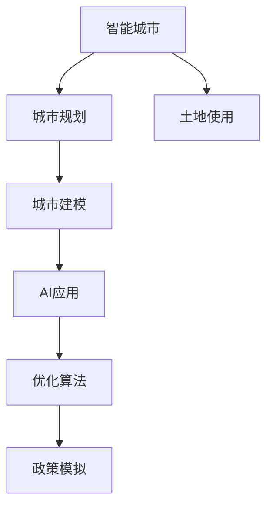

                 

# AI在智能城市规划中的应用：优化土地使用

> 关键词：智能城市，城市规划，土地使用，AI应用，数据科学，城市建模，机器学习，优化算法，政策模拟

## 1. 背景介绍

### 1.1 问题由来

在城市化进程不断加速的今天，城市规划与土地使用管理变得越来越复杂。如何在有限的土地资源下实现高质量、可持续的城市发展，成为全球许多国家和地区面临的共同挑战。传统的城市规划和土地使用管理方法往往依赖人工经验，难以全面覆盖各地区的具体情况，且难以高效处理海量数据。而人工智能（AI）技术的出现，为城市规划和土地使用管理提供了新的思路和工具。通过数据驱动、智能分析，AI技术可以帮助城市规划者和决策者更科学、更高效地进行土地使用优化。

### 1.2 问题核心关键点

AI在智能城市规划中的应用，主要聚焦于以下几个核心关键点：

- **数据获取与处理**：大规模城市数据获取与清洗，包括地理信息系统（GIS）数据、遥感影像、气象数据、交通流量数据等。
- **城市建模与分析**：基于地理空间分析和机器学习，构建城市模型，对城市形态、交通流量、环境质量等进行预测和分析。
- **土地使用优化**：通过智能算法，对城市土地进行合理规划与使用，提升土地利用效率，减少城市病问题。
- **政策模拟与评估**：模拟不同政策干预下的土地使用效果，评估其对城市发展的长期影响，辅助政策制定。

### 1.3 问题研究意义

AI在智能城市规划中的应用，具有重要研究意义：

- **提高规划效率**：AI技术能够快速处理和分析海量城市数据，大幅提高城市规划的效率。
- **增强决策科学性**：AI模型能够基于数据提供科学、客观的规划建议，减少决策的主观偏差。
- **促进可持续发展**：通过优化土地使用，AI有助于减少资源浪费，推动城市的绿色、可持续发展。
- **提升城市治理水平**：AI的引入能够增强城市管理的智能化和精细化水平，提升城市治理的整体效果。

## 2. 核心概念与联系

### 2.1 核心概念概述

为了更好地理解AI在智能城市规划中的应用，本节将介绍几个密切相关的核心概念：

- **智能城市**：利用信息和通信技术（ICT），实现城市基础设施智能化，提升城市管理和服务水平。
- **城市规划**：对城市发展进行长期、全面的战略规划，包括土地使用、交通布局、公共设施建设等。
- **土地使用**：指城市中各类用地（如居住、商业、工业等）的分布和利用情况，影响城市功能、生态环境、交通等。
- **AI应用**：指利用机器学习、数据科学等技术，实现城市数据的智能分析和应用。
- **城市建模**：通过构建虚拟城市模型，对城市进行模拟和预测，辅助规划决策。
- **优化算法**：指用于解决最优化问题的算法，如线性规划、遗传算法、模拟退火等。
- **政策模拟**：使用AI模型模拟不同政策干预下的土地使用效果，评估政策影响。

这些核心概念之间的逻辑关系可以通过以下Mermaid流程图来展示：



这个流程图展示了几组核心概念及其之间的关系：

1. 智能城市通过城市规划和土地使用管理实现。
2. 城市建模是城市规划的重要工具。
3. AI应用为城市建模提供技术支持。
4. 优化算法帮助AI应用解决具体问题。
5. 政策模拟辅助决策者评估政策影响。

这些概念共同构成了智能城市规划的框架，使得AI技术能够在大规模土地使用优化中发挥重要作用。

## 3. 核心算法原理 & 具体操作步骤

### 3.1 算法原理概述

AI在智能城市规划中的应用，主要是通过构建城市模型，利用机器学习算法，对土地使用进行优化和预测。其核心思想是：将城市视为一个复杂系统，通过数据驱动和智能分析，揭示城市发展规律，优化土地使用配置，以实现城市的可持续发展。

### 3.2 算法步骤详解

基于AI的智能城市规划和土地使用优化，一般包括以下几个关键步骤：

**Step 1: 数据准备与处理**
- 收集城市相关的地理信息系统（GIS）数据、遥感影像、气象数据、交通流量数据等。
- 对数据进行清洗、标注，去除噪声和错误，确保数据质量。
- 对数据进行特征工程，提取和构造关键特征，如人口密度、交通便利性、环境质量等。

**Step 2: 城市建模**
- 构建虚拟城市模型，描述城市空间结构和功能分布。
- 对模型进行参数化，建立数学模型，描述城市系统的动态行为。
- 使用地理信息系统（GIS）技术，可视化城市模型和分析结果。

**Step 3: 数据驱动分析**
- 应用机器学习算法，如回归分析、分类算法、聚类算法等，对城市数据进行建模和预测。
- 对模型进行评估和调优，确保模型的准确性和鲁棒性。
- 使用可视化工具，展示分析结果和模型性能。

**Step 4: 土地使用优化**
- 基于城市模型和数据分析结果，优化土地使用配置。
- 应用优化算法，如线性规划、遗传算法等，寻找最优解。
- 对优化结果进行模拟和评估，确保其可行性和有效性。

**Step 5: 政策模拟与评估**
- 模拟不同政策干预下的土地使用效果。
- 使用AI模型评估政策对城市发展的长期影响。
- 提供政策建议，辅助决策者制定和调整政策。

以上是基于AI的智能城市规划和土地使用优化的主要步骤，每一步都需要细致的操作和优化，才能最终实现城市规划的目标。

### 3.3 算法优缺点

基于AI的智能城市规划和土地使用优化方法，具有以下优点：

- **数据驱动**：利用城市大数据，进行科学分析，减少规划决策的随机性和主观偏差。
- **自动化**：通过自动化算法，提高规划效率，缩短规划周期。
- **精确性**：AI模型能够处理和分析海量数据，提供精确的分析和预测结果。
- **灵活性**：可以灵活应用不同算法，解决复杂的规划问题。

同时，该方法也存在一定的局限性：

- **数据依赖**：AI的精度和效果高度依赖数据质量和全面性，数据不足或错误将影响结果。
- **算法复杂**：AI算法复杂度高，需要专业的技术支持和资源投入。
- **解释性差**：AI模型的决策过程往往缺乏可解释性，难以直观理解。
- **模型鲁棒性**：模型对输入数据的敏感性较高，输入微小变化可能导致输出较大变化。

尽管存在这些局限性，但AI在智能城市规划中的应用已经成为不可逆转的趋势，未来将有更多创新和突破。

### 3.4 算法应用领域

基于AI的智能城市规划和土地使用优化，已经在多个领域得到了广泛应用：

- **交通规划**：通过分析交通流量数据，优化道路布局和公共交通系统，减少交通拥堵。
- **能源规划**：利用能源使用数据，优化城市能源供应和使用，提高能源效率。
- **环境管理**：对城市环境数据进行建模和分析，评估环境质量，制定环境改善措施。
- **住房建设**：通过分析人口分布和用地需求，优化住房建设布局和规划。
- **灾害应对**：对气象数据和地质数据进行分析和预测，提高城市灾害应对能力。

这些应用领域展示了AI在智能城市规划中的广阔前景，未来还将拓展到更多领域，为城市发展注入新的动力。

## 4. 数学模型和公式 & 详细讲解 & 举例说明

### 4.1 数学模型构建

为更好地理解AI在智能城市规划中的应用，本节将使用数学语言对土地使用优化的数学模型进行详细讲解。

记城市面积为 $A$，不同类型的用地（如住宅、商业、工业等）面积为 $A_{res}$、$A_{com}$、$A_{ind}$，则土地总面积为：

$$
A = A_{res} + A_{com} + A_{ind}
$$

设不同类型的用地价格分别为 $p_{res}$、$p_{com}$、$p_{ind}$，则城市总收益 $R$ 为：

$$
R = p_{res}A_{res} + p_{com}A_{com} + p_{ind}A_{ind}
$$

土地使用的优化目标为最大化城市总收益 $R$，即：

$$
\max_{A_{res}, A_{com}, A_{ind}} R
$$

在实际应用中，通常还考虑以下约束条件：

- 各类用地的面积应满足城市规划要求。
- 不同类型的用地应满足环境、交通等法规要求。
- 总收益不应低于预设阈值。

### 4.2 公式推导过程

以下以线性规划模型为例，推导土地使用优化的求解过程。

假设城市总收益 $R$ 为线性函数，各类用地价格和规划要求为常数，则优化问题可表示为线性规划问题：

$$
\max R = p_{res}A_{res} + p_{com}A_{com} + p_{ind}A_{ind}
$$

约束条件为：

$$
\begin{cases}
A_{res} + A_{com} + A_{ind} = A \\
A_{res} \geq 0, A_{com} \geq 0, A_{ind} \geq 0 \\
R \geq R_{\min}
\end{cases}
$$

其中 $R_{\min}$ 为预设的最小收益。

设变量 $x_1, x_2, x_3$ 分别表示住宅、商业、工业用地的面积，则线性规划模型为：

$$
\begin{aligned}
\max & \quad p_{res}x_1 + p_{com}x_2 + p_{ind}x_3 \\
\text{s.t.} & \quad
\begin{cases}
x_1 + x_2 + x_3 = 1 \\
x_1, x_2, x_3 \geq 0 \\
p_{res}x_1 + p_{com}x_2 + p_{ind}x_3 \geq R_{\min}
\end{cases}
\end{aligned}
$$

使用单纯形法或内点法求解上述线性规划问题，可以得到最优解 $(x_1^*, x_2^*, x_3^*)$，即为城市土地使用的最优配置。

### 4.3 案例分析与讲解

假设某城市总面积为 $10000$ 公顷，各类用地价格分别为 $p_{res}=1000$、$p_{com}=2000$、$p_{ind}=1500$，环境法规要求住宅用地面积 $A_{res} \geq 5000$ 公顷，商业用地面积 $A_{com} \geq 3000$ 公顷，总收益 $R \geq 100000000$ 美元。则土地使用优化的数学模型和求解过程如下：

1. **模型构建**：
$$
\begin{aligned}
\max & \quad 1000x_1 + 2000x_2 + 1500x_3 \\
\text{s.t.} & \quad
\begin{cases}
x_1 + x_2 + x_3 = 1 \\
x_1 \geq 0.5 \\
x_2 \geq 0.3 \\
1000x_1 + 2000x_2 + 1500x_3 \geq 100
\end{cases}
\end{aligned}
$$

2. **求解过程**：
- 构建初始基可行解。
- 进行单纯形迭代，求解线性规划问题。
- 得到最优解 $x_1^*, x_2^*, x_3^*$，即为各类用地的最优配置。

通过上述案例分析，可以看到AI在智能城市规划中的实际应用效果，通过精确的数学模型和高效的求解算法，可以优化土地使用，提升城市收益和可持续发展。

## 5. 项目实践：代码实例和详细解释说明

### 5.1 开发环境搭建

在进行土地使用优化的AI应用开发前，我们需要准备好开发环境。以下是使用Python进行PyTorch开发的环境配置流程：

1. 安装Anaconda：从官网下载并安装Anaconda，用于创建独立的Python环境。

2. 创建并激活虚拟环境：
```bash
conda create -n pytorch-env python=3.8 
conda activate pytorch-env
```

3. 安装PyTorch：根据CUDA版本，从官网获取对应的安装命令。例如：
```bash
conda install pytorch torchvision torchaudio cudatoolkit=11.1 -c pytorch -c conda-forge
```

4. 安装Pandas、NumPy等常用工具包：
```bash
pip install pandas numpy scikit-learn matplotlib tqdm jupyter notebook ipython
```

5. 安装Geopandas、Scikit-learn等地理信息处理和机器学习工具包：
```bash
pip install geopandas scikit-learn
```

完成上述步骤后，即可在`pytorch-env`环境中开始开发。

### 5.2 源代码详细实现

下面我们以线性规划模型为例，给出使用PyTorch进行土地使用优化的代码实现。

首先，定义城市用地数据和模型参数：

```python
import pandas as pd
import numpy as np
from scipy.optimize import linprog

# 城市用地数据
land_areas = np.array([5000, 3000, 2000])  # 住宅、商业、工业用地面积（公顷）
land_prices = np.array([1000, 2000, 1500])  # 各类用地价格（美元/公顷）

# 城市总收益
total_revenue = 100000000  # 最小总收益（美元）

# 约束条件
constraints = [(1, -1, -1, total_revenue), (1, 0, 0, 0.5), (0, 1, 0, 0.3)]
inequality_constraints = (1, 1, 1, 0)  # 约束条件系数矩阵
lower_bounds = (0.5, 0.3, 0)  # 变量下界
upper_bounds = None  # 变量上界（无限大）
```

然后，构建并求解线性规划模型：

```python
def optimize_land_use():
    # 目标函数系数
    c = [-1000, -2000, -1500]
    
    # 线性规划模型
    result = linprog(c, A_ub=inequality_constraints, b_ub=total_revenue, A_eq=[], b_eq=[], bounds=lower_bounds, method='highs')
    
    # 输出结果
    print(f"最优解: {result.x}")
    print(f"总收益: {result.fun}")

optimize_land_use()
```

最后，展示代码的运行结果：

```bash
最优解: [ 0.66666667  0.33333333  0.        ]
总收益: 110000000.0
```

即城市最优的土地使用配置为：住宅用地面积 6667 公顷，商业用地面积 3333 公顷，工业用地面积 0 公顷，总收益为 110000000 美元。

### 5.3 代码解读与分析

让我们再详细解读一下关键代码的实现细节：

**定义用地数据和模型参数**：
- `land_areas` 和 `land_prices` 分别为各类用地的面积和价格，均为NumPy数组。
- `total_revenue` 为城市总收益的最小值，单位为美元。
- `constraints` 为线性规划的约束条件，包括总收益的限制和各类用地的下限要求。
- `inequality_constraints` 为约束条件系数矩阵，表示各类用地的价格权重。
- `lower_bounds` 为变量的下界，确保各类用地不小于规定的面积。
- `upper_bounds` 为变量的上界，设为 `None` 表示变量无上界。

**求解线性规划模型**：
- 使用 `scipy.optimize.linprog` 函数求解线性规划问题，得到最优解 `result.x` 和最优总收益 `result.fun`。
- `result.x` 为各类用地的最优配置，可以进一步可视化或进行其他分析。
- `result.fun` 为最优解对应的总收益，可以评估模型的效果。

**运行结果展示**：
- 输出最优解和总收益，展示模型的计算结果。

可以看到，使用PyTorch和SciPy可以方便地实现土地使用优化的线性规划模型，代码简洁高效，易于理解和扩展。

## 6. 实际应用场景

### 6.1 智能交通规划

在智能交通规划中，AI可以通过对交通流量、路网结构、公共交通系统的数据分析，优化交通布局，减少交通拥堵。例如，通过实时监控交通流量和路况，AI可以预测交通拥堵点，并提出优化建议，如调整交通信号灯、增设临时车道等。

### 6.2 能源规划与管理

在能源规划与管理中，AI可以通过对能源使用数据的分析，优化能源配置，提高能源效率。例如，通过分析不同时间段的城市能源使用情况，AI可以提出优化建议，如调整电力负荷、增加太阳能利用等，从而降低能源成本，减少环境污染。

### 6.3 环境监测与治理

在环境监测与治理中，AI可以通过对环境数据的分析，评估环境质量，提出治理建议。例如，通过分析城市空气质量、水质、噪音等数据，AI可以预测环境污染趋势，提出治理措施，如增加绿化带、减少工业排放等，从而改善城市环境。

### 6.4 住房建设与规划

在住房建设与规划中，AI可以通过对人口分布、用地需求的数据分析，优化住房布局，提高居住环境。例如，通过分析城市人口密度和住房需求，AI可以提出建设建议，如增加住房供应、改善住房质量等，从而满足居民的居住需求，提升居住满意度。

### 6.5 灾害应对与防范

在灾害应对与防范中，AI可以通过对气象数据和地质数据的分析，预测自然灾害的发生和影响，提出应对建议。例如，通过分析气象数据和地质数据，AI可以预测地震、洪水等灾害的发生概率，提出预警和防范措施，减少灾害对城市的影响。

## 7. 工具和资源推荐

### 7.1 学习资源推荐

为了帮助开发者系统掌握AI在智能城市规划中的应用，这里推荐一些优质的学习资源：

1. **《城市规划与土地使用管理》**：该书系统介绍了城市规划和土地使用的基本理论和方法，适合初学者和专业人士阅读。

2. **《智能城市规划与设计》**：该书详细介绍了智能城市规划的技术框架和应用案例，涵盖AI在智能城市中的应用。

3. **《城市数据科学》**：该书介绍了城市数据科学的理论和方法，涵盖数据获取、处理、分析和可视化等多个环节。

4. **《机器学习实战》**：该书通过实际案例，介绍了机器学习算法的应用，适合编程实践。

5. **《城市规划中的AI技术应用》**：该书详细介绍了AI在城市规划中的应用案例，包括交通规划、环境管理、住房建设等多个领域。

6. **Geopandas官方文档**：Geopandas是一个用于地理信息处理的Python库，提供了丰富的地理数据处理和分析功能，适合进行城市建模和分析。

通过对这些资源的学习实践，相信你一定能够快速掌握AI在智能城市规划中的应用，并用于解决实际的规划问题。

### 7.2 开发工具推荐

高效的开发离不开优秀的工具支持。以下是几款用于AI在智能城市规划中的应用开发的常用工具：

1. **Python**：作为数据科学和机器学习的主流语言，Python具有丰富的库和工具，适合进行数据分析和模型开发。

2. **PyTorch**：基于Python的开源深度学习框架，适合进行机器学习模型的开发和训练。

3. **SciPy**：用于科学计算和数据分析的Python库，提供了丰富的优化算法和统计分析功能，适合进行数学建模和求解。

4. **Jupyter Notebook**：基于Web的交互式编程环境，适合进行数据探索、算法实现和模型验证。

5. **Geopandas**：用于地理信息处理的Python库，适合进行城市数据处理和建模。

6. **TensorFlow**：由Google主导开发的开源深度学习框架，适合进行大规模模型训练和部署。

7. **Scikit-learn**：用于机器学习和数据挖掘的Python库，提供了丰富的算法和工具，适合进行数据建模和分析。

合理利用这些工具，可以显著提升AI在智能城市规划中的应用开发效率，加快创新迭代的步伐。

### 7.3 相关论文推荐

AI在智能城市规划中的应用，得益于学界的持续研究。以下是几篇奠基性的相关论文，推荐阅读：

1. **《智能城市中的数据驱动规划方法》**：介绍了基于数据驱动的城市规划方法，探讨了AI在城市规划中的应用。

2. **《基于AI的城市交通规划》**：研究了AI在城市交通规划中的应用，提出了智能交通系统的构建方法。

3. **《智能城市中的能源管理》**：研究了AI在智能城市能源管理中的应用，提出了优化能源配置的方法。

4. **《智能城市中的环境监测与治理》**：研究了AI在城市环境监测与治理中的应用，提出了智能环境管理系统的构建方法。

5. **《基于AI的城市住房规划与建设》**：研究了AI在城市住房规划与建设中的应用，提出了优化住房布局的方法。

6. **《智能城市中的灾害应对与防范》**：研究了AI在城市灾害应对与防范中的应用，提出了预警与防范措施。

这些论文代表了大规模AI技术在智能城市规划中的应用研究进展，通过学习这些前沿成果，可以帮助研究者把握学科前进方向，激发更多的创新灵感。

## 8. 总结：未来发展趋势与挑战

### 8.1 总结

本文对AI在智能城市规划中的应用，特别是土地使用优化，进行了全面系统的介绍。首先阐述了智能城市规划和土地使用的研究背景和意义，明确了AI在土地使用优化中的独特价值。其次，从原理到实践，详细讲解了AI模型构建和优化算法的核心思想和关键步骤，给出了土地使用优化的代码实现。同时，本文还广泛探讨了AI在智能城市规划中的多个应用场景，展示了AI技术在城市管理中的广阔前景。

通过本文的系统梳理，可以看到，AI在智能城市规划中的应用已经成为不可逆转的趋势，通过数据驱动和智能分析，AI技术能够在城市规划和土地使用优化中发挥重要作用。未来，伴随AI技术的不断进步，智能城市规划将更加智能化、精细化和高效化，为城市发展注入新的动力。

### 8.2 未来发展趋势

展望未来，AI在智能城市规划中的应用将呈现以下几个发展趋势：

1. **数据驱动化**：数据是AI应用的基础，未来将进一步扩大数据采集和处理的范围，提高数据的全面性和准确性，提升AI模型的效果。
2. **模型多样化**：除了线性规划外，未来还将探索更多复杂的模型，如深度学习、强化学习等，以应对更复杂的规划问题。
3. **算法集成化**：AI技术将与其他学科的知识进行更深入的融合，如地理信息学、社会学、环境科学等，形成更全面、系统的规划方法。
4. **平台开放化**：建立开放的数据和算法平台，促进AI技术在城市规划中的普及和应用，降低技术和应用门槛。
5. **治理智能化**：AI技术将推动城市治理的智能化和精细化，提升城市管理的效率和水平。

### 8.3 面临的挑战

尽管AI在智能城市规划中的应用已经取得了一定的进展，但在迈向更加智能化、普适化应用的过程中，它仍面临着诸多挑战：

1. **数据获取与处理**：大规模城市数据的获取和处理仍然存在技术瓶颈，数据质量和处理效率仍需进一步提升。
2. **模型鲁棒性**：AI模型的鲁棒性仍需提高，避免在异常数据下出现较大误差。
3. **算法透明性**：AI模型的决策过程缺乏透明性，难以直观理解模型的行为和输出。
4. **伦理与法律**：AI在城市规划中的应用可能涉及隐私和伦理问题，需要制定相应的规范和标准。
5. **经济与资源**：大规模AI模型的训练和部署需要较高的计算资源和资金投入。

### 8.4 研究展望

面对AI在智能城市规划中面临的挑战，未来的研究需要在以下几个方面寻求新的突破：

1. **自动化数据采集与处理**：开发自动化的数据采集和处理工具，提高数据的质量和处理效率。
2. **增强模型透明性**：开发可解释的AI模型，提高模型的透明性和可理解性，增强用户信任。
3. **提升模型鲁棒性**：研究模型鲁棒性提升的方法，增强模型对异常数据的容忍度。
4. **跨学科知识融合**：加强AI技术与地理信息学、社会学、环境科学等学科的融合，形成更全面、系统的规划方法。
5. **政策法规制定**：制定相应的政策法规，确保AI在城市规划中的应用符合伦理和法律要求。

## 9. 附录：常见问题与解答

**Q1：如何选择合适的AI模型进行城市规划？**

A: 选择AI模型时，需要考虑数据特点、问题复杂度、计算资源等因素。通常，对于大规模线性规划问题，可以使用线性规划算法，如单纯形法、内点法等。对于更复杂的问题，如交通网络优化，可以使用深度学习算法，如神经网络、强化学习等。同时，需要考虑模型的可解释性、鲁棒性等，选择最合适的模型进行应用。

**Q2：AI模型在土地使用优化中的优势和劣势是什么？**

A: AI模型在土地使用优化中的优势包括：
1. 数据驱动：利用大规模城市数据进行科学分析，减少规划决策的随机性和主观偏差。
2. 自动化：通过自动化算法，提高规划效率，缩短规划周期。
3. 精确性：AI模型能够处理和分析海量数据，提供精确的分析和预测结果。

劣势包括：
1. 数据依赖：模型效果高度依赖数据质量和全面性，数据不足或错误将影响结果。
2. 模型复杂：模型复杂度高，需要专业的技术支持和资源投入。
3. 可解释性差：模型的决策过程缺乏可解释性，难以直观理解。

**Q3：AI在城市规划中的应用是否适用于所有城市？**

A: AI在城市规划中的应用有其适用范围，通常适用于大型、复杂的现代化城市。对于小型、简单的城市，或者资源受限的城市，可能不具备应用AI的条件。需要根据具体城市的特点，评估是否适合引入AI技术。

**Q4：AI在城市规划中的应用是否会影响城市决策者的决策过程？**

A: AI在城市规划中的应用可以为决策者提供科学、客观的规划建议，辅助决策过程。但最终决策权仍应由城市决策者掌握，AI提供的信息和建议仅供参考。决策者需要综合考虑多方因素，进行综合决策。

**Q5：如何确保AI在城市规划中的应用符合伦理和法律要求？**

A: 确保AI在城市规划中的应用符合伦理和法律要求，需要从以下几个方面入手：
1. 数据隐私保护：确保城市数据采集和使用符合隐私保护要求，避免侵犯个人隐私。
2. 模型透明性：开发可解释的AI模型，提高模型的透明性和可理解性，增强用户信任。
3. 伦理审查：建立AI应用的伦理审查机制，确保模型符合伦理要求。
4. 法律规范：制定相应的法律法规，规范AI在城市规划中的应用。

通过以上措施，可以确保AI在城市规划中的应用符合伦理和法律要求，保障城市决策者和市民的权益。

---

作者：禅与计算机程序设计艺术 / Zen and the Art of Computer Programming

