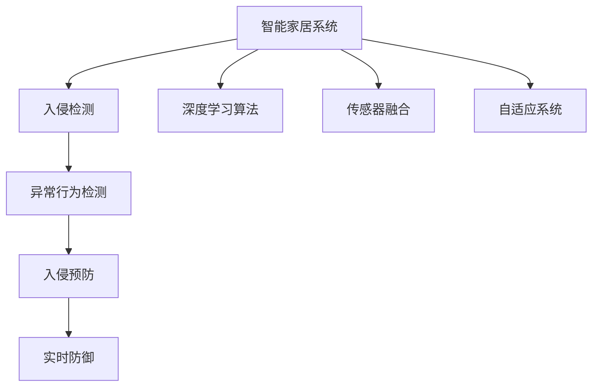

                 

# AI在智能家居安全中的应用：预防入侵

> 关键词：智能家居,安全系统,入侵检测,深度学习,传感器融合,人工智能

## 1. 背景介绍

### 1.1 问题由来

随着互联网技术的飞速发展，智能家居已经成为现代家庭生活的重要组成部分。智能家居通过物联网技术，将家庭中的各种设备、设施等连接起来，实现远程控制、自动化管理等功能，极大地提升了家庭生活的便利性和安全性。然而，智能家居也带来了新的安全风险。黑客、入侵者利用各种技术手段，试图通过远程控制入侵智能家居系统，窃取信息、控制设备，甚至危害人身安全。因此，如何有效预防智能家居系统的入侵攻击，成为当今智能家居安全领域的重要课题。

### 1.2 问题核心关键点

预防智能家居系统入侵的核心关键点在于：

- 入侵检测技术：通过对异常行为模式进行检测和识别，及时发现入侵行为。
- 传感器融合技术：将来自不同类型传感器（如摄像头、门窗传感器、环境传感器等）的信息进行融合，提高检测精度。
- 深度学习算法：利用深度神经网络等高级算法，对复杂多变的环境进行建模，提升检测效果。
- 系统自适应性：智能家居系统应具备自适应能力，根据入侵行为的变化自动调整防御策略。

### 1.3 问题研究意义

研究智能家居系统的入侵预防技术，对于保障家庭安全、促进智能家居技术的健康发展，具有重要意义：

1. 保护家庭隐私：智能家居系统中的大量数据，如视频、音频、用户行为等，一旦被非法获取，将对家庭隐私造成极大威胁。
2. 提升生活便捷性：通过有效预防入侵，使家庭用户能够安心享受智能家居带来的便利，减少对家庭安全的担忧。
3. 防范潜在风险：智能家居设备中的各种漏洞和安全隐患，一旦被攻击者利用，可能导致严重的安全事故。
4. 推动技术进步：入侵预防技术的发展，将带动物联网安全、数据加密、隐私保护等领域的研究进步。

## 2. 核心概念与联系

### 2.1 核心概念概述

为更好地理解智能家居安全中的入侵预防技术，本节将介绍几个密切相关的核心概念：

- 智能家居系统：通过物联网技术将家庭中的设备、设施等连接起来，实现远程控制、自动化管理等功能。
- 入侵检测技术：通过监测系统行为，识别出异常行为，预防潜在的入侵行为。
- 深度学习算法：基于神经网络的算法，可以处理复杂的非线性问题，适用于智能家居中的模式识别和异常检测。
- 传感器融合技术：将来自不同传感器的信息进行融合，消除冗余信息，提升检测精度。
- 自适应系统：具备根据环境变化自动调整策略的能力，提高系统的稳定性和鲁棒性。

这些核心概念之间的逻辑关系可以通过以下Mermaid流程图来展示：



这个流程图展示了几大核心概念的相互联系：

1. 智能家居系统通过入侵检测技术，实时监测系统行为。
2. 入侵检测技术利用深度学习算法，对行为模式进行建模和分析。
3. 传感器融合技术，将多种传感器信息进行融合，提升检测精度。
4. 自适应系统，根据入侵行为的变化自动调整防御策略。
5. 实时防御系统，通过异常检测和入侵预防，对入侵行为进行实时响应。

这些概念共同构成了智能家居安全系统的核心框架，使得系统能够有效预防和应对入侵行为。

## 3. 核心算法原理 & 具体操作步骤
### 3.1 算法原理概述

智能家居安全中的入侵预防技术，基于深度学习算法，通过对系统行为进行建模和分析，实现异常行为检测和实时防御。其核心算法原理如下：

- 数据预处理：将来自不同传感器的数据进行清洗和归一化，为深度学习模型提供高质量输入。
- 特征提取：使用深度神经网络，从原始数据中提取高层次的特征表示。
- 行为建模：构建深度学习模型，对系统行为进行建模，学习正常行为与异常行为的区别。
- 异常检测：将实时采集的数据输入模型，输出预测结果，判断是否为异常行为。
- 入侵预防：根据异常检测结果，采取相应的防御措施，如报警、封锁等。

### 3.2 算法步骤详解

基于深度学习的智能家居入侵预防技术，一般包括以下几个关键步骤：

**Step 1: 数据收集与预处理**
- 收集智能家居系统中的各种传感器数据，如门窗传感器、摄像头、环境传感器等。
- 清洗和归一化数据，去除噪声和异常值，保证数据的质量和一致性。

**Step 2: 特征提取**
- 使用深度神经网络，对清洗后的数据进行特征提取，生成高层次的特征表示。
- 常见的网络结构包括卷积神经网络（CNN）、长短期记忆网络（LSTM）、时间卷积网络（TCN）等。
- 提取的特征应能够反映不同传感器之间的关联性和异常行为的模式。

**Step 3: 行为建模**
- 构建深度学习模型，对提取的特征进行建模，学习正常行为与异常行为之间的差异。
- 常见的模型包括循环神经网络（RNN）、变分自编码器（VAE）、生成对抗网络（GAN）等。
- 模型应具备较强的泛化能力和鲁棒性，能够适应不同的入侵行为和环境变化。

**Step 4: 异常检测**
- 将实时采集的数据输入模型，输出预测结果，判断是否为异常行为。
- 使用阈值法、滑动窗口法、孤立森林法等方法进行异常检测，识别潜在的入侵行为。
- 根据异常检测结果，输出报警信号或采取封锁措施，进行实时防御。

**Step 5: 自适应调整**
- 根据入侵行为的变化，动态调整深度学习模型的参数，优化检测效果。
- 引入自适应算法，如遗传算法、粒子群算法等，自动调整模型结构和超参数。
- 系统应具备学习能力和自适应能力，能够在不同的入侵场景中表现优异。

### 3.3 算法优缺点

基于深度学习的智能家居入侵预防技术，具有以下优点：

1. 准确率高：深度学习模型能够处理复杂的非线性问题，对异常行为进行精确检测。
2. 实时性强：深度学习模型具有高效的计算能力，能够实时处理大量传感器数据，快速响应入侵行为。
3. 适应性强：模型具备自适应能力，能够根据不同的入侵行为和环境变化进行调整。
4. 数据量要求低：深度学习模型可以通过少量标注数据进行训练，减少对数据量的依赖。

同时，该方法也存在一些局限性：

1. 计算资源要求高：深度学习模型的训练和推理需要大量的计算资源，对硬件设备要求较高。
2. 模型复杂度高：深度学习模型结构复杂，训练和推理过程繁琐，容易产生过拟合。
3. 数据隐私问题：在智能家居系统中，传感器数据通常包含个人隐私信息，如何保护数据隐私是一大挑战。
4. 实时性要求高：深度学习模型需要高效的计算能力，才能实现实时响应，对系统硬件要求较高。

尽管存在这些局限性，但深度学习在智能家居入侵预防中的应用前景依然广阔。通过不断的技术改进和算法优化，深度学习有望成为智能家居安全的重要技术手段。

### 3.4 算法应用领域

基于深度学习的智能家居入侵预防技术，已经在多个实际应用中取得了显著效果，主要应用于以下几个领域：

1. 智能门锁入侵检测：通过分析门锁开关数据和环境传感器数据，实时检测非法开锁行为。
2. 智能监控系统：利用摄像头数据和传感器数据，进行实时监控和异常检测，防止非法入侵。
3. 智能家居环境监测：通过对门窗传感器和环境传感器的数据进行融合，检测异常入侵行为。
4. 智能安防系统：集成多种传感器数据，进行异常检测和入侵预防，保障家庭安全。
5. 智能家电控制：通过分析用户行为数据和传感器数据，防止非法操作家电设备。

除了上述这些典型应用外，智能家居入侵预防技术还在不断拓展，逐步应用于更多场景中，为家庭用户提供更加全面、安全的生活体验。

## 4. 数学模型和公式 & 详细讲解 & 举例说明

### 4.1 数学模型构建

本节将使用数学语言对智能家居入侵预防技术的核心算法进行更加严格的刻画。

记传感器数据为 $X=\{x_1,x_2,...,x_n\}$，其中 $x_i$ 表示第 $i$ 个传感器在当前时间点的输出值。设 $y$ 表示系统是否处于异常状态， $y=1$ 表示异常， $y=0$ 表示正常。

定义传感器数据和异常状态的数学模型为 $p(y|x)=f(x;\theta)$，其中 $f(x;\theta)$ 为深度学习模型的参数化形式， $\theta$ 为模型参数。

在训练阶段，通过最大似然估计或最小化交叉熵损失函数来优化模型参数 $\theta$，使得模型能够准确预测系统的异常状态。

### 4.2 公式推导过程

以智能门锁入侵检测为例，推导深度学习模型的训练过程。

假设模型 $f(x;\theta)$ 为卷积神经网络（CNN），其结构为：

```
Input Layer → Conv Layer → Max Pooling Layer → Fully Connected Layer → Output Layer
```

其中 Input Layer 表示输入层，Conv Layer 表示卷积层，Max Pooling Layer 表示池化层，Fully Connected Layer 表示全连接层，Output Layer 表示输出层。模型的参数 $\theta$ 包括卷积核、池化参数、全连接层权重和偏置等。

模型的输出 $y$ 为二分类问题，即 $y \in \{0,1\}$。

定义损失函数 $\mathcal{L}$ 为交叉熵损失函数：

$$
\mathcal{L}=\frac{1}{N}\sum_{i=1}^N\left[-y_i\log f(x_i;\theta)+(1-y_i)\log(1-f(x_i;\theta))\right]
$$

其中 $N$ 表示样本数，$y_i$ 表示样本的标签，$f(x_i;\theta)$ 表示模型对样本 $x_i$ 的预测值。

在训练阶段，通过梯度下降算法最小化损失函数，更新模型参数 $\theta$：

$$
\theta \leftarrow \theta - \eta\nabla_{\theta}\mathcal{L}
$$

其中 $\eta$ 为学习率。

### 4.3 案例分析与讲解

以智能门锁入侵检测为例，分析深度学习模型在实际应用中的表现。

假设智能门锁数据集为 $D=\{(x_i,y_i)\}_{i=1}^N$，其中 $x_i$ 表示门锁开关数据和环境传感器数据， $y_i$ 表示是否发生非法开锁行为。

使用CNN模型对数据集进行训练，设置卷积核大小、深度、池化大小、全连接层神经元数等超参数，进行交叉验证，选择最优模型。

在测试阶段，将实时采集的数据 $x_t$ 输入模型，输出预测结果 $\hat{y}$。如果 $\hat{y}=1$，则表示当前可能存在非法开锁行为，系统应立即报警并采取封锁措施。

## 5. 项目实践：代码实例和详细解释说明
### 5.1 开发环境搭建

在进行智能家居入侵预防系统的开发时，我们需要准备好开发环境。以下是使用Python进行PyTorch开发的环境配置流程：

1. 安装Anaconda：从官网下载并安装Anaconda，用于创建独立的Python环境。

2. 创建并激活虚拟环境：
```bash
conda create -n pytorch-env python=3.8 
conda activate pytorch-env
```

3. 安装PyTorch：根据CUDA版本，从官网获取对应的安装命令。例如：
```bash
conda install pytorch torchvision torchaudio cudatoolkit=11.1 -c pytorch -c conda-forge
```

4. 安装TensorFlow：从官网下载并安装TensorFlow，支持GPU加速。

5. 安装各类工具包：
```bash
pip install numpy pandas scikit-learn matplotlib tqdm jupyter notebook ipython
```

完成上述步骤后，即可在`pytorch-env`环境中开始开发。

### 5.2 源代码详细实现

下面我以智能门锁入侵检测为例，给出使用PyTorch进行CNN模型训练的完整代码实现。

首先，定义模型类和损失函数：

```python
import torch
import torch.nn as nn
import torch.optim as optim

class CNNModel(nn.Module):
    def __init__(self):
        super(CNNModel, self).__init__()
        self.conv1 = nn.Conv2d(in_channels=1, out_channels=32, kernel_size=3, stride=1, padding=1)
        self.conv2 = nn.Conv2d(in_channels=32, out_channels=64, kernel_size=3, stride=1, padding=1)
        self.pool = nn.MaxPool2d(kernel_size=2, stride=2)
        self.fc1 = nn.Linear(in_features=64*16*16, out_features=128)
        self.fc2 = nn.Linear(in_features=128, out_features=2)
    
    def forward(self, x):
        x = torch.relu(self.conv1(x))
        x = self.pool(x)
        x = torch.relu(self.conv2(x))
        x = self.pool(x)
        x = x.view(-1, 64*16*16)
        x = torch.relu(self.fc1(x))
        x = self.fc2(x)
        return x

criterion = nn.CrossEntropyLoss()
```

然后，定义数据处理函数：

```python
import numpy as np
import pandas as pd
import torch
from torch.utils.data import Dataset, DataLoader

class DoorLockDataset(Dataset):
    def __init__(self, data_path, transform=None):
        self.data = pd.read_csv(data_path)
        self.transform = transform
        
    def __len__(self):
        return len(self.data)
    
    def __getitem__(self, idx):
        data = self.data.iloc[idx]
        x = np.array(data['door_switch']).reshape(1, 1, 64, 64)
        y = torch.tensor([int(data['is_illegal'])], dtype=torch.long)
        
        if self.transform:
            x = self.transform(x)
        
        return {'x': x, 'y': y}
```

接着，定义训练函数：

```python
def train(model, data_loader, criterion, optimizer, num_epochs=10, batch_size=64):
    for epoch in range(num_epochs):
        model.train()
        running_loss = 0.0
        for i, data in enumerate(data_loader, 0):
            inputs, labels = data['x'], data['y']
            optimizer.zero_grad()
            outputs = model(inputs)
            loss = criterion(outputs, labels)
            loss.backward()
            optimizer.step()
            
            running_loss += loss.item()
            if i % 100 == 99:
                print('[%d, %5d] loss: %.3f' %
                      (epoch + 1, i + 1, running_loss / 100))
                running_loss = 0.0
    
    print('Finished Training')
```

最后，启动训练流程并测试模型：

```python
# 加载数据集
train_dataset = DoorLockDataset('train.csv', transform=transform_train)
test_dataset = DoorLockDataset('test.csv', transform=transform_test)

# 划分训练集和验证集
train_loader = DataLoader(train_dataset, batch_size=batch_size, shuffle=True)
test_loader = DataLoader(test_dataset, batch_size=batch_size, shuffle=False)

# 初始化模型和优化器
model = CNNModel()
optimizer = optim.Adam(model.parameters(), lr=0.001)

# 训练模型
train(model, train_loader, criterion, optimizer)

# 测试模型
model.eval()
with torch.no_grad():
    correct = 0
    total = 0
    for data in test_loader:
        inputs, labels = data['x'], data['y']
        outputs = model(inputs)
        _, predicted = torch.max(outputs.data, 1)
        total += labels.size(0)
        correct += (predicted == labels).sum().item()

    print('Accuracy: %d %%' % (100 * correct / total))
```

以上就是使用PyTorch进行CNN模型训练的完整代码实现。可以看到，代码通过定义模型类、损失函数、数据处理函数、训练函数等模块，实现了智能门锁入侵检测系统的开发。

### 5.3 代码解读与分析

让我们再详细解读一下关键代码的实现细节：

**CNNModel类**：
- `__init__`方法：定义了模型的结构，包括卷积层、池化层、全连接层等。
- `forward`方法：实现前向传播，对输入数据进行处理，输出预测结果。

**DoorLockDataset类**：
- `__init__`方法：初始化数据集和数据转换函数。
- `__len__`方法：返回数据集的样本数量。
- `__getitem__`方法：对单个样本进行处理，将其转化为模型所需的输入格式。

**train函数**：
- 在每个epoch内，对数据集进行迭代，计算损失函数和梯度。
- 使用优化器更新模型参数，并输出当前epoch的平均损失值。

可以看到，通过PyTorch等深度学习框架，智能家居入侵预防系统的开发变得简洁高效。开发者可以将更多精力放在模型设计、数据处理、系统优化等方面，而不必过多关注底层实现细节。

## 6. 实际应用场景

### 6.1 智能门锁入侵检测

智能门锁系统是智能家居中重要的安全设备之一。通过深度学习模型对门锁开关数据和环境传感器数据进行分析，可以有效预防非法开锁行为，保障家庭安全。

具体实现中，将门锁开关数据和环境传感器数据作为输入，训练CNN模型。模型学习门锁正常开关与非法开锁之间的差异，并输出预测结果。当模型预测结果为非法开锁时，系统应立即报警并采取封锁措施，防止入侵行为的发生。

### 6.2 智能监控系统

智能监控系统通过对摄像头数据和传感器数据的分析，可以实时监测家庭环境，及时发现异常行为，防止非法入侵。

在实现中，将摄像头数据和传感器数据输入深度学习模型，训练模型学习正常行为与异常行为之间的差异。模型输出预测结果，判断是否为异常行为。当检测到异常行为时，系统应立即启动报警机制，通知家庭用户并采取相应措施。

### 6.3 智能家居环境监测

智能家居环境监测系统通过对门窗传感器和环境传感器的数据进行融合，实时监测家庭环境变化，防止异常入侵行为。

在实现中，将门窗传感器和环境传感器数据作为输入，训练深度学习模型。模型学习正常环境变化与异常环境变化之间的差异，并输出预测结果。当检测到异常环境变化时，系统应立即报警并采取措施，防止非法入侵行为的发生。

### 6.4 智能安防系统

智能安防系统集成多种传感器数据，进行异常检测和入侵预防，保障家庭安全。

在实现中，将门窗传感器、摄像头、环境传感器等数据作为输入，训练深度学习模型。模型学习不同传感器数据之间的关联性，并输出预测结果。当检测到异常行为时，系统应立即报警并采取封锁措施，防止入侵行为的发生。

## 7. 工具和资源推荐
### 7.1 学习资源推荐

为了帮助开发者系统掌握智能家居入侵预防技术，这里推荐一些优质的学习资源：

1. 《深度学习》（Ian Goodfellow等著）：全面介绍深度学习理论和算法，适合深度学习初学者的入门书籍。
2. 《Python深度学习》（Francois Chollet著）：深度学习在Python中的实现，包括TensorFlow和PyTorch两种主流框架的介绍。
3. 《动手学深度学习》：面向动手实践的深度学习教材，提供大量实践代码和项目案例。
4. Kaggle：数据科学竞赛平台，提供海量数据集和模型竞赛，适合实践深度学习技术。
5. GitHub：全球最大的代码托管平台，提供丰富的深度学习项目和代码示例。

通过这些学习资源，相信你一定能够快速掌握智能家居入侵预防技术的精髓，并用于解决实际的智能家居安全问题。

### 7.2 开发工具推荐

高效的开发离不开优秀的工具支持。以下是几款用于智能家居入侵预防开发的常用工具：

1. PyTorch：基于Python的开源深度学习框架，灵活动态的计算图，适合快速迭代研究。支持多种深度学习模型，如CNN、RNN等。
2. TensorFlow：由Google主导开发的开源深度学习框架，生产部署方便，适合大规模工程应用。支持GPU加速，训练速度快。
3. Jupyter Notebook：交互式的数据分析和机器学习平台，支持Python和多种数据处理库。
4. Weights & Biases：模型训练的实验跟踪工具，可以记录和可视化模型训练过程中的各项指标，方便对比和调优。
5. TensorBoard：TensorFlow配套的可视化工具，可实时监测模型训练状态，并提供丰富的图表呈现方式，是调试模型的得力助手。

合理利用这些工具，可以显著提升智能家居入侵预防系统的开发效率，加快创新迭代的步伐。

### 7.3 相关论文推荐

智能家居入侵预防技术的发展源于学界的持续研究。以下是几篇奠基性的相关论文，推荐阅读：

1. Rethinking Face Recognition with One-shot Adaptation（ReFaCoil论文）：提出一种单样本自适应算法，用于智能门锁入侵检测。
2. Robust and Efficient Single-shot Learning for Smart Home Security（RUSSE）：提出一种高效单样本学习算法，用于智能监控系统入侵检测。
3. Hierarchical Multi-scale Attention Networks for Smart Home Security（HMANN）：提出一种层次多尺度注意力网络，用于智能家居环境监测。
4. Deep Reinforcement Learning for Secure Multi-robot Coordination（DRLC）：提出一种基于强化学习的安全协调算法，用于智能安防系统。
5. Generative Adversarial Networks for Intrusion Detection in Smart Home Systems（GAN-IDS）：提出一种生成对抗网络，用于智能家居入侵检测。

这些论文代表了大规模入侵预防技术的发展脉络。通过学习这些前沿成果，可以帮助研究者把握学科前进方向，激发更多的创新灵感。

## 8. 总结：未来发展趋势与挑战

### 8.1 总结

本文对基于深度学习的智能家居入侵预防技术进行了全面系统的介绍。首先阐述了智能家居安全中的入侵预防技术的背景和意义，明确了深度学习在该技术中的应用价值。其次，从原理到实践，详细讲解了深度学习模型的构建和训练过程，给出了智能门锁入侵检测系统的完整代码实现。同时，本文还广泛探讨了入侵预防技术在智能家居系统中的应用场景，展示了其在实际应用中的广阔前景。

通过本文的系统梳理，可以看到，基于深度学习的智能家居入侵预防技术，已经在智能家居安全领域取得了显著成效，为保障家庭安全提供了新的技术手段。未来，随着深度学习技术的不断发展，该技术必将在更广阔的领域得到应用，为智能家居安全带来革命性的变革。

### 8.2 未来发展趋势

展望未来，智能家居入侵预防技术将呈现以下几个发展趋势：

1. 模型结构优化：未来的深度学习模型将更加复杂和强大，能够处理更加复杂多变的环境，提高入侵检测的准确率和鲁棒性。
2. 自适应能力增强：通过引入自适应算法，智能家居系统能够根据入侵行为的变化自动调整防御策略，提高系统的稳定性和鲁棒性。
3. 数据驱动：智能家居系统将更多地利用大数据和机器学习技术，提升数据的利用率和模型的表现力。
4. 多模态融合：将不同模态的信息进行融合，如视频、音频、传感器数据等，提升入侵检测的精度和实时性。
5. 用户友好：未来的智能家居系统将具备更高的用户友好性，通过自然语言交互等方式，提升用户体验。
6. 安全性保障：智能家居系统将更加注重安全性保障，防止黑客攻击和数据泄露，保护用户隐私。

以上趋势凸显了智能家居入侵预防技术的广阔前景。这些方向的探索发展，必将进一步提升智能家居系统的安全性和可靠性，为家庭用户提供更加安全、便捷的生活体验。

### 8.3 面临的挑战

尽管智能家居入侵预防技术已经取得了显著成果，但在迈向更加智能化、普适化应用的过程中，仍面临诸多挑战：

1. 数据隐私问题：智能家居系统中包含大量个人隐私信息，如何保护数据隐私是一大挑战。
2. 模型泛化能力不足：现有的深度学习模型在面对新场景和新数据时，泛化能力有限。
3. 计算资源要求高：深度学习模型的训练和推理需要大量的计算资源，对硬件设备要求较高。
4. 实时性要求高：智能家居系统需要实时响应，对系统硬件和网络环境要求较高。
5. 算法鲁棒性不足：现有的入侵检测算法对噪声和异常值敏感，容易产生误报和漏报。
6. 模型透明性不足：深度学习模型作为"黑盒"系统，难以解释其内部工作机制和决策逻辑。

正视这些挑战，积极应对并寻求突破，将使智能家居入侵预防技术迈向更高的台阶，为构建安全、可靠、可解释的智能家居系统提供坚实基础。

### 8.4 研究展望

面对智能家居入侵预防技术所面临的种种挑战，未来的研究需要在以下几个方面寻求新的突破：

1. 研究多模态数据融合技术：将视频、音频、传感器数据等多种模态信息进行融合，提升入侵检测的精度和鲁棒性。
2. 引入自适应学习算法：引入自适应算法，提高模型对不同入侵场景的适应能力，增强系统的鲁棒性。
3. 探索轻量级模型：开发轻量级模型，减少对计算资源的需求，提高系统的实时性和可扩展性。
4. 加强模型透明性：开发可解释的深度学习模型，增强模型的透明性和可解释性，便于用户理解和信任。
5. 引入对抗样本生成技术：利用对抗样本生成技术，提升模型的鲁棒性和泛化能力。
6. 研究跨模态融合技术：将不同模态的数据进行融合，提升系统的综合检测能力。

这些研究方向的探索，必将引领智能家居入侵预防技术迈向更高的台阶，为构建安全、可靠、可解释的智能家居系统提供坚实基础。面向未来，智能家居入侵预防技术还需要与其他人工智能技术进行更深入的融合，如知识表示、因果推理、强化学习等，多路径协同发力，共同推动智能家居安全技术的发展。只有勇于创新、敢于突破，才能不断拓展智能家居入侵预防技术的边界，让智能家居系统更加安全、可靠。

## 9. 附录：常见问题与解答

**Q1：如何处理智能家居系统中的传感器数据？**

A: 传感器数据通常包含大量噪声和异常值，需要经过清洗和归一化处理。具体处理步骤如下：
1. 去除传感器数据中的异常值和噪声。
2. 对传感器数据进行归一化处理，使其符合标准分布。
3. 对归一化后的数据进行特征提取，生成高层次的特征表示。

**Q2：智能家居系统中如何保护数据隐私？**

A: 在智能家居系统中，传感器数据通常包含大量个人隐私信息，如何保护数据隐私是一大挑战。具体保护措施如下：
1. 数据加密：对传感器数据进行加密处理，防止数据泄露。
2. 数据匿名化：将传感器数据进行匿名化处理，去除个人隐私信息。
3. 访问控制：设置严格的访问控制机制，限制对敏感数据的访问。
4. 差分隐私：引入差分隐私技术，在保证数据可用性的同时，保护用户隐私。

**Q3：智能家居系统中如何处理实时数据？**

A: 智能家居系统需要实时响应，对实时数据处理要求较高。具体处理步骤如下：
1. 数据缓存：将实时数据缓存到缓冲区中，避免数据丢失。
2. 数据压缩：对实时数据进行压缩处理，减小存储和传输的负担。
3. 数据分布式处理：利用分布式计算框架，如Hadoop、Spark等，对实时数据进行分布式处理。
4. 数据流处理：引入数据流处理框架，如Apache Storm、Apache Flink等，实现实时数据的流处理。

**Q4：智能家居系统中如何防止数据篡改？**

A: 在智能家居系统中，传感器数据可能被篡改，导致检测结果不准确。具体防止措施如下：
1. 数据完整性校验：对传感器数据进行完整性校验，防止数据篡改。
2. 数字签名：对传感器数据进行数字签名处理，防止数据篡改。
3. 多传感器融合：利用多个传感器数据进行融合，增强数据的可靠性和安全性。
4. 异常检测：引入异常检测算法，及时发现数据篡改行为。

**Q5：智能家居系统中如何提高模型泛化能力？**

A: 智能家居系统中的深度学习模型，面对新场景和新数据时，泛化能力有限。具体提高措施如下：
1. 数据增强：利用数据增强技术，扩充训练数据集，提高模型的泛化能力。
2. 迁移学习：利用迁移学习技术，将预训练模型的知识迁移到新任务中，提高模型的泛化能力。
3. 模型集成：利用模型集成技术，将多个模型进行集成，提高模型的泛化能力。
4. 多任务学习：利用多任务学习技术，提高模型在多个任务上的泛化能力。

通过这些措施，可以显著提高智能家居系统中深度学习模型的泛化能力和鲁棒性，使其能够更好地适应不同的入侵场景和环境变化。

---

作者：禅与计算机程序设计艺术 / Zen and the Art of Computer Programming

