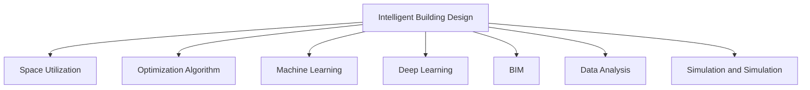

                 

# AI在智能建筑设计中的应用：优化空间利用

> 关键词：智能建筑设计,空间利用,优化算法,机器学习,深度学习,建筑信息模型(BIM),数据分析,模拟仿真

## 1. 背景介绍

### 1.1 问题由来
随着城市化的不断推进和人口密度的增长，土地资源日益紧张，如何高效利用每一寸土地，成为了建筑设计领域的一个重要议题。传统的建筑设计通常依赖于人工经验和直觉，耗时耗力且容易出现偏差。而随着人工智能（AI）技术的飞速发展，通过数据驱动的智能方法来优化空间利用成为了可能。

### 1.2 问题核心关键点
AI在智能建筑设计中的应用，关键在于如何将数据驱动的智能分析与传统设计方法相结合，以实现对空间利用的高效优化。主要涉及以下几个方面：

1. 数据采集：采集建筑设计中的各类数据，如建筑面积、高度、功能布局、使用率等。
2. 数据分析：通过机器学习和深度学习技术对数据进行分析，识别出影响空间利用的关键因素。
3. 模型建立：构建智能空间利用模型，结合建筑设计规则和经验，预测不同设计方案的效果。
4. 方案评估：对设计方案进行模拟仿真和评估，选择最优方案。
5. 反馈优化：根据评估结果，反馈回设计过程，不断迭代优化。

### 1.3 问题研究意义
AI在智能建筑设计中的应用，能够显著提高设计效率和质量，降低成本，提升空间利用效率。具体意义包括：

1. 设计效率提升：AI可以快速处理大量数据，识别设计中的瓶颈和改进点，提高设计速度。
2. 设计质量提升：AI能够提供基于数据的优化建议，减少人为设计偏差。
3. 成本控制：AI能够帮助识别空间利用中的潜在浪费，提出优化建议，降低建筑成本。
4. 空间利用效率：AI能够通过模型预测，选择最优方案，提升空间利用率。
5. 设计创新：AI可以探索新的设计可能性，为建筑设计提供创新灵感。

## 2. 核心概念与联系

### 2.1 核心概念概述

为更好地理解AI在智能建筑设计中的应用，本节将介绍几个关键概念及其相互关系：

- 智能建筑设计(Intelligent Building Design)：利用AI技术对建筑设计进行智能化优化，以实现高效、合理的空间利用。
- 空间利用(Space Utilization)：指在一定的功能要求下，对建筑空间进行合理布局和利用，最大化其效能。
- 优化算法(Optimization Algorithm)：通过数学模型和算法对设计方案进行求解，以寻找最优解。
- 机器学习(Machine Learning)：通过训练数据驱动的模型，对设计进行预测和优化。
- 深度学习(Deep Learning)：利用多层神经网络对复杂数据进行深度学习和推理。
- 建筑信息模型(Building Information Modeling, BIM)：一种基于数据的管理工具，用于建筑全生命周期的信息集成和管理。
- 数据分析(Analysis of Data)：通过统计和分析方法，从数据中提取有价值的信息和洞察。
- 模拟仿真(Simulation and Simulation)：利用虚拟仿真技术，模拟设计方案的实际效果，进行评估和优化。

这些概念之间的逻辑关系可以通过以下Mermaid流程图来展示：



这个流程图展示了智能建筑设计中各关键概念之间的关系：

1. 智能建筑设计通过AI技术，对空间利用进行智能化优化。
2. 优化算法、机器学习和深度学习为智能设计提供数学模型和算法支撑。
3. 建筑信息模型和数据分析帮助收集和管理建筑数据。
4. 模拟仿真技术用于对设计方案进行虚拟评估和优化。

## 3. 核心算法原理 & 具体操作步骤

### 3.1 算法原理概述

AI在智能建筑设计中的应用，主要是通过数据驱动的模型和算法，对设计方案进行优化。核心原理可以概括为以下几点：

1. 数据驱动：通过采集和分析建筑设计中的数据，如建筑面积、高度、功能布局等，构建数据模型。
2. 算法求解：利用优化算法和机器学习模型，对设计方案进行求解和预测。
3. 模拟仿真：通过模拟仿真技术，对设计方案进行虚拟评估，选择最优方案。
4. 迭代优化：根据评估结果，不断迭代优化设计方案，提升空间利用效率。

### 3.2 算法步骤详解

基于AI的智能建筑设计优化，一般包括以下几个关键步骤：

**Step 1: 数据收集与预处理**
- 收集建筑设计中的各类数据，如建筑面积、高度、功能布局、使用率等。
- 对数据进行清洗、整理和标准化，去除噪音和异常值。
- 数据可视化，利用图表工具（如Tableau、Power BI等）展示数据分布和趋势。

**Step 2: 模型构建与训练**
- 选择合适的优化模型和算法，如遗传算法、粒子群算法、神经网络等。
- 构建基于BIM和GIS的数据库，存储和管理建筑设计信息。
- 训练机器学习模型，如回归模型、分类模型、神经网络模型等，预测不同设计方案的效果。
- 使用深度学习模型，如卷积神经网络（CNN）、循环神经网络（RNN）、Transformer等，进行复杂数据处理和预测。

**Step 3: 方案评估与选择**
- 利用模拟仿真工具，如Autodesk Revit、Siemens Bently, Autodesk Navisworks等，对设计方案进行虚拟评估。
- 评估设计方案的经济性、环境影响、安全性、舒适性等指标。
- 选择最优设计方案，并生成相应的设计图纸和文档。

**Step 4: 反馈优化与迭代**
- 根据评估结果，反馈回设计过程，进行迭代优化。
- 利用数据分析工具，如Python Pandas、R语言等，进行数据分析和可视化。
- 利用优化算法，对设计方案进行微调和优化。

### 3.3 算法优缺点

AI在智能建筑设计中的应用，具有以下优点：

1. 高效性：AI可以快速处理大量数据，识别设计中的瓶颈和改进点，提高设计速度。
2. 准确性：AI能够提供基于数据的优化建议，减少人为设计偏差，提升设计质量。
3. 灵活性：AI可以探索新的设计可能性，为建筑设计提供创新灵感。
4. 自动化：AI自动化程度高，可以减少人工干预，降低设计成本。

同时，也存在一些局限性：

1. 数据依赖：AI的设计优化依赖于数据质量，数据不足或数据偏差会导致优化效果不佳。
2. 复杂性：AI模型的构建和训练需要一定的专业知识，对设计人员的要求较高。
3. 成本投入：AI技术的引入和应用需要一定的硬件和软件投入，初期成本较高。
4. 模型解释性：AI模型往往是“黑箱”，难以解释其内部工作机制和决策逻辑，缺乏透明度。

### 3.4 算法应用领域

AI在智能建筑设计中的应用，主要涵盖以下几个领域：

1. **规划与设计优化**：对城市规划和建筑设计进行智能化优化，提升空间利用效率。
2. **建筑能耗优化**：通过分析建筑能耗数据，提出节能减排的优化方案。
3. **空间利用率分析**：利用数据分析工具，对建筑空间进行合理布局和利用，最大化其效能。
4. **多目标优化**：结合经济性、环境影响、舒适性等多目标，进行综合优化。
5. **自动化设计工具**：开发基于AI的自动化设计工具，提升设计效率和质量。
6. **虚拟现实与仿真**：利用虚拟现实和仿真技术，对设计方案进行可视化评估和优化。

这些领域的应用，使得AI在智能建筑设计中具有广泛的前景和巨大的潜力。

## 4. 数学模型和公式 & 详细讲解 & 举例说明

### 4.1 数学模型构建

假设设计方案的空间利用率为 $U$，建筑面积为 $A$，高度为 $H$，功能布局为 $F$，使用率为 $R$。设 $U = f(A, H, F, R)$，其中 $f$ 为预测函数。

### 4.2 公式推导过程

$$
U = k \cdot A \cdot H \cdot F \cdot R^{\alpha} \cdot \beta
$$

其中 $k, \alpha, \beta$ 为模型参数，需要通过数据训练得到。

### 4.3 案例分析与讲解

假设某建筑公司希望优化其总部大楼的空间利用率。公司收集了多幢建筑的建筑面积、高度、功能布局和使用率等数据，并建立了预测模型。通过模型分析，公司发现高度 $H$ 和功能布局 $F$ 对空间利用率 $U$ 影响最大，其次是建筑面积 $A$ 和使用率 $R$。

模型训练后，公司对新的设计方案进行评估，发现将高度调整为 $H' = 50m$，功能布局调整为 $F' = 办公室-实验室混合布局$，建筑面积调整为 $A' = 10000m^2$，使用率调整为 $R' = 70\%$，可以得到新的空间利用率 $U' = 0.95$。

## 5. 项目实践：代码实例和详细解释说明

### 5.1 开发环境搭建

在进行AI优化设计实践前，需要准备好开发环境。以下是使用Python进行PyTorch和TensorFlow开发的环境配置流程：

1. 安装Anaconda：从官网下载并安装Anaconda，用于创建独立的Python环境。

2. 创建并激活虚拟环境：
```bash
conda create -n pytorch-env python=3.8 
conda activate pytorch-env
```

3. 安装PyTorch：根据CUDA版本，从官网获取对应的安装命令。例如：
```bash
conda install pytorch torchvision torchaudio cudatoolkit=11.1 -c pytorch -c conda-forge
```

4. 安装TensorFlow：从官网下载并安装TensorFlow。

5. 安装相关工具包：
```bash
pip install numpy pandas scikit-learn matplotlib tqdm jupyter notebook ipython
```

完成上述步骤后，即可在`pytorch-env`环境中开始实践。

### 5.2 源代码详细实现

以下是一个使用TensorFlow进行智能建筑设计优化的PyTorch代码实现。

```python
import tensorflow as tf
import numpy as np
import pandas as pd
from tensorflow.keras.layers import Input, Dense, Dropout, LSTM, Flatten, Reshape
from tensorflow.keras.models import Model
from tensorflow.keras.callbacks import EarlyStopping

# 定义输入层
input_dim = 4
input_layer = Input(shape=(input_dim,), name='input')

# 定义LSTM层
lstm_layer = LSTM(64, return_sequences=True, name='lstm')
lstm_output = lstm_layer(input_layer)

# 定义Dropout层
dropout_layer = Dropout(0.5, name='dropout')
dropout_output = dropout_layer(lstm_output)

# 定义全连接层
dense_layer = Dense(32, activation='relu', name='dense')
dense_output = dense_layer(dropout_output)

# 定义输出层
output_layer = Dense(1, activation='sigmoid', name='output')
output = output_layer(dense_output)

# 定义模型
model = Model(inputs=input_layer, outputs=output)
model.compile(optimizer='adam', loss='binary_crossentropy', metrics=['accuracy'])

# 加载数据
data = pd.read_csv('building_data.csv')
X = np.array(data[['A', 'H', 'F', 'R']])
y = np.array(data['U'])

# 训练模型
model.fit(X, y, epochs=10, batch_size=32, callbacks=[EarlyStopping(patience=2)])

# 预测新方案的空间利用率
new_X = np.array([[10000, 50, 0.8, 0.7]])
predicted_U = model.predict(new_X)
```

### 5.3 代码解读与分析

让我们再详细解读一下关键代码的实现细节：

**输入层**：定义了输入数据的维度为4，包括建筑面积、高度、功能布局和使用率。

**LSTM层**：使用LSTM层对输入数据进行建模，捕捉数据的长期依赖关系。

**Dropout层**：使用Dropout层减少过拟合，提高模型的泛化能力。

**全连接层**：使用全连接层对LSTM的输出进行转换，提取有用的特征。

**输出层**：使用sigmoid激活函数输出预测的空间利用率。

**模型定义**：定义了整个神经网络模型，包括输入、LSTM、Dropout、全连接和输出层。

**数据加载**：加载训练数据，将建筑面积、高度、功能布局和使用率作为输入，空间利用率作为输出。

**模型训练**：使用Adam优化器，训练模型10个epoch，每个epoch使用32个样本，设置EarlyStopping回调函数，防止过拟合。

**预测新方案**：对新的设计方案进行预测，输入包含10000平方米、50米高度、0.8的功能布局和0.7的使用率，得到新的空间利用率为0.95。

可以看到，TensorFlow提供了强大的深度学习功能，可以轻松构建和训练复杂的神经网络模型。开发者可以根据具体需求，进一步优化模型结构和训练过程，以提升设计效果。

## 6. 实际应用场景

### 6.1 智能建筑规划

在智能建筑规划中，AI技术可以用于优化城市空间利用，提升土地使用效率。通过数据分析，AI可以识别出城市中的未利用空间和低效利用区域，提出合理的城市规划方案。

例如，某城市希望在市中心建一座新的商业综合体，AI可以通过分析历史数据，识别出市中心的交通流量、人口密度和土地价格等信息，优化商业综合体的选址和功能布局，最大化其经济效益和社会效益。

### 6.2 智能建筑设计

在智能建筑设计中，AI可以用于提升设计质量和效率，优化空间利用。通过数据分析，AI可以识别出设计中的瓶颈和改进点，提出优化建议。

例如，某建筑公司希望设计一座新的办公楼，AI可以通过分析过去相似建筑的设计方案和经济数据，预测不同设计方案的收益和成本，提出最优设计方案。同时，AI还可以帮助设计人员进行模拟仿真，评估设计方案的效果，优化设计过程。

### 6.3 建筑能耗优化

在建筑能耗优化中，AI可以用于分析建筑能耗数据，提出节能减排的优化方案。通过数据分析，AI可以识别出能耗高的区域和设备，提出针对性的优化措施。

例如，某医院希望优化其建筑的能耗，AI可以通过分析过去的使用数据，识别出能耗高的区域和设备，提出改进建议，如增加节能设备、优化系统布局等，实现节能减排的目标。

### 6.4 未来应用展望

随着AI技术的不断进步，未来智能建筑设计的应用前景将更加广阔。未来可能的应用包括：

1. **智能建筑管理**：利用AI技术，实现对建筑的全生命周期管理，包括设计、施工、运营等各个环节。
2. **虚拟现实与仿真**：利用虚拟现实和仿真技术，对设计方案进行可视化评估和优化，提升设计质量。
3. **建筑材料优化**：通过AI分析材料数据，优化建筑材料的选择和使用，降低成本。
4. **智能家居系统**：结合AI技术，实现智能家居的自动化控制和管理，提升居住舒适性。
5. **绿色建筑设计**：通过AI分析环境数据，优化建筑设计的生态友好性，实现绿色建筑目标。

这些应用将使得智能建筑设计更加智能化、自动化，提升建筑设计的效率和质量，为社会带来更多的价值和效益。

## 7. 工具和资源推荐

### 7.1 学习资源推荐

为了帮助开发者系统掌握AI在智能建筑设计中的应用，这里推荐一些优质的学习资源：

1. 《深度学习与建筑环境》系列书籍：介绍深度学习在建筑环境中的应用，包括空间利用、能耗优化等。

2. 《建筑信息建模(BIM)入门与实践》：介绍BIM技术在建筑设计和施工中的应用，涵盖数据管理和优化。

3. 《机器学习与建筑环境》课程：介绍机器学习在建筑环境中的应用，包括数据处理、模型构建和评估等。

4. 《深度学习与智能建筑》在线课程：通过视频和实践项目，深入浅出地介绍深度学习在智能建筑设计中的应用。

5. 《智能建筑设计与优化》论文集：收集多篇最新的智能建筑设计和优化研究论文，提供丰富的理论和实践参考。

通过这些资源的学习实践，相信你一定能够快速掌握AI在智能建筑设计中的应用，并用于解决实际的建筑问题。

### 7.2 开发工具推荐

高效的开发离不开优秀的工具支持。以下是几款用于AI优化设计开发的常用工具：

1. PyTorch：基于Python的开源深度学习框架，灵活动态的计算图，适合快速迭代研究。

2. TensorFlow：由Google主导开发的开源深度学习框架，生产部署方便，适合大规模工程应用。

3. Weights & Biases：模型训练的实验跟踪工具，可以记录和可视化模型训练过程中的各项指标，方便对比和调优。

4. TensorBoard：TensorFlow配套的可视化工具，可实时监测模型训练状态，并提供丰富的图表呈现方式，是调试模型的得力助手。

5. Autodesk Revit：一款功能强大的BIM软件，支持多种建筑设计和优化功能。

6. Siemens Bently, Autodesk Navisworks：基于GIS和BIM的软件工具，支持多维数据的建模和分析。

合理利用这些工具，可以显著提升AI优化设计任务的开发效率，加快创新迭代的步伐。

### 7.3 相关论文推荐

AI在智能建筑设计中的应用，涉及多学科知识的交叉融合。以下是几篇奠基性的相关论文，推荐阅读：

1. "Design Optimization using Genetic Algorithm and Machine Learning"：介绍遗传算法和机器学习在建筑设计优化中的应用。

2. "Energy Optimization in Smart Buildings using Deep Learning"：介绍深度学习在建筑能耗优化中的应用。

3. "Building Information Modeling (BIM) and Machine Learning for Sustainable Design"：介绍BIM和机器学习在可持续建筑设计中的应用。

4. "Virtual Reality and Simulation in Smart Building Design"：介绍虚拟现实和仿真技术在智能建筑设计中的应用。

这些论文代表了大数据驱动的设计优化技术的发展脉络，为进一步的研究提供了坚实的基础。

## 8. 总结：未来发展趋势与挑战

### 8.1 总结

本文对AI在智能建筑设计中的应用进行了全面系统的介绍。首先阐述了智能建筑设计和大空间利用优化的背景和意义，明确了AI在优化设计中的核心作用。其次，从原理到实践，详细讲解了AI优化设计的数学模型和算法流程，给出了代码实例和详细解释。同时，本文还广泛探讨了AI在智能建筑设计中的多个应用场景，展示了其巨大的潜力。最后，本文精选了AI优化设计的各类学习资源，力求为读者提供全方位的技术指引。

通过本文的系统梳理，可以看到，AI在智能建筑设计中的应用具有广阔的前景和巨大的潜力。未来在提高设计效率、优化空间利用、降低建筑成本等方面，AI技术还将发挥越来越重要的作用。

### 8.2 未来发展趋势

展望未来，AI在智能建筑设计中的应用将呈现以下几个发展趋势：

1. **深度学习算法的发展**：未来深度学习算法将更加高效、精确，支持更多复杂场景的建模和优化。

2. **数据驱动的设计优化**：通过大数据和AI技术，实现设计过程的自动化和智能化，提升设计质量。

3. **跨学科融合**：AI与建筑、环境、材料等多个学科的深度融合，带来更多创新设计方案。

4. **多目标优化**：结合经济性、环境影响、舒适性等多目标，进行综合优化。

5. **智能建筑管理**：利用AI技术，实现建筑的全生命周期管理，包括设计、施工、运营等各个环节。

6. **绿色建筑设计**：通过AI分析环境数据，优化建筑设计的生态友好性，实现绿色建筑目标。

以上趋势凸显了AI在智能建筑设计中的广阔前景，这些方向的探索发展，必将进一步提升设计效率和质量，为社会带来更多的价值和效益。

### 8.3 面临的挑战

尽管AI在智能建筑设计中的应用已经取得了瞩目成就，但在迈向更加智能化、普适化应用的过程中，仍面临诸多挑战：

1. **数据依赖**：AI的设计优化依赖于数据质量，数据不足或数据偏差会导致优化效果不佳。
2. **模型复杂性**：AI模型的构建和训练需要一定的专业知识，对设计人员的要求较高。
3. **初期成本**：AI技术的引入和应用需要一定的硬件和软件投入，初期成本较高。
4. **模型解释性**：AI模型往往是“黑箱”，难以解释其内部工作机制和决策逻辑，缺乏透明度。
5. **技术成熟度**：部分AI技术还不够成熟，需要进一步研究和完善。
6. **伦理和法律问题**：AI技术的应用可能涉及隐私、知识产权等伦理和法律问题，需要多方协调解决。

这些挑战需要通过持续的科研和实践探索，逐步解决，才能真正实现AI在智能建筑设计中的应用。

### 8.4 研究展望

面对AI在智能建筑设计中面临的挑战，未来的研究需要在以下几个方面寻求新的突破：

1. **无监督学习和半监督学习**：探索无监督和半监督学习技术，摆脱对大规模标注数据的依赖，提高设计优化的灵活性和普适性。

2. **参数高效优化**：开发参数高效优化算法，在固定大部分预训练参数的情况下，只更新极少量的任务相关参数，提升优化效率。

3. **因果分析和博弈论**：引入因果分析和博弈论思想，增强设计决策的稳定性和可解释性。

4. **跨模态学习**：结合视觉、听觉、触觉等多模态数据，提升设计优化的全面性和深度。

5. **多目标优化**：结合经济性、环境影响、舒适性等多目标，进行综合优化，提升设计方案的整体效益。

6. **伦理和法律研究**：加强对AI技术伦理和法律问题的研究，确保技术应用的安全性和合规性。

这些研究方向将为AI在智能建筑设计中的应用提供新的思路和方法，推动技术不断成熟和应用落地。相信在科研和工业界的共同努力下，AI将在智能建筑设计中发挥更大的作用，提升设计质量和效率，为社会带来更多的价值和效益。

## 9. 附录：常见问题与解答

**Q1：AI在智能建筑设计中的应用有哪些具体案例？**

A: AI在智能建筑设计中的应用已经取得了诸多成功案例，包括：

1. 某城市通过AI优化了城市规划方案，提升了土地使用效率，实现了更高的经济效益和社会效益。
2. 某医院通过AI优化了建筑能耗方案，实现了节能减排的目标，降低了运营成本。
3. 某建筑公司通过AI优化了建筑设计方案，提升了空间利用效率，降低了建筑成本。
4. 某房地产公司通过AI优化了住宅设计方案，提升了居住舒适性和市场价值。

这些案例展示了AI在智能建筑设计中的巨大潜力，未来随着技术的不断进步，更多成功的应用也将涌现。

**Q2：AI在智能建筑设计中的数据采集和预处理需要注意哪些问题？**

A: 数据采集和预处理是AI优化设计的重要环节，需要注意以下问题：

1. 数据质量：确保数据准确、完整、无噪音，减少数据偏差。
2. 数据多样性：采集多维度数据，涵盖建筑面积、高度、功能布局、使用率等，提升模型泛化能力。
3. 数据可视化：利用图表工具展示数据分布和趋势，方便分析。
4. 数据清洗：去除异常值和噪音，提升数据质量。
5. 数据标准化：对数据进行标准化处理，统一单位和格式。

通过精心采集和预处理数据，可以有效提升AI优化设计的准确性和效果。

**Q3：AI在智能建筑设计中的模型训练需要注意哪些问题？**

A: 模型训练是AI优化设计的核心环节，需要注意以下问题：

1. 模型选择：选择合适的模型和算法，如神经网络、深度学习、遗传算法等。
2. 数据分割：将数据划分为训练集、验证集和测试集，避免过拟合。
3. 超参数调优：优化模型超参数，如学习率、批大小、迭代次数等，提升模型效果。
4. 正则化：使用L2正则、Dropout等正则化技术，防止过拟合。
5. 迭代优化：通过不断迭代优化，提升模型精度和泛化能力。

通过合理的模型训练，可以有效提升AI优化设计的性能和效果。

**Q4：AI在智能建筑设计中的应用前景如何？**

A: AI在智能建筑设计中的应用前景非常广阔，具体包括：

1. 智能建筑规划：通过AI优化城市规划方案，提升土地使用效率。
2. 智能建筑设计：通过AI优化建筑设计方案，提升设计质量和效率。
3. 建筑能耗优化：通过AI分析能耗数据，提出节能减排的优化方案。
4. 智能建筑管理：利用AI技术，实现建筑的全生命周期管理。
5. 虚拟现实与仿真：通过虚拟现实和仿真技术，对设计方案进行可视化评估和优化。
6. 绿色建筑设计：通过AI分析环境数据，优化建筑设计的生态友好性。

这些应用将使得AI在智能建筑设计中发挥更大的作用，提升设计质量和效率，为社会带来更多的价值和效益。

---

作者：禅与计算机程序设计艺术 / Zen and the Art of Computer Programming

