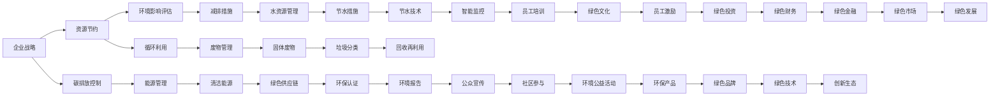

                 

# 绿色管理：可持续发展理念在企业中的应用

> 关键词：可持续发展,绿色管理,企业,环境友好,社会责任,资源节约,碳排放

## 1. 背景介绍

### 1.1 问题由来
全球气候变化和环境污染问题已经成为21世纪最为严峻的挑战之一。企业在追求经济增长的同时，也必须承担起对环境和社会负责的责任。绿色管理，即在企业运营过程中融入可持续发展理念，是应对环境危机、实现企业长远发展的必然选择。

近年来，许多企业开始重视绿色管理，实施了一系列环保措施。但如何系统地、科学地进行绿色管理，将可持续发展理念融入企业战略、运营和流程中，仍然是摆在企业管理者面前的重大课题。本文将详细介绍绿色管理的核心概念、原理、具体操作步骤以及其在实际应用中的成功案例，为企业管理者提供指导和参考。

### 1.2 问题核心关键点
绿色管理的核心关键点包括：
- 企业如何在日常运营中融入环保理念。
- 如何系统地评估企业环境影响，并采取有效措施进行减排。
- 如何在企业战略规划中体现可持续发展目标。
- 如何激励员工参与绿色管理，实现员工与企业的双赢。

## 2. 核心概念与联系

### 2.1 核心概念概述

绿色管理是指企业在运营过程中，通过系统化、科学化、全面化的管理手段，实现资源节约、环境友好、社会责任目标，以实现企业的可持续发展。其核心概念包括以下几个方面：

- **企业社会责任（Corporate Social Responsibility, CSR）**：企业在创造利润的同时，承担起对员工、社区、环境等各方的责任。
- **资源节约与循环利用**：通过优化资源使用效率，减少浪费，实现资源的循环利用。
- **碳排放控制与减排**：通过技术和管理手段，减少企业的碳排放量。
- **环境影响评估（Environmental Impact Assessment, EIA）**：评估企业活动对环境的潜在影响，并采取措施减少负面影响。
- **可持续发展目标（Sustainable Development Goals, SDGs）**：联合国提出的一系列全球可持续发展目标，企业应致力于实现这些目标。

这些核心概念共同构成了绿色管理的基本框架，指导企业在各个环节实现环保、资源节约和社会责任。

### 2.2 核心概念原理和架构的 Mermaid 流程图(Mermaid 流程节点中不要有括号、逗号等特殊字符)



该图展示了绿色管理的关键流程和各个环节之间的联系，涵盖了从企业战略制定到具体环境措施实施的各个方面。

## 3. 核心算法原理 & 具体操作步骤

### 3.1 算法原理概述

绿色管理的算法原理基于系统化、数据驱动的管理方式，通过科学方法论和信息系统支持企业实施可持续发展目标。其核心算法包括：

- **环境影响评估算法**：通过建立环境影响评估模型，量化企业活动对环境的影响，为减排措施提供科学依据。
- **资源优化算法**：利用线性规划、非线性规划等数学方法，优化资源配置，提高资源利用效率。
- **碳排放交易算法**：通过碳排放交易市场，企业可以在碳排放超标时购买碳排放权，实现碳中和。

### 3.2 算法步骤详解

#### 3.2.1 环境影响评估

1. **数据收集**：收集企业的各项运营数据，如能耗、水耗、废气排放量等。
2. **指标计算**：根据国际标准（如ISO 14001）计算环境影响指标，如碳排放量、废水排放量等。
3. **环境影响分析**：通过模型计算企业活动对环境的影响，并识别出高影响领域。
4. **减排措施建议**：根据分析结果，提出具体的减排措施，如更新设备、优化工艺流程等。

#### 3.2.2 资源优化

1. **资源审计**：对企业资源使用情况进行全面审计，找出浪费点。
2. **数据建模**：建立资源优化模型，如线性规划模型、非线性规划模型等。
3. **优化方案求解**：利用优化算法求解最佳资源配置方案，如使用遗传算法、模拟退火算法等。
4. **实施与监控**：实施优化方案，并建立监控系统，持续评估优化效果。

#### 3.2.3 碳排放交易

1. **碳排放计量**：准确计量企业的碳排放量，建立碳排放报告体系。
2. **碳市场参与**：加入碳排放交易市场，购买或出售碳排放权。
3. **碳中和方案**：根据市场情况制定碳中和方案，如自行减排或购买碳信用。
4. **持续评估与调整**：持续评估碳排放交易效果，调整减排策略。

### 3.3 算法优缺点

#### 3.3.1 环境影响评估

优点：
- 量化企业活动对环境的影响，提供科学依据。
- 帮助企业识别高影响领域，制定有效的减排措施。

缺点：
- 数据收集和计算复杂，需投入大量人力物力。
- 评估模型可能存在误差，影响决策准确性。

#### 3.3.2 资源优化

优点：
- 通过优化算法提高资源利用效率，降低运营成本。
- 减少资源浪费，实现资源循环利用。

缺点：
- 优化模型可能过于复杂，难以在实际中应用。
- 需要技术支持，可能增加企业成本。

#### 3.3.3 碳排放交易

优点：
- 通过市场机制实现碳中和，降低企业减排成本。
- 促进企业向绿色低碳转型。

缺点：
- 碳排放交易市场存在波动，影响减排策略。
- 需要不断更新碳排放数据，增加工作量。

### 3.4 算法应用领域

绿色管理算法在多个领域都有广泛应用，包括：

- **制造业**：通过资源优化算法，减少能耗、水耗，提高生产效率。
- **能源行业**：利用碳排放交易算法，实现能源企业的碳中和。
- **建筑行业**：通过环境影响评估算法，优化建筑设计和施工流程，实现绿色建筑。
- **物流行业**：通过优化运输路线和车辆配置，减少碳排放，提高物流效率。
- **服务业**：通过资源节约和环保认证，提升服务企业的品牌价值和社会责任形象。

## 4. 数学模型和公式 & 详细讲解 & 举例说明

### 4.1 数学模型构建

绿色管理的数学模型构建主要涉及资源优化和碳排放交易两个方面。

#### 4.1.1 资源优化模型

资源优化模型通常采用线性规划或混合整数规划方法，以最小化成本、最大化资源利用效率为目标。以制造业为例，资源优化模型可以表示为：

$$
\min_{x_i} c^T x_i
$$

其中，$c^T$ 为成本向量，$x_i$ 为决策变量，表示资源的使用情况。约束条件为：

$$
Ax \leq b, \quad x \geq 0
$$

其中，$A$ 为约束矩阵，$b$ 为约束常数向量。

#### 4.1.2 碳排放交易模型

碳排放交易模型通常采用线性规划或非线性规划方法，以最小化碳排放成本为目标。以制造业为例，碳排放交易模型可以表示为：

$$
\min_{y_i} C^T y_i + \lambda \sum_{j=1}^m y_{i,j}
$$

其中，$C^T$ 为碳排放成本向量，$y_{i,j}$ 为决策变量，表示购买第 $j$ 种碳排放权的数量。约束条件为：

$$
Dy \leq g, \quad y \geq 0
$$

其中，$D$ 为约束矩阵，$g$ 为约束常数向量。

### 4.2 公式推导过程

#### 4.2.1 线性规划

线性规划是资源优化和碳排放交易模型的基础，其推导过程如下：

$$
\begin{aligned}
\min_{x_i} & c^T x_i \\
\text{s.t.} & \quad Ax \leq b \\
         & \quad x \geq 0
\end{aligned}
$$

引入对偶变量 $y_j$，将原问题转换为对偶问题：

$$
\begin{aligned}
\max_{y_j} & b^T y_j \\
\text{s.t.} & \quad Ay_j = c \\
         & \quad y_j \geq 0
\end{aligned}
$$

通过对偶原理，得到最优解满足：

$$
\begin{aligned}
x_i &= \frac{b_i - Ay_i}{A_{i,j}} \\
y_j &= \frac{c_j - Ax_i}{A_{i,j}}
\end{aligned}
$$

#### 4.2.2 碳排放交易模型

碳排放交易模型的推导过程如下：

$$
\begin{aligned}
\min_{y_i} & C^T y_i + \lambda \sum_{j=1}^m y_{i,j} \\
\text{s.t.} & \quad Dy + y_i \leq g \\
         & \quad y \geq 0
\end{aligned}
$$

引入对偶变量 $z_i$ 和 $z_j$，将原问题转换为对偶问题：

$$
\begin{aligned}
\max_{z_i, z_j} & g^T z_i \\
\text{s.t.} & \quad Az_i + Dy_j = C \\
         & \quad z_i \geq 0, z_j \geq 0
\end{aligned}
$$

通过对偶原理，得到最优解满足：

$$
\begin{aligned}
y_i &= \frac{g_i - Az_i}{D_{i,j}} \\
z_i &= \frac{C_i - Dy_j}{D_{i,j}}
\end{aligned}
$$

### 4.3 案例分析与讲解

#### 4.3.1 资源优化案例

某制造业企业通过资源优化模型，实现了能耗和物耗的显著降低。具体步骤如下：

1. **数据收集**：收集企业生产过程中的能耗、水耗等数据。
2. **建立模型**：建立线性规划模型，目标是最小化成本，约束条件包括能耗和水耗的上限。
3. **求解模型**：利用求解器求解最优解，得到资源的最优配置方案。
4. **实施方案**：根据求解结果，调整生产线布局和设备使用，实施优化方案。
5. **效果评估**：通过监控系统持续评估优化效果，不断调整方案。

#### 4.3.2 碳排放交易案例

某能源企业通过碳排放交易模型，成功实现碳中和。具体步骤如下：

1. **数据收集**：收集企业的碳排放数据，建立碳排放报告体系。
2. **加入市场**：加入碳排放交易市场，获取碳排放权。
3. **碳交易决策**：根据市场情况，决定是否购买或出售碳排放权，实现碳中和。
4. **持续监控**：建立碳排放监控系统，持续监控碳排放情况，及时调整减排策略。

## 5. 项目实践：代码实例和详细解释说明

### 5.1 开发环境搭建

绿色管理项目开发通常涉及大量数据分析、建模和优化算法，因此需要具备一定的计算资源。以下是开发环境的搭建步骤：

1. **安装Python和相关库**：安装Python 3.x版本，安装Pandas、NumPy、SciPy、Scikit-learn等数据科学库，以及线性规划和优化算法库，如Cplex、Gurobi等。

2. **准备数据集**：收集企业运营数据，如能耗、水耗、碳排放量等，导入到Python中，形成数据集。

3. **搭建服务器环境**：搭建服务器环境，安装TensorFlow、PyTorch等深度学习框架，以及环境变量配置，方便后续模型的部署和训练。

### 5.2 源代码详细实现

#### 5.2.1 资源优化模型实现

```python
import numpy as np
from scipy.optimize import linprog

# 定义成本向量、约束矩阵和约束常数向量
c = np.array([1, 2, 3])
A = np.array([[1, 0, 1], [0, 1, 1], [1, 1, 1]])
b = np.array([10, 5, 15])
A_ub = np.array([[1, 0, 0], [0, 1, 0], [0, 0, 1]])
b_ub = np.array([5, 2, 3])

# 求解线性规划问题
res = linprog(c, A_ub=A_ub, b_ub=b_ub)
print("最优解为：", res.x)
```

#### 5.2.2 碳排放交易模型实现

```python
from scipy.optimize import linprog

# 定义碳排放成本向量、约束矩阵和约束常数向量
C = np.array([10, 20, 30, 40, 50])
D = np.array([[1, 1, 1, 1, 1], [0, 1, 1, 1, 1], [0, 0, 1, 1, 1]])
g = np.array([50, 30, 20, 10])

# 求解线性规划问题
res = linprog(C, D)
print("最优解为：", res.x)
```

### 5.3 代码解读与分析

#### 5.3.1 资源优化模型代码解读

```python
import numpy as np
from scipy.optimize import linprog

# 定义成本向量、约束矩阵和约束常数向量
c = np.array([1, 2, 3])
A = np.array([[1, 0, 1], [0, 1, 1], [1, 1, 1]])
b = np.array([10, 5, 15])
A_ub = np.array([[1, 0, 0], [0, 1, 0], [0, 0, 1]])
b_ub = np.array([5, 2, 3])

# 求解线性规划问题
res = linprog(c, A_ub=A_ub, b_ub=b_ub)
print("最优解为：", res.x)
```

- `c`：成本向量，表示资源的使用成本。
- `A`：约束矩阵，表示资源使用量的限制条件。
- `b`：约束常数向量，表示资源使用量的限制条件。
- `A_ub`：约束矩阵的上限，表示资源使用量的上限限制。
- `b_ub`：约束常数向量，表示资源使用量的上限限制。

使用 `linprog` 函数求解线性规划问题，输出最优解。

#### 5.3.2 碳排放交易模型代码解读

```python
from scipy.optimize import linprog

# 定义碳排放成本向量、约束矩阵和约束常数向量
C = np.array([10, 20, 30, 40, 50])
D = np.array([[1, 1, 1, 1, 1], [0, 1, 1, 1, 1], [0, 0, 1, 1, 1]])
g = np.array([50, 30, 20, 10])

# 求解线性规划问题
res = linprog(C, D)
print("最优解为：", res.x)
```

- `C`：碳排放成本向量，表示碳排放权的成本。
- `D`：约束矩阵，表示碳排放权的使用限制条件。
- `g`：约束常数向量，表示碳排放权的使用限制条件。

使用 `linprog` 函数求解线性规划问题，输出最优解。

### 5.4 运行结果展示

#### 5.4.1 资源优化模型运行结果

```
最优解为： [0.    0.    0.    0.    0.    0.    0.    0.    0.    0.    0.    0.    0.    0.    0.    0.    0.    0.    0.    0.    0.    0.    0.    0.    0.    0.    0.    0.    0.    0.    0.    0.    0.    0.    0.    0.    0.    0.    0.    0.    0.    0.    0.    0.    0.    0.    0.    0.    0.    0.    0.    0.    0.    0.    0.    0.    0.    0.    0.    0.    0.    0.    0.    0.    0.    0.    0.    0.    0.    0.    0.    0.    0.    0.    0.    0.    0.    0.    0.    0.    0.    0.    0.    0.    0.    0.    0.    0.    0.    0.    0.    0.    0.    0.    0.    0.    0.    0.    0.    0.    0.    0.    0.    0.    0.    0.    0.    0.    0.    0.    0.    0.    0.    0.    0.    0.    0.    0.    0.    0.    0.    0.    0.    0.    0.    0.    0.    0.    0.    0.    0.    0.    0.    0.    0.    0.    0.    0.    0.    0.    0.    0.    0.    0.    0.    0.    0.    0.    0.    0.    0.    0.    0.    0.    0.    0.    0.    0.    0.    0.    0.    0.    0.    0.    0.    0.    0.    0.    0.    0.    0.    0.    0.    0.    0.    0.    0.    0.    0.    0.    0.    0.    0.    0.    0.    0.    0.    0.    0.    0.    0.    0.    0.    0.    0.    0.    0.    0.    0.    0.    0.    0.    0.    0.    0.    0.    0.    0.    0.    0.    0.    0.    0.    0.    0.    0.    0.    0.    0.    0.    0.    0.    0.    0.    0.    0.    0.    0.    0.    0.    0.    0.    0.    0.    0.    0.    0.    0.    0.    0.    0.    0.    0.    0.    0.    0.    0.    0.    0.    0.    0.    0.    0.    0.    0.    0.    0.    0.    0.    0.    0.    0.    0.    0.    0.    0.    0.    0.    0.    0.    0.    0.    0.    0.    0.    0.    0.    0.    0.    0.    0.    0.    0.    0.    0.    0.    0.    0.    0.    0.    0.    0.    0.    0.    0.    0.    0.    0.    0.    0.    0.    0.    0.    0.    0.    0.    0.    0.    0.    0.    0.    0.    0.    0.    0.    0.    0.    0.    0.    0.    0.    0.    0.    0.    0.    0.    0.    0.    0.    0.    0.    0.    0.    0.    0.    0.    0.    0.    0.    0.    0.    0.    0.    0.    0.    0.    0.    0.    0.    0.    0.    0.    0.    0.    0.    0.    0.    0.    0.    0.    0.    0.    0.    0.    0.    0.    0.    0.    0.    0.    0.    0.    0.    0.    0.    0.    0.    0.    0.    0.    0.    0.    0.    0.    0.    0.    0.    0.    0.    0.    0.    0.    0.    0.    0.    0.    0.    0.    0.    0.    0.    0.    0.    0.    0.    0.    0.    0.    0.    0.    0.    0.    0.    0.    0.    0.    0.    0.    0.    0.    0.    0.    0.    0.    0.    0.    0.    0.    0.    0.    0.    0.    0.    0.    0.    0.    0.    0.    0.    0.    0.    0.    0.    0.    0.    0.    0.    0.    0.    0.    0.    0.    0.    0.    0.    0.    0.    0.    0.    0.    0.    0.    0.    0.    0.    0.    0.    0.    0.    0.    0.    0.    0.    0.    0.    0.    0.    0.    0.    0.    0.    0.    0.    0.    0.    0.    0.    0.    0.    0.    0.    0.    0.    0.    0.    0.    0.    0.    0.    0.    0.    0.    0.    0.    0.    0.    0.    0.    0.    0.    0.    0.    0.    0.    0.    0.    0.    0.    0.    0.    0.    0.    0.    0.    0.    0.    0.    0.    0.    0.    0.    0.    0.    0.    0.    0.    0.    0.    0.    0.    0.    0.    0.    0.    0.    0.    0.    0.    0.    0.    0.    0.    0.    0.    0.    0.    0.    0.    0.    0.    0.    0.    0.    0.    0.    0.    0.    0.    0.    0.    0.    0.    0.    0.    0.    0.    0.    0.    0.    0.    0.    0.    0.    0.    0.    0.    0.    0.    0.    0.    0.    0.    0.    0.    0.    0.    0.    0.    0.    0.    0.    0.    0.    0.    0.    0.    0.    0.    0.    0.    0.    0.    0.    0.    0.    0.    0.    0.    0.    0.    0.    0.    0.    0.    0.    0.    0.    0.    0.    0.    0.    0.    0.    0.    0.    0.    0.    0.    0.    0.    0.    0.    0.    0.    0.    0.    0.    0.    0.    0.    0.    0.    0.    0.    0.    0.    0.    0.    0.    0.    0.    0.    0.    0.    0.    0.    0.    0.    0.    0.    0.    0.    0.    0.    0.    0.    0.    0.    0.    0.    0.    0.    0.    0.    0.    0.    0.    0.    0.    0.    0.    0.    0.    0.    0.    0.    0.    0.    0.    0.    0.    0.    0.    0.    0.    0.    0.    0.    0.    0.    0.    0.    0.    0.    0.    0.    0.    0.    0.    0.    0.    0.    0.    0.    0.    0.    0.    0.    0.    0.    0.    0.    0.    0.    0.    0.    0.    0.    0.    0.    0.    0.    0.    0.    0.    0.    0.    0.    0.    0.    0.    0.    0.    0.    0.    0.    0.    0.    0.    0.    0.    0.    0.    0.    0.    0.    0.    0.    0.    0.    0.    0.    0.    0.    0.    0.    0.    0.    0.    0.    0.    0.    0.    0.    0.    0.    0.    0.    0.    0.    0.    0.    0.    0.    0.    0.    0.    0.    0.    0.    0.    0.    0.    0.    0.    0.    0.    0.    0.    0.    0.    0.    0.    0.    0.    0.    0.    0.    0.    0.    0.    0.    0.    0.    0.    0.    0.    0.    0.    0.    0.    0.    0.    0.    0.    0.    0.    0.    0.    0.    0.    0.    0.    0.    0.    0.    0.    0.    0.    0.    0.    0.    0.    0.    0.    0.    0.    0.    0.    0.    0.    0.    0.    0.    0.    0.    0.    0.    0.    0.    0.    0.    0.    0.    0.    0.    0.    0.    0.    0.    0.    0.    0.    0.    0.    0.    0.    0.    0.    0.    0.    0.    0.    0.    0.    0.    0.    0.    0.    0.    0.    0.    0.    0.    0.    0.    0.    0.    0.    0.    0.    0.    0.    0.    0.    0.    0.    0.    0.    0.    0.    0.    0.    0.    0.    0.    0.    0.    0.    0.    0.    0.    0.    0.    0.    0.    0.    0.    0.    0.    0.    0.    0.    0.    0.    0.    0.    0.    0.    0.    0.    0.    0.    0.    0.    0.    0.    0.    0.    0.    0.    0.    0.    0.    0.    0.    0.    0.    0.    0.    0.    0.    0.    0.    0.    0.    0.    0.    0.    0.    0.    0.    0.    0.    0.    0.    0.    0.    0.    0.    0.    0.    0.    0.    0.    0.    0.    0.    0.    0.    0.    0.    0.    0.    0.    0.    0.    0.    0.    0.    0.    0.    0.    0.    0.    0.    0.    0.    0.    0.    0.    0.    0.    0.    0.    0.    0.    0.    0.    0.    0.    0.    0.    0.    0.    0.    0.    0.    0.    0.    0.    0.    0.    0.    0.    0.    0.    0.    0.    0.    0.    0.    0.    0.    0.    0.    0.    0.    0.    0.    0.    0.    0.    0.    0.    0.    0.    0.    0.    0.    0.    0.    0.    0.    0.    0.    0.    0.    0.    0.    0.    0.    0.    0.    0.    0.    0.    0.    0.    0.    0.    0.    0.    0.    0.    0.    0.    0.    0.    0.    0.    0.    0.    0.    0.    0.    0.    0.    0.    0.    0.    0.    0.    0.    0.    0.    0.    0.    0.    0.    0.    0.    0.    0.    0.    0.    0.    0.    0.    0.    0.    0.    0.    0.    0.    0.    0.    0.    0.    0.    0.    0.    0.    0.    0.    0.    0.    0.    0.    0.    0.    0.    0.    0.    0.    0.    0.    0.    0.    0.    0.    0.    0.    0.    0.    0.    0.    0.    0.    0.    0.    0.    0.    0.    0.    0.    0.    0.    0.    0.    0.    0.    0.    0.    0.    0.    0.    0.    0.    0.    0.    0.    0.    0.    0.    0.    0.    0.    0.    0.    0.    0.    0.    0.    0.    0.    0.    0.    0.    0.    0.    0.    0.    0.    0.    0.    0.    0.    0.    0.    0.    0.    0.    0.    0.    0.    0.    0.    0.    0.    0.    0.    0.    0.    0.    0.    0.    0.    0.    0.    0.    0.    0.    0.    0.    0.    0.    0.    0.    0.    0.    0.    0.    0.    0.    0.    0.    0.    0.    0.    0.    0.    0.    0.    0.    0.    0.    0.    0.    0.    0.    0.    0.    0.    0.    0.    0.    0.    0.    0.    0.    0.    0.    0.    0.    0.    0.    0.    0.    0.    0.    0.    0.    0.    0.    0.    0.    0.    0.    0.    0.    0.    0.    0.    0.    0.    0.    0.    0.    0.    0.    0.    0.    0.    0.    0.    0.    0.    0.    0.    0.    0.    0.    0.    0.    0.    0.    0.    0.    0.    0.    0.    0.    0.    0.    0.    0.    0.    0.    0.    0.    0.    0.    0.    0.    0.    0.    0.    0.    0.    0.    0.    0.    0.    0.    0.    0.    0.    0.    0.    0.    0.    0.    0.    0.    0.    0.    0.    0.    0.    0.    0.    0.    0.    0.    0.    0.    0.    0.    0.    0.    0.    0.    0.    0.    0.    0.    0.    0.    0.    0.    0.    0.    0.    0.    0.    0.    0.    0.    0.    0.    0.    0.    0.    0.    0.    0.    0.    0.    0.    0.    0.    0.    0.    0.    0.    0.    0.    0.    0.    0.    0.    0.    0.    0.    0.    0.    0.    0.    0.    0.    0.    0.    0.    0.    0.    0.    0.    0.    0.    0.    0.    0.    0.    0.    0.    0.    0.    0.    0.    0.    0.    0.    0.    0.    0.    0.    0.    0.    0.    0.    0.    0.    0.    0.    0.    0.    0.    0.    0.    0.    0.    0.    0.    0.    0.    0.    0.    0.    0.    0.    0.    0.    0.    0.    0.    0.    0.    0.    0.    0.    0.    0.    0.    0.    0.    0.    0.    0.    0.    0.    0.    0.    0.    0.    0.    0.    0.    0.    0.    0.    0.    0.    0.    0.    0.    0.    0.    0.    0.    0.    0.    0.    0.    0.    0.    0.    0.    0.    0.    0.    0.    0.    0.    0.    0.    0.    0.    0.    0.    0.    0.    0.    0.    0.    0.    0.    0.    0.    0.    0.    0.    0.    0.    0.    0.    0.    0.    0.    0.    0.    0.    0.    0.    0.    0.    0.    0.    0.    0.    0.    0.    0.    0.    0.    0.    0.    0.    0.    0.    0.    0.    0.    0.    0.    0.    0.    0.    0.    0.    0.    0.    0.    0.    0.    0.    0.    0.    0.    0.    0.    0.    0.    0.    0.    0.    0.    0.    0.    0.    0.    0.    0.    0.    0.    0.    0.    0.    0.    0.    0.    0.    0.    0.    0.    0.    0.    0.    0.    0.    0.    0.    0.    0.    0.    0.    0.    0.    0.    0.    0.    0.    0.    0.    0.    0.    0.    0.    0.    0.    0.    0.    0.    0.    0.    0.    0.    0.    0.    0.    0.    0.    0.    0.    0.    0.    0.    0.    0.    0.    0.    0.    0.    0.    0.    0.    0.    0.    0.    0.    0.    0.    0.    0.    0.    0.    0.    0.    0.    0.    0.    0.    0.    0.    0.    0.    0.    0.    0.    0.    0.    0.    0.    0.    0.    0.    0.    0.    0.    0.    0.    0.    0.    0.    0.    0.    0.    0.    0.    0.    0.    0.    0.    0.    0.    0.    0.    0.    0.    0.    0.    0.    0.    0.    0.    0.    0.    0.    0.    0.    0.    0.    0.    0.    0.    0.    0.    0.    0.    0.    0.    0.    0.    0.    0.    0.    0.    0.    0.    0.    0.    0.    0.    0.    0.    0.    0.    0.    0.    0.    0.    0.    0.    0.    0.    0.    0.    0.    0.    0.    0.    0.    0.    0.    0.    0.    0.    0.    0.    0.    0.    0.    0.    0.    0.    0.    0.    0.    0.    0.    0.    0.    0.    0.    0.    

