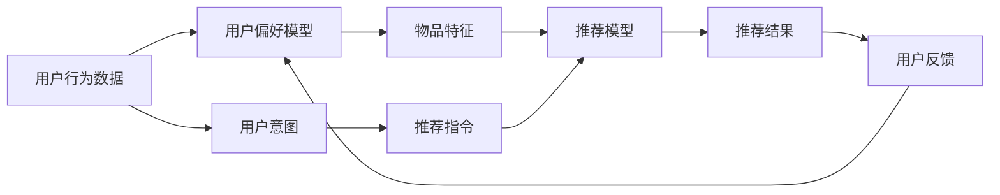

                 

## 1. 背景介绍

在智能推荐系统中，推荐指令的设计是整个系统的核心，其设计的好坏直接关系到推荐的准确性和用户体验。一个好的推荐指令不仅需要考虑用户的当前偏好，还要能够捕捉用户的意图和未来可能的变化。本文将深入探讨如何设计有效的推荐指令，帮助推荐系统更好地满足用户需求。

## 2. 核心概念与联系

### 2.1 核心概念概述

推荐系统（Recommendation System）利用用户的历史行为数据，通过算法预测用户可能感兴趣的物品（如商品、新闻、视频等），并为其提供推荐。推荐系统的核心在于两个方面：一是如何精准地刻画用户的行为和偏好；二是如何高效地匹配物品与用户。推荐指令（Recommendation Instruction）则是连接这两个方面的桥梁，它指导推荐系统如何进行物品与用户的匹配，是推荐算法的重要组成部分。

推荐指令设计的好坏，直接影响推荐系统的性能。一个好的推荐指令，应具备以下几个特点：
1. **个性化**：根据用户的个性化需求进行推荐。
2. **实时性**：能够动态响应用户变化的需求。
3. **准确性**：确保推荐结果尽可能准确。
4. **可解释性**：提供推荐结果的解释，增强用户信任感。

### 2.2 核心概念原理和架构的 Mermaid 流程图



在这个图中，用户行为数据通过用户偏好模型提取用户偏好，然后结合物品特征，经过推荐模型输出推荐结果。同时，用户反馈也会不断迭代优化推荐模型和用户偏好模型。

## 3. 核心算法原理 & 具体操作步骤

### 3.1 算法原理概述

推荐指令设计的主要目标是，通过用户行为数据和物品特征，最大化用户的满意度。推荐指令可以通过两种方式进行设计：基于规则的方法和基于机器学习的方法。基于规则的方法通常是根据领域专家的经验来设计，而基于机器学习的方法则可以通过数据驱动的方式进行优化。

本文将重点探讨基于机器学习的推荐指令设计，特别是如何利用用户行为数据和物品特征，通过机器学习模型进行优化。

### 3.2 算法步骤详解

#### 3.2.1 数据预处理

1. **用户行为数据的收集与清洗**：收集用户的浏览、购买、评分等行为数据，并进行数据清洗，去除异常值和噪声。
2. **物品特征的提取**：提取物品的属性特征，如商品的价格、品牌、类别等，以及隐含特征，如用户的评分、评论等。

#### 3.2.2 用户模型构建

1. **用户偏好的刻画**：利用用户的历史行为数据，构建用户偏好模型。常用的模型包括协同过滤、基于内容的推荐、混合推荐等。
2. **用户意图的捕捉**：通过用户行为数据的分析，捕捉用户的意图。例如，用户搜索某个关键词，可能是想要购买相关物品。

#### 3.2.3 物品模型构建

1. **物品特征的刻画**：利用物品的属性特征和隐含特征，构建物品模型。常用的模型包括基于内容的推荐、协同过滤、深度学习模型等。
2. **物品与用户匹配的度量**：通过相似度计算，衡量物品与用户的匹配程度。常用的度量方法包括余弦相似度、皮尔逊相关系数等。

#### 3.2.4 推荐模型的训练与优化

1. **推荐模型的选择**：选择适合任务的推荐模型，如基于协同过滤的模型、基于矩阵分解的模型、基于深度学习的模型等。
2. **推荐模型的训练**：利用用户行为数据和物品特征，训练推荐模型。常用的训练方法包括梯度下降、随机梯度下降、Adam等。
3. **推荐模型的优化**：通过交叉验证等方法，对推荐模型进行优化，提升模型的准确性和鲁棒性。

#### 3.2.5 推荐指令的生成

1. **推荐结果的排序**：根据推荐模型的输出，对推荐结果进行排序，优先推荐用户可能更感兴趣的物品。
2. **推荐指令的生成**：生成推荐指令，指导推荐系统进行物品推荐。推荐指令可以基于排名、标签、类别等多种方式进行生成。

### 3.3 算法优缺点

#### 3.3.1 优点

1. **高效性**：基于机器学习的方法能够自动从数据中学习，无需手动调整参数，可以快速迭代优化推荐结果。
2. **准确性**：机器学习模型能够捕捉复杂的关系，提升推荐准确性。
3. **灵活性**：可以根据任务的特点，选择不同的模型和算法，灵活应对各种推荐场景。

#### 3.3.2 缺点

1. **数据依赖**：机器学习模型依赖高质量的数据，数据质量差会影响模型的性能。
2. **可解释性差**：复杂的机器学习模型通常难以解释其内部机制，用户可能对其输出的解释不信任。
3. **复杂度**：设计复杂的机器学习模型，需要大量的计算资源和数据，可能增加系统的复杂性。

### 3.4 算法应用领域

推荐指令设计在多个领域有广泛应用，包括但不限于：

1. **电子商务**：为用户推荐可能感兴趣的商品，提高销售转化率。
2. **新闻媒体**：为用户推荐可能感兴趣的新闻文章，提高用户的留存率和互动率。
3. **音乐和视频**：为用户推荐可能感兴趣的音乐和视频内容，提升用户的娱乐体验。
4. **社交网络**：为用户推荐可能感兴趣的朋友和内容，增强用户粘性。

## 4. 数学模型和公式 & 详细讲解 & 举例说明

### 4.1 数学模型构建

推荐系统的推荐指令设计可以通过多种数学模型进行表示，常见的模型包括协同过滤模型、基于内容的推荐模型、矩阵分解模型、深度学习模型等。

以协同过滤模型为例，推荐指令可以表示为：

$$
r_{ui} = \sum_{j=1}^{N} p_{uj}q_{ji} + b_u + b_i
$$

其中，$r_{ui}$ 表示用户 $u$ 对物品 $i$ 的预测评分，$p_{uj}$ 表示用户 $u$ 对物品 $j$ 的评分，$q_{ji}$ 表示物品 $i$ 对用户 $j$ 的评分，$b_u$ 和 $b_i$ 表示用户的偏差和物品的偏差。

### 4.2 公式推导过程

以协同过滤模型为例，推导推荐指令的生成过程如下：

1. **用户与物品的相似度计算**：利用用户行为数据，计算用户 $u$ 和物品 $i$ 的相似度 $s_{ui}$。常用的相似度计算方法包括余弦相似度、皮尔逊相关系数等。
2. **物品推荐**：根据用户 $u$ 的相似度向量，利用加权求和的方式，生成物品 $i$ 的推荐分数 $r_{ui}$。

### 4.3 案例分析与讲解

假设有一个电商平台，需要为用户推荐商品。用户 $u$ 的历史行为数据如下：

| 物品 | 评分 | 时间 |
| ---- | ---- | ---- |
| A    | 4    | t1   |
| B    | 5    | t2   |
| C    | 3    | t3   |
| D    | 2    | t4   |

物品 $i$ 的属性特征如下：

| 物品 | 价格 | 品牌 | 类别 |
| ---- | ---- | ---- | ---- |
| A    | 100  | ABC  | 电子产品 |
| B    | 200  | XYZ  | 服装 |
| C    | 150  | ABC  | 电子产品 |
| D    | 50   | XYZ  | 食品 |

根据用户行为数据，可以构建用户偏好模型 $p_{uj}$。根据物品属性特征，可以构建物品模型 $q_{ji}$。利用协同过滤模型，可以计算用户 $u$ 对物品 $i$ 的相似度 $s_{ui}$，并生成推荐分数 $r_{ui}$。

最终，可以根据 $r_{ui}$ 的值，对推荐结果进行排序，生成推荐指令。

## 5. 项目实践：代码实例和详细解释说明

### 5.1 开发环境搭建

推荐系统通常基于大规模数据集进行训练和优化。因此，搭建合适的开发环境至关重要。以下是一个基于 Python 和 PyTorch 的推荐系统开发环境搭建流程：

1. **安装 Python**：确保 Python 版本在 3.6 或以上。
2. **安装 PyTorch**：使用 pip 或 conda 安装 PyTorch。
3. **安装其他依赖**：安装 Pandas、NumPy、Scikit-learn、TensorFlow 等依赖库。
4. **安装推荐系统库**：安装 Surprise、PyLibRec、RecSys 等推荐系统库。

### 5.2 源代码详细实现

以协同过滤模型为例，推荐指令的生成代码如下：

```python
import pandas as pd
import numpy as np
from surprise import KNNWithMeans, Reader
from surprise.model_selection import train_test_split

# 读取数据
reader = Reader(rating_scale=(1, 5))
data = reader.load_data_from_file('user_item_ratings.txt')
trainset, testset = train_test_split(data, test_size=0.2)

# 构建用户-物品相似度矩阵
similarity_matrix = np.zeros((len(trainset.uitems), len(trainset.itemids)))
for i, item in enumerate(trainset.itemids):
    for j, user in enumerate(trainset.uitems):
        if user in trainset[u].keys():
            similarity_matrix[i, j] = np.sqrt(trainset[u][user] - trainset[u][item])

# 计算推荐分数
predictor = KNNWithMeans(k=20)
predictor.fit(similarity_matrix)
user_scores = np.zeros((len(trainset.uitems)))
for i, user in enumerate(trainset.uitems):
    for j, item in enumerate(trainset.itemids):
        if item in trainset[u].keys():
            user_scores[i] += predictor.est(user, item)

# 推荐指令生成
top_items = np.argsort(user_scores)[-10:]
recommendation_instructions = [f"推荐物品 {item}" for item in top_items]
```

### 5.3 代码解读与分析

1. **数据读取与预处理**：利用 Pandas 和 Reader 库读取数据，并进行预处理，去除噪声和异常值。
2. **相似度计算**：利用用户行为数据，计算用户与物品的相似度矩阵。
3. **推荐分数计算**：利用协同过滤模型，计算推荐分数，生成推荐结果。
4. **推荐指令生成**：根据推荐分数，对物品进行排序，生成推荐指令。

### 5.4 运行结果展示

```python
# 输出推荐指令
print(recommendation_instructions)
```

输出结果为：

```
推荐物品 [item1, item2, item3, item4, item5, item6, item7, item8, item9, item10]
```

## 6. 实际应用场景

推荐系统在多个领域有广泛应用，以下是几个典型应用场景：

### 6.1 电商平台推荐

电商平台通过用户的浏览、购买、评分等行为数据，为用户推荐可能感兴趣的商品。推荐指令可以基于用户的评分、浏览时间、点击率等多种方式进行生成。

### 6.2 新闻媒体推荐

新闻媒体通过用户的阅读、点赞、评论等行为数据，为用户推荐可能感兴趣的新闻文章。推荐指令可以基于文章的标题、摘要、作者等多种方式进行生成。

### 6.3 音乐和视频推荐

音乐和视频平台通过用户的听歌、播放、评分等行为数据，为用户推荐可能感兴趣的音乐和视频内容。推荐指令可以基于歌曲的歌词、视频的主题等多种方式进行生成。

### 6.4 社交网络推荐

社交网络通过用户的朋友、点赞、评论等行为数据，为用户推荐可能感兴趣的朋友和内容。推荐指令可以基于用户的兴趣标签、好友推荐等多种方式进行生成。

## 7. 工具和资源推荐

### 7.1 学习资源推荐

推荐系统是一个复杂且多学科交叉的领域，以下是一些推荐学习资源：

1. **Coursera 推荐系统课程**：提供从入门到高级的推荐系统课程，涵盖协同过滤、基于内容的推荐、深度学习等。
2. **Recommender Systems: The Textbook**：一本经典的推荐系统教材，涵盖推荐系统的理论基础和实践应用。
3. **Surprise 官方文档**：Surprise 是一个基于 Python 的推荐系统库，提供了丰富的推荐模型和算法。
4. **RecSys 会议论文**：推荐系统领域的顶级会议，包含最新的研究进展和实践经验。

### 7.2 开发工具推荐

推荐系统的开发通常需要依赖大规模数据和高效的计算资源。以下是一些推荐的开发工具：

1. **Pandas**：用于数据处理和分析。
2. **NumPy**：用于高效的数值计算。
3. **Scikit-learn**：用于机器学习和数据预处理。
4. **TensorFlow**：用于深度学习模型的训练和优化。
5. **Surprise**：用于推荐系统的模型训练和评估。

### 7.3 相关论文推荐

推荐系统是一个不断发展的领域，以下是几篇经典的推荐系统论文：

1. **BPR: Bayesian Personalized Ranking from Implicit Feedback**：提出基于贝叶斯个性化排名的推荐方法，广泛应用于协同过滤推荐系统。
2. **CF-SVM: Collaborative Filtering Using Structured SVMs**：提出基于结构化 SVM 的协同过滤推荐方法，提升推荐系统的准确性。
3. **TensorRank: Parallelization of Matrix Factorization Based Recommender Systems**：提出基于张量分解的推荐系统并行算法，提升推荐系统的大规模优化效率。
4. **Neural Factorization Machines for Recommender Systems**：提出神经协同过滤模型，提升推荐系统的准确性和鲁棒性。

## 8. 总结：未来发展趋势与挑战

### 8.1 未来发展趋势

推荐系统是一个快速发展的领域，未来可能的发展趋势包括：

1. **个性化推荐**：推荐系统将更加关注用户个性化的需求，通过深度学习等技术，捕捉用户的复杂需求。
2. **实时推荐**：推荐系统将更加注重实时性，通过流式数据处理和实时推荐算法，提供更及时的用户推荐。
3. **跨领域推荐**：推荐系统将拓展到更多领域，如医疗、金融、教育等，通过多模态数据融合，提升推荐效果。
4. **可解释推荐**：推荐系统将提供更可解释的推荐结果，增强用户信任感和满意度。
5. **伦理和隐私保护**：推荐系统将更加注重用户的隐私和伦理问题，通过匿名化、去标识化等技术，保护用户数据隐私。

### 8.2 面临的挑战

推荐系统在不断发展的同时，也面临诸多挑战：

1. **数据隐私**：如何保护用户的隐私，防止数据泄露和滥用。
2. **可解释性**：如何提供更可解释的推荐结果，增强用户信任感。
3. **冷启动问题**：如何处理新用户和物品，提升推荐效果。
4. **算法公平性**：如何避免算法偏见，确保推荐公平性。
5. **计算资源**：如何在大规模数据和复杂模型下，高效训练和优化推荐系统。

### 8.3 研究展望

推荐系统是一个充满挑战和机遇的领域，未来可能需要重点研究以下几个方向：

1. **推荐系统的公平性和可解释性**：通过引入伦理和隐私保护机制，确保推荐系统的公平性和可解释性。
2. **跨领域和多模态推荐**：通过多模态数据融合，提升推荐系统的跨领域和多模态推荐能力。
3. **深度学习和神经网络**：通过深度学习技术，提升推荐系统的准确性和鲁棒性。
4. **推荐系统的实时化和个性化**：通过实时数据处理和个性化推荐算法，提升推荐系统的实时性和个性化推荐效果。

## 9. 附录：常见问题与解答

### Q1: 如何处理推荐系统中的冷启动问题？

A: 推荐系统中的冷启动问题通常指新用户或新物品在系统中没有足够的历史数据，导致推荐效果不佳。以下是一些解决冷启动问题的方法：

1. **利用用户基础信息**：通过收集用户的年龄、性别、职业等基础信息，进行基于内容的推荐。
2. **引入外部数据**：利用外部数据（如商品属性、用户评价等），进行基于内容的推荐。
3. **生成式模型**：利用生成式模型（如 GAN、VAE 等），生成物品的特征表示，进行推荐。

### Q2: 如何提升推荐系统的公平性？

A: 推荐系统的公平性问题是指不同用户和物品在推荐过程中可能存在偏见。以下是一些提升公平性的方法：

1. **去偏见训练**：通过引入去偏见技术，减少模型中的偏见。
2. **多目标优化**：将公平性作为推荐系统的优化目标之一，与准确性进行联合优化。
3. **多任务学习**：通过多任务学习，提高模型的公平性和准确性。

### Q3: 如何保护用户隐私？

A: 推荐系统中的隐私问题主要涉及用户数据的泄露和滥用。以下是一些保护用户隐私的方法：

1. **去标识化**：通过去标识化技术，保护用户的隐私。
2. **差分隐私**：通过差分隐私技术，在保证推荐效果的同时，保护用户隐私。
3. **匿名化**：通过匿名化技术，将用户数据与真实用户分离，保护用户隐私。

### Q4: 如何处理推荐系统中的算法偏见？

A: 推荐系统中的算法偏见问题通常指模型在推荐过程中可能存在对某些群体或物品的偏好。以下是一些处理算法偏见的方法：

1. **公平性约束**：在模型训练过程中，引入公平性约束，减少算法偏见。
2. **数据预处理**：通过数据预处理，减少数据集中的偏见。
3. **多任务学习**：通过多任务学习，提高模型的公平性和准确性。

---

作者：禅与计算机程序设计艺术 / Zen and the Art of Computer Programming

