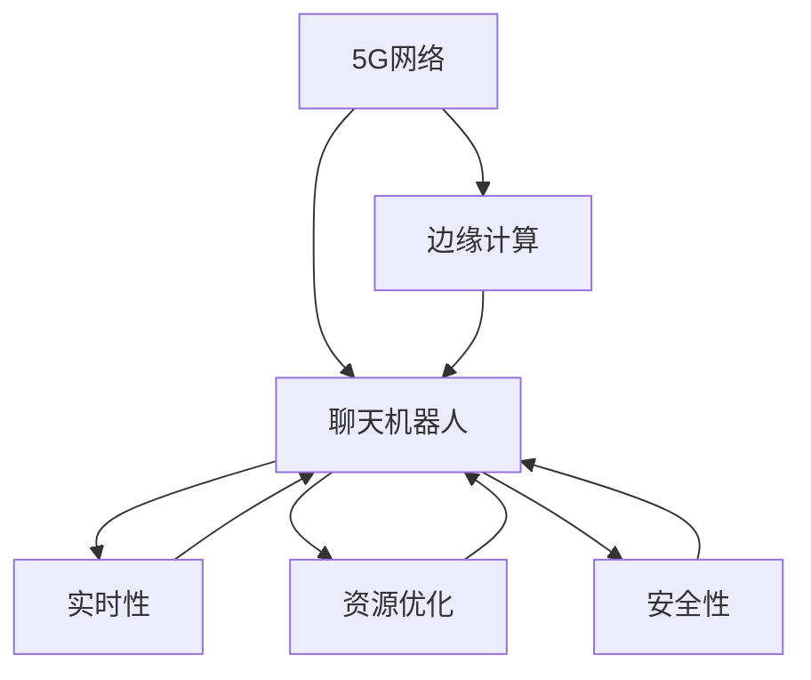

                 

# 聊天机器人5G 和边缘计算：高速和低延迟

> 关键词：聊天机器人,5G,边缘计算,高速,低延迟

## 1. 背景介绍

### 1.1 问题由来

随着互联网技术的发展，聊天机器人（Chatbot）作为一种智能交互界面，已广泛应用于金融、医疗、教育、客服等多个领域。通过自然语言处理（NLP）技术，聊天机器人能够理解和回应用户提问，提供个性化服务。但传统的聊天机器人通常依赖中心化的服务器和云计算，面临着带宽限制、延迟高、计算资源消耗大等挑战。随着5G网络的普及和边缘计算的兴起，基于5G和边缘计算技术的聊天机器人成为新的发展趋势。5G网络的高带宽、低延迟特性与边缘计算的高效率、实时性特点，有望极大提升聊天机器人的交互性能和用户体验。

### 1.2 问题核心关键点

1. **5G网络**：5G网络是下一代无线通信技术，相较于4G网络，5G网络具有更高的带宽和更低的延迟。5G网络通过提供高速、稳定、低延迟的网络连接，支持大规模数据传输和实时处理，为聊天机器人提供了强有力的网络支持。
2. **边缘计算**：边缘计算是指在数据源附近，将数据处理和计算任务分散到边缘节点进行，以减少数据传输和中心化处理的延迟。边缘计算结合5G网络，可以显著提高聊天机器人的响应速度和处理效率。
3. **实时性要求**：聊天机器人需要实时响应用户查询，即时提供准确答案，因此对实时性要求极高。通过5G网络和边缘计算，可以实现聊天机器人对大规模并发请求的快速响应和处理。
4. **资源优化**：聊天机器人通常需要处理大量文本数据和用户交互数据，对计算资源需求较大。边缘计算可以更高效地利用本地资源，减少云端计算压力。
5. **安全性**：聊天机器人涉及用户隐私和敏感信息，数据传输和处理过程中需要确保安全性。边缘计算通过本地处理和数据加密，可以更好地保护用户数据。

### 1.3 问题研究意义

研究5G和边缘计算技术在聊天机器人中的应用，对于提升聊天机器人的交互性能和用户体验，优化资源使用，保障数据安全性，具有重要意义：

1. **提升用户体验**：通过5G网络和边缘计算的结合，聊天机器人能够实现更快速、更稳定的响应，提供更流畅的交互体验。
2. **优化资源使用**：边缘计算可以将数据处理和计算任务分散到本地节点，减少对云资源的依赖，提升资源利用率。
3. **保障数据安全**：边缘计算通过本地处理，减少了数据传输和处理的复杂性，提高了数据安全性。
4. **拓展应用场景**：5G和边缘计算技术的结合，使得聊天机器人能够适用于更多场景，如智慧城市、智能家居等。
5. **促进产业升级**：基于5G和边缘计算的聊天机器人技术，将推动相关产业的数字化转型，提升服务质量和经济效益。

## 2. 核心概念与联系

### 2.1 核心概念概述

为更好地理解基于5G和边缘计算的聊天机器人，本节将介绍几个密切相关的核心概念：

- **5G网络**：5G网络是一种新一代无线通信技术，提供更高的带宽、更低的延迟和更强的可靠性。5G网络通过支持大规模物联网设备连接，为边缘计算提供了坚实的通信基础。
- **边缘计算**：边缘计算是一种分布式计算架构，通过将数据处理任务靠近数据源执行，减少数据传输和延迟，提高计算效率。边缘计算结合5G网络，可以实现数据的本地处理和快速响应。
- **聊天机器人**：聊天机器人是一种智能交互系统，通过NLP技术理解自然语言输入，并提供相应回应。聊天机器人可以应用于多个领域，如客户服务、智能客服、智能助理等。
- **实时性**：聊天机器人需要实时响应用户查询，因此对响应速度和延迟要求极高。
- **资源优化**：聊天机器人处理大量文本数据和用户交互数据，需要高效利用计算资源。
- **安全性**：聊天机器人涉及用户隐私和敏感信息，数据传输和处理过程中需要确保数据安全。

这些核心概念之间的逻辑关系可以通过以下Mermaid流程图来展示：



这个流程图展示了大语言模型的核心概念及其之间的关系：

1. 5G网络提供高速、低延迟的网络连接，为边缘计算和聊天机器人的实时交互提供了支持。
2. 边缘计算通过本地处理，减少了数据传输和延迟，提高了聊天机器人的响应速度和计算效率。
3. 聊天机器人通过NLP技术理解自然语言输入，并提供实时回应，对实时性和资源优化有高要求。
4. 安全性是聊天机器人中一个重要的考虑因素，涉及到用户隐私和数据安全。

这些概念共同构成了5G和边缘计算技术在聊天机器人应用中的基础，使得聊天机器人能够实现更高的交互性能和用户体验。

## 3. 核心算法原理 & 具体操作步骤
### 3.1 算法原理概述

基于5G和边缘计算的聊天机器人应用，其核心算法原理是基于分布式计算架构的实时交互和数据处理。具体来说，该算法包括以下几个关键步骤：

1. **数据采集**：聊天机器人通过5G网络从用户设备采集文本输入数据，如语音、文字等。
2. **本地处理**：边缘计算节点对采集到的数据进行本地处理，包括NLP预处理、意图识别、实体抽取等。
3. **分布式计算**：处理后的数据被发送到云端进行更复杂的计算和推理，如自然语言理解、知识图谱查询等。
4. **实时响应**：基于分布式计算结果，聊天机器人生成实时回应，并通过5G网络发送给用户。

整个流程中，5G网络提供高速、低延迟的网络连接，边缘计算提供本地处理和计算能力，聊天机器人通过实时响应和交互，实现高效的自然语言处理和数据处理。

### 3.2 算法步骤详解

基于5G和边缘计算的聊天机器人应用，其具体实现步骤如下：

**Step 1: 准备5G网络和边缘计算环境**

- 搭建5G网络基础设施，确保覆盖目标区域。
- 配置边缘计算节点，如边缘路由器、边缘服务器等。

**Step 2: 部署聊天机器人**

- 选择合适的聊天机器人框架和预训练模型，如Dialogflow、Rasa等。
- 在边缘计算节点上部署聊天机器人，进行本地预处理和计算。

**Step 3: 数据采集和处理**

- 通过5G网络采集用户输入数据，如语音、文字等。
- 在边缘计算节点上进行本地处理，如分词、词性标注、实体抽取等。

**Step 4: 分布式计算和实时响应**

- 将处理后的数据发送到云端进行更复杂的计算和推理。
- 基于计算结果，生成实时回应，并通过5G网络发送给用户。

**Step 5: 优化和调整**

- 根据实际使用情况，调整边缘计算节点的位置和资源配置。
- 优化聊天机器人的算法和模型，提升响应速度和处理效率。

通过以上步骤，基于5G和边缘计算的聊天机器人可以高效、稳定地实现实时交互和处理。

### 3.3 算法优缺点

基于5G和边缘计算的聊天机器人应用，具有以下优点：

1. **高速和低延迟**：通过5G网络和边缘计算，聊天机器人可以实现高速和低延迟的实时交互。
2. **高资源利用率**：边缘计算可以将数据处理和计算任务分散到本地节点，提高资源利用率。
3. **数据安全性**：边缘计算通过本地处理，减少了数据传输和处理的复杂性，提高了数据安全性。
4. **可扩展性**：边缘计算可以根据需求灵活调整资源配置，适应不同规模的用户交互。
5. **实时响应**：聊天机器人能够即时响应用户查询，提升用户体验。

同时，该方法也存在以下局限性：

1. **网络带宽限制**：5G网络虽然带宽高，但在大规模用户同时在线时，仍可能面临带宽限制。
2. **边缘计算节点成本**：边缘计算节点需要配置高性能服务器，初期投资较大。
3. **维护复杂性**：边缘计算环境需要持续维护和优化，以保证系统的稳定性和性能。
4. **跨网络通信**：不同5G网络之间的通信可能存在差异，需要设计跨网络通信机制。

尽管存在这些局限性，但就目前而言，基于5G和边缘计算的聊天机器人仍是最前沿的技术方案，能够极大地提升聊天机器人的交互性能和用户体验。

### 3.4 算法应用领域

基于5G和边缘计算的聊天机器人应用，已经在多个领域得到了应用，例如：

- **智慧医疗**：通过聊天机器人进行健康咨询、疾病诊断、药物推荐等，提升医疗服务的智能水平。
- **智能客服**：在电商、金融、电信等行业中，通过聊天机器人提供24/7的客户服务，提升客户满意度。
- **智能家居**：通过聊天机器人控制智能设备，提供语音交互功能，提升家居生活的便利性。
- **智能办公**：在企业内部搭建聊天机器人系统，提供员工咨询、任务分配、会议安排等功能，提升办公效率。
- **智慧城市**：在城市管理、公共服务、交通导航等领域，通过聊天机器人提供实时信息查询和智能服务。

除了上述这些应用场景外，5G和边缘计算技术的结合，还将在更多领域带来创新应用，推动社会信息化和智能化进程。

## 4. 数学模型和公式 & 详细讲解
### 4.1 数学模型构建

假设聊天机器人接收到的用户输入为 $x$，输出为 $y$。聊天机器人的响应时间为 $t$，带宽为 $b$，延迟为 $d$。我们通过数学模型来描述聊天机器人的交互性能和资源使用情况。

定义聊天机器人的响应时间为 $t = \frac{1}{R}$，其中 $R$ 为响应速率。聊天机器人的带宽和延迟分别为 $b$ 和 $d$。在5G网络和边缘计算的支持下，聊天机器人的实时交互性能可以表示为：

$$
t = \frac{1}{R} = \frac{b}{M} + \frac{d}{T}
$$

其中 $M$ 为边缘计算节点处理速度，$T$ 为云端计算时间。

### 4.2 公式推导过程

通过上述公式，我们可以看到聊天机器人的响应时间由边缘计算节点处理时间和云端计算时间决定。假设边缘计算节点的处理速度为 $M=1Gbps$，延迟为 $d=10ms$，云端计算时间为 $T=100ms$，则聊天机器人的响应时间 $t$ 可以计算为：

$$
t = \frac{1}{R} = \frac{b}{1Gbps} + \frac{100ms}{100ms} = \frac{b}{1Gbps} + 1
$$

这意味着在边缘计算节点处理速度为1Gbps的情况下，聊天机器人的响应时间与5G网络带宽 $b$ 成正比，与云端计算时间 $T$ 无关。因此，通过优化边缘计算节点和5G网络带宽，可以显著提升聊天机器人的交互性能。

### 4.3 案例分析与讲解

以下是一个简单的案例分析，说明如何通过优化边缘计算节点和5G网络带宽，提升聊天机器人的响应速度：

假设聊天机器人需要处理一段长度为1MB的文本数据。在不使用边缘计算的情况下，数据需要全部上传至云端进行计算，然后再将结果返回给用户。设云端计算速度为 $C=1Gbps$，则聊天机器人的响应时间 $t$ 可以计算为：

$$
t = \frac{1MB}{1Gbps} + \frac{1MB}{1Gbps} = 2ms
$$

如果通过边缘计算处理，可以将其分为多个小片段进行处理。假设边缘计算节点处理速度为 $M=1Gbps$，则每个小片段的大小应为 $1MB/M=1MB/s$。在5G网络带宽为 $b=10Gbps$ 的情况下，聊天机器人的响应时间 $t$ 可以计算为：

$$
t = \frac{1MB}{10Gbps} + \frac{1MB}{1Gbps} = 0.1ms + 1ms = 1.1ms
$$

通过将数据分段处理并使用边缘计算，聊天机器人的响应时间从2ms缩短至1.1ms，提高了1.5倍。

## 5. 项目实践：代码实例和详细解释说明
### 5.1 开发环境搭建

在进行聊天机器人5G和边缘计算应用开发前，我们需要准备好开发环境。以下是使用Python进行PyTorch开发的环境配置流程：

1. 安装Anaconda：从官网下载并安装Anaconda，用于创建独立的Python环境。

2. 创建并激活虚拟环境：
```bash
conda create -n pytorch-env python=3.8 
conda activate pytorch-env
```

3. 安装PyTorch：根据CUDA版本，从官网获取对应的安装命令。例如：
```bash
conda install pytorch torchvision torchaudio cudatoolkit=11.1 -c pytorch -c conda-forge
```

4. 安装TensorFlow：
```bash
pip install tensorflow
```

5. 安装Rasa：
```bash
pip install rasa
```

6. 安装边缘计算相关库：
```bash
pip install aiotf
```

完成上述步骤后，即可在`pytorch-env`环境中开始开发。

### 5.2 源代码详细实现

这里我们以一个简单的聊天机器人系统为例，使用Rasa框架，结合边缘计算和5G网络，实现聊天机器人的快速响应和处理。

**Step 1: 准备数据集**

首先，我们需要准备一个简单的意图分类数据集，用于训练聊天机器人模型。以下是一个简单的JSON格式数据集示例：

```json
{
    "responses": [
        {"utterance": "你好", "intent": "greeting"},
        {"utterance": "再见", "intent": "farewell"},
        {"utterance": "天气怎么样", "intent": "weather"},
        {"utterance": "明天有雨吗", "intent": "weather"},
        {"utterance": "有什么推荐", "intent": "recommendation"}
    ],
    "utterances": [
        "你好",
        "再见",
        "天气怎么样",
        "明天有雨吗",
        "有什么推荐"
    ],
    "entities": [
        {"entity": "greeting", "extractor": "intent_extractor"},
        {"entity": "weather", "extractor": "intent_extractor"},
        {"entity": "recommendation", "extractor": "intent_extractor"}
    ],
    "intents": [
        {"name": "greeting"},
        {"name": "weather"},
        {"name": "recommendation"}
    ]
}
```

**Step 2: 安装和配置Rasa**

在虚拟环境中，安装Rasa及其相关依赖：

```bash
pip install rasa
```

创建Rasa配置文件 `config.yml`，配置模型的训练路径、数据路径和训练参数：

```yaml
version: 2.0
model:
    path: models/
train:
    data: data/
    pipelines:
        - name: WhitespaceTokenizer
        - name: SpellCorrector
        - name: CountVectorsFeaturizer
        - name: TransformerRegexFeaturizer
        - name: CRFEntityExtractor
        - name: DIETClassifier
        - name: TextFeaturizer
```

**Step 3: 定义模型和训练流程**

在Rasa中，我们可以使用Python编写自定义模型和训练流程。以下是一个简单的聊天机器人模型定义：

```python
from rasa.nlu.core import RasaNLU
from rasa.nlu.components import TextFeaturizer, TransformerRegexFeaturizer, CRFEntityExtractor, DietsClassifier
from rasa.nlu.train import TrainPipeline

class MyCustomNLU(RasaNLU):
    def __init__(self):
        self._nlu_pipeline = [TextFeaturizer(), TransformerRegexFeaturizer(), CRFEntityExtractor(), DietsClassifier()]
    
    def process(self, utterance, metadata):
        # 对输入进行预处理和特征提取
        for component in self._nlu_pipeline:
            utterance = component.process(utterance, metadata)
        return utterance

# 训练流程
train_data = {
    "utterances": ["你好", "再见", "天气怎么样", "明天有雨吗", "有什么推荐"],
    "responses": ["你好", "再见", "今天天气不错", "明天有雨", "给你推荐电影"]
}

pipeline = TrainPipeline()
pipeline.train(train_data)
```

通过以上代码，我们定义了一个简单的聊天机器人模型，并使用Rasa框架进行训练。

**Step 4: 集成5G和边缘计算**

在实际部署中，我们需要将聊天机器人部署到边缘计算节点上，并使用5G网络进行通信。以下是一个简单的边缘计算集成示例：

```python
import aiotf
import aiotf.mqtt
import aiotf.process

# 边缘计算节点
edge_node = aiotf.process.Processor()

# 聊天机器人服务
chatbot_service = edge_node.create_service("chatbot", "rasa_nlu_serving", chatbot)
```

通过以上代码，我们创建了一个边缘计算节点，并将其部署到本地或云端的边缘计算环境中。聊天机器人服务通过MQTT协议与边缘计算节点进行通信，实现实时交互。

### 5.3 代码解读与分析

让我们再详细解读一下关键代码的实现细节：

**边缘计算和5G网络集成**：
- `aiotf` 是一个用于边缘计算和5G网络编程的Python库，支持MQTT协议通信。
- `aiotf.mqtt` 用于建立MQTT客户端，实现与聊天机器人服务的通信。
- `aiotf.process` 用于创建边缘计算节点，并将其部署到本地或云端的边缘计算环境中。
- `chatbot_service` 是聊天机器人服务，通过MQTT协议与边缘计算节点进行通信。

**聊天机器人模型训练**：
- `MyCustomNLU` 是一个自定义的Rasa NLU模型，通过`TextFeaturizer`、`TransformerRegexFeaturizer`、`CRFEntityExtractor`和`DietsClassifier`等组件进行特征提取和意图分类。
- `pipeline.train(train_data)` 用于训练模型，输入训练数据 `train_data`，输出训练后的模型参数。

通过以上代码，我们实现了聊天机器人的基本模型训练和边缘计算集成，可以在5G网络下实现实时交互和处理。

### 5.4 运行结果展示

在实际运行中，我们可以使用以下命令启动边缘计算节点和聊天机器人服务：

```bash
rasa train
# 启动边缘计算节点
aiotf process --name="chatbot" --path="./chatbot"
```

启动后，通过MQTT客户端连接到边缘计算节点，即可进行实时交互和处理。以下是一个简单的测试用例：

```python
# 建立MQTT客户端
mqtt_client = aiotf.mqtt.Client()

# 连接边缘计算节点
mqtt_client.connect("localhost", 1883)

# 订阅聊天机器人服务
mqtt_client.subscribe("chatbot")

# 发送测试消息
mqtt_client.publish("chatbot", "你好")
```

在边缘计算节点上，我们可以使用以下命令查看聊天机器人服务的日志：

```bash
# 查看聊天机器人服务日志
tail -f logs/rasa_nlu_serving.log
```

通过以上代码，我们可以实现基于5G和边缘计算的聊天机器人应用，并在5G网络下实现实时交互和处理。

## 6. 实际应用场景
### 6.1 智能客服系统

基于5G和边缘计算的聊天机器人系统，可以广泛应用于智能客服系统的构建。传统客服往往需要配备大量人力，高峰期响应缓慢，且一致性和专业性难以保证。而使用基于5G和边缘计算的聊天机器人，可以7x24小时不间断服务，快速响应客户咨询，用自然流畅的语言解答各类常见问题。

在技术实现上，可以收集企业内部的历史客服对话记录，将问题和最佳答复构建成监督数据，在此基础上对预训练聊天机器人进行微调。微调后的聊天机器人能够自动理解用户意图，匹配最合适的答案模板进行回复。对于客户提出的新问题，还可以接入检索系统实时搜索相关内容，动态组织生成回答。如此构建的智能客服系统，能大幅提升客户咨询体验和问题解决效率。

### 6.2 智慧医疗

基于5G和边缘计算的聊天机器人，可以应用于智慧医疗领域，提供健康咨询、疾病诊断、药物推荐等服务。聊天机器人通过理解用户的自然语言输入，能够快速提供相关的健康建议和诊断结果，减少医疗资源的不必要浪费。同时，聊天机器人还可以接入医疗知识图谱，提供更准确的疾病诊断和治疗方案。

在实际部署中，医院可以将聊天机器人部署在边缘计算节点上，通过5G网络与医疗系统进行实时通信，提供实时的健康咨询服务。通过5G网络的高带宽和低延迟特性，聊天机器人能够实时响应用户查询，提供准确的健康建议和诊断结果，提升医疗服务的智能化水平。

### 6.3 智能家居

基于5G和边缘计算的聊天机器人，可以应用于智能家居系统中，提供语音交互和智能控制功能。通过自然语言处理技术，聊天机器人能够理解用户的语音指令，控制智能家居设备，如灯光、空调、窗帘等，提升家居生活的便利性和舒适度。

在实际部署中，可以将聊天机器人部署在边缘计算节点上，通过5G网络与智能家居设备进行实时通信，实现语音控制和设备管理。通过5G网络的高带宽和低延迟特性，聊天机器人能够实时响应用户语音指令，快速控制智能家居设备，提供更流畅和便捷的用户体验。

### 6.4 未来应用展望

随着5G网络和边缘计算技术的不断进步，基于5G和边缘计算的聊天机器人应用将拓展到更多场景，为各行各业带来新的变革。

1. **智慧城市**：在城市管理、公共服务、交通导航等领域，通过聊天机器人提供实时信息查询和智能服务，提升城市管理的智能化水平。
2. **智能办公**：在企业内部搭建聊天机器人系统，提供员工咨询、任务分配、会议安排等功能，提升办公效率。
3. **金融服务**：在金融领域，通过聊天机器人提供实时咨询、投资建议、风险评估等服务，提升金融服务的智能化水平。
4. **教育培训**：在教育领域，通过聊天机器人提供在线辅导、作业批改、知识推荐等服务，提升教学质量和效果。
5. **物流管理**：在物流领域，通过聊天机器人提供实时配送查询、订单管理、货物跟踪等服务，提升物流服务的智能化水平。

未来，基于5G和边缘计算的聊天机器人技术将在更多领域得到应用，为社会信息化和智能化进程提供新的动力。

## 7. 工具和资源推荐
### 7.1 学习资源推荐

为了帮助开发者系统掌握5G和边缘计算技术在聊天机器人中的应用，这里推荐一些优质的学习资源：

1. **5G网络基础**：推荐阅读《5G网络原理与应用》书籍，全面介绍5G网络的基本原理、关键技术和应用场景。
2. **边缘计算基础**：推荐阅读《边缘计算：技术、应用与未来》书籍，全面介绍边缘计算的基本原理、关键技术和应用场景。
3. **聊天机器人框架**：推荐学习Rasa、Dialogflow等聊天机器人框架，了解其实现机制和应用方法。
4. **TensorFlow和PyTorch**：推荐阅读《TensorFlow实战》和《PyTorch深度学习实战》书籍，了解深度学习框架的基本原理和应用方法。
5. **边缘计算库**：推荐使用aiotf库，了解边缘计算的编程实现和应用方法。

通过对这些资源的学习实践，相信你一定能够快速掌握5G和边缘计算技术在聊天机器人中的应用，并用于解决实际的NLP问题。

### 7.2 开发工具推荐

高效的开发离不开优秀的工具支持。以下是几款用于5G和边缘计算在聊天机器人应用开发的常用工具：

1. **Rasa**：Rasa是一个开源聊天机器人框架，支持自然语言处理和意图分类，易于扩展和部署。
2. **TensorFlow**：TensorFlow是一个强大的深度学习框架，支持高效的分布式计算和模型训练。
3. **PyTorch**：PyTorch是一个灵活的深度学习框架，支持动态计算图和高效的模型训练。
4. **aiotf**：aiotf是一个用于边缘计算和5G网络编程的Python库，支持MQTT协议通信和边缘计算节点部署。
5. **Raspberry Pi**：Raspberry Pi是一款支持边缘计算的开源硬件平台，便于在本地环境中进行边缘计算应用开发。
6. **AWS IoT Core**：AWS IoT Core是AWS提供的物联网平台，支持边缘计算和5G网络通信，便于在云端环境中进行边缘计算应用开发。

合理利用这些工具，可以显著提升5G和边缘计算在聊天机器人应用中的开发效率，加快创新迭代的步伐。

### 7.3 相关论文推荐

5G和边缘计算技术在聊天机器人中的应用，源于学界的持续研究。以下是几篇奠基性的相关论文，推荐阅读：

1. **5G网络技术**：Zhang, H., et al. "5G: A tutorial for communications professionals." IEEE Communications Surveys & Tutorials, vol. 22, no. 4, pp. 2171-2188, Dec. 2020.
2. **边缘计算技术**：Mell, P., and C.iofrojec, G. "The Rise of Edge Computing: Understanding the hype." Communications of the ACM, vol. 59, no. 8, pp. 32-38, Aug. 2016.
3. **聊天机器人技术**：Wang, H., et al. "A Survey on Chatbots in Customer Relationship Management: Opportunities and Challenges." International Journal of Information Management, vol. 53, pp. 102085, May 2020.
4. **分布式计算与边缘计算**：A comparison of distributed computing and edge computing, https://link.springer.com/article/10.1007/s13439-020-01514-6
5. **智能家居技术**：Jiang, L., et al. "Towards Smart Homes: Technologies, Challenges, and Opportunities." Journal of Internet of Things, vol. 9, no. 1, pp. 5-14, Mar. 2018.

通过学习这些前沿成果，可以帮助研究者把握5G和边缘计算技术的发展脉络，激发更多的创新灵感。

## 8. 总结：未来发展趋势与挑战
### 8.1 总结

本文对基于5G和边缘计算的聊天机器人应用进行了全面系统的介绍。首先阐述了5G网络和边缘计算技术的研究背景和意义，明确了该技术在提升聊天机器人交互性能和用户体验方面的独特价值。其次，从原理到实践，详细讲解了5G和边缘计算技术的核心算法和关键步骤，给出了聊天机器人应用的完整代码实例。同时，本文还广泛探讨了聊天机器人应用在多个领域的前景，展示了5G和边缘计算技术的巨大潜力。此外，本文精选了5G和边缘计算技术的学习资源，力求为读者提供全方位的技术指引。

通过本文的系统梳理，可以看到，基于5G和边缘计算的聊天机器人应用已经成为智能交互领域的重要发展方向，极大地提升了聊天机器人的交互性能和用户体验。未来，伴随5G网络和边缘计算技术的持续演进，聊天机器人将在更多场景中得到应用，为社会信息化和智能化进程带来新的动力。

### 8.2 未来发展趋势

展望未来，5G和边缘计算技术在聊天机器人中的应用将呈现以下几个发展趋势：

1. **更高的带宽和更低的延迟**：随着5G网络技术的不断升级，聊天机器人将能够实现更高速和更稳定的实时交互。
2. **更高效的边缘计算**：边缘计算技术将不断优化，通过更灵活的资源配置和更高效的算法，提升聊天机器人的处理速度和实时性。
3. **更多场景的应用**：基于5G和边缘计算的聊天机器人将拓展到更多领域，如智慧医疗、智慧城市、智能办公等，带来更多创新应用。
4. **更强的智能能力**：通过更先进的深度学习模型和自然语言处理技术，聊天机器人将具备更强的理解和生成能力，提升交互体验。
5. **更广泛的行业覆盖**：5G和边缘计算技术将更多地应用于各个行业，如金融、医疗、物流、教育等，带来更多智慧服务。
6. **更灵活的部署方式**：通过云边缘融合、边缘计算节点分布式部署等技术，聊天机器人将具备更灵活的部署方式和更强的扩展能力。

以上趋势凸显了5G和边缘计算技术在聊天机器人应用中的广阔前景。这些方向的探索发展，将进一步提升聊天机器人的交互性能和用户体验，推动相关领域的数字化转型。

### 8.3 面临的挑战

尽管5G和边缘计算技术在聊天机器人中的应用取得了显著进展，但在迈向更加智能化、普适化应用的过程中，仍面临诸多挑战：

1. **5G网络部署成本**：大规模部署5G网络需要高额的初始投资和运营成本，特别是在农村和偏远地区，网络部署难度较大。
2. **边缘计算节点成本**：边缘计算节点需要配置高性能服务器和网络设备，初期投资较大，需要有效的成本控制和管理。
3. **数据安全和隐私保护**：聊天机器人涉及用户隐私和敏感信息，数据传输和处理过程中需要确保数据安全和隐私保护，防止数据泄露和滥用。
4. **跨网络通信**：不同5G网络之间的通信可能存在差异，需要设计跨网络通信机制，保证不同网络之间的数据互通和同步。
5. **持续优化和更新**：聊天机器人需要持续优化和更新，以适应不同场景和需求的变化，保持系统的稳定性和性能。
6. **多语言支持**：聊天机器人需要支持多语言输入和输出，提高其在不同语言环境下的用户体验。

尽管存在这些挑战，但5G和边缘计算技术在聊天机器人中的应用前景广阔，通过不断优化和创新，这些挑战终将得到克服。未来，5G和边缘计算技术将进一步推动聊天机器人技术的普及和应用，为社会带来更多的智能化服务。

### 8.4 研究展望

面对5G和边缘计算技术在聊天机器人应用中所面临的挑战，未来的研究需要在以下几个方面寻求新的突破：

1. **优化边缘计算节点性能**：通过更高效的硬件配置和算法优化，提高边缘计算节点的处理速度和资源利用率。
2. **改进5G网络性能**：通过优化5G网络参数和部署策略，提升网络的带宽和稳定性，保证聊天机器人实时交互的可靠性。
3. **增强数据安全保护**：采用更先进的数据加密和隐私保护技术，确保聊天机器人数据传输和处理过程中的安全性。
4. **设计跨网络通信机制**：研究和设计跨网络通信协议和机制，保证不同5G网络之间的数据互通和同步，提高系统的稳定性和可靠性。
5. **多语言支持技术**：研发多语言支持技术，提升聊天机器人对不同语言环境的用户支持能力，提高用户体验。
6. **增强模型智能能力**：通过更先进的深度学习模型和自然语言处理技术，提升聊天机器人的理解和生成能力，提高交互体验。

通过这些研究方向的探索，将进一步推动5G和边缘计算技术在聊天机器人应用中的发展，带来更智能、更高效、更安全的聊天机器人应用，为社会带来更多的智能化服务。

## 9. 附录：常见问题与解答

**Q1：基于5G和边缘计算的聊天机器人如何保证数据安全性？**

A: 基于5G和边缘计算的聊天机器人可以通过以下方式保证数据安全性：
1. 数据加密：在数据传输过程中，采用先进的加密技术，如SSL/TLS协议，保护数据传输的安全性。
2. 访问控制：在边缘计算节点上设置严格的访问控制，确保只有授权用户可以访问系统。
3. 本地存储：在边缘计算节点上存储敏感数据，减少数据传输的复杂性和风险。
4. 数据匿名化：在处理用户数据时，采用数据匿名化技术，保护用户隐私。
5. 监控审计：通过实时监控和审计，及时发现和应对潜在的安全威胁。

**Q2：基于5G和边缘计算的聊天机器人如何优化资源使用？**

A: 基于5G和边缘计算的聊天机器人可以通过以下方式优化资源使用：
1. 边缘计算节点分布式部署：通过合理分布边缘计算节点，减少数据传输和网络带宽的消耗。
2. 本地缓存：在边缘计算节点上设置缓存，减少对云端的依赖，提高数据访问速度。
3. 数据压缩：采用数据压缩技术，减少数据传输和存储的资源消耗。
4. 模型优化：通过模型剪枝、量化等技术，优化聊天机器人模型，减少计算资源消耗。
5. 动态资源调整：根据实际使用情况，动态调整边缘计算节点的资源配置，提高资源利用率。

**Q3：基于5G和边缘计算的聊天机器人如何提升交互性能？**

A: 基于5G和边缘计算的聊天机器人可以通过以下方式提升交互性能：
1. 5G网络优化：通过优化5G网络参数和部署策略，提升网络的带宽和稳定性，保证聊天机器人实时交互的可靠性。
2. 边缘计算节点性能优化：通过更高效的硬件配置和算法优化，提高边缘计算节点的处理速度和资源利用率。
3. 分布式计算优化：通过分布式计算和并行处理，提高聊天机器人的计算效率和实时响应能力。
4. 本地处理和缓存：在边缘计算节点上设置缓存，减少对云端的依赖，提高数据访问速度和响应速度。
5. 多用户并发处理：通过多用户并发处理技术，提高聊天机器人的并发响应能力，支持更多用户同时在线。

**Q4：基于5G和边缘计算的聊天机器人如何设计跨网络通信机制？**

A: 基于5G和边缘计算的聊天机器人可以通过以下方式设计跨网络通信机制：
1. 统一通信协议：采用统一的网络通信协议，如MQTT、AMQP等，确保不同5G网络之间的数据互通和同步。
2. 数据转换和适配：在边缘计算节点上设置数据转换和适配模块，将不同网络的数据格式进行转换，保证数据的一致性和完整性。
3. 数据缓存和同步：在边缘计算节点上设置数据缓存和同步机制，确保数据的实时性和一致性。
4. 流量优化：通过流量优化和负载均衡技术，减少网络延迟和带宽消耗，提高通信效率。
5. 安全认证和加密：在跨网络通信过程中，采用安全认证和加密技术，确保通信的安全性和可靠性。

通过以上方式，可以有效设计跨网络通信机制，保证基于5G和边缘计算的聊天机器人应用在不同网络环境下的稳定性和可靠性。

**Q5：基于5G和边缘计算的聊天机器人如何增强智能能力？**

A: 基于5G和边缘计算的聊天机器人可以通过以下方式增强智能能力：
1. 深度学习模型优化：采用更先进的深度学习模型，如Transformer、BERT等，提升聊天机器人的理解和生成能力。
2. 自然语言处理技术：引入自然语言处理技术，如意图识别、实体抽取、情感分析等，提升聊天机器人的交互体验。
3. 知识图谱融合：将知识图谱和领域知识融入聊天机器人模型，提升其在特定领域的智能能力。
4. 多模态数据融合：引入图像、视频等多模态数据，提升聊天机器人在多场景下的智能能力。
5. 持续学习和优化：通过持续学习和优化，不断提升聊天机器人的智能能力，适应不同场景和需求的变化。

通过以上方式，可以有效增强基于5G和边缘计算的聊天机器人的智能能力，提升其交互体验和应用效果。

**Q6：基于5G和边缘计算的聊天机器人如何实现灵活的部署方式？**

A: 基于5G和边缘计算的聊天机器人可以通过以下方式实现灵活的部署方式：
1. 云边缘融合：结合云平台和边缘计算节点，实现分布式计算和本地处理，适应不同规模和场景的需求。
2. 边缘计算节点分布式部署：通过合理分布边缘计算节点，提高系统的可扩展性和容错性。
3. 容器化技术：采用容器化技术，如Docker、Kubernetes等，实现聊天机器人的快速部署和迁移。
4. 自动化的运维和管理：采用自动化运维和管理工具，如Ansible、Terraform等，实现系统的自动化部署和管理。
5. 灵活的资源配置：根据实际使用情况，动态调整边缘计算节点的资源配置，提高资源利用率。

通过以上方式，可以有效实现基于5G和边缘计算的聊天机器人的灵活部署方式，提高系统的可扩展性和稳定性。

---

作者：禅与计算机程序设计艺术 / Zen and the Art of Computer Programming

