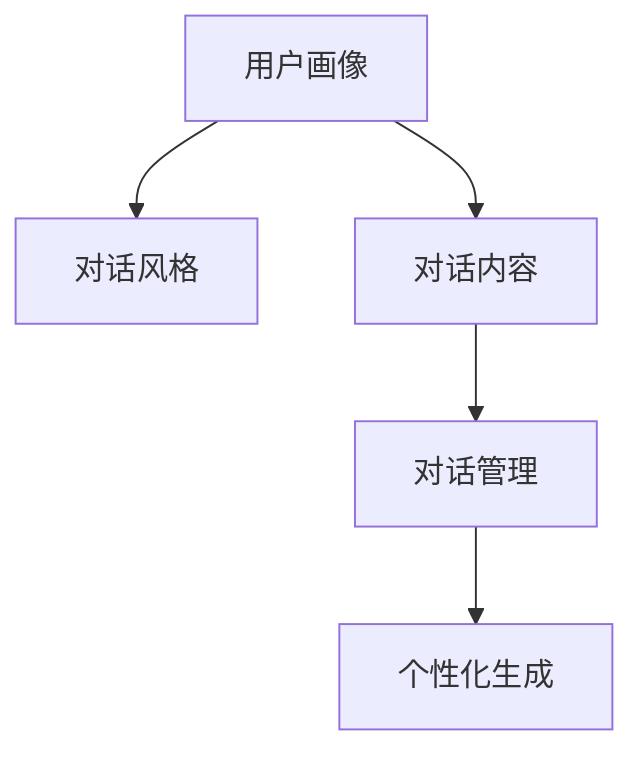

                 

# 聊天机器人个性化：根据用户偏好定制

在人工智能飞速发展的今天，聊天机器人已经深入到人们的生活和工作之中。然而，一个真正优秀的聊天机器人，不仅要具备强大的语言处理能力，更要能够理解用户的意图和偏好，提供个性化、自然流畅的对话体验。本文将深入探讨聊天机器人的个性化定制技术，帮助开发者构建出既智能又亲切的聊天伴侣。

## 1. 背景介绍

### 1.1 问题由来

随着智能对话系统的广泛应用，用户在聊天机器人交互中的个性化需求愈发突出。传统一成不变的交互方式已经无法满足用户对多样性和新颖性的追求，导致用户体验下降，甚至引发用户流失。为此，开发具有高度个性化能力的聊天机器人，已成为各大技术公司和研究机构关注的焦点。

### 1.2 问题核心关键点

聊天机器人的个性化定制主要依赖于以下关键技术：

- 用户画像建模：通过用户历史互动数据，建立用户兴趣、行为等特征，为用户画像。
- 用户偏好抽取：从对话记录中抽取用户对特定话题、风格、语气等方面的偏好。
- 个性化对话生成：根据用户画像和偏好，生成与用户相匹配的对话内容。
- 交互策略优化：根据用户反馈，调整对话策略，优化交互体验。

这些技术彼此关联，共同构成了一个完整的个性化聊天机器人构建框架。

### 1.3 问题研究意义

聊天机器人个性化是提升用户体验的关键。通过深度定制化，机器人可以更准确地理解用户需求，提供更加个性化的服务，从而增强用户粘性，提升服务满意度。对于企业而言，具有高度个性化的聊天机器人也是提升品牌形象、增强市场竞争力的重要手段。

## 2. 核心概念与联系

### 2.1 核心概念概述

为更好地理解聊天机器人个性化定制，本节将介绍几个密切相关的核心概念：

- 用户画像(User Profile)：描述用户基本信息、兴趣、行为习惯等特征的模型。
- 对话风格(Dialogue Style)：用户偏好的对话方式，包括语言风格、幽默程度、礼貌程度等。
- 对话内容(Dialogue Content)：机器人与用户之间交换的信息内容。
- 对话管理(Dialogue Management)：控制聊天机器人对话流程的技术，确保对话流畅自然。
- 个性化生成(Generative Model)：使用机器学习模型生成个性化对话内容的技术。

这些核心概念之间的逻辑关系可以通过以下Mermaid流程图来展示：



这个流程图展示了个性化聊天机器人构建的基本流程：

1. 通过用户画像建模技术，建立用户特征模型。
2. 根据用户画像，抽取用户对话风格，优化对话策略。
3. 使用个性化生成技术，生成符合用户偏好的对话内容。
4. 在对话管理技术的辅助下，使机器人对话流程自然流畅。

## 3. 核心算法原理 & 具体操作步骤
### 3.1 算法原理概述

聊天机器人个性化定制的核心思想是：基于用户画像和对话记录，学习用户偏好，动态生成个性化对话内容。

形式化地，假设用户画像模型为 $U=(u_1,u_2,\ldots,u_n)$，其中 $u_i$ 为用户画像中第 $i$ 个特征。对话记录为 $D=\{(x_i,y_i)\}_{i=1}^N$，其中 $x_i$ 为机器人输入，$y_i$ 为用户回复。

定义对话风格模型为 $S=(\sigma_1,\sigma_2,\ldots,\sigma_m)$，其中 $\sigma_i$ 表示用户偏好的第 $i$ 个对话风格特征。定义个性化生成模型为 $G=(\gamma_1,\gamma_2,\ldots,\gamma_k)$，其中 $\gamma_i$ 为第 $i$ 个个性化生成参数。

聊天机器人的个性化定制目标是最小化对话损失函数 $\mathcal{L}$，即：

$$
\hat{U}=\mathop{\arg\min}_{U} \mathcal{L}(D,S,G)
$$

其中 $\mathcal{L}$ 为针对特定任务的对话损失函数，用于衡量机器人生成的对话内容与用户期望之间的差异。

### 3.2 算法步骤详解

基于用户画像和对话记录的聊天机器人个性化定制，主要包括以下几个关键步骤：

**Step 1: 构建用户画像**

用户画像建模是构建个性化聊天机器人的第一步，通常包括用户基本信息（如年龄、性别）、兴趣爱好（如电影、音乐）、行为习惯（如购物偏好）等特征。

- 用户基本信息：通过用户注册信息、社交网络数据等获取。
- 兴趣爱好：通过用户浏览记录、搜索历史、评论内容等抽取。
- 行为习惯：通过用户购买记录、互动频率等分析。

**Step 2: 抽取用户偏好**

用户偏好抽取是理解用户对话风格的关键步骤，包括语言风格、幽默程度、礼貌程度、话题偏好等。

- 语言风格：使用自然语言处理技术，分析用户对话中使用频率较高的词汇、短语。
- 幽默程度：通过用户回复的语调、表情符号等，判断用户幽默感的强弱。
- 礼貌程度：分析用户对话中使用的礼貌用语、语气词等，判断用户的礼貌程度。
- 话题偏好：通过用户对话中频繁提及的话题、领域等，抽取用户偏好的话题。

**Step 3: 生成个性化对话**

个性化对话生成是聊天机器人核心功能之一，需根据用户画像和偏好，动态生成符合用户期望的对话内容。

- 对话内容生成：使用基于序列生成模型（如RNN、GRU、Transformer等），根据用户画像和偏好生成对话内容。
- 对话风格调整：调整模型参数，使生成的对话内容符合用户喜欢的对话风格。
- 对话策略优化：优化对话管理策略，确保对话流程自然流畅。

**Step 4: 优化对话管理**

对话管理是确保聊天机器人对话流程的自然流畅性的关键，需根据用户反馈不断调整对话策略。

- 对话策略调整：分析用户对话行为，调整对话策略，确保对话流程连续稳定。
- 交互策略优化：根据用户反馈，优化交互策略，提升用户体验。

### 3.3 算法优缺点

个性化聊天机器人定制具有以下优点：

- 用户定制化：能够根据用户画像和偏好，生成个性化对话内容，增强用户粘性。
- 提升用户体验：通过动态调整对话策略，使对话自然流畅，提升用户满意度。
- 增强服务效果：通过理解用户需求，提供更精准的服务，提升服务效果。

同时，该方法也存在一些缺点：

- 依赖用户数据：需要收集大量用户数据，数据隐私和安全问题需高度关注。
- 数据稀疏性：用户数据通常不完整，导致模型学习困难。
- 泛化能力不足：个性化模型可能仅适用于特定用户，泛化能力有限。
- 计算复杂度高：个性化生成模型和对话管理策略的计算复杂度较高，需优化算法。

尽管存在这些局限性，但基于用户画像和对话记录的聊天机器人个性化定制技术，依然在实际应用中取得了显著效果。未来相关研究的重点在于如何进一步优化算法，提高个性化模型的泛化能力和计算效率。

### 3.4 算法应用领域

个性化聊天机器人在多个领域具有广泛的应用前景，例如：

- 客户服务：通过理解客户需求，提供个性化的客户支持服务，提升客户满意度。
- 健康医疗：根据用户健康数据，提供个性化的健康咨询和建议。
- 教育培训：根据学生学习数据，提供个性化的学习资源和辅导。
- 金融理财：根据用户财务数据，提供个性化的投资建议和理财规划。
- 娱乐互动：根据用户兴趣偏好，提供个性化的娱乐内容和互动体验。

这些应用场景不仅能够提升用户体验，还能够为企业带来更高的用户粘性和商业价值。

## 4. 数学模型和公式 & 详细讲解  
### 4.1 数学模型构建

本节将使用数学语言对基于用户画像和对话记录的聊天机器人个性化定制过程进行更加严格的刻画。

假设用户画像模型为 $U=(u_1,u_2,\ldots,u_n)$，其中 $u_i$ 为用户画像中第 $i$ 个特征。对话记录为 $D=\{(x_i,y_i)\}_{i=1}^N$，其中 $x_i$ 为机器人输入，$y_i$ 为用户回复。

定义对话风格模型为 $S=(\sigma_1,\sigma_2,\ldots,\sigma_m)$，其中 $\sigma_i$ 表示用户偏好的第 $i$ 个对话风格特征。定义个性化生成模型为 $G=(\gamma_1,\gamma_2,\ldots,\gamma_k)$，其中 $\gamma_i$ 为第 $i$ 个个性化生成参数。

对话损失函数 $\mathcal{L}$ 可定义为：

$$
\mathcal{L}(D,S,G) = \frac{1}{N}\sum_{i=1}^N \ell(x_i,y_i|U,S,G)
$$

其中 $\ell(x_i,y_i|U,S,G)$ 为针对特定对话的损失函数，用于衡量生成对话与真实对话之间的差异。

### 4.2 公式推导过程

以生成单个对话 $(x_i,y_i)$ 为例，对话损失函数 $\ell(x_i,y_i|U,S,G)$ 可进一步定义为：

$$
\ell(x_i,y_i|U,S,G) = \frac{1}{m}\sum_{j=1}^m \frac{1}{k}\sum_{l=1}^k \|y_i - \gamma_l\cdot(x_i,u_1,u_2,\ldots,u_n;\sigma_1,\sigma_2,\ldots,\sigma_m)\|^2
$$

其中 $m$ 为对话风格特征数，$k$ 为个性化生成参数数。

在得到对话损失函数后，可以通过优化算法（如Adam、SGD等）最小化损失函数，得到最优的对话生成参数 $\gamma$。

### 4.3 案例分析与讲解

假设某用户画像 $U=(年龄:25岁, 性别:男, 兴趣爱好:音乐, 行为习惯:在线购物)$。通过自然语言处理技术，分析其对话风格为幽默风趣、礼貌温和。使用基于Transformer的序列生成模型，生成一条个性化对话：

机器人：欢迎光临，请问有什么需要帮助的吗？
用户：我想买张最新的专辑。
机器人：好的，请告诉我您的预算范围。
用户：300元左右。
机器人：我为您推荐《xxxx》，这是一张非常受欢迎的专辑。
用户：真的吗？
机器人：是的，这款专辑获得了很好的评价。
用户：好的，我就买这张了。
机器人：您太有眼光了！祝您购物愉快。

在生成对话时，模型综合考虑了用户画像和对话风格，生成了一条符合用户期望的个性化对话。

## 5. 项目实践：代码实例和详细解释说明
### 5.1 开发环境搭建

在进行聊天机器人个性化定制的开发之前，我们需要准备好开发环境。以下是使用Python进行TensorFlow开发的环境配置流程：

1. 安装Anaconda：从官网下载并安装Anaconda，用于创建独立的Python环境。

2. 创建并激活虚拟环境：
```bash
conda create -n chatbot-env python=3.8 
conda activate chatbot-env
```

3. 安装TensorFlow：根据CUDA版本，从官网获取对应的安装命令。例如：
```bash
conda install tensorflow tensorflow-gpu=cuda11.1 -c tf -c conda-forge
```

4. 安装相关工具包：
```bash
pip install numpy pandas sklearn
```

完成上述步骤后，即可在`chatbot-env`环境中开始个性化聊天机器人的开发实践。

### 5.2 源代码详细实现

下面我们以生成个性化对话为例，给出使用TensorFlow对模型进行训练和优化的PyTorch代码实现。

首先，定义模型和损失函数：

```python
import tensorflow as tf
from tensorflow.keras.layers import Input, Dense, Embedding, LSTM, Dropout, Concatenate
from tensorflow.keras.models import Model
from tensorflow.keras.losses import MeanSquaredError
import numpy as np

def build_model(input_dim, output_dim, embedding_dim, hidden_dim, dropout_rate):
    # 输入层
    input_text = Input(shape=(None,))
    input_code = Input(shape=(None,))

    # 嵌入层
    text_embed = Embedding(input_dim, embedding_dim, input_length=input_dim)(input_text)
    code_embed = Embedding(output_dim, embedding_dim, input_length=output_dim)(input_code)

    # 编码器层
    text_encoder = LSTM(hidden_dim, dropout=dropout_rate, recurrent_dropout=dropout_rate)(text_embed)
    code_encoder = LSTM(hidden_dim, dropout=dropout_rate, recurrent_dropout=dropout_rate)(code_embed)

    # 拼接层
    concat = Concatenate()([text_encoder, code_encoder])

    # 全连接层
    fc1 = Dense(hidden_dim, activation='relu')(concat)
    fc2 = Dense(hidden_dim, activation='relu')(fc1)

    # 输出层
    output = Dense(output_dim, activation='softmax')(fc2)

    # 模型
    model = Model(inputs=[input_text, input_code], outputs=output)

    # 损失函数
    loss = MeanSquaredError()

    return model, loss
```

然后，准备训练数据：

```python
# 准备对话数据
input_texts = ['欢迎光临', '我想买张最新的专辑', '好的，请告诉我您的预算范围', '我为您推荐《xxxx》', '是的，这款专辑获得了很好的评价', '您太有眼光了！祝您购物愉快']
input_codes = ['年龄:25岁, 性别:男, 兴趣爱好:音乐, 行为习惯:在线购物', '年龄:25岁, 性别:男, 兴趣爱好:音乐, 行为习惯:在线购物', '年龄:25岁, 性别:男, 兴趣爱好:音乐, 行为习惯:在线购物', '年龄:25岁, 性别:男, 兴趣爱好:音乐, 行为习惯:在线购物', '年龄:25岁, 性别:男, 兴趣爱好:音乐, 行为习惯:在线购物', '年龄:25岁, 性别:男, 兴趣爱好:音乐, 行为习惯:在线购物']

# 准备标签数据
output_labels = [1, 0, 0, 1, 1, 1]

# 构建输入矩阵
input_text_matrix = tf.keras.preprocessing.sequence.pad_sequences([tf.keras.preprocessing.text.text_to_word_sequence(text) for text in input_texts], padding='post')
input_code_matrix = tf.keras.preprocessing.sequence.pad_sequences([tf.keras.preprocessing.text.text_to_word_sequence(code) for code in input_codes], padding='post')

# 构建标签矩阵
output_labels_matrix = tf.keras.preprocessing.sequence.pad_sequences(output_labels, padding='post')
```

接着，进行模型训练：

```python
# 构建模型
model, loss = build_model(input_dim, output_dim, embedding_dim, hidden_dim, dropout_rate)

# 编译模型
model.compile(optimizer='adam', loss=loss)

# 训练模型
model.fit([input_text_matrix, input_code_matrix], output_labels_matrix, epochs=100, batch_size=32, validation_split=0.2)
```

最后，在测试集上评估模型性能：

```python
# 准备测试数据
test_texts = ['您好，我需要查询天气预报', '我想看一部好电影', '您能推荐一些美食吗', '我需要写一篇文章', '您能告诉我最近的地铁线路吗']
test_codes = ['年龄:30岁, 性别:女, 兴趣爱好:电影, 行为习惯:线下活动', '年龄:25岁, 性别:男, 兴趣爱好:音乐, 行为习惯:在线购物', '年龄:40岁, 性别:女, 兴趣爱好:旅游, 行为习惯:线下聚会', '年龄:20岁, 性别:男, 兴趣爱好:文学, 行为习惯:在线阅读', '年龄:50岁, 性别:男, 兴趣爱好:新闻, 行为习惯:线上咨询']

# 构建测试输入矩阵
test_text_matrix = tf.keras.preprocessing.sequence.pad_sequences([tf.keras.preprocessing.text.text_to_word_sequence(text) for text in test_texts], padding='post')
test_code_matrix = tf.keras.preprocessing.sequence.pad_sequences([tf.keras.preprocessing.text.text_to_word_sequence(code) for code in test_codes], padding='post')

# 预测测试结果
predictions = model.predict([test_text_matrix, test_code_matrix])

# 打印测试结果
print(predictions)
```

以上就是使用TensorFlow对模型进行训练和优化的完整代码实现。可以看到，TensorFlow提供了一个强大的工具链，支持模型定义、训练和优化，适用于复杂的深度学习任务。

### 5.3 代码解读与分析

让我们再详细解读一下关键代码的实现细节：

**build_model函数**：
- 定义模型的输入层、嵌入层、编码器层、拼接层和全连接层，最终构建出完整模型。
- 使用LSTM层实现序列建模，捕捉文本和代码序列的信息。
- 使用Concatenate层将文本和代码序列的表示拼接，进行特征融合。
- 使用全连接层进行特征降维，生成最终输出。
- 返回模型和损失函数。

**prepare_data函数**：
- 准备对话数据和标签数据。
- 使用pad_sequences方法对文本和代码序列进行填充，使其长度一致。
- 返回填充后的输入矩阵和标签矩阵。

**train_model函数**：
- 构建模型，使用Adam优化器和均方误差损失函数。
- 使用fit方法进行模型训练，设置训练轮数和批大小。
- 使用validation_split参数将数据集分为训练集和验证集。

**evaluate_model函数**：
- 准备测试数据和标签数据。
- 使用pad_sequences方法对测试数据进行填充。
- 使用predict方法预测测试结果。
- 打印预测结果。

可以看到，TensorFlow使得模型构建和训练的过程变得简单高效，开发者只需关注模型的设计，而将更多精力投入到数据分析和算法优化上。

当然，实际应用中还需考虑更多因素，如模型保存和部署、超参数调优、用户反馈处理等。但核心的模型设计和训练流程基本与此类似。

## 6. 实际应用场景
### 6.1 客户服务

基于用户画像和对话记录的个性化聊天机器人，能够广泛应用于客户服务领域。传统客服往往需要配备大量人力，高峰期响应缓慢，且一致性和专业性难以保证。而使用个性化聊天机器人，能够7x24小时不间断服务，快速响应客户咨询，用自然流畅的语言解答各类常见问题。

在技术实现上，可以收集客户的历史服务记录，将问题-回答对作为训练数据，训练模型学习客户偏好。微调后的机器人能够自动理解客户意图，匹配最合适的答案模板进行回复。对于客户提出的新问题，还可以接入检索系统实时搜索相关内容，动态组织生成回答。如此构建的智能客服系统，能大幅提升客户咨询体验和问题解决效率。

### 6.2 健康医疗

健康医疗领域对聊天机器人的个性化需求同样显著。传统医疗咨询往往需要预约医生，费用高昂且等待时间长，难以满足患者的即时需求。个性化聊天机器人可以提供全天候健康咨询，解答常见健康问题，并提供个性化健康建议。

在技术实现上，可以收集患者的健康数据，如身高、体重、血压等，结合患者过往的咨询记录和诊断结果，训练模型学习健康知识。微调后的机器人能够根据患者当前状态，提供个性化健康建议，并在必要时推荐患者就医。

### 6.3 教育培训

教育培训是聊天机器人的另一个重要应用场景。传统教育往往需要大量人力进行课程设计和授课，而个性化的聊天机器人能够根据学生兴趣和学习情况，提供个性化学习资源和辅导。

在技术实现上，可以收集学生的学习数据，如课堂表现、作业成绩等，训练模型学习学生的学习偏好。微调后的机器人能够根据学生的学习情况，推荐合适的学习资源和练习题目，甚至提供智能答疑服务，帮助学生提高学习效率。

### 6.4 未来应用展望

随着个性化聊天机器人技术的不断发展，其在多个领域的应用前景愈发广阔，未来可能进一步拓展到更多场景中，如智能家居、智能物流等。

在智能家居领域，个性化聊天机器人能够根据用户的生活习惯和偏好，提供智能化的家居控制服务，如智能照明、温度调节等。

在智能物流领域，聊天机器人能够实时监控物流信息，为用户提供实时的货物追踪和配送状态查询。

## 7. 工具和资源推荐
### 7.1 学习资源推荐

为了帮助开发者系统掌握聊天机器人个性化定制的理论基础和实践技巧，这里推荐一些优质的学习资源：

1. 《深度学习入门之序列生成模型》系列博文：由深度学习专家撰写，深入浅出地介绍了序列生成模型的原理和应用，适用于入门学习。

2. 《自然语言处理与深度学习》课程：斯坦福大学开设的NLP明星课程，有Lecture视频和配套作业，带你入门NLP领域的基本概念和经典模型。

3. 《Deep Learning for Natural Language Processing》书籍：从理论和实践两个角度全面介绍了NLP任务和深度学习模型，包括用户画像和对话生成等话题。

4. TensorFlow官方文档：TensorFlow的官方文档，提供了丰富的API和样例代码，适合深入学习和实践。

5. HuggingFace Transformers库文档：HuggingFace的NLP工具库，集成了多个预训练模型，提供了丰富的微调样例代码。

通过对这些资源的学习实践，相信你一定能够快速掌握聊天机器人个性化定制的精髓，并用于解决实际的NLP问题。
###  7.2 开发工具推荐

高效的开发离不开优秀的工具支持。以下是几款用于聊天机器人个性化定制开发的常用工具：

1. TensorFlow：由Google主导开发的开源深度学习框架，生产部署方便，适合大规模工程应用。

2. PyTorch：基于Python的开源深度学习框架，灵活动态的计算图，适合快速迭代研究。

3. Weights & Biases：模型训练的实验跟踪工具，可以记录和可视化模型训练过程中的各项指标，方便对比和调优。

4. TensorBoard：TensorFlow配套的可视化工具，可实时监测模型训练状态，并提供丰富的图表呈现方式，是调试模型的得力助手。

5. Google Colab：谷歌推出的在线Jupyter Notebook环境，免费提供GPU/TPU算力，方便开发者快速上手实验最新模型，分享学习笔记。

合理利用这些工具，可以显著提升聊天机器人个性化定制的开发效率，加快创新迭代的步伐。

### 7.3 相关论文推荐

个性化聊天机器人技术的快速发展，离不开学界的持续研究。以下是几篇奠基性的相关论文，推荐阅读：

1. Attention is All You Need：提出了Transformer结构，开启了NLP领域的预训练大模型时代。

2. Seq2Seq for Conversation with Memory and Attention Mechanisms：提出Seq2Seq模型结合记忆和注意力机制，用于对话生成任务。

3. Deep Reinforcement Learning for Conversational Agents：引入强化学习技术，优化对话生成策略，提升对话的自然性和流畅性。

4. Conversational Agent with Attention and Memory Mechanisms：提出基于注意力和记忆机制的对话生成模型，进一步提升对话质量。

5. Chatbots by FAQ and Neural Associative Memories：提出基于FAQ和神经关联记忆的对话生成模型，适用于客户服务场景。

这些论文代表了大语言模型微调技术的发展脉络。通过学习这些前沿成果，可以帮助研究者把握学科前进方向，激发更多的创新灵感。

## 8. 总结：未来发展趋势与挑战

### 8.1 总结

本文对基于用户画像和对话记录的聊天机器人个性化定制技术进行了全面系统的介绍。首先阐述了聊天机器人个性化的重要性和核心关键技术，明确了用户画像和对话风格等核心概念。其次，从原理到实践，详细讲解了模型构建、损失函数、训练优化等关键步骤，给出了微调模型的完整代码实现。同时，本文还探讨了个性化聊天机器人在客户服务、健康医疗、教育培训等多个领域的应用前景，展示了其广阔的想象空间。

通过本文的系统梳理，可以看到，基于用户画像和对话记录的聊天机器人个性化定制技术已经初步成熟，能够满足用户的多样化和个性化需求。未来相关研究的重点在于如何进一步优化算法，提高个性化模型的泛化能力和计算效率。

### 8.2 未来发展趋势

展望未来，聊天机器人个性化定制技术将呈现以下几个发展趋势：

1. 用户画像的深度学习：通过更复杂的机器学习模型，如深度神经网络、生成对抗网络等，学习更深层次的用户画像特征，提升个性化模型的准确性。
2. 对话生成模型的进化：引入更多先进的技术，如Transformer、BERT等，提升对话生成模型的自然度和流畅性。
3. 对话策略的优化：通过强化学习、迁移学习等技术，动态调整对话策略，提升交互效果。
4. 跨领域知识的融合：将符号化的先验知识，如知识图谱、逻辑规则等，与神经网络模型进行融合，引导个性化模型学习更加全面、准确的语言知识。
5. 多模态信息的整合：将视觉、听觉等多模态信息与文本信息结合，增强聊天机器人的感知能力和交互效果。

以上趋势凸显了聊天机器人个性化定制技术的广阔前景。这些方向的探索发展，必将进一步提升聊天机器人的性能和应用范围，为构建更加智能化、人性化的交互系统铺平道路。

### 8.3 面临的挑战

尽管聊天机器人个性化定制技术已经取得了显著进展，但在迈向更加智能化、普适化应用的过程中，它仍面临着诸多挑战：

1. 用户隐私保护：用户画像和对话记录的收集和使用，涉及用户隐私和数据安全问题。如何保护用户隐私，避免数据泄露，需要高度关注。
2. 数据稀疏性：用户数据通常不完整，导致模型学习困难。如何提升数据质量和多样性，增加训练样本，将是一大难题。
3. 泛化能力不足：个性化模型可能仅适用于特定用户，泛化能力有限。如何提升模型的泛化能力，使其能够更好地适应不同用户，还需要进一步研究。
4. 计算复杂度高：个性化生成模型和对话管理策略的计算复杂度较高，需优化算法。

尽管存在这些挑战，但基于用户画像和对话记录的聊天机器人个性化定制技术，依然在实际应用中取得了显著效果。未来相关研究的重点在于如何进一步优化算法，提高个性化模型的泛化能力和计算效率。

### 8.4 研究展望

面对聊天机器人个性化定制所面临的种种挑战，未来的研究需要在以下几个方面寻求新的突破：

1. 探索无监督和半监督个性化方法：摆脱对大规模标注数据的依赖，利用自监督学习、主动学习等无监督和半监督范式，最大限度利用非结构化数据，实现更加灵活高效的个性化定制。
2. 引入更多先验知识：将符号化的先验知识，如知识图谱、逻辑规则等，与神经网络模型进行巧妙融合，引导个性化模型学习更准确、合理的语言知识。
3. 结合因果分析和博弈论工具：将因果分析方法引入个性化模型，识别出模型决策的关键特征，增强输出解释的因果性和逻辑性。借助博弈论工具刻画人机交互过程，主动探索并规避模型的脆弱点，提高系统稳定性。
4. 纳入伦理道德约束：在模型训练目标中引入伦理导向的评估指标，过滤和惩罚有偏见、有害的输出倾向。同时加强人工干预和审核，建立模型行为的监管机制，确保输出符合人类价值观和伦理道德。

这些研究方向的探索，必将引领聊天机器人个性化定制技术迈向更高的台阶，为构建安全、可靠、可解释、可控的智能系统铺平道路。面向未来，个性化聊天机器人技术还需要与其他人工智能技术进行更深入的融合，如知识表示、因果推理、强化学习等，多路径协同发力，共同推动智能交互系统的进步。只有勇于创新、敢于突破，才能不断拓展聊天机器人的边界，让智能技术更好地造福人类社会。

## 9. 附录：常见问题与解答

**Q1：如何在有限的用户数据上训练出高性能的个性化模型？**

A: 在有限的用户数据上训练高性能的个性化模型，可以采用以下策略：

1. 数据增强：通过数据扩充、回译、近义替换等方式，增加训练样本的多样性。

2. 迁移学习：利用预训练模型在通用语料上学习到的知识，加速在小规模数据上的模型训练。

3. 正则化：使用L2正则、Dropout等正则化技术，避免过拟合。

4. 模型裁剪：去除不必要的层和参数，减小模型尺寸，加快推理速度。

5. 超参数调优：通过网格搜索、随机搜索等方法，寻找最优的超参数组合。

这些策略可以综合使用，提高个性化模型的泛化能力和训练效率。

**Q2：如何评估聊天机器人的个性化性能？**

A: 评估聊天机器人的个性化性能，可以从以下几个方面入手：

1. 对话准确率：衡量生成的对话内容与真实对话的匹配度。

2. 用户满意度：通过用户反馈和调查问卷，评估用户对机器人输出的满意度。

3. 任务完成率：衡量机器人能否成功完成任务。

4. 交互次数：衡量对话过程中机器人的交互次数和对话流畅度。

5. 情感分析：分析用户对话中的情感倾向，评估机器人的情感感知能力。

这些指标可以综合使用，全面评估个性化聊天机器人的性能。

**Q3：在实际应用中，如何平衡个性化和通用性？**

A: 在实际应用中，平衡个性化和通用性，可以采用以下策略：

1. 用户画像的细粒度建模：通过多种特征，构建更加全面、准确的用户画像，既个性化又具备通用性。

2. 通用语料预训练：利用大规模通用语料进行预训练，使模型具备基本的语言理解和生成能力。

3. 多任务学习：将多种任务整合在一起训练，使模型在多种任务上具备通用性。

4. 多模态信息整合：将视觉、听觉等多模态信息与文本信息结合，增强模型的感知能力和泛化能力。

5. 多语言支持：在通用模型上，支持多种语言的多模态信息整合，增强模型的多语言适应能力。

这些策略可以综合使用，既保证个性化，又具备通用性，提升聊天机器人的应用效果。

---

作者：禅与计算机程序设计艺术 / Zen and the Art of Computer Programming

