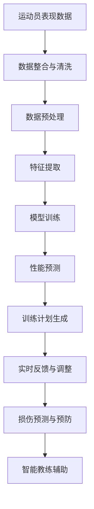

                 

# 聊天机器人体育业：运动员表现分析和训练计划

## 1. 背景介绍

在体育领域，无论是职业运动员还是业余爱好者，训练计划的制定与执行都是提升表现的关键因素。传统上，教练和运动员需要通过长期的经验积累和数据分析来调整训练方案。然而，随着人工智能技术的发展，尤其是大语言模型的应用，使得运动员表现分析与训练计划的制定变得更加智能化和个性化。

### 1.1 问题由来

传统体育训练计划制定存在以下问题：
1. **依赖经验**：训练计划主要依赖教练的经验，受个人经验和认知局限的制约，可能导致训练方法不够科学。
2. **数据获取难**：获取运动员表现数据的成本较高，数据量大且质量参差不齐，影响了分析结果的准确性。
3. **个性化不足**：训练计划缺乏个性化，难以针对每个运动员的特定需求进行调整。
4. **实时性差**：数据分析和反馈存在延迟，难以实时调整训练计划。

### 1.2 问题核心关键点

为了解决上述问题，人工智能特别是大语言模型在体育训练中的应用变得尤为重要。通过大语言模型，可以实现以下目标：
- **数据整合与分析**：整合多源数据，实现全面、精准的数据分析。
- **个性化训练**：根据运动员的个体特征，制定个性化的训练计划。
- **实时反馈与调整**：实时监测运动员的表现，快速反馈并调整训练计划。
- **智能推荐**：结合专家知识库，提供智能化的训练建议。

## 2. 核心概念与联系

### 2.1 核心概念概述

在体育领域，大语言模型可以用于以下几个关键任务：
- **运动员表现分析**：通过分析运动员的历史表现数据，预测未来表现，诊断问题原因。
- **训练计划制定**：根据运动员表现和身体状况，制定个性化的训练计划。
- **损伤预测与预防**：预测运动员的受伤风险，提供预防建议。
- **智能教练辅助**：辅助教练进行训练安排，提高训练效率和效果。

### 2.2 核心概念原理和架构的 Mermaid 流程图



这个流程图展示了从数据整合到训练计划生成，再到实时反馈的全过程。其中：
- **数据整合与清洗**：收集运动员的各项数据，包括训练记录、比赛成绩、身体数据等，并进行数据清洗。
- **数据预处理**：将原始数据转换为模型可处理的格式，如特征工程。
- **特征提取**：从预处理后的数据中提取关键特征，如身体指标、训练强度等。
- **模型训练**：使用大语言模型进行训练，学习运动员表现与训练之间的关系。
- **性能预测**：根据模型训练结果，预测运动员未来的表现。
- **训练计划生成**：根据预测结果和运动员的个性化需求，生成定制化的训练计划。
- **实时反馈与调整**：在训练过程中实时监测运动员表现，调整训练计划。
- **损伤预测与预防**：预测运动员的受伤风险，提供预防建议。
- **智能教练辅助**：辅助教练进行训练安排，提高训练效率和效果。

## 3. 核心算法原理 & 具体操作步骤

### 3.1 算法原理概述

大语言模型在体育业中的应用主要依赖于以下算法原理：
- **序列模型**：使用RNN、LSTM或Transformer等序列模型，处理时间序列数据，如训练强度、比赛成绩等。
- **回归模型**：使用线性回归、随机森林等回归模型，预测运动员未来的表现。
- **分类模型**：使用SVM、决策树等分类模型，进行运动员表现分类，如伤病预测、表现等级等。
- **优化算法**：使用梯度下降、Adam等优化算法，更新模型参数，提升预测准确性。

### 3.2 算法步骤详解

1. **数据收集与预处理**：
   - 收集运动员的各项数据，包括训练记录、比赛成绩、身体数据等。
   - 清洗数据，去除噪声和异常值，确保数据质量。
   - 数据转换，如将日期时间数据转换为时间序列，将文本数据转换为向量。

2. **特征提取与选择**：
   - 从预处理后的数据中提取关键特征，如身体指标、训练强度、比赛成绩等。
   - 特征选择，保留对预测表现影响最大的特征。

3. **模型训练与优化**：
   - 选择适当的模型，如LSTM、Transformer等。
   - 分割数据集，分为训练集、验证集和测试集。
   - 使用梯度下降等优化算法，训练模型，调整超参数，如学习率、批次大小等。
   - 使用正则化技术，防止过拟合。

4. **性能预测与评估**：
   - 使用训练好的模型，对新数据进行预测。
   - 评估模型性能，如MAE、RMSE等指标。
   - 调整模型参数，提升预测准确性。

5. **训练计划生成与调整**：
   - 根据预测结果和运动员的个性化需求，生成定制化的训练计划。
   - 实时监测运动员表现，调整训练计划。

### 3.3 算法优缺点

**优点**：
- **全面性**：能够整合多源数据，进行全面的分析。
- **个性化**：根据运动员的个体特征，制定个性化的训练计划。
- **实时性**：实时监测运动员表现，快速反馈并调整训练计划。

**缺点**：
- **数据依赖**：依赖运动员表现数据的质量和数量，数据获取成本较高。
- **复杂性**：模型训练和优化较为复杂，需要一定的技术储备。
- **解释性不足**：模型预测结果缺乏解释性，难以理解模型内部机制。

### 3.4 算法应用领域

大语言模型在体育业的应用领域广泛，涵盖以下几个方面：
- **体能训练**：根据运动员的身体数据，制定科学的训练计划。
- **技术训练**：分析技术动作，提供改进建议。
- **伤病预防**：预测受伤风险，提供预防措施。
- **心理训练**：分析运动员的心理状态，提供心理辅导。
- **比赛策略**：根据对手表现，制定比赛策略。
- **运动康复**：辅助康复训练，提高康复效果。

## 4. 数学模型和公式 & 详细讲解 & 举例说明

### 4.1 数学模型构建

在体育表现分析中，我们可以构建以下数学模型：
- **回归模型**：预测运动员未来的表现，如运动成绩。
- **分类模型**：对运动员的表现进行分类，如伤病预测。
- **序列模型**：处理时间序列数据，如训练强度、比赛成绩。

### 4.2 公式推导过程

以回归模型为例，假设运动员的表现 $y$ 可以表示为多个特征 $x_1, x_2, ..., x_n$ 的线性组合：
$$
y = \beta_0 + \beta_1x_1 + \beta_2x_2 + ... + \beta_nx_n + \epsilon
$$
其中，$\beta_0$ 为截距，$\beta_1, \beta_2, ..., \beta_n$ 为特征系数，$\epsilon$ 为误差项。

对于数据集 $D=\{(x_i, y_i)\}_{i=1}^N$，最小化损失函数：
$$
\mathcal{L}(\theta) = \frac{1}{N}\sum_{i=1}^N (y_i - \hat{y}_i)^2
$$
其中，$\hat{y}_i = \beta_0 + \beta_1x_{1i} + \beta_2x_{2i} + ... + \beta_nx_{ni}$。

使用梯度下降算法，更新参数 $\theta$：
$$
\theta \leftarrow \theta - \alpha \frac{\partial \mathcal{L}(\theta)}{\partial \theta}
$$
其中，$\alpha$ 为学习率。

### 4.3 案例分析与讲解

假设我们要预测一名篮球运动员的得分 $y$，通过其投篮次数 $x_1$、命中率 $x_2$ 和罚球次数 $x_3$ 进行预测。假设模型为线性回归模型，预测公式为：
$$
y = \beta_0 + \beta_1x_1 + \beta_2x_2 + \beta_3x_3 + \epsilon
$$

收集历史数据 $D=\{(x_{ij}, y_i)\}_{i=1}^N$，其中 $x_{ij}$ 为第 $i$ 个运动员的第 $j$ 个特征值，$y_i$ 为第 $i$ 个运动员的得分。

使用最小二乘法，求解回归系数 $\beta_0, \beta_1, \beta_2, \beta_3$。

## 5. 项目实践：代码实例和详细解释说明

### 5.1 开发环境搭建

开发环境搭建需要以下步骤：
1. 安装Python环境，如Anaconda。
2. 安装必要的库，如Pandas、NumPy、Scikit-learn、TensorFlow等。
3. 配置数据处理和分析环境。

### 5.2 源代码详细实现

以下是一个简单的Python代码示例，用于预测运动员的得分：

```python
import pandas as pd
from sklearn.linear_model import LinearRegression
from sklearn.model_selection import train_test_split

# 读取数据
data = pd.read_csv('athlete_data.csv')

# 特征提取
features = ['投篮次数', '命中率', '罚球次数']
X = data[features]
y = data['得分']

# 数据分割
X_train, X_test, y_train, y_test = train_test_split(X, y, test_size=0.2, random_state=42)

# 模型训练
model = LinearRegression()
model.fit(X_train, y_train)

# 模型评估
y_pred = model.predict(X_test)
print('模型评估指标：', model.score(X_test, y_test))

# 训练计划生成
# 根据预测结果和运动员需求，生成训练计划
```

### 5.3 代码解读与分析

上述代码中，首先读取运动员数据，并进行特征提取。然后使用线性回归模型进行训练，并评估模型性能。最后，根据预测结果生成训练计划。

代码实现中，使用了Pandas库进行数据处理，Scikit-learn库进行模型训练和评估，TensorFlow等库可以用于模型部署和实时预测。

## 6. 实际应用场景

### 6.4 未来应用展望

大语言模型在体育业的应用前景广阔，未来可能的发展方向包括：
- **多模态数据融合**：结合视频、语音等多模态数据，提供更全面的运动员表现分析。
- **实时智能反馈**：实时监测运动员表现，提供即时反馈和调整建议。
- **个性化训练方案**：结合机器学习与专家知识库，提供个性化的训练方案。
- **训练效果评估**：通过实时数据监测，评估训练效果，优化训练计划。
- **智能教练系统**：构建智能教练系统，辅助教练进行训练安排和决策。

## 7. 工具和资源推荐

### 7.1 学习资源推荐

- **《Python数据科学手册》**：详细介绍Python在数据分析、机器学习中的应用。
- **《深度学习》**：涵盖深度学习的基本概念和算法。
- **Kaggle**：提供丰富的数据集和竞赛平台，有助于学习数据处理和模型训练。
- **Coursera、edX**：提供各类在线课程，涵盖机器学习、深度学习、体育科学等。

### 7.2 开发工具推荐

- **Jupyter Notebook**：方便编写和运行Python代码，支持代码块、注释等。
- **TensorFlow**：强大的深度学习框架，支持分布式计算和模型部署。
- **PyTorch**：灵活的深度学习框架，支持动态计算图。
- **TensorBoard**：可视化工具，实时监测模型训练状态。

### 7.3 相关论文推荐

- **"Deep Learning for Sports Performance Analysis and Coaching Support"**：深度学习在体育表现分析和教练辅助中的应用。
- **"Personalized Training Plan Generation Using Machine Learning"**：基于机器学习的个性化训练计划生成方法。
- **"Sports Performance Analytics and Predictive Modeling"**：体育表现分析和预测建模的研究进展。

## 8. 总结：未来发展趋势与挑战

### 8.1 研究成果总结

本文介绍了大语言模型在体育业中的应用，涵盖数据整合、特征提取、模型训练、性能预测、训练计划生成等多个环节。通过深入分析运动员表现数据，制定科学的训练计划，实现个性化训练和实时反馈。

### 8.2 未来发展趋势

未来，大语言模型在体育业的应用将更加智能化和高效化，可能的发展趋势包括：
- **多模态融合**：结合多源数据，提供更全面的表现分析。
- **实时反馈**：实时监测和反馈，提高训练效果。
- **个性化训练**：结合专家知识库，提供个性化的训练方案。
- **智能教练**：构建智能教练系统，辅助教练决策。

### 8.3 面临的挑战

大语言模型在体育业应用中仍面临以下挑战：
- **数据获取难**：高质量数据获取成本较高。
- **模型复杂性**：训练和优化过程较为复杂。
- **解释性不足**：模型预测结果缺乏解释性。
- **实时性要求高**：实时监测和反馈需要高效计算资源。

### 8.4 研究展望

未来的研究需要关注以下几个方向：
- **数据获取**：提高数据获取效率，降低数据获取成本。
- **模型优化**：优化模型训练和优化算法，提高预测精度。
- **解释性**：提升模型的可解释性，增强教练和运动员的信任。
- **实时性**：优化实时数据处理和反馈机制，提高系统响应速度。

## 9. 附录：常见问题与解答

**Q1：大语言模型在体育业有哪些应用场景？**

A: 大语言模型在体育业的应用场景包括：
- 运动员表现分析：通过数据分析，预测运动员未来表现，诊断问题原因。
- 训练计划制定：根据运动员表现和身体状况，制定个性化的训练计划。
- 伤病预测与预防：预测运动员的受伤风险，提供预防措施。
- 智能教练辅助：辅助教练进行训练安排，提高训练效率和效果。

**Q2：如何评估大语言模型的性能？**

A: 大语言模型的性能可以通过以下指标评估：
- 均方误差（MAE）：预测值与真实值之间的平均差距。
- 均方根误差（RMSE）：预测值与真实值之间的标准差。
- 准确率（Accuracy）：正确预测的样本比例。
- 召回率（Recall）：实际正样本中被正确预测为正样本的比例。
- F1得分：准确率和召回率的调和平均值。

**Q3：数据预处理需要注意哪些方面？**

A: 数据预处理需要注意以下方面：
- 数据清洗：去除噪声和异常值，确保数据质量。
- 数据转换：将数据转换为模型可处理的格式，如时间序列数据、文本数据。
- 特征工程：提取关键特征，去除冗余特征，保留对预测表现影响最大的特征。

**Q4：大语言模型在训练过程中如何避免过拟合？**

A: 大语言模型在训练过程中可以采用以下方法避免过拟合：
- 数据增强：通过回译、近义替换等方式扩充训练集。
- 正则化：使用L2正则、Dropout等技术。
- 早停机制：在验证集上监测模型性能，早停训练。
- 模型裁剪：去除不必要的层和参数，减小模型尺寸。
- 混合精度训练：使用浮点型和定点型混合计算，提高计算效率。

**Q5：训练计划生成的关键因素有哪些？**

A: 训练计划生成的关键因素包括：
- 运动员个体特征：如身体状况、技术水平、心理状态等。
- 历史表现数据：包括训练强度、比赛成绩等。
- 目标任务：如体能训练、技术训练、心理训练等。
- 专家知识库：提供训练建议和指导。
- 实时反馈：根据实时表现数据调整训练计划。

---

作者：禅与计算机程序设计艺术 / Zen and the Art of Computer Programming

