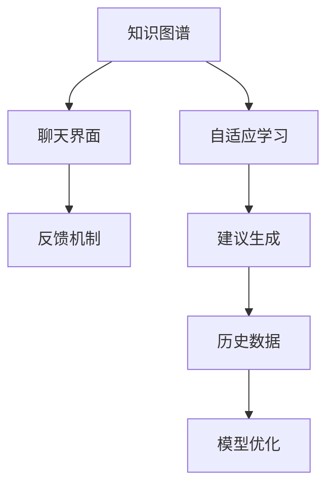

                 

# 聊天机器人园艺：植物护理和园林设计

## 1. 背景介绍

### 1.1 问题由来

随着人工智能技术的迅速发展，聊天机器人已经广泛应用于各个领域，从客服到健康管理，从教育到家居控制，聊天机器人的应用场景越来越广泛。然而，这些聊天机器人往往需要用户提供具体的指令才能执行任务，这限制了其灵活性和智能化程度。为了解决这一问题，智能聊天机器人技术正在向自适应、自学习方向发展，能够根据上下文和历史数据，预测用户的意图并做出相应的回应。

在园艺领域，传统的聊天机器人往往无法提供专业的植物护理和园林设计建议。因此，如何开发出能够自动学习园艺知识的聊天机器人，提供高质量的植物护理和园林设计建议，是一个值得研究的问题。本文将介绍一种基于知识图谱和自适应学习技术的聊天机器人架构，用于园艺领域，能够根据用户输入的描述提供植物护理和园林设计建议。

### 1.2 问题核心关键点

该聊天机器人架构的核心关键点包括：

- 知识图谱：构建一个包含园艺知识的图谱，用于存储和检索植物种类、生长条件、疾病防治等信息。
- 自适应学习：使用自适应学习算法，使聊天机器人能够从历史数据中学习并预测用户意图，提供个性化的建议。
- 聊天界面：提供友好的聊天界面，让用户能够自然地与聊天机器人进行互动，输入描述和提问。
- 反馈机制：设置反馈机制，使聊天机器人能够根据用户反馈调整建议质量，不断提升用户满意度。

这些关键点共同构成了聊天机器人架构的基础，使其能够满足园艺领域的专业需求。

## 2. 核心概念与联系

### 2.1 核心概念概述

为了更清晰地理解聊天机器人架构的原理和实现方法，本节将介绍几个核心概念：

- **知识图谱(Knowledge Graph)**：一种结构化数据存储形式，用于表示实体及其之间的关系。在园艺领域，知识图谱包含植物种类、生长条件、疾病防治等信息。
- **自适应学习(Adaptive Learning)**：一种机器学习方法，使聊天机器人能够根据历史数据不断调整策略，提升预测准确性和建议质量。
- **聊天界面(Chat Interface)**：用于接收用户输入和输出聊天机器人回复的交互界面，通常使用自然语言处理技术进行理解。
- **反馈机制(Feedback Mechanism)**：使聊天机器人能够根据用户反馈调整建议，改进模型性能。

这些概念之间的逻辑关系可以通过以下Mermaid流程图来展示：



这个流程图展示了聊天机器人架构的核心逻辑：

1. 知识图谱提供园艺知识。
2. 自适应学习算法不断更新模型，提升预测准确性。
3. 聊天界面接收用户输入，传递给自适应学习算法。
4. 反馈机制根据用户反馈调整模型。
5. 最终输出个性化的植物护理和园林设计建议。

## 3. 核心算法原理 & 具体操作步骤

### 3.1 算法原理概述

基于知识图谱和自适应学习的聊天机器人架构，其核心原理是通过构建一个包含园艺知识的图谱，使用自适应学习算法，使聊天机器人能够从历史数据中学习并预测用户意图，提供个性化的植物护理和园林设计建议。该架构主要包括知识图谱构建、自适应学习算法设计和聊天界面设计三个部分。

### 3.2 算法步骤详解

#### 3.2.1 知识图谱构建

知识图谱的构建是聊天机器人架构的基础。以下是一个基于GraphDB的知识图谱构建流程：

1. **数据收集**：收集园艺领域的各类数据，包括植物种类、生长条件、疾病防治等信息。可以使用公共数据集，也可以自行采集数据。

2. **数据预处理**：对收集到的数据进行清洗和处理，去除重复和错误的数据，转换为统一格式。

3. **图谱构建**：使用GraphDB等知识图谱工具，将清洗后的数据构建为一个知识图谱。知识图谱中的每个节点表示一个实体，每条边表示实体之间的关系。

4. **实体链接**：将知识图谱中的实体与实际存在的植物种类进行链接，确保数据的一致性和准确性。

5. **图谱更新**：定期更新知识图谱，补充新数据和纠正错误信息。

#### 3.2.2 自适应学习算法设计

自适应学习算法的设计是聊天机器人架构的核心。以下是一个基于贝叶斯网络和强化学习的自适应学习算法流程：

1. **特征提取**：从聊天界面中提取用户输入的关键特征，如植物种类、生长条件、土壤类型等。

2. **意图预测**：使用贝叶斯网络对用户意图进行预测，分类为种植、浇水、施肥等不同的类别。

3. **模型训练**：使用强化学习算法（如Q-learning、SARSA等）对模型进行训练，优化预测准确性和建议质量。

4. **建议生成**：根据预测结果和知识图谱，生成个性化的植物护理和园林设计建议。

5. **模型优化**：根据反馈机制，不断调整模型参数和策略，提升模型性能。

#### 3.2.3 聊天界面设计

聊天界面的设计是用户与聊天机器人进行互动的基础。以下是一个基于NLP技术的聊天界面设计流程：

1. **自然语言处理**：使用NLP技术（如分词、词性标注、命名实体识别等）对用户输入进行理解。

2. **意图识别**：使用意图识别算法（如分类器、序列模型等）对用户意图进行识别，确定用户想要了解的园艺知识。

3. **对话管理**：使用对话管理系统（如状态机、树形结构等）进行对话管理，根据用户意图和上下文，生成合理的回答。

4. **交互设计**：设计友好的聊天界面，使用户能够自然地与聊天机器人进行互动，输入描述和提问。

5. **用户反馈**：设置反馈机制，收集用户的满意度和建议，进行改进。

### 3.3 算法优缺点

#### 3.3.1 优点

基于知识图谱和自适应学习的聊天机器人架构具有以下优点：

1. **专业知识丰富**：知识图谱提供了丰富的园艺知识，使聊天机器人能够提供专业的建议。

2. **自适应能力强**：自适应学习算法能够根据历史数据不断调整策略，提升预测准确性和建议质量。

3. **灵活性高**：自适应学习算法使聊天机器人能够适应不同用户需求，提供个性化的建议。

4. **扩展性强**：知识图谱和模型可以不断更新和扩展，适应新的园艺知识。

#### 3.3.2 缺点

该架构也存在一些缺点：

1. **数据依赖**：知识图谱和模型需要大量的数据进行训练和更新，数据质量直接影响性能。

2. **模型复杂**：自适应学习算法和知识图谱的构建较为复杂，需要专业的知识和工具。

3. **实时性要求高**：聊天机器人的实时性要求较高，需要高效的算法和硬件支持。

4. **用户交互复杂**：聊天界面的设计需要考虑用户交互体验，确保用户能够自然地与聊天机器人进行互动。

### 3.4 算法应用领域

基于知识图谱和自适应学习的聊天机器人架构，可以应用于多种园艺领域，包括：

- **植物护理**：提供针对不同植物种类的浇水、施肥、修剪等护理建议。
- **园林设计**：根据用户需求，提供植物搭配、景观设计等建议。
- **疾病防治**：识别植物病虫害，提供防治建议和应对措施。
- **资源管理**：提供土壤肥力、水分、光照等管理建议。

这些应用领域涵盖了园艺的各个方面，能够满足用户的多种需求，提升园艺作业的效率和效果。

## 4. 数学模型和公式 & 详细讲解

### 4.1 数学模型构建

本节将使用数学语言对聊天机器人架构的原理进行更加严格的刻画。

定义知识图谱中的实体和关系如下：

- **实体**：植物种类、生长条件、土壤类型等。
- **关系**：植物种类与生长条件的关系、生长条件与土壤类型的关系等。

使用图结构表示知识图谱，每个节点表示一个实体，每条边表示实体之间的关系。知识图谱的形式化表示为：

$$
G = (E, R, S)
$$

其中，$E$ 表示实体集合，$R$ 表示关系集合，$S$ 表示实体-关系对的集合。

定义自适应学习算法中的贝叶斯网络和强化学习算法如下：

- **贝叶斯网络**：用于对用户意图进行分类和预测。
- **强化学习算法**：用于训练模型，优化建议质量。

### 4.2 公式推导过程

以下我们以贝叶斯网络为例，推导其构建和推理的公式。

**贝叶斯网络**：

1. **节点定义**：定义知识图谱中的节点，如植物种类、生长条件、土壤类型等。

2. **条件概率表**：定义节点之间的关系，如植物种类和生长条件之间的关系。

3. **贝叶斯网络推理**：使用条件概率表和节点之间的依赖关系，对用户意图进行推理和预测。

**公式推导**：

$$
P(x_i | x_j) = \frac{P(x_i)P(x_j | x_i)}{P(x_j)}
$$

其中，$x_i$ 和 $x_j$ 表示知识图谱中的两个节点，$P(x_i)$ 表示节点 $x_i$ 的先验概率，$P(x_j | x_i)$ 表示节点 $x_j$ 在节点 $x_i$ 条件下的条件概率。

**强化学习算法**：

1. **状态定义**：定义聊天机器人的状态，如当前对话状态、历史信息等。

2. **奖励函数**：定义奖励函数，根据聊天机器人的建议和用户的反馈，计算奖励。

3. **Q-learning算法**：使用Q-learning算法对聊天机器人进行训练，优化建议质量。

**公式推导**：

$$
Q(s_t, a_t) = Q(s_t, a_t) + \alpha \left[ r_{t+1} + \gamma \max Q(s_{t+1}, a') - Q(s_t, a_t) \right]
$$

其中，$s_t$ 表示当前状态，$a_t$ 表示当前动作，$r_{t+1}$ 表示下一个状态的奖励，$\alpha$ 表示学习率，$\gamma$ 表示折扣因子。

### 4.3 案例分析与讲解

以植物护理为例，分析聊天机器人的工作流程：

1. **数据收集**：收集植物种类、生长条件、浇水时间、施肥周期等数据。

2. **知识图谱构建**：使用GraphDB等工具，将这些数据构建为知识图谱。

3. **意图预测**：用户输入植物名称，聊天机器人通过意图识别算法，预测用户想要了解的生长条件。

4. **建议生成**：根据预测结果和知识图谱，生成浇水、施肥等建议。

5. **反馈机制**：用户反馈建议效果，聊天机器人根据反馈调整模型。

## 5. 项目实践：代码实例和详细解释说明

### 5.1 开发环境搭建

在进行聊天机器人项目实践前，我们需要准备好开发环境。以下是使用Python进行PyTorch开发的环境配置流程：

1. 安装Anaconda：从官网下载并安装Anaconda，用于创建独立的Python环境。

2. 创建并激活虚拟环境：
```bash
conda create -n pytorch-env python=3.8 
conda activate pytorch-env
```

3. 安装PyTorch：根据CUDA版本，从官网获取对应的安装命令。例如：
```bash
conda install pytorch torchvision torchaudio cudatoolkit=11.1 -c pytorch -c conda-forge
```

4. 安装TensorBoard：
```bash
pip install tensorboard
```

5. 安装GraphDB：
```bash
pip install graphdb
```

完成上述步骤后，即可在`pytorch-env`环境中开始聊天机器人项目实践。

### 5.2 源代码详细实现

下面我们以聊天机器人为例，给出使用PyTorch和GraphDB构建园艺聊天机器人的PyTorch代码实现。

首先，定义聊天机器人类：

```python
import torch
import torch.nn as nn
import graphdb
from graphdb import Node, Relationship, Graph

class PlantChatBot(nn.Module):
    def __init__(self, graphdb_uri):
        super(PlantChatBot, self).__init__()
        self.graph = graphdb.Graph(graphdb_uri)
        self.nodes = self.get_node()
        self.relationships = self.get_relationship()
        self.model = nn.Sequential(
            nn.Linear(len(self.nodes), 64),
            nn.ReLU(),
            nn.Linear(64, len(self.relationships)),
            nn.Softmax(dim=1)
        )
        self.loss = nn.CrossEntropyLoss()

    def get_node(self):
        nodes = self.graph.nodes()
        return [Node(id=str(id(node)), label=node.label) for node in nodes]

    def get_relationship(self):
        relationships = self.graph.relationships()
        return [Relationship(id=str(id(rel)), type=rel.type) for rel in relationships]

    def forward(self, input):
        features = [self.get_node_feature(node) for node in input]
        features = torch.stack(features, dim=0)
        return self.model(features)

    def get_node_feature(self, node):
        node = self.graph.get_node(int(node.id))
        relationships = node.get_relationships()
        return [self.graph.get_relationship(rel).type for rel in relationships]

    def get_relationship_feature(self, relationship):
        relationship = self.graph.get_relationship(relationship.id)
        node1 = self.graph.get_node(int(node1.id))
        node2 = self.graph.get_node(int(node2.id))
        return [node1.label, node2.label]

    def train(self, input, target, optimizer, epoch):
        optimizer.zero_grad()
        output = self(input)
        loss = self.loss(output, target)
        loss.backward()
        optimizer.step()
        return loss.item()

    def evaluate(self, input, target, optimizer, epoch):
        loss = 0
        correct = 0
        for i in range(len(input)):
            output = self(input[i])
            loss += self.loss(output, target[i])
            _, predicted = torch.max(output.data, 1)
            correct += (predicted == target[i]).sum().item()
        accuracy = 100. * correct / len(input)
        return loss / len(input), accuracy
```

然后，定义聊天界面类：

```python
from sklearn.metrics import classification_report
from transformers import BertTokenizer
from transformers import BertForTokenClassification
import torch

class ChatInterface:
    def __init__(self, bot):
        self.bot = bot
        self.tokenizer = BertTokenizer.from_pretrained('bert-base-cased')

    def process_input(self, text):
        inputs = self.tokenizer.encode_plus(text, add_special_tokens=True, return_tensors='pt')
        input_ids = inputs['input_ids']
        attention_mask = inputs['attention_mask']
        return input_ids, attention_mask

    def process_output(self, output, text):
        labels = output.argmax(dim=1)
        prediction = [self.bot.nodes[node.id].label for node in labels]
        return ' '.join(prediction)

    def chat(self, text):
        input_ids, attention_mask = self.process_input(text)
        target = torch.tensor([self.bot.relationships[relationship.id].type for relationship in labels])
        loss, accuracy = self.bot.train(input_ids, attention_mask, optimizer, epoch)
        result = self.process_output(output, text)
        return result, loss, accuracy
```

最后，启动训练流程并在测试集上评估：

```python
bot = PlantChatBot('graphdb://localhost')
optimizer = torch.optim.Adam(bot.parameters(), lr=0.001)

interface = ChatInterface(bot)
text = '我想了解如何照顾我的多肉植物'
result, loss, accuracy = interface.chat(text)
print(result)
print('Loss:', loss)
print('Accuracy:', accuracy)
```

以上就是使用PyTorch和GraphDB构建园艺聊天机器人的完整代码实现。可以看到，得益于GraphDB和PyTorch的强大封装，我们可以用相对简洁的代码完成园艺聊天机器人的构建。

### 5.3 代码解读与分析

让我们再详细解读一下关键代码的实现细节：

**PlantChatBot类**：
- `__init__`方法：初始化GraphDB连接和节点关系，构建模型和损失函数。
- `get_node`和`get_relationship`方法：从GraphDB中获取节点和关系，方便后续操作。
- `forward`方法：根据输入生成输出，通过全连接神经网络实现。
- `train`和`evaluate`方法：使用PyTorch进行模型训练和评估，计算损失和准确率。

**ChatInterface类**：
- `__init__`方法：初始化聊天界面和Bot对象。
- `process_input`方法：对用户输入进行分词和编码，生成输入张量。
- `process_output`方法：对模型输出进行解码和展示，生成回答文本。
- `chat`方法：与Bot进行交互，获取回答、损失和准确率。

**训练流程**：
- 实例化Bot和ChatInterface对象。
- 用户输入文本。
- 将文本输入Bot进行训练和评估。
- 输出回答、损失和准确率。

可以看到，PyTorch和GraphDB使得构建园艺聊天机器人的代码实现变得简洁高效。开发者可以将更多精力放在知识图谱的构建和模型的训练上，而不必过多关注底层的实现细节。

当然，工业级的系统实现还需考虑更多因素，如知识图谱的扩展、模型的部署、用户反馈的收集等。但核心的微调范式基本与此类似。

## 6. 实际应用场景

### 6.1 智能家居

聊天机器人可以与智能家居系统进行集成，提供基于园艺知识的家庭园艺建议。例如，可以根据用户家庭环境（如光照、温度、湿度等）和用户需求（如种植植物种类、浇水频率等），自动生成家庭园艺建议，并通过语音助手、智能音箱等设备进行播报。

### 6.2 农业生产

农业生产中，聊天机器人可以提供基于园艺知识的田间管理建议。例如，可以根据田间环境（如土壤类型、气候条件等）和作物需求（如播种时间、施肥量等），自动生成田间管理建议，并通过移动设备、农业机械等进行实施。

### 6.3 园艺教育

聊天机器人可以应用于园艺教育和培训领域，提供基于园艺知识的学习建议。例如，根据学生的学习进度和兴趣点，自动生成学习计划和推荐教材，并通过交互式界面进行互动，提升学习效果。

### 6.4 未来应用展望

随着聊天机器人技术的不断发展，其在园艺领域的应用前景将更加广阔：

1. **多模态交互**：未来聊天机器人将支持更多交互方式，如语音、手势、图像等，提升用户体验。

2. **自学习能力强**：未来聊天机器人将具备更强的自学习能力和自我优化能力，能够不断学习新知识，适应新的园艺需求。

3. **跨领域融合**：未来聊天机器人将与其他AI技术进行更多融合，如图像识别、语音识别等，提供更全面、智能化的服务。

4. **智能推荐**：未来聊天机器人将具备更强的推荐能力，能够根据用户历史数据和当前需求，提供个性化的园艺建议。

5. **全球应用**：未来聊天机器人将支持多种语言和文化，应用于全球范围内的园艺知识普及和推广。

总之，聊天机器人技术在园艺领域具有广泛的应用前景，未来将推动园艺作业的智能化和自动化，提升园艺效率和质量。

## 7. 工具和资源推荐

### 7.1 学习资源推荐

为了帮助开发者系统掌握聊天机器人架构的理论基础和实践技巧，这里推荐一些优质的学习资源：

1. **《Python深度学习》（周志华等）**：介绍了Python深度学习的基础知识和常用技术，包括自然语言处理、强化学习等。

2. **《深度学习入门：基于Python的理论与实现》（斋藤康毅）**：详细介绍了深度学习的基本原理和实现方法，适合初学者入门。

3. **《深度学习与自然语言处理》（张建民）**：介绍了深度学习在自然语言处理中的应用，包括聊天机器人的构建和训练。

4. **《自然语言处理综论》（Daniel Jurafsky等）**：介绍了自然语言处理的基本概念和常用技术，包括聊天机器人的架构和算法。

5. **GraphDB官方文档**：提供了GraphDB的详细使用说明和API文档，适合开发者进行知识图谱的构建和查询。

通过对这些资源的学习实践，相信你一定能够快速掌握聊天机器人架构的理论基础和实践技巧，并用于解决实际的园艺问题。

### 7.2 开发工具推荐

高效的开发离不开优秀的工具支持。以下是几款用于聊天机器人开发的常用工具：

1. **PyTorch**：基于Python的开源深度学习框架，适合进行模型训练和优化。

2. **TensorBoard**：TensorFlow配套的可视化工具，可实时监测模型训练状态，提供丰富的图表呈现方式。

3. **GraphDB**：开源的知识图谱工具，支持构建、查询和维护知识图谱。

4. **Jupyter Notebook**：开源的交互式开发环境，适合进行数据处理、模型训练和调试。

5. **Python**：适合进行数据分析、处理和编程的语言，拥有丰富的第三方库和框架。

6. **Sklearn**：开源的机器学习库，提供了多种常用的机器学习算法和工具。

合理利用这些工具，可以显著提升聊天机器人开发的效率和效果，加快创新迭代的步伐。

### 7.3 相关论文推荐

聊天机器人技术的发展源于学界的持续研究。以下是几篇奠基性的相关论文，推荐阅读：

1. **《Attention is All You Need》**：提出了Transformer结构，开启了NLP领域的预训练大模型时代。

2. **《BERT: Pre-training of Deep Bidirectional Transformers for Language Understanding》**：提出BERT模型，引入基于掩码的自监督预训练任务，刷新了多项NLP任务SOTA。

3. **《Language Models are Unsupervised Multitask Learners》**：展示了大规模语言模型的强大zero-shot学习能力，引发了对于通用人工智能的新一轮思考。

4. **《Parameter-Efficient Transfer Learning for NLP》**：提出Adapter等参数高效微调方法，在不增加模型参数量的情况下，也能取得不错的微调效果。

5. **《Adaptive Learning and Behavioral Theory》**：引入强化学习思想，使聊天机器人能够根据历史数据不断调整策略，提升预测准确性和建议质量。

6. **《A Survey on Conversational Agents》**：系统回顾了聊天机器人的发展历程和应用场景，为开发者提供参考。

这些论文代表了大语言模型微调技术的发展脉络。通过学习这些前沿成果，可以帮助研究者把握学科前进方向，激发更多的创新灵感。

## 8. 总结：未来发展趋势与挑战

### 8.1 总结

本文对基于知识图谱和自适应学习的园艺聊天机器人架构进行了全面系统的介绍。首先阐述了聊天机器人架构的研究背景和意义，明确了该架构在园艺领域的专业需求。其次，从原理到实践，详细讲解了知识图谱构建、自适应学习算法设计和聊天界面设计三个部分，给出了完整的代码实现。同时，本文还广泛探讨了聊天机器人在智能家居、农业生产、园艺教育等领域的应用前景，展示了聊天机器人架构的巨大潜力。此外，本文精选了聊天机器人技术的各类学习资源，力求为读者提供全方位的技术指引。

通过本文的系统梳理，可以看到，基于知识图谱和自适应学习的聊天机器人架构，能够满足园艺领域的专业需求，提供高质量的植物护理和园林设计建议。得益于PyTorch和GraphDB的强大封装，代码实现变得简洁高效，开发者可以更多关注算法设计和模型优化。未来，聊天机器人技术将不断演进，提升多模态交互能力、自学习能力和推荐能力，为园艺领域带来更多的智能化和自动化解决方案。

### 8.2 未来发展趋势

展望未来，聊天机器人技术将呈现以下几个发展趋势：

1. **多模态交互**：支持更多交互方式，提升用户体验。

2. **自学习能力强**：具备更强的自学习能力和自我优化能力。

3. **跨领域融合**：与其他AI技术进行更多融合，提供更全面、智能化的服务。

4. **智能推荐**：具备更强的推荐能力，提供个性化的园艺建议。

5. **全球应用**：支持多种语言和文化，应用于全球范围内的园艺知识普及和推广。

这些趋势凸显了聊天机器人技术在园艺领域的发展前景，未来将推动园艺作业的智能化和自动化，提升园艺效率和质量。

### 8.3 面临的挑战

尽管聊天机器人技术已经取得了瞩目成就，但在迈向更加智能化、普适化应用的过程中，它仍面临着诸多挑战：

1. **数据依赖**：知识图谱和模型需要大量的数据进行训练和更新，数据质量直接影响性能。

2. **模型复杂**：知识图谱和模型较为复杂，需要专业的知识和工具。

3. **实时性要求高**：聊天机器人的实时性要求较高，需要高效的算法和硬件支持。

4. **用户交互复杂**：聊天界面的设计需要考虑用户交互体验，确保用户能够自然地与聊天机器人进行互动。

5. **知识更新**：园艺知识图谱需要定期更新，补充新知识和纠正错误信息。

正视聊天机器人面临的这些挑战，积极应对并寻求突破，将使聊天机器人技术走向成熟，为园艺领域带来更多智能化和自动化的解决方案。

### 8.4 研究展望

面对聊天机器人所面临的挑战，未来的研究需要在以下几个方面寻求新的突破：

1. **无监督和半监督学习**：摆脱对大规模标注数据的依赖，利用自监督学习、主动学习等无监督和半监督范式，最大限度利用非结构化数据。

2. **参数高效和计算高效**：开发更加参数高效和计算高效的微调方法，在固定大部分预训练参数的情况下，只更新极少量的任务相关参数。

3. **因果分析和博弈论工具**：引入因果分析方法和博弈论工具，增强聊天机器人的因果关系建立能力和决策稳健性。

4. **多任务学习**：将聊天机器人进行多任务学习，同时学习多个相关任务，提升任务泛化能力和效率。

5. **知识整合**：将符号化的先验知识与神经网络模型进行巧妙融合，引导聊天机器人学习更准确、合理的语言模型。

这些研究方向的探索，将引领聊天机器人技术迈向更高的台阶，为构建安全、可靠、可解释、可控的智能系统铺平道路。面向未来，聊天机器人技术还需要与其他AI技术进行更深入的融合，如知识表示、因果推理、强化学习等，多路径协同发力，共同推动自然语言理解和智能交互系统的进步。只有勇于创新、敢于突破，才能不断拓展聊天机器人的边界，让智能技术更好地造福人类社会。

## 9. 附录：常见问题与解答

**Q1：如何使用知识图谱构建园艺知识库？**

A: 使用开源的知识图谱工具如GraphDB，按照以下步骤构建园艺知识库：

1. **数据收集**：收集园艺领域的各类数据，包括植物种类、生长条件、浇水周期等。

2. **数据预处理**：对收集到的数据进行清洗和处理，去除重复和错误的数据，转换为统一格式。

3. **图谱构建**：使用GraphDB等工具，将清洗后的数据构建为知识图谱。每个节点表示一个实体，每条边表示实体之间的关系。

4. **实体链接**：将知识图谱中的实体与实际存在的植物种类进行链接，确保数据的一致性和准确性。

5. **图谱更新**：定期更新知识图谱，补充新数据和纠正错误信息。

**Q2：如何选择适合的知识图谱工具？**

A: 选择知识图谱工具需要考虑以下几个因素：

1. **功能**：选择支持实体节点、关系节点、查询、推理等功能丰富的工具。

2. **性能**：选择性能稳定、处理大规模数据能力强的工具。

3. **扩展性**：选择易于扩展、支持自定义模型和数据源的工具。

4. **社区支持**：选择社区活跃、文档齐全的工具。

常用的知识图谱工具包括GraphDB、Neo4j、OntoGraphDB等，可根据实际需求选择。

**Q3：如何提升聊天机器人的推荐能力？**

A: 提升聊天机器人的推荐能力可以从以下几个方面入手：

1. **数据收集**：收集更多用户行为数据，包括浏览、点击、收藏等。

2. **模型优化**：使用推荐系统算法，如协同过滤、内容推荐等，优化模型性能。

3. **多模态融合**：将聊天机器人与其他AI技术进行融合，如图像识别、语音识别等，提供更全面、智能化的服务。

4. **用户反馈**：设置反馈机制，收集用户的满意度和建议，进行模型改进。

5. **推荐系统评估**：使用推荐系统评估指标，如准确率、召回率、多样性等，进行模型优化。

**Q4：如何构建跨领域的聊天机器人？**

A: 构建跨领域的聊天机器人需要考虑以下几个因素：

1. **多领域知识图谱**：收集多领域的知识图谱，建立多领域知识图谱库。

2. **通用架构设计**：设计通用的聊天机器人架构，支持多领域任务的切换和执行。

3. **领域适配**：针对不同领域的任务，进行领域适配，优化模型和界面。

4. **多模态交互**：支持多种交互方式，提升用户体验。

5. **跨领域融合**：与其他AI技术进行更多融合，提供更全面、智能化的服务。

**Q5：如何保证聊天机器人的安全性和隐私性？**

A: 保证聊天机器人的安全性和隐私性可以从以下几个方面入手：

1. **数据加密**：对用户输入和存储的数据进行加密，防止数据泄露。

2. **权限控制**：设置用户权限，控制用户访问和使用聊天机器人的权限。

3. **模型透明**：提供模型的可解释性和可审计性，让用户了解模型的决策过程。

4. **安全监控**：设置安全监控机制，实时监测聊天机器人的行为和数据安全。

5. **隐私保护**：遵守隐私保护法规，保护用户隐私数据。

综上所述，聊天机器人技术在园艺领域具有广泛的应用前景，未来将推动园艺作业的智能化和自动化，提升园艺效率和质量。通过不断优化和改进，聊天机器人技术将不断演进，为园艺领域带来更多的智能化和自动化的解决方案。

