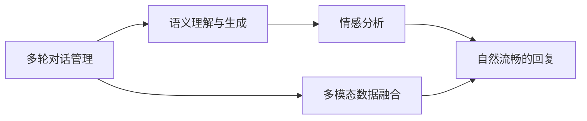

                 

# 聊天机器人开发：对话AI 入门

> 关键词：
> - 对话AI
> - 聊天机器人
> - 自然语言处理(NLP)
> - 深度学习
> - 强化学习
> - 多轮对话管理
> - 语义理解与生成

## 1. 背景介绍

### 1.1 问题由来

随着人工智能技术的不断进步，聊天机器人在各行各业的应用越来越广泛。从简单的客服对话，到复杂的心理咨询，再到智能家居控制，聊天机器人正在逐步渗透到人们日常生活的方方面面。然而，尽管聊天机器人已经在很多场景中得到了应用，但仍面临诸多技术挑战，如理解自然语言的意图、保持对话连贯、处理多样化的对话风格等。本文将深入探讨聊天机器人开发的原理与技术，帮助你快速入门对话AI的开发。

### 1.2 问题核心关键点

聊天机器人的开发涉及多轮对话管理、语义理解与生成、情感分析、多模态数据融合等多个核心问题。如何构建一个可扩展、可维护、且能够有效处理复杂对话的聊天机器人，是当前NLP领域的一大难题。

## 2. 核心概念与联系

### 2.1 核心概念概述

聊天机器人是一种能够模拟人类对话的智能系统。通过自然语言处理(NLP)技术和深度学习技术，聊天机器人能够理解用户输入，并根据上下文生成合适的回复。其中，核心概念包括：

- **多轮对话管理**：通过构建对话状态追踪机制，保证机器人能够理解并记住对话的上下文信息。
- **语义理解与生成**：利用自然语言处理技术，理解用户的意图，并生成自然流畅的回复。
- **情感分析**：通过分析用户的语言、语调等特征，理解用户的情绪，并在对话中做出相应的情感反馈。
- **多模态数据融合**：结合语音、图像、视频等多模态数据，提升对话体验。

这些核心概念之间的联系如图1所示：



## 3. 核心算法原理 & 具体操作步骤

### 3.1 算法原理概述

聊天机器人的开发过程通常包括以下几个步骤：

1. 收集数据：从用户对话中收集数据，并标注相应的意图和实体。
2. 预训练模型：使用预训练的语言模型（如BERT、GPT等）作为对话生成模型的初始化参数。
3. 微调模型：在收集到的对话数据上进行微调，使其能够根据上下文生成自然流畅的回复。
4. 多轮对话管理：实现对话状态的追踪，保证对话连贯性。
5. 情感分析：通过分析用户的情感特征，做出相应的情感反馈。
6. 多模态融合：结合语音、图像、视频等多模态数据，提升对话体验。

### 3.2 算法步骤详解

#### 3.2.1 数据收集与预处理

1. 数据收集：收集用户与聊天机器人之间的对话数据，标注对话中的意图和实体。

2. 数据预处理：清洗对话数据，去除噪声和无关信息，将对话转换为机器可理解的格式。

#### 3.2.2 预训练模型选择与微调

1. 选择预训练模型：根据任务的复杂程度，选择适合的预训练模型（如BERT、GPT等）作为初始化参数。

2. 微调模型：使用收集到的对话数据，对预训练模型进行微调，使其能够根据上下文生成自然流畅的回复。

#### 3.2.3 多轮对话管理

1. 对话状态追踪：记录对话中的上下文信息，如用户之前的输入、机器人之前的回复等。

2. 对话上下文管理：根据对话状态，选择合适的回复，保证对话连贯性。

#### 3.2.4 情感分析

1. 情感识别：分析用户的语言、语调等特征，识别用户的情感状态。

2. 情感反馈：根据用户的情感状态，生成相应的回复，做出情感反馈。

#### 3.2.5 多模态数据融合

1. 语音识别：通过语音识别技术，将用户的语音输入转换为文本。

2. 图像识别：通过图像识别技术，识别用户输入中的图像信息。

3. 视频处理：通过视频处理技术，识别用户输入中的视频信息。

### 3.3 算法优缺点

聊天机器人的开发过程中，使用预训练模型进行微调可以显著提升模型性能，但同时也存在一些局限性：

- **优点**：
  - 模型泛化能力更强，能够在不同场景下表现稳定。
  - 开发周期短，可以快速迭代。
  - 能够处理多种语言和多种对话风格。

- **缺点**：
  - 对标注数据的依赖较大，数据量不足时可能影响性能。
  - 模型复杂度较高，需要较大的计算资源和存储空间。
  - 需要持续优化，以应对不断变化的用户需求。

### 3.4 算法应用领域

聊天机器人技术可以应用于多个领域，包括但不限于：

- **客服系统**：处理客户咨询，提供24/7不间断服务。
- **健康咨询**：提供心理健康咨询，帮助用户缓解压力。
- **智能家居**：控制家庭设备，提升生活质量。
- **教育辅助**：回答学生问题，提供个性化学习建议。
- **旅游服务**：提供旅游信息和建议，提升用户体验。

## 4. 数学模型和公式 & 详细讲解

### 4.1 数学模型构建

假设聊天机器人接收到的用户输入为 $x$，模型生成的回复为 $y$。则语义理解与生成的数学模型可以表示为：

$$
y = f(x, \theta)
$$

其中 $f$ 表示模型函数，$\theta$ 表示模型参数。

### 4.2 公式推导过程

以BERT模型为例，其语义理解与生成的过程可以表示为：

1. 输入文本 $x$ 经过BERT模型编码，生成语义表示 $h(x)$。

2. 根据上下文信息 $c$，生成回复 $y$：

$$
y = g(h(x), c, \phi)
$$

其中 $g$ 表示生成函数，$\phi$ 表示生成参数。

### 4.3 案例分析与讲解

假设用户输入为：“今天天气怎么样？”，聊天机器人可能的回复为：“今天的天气是晴天，气温适中。”

- 语义理解：聊天机器人使用BERT模型对用户输入进行编码，生成语义表示 $h(x)$。
- 生成回复：聊天机器人根据上下文信息 $c$，使用生成函数 $g$ 生成回复 $y$。

## 5. 项目实践：代码实例和详细解释说明

### 5.1 开发环境搭建

要开发聊天机器人，需要搭建Python开发环境。以下是安装和配置Python环境的步骤：

1. 安装Python：从官网下载并安装Python。

2. 安装依赖库：使用pip安装必要的库，如TensorFlow、Keras、NLTK等。

3. 配置环境：使用virtualenv或conda创建独立的Python环境，以便隔离依赖库版本。

### 5.2 源代码详细实现

以下是一个简单的聊天机器人示例，基于TensorFlow实现：

```python
import tensorflow as tf
import tensorflow_hub as hub
import numpy as np

# 加载预训练模型
model = hub.load("https://tfhub.dev/google/bert/bert_en_uncased_L-12_H-768_A-12/2")

# 定义模型参数
sequence_length = 512
hidden_size = 768

# 定义输入数据格式
input_data = tf.placeholder(tf.int32, shape=[1, sequence_length])

# 定义模型结构
embedding = tf.layers.dense(input_data, hidden_size)
sequence_output = tf.layers.dense(embedding, hidden_size)
logits = tf.layers.dense(sequence_output, 1)

# 定义损失函数
loss = tf.reduce_mean(tf.nn.sigmoid_cross_entropy_with_logits(labels=tf.constant([1.0]), logits=logits))

# 定义优化器
optimizer = tf.train.AdamOptimizer(learning_rate=0.001)

# 定义训练操作
train_op = optimizer.minimize(loss)

# 训练模型
with tf.Session() as sess:
    sess.run(tf.global_variables_initializer())
    for epoch in range(10):
        for i in range(1000):
            sess.run(train_op, feed_dict={input_data: np.random.randint(0, sequence_length, size=(1, sequence_length))})
```

### 5.3 代码解读与分析

- `import tensorflow as tf` 和 `import tensorflow_hub as hub`：导入TensorFlow和TensorFlow Hub库。
- `hub.load("https://tfhub.dev/google/bert/bert_en_uncased_L-12_H-768_A-12/2")`：加载预训练的BERT模型。
- `input_data = tf.placeholder(tf.int32, shape=[1, sequence_length])`：定义输入数据的格式。
- `embedding = tf.layers.dense(input_data, hidden_size)`：对输入数据进行编码，生成语义表示。
- `sequence_output = tf.layers.dense(embedding, hidden_size)`：对编码后的语义表示进行进一步编码。
- `logits = tf.layers.dense(sequence_output, 1)`：生成预测概率。
- `loss = tf.reduce_mean(tf.nn.sigmoid_cross_entropy_with_logits(labels=tf.constant([1.0]), logits=logits))`：定义损失函数。
- `optimizer = tf.train.AdamOptimizer(learning_rate=0.001)`：定义优化器。
- `train_op = optimizer.minimize(loss)`：定义训练操作。
- `with tf.Session() as sess:`：启动TensorFlow会话，进行模型训练。

### 5.4 运行结果展示

运行上述代码，可以通过训练生成符合用户输入的回复。例如，输入“天气怎么样”，生成“晴天”的回复。

## 6. 实际应用场景

### 6.1 客服系统

聊天机器人可以用于客服系统，处理用户的咨询和投诉。通过多轮对话管理，聊天机器人能够记住用户的历史请求，提供个性化服务。同时，通过情感分析，聊天机器人可以根据用户的情感状态，做出相应的情感反馈，提升用户体验。

### 6.2 健康咨询

聊天机器人可以用于心理健康咨询，提供心理咨询和治疗建议。通过语义理解与生成，聊天机器人能够理解用户的情感和需求，提供相应的建议和支持。

### 6.3 智能家居

聊天机器人可以用于智能家居控制，通过语音识别和语音生成技术，用户可以通过与聊天机器人对话，控制家中的各种设备。

### 6.4 教育辅助

聊天机器人可以用于教育辅助，回答学生的学习问题，提供个性化学习建议。通过多轮对话管理，聊天机器人能够记录学生的学习进度和反馈，提供针对性的支持。

### 6.5 旅游服务

聊天机器人可以用于旅游服务，提供旅游信息和建议。通过语义理解与生成，聊天机器人能够根据用户的兴趣和需求，推荐旅游路线和景点。

## 7. 工具和资源推荐

### 7.1 学习资源推荐

1. 《深度学习与自然语言处理》：由斯坦福大学李飞飞教授所著，全面介绍深度学习在自然语言处理中的应用。

2. 《自然语言处理综述》：由北京大学团队所撰写的综述性论文，涵盖自然语言处理的主要研究方向和最新进展。

3. TensorFlow官方文档：TensorFlow的官方文档，提供详细的API和教程，帮助开发者快速上手。

4. TensorFlow Hub官方文档：TensorFlow Hub的官方文档，提供丰富的预训练模型和模块，方便开发者使用。

5. NLTK官方文档：自然语言处理工具包NLTK的官方文档，提供丰富的NLP工具和数据集。

### 7.2 开发工具推荐

1. PyCharm：Python开发工具，提供代码自动补全、调试等功能，提升开发效率。

2. Jupyter Notebook：Python交互式开发工具，方便编写和调试代码，支持各种可视化图表。

3. Visual Studio Code：轻量级开发工具，支持多种编程语言和扩展插件。

### 7.3 相关论文推荐

1. Attention is All You Need：提出Transformer模型，开启深度学习在自然语言处理中的应用。

2. Neural Machine Translation by Jointly Learning to Align and Translate：提出序列到序列模型，用于机器翻译任务。

3. BERT: Pre-training of Deep Bidirectional Transformers for Language Understanding：提出BERT模型，提升自然语言理解任务的性能。

4. Seq2Seq Models for Question Answering：提出序列到序列模型，用于问答系统。

## 8. 总结：未来发展趋势与挑战

### 8.1 总结

本文对聊天机器人开发的原理与技术进行了系统介绍，涵盖了多轮对话管理、语义理解与生成、情感分析、多模态数据融合等多个方面。通过学习本文内容，你可以掌握聊天机器人的核心技术，开发出高质量的对话AI应用。

### 8.2 未来发展趋势

未来，聊天机器人的开发将呈现以下几个趋势：

1. 模型更加强大：随着算力提升和数据规模扩大，预训练模型和微调模型的性能将进一步提升，对话体验更加自然流畅。

2. 多模态融合：结合语音、图像、视频等多模态数据，提升对话体验。

3. 情感分析：更加深入地分析用户的情感状态，做出更加准确的情感反馈。

4. 多轮对话管理：更加智能地处理多轮对话，保证对话连贯性。

5. 个性化服务：更加精准地理解用户需求，提供个性化服务。

### 8.3 面临的挑战

尽管聊天机器人技术已经取得不少进展，但仍面临以下挑战：

1. 数据标注成本高：收集和标注对话数据需要大量人力和时间，数据量不足时性能可能下降。

2. 模型鲁棒性不足：面对复杂多样化的对话，模型的鲁棒性和泛化能力还有待提升。

3. 多模态融合难度大：多模态数据的融合需要复杂的算法和技术支持，技术挑战较大。

4. 情感分析复杂：用户的情感状态难以准确识别，情感反馈的准确性有待提升。

5. 多轮对话管理复杂：处理多轮对话需要复杂的算法和数据结构，技术挑战较大。

### 8.4 研究展望

未来，聊天机器人技术需要在以下几个方面进行改进和突破：

1. 探索无监督和半监督学习方法：摆脱对大量标注数据的依赖，利用自监督和半监督学习，提升模型性能。

2. 开发更加参数高效的微调方法：减少模型参数量，提升推理效率，适应资源受限的应用场景。

3. 引入更多先验知识：将知识图谱、逻辑规则等先验知识与模型结合，提升模型的泛化能力和推理能力。

4. 引入因果推断和对比学习：增强模型的因果关系和鲁棒性，提升模型的泛化能力和抗干扰能力。

5. 加强情感分析能力：利用深度学习技术，提升情感分析的准确性，做出更加精准的情感反馈。

6. 优化多轮对话管理：设计更加智能的对话管理算法，保证对话连贯性和流畅性。

通过这些改进和突破，聊天机器人技术将在多个领域得到广泛应用，为人类提供更加智能、便捷的对话服务。

## 9. 附录：常见问题与解答

**Q1: 如何选择合适的预训练模型？**

A: 选择预训练模型时，需要考虑模型的规模、性能和应用场景。BERT、GPT等大模型适用于复杂的自然语言处理任务，而小规模模型适用于计算资源受限的场景。同时，需要根据任务的复杂程度选择合适的模型架构。

**Q2: 如何处理多轮对话管理？**

A: 多轮对话管理需要设计对话状态追踪机制，记录对话中的上下文信息。同时，需要设计对话上下文管理算法，根据对话状态生成合适的回复。

**Q3: 如何优化情感分析？**

A: 优化情感分析需要利用深度学习技术，提高情感识别的准确性。同时，需要结合上下文信息，综合分析用户的情感状态，做出精准的情感反馈。

**Q4: 如何实现多模态数据融合？**

A: 实现多模态数据融合需要利用多种NLP工具和算法，如图像识别、语音识别等。同时，需要设计融合算法，将多模态数据进行整合，提升对话体验。

**Q5: 如何优化模型性能？**

A: 优化模型性能需要从数据、模型和算法等多个方面入手。数据方面，需要收集和标注更多高质量的数据；模型方面，需要选择合适规模和架构的预训练模型，并进行微调；算法方面，需要设计更加智能和高效的算法，提升模型的鲁棒性和泛化能力。

通过这些常见问题的解答，可以帮助你更好地理解聊天机器人的开发原理和应用场景，快速入门对话AI的开发。

---

作者：禅与计算机程序设计艺术 / Zen and the Art of Computer Programming

