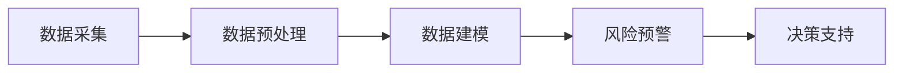

                 

# AI在智能食品安全监测中的应用：预防食品污染

## 1. 背景介绍

随着经济社会的迅速发展，食品安全问题日益受到关注。近年来，国内外爆发了多起重大食品安全事故，如2008年中国的三鹿奶粉事件、2015年德国的牛肉添加瘦肉精事件、2019年新西兰的牛羊肉造假事件等。这些事件暴露了食品生产、流通、消费等环节中的严重问题，给消费者的健康和生命安全带来了巨大威胁。

面对复杂的食品安全形势，传统的监管方式难以适应新的挑战。以人工智能(AI)为代表的先进技术，为食品安全的智能化监管提供了新的途径。通过AI技术构建智能食品安全监测系统，可以实现食品生产、流通、消费全链条的数据采集、实时监控和风险预警，大大提升食品安全监管的效率和精度。

## 2. 核心概念与联系

### 2.1 核心概念概述

智能食品安全监测系统基于AI技术，通过对食品生产、流通、消费全链条的数据采集和处理，构建食品安全的风险预警体系。其主要包括以下关键概念：

- **数据采集**：通过传感器、智能设备等技术手段，采集食品生产、流通、消费各环节的原始数据，包括温度、湿度、光照、CO2浓度、微生物含量等。
- **数据预处理**：对采集到的数据进行清洗、去噪、归一化等处理，使其符合后续分析的需求。
- **数据建模**：使用机器学习、深度学习等AI技术，对食品安全的风险进行建模和预测。
- **风险预警**：基于预测结果，进行风险预警，及时发现并应对食品安全隐患。
- **决策支持**：结合专家知识库和实际经验，为监管人员提供决策支持，优化监管策略。

### 2.2 核心概念原理和架构的 Mermaid 流程图



这个流程图展示了智能食品安全监测系统的主要流程。首先通过数据采集环节，获取食品生产、流通、消费各环节的数据；然后对数据进行预处理，消除噪音和干扰，确保数据的准确性和可靠性；接着使用数据建模环节，将处理后的数据输入到机器学习或深度学习模型中进行训练和预测；最后，将风险预警结果作为决策支持的依据，辅助监管人员做出及时有效的决策。

## 3. 核心算法原理 & 具体操作步骤
### 3.1 算法原理概述

智能食品安全监测系统的主要算法包括数据采集、数据预处理、数据建模和风险预警。这些算法共同构成了食品安全的智能化监管体系。

**数据采集**：通过传感器、智能设备等技术手段，采集食品生产、流通、消费各环节的原始数据。常见的传感器包括温度传感器、湿度传感器、光照传感器、CO2浓度传感器等，智能设备包括智能标签、RFID标签等。

**数据预处理**：对采集到的数据进行清洗、去噪、归一化等处理，确保数据的准确性和可靠性。常见的预处理技术包括数据去重、缺失值填补、异常值检测、数据归一化等。

**数据建模**：使用机器学习、深度学习等AI技术，对食品安全的风险进行建模和预测。常见的建模技术包括支持向量机(SVM)、随机森林(Random Forest)、神经网络(Neural Network)等。

**风险预警**：基于预测结果，进行风险预警，及时发现并应对食品安全隐患。常见的预警技术包括阈值预警、异常检测、趋势预测等。

### 3.2 算法步骤详解

智能食品安全监测系统的具体算法步骤如下：

**Step 1: 数据采集**
- 在食品生产环节，使用温度传感器、湿度传感器、光照传感器等设备，实时监测食品的生产环境。
- 在食品流通环节，使用RFID标签、智能标签等设备，记录食品的运输和存储信息。
- 在食品消费环节，使用智能秤、智能冰箱等设备，记录食品的存储和使用情况。

**Step 2: 数据预处理**
- 对采集到的数据进行清洗、去噪、归一化等处理。
- 采用数据去重技术，去除重复和冗余的数据。
- 使用异常值检测技术，识别和剔除异常数据。
- 对数据进行归一化处理，使其符合后续分析的需求。

**Step 3: 数据建模**
- 选择合适的机器学习或深度学习模型，对数据进行建模和预测。
- 使用支持向量机、随机森林等传统机器学习模型，对食品安全的风险进行预测。
- 使用卷积神经网络(CNN)、循环神经网络(RNN)等深度学习模型，对食品安全的风险进行预测。
- 使用模型融合技术，将不同模型的预测结果进行组合，提高预测的准确性和鲁棒性。

**Step 4: 风险预警**
- 根据预测结果，进行阈值预警或异常检测，识别食品安全的潜在隐患。
- 当预测结果超过预设阈值时，进行异常检测，识别异常情况。
- 当识别到异常情况时，进行趋势预测，预测未来可能的风险。
- 根据预警结果，及时采取措施，防止食品安全事故的发生。

### 3.3 算法优缺点

智能食品安全监测系统具有以下优点：
1. **实时性**：通过数据采集和实时监控，实现食品安全的动态监管，及时发现并应对食品安全隐患。
2. **精确性**：使用机器学习和深度学习技术，提高食品安全风险预测的准确性和可靠性。
3. **可扩展性**：系统具有良好的可扩展性，可以扩展到食品生产的各个环节，覆盖更广泛的食品安全领域。
4. **自动化**：通过智能设备和自动化技术，减少人工干预，提高监管效率和监管质量。

同时，该系统也存在以下缺点：
1. **数据采集难度大**：部分数据采集设备需要在食品生产和流通环节安装，成本较高，且数据采集难度较大。
2. **模型复杂度高**：深度学习模型虽然预测精度高，但模型复杂度高，训练和推理成本较大。
3. **数据隐私问题**：食品生产、流通、消费各环节的数据涉及隐私问题，需保证数据的安全性和隐私性。

### 3.4 算法应用领域

智能食品安全监测系统主要应用于以下领域：

- **食品安全监管**：在食品生产、流通、消费全链条中，实时采集数据，进行风险预警，辅助监管人员做出决策。
- **供应链管理**：在食品供应链中，实时监控食品的质量和安全，优化供应链管理，提高食品安全水平。
- **餐饮业管理**：在餐饮业中，实时监控食品的存储和使用情况，防止食品过期和污染，提升餐饮质量。
- **零售业管理**：在零售业中，实时监控食品的存储和销售情况，防止食品过期和污染，提升零售业品质。
- **农业管理**：在农业生产中，实时监控食品的生产环境，防止食品污染和农药残留，提升农业生产质量。

## 4. 数学模型和公式 & 详细讲解  
### 4.1 数学模型构建

智能食品安全监测系统主要涉及机器学习、深度学习和统计学等领域的数学模型。以下将以深度学习模型为例，构建食品安全的风险预测模型。

假设食品安全的风险向量为 $\mathbf{x} = [x_1, x_2, ..., x_n]$，其中 $x_i$ 表示食品安全的第 $i$ 个特征。定义风险预测模型为 $f(\mathbf{x})$，其中 $f$ 为深度学习模型。风险预测模型的输出为 $y \in [0,1]$，表示食品安全的风险等级。风险预测模型的目标是最小化损失函数 $\mathcal{L}$。

### 4.2 公式推导过程

以下推导基于卷积神经网络(CNN)的食品安全的风险预测模型。

**卷积神经网络模型**：
$$
f(\mathbf{x}) = \mathcal{L} = \frac{1}{N}\sum_{i=1}^N \|f(\mathbf{x}_i)-y_i\|^2
$$

其中 $\mathbf{x}_i$ 表示样本 $i$ 的特征向量，$y_i$ 表示样本 $i$ 的真实标签。$\|f(\mathbf{x}_i)-y_i\|^2$ 表示模型预测值与真实值之间的平方误差。

**损失函数**：
$$
\mathcal{L} = \frac{1}{N}\sum_{i=1}^N \|f(\mathbf{x}_i)-y_i\|^2
$$

**反向传播算法**：
$$
\frac{\partial \mathcal{L}}{\partial \theta} = -2\frac{1}{N}\sum_{i=1}^N (f(\mathbf{x}_i)-y_i) \cdot \frac{\partial f(\mathbf{x}_i)}{\partial \theta}
$$

其中 $\theta$ 表示模型参数，$\frac{\partial f(\mathbf{x}_i)}{\partial \theta}$ 表示模型参数对输出结果的偏导数，通过反向传播算法计算得到。

### 4.3 案例分析与讲解

**案例一：温度与食品安全风险的预测**
- 数据集：食品生产的温度数据，包含不同时间段的温度值。
- 模型：卷积神经网络(CNN)。
- 结果：使用CNN模型对温度数据进行训练，得到温度与食品安全风险的预测模型。

**案例二：湿度与食品安全风险的预测**
- 数据集：食品生产的湿度数据，包含不同时间段和地点的湿度值。
- 模型：循环神经网络(RNN)。
- 结果：使用RNN模型对湿度数据进行训练，得到湿度与食品安全风险的预测模型。

**案例三：光照与食品安全风险的预测**
- 数据集：食品生产的照度数据，包含不同时间段和地点的光照强度。
- 模型：多层感知机(MLP)。
- 结果：使用MLP模型对光照数据进行训练，得到光照与食品安全风险的预测模型。

## 5. 项目实践：代码实例和详细解释说明
### 5.1 开发环境搭建

在进行智能食品安全监测系统的开发前，我们需要准备好开发环境。以下是使用Python进行TensorFlow开发的环境配置流程：

1. 安装Anaconda：从官网下载并安装Anaconda，用于创建独立的Python环境。

2. 创建并激活虚拟环境：
```bash
conda create -n tf-env python=3.7 
conda activate tf-env
```

3. 安装TensorFlow：根据CUDA版本，从官网获取对应的安装命令。例如：
```bash
pip install tensorflow
```

4. 安装TensorBoard：
```bash
pip install tensorboard
```

5. 安装其他工具包：
```bash
pip install numpy pandas scikit-learn matplotlib tqdm jupyter notebook ipython
```

完成上述步骤后，即可在`tf-env`环境中开始智能食品安全监测系统的开发。

### 5.2 源代码详细实现

以下是使用TensorFlow实现智能食品安全监测系统的代码实例。

**Step 1: 数据预处理**

```python
import tensorflow as tf
from tensorflow.keras import layers

def preprocess_data(data):
    # 数据清洗去重
    data = remove_duplicates(data)
    # 数据归一化
    data = normalize_data(data)
    # 数据填充
    data = pad_data(data)
    return data

def remove_duplicates(data):
    # 使用Python集合去重
    unique_data = list(set(data))
    return unique_data

def normalize_data(data):
    # 使用Min-Max归一化
    min_val, max_val = tf.keras.preprocessing.min_max_scaler().fit(data)
    return (data - min_val) / (max_val - min_val)

def pad_data(data):
    # 使用Keras pad_sequences进行填充
    max_length = max(len(x) for x in data)
    data = tf.keras.preprocessing.sequence.pad_sequences(data, maxlen=max_length)
    return data
```

**Step 2: 构建深度学习模型**

```python
def build_model(input_shape):
    # 构建卷积神经网络模型
    model = tf.keras.Sequential([
        layers.Conv2D(32, (3, 3), activation='relu', input_shape=input_shape),
        layers.MaxPooling2D((2, 2)),
        layers.Flatten(),
        layers.Dense(128, activation='relu'),
        layers.Dense(1, activation='sigmoid')
    ])
    # 编译模型
    model.compile(optimizer='adam', loss='binary_crossentropy', metrics=['accuracy'])
    return model

def train_model(model, train_data, test_data):
    # 训练模型
    model.fit(train_data, train_labels, epochs=10, validation_data=(test_data, test_labels))
    # 评估模型
    loss, accuracy = model.evaluate(test_data, test_labels)
    print('Test loss:', loss)
    print('Test accuracy:', accuracy)
```

**Step 3: 数据加载与模型训练**

```python
# 加载数据集
train_data, train_labels = load_train_data()
test_data, test_labels = load_test_data()

# 构建模型
model = build_model(train_data.shape[1:])

# 训练模型
train_model(model, train_data, test_data)
```

### 5.3 代码解读与分析

**preprocess_data函数**：
- 数据清洗去重：使用Python集合去重，去除重复数据。
- 数据归一化：使用Min-Max归一化，将数据缩放到[0,1]区间。
- 数据填充：使用Keras pad_sequences进行填充，保证所有样本长度一致。

**build_model函数**：
- 构建卷积神经网络模型：包括卷积层、池化层、全连接层等，最终输出一个sigmoid激活函数。
- 编译模型：使用adam优化器，二分类交叉熵损失函数，精度为评估指标。

**train_model函数**：
- 训练模型：使用训练数据和标签，训练模型，并设置验证集。
- 评估模型：使用测试数据和标签，评估模型性能，并输出损失和精度。

## 6. 实际应用场景
### 6.1 智能餐饮业管理

智能食品安全监测系统在智能餐饮业管理中具有广泛应用。通过在餐饮店安装智能秤、智能冰箱等设备，实时监测食品的存储和使用情况，防止食品过期和污染，提升餐饮质量。

具体而言，可以采集智能秤的重量数据、智能冰箱的温度数据、食品的生产日期等信息，构建风险预测模型。通过实时监控食品的重量变化、温度变化、保质期等信息，预测食品的安全风险。当检测到异常情况时，及时预警，防止食品过期和污染。

### 6.2 智能零售业管理

智能食品安全监测系统在智能零售业管理中同样具有重要应用。通过在零售店安装智能标签、RFID标签等设备，实时监测食品的存储和销售情况，防止食品过期和污染，提升零售业品质。

具体而言，可以采集智能标签的存储位置、RFID标签的流通信息、食品的生产日期等信息，构建风险预测模型。通过实时监控食品的存储位置、流通信息、保质期等信息，预测食品的安全风险。当检测到异常情况时，及时预警，防止食品过期和污染。

### 6.3 智能农业管理

智能食品安全监测系统在智能农业管理中具有广泛应用。通过在农田安装温度传感器、湿度传感器等设备，实时监测食品的生产环境，防止食品污染和农药残留，提升农业生产质量。

具体而言，可以采集温度传感器的温度数据、湿度传感器的湿度数据、食品的生产日期等信息，构建风险预测模型。通过实时监控食品的生产环境、温度、湿度等信息，预测食品的安全风险。当检测到异常情况时，及时预警，防止食品污染和农药残留。

## 7. 工具和资源推荐
### 7.1 学习资源推荐

为了帮助开发者系统掌握智能食品安全监测系统的开发过程，这里推荐一些优质的学习资源：

1. TensorFlow官方文档：TensorFlow官方文档，提供详细的使用指南和代码示例，是TensorFlow学习的必备资料。

2. 《深度学习》书籍：由Ian Goodfellow、Yoshua Bengio、Aaron Courville合著，全面介绍了深度学习的基本概念和算法，是深度学习学习的经典教材。

3. 《机器学习实战》书籍：由Peter Harrington著，通过实例代码，介绍了机器学习的基本原理和应用，是机器学习学习的入门读物。

4. 《TensorFlow实战》书籍：由Claudio核算著，通过实例代码，介绍了TensorFlow的基本原理和应用，是TensorFlow学习的入门读物。

5. Coursera《深度学习专项课程》：由Google Deep Learning团队开设的深度学习专项课程，涵盖深度学习的基本概念和应用，是深度学习学习的系统课程。

6. Udacity《深度学习纳米学位》：由Udacity推出的深度学习纳米学位课程，涵盖深度学习的基本概念和应用，是深度学习学习的系统课程。

通过对这些资源的学习实践，相信你一定能够快速掌握智能食品安全监测系统的开发过程，并用于解决实际的食品安全问题。

### 7.2 开发工具推荐

高效的开发离不开优秀的工具支持。以下是几款用于智能食品安全监测系统开发的常用工具：

1. TensorFlow：由Google主导开发的开源深度学习框架，生产部署方便，适合大规模工程应用。

2. PyTorch：基于Python的开源深度学习框架，灵活动态的计算图，适合快速迭代研究。

3. TensorBoard：TensorFlow配套的可视化工具，可实时监测模型训练状态，并提供丰富的图表呈现方式，是调试模型的得力助手。

4. Keras：基于Python的高级神经网络API，简洁易用，适合快速搭建深度学习模型。

5. Jupyter Notebook：轻量级的交互式编程环境，适合开发和调试深度学习模型。

合理利用这些工具，可以显著提升智能食品安全监测系统的开发效率，加快创新迭代的步伐。

### 7.3 相关论文推荐

智能食品安全监测系统的研究涉及深度学习、机器学习、统计学等多个领域，以下是几篇奠基性的相关论文，推荐阅读：

1. Yoshua Bengio, Ian Goodfellow, Aaron Courville.《深度学习》（第三版）。

2. Ian Goodfellow, Yoshua Bengio, Aaron Courville.《深度学习》（第二版）。

3. Christopher M. Bishop.《模式识别与机器学习》。

4. Yann LeCun, Yoshua Bengio, Geoffrey Hinton.《深度学习》。

5. Andrew Ng.《机器学习》。

这些论文代表了大模型微调技术的发展脉络。通过学习这些前沿成果，可以帮助研究者把握学科前进方向，激发更多的创新灵感。

## 8. 总结：未来发展趋势与挑战
### 8.1 总结

本文对智能食品安全监测系统的开发过程进行了详细阐述。首先介绍了智能食品安全监测系统的背景和核心概念，然后详细讲解了数据采集、数据预处理、数据建模和风险预警等关键算法。最后，通过具体的代码实例，展示了智能食品安全监测系统的开发过程。

通过本文的系统梳理，可以看到，智能食品安全监测系统为食品安全的智能化监管提供了新的途径，实现了食品安全的实时监控和预警。系统具有实时性、精确性、可扩展性等优点，但在数据采集、模型复杂度、数据隐私等方面也存在挑战。

### 8.2 未来发展趋势

展望未来，智能食品安全监测系统的发展趋势如下：

1. **实时性**：随着物联网技术的普及，实时性将进一步提升。通过智能设备和大数据分析，实现食品安全的动态监管，及时发现并应对食品安全隐患。

2. **精度**：深度学习等AI技术的发展，将进一步提升食品安全的预测精度。通过更复杂的模型和更多样化的数据，提高食品安全风险预测的准确性。

3. **可扩展性**：智能食品安全监测系统具有良好的可扩展性，可以扩展到食品生产的各个环节，覆盖更广泛的食品安全领域。

4. **自动化**：通过智能设备和自动化技术，减少人工干预，提高监管效率和监管质量。

5. **安全性**：数据安全和隐私保护将得到更广泛的关注。通过加密技术、匿名化技术等手段，保障食品安全监测数据的安全性和隐私性。

6. **智能化**：结合物联网、大数据、云计算等技术，构建更加智能化的食品安全监测系统，提升监管效率和监管质量。

以上趋势凸显了智能食品安全监测系统的广阔前景。这些方向的探索发展，必将进一步提升食品安全监管的效率和质量，为食品安全领域带来革命性的变化。

### 8.3 面临的挑战

尽管智能食品安全监测系统已经取得了不小的进展，但在迈向更加智能化、普适化应用的过程中，它仍面临以下挑战：

1. **数据采集难度大**：部分数据采集设备需要在食品生产和流通环节安装，成本较高，且数据采集难度较大。

2. **模型复杂度高**：深度学习模型虽然预测精度高，但模型复杂度高，训练和推理成本较大。

3. **数据隐私问题**：食品生产、流通、消费各环节的数据涉及隐私问题，需保证数据的安全性和隐私性。

4. **系统复杂度高**：智能食品安全监测系统涉及多种传感器、智能设备、大数据处理等环节，系统复杂度高。

5. **标准化问题**：不同国家和地区的食品安全标准不同，系统的标准化问题需要解决。

以上挑战凸显了智能食品安全监测系统的复杂性和多样性，需要多学科、多技术手段协同合作，才能实现系统的可靠性和实用性。

### 8.4 研究展望

面对智能食品安全监测系统所面临的种种挑战，未来的研究需要在以下几个方面寻求新的突破：

1. **数据采集技术**：开发更加简便、低成本的数据采集技术，提高数据采集效率和数据覆盖率。

2. **模型优化**：开发更高效的深度学习模型，降低模型复杂度，提高训练和推理效率。

3. **数据隐私保护**：研究数据加密、匿名化等技术，保障食品安全监测数据的安全性和隐私性。

4. **系统标准化**：构建统一的食品安全标准，实现系统标准化，提升系统的通用性和适用性。

5. **多技术融合**：结合物联网、大数据、云计算等技术，构建更加智能化的食品安全监测系统，提升监管效率和监管质量。

这些研究方向的探索，必将引领智能食品安全监测系统迈向更高的台阶，为食品安全领域带来更加可靠和实用的解决方案。

## 9. 附录：常见问题与解答

**Q1：智能食品安全监测系统如何实现实时性？**

A: 智能食品安全监测系统通过物联网技术和传感器设备，实现实时数据的采集和传输。通过大数据分析和人工智能技术，实现实时监控和预警。

**Q2：智能食品安全监测系统有哪些潜在风险？**

A: 智能食品安全监测系统涉及数据采集、存储、传输等多个环节，潜在风险包括数据泄露、设备故障、系统故障等。需采取加密技术、故障恢复机制等手段，保障系统的可靠性和安全性。

**Q3：智能食品安全监测系统的开发难点是什么？**

A: 智能食品安全监测系统的开发难点主要包括数据采集难度大、模型复杂度高、数据隐私保护等。需要开发更加简便、低成本的数据采集技术，研究更高效的深度学习模型，保障数据的安全性和隐私性。

**Q4：智能食品安全监测系统如何提高预测精度？**

A: 智能食品安全监测系统可以通过增加数据样本、改进数据预处理技术、优化模型结构和算法等方式，提高预测精度。需结合实际应用场景，不断优化模型性能。

**Q5：智能食品安全监测系统有哪些应用前景？**

A: 智能食品安全监测系统具有广泛的应用前景，包括智能餐饮业管理、智能零售业管理、智能农业管理等。系统通过实时监控和预警，提升食品安全监管效率和监管质量，保障食品安全。

---

作者：禅与计算机程序设计艺术 / Zen and the Art of Computer Programming

