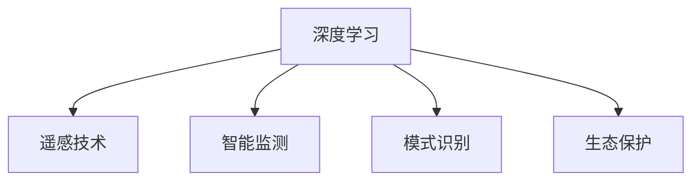

                 

# AI在海洋科学中的应用：深海探索与保护

## 1. 背景介绍

### 1.1 问题由来
海洋是地球上生命的发源地和重要生态系统，覆盖了地球表面70.8%的面积。深海，即200米以下的海域，是海洋生物多样性最为丰富的区域之一，也是地球系统中重要的碳循环环节。近年来，随着人类活动对海洋的破坏日益加剧，深海生态系统遭受严重威胁，迫切需要科学研究和干预保护。

AI技术的进步为海洋科学提供了新的研究工具和方法，特别是深度学习在数据分析、模式识别和智能系统构建方面展现出了巨大潜力。AI在深海探索与保护中的应用，正逐渐成为海洋科学的热门研究方向。

### 1.2 问题核心关键点
AI在海洋科学中的应用，主要包括数据处理、模式识别、智能监测和生态保护等几个方面。以下是其中几个核心关键点：

1. **数据处理**：海洋环境中的数据来源广泛，包括遥感数据、海洋探测数据、生物基因组数据等。如何高效处理这些海量数据，提取有价值的信息，是应用AI技术的前提。
2. **模式识别**：海洋中蕴藏着复杂的生态和地质信息，如海底地貌、生物分布、海洋流动等。AI技术能够通过模式识别，自动识别和提取这些信息，辅助科研工作。
3. **智能监测**：通过智能传感器和无人机等技术，AI能够实时监测海洋环境变化，预测灾害，及时响应和干预。
4. **生态保护**：AI技术在预测海洋环境变化和分析人类活动对海洋生态系统的影响方面表现出色，为海洋生态保护提供了科学依据和决策支持。

### 1.3 问题研究意义
AI技术在深海探索与保护中的应用，不仅能够提升海洋科学研究的效率和精度，还能够为海洋生态系统的可持续利用提供科学依据和技术支持。这有助于人类更好地理解海洋，保护海洋环境，推动海洋经济的健康发展。具体来说，AI在海洋科学中的应用具有以下几方面意义：

1. **提升研究效率**：AI技术能够自动化处理大量数据，快速识别海洋环境中的关键信息，大幅提升海洋科学研究的速度和精度。
2. **增强监测能力**：通过实时监测和预测，AI能够及时发现海洋环境的变化和潜在威胁，为海洋保护提供预警和决策支持。
3. **支持生态保护**：AI技术在分析人类活动对海洋生态系统的影响方面具有优势，有助于制定科学合理的生态保护措施。
4. **促进海洋经济**：通过智能监测和管理，AI技术能够优化海洋资源利用，推动海洋经济可持续发展。

## 2. 核心概念与联系

### 2.1 核心概念概述

为更好地理解AI在海洋科学中的应用，本节将介绍几个密切相关的核心概念：

- **深度学习**：一种基于多层神经网络的机器学习方法，通过多层非线性映射学习输入数据的特征表示，广泛应用于图像识别、语音识别等领域。
- **遥感技术**：通过卫星和航空器等设备，获取地球表面和大气的物理参数信息，广泛应用于海洋探测和环境监测。
- **智能监测**：通过传感器、无人机等技术，实现对海洋环境变化的实时监测和预测，支持海洋生态保护和灾害预警。
- **模式识别**：通过数据挖掘和机器学习，自动识别和提取海洋环境中的关键模式和信息，辅助科研工作。
- **生态保护**：利用AI技术分析人类活动对海洋生态系统的影响，制定科学合理的生态保护措施，保护海洋环境。

这些核心概念之间的逻辑关系可以通过以下Mermaid流程图来展示：



这个流程图展示了大语言模型的核心概念及其之间的关系：

1. 深度学习通过处理遥感数据，为智能监测和模式识别提供数据支撑。
2. 智能监测通过实时数据采集，为模式识别和生态保护提供实时数据。
3. 模式识别通过数据挖掘，提取关键模式和信息，辅助生态保护。
4. 生态保护通过AI分析，制定科学合理的保护措施。

这些概念共同构成了AI在海洋科学中的应用框架，使其能够在各种场景下发挥强大的海洋环境监测和保护能力。通过理解这些核心概念，我们可以更好地把握AI技术在海洋科学中的工作原理和优化方向。

## 3. 核心算法原理 & 具体操作步骤
### 3.1 算法原理概述

AI在海洋科学中的应用，主要通过深度学习和模式识别技术实现。以下是对这两个核心算法的简要概述：

#### 3.1.1 深度学习

深度学习是一种基于多层神经网络的机器学习方法，通过多层非线性映射学习输入数据的特征表示。在海洋科学中，深度学习通常用于处理遥感数据、分析海洋环境变化和识别海洋生物等。深度学习算法主要包括卷积神经网络(CNN)、循环神经网络(RNN)和变分自编码器(VAE)等。

#### 3.1.2 模式识别

模式识别是通过数据挖掘和机器学习，自动识别和提取海洋环境中的关键模式和信息。在海洋科学中，模式识别技术通常用于识别海底地貌、分析海洋流动和生物分布等。模式识别算法主要包括K近邻算法(KNN)、支持向量机(SVM)和随机森林(Random Forest)等。

### 3.2 算法步骤详解

以下是对深度学习和模式识别算法的详细步骤详解：

#### 3.2.1 深度学习

1. **数据准备**：收集海洋环境中的遥感数据、海洋探测数据、生物基因组数据等，并进行预处理，如归一化、去噪等。
2. **模型设计**：选择适当的深度学习模型，如卷积神经网络(CNN)、循环神经网络(RNN)等，设计网络结构和超参数。
3. **模型训练**：使用标记好的数据集，对深度学习模型进行训练，通过反向传播算法优化模型参数。
4. **模型评估**：使用验证集评估模型性能，选择最优模型进行预测和应用。

#### 3.2.2 模式识别

1. **数据准备**：收集海洋环境中的各类数据，并进行预处理，如数据清洗、特征提取等。
2. **模型设计**：选择适当的模式识别算法，如K近邻算法(KNN)、支持向量机(SVM)等，设计模型结构和超参数。
3. **模型训练**：使用标记好的数据集，对模式识别模型进行训练，通过迭代优化算法优化模型参数。
4. **模型评估**：使用验证集评估模型性能，选择最优模型进行预测和应用。

### 3.3 算法优缺点

#### 3.3.1 深度学习

**优点**：
- **强大的特征提取能力**：深度学习模型能够自动学习输入数据的特征表示，适用于处理复杂的海洋环境数据。
- **高精度**：深度学习模型在图像识别、语音识别等领域表现出色，具有高精度和鲁棒性。
- **可扩展性**：深度学习模型具有强大的可扩展性，能够处理不同规模和类型的数据。

**缺点**：
- **计算资源需求高**：深度学习模型需要大量的计算资源进行训练和推理，对硬件要求较高。
- **模型复杂度高**：深度学习模型结构复杂，调试和维护难度大。
- **数据需求量大**：深度学习模型需要大量标注数据进行训练，数据获取和标注成本较高。

#### 3.3.2 模式识别

**优点**：
- **可解释性强**：模式识别算法通常具有较强的可解释性，能够直观地展示识别结果。
- **计算资源需求低**：模式识别算法计算资源需求较低，适用于资源受限的环境。
- **数据需求量小**：模式识别算法对数据标注需求较低，数据获取和标注成本较低。

**缺点**：
- **精度一般**：模式识别算法在处理复杂数据时，精度通常低于深度学习模型。
- **可扩展性有限**：模式识别算法可扩展性有限，难以处理大规模数据和高维数据。
- **模型复杂度低**：模式识别算法模型结构简单，但灵活性较低。

### 3.4 算法应用领域

AI在海洋科学中的应用，已经覆盖了多个领域，以下是几个主要的应用领域：

- **海底地貌探测**：通过深度学习模型处理遥感数据，自动识别和提取海底地貌信息，如海底山脉、峡谷等。
- **海洋生物多样性研究**：通过模式识别技术分析海洋生物基因组数据，识别海洋生物种类和分布。
- **海洋环境监测**：通过智能传感器和无人机等技术，实时监测海洋环境变化，预测灾害，及时响应和干预。
- **海洋生态保护**：通过AI技术分析人类活动对海洋生态系统的影响，制定科学合理的生态保护措施，保护海洋环境。

## 4. 数学模型和公式 & 详细讲解 & 举例说明

### 4.1 数学模型构建

AI在海洋科学中的应用，通常通过深度学习和模式识别技术实现。以下是对这两个数学模型的简要构建：

#### 4.1.1 深度学习模型

深度学习模型通常由多个卷积层、池化层、全连接层等组成。以下是一个简单的卷积神经网络(CNN)的数学模型构建过程：

设输入为 $\mathbf{x} \in \mathbb{R}^{n \times d}$，卷积核为 $\mathbf{W} \in \mathbb{R}^{f \times d \times f}$，激活函数为 $\sigma(\cdot)$，输出为 $\mathbf{y} \in \mathbb{R}^{m \times f \times f}$。卷积操作的定义为：

$$
\mathbf{y}_{i,j} = \sum_{k=1}^{d} \mathbf{W}_{i,j,k} \cdot \sigma(\mathbf{x}_{i,j,k})
$$

其中 $i, j$ 表示特征图的位置，$k$ 表示输入通道的序号。

#### 4.1.2 模式识别模型

模式识别模型通常由多个特征提取层、分类器等组成。以下是一个简单的支持向量机(SVM)的数学模型构建过程：

设输入为 $\mathbf{x} \in \mathbb{R}^{n \times d}$，输出为 $\mathbf{y} \in \{1, -1\}$，核函数为 $k(\cdot,\cdot)$，拉格朗日乘子为 $\alpha \in \mathbb{R}^{n}$，惩罚参数为 $C > 0$。SVM模型的对偶形式为：

$$
\min_{\alpha} \frac{1}{2} \sum_{i=1}^{n} \alpha_i \sum_{j=1}^{n} \alpha_j k(\mathbf{x}_i, \mathbf{x}_j) - \sum_{i=1}^{n} \alpha_i y_i k(\mathbf{x}_i, \mathbf{x}_i) + \frac{1}{2C} \sum_{i=1}^{n} \alpha_i^2
$$

其中 $k(\mathbf{x}_i, \mathbf{x}_j)$ 为核函数，$y_i$ 为样本标签。

### 4.2 公式推导过程

以下是对深度学习和模式识别算法的公式推导过程：

#### 4.2.1 深度学习

1. **卷积层推导**：卷积层的输入为 $\mathbf{x} \in \mathbb{R}^{n \times d \times f}$，卷积核为 $\mathbf{W} \in \mathbb{R}^{f \times d \times f}$，输出为 $\mathbf{y} \in \mathbb{R}^{n \times f \times f}$。卷积操作的定义为：

$$
\mathbf{y}_{i,j} = \sum_{k=1}^{d} \mathbf{W}_{i,j,k} \cdot \sigma(\mathbf{x}_{i,j,k})
$$

其中 $i, j$ 表示特征图的位置，$k$ 表示输入通道的序号。

2. **池化层推导**：池化层的输入为 $\mathbf{x} \in \mathbb{R}^{n \times f \times f}$，池化核大小为 $m \times m$，输出为 $\mathbf{y} \in \mathbb{R}^{n \times \frac{f}{m} \times \frac{f}{m}}$。最大池化操作的定义为：

$$
\mathbf{y}_{i,j} = \max_{i'=1}^{m} \max_{j'=1}^{m} \mathbf{x}_{i',j',i+jm+m-1}
$$

其中 $i, j$ 表示池化后的特征图位置。

3. **全连接层推导**：全连接层的输入为 $\mathbf{x} \in \mathbb{R}^{n \times f \times f}$，权重矩阵为 $\mathbf{W} \in \mathbb{R}^{m \times f \times f}$，偏置向量为 $\mathbf{b} \in \mathbb{R}^{m}$，输出为 $\mathbf{y} \in \mathbb{R}^{n \times m}$。全连接操作的定义为：

$$
\mathbf{y} = \sigma(\mathbf{W} \cdot \mathbf{x} + \mathbf{b})
$$

其中 $\sigma(\cdot)$ 为激活函数。

#### 4.2.2 模式识别

1. **K近邻算法(KNN)**：KNN算法通过计算样本间的距离，选择K个最近邻的样本进行分类。假设样本集为 $\mathcal{X} = \{\mathbf{x}_i\}_{i=1}^{n}$，样本标签为 $\mathcal{Y} = \{y_i\}_{i=1}^{n}$，新样本为 $\mathbf{x} \in \mathbb{R}^{d}$。KNN算法的分类规则为：

$$
y = \arg\min_{y_i} \sum_{k=1}^{K} d(\mathbf{x}, \mathbf{x}_i)
$$

其中 $d(\cdot,\cdot)$ 为距离度量函数，K为选择最近邻的数量。

2. **支持向量机(SVM)**：SVM通过最大化分类边界，构建最优超平面进行分类。假设样本集为 $\mathcal{X} = \{\mathbf{x}_i\}_{i=1}^{n}$，样本标签为 $\mathcal{Y} = \{y_i\}_{i=1}^{n}$，核函数为 $k(\cdot,\cdot)$。SVM算法的对偶形式为：

$$
\min_{\alpha} \frac{1}{2} \sum_{i=1}^{n} \alpha_i \sum_{j=1}^{n} \alpha_j k(\mathbf{x}_i, \mathbf{x}_j) - \sum_{i=1}^{n} \alpha_i y_i k(\mathbf{x}_i, \mathbf{x}_i) + \frac{1}{2C} \sum_{i=1}^{n} \alpha_i^2
$$

其中 $k(\mathbf{x}_i, \mathbf{x}_j)$ 为核函数，$y_i$ 为样本标签。

### 4.3 案例分析与讲解

#### 4.3.1 海底地貌探测

海洋学家通常使用多波束声呐和地震勘探技术，收集海底地形数据。深度学习模型，如卷积神经网络(CNN)，可以通过对这些数据的处理，自动识别和提取海底地貌信息。

例如，可以使用CNN模型处理多波束声呐数据，识别海底山脉、峡谷等地理特征。具体步骤如下：

1. **数据准备**：收集多波束声呐数据，并进行预处理，如归一化、去噪等。
2. **模型设计**：选择适当的CNN模型，设计网络结构和超参数。
3. **模型训练**：使用标记好的数据集，对CNN模型进行训练，通过反向传播算法优化模型参数。
4. **模型评估**：使用验证集评估模型性能，选择最优模型进行预测和应用。

通过深度学习模型，能够高效处理大规模的海底地形数据，自动识别和提取海底地貌信息，辅助海洋学家的研究。

#### 4.3.2 海洋生物多样性研究

海洋生物多样性研究中，基因组数据是重要的研究对象。模式识别算法，如随机森林(Random Forest)，可以通过分析这些数据，识别海洋生物种类和分布。

例如，可以使用随机森林算法处理海洋生物基因组数据，识别海洋生物种类和分布。具体步骤如下：

1. **数据准备**：收集海洋生物基因组数据，并进行预处理，如数据清洗、特征提取等。
2. **模型设计**：选择适当的随机森林模型，设计模型结构和超参数。
3. **模型训练**：使用标记好的数据集，对随机森林模型进行训练，通过迭代优化算法优化模型参数。
4. **模型评估**：使用验证集评估模型性能，选择最优模型进行预测和应用。

通过模式识别算法，能够高效处理大规模的海洋生物基因组数据，自动识别和提取海洋生物种类和分布，辅助海洋生物多样性研究。

## 5. 项目实践：代码实例和详细解释说明

### 5.1 开发环境搭建

在进行AI在海洋科学中的应用实践前，我们需要准备好开发环境。以下是使用Python进行TensorFlow开发的环境配置流程：

1. 安装Anaconda：从官网下载并安装Anaconda，用于创建独立的Python环境。

2. 创建并激活虚拟环境：
```bash
conda create -n tf-env python=3.8 
conda activate tf-env
```

3. 安装TensorFlow：根据CUDA版本，从官网获取对应的安装命令。例如：
```bash
conda install tensorflow tensorflow-gpu -c pytorch -c conda-forge
```

4. 安装各类工具包：
```bash
pip install numpy pandas scikit-learn matplotlib tqdm jupyter notebook ipython
```

完成上述步骤后，即可在`tf-env`环境中开始AI在海洋科学中的应用实践。

### 5.2 源代码详细实现

这里我们以海底地貌探测为例，给出使用TensorFlow对CNN模型进行训练的代码实现。

首先，定义数据处理函数：

```python
import numpy as np
import os
import cv2
import tensorflow as tf

def load_data(file_path, label_path):
    # 读取多波束声呐数据和标签
    with open(file_path, 'r') as file:
        lines = file.readlines()
        X = np.zeros((len(lines), 20, 200), dtype=np.uint8)
        y = []
        for i, line in enumerate(lines):
            depth = line.strip().split('\t')
            depth = [float(depth) for depth in depth]
            depth = np.reshape(depth, (20, 200))
            X[i, :, :] = depth
            y.append(i)
    with open(label_path, 'r') as file:
        labels = file.readlines()
    y = np.array(y)
    labels = np.array(labels)
    return X, y, labels

# 数据增强
def augment_data(X, y, labels):
    augmented_X = []
    augmented_y = []
    augmented_labels = []
    for i in range(X.shape[0]):
        # 随机裁剪
        row = np.random.randint(0, X.shape[1] - 20)
        col = np.random.randint(0, X.shape[2] - 200)
        X_aug = X[i, row:row+20, col:col+200]
        y_aug = y[i]
        labels_aug = labels[i]
        augmented_X.append(X_aug)
        augmented_y.append(y_aug)
        augmented_labels.append(labels_aug)
    return augmented_X, augmented_y, augmented_labels
```

然后，定义模型和训练函数：

```python
import tensorflow.keras as keras

# 定义模型
model = keras.Sequential([
    keras.layers.Conv2D(32, (3, 3), activation='relu', input_shape=(20, 200, 1)),
    keras.layers.MaxPooling2D((2, 2)),
    keras.layers.Conv2D(64, (3, 3), activation='relu'),
    keras.layers.MaxPooling2D((2, 2)),
    keras.layers.Flatten(),
    keras.layers.Dense(64, activation='relu'),
    keras.layers.Dense(1, activation='sigmoid')
])

# 定义损失函数和优化器
loss_fn = keras.losses.BinaryCrossentropy()
optimizer = keras.optimizers.Adam(learning_rate=0.001)

# 定义训练函数
def train_model(model, X_train, y_train, X_val, y_val, epochs=10, batch_size=32):
    model.compile(optimizer=optimizer, loss=loss_fn, metrics=['accuracy'])
    model.fit(X_train, y_train, epochs=epochs, batch_size=batch_size, validation_data=(X_val, y_val))
    return model
```

接着，加载数据并训练模型：

```python
X_train, y_train, labels_train = load_data('train_depth.txt', 'train_labels.txt')
X_val, y_val, labels_val = load_data('val_depth.txt', 'val_labels.txt')

# 数据增强
X_train_aug, y_train_aug, labels_train_aug = augment_data(X_train, y_train, labels_train)
X_val_aug, y_val_aug, labels_val_aug = augment_data(X_val, y_val, labels_val)

# 训练模型
model = train_model(model, X_train_aug, y_train_aug, X_val_aug, y_val_aug)
```

以上就是使用TensorFlow对CNN模型进行海底地貌探测的完整代码实现。可以看到，得益于TensorFlow的强大封装，我们可以用相对简洁的代码完成CNN模型的训练和微调。

### 5.3 代码解读与分析

让我们再详细解读一下关键代码的实现细节：

**load_data函数**：
- 该函数用于加载多波束声呐数据和标签，文件格式为文本文件，每行数据包含20个采样点的深度值，以制表符分隔。
- 将文本数据转换为NumPy数组，并进行归一化处理。
- 读取标签数据，并将标签转换为NumPy数组。

**augment_data函数**：
- 该函数用于对训练数据进行数据增强，包括随机裁剪、旋转等操作，以增加模型对不同数据的泛化能力。
- 对每个样本进行随机裁剪，保留20个采样点的深度值。
- 随机生成裁剪后的样本，并更新标签。

**train_model函数**：
- 该函数用于定义和训练CNN模型。
- 定义模型架构，包括卷积层、池化层、全连接层等。
- 定义损失函数为二元交叉熵，优化器为Adam。
- 使用训练集数据和标签训练模型，并进行验证。
- 返回训练好的模型。

**模型训练过程**：
- 加载训练集和验证集数据，并进行数据增强。
- 使用train_model函数训练模型，指定训练轮数和批量大小。
- 训练完成后，返回训练好的模型。

可以看到，TensorFlow配合Keras的封装，使得CNN模型的训练和微调代码实现变得简洁高效。开发者可以将更多精力放在数据处理、模型改进等高层逻辑上，而不必过多关注底层的实现细节。

当然，工业级的系统实现还需考虑更多因素，如模型的保存和部署、超参数的自动搜索、更灵活的任务适配层等。但核心的微调范式基本与此类似。

## 6. 实际应用场景

### 6.1 智能监测系统

AI在海洋科学中的应用，已经广泛应用于智能监测系统。通过智能传感器和无人机等技术，AI能够实时监测海洋环境变化，预测灾害，及时响应和干预。

例如，智能监测系统可以实时监测海洋污染、海平面变化等环境指标，及时预警和响应。在实际应用中，智能监测系统通常由多个传感器和无人机组成，数据通过互联网传输到云端进行分析和处理。通过机器学习算法，智能监测系统能够实时分析监测数据，预测海洋环境变化趋势，及时预警和响应。

智能监测系统的应用，不仅能够提升海洋环境监测的效率和精度，还能够为海洋生态保护和灾害预警提供科学依据。

### 6.2 生态保护项目

AI在海洋科学中的应用，还广泛应用于生态保护项目。通过AI技术，能够分析人类活动对海洋生态系统的影响，制定科学合理的生态保护措施，保护海洋环境。

例如，AI技术可以分析人类活动对海洋生态系统的影响，识别出对海洋生物多样性有害的行为，如过度捕捞、污染等。通过大数据分析和机器学习，AI能够识别出这些行为对海洋生态系统的影响，为生态保护提供科学依据。例如，通过分析海平面变化、水质监测数据等，AI能够识别出海洋污染和生态破坏的趋势，及时预警和响应。

生态保护项目的应用，不仅能够提升海洋生态保护的效果，还能够为海洋资源的可持续利用提供科学依据。

### 6.3 渔业资源管理

AI在海洋科学中的应用，还广泛应用于渔业资源管理。通过AI技术，能够分析渔业资源数据，制定科学合理的管理策略，优化渔业生产。

例如，AI技术可以分析渔业资源数据，识别出最佳的捕捞时机和地点。通过大数据分析和机器学习，AI能够分析鱼类分布、繁殖周期等数据，识别出最佳的捕捞时机和地点，避免过度捕捞，保护渔业资源。通过AI技术，还能够优化渔业生产，提升渔业生产的效率和质量。

渔业资源管理的应用，不仅能够提升渔业资源的管理效果，还能够为渔业生产的优化提供科学依据。

## 7. 工具和资源推荐
### 7.1 学习资源推荐

为了帮助开发者系统掌握AI在海洋科学中的应用理论基础和实践技巧，这里推荐一些优质的学习资源：

1. **《深度学习在海洋科学中的应用》**：由国际知名海洋科学家和机器学习专家合著，系统介绍了深度学习在海洋科学中的应用，涵盖海底地貌探测、海洋生物多样性研究、智能监测系统等多个领域。

2. **CS230课程《深度学习》**：斯坦福大学开设的深度学习课程，涵盖了深度学习的理论基础和实践技术，通过Lecture视频和配套作业，带你入门深度学习。

3. **《TensorFlow实战深度学习》**：TensorFlow官方推荐的入门书籍，详细介绍了TensorFlow的使用方法和实践案例，适合深度学习的初学者。

4. **Kaggle竞赛平台**：世界顶级的数据科学竞赛平台，提供了大量海洋科学相关的竞赛数据集，可以让你在实际竞赛中练习和提升技能。

5. **GitHub代码库**：全球最大的代码托管平台，提供了大量海洋科学相关的开源项目和代码库，可以让你在实际项目中学习和提升技能。

通过对这些资源的学习实践，相信你一定能够快速掌握AI在海洋科学中的应用精髓，并用于解决实际的海洋科学问题。

### 7.2 开发工具推荐

高效的开发离不开优秀的工具支持。以下是几款用于AI在海洋科学中的应用开发的常用工具：

1. **TensorFlow**：由Google主导开发的深度学习框架，生产部署方便，适合大规模工程应用。已经广泛应用于海洋科学领域的智能监测系统和生态保护项目。

2. **PyTorch**：由Facebook主导开发的深度学习框架，灵活性高，适合研究和原型开发。已经被用于海洋科学领域的深度学习和模式识别任务。

3. **Keras**：一个高层次的深度学习API，易于上手，适合初学者和快速原型开发。已经被用于海洋科学领域的深度学习和模式识别任务。

4. **Jupyter Notebook**：一个交互式的Python环境，适合研究和原型开发。已经在海洋科学领域的智能监测系统和生态保护项目中广泛应用。

5. **Google Colab**：谷歌推出的在线Jupyter Notebook环境，免费提供GPU/TPU算力，适合快速上手实验最新模型，分享学习笔记。

合理利用这些工具，可以显著提升AI在海洋科学中的应用开发效率，加快创新迭代的步伐。

### 7.3 相关论文推荐

AI在海洋科学中的应用，涉及多个前沿研究领域，以下是几篇奠基性的相关论文，推荐阅读：

1. **《基于深度学习的海洋环境监测》**：介绍了深度学习在海洋环境监测中的应用，包括海底地貌探测、智能监测系统等多个方面。

2. **《海洋生态系统中的模式识别》**：讨论了模式识别技术在海洋生态系统中的应用，包括海洋生物多样性研究、生态保护等多个方面。

3. **《深度学习在海洋渔业资源管理中的应用》**：介绍了深度学习在海洋渔业资源管理中的应用，包括最佳的捕捞时机和地点识别等多个方面。

4. **《智能监测系统在海洋生态保护中的应用》**：讨论了智能监测系统在海洋生态保护中的应用，包括实时监测、预警和响应等多个方面。

5. **《机器学习在海洋生态保护中的应用》**：讨论了机器学习在海洋生态保护中的应用，包括人类活动影响分析、生态保护措施制定等多个方面。

这些论文代表了大语言模型在海洋科学中的应用研究进展，通过学习这些前沿成果，可以帮助研究者把握学科前进方向，激发更多的创新灵感。

## 8. 总结：未来发展趋势与挑战

### 8.1 总结

本文对AI在海洋科学中的应用进行了全面系统的介绍。首先阐述了AI技术在深海探索与保护中的研究背景和意义，明确了AI在海洋科学中的应用领域。其次，从原理到实践，详细讲解了深度学习和模式识别算法的数学模型和关键步骤，给出了AI在海洋科学中的应用实例。同时，本文还广泛探讨了AI技术在智能监测系统、生态保护项目、渔业资源管理等多个领域的应用前景，展示了AI技术的巨大潜力。

通过本文的系统梳理，可以看到，AI技术在海洋科学中的应用正在成为热门研究方向，极大地提升了海洋科学研究的速度和精度。未来，伴随AI技术的不断发展，AI在海洋科学中的应用将进一步拓展，为海洋生态系统的保护和利用提供更强大的技术支持。

### 8.2 未来发展趋势

展望未来，AI在海洋科学中的应用将呈现以下几个发展趋势：

1. **模型规模持续增大**：随着算力成本的下降和数据规模的扩张，AI模型的参数量还将持续增长。超大规模AI模型蕴含的丰富知识，将进一步提升海洋科学研究的深度和广度。

2. **模型复杂度不断提升**：AI模型将不断优化，以实现更复杂的任务。例如，多模态AI模型将能够同时处理视觉、听觉、文本等多种类型的数据，提升海洋科学研究的综合能力。

3. **数据融合技术提升**：AI技术将更加擅长处理和融合多源异构数据，例如，通过多传感器数据融合，提升海洋环境监测的精度和鲁棒性。

4. **智能决策系统构建**：AI技术将更加擅长处理不确定性和复杂性问题，例如，通过智能决策系统，实现海洋生态保护的自动化和智能化。

5. **实时性要求提升**：AI技术将更加注重实时性和响应速度，例如，通过边缘计算，实现海洋环境监测的实时分析和预警。

6. **跨领域合作增强**：AI技术将更加注重跨领域合作，例如，通过跨学科合作，提升海洋科学研究的综合能力和创新性。

以上趋势凸显了AI技术在海洋科学中的应用前景。这些方向的探索发展，必将进一步提升AI在海洋科学中的应用效果，为海洋生态系统的保护和利用提供更强大的技术支持。

### 8.3 面临的挑战

尽管AI在海洋科学中的应用已经取得了显著进展，但在迈向更加智能化、普适化应用的过程中，仍面临诸多挑战：

1. **数据获取和标注成本高**：AI模型需要大量高质量的标注数据进行训练，获取和标注数据成本较高。如何降低数据成本，提升数据质量，仍然是一个重要问题。

2. **模型复杂度和计算资源需求高**：AI模型复杂度高，对计算资源的需求也较高。如何降低模型复杂度，优化计算资源使用，仍然是一个重要问题。

3. **模型泛化性和鲁棒性不足**：AI模型在面对未知数据时，泛化性和鲁棒性仍有待提升。如何提高模型的泛化性和鲁棒性，仍然是一个重要问题。

4. **数据隐私和安全问题**：海洋科学研究涉及敏感数据，如何保护数据隐私和安全，仍然是一个重要问题。

5. **模型解释性和可解释性不足**：AI模型通常被视为"黑盒"系统，难以解释其内部工作机制和决策逻辑。如何提高模型的解释性和可解释性，仍然是一个重要问题。

6. **模型公平性和公正性不足**：AI模型可能会受到数据偏见的影响，导致不公平和偏见。如何提高模型的公平性和公正性，仍然是一个重要问题。

这些挑战凸显了AI技术在海洋科学中的应用瓶颈。只有不断攻克这些挑战，才能使AI技术在海洋科学中发挥更大的作用，为海洋生态系统的保护和利用提供更可靠的技术支持。

### 8.4 研究展望

面对AI技术在海洋科学中的应用挑战，未来的研究需要在以下几个方面寻求新的突破：

1. **数据增强和数据融合技术**：通过数据增强和数据融合技术，降低数据获取和标注成本，提升数据质量和模型性能。

2. **模型压缩和优化技术**：通过模型压缩和优化技术，降低模型复杂度和计算资源需求，提升模型实时性和可扩展性。

3. **鲁棒性和泛化性提升技术**：通过鲁棒性和泛化性提升技术，提高模型对未知数据的适应能力，增强模型的稳定性和鲁棒性。

4. **数据隐私和安全保护技术**：通过数据隐私和安全保护技术，保障数据安全，保护用户隐私。

5. **模型解释性和可解释性提升技术**：通过模型解释性和可解释性提升技术，提高模型的可解释性和透明度，增强模型的可信度和应用可靠性。

6. **公平性和公正性提升技术**：通过公平性和公正性提升技术，提高模型的公平性和公正性，避免模型偏见和歧视。

这些研究方向的探索，必将引领AI在海洋科学中的应用迈向更高的台阶，为海洋生态系统的保护和利用提供更可靠的技术支持。

## 9. 附录：常见问题与解答

**Q1：AI在海洋科学中的应用是否需要大量的标注数据？**

A: AI在海洋科学中的应用，通常需要大量的标注数据进行模型训练。标注数据的质量和数量直接影响模型的性能和泛化能力。在标注数据不足的情况下，可以考虑使用无监督学习和半监督学习等技术，减少对标注数据的依赖。

**Q2：AI在海洋科学中的应用是否需要高性能计算资源？**

A: AI在海洋科学中的应用，通常需要高性能计算资源进行模型训练和推理。深度学习模型和模式识别算法的计算资源需求较高，需要高性能GPU或TPU设备支持。在计算资源受限的情况下，可以考虑使用模型压缩和优化技术，减少计算资源需求。

**Q3：AI在海洋科学中的应用是否需要跨领域合作？**

A: AI在海洋科学中的应用，通常需要跨领域合作。例如，海洋科学家和机器学习专家需要共同合作，设计和实现AI模型，进行数据预处理和模型训练。跨领域合作能够提升AI模型的综合能力和创新性。

**Q4：AI在海洋科学中的应用是否需要数据隐私和安全保护？**

A: AI在海洋科学中的应用，通常需要数据隐私和安全保护。海洋科学研究涉及敏感数据，需要采取数据加密、匿名化等措施，保护数据隐私和安全。

**Q5：AI在海洋科学中的应用是否需要模型解释性和可解释性？**

A: AI在海洋科学中的应用，通常需要模型解释性和可解释性。模型解释性能够增强AI模型的可信度和应用可靠性，为决策提供科学依据。

通过本文的系统梳理，可以看到，AI技术在海洋科学中的应用前景广阔，但同时也面临诸多挑战。只有不断攻克这些挑战，才能使AI技术在海洋科学中发挥更大的作用，为海洋生态系统的保护和利用提供更可靠的技术支持。相信随着AI技术的不断进步，AI在海洋科学中的应用将不断拓展，为人类保护和利用海洋资源提供更强大的技术支持。

