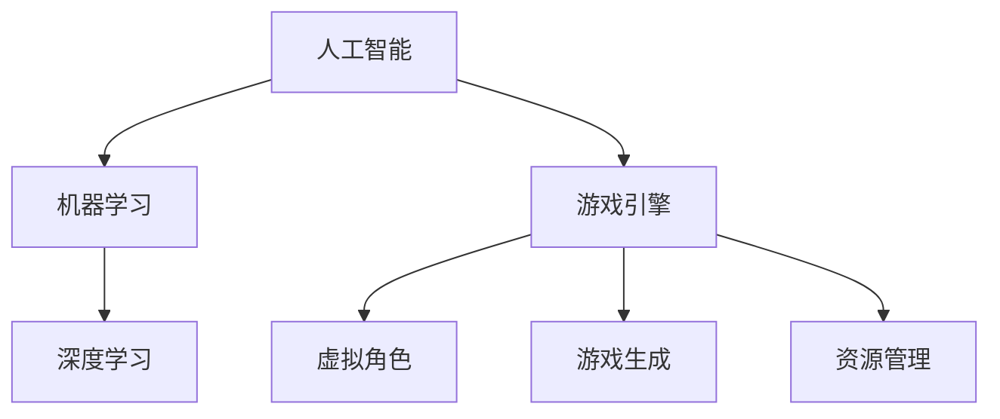

                 

## 1. 背景介绍

随着人工智能技术的发展，AI在游戏开发中的应用日益广泛。AI技术不仅可以提升游戏的交互性和沉浸感，还能降低游戏开发的成本，提高游戏效率。本文将从游戏开发的角度，探讨AI的实际应用，包括NPC控制、游戏生成、资源管理等方面。通过详细阐述这些应用，我们将深入理解AI在游戏开发中的应用价值及其前景。

## 2. 核心概念与联系

### 2.1 核心概念概述

为了更好地理解AI在游戏开发中的应用，我们先介绍几个核心概念及其相互联系：

- **人工智能（AI）**：指由计算机模拟人类智能行为的技术，包括感知、推理、学习、决策等能力。

- **机器学习（ML）**：指让计算机通过数据训练自动学习经验、改进算法的过程。

- **深度学习（DL）**：指使用神经网络模拟人脑处理数据的方法，用于图像识别、语音识别、自然语言处理等领域。

- **游戏引擎（Game Engine）**：指开发游戏所使用的软件平台，如Unity、Unreal Engine等，这些引擎内置了AI库和工具，方便开发者使用。

- **虚拟角色（Virtual Characters）**：指游戏中可以互动的NPC等角色，通过AI技术实现其行为和决策。

- **游戏生成（Game Generation）**：指使用AI技术生成游戏中的场景、任务等元素，丰富游戏内容。

- **资源管理（Resource Management）**：指游戏中的资源优化和调度，如动态生成、加载和卸载资源，提升游戏性能。

这些概念之间的逻辑关系可以通过以下Mermaid流程图来展示：



这个流程图展示了几大核心概念及其相互联系：

1. AI技术是机器学习、深度学习的理论基础，为游戏引擎中虚拟角色和游戏生成的实现提供算法支持。
2. 游戏引擎集成了AI库和工具，方便开发者使用AI技术进行游戏开发。
3. 虚拟角色和游戏生成都依赖于AI技术实现其行为和决策，提升游戏的交互性和沉浸感。
4. 资源管理则通过AI优化和调度资源，提升游戏性能。

## 3. 核心算法原理 & 具体操作步骤

### 3.1 算法原理概述

AI在游戏开发中的应用，主要涉及以下几个算法原理：

- **行为树（Behavior Trees）**：一种基于树形结构的决策算法，用于控制虚拟角色的行为。行为树由根节点、子节点和叶节点组成，每个节点代表一种行为。

- **强化学习（Reinforcement Learning）**：通过奖励和惩罚机制，训练虚拟角色在环境中学习最优策略，实现智能决策。

- **生成对抗网络（Generative Adversarial Networks, GANs）**：一种用于生成逼真游戏内容的算法，由生成器和判别器组成，生成器生成游戏内容，判别器判断内容的真实性。

- **强化学习与深度学习结合**：通过深度神经网络进行特征提取，强化学习进行策略优化，实现智能游戏AI。

### 3.2 算法步骤详解

以下我们详细介绍这些核心算法的详细步骤：

#### 3.2.1 行为树算法

1. **设计行为树结构**：根据角色行为设计行为树，包括根节点、子节点和叶节点。
2. **实现行为节点**：为每个节点编写具体行为，如移动、攻击、对话等。
3. **添加控制条件**：为节点添加条件判断，如判断是否到达目标位置、是否接收到指令等。
4. **运行行为树**：根据当前环境状态，按照行为树结构执行行为，实现角色的智能行为。

#### 3.2.2 强化学习算法

1. **定义状态和动作空间**：定义游戏环境中的状态空间和角色可以采取的动作。
2. **设计奖励和惩罚机制**：定义角色在不同状态下的奖励和惩罚。
3. **训练智能体**：使用强化学习算法（如Q-learning、Deep Q-Network等）训练角色智能体。
4. **验证和优化**：在测试环境中验证智能体的表现，根据表现优化策略。

#### 3.2.3 GAN算法

1. **设计生成器和判别器**：生成器生成游戏内容，判别器判断内容的真实性。
2. **训练生成器和判别器**：使用对抗训练方法，不断提升生成器的生成能力，同时提升判别器的判断能力。
3. **生成游戏内容**：使用训练好的生成器，生成逼真的游戏场景和角色。

#### 3.2.4 强化学习与深度学习结合

1. **定义状态和动作空间**：定义游戏环境中的状态空间和角色可以采取的动作。
2. **设计奖励和惩罚机制**：定义角色在不同状态下的奖励和惩罚。
3. **设计深度神经网络**：设计深度神经网络进行特征提取和决策优化。
4. **训练智能体**：使用强化学习算法训练角色智能体，不断优化神经网络参数。
5. **验证和优化**：在测试环境中验证智能体的表现，根据表现优化策略和神经网络。

### 3.3 算法优缺点

AI在游戏开发中的应用具有以下优点：

- **提高游戏体验**：通过智能NPC和动态生成游戏内容，提升游戏的沉浸感和趣味性。
- **降低开发成本**：AI技术可以自动生成大量游戏内容，减少人工设计和调试的投入。
- **提升游戏效率**：通过AI优化资源管理和游戏生成，减少计算和存储资源消耗，提升游戏性能。

同时，这些算法也存在一些局限性：

- **训练数据需求高**：训练强化学习智能体需要大量游戏数据，数据获取成本高。
- **复杂度较高**：行为树和强化学习算法实现复杂，开发难度大。
- **模型鲁棒性不足**：生成对抗网络生成的内容可能存在缺陷，鲁棒性不足。
- **伦理问题**：虚拟角色的行为可能引发伦理问题，如暴力、歧视等。

尽管存在这些局限性，但AI在游戏开发中的应用前景依然广阔，值得我们深入研究。

### 3.4 算法应用领域

AI在游戏开发中的应用领域广泛，以下列举几个典型应用场景：

- **智能NPC控制**：通过行为树和强化学习算法，实现NPC的智能行为，提升玩家互动体验。

- **游戏生成**：使用GAN等生成算法，自动生成逼真的游戏场景、角色和物品，丰富游戏内容。

- **资源管理**：通过AI优化资源调度，实现动态生成、加载和卸载资源，提升游戏性能。

- **情感交互**：通过深度学习算法，实现虚拟角色对玩家情感的识别和响应，增强游戏沉浸感。

## 4. 数学模型和公式 & 详细讲解

### 4.1 数学模型构建

在本节中，我们将详细介绍AI在游戏开发中的数学模型构建，以深度学习算法为例：

假设游戏环境中的状态空间为 $\mathcal{S}$，动作空间为 $\mathcal{A}$，奖励函数为 $R(\cdot)$。我们使用深度神经网络进行状态特征提取，网络输出为 $\mathbf{z}=\mathbf{f}(\mathbf{s})$，其中 $\mathbf{s} \in \mathcal{S}$。

### 4.2 公式推导过程

1. **定义状态特征提取网络**
$$
\mathbf{z}=\mathbf{f}(\mathbf{s})
$$

2. **定义价值函数**
$$
V(\mathbf{z})=\mathbf{w}^\top \sigma(\mathbf{z})
$$
其中 $\mathbf{w}$ 为权重向量，$\sigma$ 为激活函数。

3. **定义动作选择策略**
$$
\pi(\mathbf{a}| \mathbf{z})=\sigma(\mathbf{W}_\mathbf{a}\mathbf{z}+\mathbf{b}_\mathbf{a})
$$
其中 $\mathbf{W}_\mathbf{a}$ 和 $\mathbf{b}_\mathbf{a}$ 为动作选择策略的权重和偏置。

### 4.3 案例分析与讲解

以智能NPC控制为例，分析AI在游戏中的实际应用。

1. **状态和动作定义**
$$
\mathcal{S}=\{(x, y)\}
$$
$$
\mathcal{A}=\{0, 1\}
$$

2. **状态特征提取**
$$
\mathbf{z}=\mathbf{f}((x, y))
$$

3. **价值函数**
$$
V(\mathbf{z})=\mathbf{w}^\top \sigma(\mathbf{z})
$$

4. **动作选择策略**
$$
\pi(\mathbf{a}| \mathbf{z})=\sigma(\mathbf{W}_\mathbf{a}\mathbf{z}+\mathbf{b}_\mathbf{a})
$$

通过以上步骤，我们可以构建一个智能NPC的控制模型，实现其在游戏中的自主行为。

## 5. 项目实践：代码实例和详细解释说明

### 5.1 开发环境搭建

在进行AI在游戏开发中的应用时，我们需要准备以下开发环境：

1. **安装Python**：从官网下载并安装Python，建议安装最新版本，如3.8以上。

2. **安装PyTorch**：
```bash
pip install torch torchvision torchaudio
```

3. **安装TensorFlow**：
```bash
pip install tensorflow
```

4. **安装Unity或Unreal Engine**：
- **Unity**：从官网下载安装Unity Hub，选择合适的版本进行安装。
- **Unreal Engine**：从官网下载安装Unreal Engine Installer，按照指引进行安装。

### 5.2 源代码详细实现

以下是一个使用PyTorch实现的智能NPC控制示例代码：

```python
import torch
import torch.nn as nn
import torch.optim as optim

class Network(nn.Module):
    def __init__(self):
        super(Network, self).__init__()
        self.fc1 = nn.Linear(2, 64)
        self.fc2 = nn.Linear(64, 2)
        
    def forward(self, x):
        x = torch.relu(self.fc1(x))
        x = torch.sigmoid(self.fc2(x))
        return x

# 定义状态和动作
states = [[0, 0], [10, 0], [0, 10], [10, 10]]
actions = [0, 1]

# 构建网络
net = Network()

# 定义损失函数和优化器
criterion = nn.BCELoss()
optimizer = optim.SGD(net.parameters(), lr=0.1)

# 训练智能体
for epoch in range(100):
    for state in states:
        # 前向传播
        output = net(torch.tensor(state, dtype=torch.float))
        # 计算损失
        loss = criterion(output, torch.tensor(actions))
        # 反向传播
        optimizer.zero_grad()
        loss.backward()
        optimizer.step()
```

### 5.3 代码解读与分析

以上代码实现了一个简单的智能NPC控制模型，使用了PyTorch框架进行神经网络的搭建和训练。

1. **定义网络结构**：使用两个全连接层，其中第一个层有64个神经元，第二个层输出2个动作概率。

2. **定义状态和动作**：状态表示NPC的位置，动作表示移动方向。

3. **训练智能体**：通过前向传播、计算损失、反向传播和优化，不断训练智能体，使其能够根据状态选择动作。

4. **验证和优化**：在测试环境中验证智能体的表现，根据表现优化策略和神经网络。

### 5.4 运行结果展示

运行上述代码后，智能体可以在游戏环境中实现基本的移动行为，具有一定的智能性。

## 6. 实际应用场景

### 6.1 智能NPC控制

智能NPC控制是AI在游戏开发中最基础的应用之一，通过AI技术实现NPC的智能行为，提升游戏互动性和趣味性。

例如，在《巫师3：狂猎》中，NPC会根据玩家行为选择不同的对话和行动，增强了游戏的沉浸感和互动体验。

### 6.2 游戏生成

游戏生成是AI在游戏开发中的重要应用，通过生成逼真的游戏内容，丰富游戏世界，提升游戏体验。

例如，《天际》中的开放世界生成器，可以动态生成山脉、河流、城镇等，使得游戏世界更加逼真和多样化。

### 6.3 资源管理

资源管理是AI在游戏开发中的另一重要应用，通过优化资源调度，提升游戏性能，降低开发成本。

例如，Unity中的资源加载管理器，可以动态加载和卸载资源，减少内存占用，提升游戏性能。

## 7. 工具和资源推荐

### 7.1 学习资源推荐

为了帮助开发者系统掌握AI在游戏开发中的应用，这里推荐一些优质的学习资源：

1. **《Deep Learning for Game Developers》书籍**：介绍AI在游戏开发中的基本概念和算法实现，适合初学者学习。

2. **Coursera上的“AI for Games”课程**：由Google和UCLA合作开设的课程，涵盖AI在游戏开发中的各个方面，适合进阶学习。

3. **Unity官方文档**：包含AI在游戏开发中的各种API和示例代码，适合Unity开发者参考。

4. **Unreal Engine官方文档**：包含AI在游戏开发中的各种API和示例代码，适合Unreal Engine开发者参考。

5. **AI Game Development Stack Exchange**：一个专门讨论AI在游戏开发中的问题和解决方案的社区，适合开发者交流和学习。

### 7.2 开发工具推荐

以下是几款用于AI在游戏开发中的常用工具：

1. **PyTorch**：基于Python的开源深度学习框架，支持动态计算图，适合快速迭代研究。

2. **TensorFlow**：由Google主导开发的开源深度学习框架，生产部署方便，适合大规模工程应用。

3. **Unity AI Composer**：Unity内置的AI设计工具，通过可视化界面快速设计AI行为树。

4. **Unreal Engine Blueprints**：Unreal Engine内置的可视化编程工具，支持AI行为树和智能体设计。

5. **Weights & Biases**：模型训练的实验跟踪工具，可以记录和可视化模型训练过程中的各项指标，方便对比和调优。

6. **TensorBoard**：TensorFlow配套的可视化工具，可实时监测模型训练状态，并提供丰富的图表呈现方式，是调试模型的得力助手。

### 7.3 相关论文推荐

AI在游戏开发中的应用涉及多种前沿技术，以下是几篇奠基性的相关论文，推荐阅读：

1. **"Behavior Trees: A Methodology for Using Rapid Prototyping in Agents"**：行为树算法的经典论文，详细介绍了行为树的实现和应用。

2. **"Playing Atari with deep reinforcement learning"**：使用强化学习算法实现智能NPC控制的经典论文，展示了AI在游戏中的应用潜力。

3. **"Generative Adversarial Nets"**：生成对抗网络（GANs）的奠基性论文，详细介绍了GAN的算法原理和应用。

4. **"Deep Q-Networks for Game Playing"**：强化学习与深度学习结合的经典论文，展示了AI在游戏中的实际应用。

这些论文代表了大语言模型微调技术的发展脉络。通过学习这些前沿成果，可以帮助研究者把握学科前进方向，激发更多的创新灵感。

## 8. 总结：未来发展趋势与挑战

### 8.1 总结

本文对AI在游戏开发中的应用进行了全面系统的介绍。从智能NPC控制到游戏生成，从资源管理到游戏引擎，详细阐述了AI在游戏开发中的各种应用。通过系统梳理，我们可以深入理解AI在游戏开发中的价值和前景。

## 8.2 未来发展趋势

展望未来，AI在游戏开发中的应用将呈现以下几个发展趋势：

1. **更加智能的NPC**：随着AI技术的发展，未来的智能NPC将具备更高的自主性和智能性，能够实现更加复杂和多样的行为。

2. **更加逼真的游戏生成**：通过更加先进的生成算法，未来的游戏生成将更加逼真和多样化，提升游戏世界的沉浸感。

3. **更加高效的游戏引擎**：未来的游戏引擎将更加高效和灵活，能够实现动态生成、动态加载和卸载资源，提升游戏性能。

4. **更加全面的AI技术**：未来的AI技术将更加全面和多样化，涵盖感知、推理、学习、决策等多个方面，提升游戏的智能化水平。

这些趋势将进一步推动AI在游戏开发中的应用，为游戏行业带来新的变革。

### 8.3 面临的挑战

尽管AI在游戏开发中的应用前景广阔，但在迈向更加智能化、普适化应用的过程中，仍面临诸多挑战：

1. **数据需求高**：训练智能体和生成逼真内容需要大量数据，数据获取成本高。

2. **计算资源需求高**：生成逼真内容和高智能度NPC需要高性能计算资源，对硬件设备提出了更高的要求。

3. **开发难度大**：AI在游戏开发中的应用涉及多种技术，开发难度大，需要跨学科的知识和技能。

4. **伦理问题**：虚拟角色的行为可能引发伦理问题，如暴力、歧视等，需要重视。

5. **用户体验问题**：AI技术的应用可能会影响用户体验，需要重视用户体验的设计和优化。

6. **技术融合问题**：AI技术与游戏技术的融合需要更多探索和实践，需要多方协同创新。

这些挑战需要开发者持续关注和解决，才能将AI技术在游戏开发中的应用推向更高的台阶。

### 8.4 研究展望

未来，AI在游戏开发中的应用将继续深入探索，并与其他技术进行更多融合，推动游戏行业的创新和进步。

1. **AI与游戏技术的融合**：将AI技术与游戏技术进行更多融合，如AI与VR/AR的结合，实现更加沉浸的游戏体验。

2. **AI与机器学习的融合**：将AI技术与机器学习进行更多融合，实现更加智能化的游戏AI。

3. **AI与区块链的融合**：将AI技术与区块链进行更多融合，实现更加安全和可靠的游戏环境。

4. **AI与增强现实（AR）的融合**：将AI技术与AR技术进行更多融合，实现更加逼真的游戏世界。

5. **AI与社交网络的融合**：将AI技术与社交网络进行更多融合，实现更加社交化的游戏体验。

这些研究方向的探索，将进一步拓展AI在游戏开发中的应用场景，为游戏行业带来更多的创新和发展机会。

## 9. 附录：常见问题与解答

**Q1: AI在游戏开发中的应用是否存在伦理问题？**

A: AI在游戏开发中的应用可能存在伦理问题，如虚拟角色的行为可能引发暴力、歧视等。开发者需要重视伦理问题，设计合理的行为机制，确保虚拟角色的行为符合人类价值观和伦理道德。

**Q2: AI在游戏开发中的应用需要多少数据？**

A: AI在游戏开发中的应用需要大量数据，训练智能体和生成逼真内容需要海量游戏数据。数据获取成本高，需要开发者持续积累和优化数据集。

**Q3: AI在游戏开发中的应用是否需要高性能计算资源？**

A: 是的，生成逼真内容和高智能度NPC需要高性能计算资源，对硬件设备提出了更高的要求。开发者需要合理配置硬件设备，优化计算资源的使用。

**Q4: AI在游戏开发中的应用是否容易开发？**

A: 不是，AI在游戏开发中的应用涉及多种技术，开发难度大，需要跨学科的知识和技能。开发者需要具备多种技术背景和开发经验。

**Q5: AI在游戏开发中的应用是否需要持续优化？**

A: 是的，AI在游戏开发中的应用需要持续优化，才能适应不断变化的游戏环境和玩家需求。开发者需要不断迭代和优化AI模型，提升游戏体验。

以上总结了AI在游戏开发中的应用及其未来发展趋势，相信这些内容对开发者在实际应用中有一定的指导意义。通过持续学习和探索，我们能够更好地利用AI技术，提升游戏开发的效率和质量，创造更加沉浸和智能的游戏体验。

