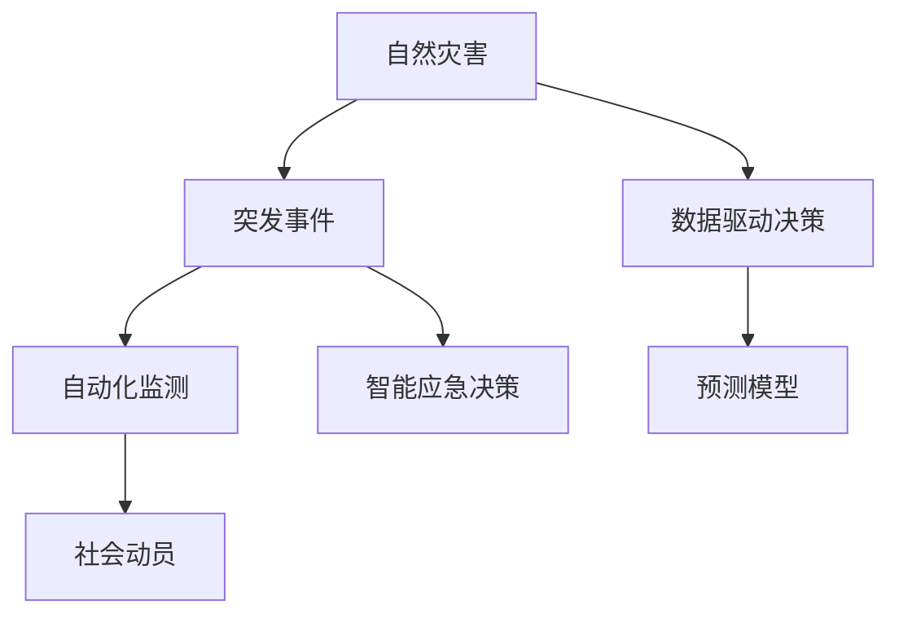

                 

## 1. 背景介绍

### 1.1 问题由来

随着全球气候变化和城市化进程的加剧，自然和人为灾害频繁发生，给人类社会带来巨大威胁。灾害预防和应急管理成为保障公共安全和提升社会稳定性的重要任务。传统的灾害管理依赖于人工监测、经验判断和有限的信息资源，存在响应速度慢、覆盖范围有限等问题。近年来，人工智能(AI)技术在灾害预防和应急管理中的应用逐渐兴起，为提高灾害应对的效率和效果提供了新的可能。

### 1.2 问题核心关键点

AI在灾害预防和应急管理中的应用，主要集中在以下几个方面：

- 数据驱动决策：通过收集、分析和处理海量灾害数据，辅助灾害预警和应急响应决策。
- 自动化监测：利用传感器、无人机、卫星等技术，实现对灾害的实时监测和预警。
- 预测模型构建：应用机器学习、深度学习等技术，建立灾害风险评估模型，预测灾害发生的可能性和影响程度。
- 智能应急决策：使用自然语言处理(NLP)、图像识别等技术，辅助决策者和一线应急人员制定更有效的应急措施。
- 社会动员与协作：利用社交媒体、网络平台等工具，及时传达灾害信息，动员社会力量参与救灾。

这些应用提升了灾害应对的精准性和效率，有助于减少灾害损失，保障公众安全。然而，AI在灾害管理中的应用也面临数据质量、模型鲁棒性、人机协同等问题，需要通过不断的技术创新和优化来解决。

## 2. 核心概念与联系

### 2.1 核心概念概述

为了更好地理解AI在灾害预防和应急管理中的应用，需要首先明确几个核心概念：

- 自然灾害：指由于自然因素（如地震、洪水、台风等）引起的灾害，具有突发性强、范围广、破坏力大等特点。
- 突发事件：指突然发生、需要迅速应对的各种紧急情况，包括自然灾害、事故灾害、公共卫生事件等。
- 数据驱动决策：基于历史数据和实时数据，利用AI技术辅助决策者制定最优的应急方案。
- 自动化监测：通过各类传感器、无人机、卫星等技术，实现对灾害的实时监测和预警。
- 预测模型：使用机器学习算法，对历史数据进行学习和预测，评估灾害发生的概率和影响。
- 智能应急决策：结合NLP、图像识别等技术，辅助一线应急人员进行快速、准确的决策。
- 社会动员：利用社交媒体、网络平台等工具，快速传达灾害信息，动员社会力量参与救灾。

这些概念之间的联系紧密，共同构成了AI在灾害预防和应急管理中的应用框架。通过理解这些核心概念，可以更好地把握AI技术在灾害管理中的应用方向和实现路径。

### 2.2 核心概念原理和架构的 Mermaid 流程图



这个流程图展示了AI在灾害预防和应急管理中的应用路径：

1. 自然灾害的发生触发突发事件的报警，进入灾害应对流程。
2. 数据驱动决策和自动化监测分别通过收集和实时监测灾害数据，辅助决策和预警。
3. 预测模型基于历史数据预测灾害可能性和影响，为应急决策提供参考。
4. 智能应急决策结合NLP、图像识别等技术，辅助一线人员快速决策。
5. 社会动员利用社交媒体等工具，快速传达灾害信息，动员社会力量。

这些环节紧密相连，共同构成了一个完整、高效的灾害应对系统。

## 3. 核心算法原理 & 具体操作步骤

### 3.1 算法原理概述

AI在灾害预防和应急管理中的应用，主要依赖于以下几个关键算法：

- 机器学习与深度学习：用于构建预测模型和辅助决策的算法，通过历史数据训练模型，预测灾害发生的可能性和影响。
- 自然语言处理(NLP)：用于理解灾害相关文本数据，辅助灾害监测、应急决策和社会动员。
- 计算机视觉：用于图像识别和分析，辅助灾害监测和现场评估。
- 强化学习：用于优化应急决策，通过模拟应急场景训练决策模型。

这些算法通过协同工作，实现了对灾害的全面监测、预测、应对和社会动员。

### 3.2 算法步骤详解

以AI在自然灾害监测中的应用为例，详细介绍AI在灾害预防和应急管理中的操作步骤：

**Step 1: 数据收集与预处理**

- 收集历史灾害数据、实时传感器数据、卫星遥感数据等，确保数据全面、准确、时效性高。
- 对数据进行清洗、去重、格式化处理，保证数据质量。

**Step 2: 模型训练与评估**

- 使用机器学习或深度学习算法，训练灾害预测模型。常用的模型包括决策树、随机森林、支持向量机、神经网络等。
- 使用历史数据对模型进行训练和验证，评估模型的准确性和鲁棒性。
- 调整模型参数，优化模型性能。

**Step 3: 灾害监测与预警**

- 利用传感器、无人机、卫星等技术，实时监测灾害发生的前兆和迹象。
- 将监测数据输入训练好的预测模型，评估灾害发生的概率和影响。
- 根据模型预测结果，及时发出灾害预警。

**Step 4: 智能应急决策**

- 结合NLP、计算机视觉等技术，解析灾害相关文本数据和图像数据，辅助决策。
- 使用强化学习等技术，训练应急决策模型，优化决策路径。
- 在灾害发生时，实时提供最优的应急措施和资源调度建议。

**Step 5: 社会动员**

- 利用社交媒体、网络平台等工具，快速传达灾害信息，动员社会力量参与救灾。
- 实时跟踪救灾进展，动态调整应急措施和社会动员策略。

### 3.3 算法优缺点

AI在灾害预防和应急管理中的应用具有以下优点：

- 数据驱动决策：基于历史和实时数据，提高决策的科学性和准确性。
- 自动化监测：提高灾害监测的速度和范围，减少人工成本。
- 预测模型：提高灾害预警的精度，减少灾害损失。
- 智能应急决策：辅助决策者快速制定有效应急方案。
- 社会动员：快速传达灾害信息，动员社会力量参与救灾。

然而，这些算法也存在一些局限性：

- 数据质量：数据来源多样，质量参差不齐，可能影响模型预测结果。
- 模型鲁棒性：模型预测可能受数据偏差和异常情况影响，导致预警不及时或不准确。
- 人机协同：需要加强人机协同，避免过度依赖AI，确保应急决策的灵活性和可靠性。
- 技术门槛：AI技术的应用需要较高的技术门槛，对技术团队的要求较高。
- 伦理与隐私：灾害数据涉及敏感信息，需要确保数据的隐私保护和伦理合规。

### 3.4 算法应用领域

AI在灾害预防和应急管理中的应用，涵盖了以下几个主要领域：

- 自然灾害监测：利用传感器、无人机、卫星等技术，实时监测灾害发生的前兆和迹象。
- 灾害预测与预警：基于历史和实时数据，构建预测模型，评估灾害发生的概率和影响。
- 应急决策与指挥：结合NLP、计算机视觉等技术，辅助决策者快速制定有效应急方案。
- 社会动员与协作：利用社交媒体、网络平台等工具，快速传达灾害信息，动员社会力量参与救灾。
- 灾害评估与恢复：利用图像识别等技术，评估灾害影响，辅助灾后重建和恢复。

这些应用领域展示了AI在灾害管理中的广泛应用和潜力。通过AI技术的应用，可以显著提升灾害应对的效率和效果，保障公众安全和社会稳定。

## 4. 数学模型和公式 & 详细讲解 & 举例说明

### 4.1 数学模型构建

在灾害预测与预警中，常用的数学模型包括回归模型、分类模型和时序模型等。这里以回归模型为例，介绍AI在灾害预防和应急管理中的应用。

设灾害发生的时间为$t$，其影响程度为$Y(t)$，影响因素为$X(t)=(x_1(t),x_2(t),...,x_n(t))$，其中$x_i(t)$表示第$i$个影响因素在时间$t$的值。构建回归模型$\hat{Y}(t)=f(X(t))$，用于预测灾害的影响程度。

### 4.2 公式推导过程

以线性回归模型为例，假设影响因素$X(t)$与灾害影响程度$Y(t)$之间存在线性关系，即：

$$
Y(t) = \beta_0 + \beta_1 x_1(t) + \beta_2 x_2(t) + ... + \beta_n x_n(t) + \epsilon(t)
$$

其中$\beta_i$为第$i$个影响因素的回归系数，$\epsilon(t)$为误差项。

使用历史数据$(X_i,Y_i)$进行最小二乘法估计，求解回归系数$\beta_i$：

$$
\hat{\beta_i} = \frac{\sum_{i=1}^{m}(X_i-\bar{X})(Y_i-\bar{Y})}{\sum_{i=1}^{m}(X_i-\bar{X})^2}
$$

其中$m$为样本数量，$\bar{X}$和$\bar{Y}$分别为$X$和$Y$的均值。

得到回归系数$\hat{\beta_i}$后，构建预测模型$\hat{Y}(t)=\hat{\beta_0}+\hat{\beta_1}x_1(t)+\hat{\beta_2}x_2(t)+...+\hat{\beta_n}x_n(t)$，用于预测灾害发生的可能性和影响程度。

### 4.3 案例分析与讲解

以洪水灾害预测为例，介绍如何应用回归模型进行灾害预测与预警。

假设洪水灾害的影响因素包括降雨量、河流水位、土地坡度等，构建如下线性回归模型：

$$
\hat{P}(t) = \beta_0 + \beta_1 R(t) + \beta_2 W(t) + \beta_3 S(t) + \epsilon(t)
$$

其中$\hat{P}(t)$表示洪水发生的概率，$R(t)$、$W(t)$和$S(t)$分别表示降雨量、河流水位和土地坡度，$\beta_0$、$\beta_1$、$\beta_2$和$\beta_3$为回归系数，$\epsilon(t)$为误差项。

收集历史洪水数据$(X_i,Y_i)$，使用最小二乘法求解回归系数$\hat{\beta_i}$，构建预测模型$\hat{P}(t)=\hat{\beta_0}+\hat{\beta_1}R(t)+\hat{\beta_2}W(t)+\hat{\beta_3}S(t)$。在实际应用中，实时监测降雨量、河流水位和土地坡度，输入预测模型，输出洪水发生的概率，及时发出预警。

## 5. 项目实践：代码实例和详细解释说明

### 5.1 开发环境搭建

为了实现AI在灾害预防和应急管理中的应用，需要搭建相应的开发环境。以下是Python和TensorFlow环境的搭建流程：

1. 安装Anaconda：从官网下载并安装Anaconda，用于创建独立的Python环境。

2. 创建并激活虚拟环境：
```bash
conda create -n tf-env python=3.8
conda activate tf-env
```

3. 安装TensorFlow：从官网获取对应的安装命令。例如：
```bash
pip install tensorflow==2.6
```

4. 安装TensorBoard：
```bash
pip install tensorboard
```

5. 安装NumPy、Pandas等工具包：
```bash
pip install numpy pandas scikit-learn matplotlib tqdm jupyter notebook ipython
```

完成上述步骤后，即可在`tf-env`环境中开始AI在灾害预防和应急管理中的应用开发。

### 5.2 源代码详细实现

下面我们以洪水灾害预测为例，给出使用TensorFlow和Keras框架进行线性回归模型的PyTorch代码实现。

首先，定义数据处理函数：

```python
import numpy as np
from sklearn.model_selection import train_test_split
from sklearn.preprocessing import StandardScaler

def preprocess_data(X, y):
    # 数据标准化
    scaler = StandardScaler()
    X = scaler.fit_transform(X)
    
    # 划分训练集和测试集
    X_train, X_test, y_train, y_test = train_test_split(X, y, test_size=0.2, random_state=42)
    
    return X_train, X_test, y_train, y_test
```

然后，定义模型和优化器：

```python
from tensorflow.keras.models import Sequential
from tensorflow.keras.layers import Dense

model = Sequential()
model.add(Dense(64, input_dim=X_train.shape[1], activation='relu'))
model.add(Dense(32, activation='relu'))
model.add(Dense(1, activation='linear'))

optimizer = Adam(learning_rate=0.001)
```

接着，定义训练和评估函数：

```python
import tensorflow as tf
from tensorflow.keras import metrics

def train_model(model, X_train, y_train, X_test, y_test, epochs=100, batch_size=64):
    model.compile(optimizer=optimizer, loss='mse', metrics=['mae', 'mse'])
    
    history = model.fit(X_train, y_train, epochs=epochs, batch_size=batch_size, validation_data=(X_test, y_test))
    
    loss, mae, mse = model.evaluate(X_test, y_test)
    print('Test loss:', loss)
    print('Test MAE:', mae)
    print('Test MSE:', mse)
    
    return history

def evaluate_model(model, X_test, y_test):
    mae = metrics.mean_absolute_error(y_test, model.predict(X_test))
    mse = metrics.mean_squared_error(y_test, model.predict(X_test))
    print('MAE:', mae)
    print('MSE:', mse)
```

最后，启动训练流程并在测试集上评估：

```python
X_train, X_test, y_train, y_test = preprocess_data(X, y)
history = train_model(model, X_train, y_train, X_test, y_test)

evaluate_model(model, X_test, y_test)
```

以上就是使用TensorFlow和Keras框架进行洪水灾害预测的完整代码实现。可以看到，通过TensorFlow和Keras库的简单封装，我们能够快速搭建并训练线性回归模型，实现洪水灾害的预测与预警。

### 5.3 代码解读与分析

让我们再详细解读一下关键代码的实现细节：

**preprocess_data函数**：
- 对输入数据进行标准化处理，以提升模型的训练效果。
- 将数据划分为训练集和测试集，确保模型评估的准确性。

**train_model函数**：
- 定义模型结构，使用64个神经元的全连接层，ReLU激活函数和线性输出层。
- 使用Adam优化器和均方误差损失函数训练模型，评估指标包括均方误差和平均绝对误差。
- 在训练过程中，使用TensorBoard实时记录模型训练的指标变化。
- 在测试集上评估模型性能，输出测试损失、平均绝对误差和均方误差。

**evaluate_model函数**：
- 使用均方误差和平均绝对误差评估模型在测试集上的表现。
- 将评估结果输出到控制台，方便查看。

可以看到，TensorFlow和Keras库使得AI模型的开发和训练变得更加简单高效，开发者可以专注于模型的设计和优化，而不必过多关注底层实现细节。

## 6. 实际应用场景

### 6.1 智能防灾预警系统

智能防灾预警系统通过实时监测各类环境数据，结合AI预测模型，提前预警自然灾害的发生，减少灾害损失。系统主要包括以下几个关键组件：

- 传感器网络：部署各类传感器，实时监测水位、降雨量、土壤湿度等环境数据。
- 数据处理中心：对传感器数据进行实时处理和分析，输入预测模型进行灾害预警。
- 预警发布平台：将预警信息实时发布到政府、媒体、公众等多个渠道，快速传达灾害信息。
- 应急指挥中心：根据预警信息，及时调度应急资源和人员，制定最优应急方案。

智能防灾预警系统的核心在于实时数据收集和处理，以及预测模型的构建和优化。通过AI技术的应用，系统能够实现对灾害的精准预警和快速响应，保障公众安全和社会稳定。

### 6.2 灾害现场勘查与评估

灾害现场勘查与评估是灾害管理的重要环节，通过图像识别、无人机巡检等技术，实时获取现场信息，辅助决策和恢复。系统主要包括以下几个关键组件：

- 无人机平台：部署无人机，对灾区进行巡检，实时采集现场图像和视频数据。
- 图像识别模块：使用深度学习算法，对图像进行识别和分析，提取关键信息。
- 数据融合平台：将无人机数据和现场人工采集的数据进行融合，构建灾区全景图。
- 灾害评估模块：根据现场图像和视频数据，结合历史数据和预测模型，评估灾害影响。
- 救援方案制定模块：根据灾害评估结果，制定最优救援方案，快速调度应急资源。

灾害现场勘查与评估系统的关键在于图像识别和数据融合技术的应用，通过AI技术，系统能够快速获取灾区信息，辅助灾害评估和救援决策。

### 6.3 社会动员与信息发布

社会动员与信息发布是灾害应对的重要环节，通过社交媒体、网络平台等工具，快速传达灾害信息，动员社会力量参与救灾。系统主要包括以下几个关键组件：

- 信息发布平台：利用社交媒体、新闻网站等平台，实时发布灾害信息。
- 信息筛选模块：对发布的信息进行筛选和验证，确保信息真实可靠。
- 社会动员模块：通过社交媒体、网络平台等工具，快速动员社会力量参与救灾。
- 舆情监控模块：实时监控社交媒体、网络平台上的舆情动态，及时处理负面信息。

社会动员与信息发布系统的核心在于信息传播和舆情监控技术的应用，通过AI技术，系统能够快速传播灾害信息，动员社会力量参与救灾，保障公众安全。

### 6.4 未来应用展望

随着AI技术的发展，未来在灾害预防和应急管理中的应用将更加广泛和深入。以下是几个未来应用展望：

- 全域感知：通过传感器、无人机、卫星等技术，构建全域感知网络，实时监测各类灾害信息。
- 动态评估与预警：结合历史数据和实时数据，构建动态评估模型，实时预警各类灾害。
- 智能决策与指挥：结合NLP、计算机视觉等技术，辅助决策者制定最优应急方案，提高应急决策的科学性和准确性。
- 人机协同：增强人机协同，充分发挥人类决策经验和AI技术的优势，提高灾害应对的效率和效果。
- 综合集成：整合各类信息资源，构建综合集成平台，实现跨部门、跨地域的协同应对。

这些应用展望展示了AI在灾害预防和应急管理中的巨大潜力和广阔前景。未来，随着AI技术的不断进步和创新，灾害应对的效率和效果将进一步提升，为人类社会的可持续发展提供有力保障。

## 7. 工具和资源推荐

### 7.1 学习资源推荐

为了帮助开发者系统掌握AI在灾害预防和应急管理中的应用，这里推荐一些优质的学习资源：

1. 《深度学习》课程（斯坦福大学）：斯坦福大学开设的深度学习课程，涵盖了深度学习的基本概念、算法和应用。
2. TensorFlow官方文档：TensorFlow官方文档，提供了丰富的教程和示例，是学习AI技术的必备资源。
3. Keras官方文档：Keras官方文档，提供了简单易用的API接口，快速实现AI模型。
4. 《深度学习实战》书籍：吴恩达的深度学习实战书籍，详细介绍了深度学习模型的构建和训练。
5. 《自然语言处理综论》书籍：斯坦福大学自然语言处理综论课程讲义，介绍了自然语言处理的基本概念和算法。

通过对这些资源的学习实践，相信你一定能够快速掌握AI在灾害预防和应急管理中的应用，并用于解决实际的灾害问题。

### 7.2 开发工具推荐

高效的开发离不开优秀的工具支持。以下是几款用于AI在灾害预防和应急管理中的应用开发的常用工具：

1. TensorFlow：由Google主导开发的深度学习框架，生产部署方便，适合大规模工程应用。
2. Keras：高层次的深度学习API，适合快速搭建和训练深度学习模型。
3. Jupyter Notebook：交互式Python开发环境，支持代码编写和实时展示，方便开发和调试。
4. TensorBoard：TensorFlow配套的可视化工具，可实时监测模型训练状态，提供丰富的图表呈现方式。
5. GCP/AWS/Google Cloud AI Platform：云计算平台，提供强大的计算资源和工具支持。

合理利用这些工具，可以显著提升AI在灾害预防和应急管理中的应用开发效率，加快创新迭代的步伐。

### 7.3 相关论文推荐

AI在灾害预防和应急管理中的应用，得益于学界的持续研究。以下是几篇奠基性的相关论文，推荐阅读：

1. "A Survey on Disaster Prediction and Warning"：综述了各类灾害预测与预警方法，介绍了AI技术在灾害管理中的应用。
2. "Machine Learning for Natural Disaster Prediction"：介绍了机器学习在洪水、地震等自然灾害预测中的应用。
3. "Disaster Response and Recovery with Machine Learning"：介绍了机器学习在灾后救援与恢复中的应用。
4. "AI for Disaster Management: An Overview"：综述了AI在灾害管理中的各类应用，介绍了AI技术在灾害预防、监测、预警、响应、评估和恢复中的应用。

这些论文代表了大AI在灾害预防和应急管理中的应用的发展脉络。通过学习这些前沿成果，可以帮助研究者把握学科前进方向，激发更多的创新灵感。

## 8. 总结：未来发展趋势与挑战

### 8.1 研究成果总结

本文对AI在灾害预防和应急管理中的应用进行了全面系统的介绍。首先阐述了灾害预防和应急管理的重要性，明确了AI技术在灾害管理中的应用方向和价值。其次，从原理到实践，详细讲解了AI在灾害预防和应急管理中的应用步骤，给出了AI在灾害预测与预警、应急决策与指挥、社会动员与信息发布等领域的完整代码实现。同时，本文还广泛探讨了AI在灾害管理中的应用前景，展示了AI技术的巨大潜力和广阔前景。

通过本文的系统梳理，可以看到，AI技术在灾害预防和应急管理中的应用前景广阔，有望显著提升灾害应对的效率和效果，保障公众安全和社会稳定。未来，随着AI技术的不断进步和创新，AI在灾害管理中的应用将更加深入和广泛，为人类社会的可持续发展提供有力保障。

### 8.2 未来发展趋势

展望未来，AI在灾害预防和应急管理中的应用将呈现以下几个发展趋势：

1. 数据驱动决策：随着大数据、云计算技术的发展，数据驱动决策将成为灾害管理的重要手段。通过收集、分析和处理海量灾害数据，辅助决策者制定最优的应急方案。
2. 自动化监测：各类传感器、无人机、卫星等技术将进一步发展，实现对各类灾害的实时监测和预警。
3. 预测模型优化：随着深度学习、强化学习等技术的进步，预测模型的精度和鲁棒性将进一步提升。
4. 人机协同：通过增强人机协同，充分发挥人类决策经验和AI技术的优势，提高灾害应对的效率和效果。
5. 综合集成：整合各类信息资源，构建综合集成平台，实现跨部门、跨地域的协同应对。

这些趋势展示了AI在灾害管理中的应用前景，相信未来AI技术将更加深入地融入灾害预防和应急管理，为人类社会的可持续发展提供有力保障。

### 8.3 面临的挑战

尽管AI在灾害预防和应急管理中的应用已经取得了显著成果，但在迈向更加智能化、普适化应用的过程中，它仍面临诸多挑战：

1. 数据质量与获取：数据来源多样，质量参差不齐，可能影响模型预测结果。需要加强数据质量管理和数据获取效率。
2. 模型鲁棒性：模型预测可能受数据偏差和异常情况影响，导致预警不及时或不准确。需要进一步提升模型的鲁棒性和泛化能力。
3. 技术门槛：AI技术的应用需要较高的技术门槛，对技术团队的要求较高。需要降低技术门槛，促进技术普及。
4. 伦理与隐私：灾害数据涉及敏感信息，需要确保数据的隐私保护和伦理合规。
5. 基础设施：AI在灾害管理中的应用需要强大的计算和存储基础设施支持。需要进一步提升基础设施的可靠性和稳定性。

这些挑战需要多方共同努力，通过技术创新和管理优化，不断提升AI在灾害管理中的应用效果。

### 8.4 研究展望

面对AI在灾害管理中的应用挑战，未来的研究需要在以下几个方面寻求新的突破：

1. 数据质量管理：通过数据清洗、去重、标准化等手段，提升数据质量，确保模型训练效果。
2. 模型鲁棒性提升：通过引入对抗训练、自适应学习等技术，提升模型的鲁棒性和泛化能力。
3. 技术普及与合作：通过开源项目、技术培训等手段，降低技术门槛，促进AI技术的普及和应用。
4. 伦理与隐私保护：制定数据使用规范，建立数据隐私保护机制，确保AI技术应用的安全性。
5. 基础设施建设：投资建设高性能计算和存储基础设施，保障AI技术在灾害管理中的应用。

这些研究方向的探索，必将引领AI在灾害管理中的应用迈向更高的台阶，为人类社会的可持续发展提供有力保障。面向未来，AI技术还需要与其他人工智能技术进行更深入的融合，如知识表示、因果推理、强化学习等，多路径协同发力，共同推动灾害管理系统的进步。

## 9. 附录：常见问题与解答

**Q1：如何处理数据质量和数据偏差问题？**

A: 数据质量和数据偏差是AI在灾害管理中面临的主要挑战。以下是一些处理数据质量和数据偏差问题的建议：

1. 数据清洗：对数据进行清洗和去重处理，去除噪声和冗余数据，确保数据质量。
2. 数据增强：通过数据增强技术，如数据扩充、数据合成等手段，提升数据的多样性和丰富度。
3. 数据融合：将不同来源的数据进行融合，利用数据的互补性提升预测效果。
4. 异常检测：引入异常检测技术，识别和处理数据中的异常点，避免模型受异常数据影响。
5. 模型鲁棒性提升：通过引入对抗训练、自适应学习等技术，提升模型的鲁棒性和泛化能力，降低数据偏差的影响。

通过上述方法，可以显著提升数据质量和数据鲁棒性，确保AI模型在灾害管理中的应用效果。

**Q2：如何提升AI模型的预测精度和鲁棒性？**

A: 提升AI模型的预测精度和鲁棒性，需要从多个方面进行优化：

1. 数据质量：确保数据的多样性、完整性和准确性，避免数据偏差。
2. 模型选择：选择适合任务的模型结构，如深度学习、支持向量机等，根据任务特点进行优化。
3. 参数调优：通过网格搜索、贝叶斯优化等方法，寻找最优模型参数组合。
4. 正则化：引入L2正则、Dropout等正则化技术，防止模型过拟合。
5. 集成学习：通过集成多个模型的预测结果，提升模型的整体精度和鲁棒性。
6. 对抗训练：引入对抗样本，提高模型鲁棒性和泛化能力。
7. 模型优化：通过模型压缩、剪枝等技术，优化模型结构，提高推理速度和效率。

通过上述方法，可以显著提升AI模型的预测精度和鲁棒性，确保模型在实际应用中的可靠性。

**Q3：如何在灾害管理中应用社会动员与信息发布技术？**

A: 在灾害管理中，社会动员与信息发布技术的应用，可以显著提升灾害应对的效率和效果。以下是一些具体的应用建议：

1. 多渠道信息发布：通过社交媒体、新闻网站、短信、电话等多种渠道，快速发布灾害信息。
2. 信息筛选与验证：对发布的信息进行筛选和验证，确保信息的真实可靠。
3. 社会动员：利用社交媒体、网络平台等工具，快速动员社会力量参与救灾。
4. 舆情监控：实时监控社交媒体、网络平台上的舆情动态，及时处理负面信息。
5. 信息反馈：建立信息反馈机制，收集公众意见和建议，优化信息发布策略。

通过上述方法，可以有效地利用社会动员与信息发布技术，快速传达灾害信息，动员社会力量参与救灾，保障公众安全。

**Q4：如何构建灾害预测模型？**

A: 构建灾害预测模型，主要包括以下几个步骤：

1. 数据收集：收集历史灾害数据、实时传感器数据、卫星遥感数据等，确保数据全面、准确、时效性高。
2. 数据预处理：对数据进行清洗、去重、标准化处理，保证数据质量。
3. 特征工程：提取和选择影响灾害发生的关键特征，构建特征向量。
4. 模型训练：使用机器学习或深度学习算法，训练灾害预测模型。常用的模型包括决策树、随机森林、支持向量机、神经网络等。
5. 模型评估：使用历史数据对模型进行训练和验证，评估模型的准确性和鲁棒性。
6. 模型部署：将训练好的模型部署到生产环境中，实时监测灾害数据，输出预测结果。

通过上述方法，可以构建高精度、高鲁棒性的灾害预测模型，为灾害预警提供重要参考。

**Q5：如何构建智能应急决策系统？**

A: 构建智能应急决策系统，主要包括以下几个步骤：

1. 数据收集：收集灾害相关文本数据和图像数据，确保数据全面、准确、时效性高。
2. 数据预处理：对数据进行清洗、去重、标准化处理，保证数据质量。
3. 模型构建：结合NLP、计算机视觉等技术，构建智能应急决策模型，辅助决策。
4. 模型训练：使用历史数据对模型进行训练和验证，优化模型性能。
5. 模型评估：使用历史数据对模型进行训练和验证，评估模型的准确性和鲁棒性。
6. 模型部署：将训练好的模型部署到生产环境中，实时监测灾害数据，输出最优应急措施。

通过上述方法，可以构建高效、可靠的智能应急决策系统，辅助决策者制定最优应急方案，提高应急决策的科学性和准确性。

---

作者：禅与计算机程序设计艺术 / Zen and the Art of Computer Programming

