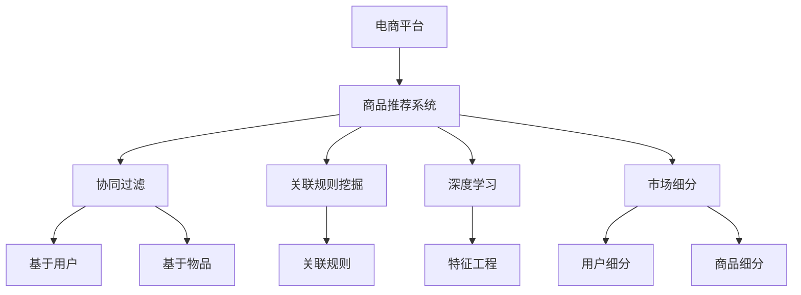

                 

# AI在电商平台商品关联规则挖掘中的应用

> 关键词：电商平台,商品推荐系统,关联规则,协同过滤,深度学习,特征工程,市场细分

## 1. 背景介绍

### 1.1 问题由来

在现代电商平台上，商品推荐系统已经成为了提升用户体验、增加销售转化率的关键环节。传统的推荐系统往往依赖于用户的历史行为数据，如浏览、点击、购买记录等，来构建用户画像，从而实现个性化推荐。然而，这种基于历史行为数据的推荐方式存在着诸多局限性，比如对新用户的冷启动问题、数据稀疏性、用户行为模式的变迁等。为了应对这些挑战，近年来，基于机器学习特别是深度学习的推荐系统逐步成为了主流，尤其在大规模电商平台的商品推荐系统中。

## 2. 核心概念与联系

### 2.1 核心概念概述

为了更好地理解AI在电商平台商品关联规则挖掘中的应用，本节将介绍几个密切相关的核心概念：

- **电商平台**：指基于互联网的综合性购物平台，用户可以在平台上选购商品、发表评价、进行社交互动等。
- **商品推荐系统**：指通过分析用户行为数据，预测用户对商品的兴趣和购买意向，从而实现个性化推荐的技术系统。
- **关联规则挖掘**：指从大规模数据集中挖掘出频繁出现的项集和规则，广泛应用于市场篮分析、交叉销售预测、用户行为分析等领域。
- **协同过滤**：指利用用户之间的相似性来推荐商品，包括基于用户的协同过滤和基于物品的协同过滤两种方式。
- **深度学习**：指利用神经网络模型，通过多层次的非线性特征提取和抽象，进行复杂数据分析和决策的技术。
- **特征工程**：指在深度学习模型的输入数据上进行预处理、特征提取和构造，以提升模型性能。
- **市场细分**：指根据用户属性、行为、兴趣等因素，将市场划分为不同的小市场，实现更精准的营销策略。

这些核心概念之间的逻辑关系可以通过以下Mermaid流程图来展示：



这个流程图展示了几大核心概念及其之间的关系：

1. 电商平台提供商品推荐系统，实现个性化推荐。
2. 商品推荐系统包括协同过滤和关联规则挖掘两种主要方式，用于分析和预测用户兴趣。
3. 协同过滤基于用户之间的相似性进行推荐，分为基于用户和基于物品两种方式。
4. 关联规则挖掘从历史交易数据中挖掘频繁出现的项集和规则。
5. 深度学习利用神经网络模型进行复杂数据处理和决策。
6. 特征工程在深度学习模型的输入数据上进行预处理和特征提取。
7. 市场细分根据用户和商品属性进行市场划分，实现更精准的推荐策略。

## 3. 核心算法原理 & 具体操作步骤
### 3.1 算法原理概述

在电商平台商品推荐系统中，关联规则挖掘用于从历史交易数据中挖掘出用户兴趣和行为模式，进而用于指导商品推荐。其核心思想是：通过频繁项集的挖掘和关联规则的生成，发现用户购买行为中潜在的关联性，从而提升推荐系统的个性化和精准度。

形式化地，假设历史交易数据集为 $D=\{T_1, T_2, ..., T_N\}$，其中 $T_i$ 为第 $i$ 个用户的购买行为记录。关联规则挖掘的目标是找到一组频繁项集 $I$ 和一组相关联的规则 $R$，使得 $R \subseteq I \times I$，满足一定的支持度和置信度阈值。支持度表示该规则在历史数据集中出现的频率，置信度表示规则中前件商品的购买概率对后件商品购买概率的影响。

### 3.2 算法步骤详解

基于关联规则挖掘的电商平台商品推荐系统主要包括以下几个关键步骤：

**Step 1: 数据预处理**

- 收集电商平台的历史交易数据，包括用户ID、商品ID、购买时间、购买数量等信息。
- 对数据进行清洗和格式化，去除缺失值和异常值。
- 将交易数据进行划分，划分为训练集和测试集。

**Step 2: 频繁项集挖掘**

- 使用Apriori、FP-Growth等经典算法，在训练集上挖掘频繁项集。频繁项集指在一定支持度阈值下，同时出现在多个交易记录中的商品组合。
- 利用算法的剪枝技术，提高挖掘效率。

**Step 3: 关联规则生成**

- 基于挖掘得到的频繁项集，生成关联规则。关联规则指频繁项集的组合，表示“如果购买商品A，则购买商品B的概率”。
- 根据置信度阈值筛选规则，剔除置信度低的规则。

**Step 4: 规则评估**

- 在测试集上评估关联规则的有效性。评估指标包括精确率、召回率、F1值等。
- 根据评估结果调整规则参数，如支持度和置信度阈值。

**Step 5: 推荐引擎集成**

- 将挖掘得到的关联规则集成到推荐引擎中。
- 在推荐时，根据用户历史行为数据和当前浏览行为，动态计算推荐商品的概率分布。
- 利用排序算法，按概率大小推荐商品。

### 3.3 算法优缺点

基于关联规则挖掘的推荐系统具有以下优点：

1. **可解释性强**：关联规则的逻辑清晰，易于理解和解释。
2. **易于部署**：算法模型简单，计算复杂度较低，适合大规模部署。
3. **普适性强**：适用于各种类型和规模的电商平台，无需太多定制开发。

同时，该方法也存在一定的局限性：

1. **难以捕捉长期行为**：关联规则主要基于短期历史行为，难以捕捉用户长期兴趣变化。
2. **数据稀疏性问题**：部分用户可能没有足够的交易数据，导致关联规则挖掘效果不佳。
3. **规则冲突**：当不同规则产生冲突时，如何有效合并规则，是一个需要解决的问题。
4. **模型僵化**：频繁项集和关联规则的组合较为固定，难以适应快速变化的市场需求。

尽管存在这些局限性，但基于关联规则挖掘的推荐系统在电商平台上仍得到了广泛应用，尤其是在挖掘用户短期行为和提升个性化推荐效果方面表现突出。未来，结合深度学习和特征工程，关联规则挖掘有望进一步提升推荐系统的性能。

### 3.4 算法应用领域

基于关联规则挖掘的推荐系统广泛应用于电商平台商品推荐，帮助用户发现潜在的购买意愿和商品关联。在实际应用中，还涉及以下领域：

1. **交叉销售预测**：基于用户购买历史，挖掘关联商品，预测用户可能购买的额外商品。
2. **市场篮分析**：分析用户在不同时间点的购买商品组合，发现购买习惯和偏好。
3. **用户行为分析**：通过关联规则挖掘，了解用户的兴趣和行为模式，进行市场细分。
4. **个性化推荐**：结合用户兴趣和商品特征，实现更精准的商品推荐。

## 4. 数学模型和公式 & 详细讲解 & 举例说明

### 4.1 数学模型构建

本节将使用数学语言对基于关联规则挖掘的电商平台商品推荐过程进行更加严格的刻画。

记历史交易数据集为 $D=\{T_1, T_2, ..., T_N\}$，其中 $T_i = \{t_{i1}, t_{i2}, ..., t_{im}\}$，表示第 $i$ 个用户的第 $m$ 次交易记录。每个交易记录 $t_{ij}$ 表示用户购买了 $n$ 个商品，记为 $t_{ij} = \{b_{ij1}, b_{ij2}, ..., b_{ijn}\}$，其中 $b_{ijk}$ 为第 $i$ 个用户在第 $j$ 次交易中购买的商品ID。

关联规则的形式可以表示为：

$$
\text{if}~A \rightarrow B,~\text{then}~P(B|A) = \frac{C_{AB}}{C_A}
$$

其中 $A$ 为前件商品集合，$B$ 为后件商品集合，$C_{AB}$ 表示同时购买 $A$ 和 $B$ 的商品组合在数据集中出现的次数，$C_A$ 表示购买 $A$ 的商品组合在数据集中出现的次数。

### 4.2 公式推导过程

以下我们以二项关联规则为例，推导支持度和置信度的计算公式。

设 $A$ 和 $B$ 为两个商品ID，$T_i$ 为第 $i$ 个用户的购买记录。二项关联规则的频率为：

$$
\text{freq}(A \rightarrow B) = \frac{C_{AB}}{N}
$$

其中 $N$ 为数据集中所有交易记录的总数。支持度 $s(A \rightarrow B)$ 定义为：

$$
s(A \rightarrow B) = \text{freq}(A \rightarrow B) / N
$$

表示该规则在数据集中出现的频率。置信度 $c(A \rightarrow B)$ 定义为：

$$
c(A \rightarrow B) = \frac{C_{AB}}{C_A}
$$

表示在购买 $A$ 的用户中，购买 $B$ 的概率。

在实际应用中，为了提高关联规则挖掘的效率，通常会设置一个最小支持度阈值 $s_{\min}$ 和最小置信度阈值 $c_{\min}$，以过滤掉不满足条件的规则。

### 4.3 案例分析与讲解

以亚马逊电商平台为例，分析其商品关联规则的应用。亚马逊通过用户的购买历史，挖掘出“如果购买了尿布，则可能会购买婴儿配方奶粉”的关联规则。此规则在数据集中的支持度为0.02，置信度为0.6。亚马逊根据此规则，将尿布和婴儿配方奶粉进行捆绑推荐，显著提升了婴儿用品的交叉销售率。

在实际应用中，亚马逊还结合用户行为数据、商品属性、促销活动等多样化的信息，构建了多层次、多维度的商品关联规则网络，实现了更加个性化的推荐服务。

## 5. 项目实践：代码实例和详细解释说明

### 5.1 开发环境搭建

在进行商品关联规则挖掘实践前，我们需要准备好开发环境。以下是使用Python进行Apriori算法的开发环境配置流程：

1. 安装Anaconda：从官网下载并安装Anaconda，用于创建独立的Python环境。

2. 创建并激活虚拟环境：
```bash
conda create -n apriori-env python=3.8 
conda activate apriori-env
```

3. 安装Python库：
```bash
pip install numpy pandas scikit-learn
```

4. 安装Apriori库：
```bash
pip install apriori
```

完成上述步骤后，即可在`apriori-env`环境中开始关联规则挖掘的实践。

### 5.2 源代码详细实现

下面我们以亚马逊商品推荐系统为例，给出使用Apriori算法挖掘商品关联规则的PyTorch代码实现。

```python
import numpy as np
from apriori import apriori

# 定义商品ID列表
items = ['尿布', '婴儿配方奶粉', '玩具', '奶瓶', '婴儿车', '纸尿裤', '儿童餐椅', '婴儿推车']

# 生成交易数据
transactions = [{'尿布', '婴儿配方奶粉'}, {'玩具', '奶瓶'}, {'纸尿裤', '儿童餐椅'}, {'尿布', '婴儿车'}, {'婴儿配方奶粉', '玩具', '儿童餐椅'}, {'婴儿配方奶粉', '奶瓶'}, {'尿布', '婴儿车'}, {'玩具', '儿童餐椅'}, {'婴儿配方奶粉', '纸尿裤'}]

# 转换为Apriori库需要的格式
def to_apriori_format(data):
    return [(set(item) for item in data), 0.01, 0.6]

# 执行关联规则挖掘
frequent_itemsets = apriori(to_apriori_format(transactions))

# 输出挖掘结果
print(frequent_itemsets)
```

在上述代码中，我们首先定义了商品ID列表 `items` 和交易数据 `transactions`。然后使用 `to_apriori_format` 函数将交易数据转换为Apriori库需要的格式，最后使用 `apriori` 函数执行关联规则挖掘，输出频繁项集 `frequent_itemsets`。

### 5.3 代码解读与分析

让我们再详细解读一下关键代码的实现细节：

**to_apriori_format函数**：
- 将交易数据转换为Apriori库需要的格式。其中，每个交易记录转换为一个商品ID集合，`min_support`和`min_confidence`分别表示最小支持度和最小置信度阈值。

**apriori函数**：
- 使用Apriori算法执行关联规则挖掘。首先计算频繁一元项集，然后基于一元项集计算频繁二元、频繁三元等项集，直至满足最小支持度阈值。在计算过程中，使用Apriori算法的剪枝技术提高效率。

**frequent_itemsets**：
- 输出频繁项集的结果，包含所有满足最小支持度阈值的项集。

通过以上代码实现，可以看到，Apriori算法在Python中实现起来相对简单，但依然需要考虑一些细节，如数据格式转换、参数设置等。在实际应用中，还需要注意处理数据稀疏性问题，避免频繁项集的缺失。

## 6. 实际应用场景

### 6.1 亚马逊商品推荐系统

亚马逊的商品推荐系统在全球范围内被广泛使用，其核心算法之一就是基于关联规则挖掘的推荐引擎。通过挖掘用户的购买历史，亚马逊能够精准地预测用户的未来购买行为，并实现个性化的商品推荐。

在具体实现上，亚马逊将用户的历史行为数据作为训练集，使用Apriori算法挖掘频繁项集和关联规则。然后将挖掘结果集成到推荐引擎中，根据用户的实时行为数据，动态计算推荐商品的概率，生成推荐列表。此外，亚马逊还结合用户评价、商品评论、社交互动等多样化信息，构建了多维度的推荐模型，进一步提升了推荐效果。

### 6.2 淘宝商品推荐系统

淘宝作为中国最大的电商平台之一，也使用了基于关联规则挖掘的商品推荐系统。淘宝的推荐引擎通过分析用户的浏览和购买行为，挖掘出大量商品关联规则。例如，“如果用户购买了鞋子，则可能会购买袜子”，这样的规则在用户浏览鞋袜类商品时会被触发，推荐相应的袜子商品。

淘宝还结合深度学习技术，对关联规则挖掘的结果进行进一步优化，提升推荐系统的性能和精度。通过深度学习模型，淘宝能够捕捉用户行为的复杂关联，发现更加隐蔽的推荐机会，从而提升用户体验和销售转化率。

### 6.3 京东商品推荐系统

京东的商品推荐系统同样采用了基于关联规则挖掘的推荐引擎。京东通过分析用户的历史行为数据，挖掘出商品之间的关联规则，如“如果用户购买了图书，则可能会购买书签”。基于这些规则，京东能够对用户进行更精准的商品推荐，提升用户满意度和购物体验。

京东还结合用户画像、商品属性、促销活动等多种信息，构建了多层次、多维度的推荐模型。例如，在用户浏览图书时，京东会根据用户的历史阅读记录和兴趣爱好，推荐相关的书籍和作者。此外，京东还利用深度学习技术，进一步优化推荐算法，提升推荐系统的智能化水平。

### 6.4 未来应用展望

未来，基于关联规则挖掘的商品推荐系统将在电商平台上得到更广泛的应用，助力平台提升用户体验和销售业绩。在技术演进方面，以下几个方向值得关注：

1. **融合深度学习**：结合深度学习技术，提升关联规则挖掘的精度和鲁棒性，捕捉更复杂、更深层次的用户行为模式。
2. **多模态融合**：将用户行为数据与社交媒体、物联网等多模态数据进行融合，构建更加全面、精准的用户画像。
3. **实时推荐**：利用实时数据流处理技术，实现即时推荐，满足用户的即时需求。
4. **个性化推荐**：通过市场细分和用户细分，实现更加精准的个性化推荐，提升用户满意度。
5. **跨平台推荐**：将不同平台的用户数据进行整合，实现跨平台的用户行为分析和推荐。

## 7. 工具和资源推荐

### 7.1 学习资源推荐

为了帮助开发者系统掌握基于关联规则挖掘的商品推荐技术，这里推荐一些优质的学习资源：

1. 《数据挖掘导论》：复旦大学出版社的经典教材，全面介绍了数据挖掘的理论基础和技术应用，包括关联规则挖掘。

2. 《Apriori算法详解与实现》：知乎专栏文章，详细讲解了Apriori算法的原理和实现，适合初学者入门。

3. 《机器学习实战》：O'Reilly出版社的经典图书，提供了丰富的实战案例，包括基于关联规则挖掘的商品推荐系统。

4. Coursera《数据科学导论》课程：由Johns Hopkins大学开设的入门课程，系统讲解了数据挖掘和机器学习的基础知识。

5. Kaggle《Apriori算法竞赛》：Kaggle平台上的数据挖掘竞赛，通过实际问题训练，帮助学习者提升算法实践能力。

通过对这些资源的学习实践，相信你一定能够快速掌握基于关联规则挖掘的商品推荐技术的精髓，并用于解决实际的电商平台问题。

### 7.2 开发工具推荐

高效的开发离不开优秀的工具支持。以下是几款用于商品关联规则挖掘开发的常用工具：

1. Python：免费开源的编程语言，功能强大、生态丰富，广泛应用于数据挖掘和机器学习领域。

2. NumPy：Python的科学计算库，提供高效的多维数组和线性代数运算功能。

3. Pandas：Python的数据分析库，支持数据清洗、转换、分析等操作。

4. Scikit-learn：Python的机器学习库，包含丰富的算法实现和评估工具。

5. Apache Spark：分布式计算框架，支持大规模数据处理和机器学习任务。

6. Elasticsearch：分布式搜索和分析引擎，适合处理海量数据和高频查询。

合理利用这些工具，可以显著提升商品关联规则挖掘任务的开发效率，加快创新迭代的步伐。

### 7.3 相关论文推荐

关联规则挖掘技术的发展源于学界的持续研究。以下是几篇奠基性的相关论文，推荐阅读：

1. “AUC Mining Association Rules over a Transaction Database”：Patrice Simard等人在2001年发表的论文，提出了关联规则挖掘的优化算法，显著提升了算法的效率。

2. “Efficient Association Rule Mining”：Charu C. Aggarwal等人在2001年发表的论文，详细介绍了Apriori算法及其改进方法，成为关联规则挖掘的基准算法。

3. “Analyzing Association Rules”：Johan Sörensen等人在2003年发表的论文，分析了关联规则挖掘中的频繁项集和支持度，提出了基于统计方法的理论分析框架。

4. “Discoasso: Mining Density-Based Association Rules in Transaction Databases”：Jamal H. Al-Duri等人在2013年发表的论文，提出了基于密度的关联规则挖掘算法，适用于处理高密度数据。

5. “Mining Association Rules in Big Data with Apache Spark”：Francesca Ferri等人在2016年发表的论文，探讨了在Hadoop和Spark等分布式平台上的关联规则挖掘算法实现。

这些论文代表了大数据环境下关联规则挖掘技术的发展脉络。通过学习这些前沿成果，可以帮助研究者把握学科前进方向，激发更多的创新灵感。

## 8. 总结：未来发展趋势与挑战

### 8.1 总结

本文对基于关联规则挖掘的电商平台商品推荐方法进行了全面系统的介绍。首先阐述了电商平台商品推荐系统的背景和应用，明确了关联规则挖掘在提升个性化推荐效果方面的独特价值。其次，从原理到实践，详细讲解了关联规则挖掘的数学模型和算法步骤，给出了商品推荐系统开发的完整代码实例。同时，本文还广泛探讨了关联规则挖掘技术在亚马逊、淘宝、京东等电商平台的实际应用前景，展示了关联规则挖掘技术的广阔前景。

通过本文的系统梳理，可以看到，基于关联规则挖掘的商品推荐系统正在成为电商平台推荐系统的核心范式，极大地提升了电商平台的个性化推荐效果。未来，伴随深度学习、特征工程等技术的发展，关联规则挖掘有望进一步提升商品推荐系统的性能。

### 8.2 未来发展趋势

展望未来，基于关联规则挖掘的商品推荐系统将呈现以下几个发展趋势：

1. **深度融合**：结合深度学习技术，提升关联规则挖掘的精度和鲁棒性，捕捉更复杂、更深层次的用户行为模式。

2. **多模态融合**：将用户行为数据与社交媒体、物联网等多模态数据进行融合，构建更加全面、精准的用户画像。

3. **实时推荐**：利用实时数据流处理技术，实现即时推荐，满足用户的即时需求。

4. **个性化推荐**：通过市场细分和用户细分，实现更加精准的个性化推荐，提升用户满意度。

5. **跨平台推荐**：将不同平台的用户数据进行整合，实现跨平台的用户行为分析和推荐。

这些趋势凸显了基于关联规则挖掘的商品推荐技术的广阔前景。这些方向的探索发展，必将进一步提升商品推荐系统的性能和应用范围，为电商平台带来更大的价值。

### 8.3 面临的挑战

尽管基于关联规则挖掘的商品推荐技术已经取得了瞩目成就，但在迈向更加智能化、普适化应用的过程中，它仍面临着诸多挑战：

1. **数据稀疏性问题**：部分用户可能没有足够的交易数据，导致关联规则挖掘效果不佳。

2. **规则冲突问题**：不同规则产生冲突时，如何有效合并规则，是一个需要解决的问题。

3. **模型僵化问题**：频繁项集和关联规则的组合较为固定，难以适应快速变化的市场需求。

4. **隐私保护问题**：如何在保证用户隐私的前提下，挖掘关联规则，是一个重要挑战。

尽管存在这些挑战，但基于关联规则挖掘的商品推荐系统在电商平台上仍得到了广泛应用，并在推荐效果和用户满意度方面表现突出。未来，通过进一步的技术创新和优化，这些挑战终将逐步被克服。

### 8.4 研究展望

面对关联规则挖掘技术面临的挑战，未来的研究需要在以下几个方面寻求新的突破：

1. **结合深度学习**：将深度学习与关联规则挖掘相结合，提升推荐系统的智能化水平，捕捉更深层次的用户行为模式。

2. **融合多模态数据**：将用户行为数据与社交媒体、物联网等多模态数据进行融合，构建更加全面、精准的用户画像。

3. **实时推荐系统**：利用实时数据流处理技术，实现即时推荐，满足用户的即时需求。

4. **个性化推荐算法**：通过市场细分和用户细分，实现更加精准的个性化推荐，提升用户满意度。

5. **跨平台推荐算法**：将不同平台的用户数据进行整合，实现跨平台的用户行为分析和推荐。

6. **隐私保护技术**：研究如何保护用户隐私，同时挖掘关联规则，提升推荐系统的可信度。

这些研究方向将为关联规则挖掘技术带来新的突破，推动商品推荐系统向更智能、更普适、更安全的方向发展。面向未来，关联规则挖掘技术将继续在电商平台推荐系统中发挥重要作用，为电商平台带来更大的商业价值。

## 9. 附录：常见问题与解答

**Q1：关联规则挖掘是否适用于所有电商平台？**

A: 关联规则挖掘在大多数电商平台上都能取得不错的效果，特别是对于数据量较大的平台，可以挖掘出丰富的商品关联规则。但对于数据稀疏的平台，如新兴的电商平台，可能需要结合其他推荐算法，才能实现更好的推荐效果。

**Q2：关联规则挖掘中如何处理数据稀疏性问题？**

A: 数据稀疏性问题是关联规则挖掘中的一个常见挑战。为了解决这个问题，可以采用以下方法：
1. 引入用户画像：通过用户画像，补充缺失的用户行为数据，提高数据完整性。
2. 数据预处理：使用均值、中位数等替代缺失值，减少数据稀疏性影响。
3. 算法优化：优化Apriori等经典算法，增加剪枝策略，提高算法效率。

**Q3：关联规则挖掘中如何避免规则冲突？**

A: 在关联规则挖掘中，规则冲突是一个常见的问题。为了避免规则冲突，可以采用以下方法：
1. 规则合并：将冲突的规则合并为一个更加综合的规则，减少冲突。
2. 规则排序：根据规则的支持度和置信度，对规则进行排序，优先保留效果更好的规则。
3. 规则剔除：剔除置信度低的规则，减少冲突和冗余。

**Q4：关联规则挖掘中如何保护用户隐私？**

A: 在关联规则挖掘中，保护用户隐私是一个重要挑战。为了保护用户隐私，可以采用以下方法：
1. 匿名化处理：将用户ID等信息进行匿名化处理，避免直接关联用户隐私数据。
2. 差分隐私：在数据处理和挖掘过程中，加入噪声，减少对用户隐私的影响。
3. 模型审计：定期对模型进行审计，确保不包含敏感信息，保护用户隐私。

通过以上方法，可以有效地解决关联规则挖掘中的数据稀疏性、规则冲突和隐私保护等问题，提升推荐系统的性能和安全性。

---

作者：禅与计算机程序设计艺术 / Zen and the Art of Computer Programming

