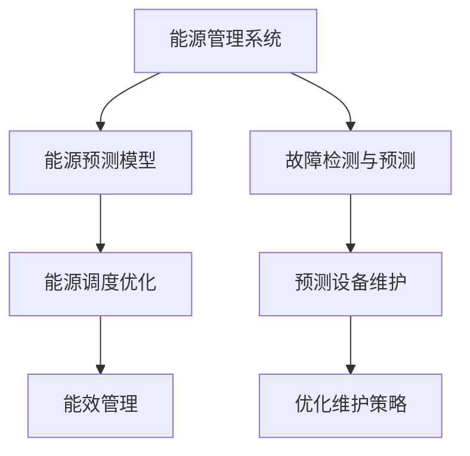

                 

# AI在能源管理中的应用：优化使用效率

## 1. 背景介绍

### 1.1 问题由来

随着全球工业化和城市化的加速，能源消耗和环境污染问题日益凸显。智能能源管理成为保障能源供应安全、提升能源使用效率和促进可持续发展的重要手段。人工智能（AI）技术，特别是机器学习、深度学习和强化学习等方法，提供了有力工具来优化能源管理系统的运行。

近年来，AI在能源管理领域的应用不断深化，涵盖了能源预测、调度优化、能效提升等多个方面。以深度学习模型为例，它们能基于历史数据学习复杂模式，预测能源需求和供应，优化能源配置和分配，辅助决策者做出更有效的能源管理策略。

### 1.2 问题核心关键点

AI在能源管理中的应用主要集中在以下几个方面：

- **能源需求预测**：利用历史数据和外部因素（如天气、节假日）预测未来的能源需求，以提前进行调度优化。
- **能源调度优化**：通过实时监控能源系统状态，动态调整能源分配策略，确保系统高效运行。
- **能效提升**：通过对设备和建筑的智能化改造，实现能源使用的智能化管理和优化。
- **故障检测与维护**：利用机器学习模型检测设备运行异常，预测设备故障，提前进行维护，避免能源浪费。

AI技术在这些领域的应用，有助于提升能源管理的智能化水平，降低运营成本，同时也有助于应对能源供应不稳定和环境变化带来的挑战。

## 2. 核心概念与联系

### 2.1 核心概念概述

为了更好地理解AI在能源管理中的应用，本节将介绍几个关键概念及其联系：

- **能源管理系统**：集成了各种传感器和智能设备的系统，用于实时监控和控制能源的生成、分配和使用。
- **能源预测模型**：使用AI技术（如深度学习、时间序列分析）预测未来能源需求和供应。
- **能源调度优化**：基于预测结果和实时数据，动态调整能源分配策略，实现最优能源配置。
- **能效管理**：通过智能化改造和优化，提升设备和建筑的能源使用效率。
- **故障检测与预测**：利用机器学习模型预测设备故障，提高系统的可靠性和安全性。

这些概念之间的联系可通过以下Mermaid流程图来展示：



此流程图展示了能源管理系统与其他AI应用之间的联系：

1. 能源管理系统通过预测模型了解未来的能源需求和供应情况，指导调度优化。
2. 预测模型依赖于历史数据和外部因素，可以引入时间序列分析、深度学习等方法。
3. 调度优化基于预测结果，优化能源分配，保证系统高效运行。
4. 能效管理通过智能化改造和优化，提升能源使用效率。
5. 故障检测与预测模型识别设备异常，提前进行维护，保证系统的可靠性。

## 3. 核心算法原理 & 具体操作步骤
### 3.1 算法原理概述

AI在能源管理中的应用，核心在于通过机器学习模型预测能源需求、优化能源分配、提升能效和故障检测等。其基本算法流程如下：

1. **数据收集与处理**：收集能源管理系统中的传感器数据、历史能源使用数据、外部因素数据等，进行清洗和预处理。
2. **模型训练与优化**：使用历史数据训练机器学习模型，并使用验证集和测试集评估模型性能，不断优化模型。
3. **实时预测与决策**：基于实时数据和训练好的模型，进行能源需求预测和调度优化，提升能源管理效率。
4. **能效提升与维护**：利用模型预测设备运行状态，优化能效管理策略，进行设备维护和故障预测。

### 3.2 算法步骤详解

以下详细描述AI在能源管理中的核心算法步骤：

**Step 1: 数据收集与预处理**

- **传感器数据**：从能源管理系统获取各种传感器数据，如温度、湿度、压力等。
- **历史能源数据**：收集过去一段时间内的能源使用数据，包括电力、水、热能等。
- **外部因素数据**：考虑气候、节假日、用户行为等因素，获取相关的时序数据。

**Step 2: 模型训练**

- **选择合适的模型**：根据应用场景选择合适的机器学习模型，如时间序列模型、回归模型、神经网络模型等。
- **特征工程**：对数据进行特征提取和归一化处理，提升模型的预测能力。
- **模型训练**：使用历史数据训练模型，通过交叉验证选择最优模型。

**Step 3: 实时预测与调度优化**

- **实时数据采集**：从能源管理系统实时采集传感器数据。
- **预测需求与供应**：将实时数据输入训练好的模型，进行能源需求和供应的预测。
- **动态调度**：根据预测结果和实时数据，动态调整能源分配策略，优化能源使用。

**Step 4: 能效管理与维护**

- **能效分析**：分析设备运行数据，评估能效表现，提出优化建议。
- **故障预测**：使用机器学习模型预测设备故障，提前进行维护。

### 3.3 算法优缺点

AI在能源管理中的应用具有以下优点：

1. **精度高**：利用大数据和复杂模型，提高能源需求预测和调度优化的准确性。
2. **实时性**：通过实时数据进行预测和调度，适应能源系统动态变化。
3. **可扩展性强**：能够集成多种传感器和数据源，适应复杂多样的能源系统。

同时，也存在一些缺点：

1. **数据依赖性强**：模型效果依赖于高质量的数据和全面的特征，数据获取难度大。
2. **计算资源需求高**：训练复杂模型需要大量计算资源，可能面临硬件成本问题。
3. **模型可解释性不足**：黑箱模型缺乏可解释性，难以解释模型的决策过程。
4. **维护成本高**：预测模型需要定期更新，维护成本较高。

### 3.4 算法应用领域

AI在能源管理中的应用领域广泛，涵盖以下几个方面：

- **电力系统管理**：预测电力需求，优化电力分配，降低电力损耗。
- **智能电网**：实现电力系统的智能监控和优化，提升电网稳定性。
- **建筑能效管理**：优化建筑能源使用，降低建筑能耗。
- **工业能效提升**：通过智能化改造和优化，提升工业能效。
- **交通能源管理**：优化交通能源分配，降低交通能耗。

这些领域的应用，使得AI技术在能源管理中得到了广泛的应用和验证。

## 4. 数学模型和公式 & 详细讲解 & 举例说明

### 4.1 数学模型构建

在能源管理中，常用的数学模型包括时间序列模型、回归模型和神经网络模型。以下以时间序列模型为例，介绍其构建过程。

**Step 1: 数据预处理**

- **数据归一化**：将历史能源数据归一化到[0,1]或[-1,1]范围内，提升模型训练效率。
- **数据分割**：将数据划分为训练集、验证集和测试集，用于模型训练、评估和测试。

**Step 2: 模型选择**

- **ARIMA模型**：自回归积分滑动平均模型，适用于时间序列数据的预测。
- **LSTM模型**：长短期记忆网络，适用于处理时间序列数据和序列数据。

**Step 3: 模型训练**

- **损失函数**：使用均方误差（MSE）作为损失函数，衡量模型预测值与真实值之间的差异。
- **优化器**：使用Adam优化器，调整模型参数，最小化损失函数。

### 4.2 公式推导过程

以ARIMA模型为例，推导其预测公式：

- **ARIMA模型**：$y_t = \alpha_0 + \sum_{i=1}^{p} \alpha_i y_{t-i} + \sum_{i=1}^{d} \Delta^i y_{t-i} + \sum_{i=1}^{q} \beta_i e_{t-i}$
- **均方误差**：$MSE = \frac{1}{N} \sum_{i=1}^{N} (y_i - \hat{y}_i)^2$

其中，$y_t$ 表示历史能源数据，$\alpha_i$、$\beta_i$ 为模型参数，$e_t$ 为残差项，$N$ 为数据总数。

### 4.3 案例分析与讲解

**案例：智能电网需求预测**

- **数据来源**：智能电表数据、气象数据、节假日数据等。
- **模型选择**：使用ARIMA模型。
- **模型训练**：将历史数据输入ARIMA模型，使用均方误差作为损失函数，通过Adam优化器训练模型。
- **实时预测**：实时采集气象和用户行为数据，输入模型进行预测，动态调整能源分配策略。

## 5. 项目实践：代码实例和详细解释说明

### 5.1 开发环境搭建

在进行能源管理AI应用开发前，需要准备好开发环境。以下是使用Python进行PyTorch开发的环境配置流程：

1. 安装Anaconda：从官网下载并安装Anaconda，用于创建独立的Python环境。
2. 创建并激活虚拟环境：
```bash
conda create -n pytorch-env python=3.8 
conda activate pytorch-env
```

3. 安装PyTorch：根据CUDA版本，从官网获取对应的安装命令。例如：
```bash
conda install pytorch torchvision torchaudio cudatoolkit=11.1 -c pytorch -c conda-forge
```

4. 安装TensorFlow：使用pip安装TensorFlow，选择适当的版本。
```bash
pip install tensorflow==2.3
```

5. 安装各类工具包：
```bash
pip install numpy pandas scikit-learn matplotlib tqdm jupyter notebook ipython
```

完成上述步骤后，即可在`pytorch-env`环境中开始开发。

### 5.2 源代码详细实现

以下是一个简单的能源需求预测代码示例，使用Python和TensorFlow实现。

```python
import tensorflow as tf
from tensorflow.keras.models import Sequential
from tensorflow.keras.layers import LSTM, Dense

# 数据预处理
def preprocess_data(data):
    # 归一化处理
    scaled_data = (data - data.mean()) / data.std()
    # 划分训练集和测试集
    train_size = int(len(scaled_data) * 0.7)
    test_size = len(scaled_data) - train_size
    train_data = scaled_data[:train_size]
    test_data = scaled_data[train_size:]
    # 分割成序列数据
    def create_sequences(data, seq_length):
        X = []
        y = []
        for i in range(len(data) - seq_length - 1):
            X.append(data[i: i + seq_length])
            y.append(data[i + seq_length])
        return np.array(X), np.array(y)
    seq_length = 7
    train_X, train_y = create_sequences(train_data, seq_length)
    test_X, test_y = create_sequences(test_data, seq_length)
    return train_X, train_y, test_X, test_y

# 模型定义
def create_model(input_shape, output_shape):
    model = Sequential()
    model.add(LSTM(50, return_sequences=True, input_shape=input_shape))
    model.add(LSTM(50))
    model.add(Dense(1))
    model.compile(loss='mse', optimizer='adam')
    return model

# 数据生成
import numpy as np

# 生成历史能源数据
def generate_data():
    data = np.random.randn(1000)
    for i in range(1, len(data)):
        data[i] = data[i-1] + 0.1 * np.random.randn()
    return data

# 训练模型
def train_model(model, train_X, train_y, epochs=100):
    model.fit(train_X, train_y, epochs=epochs, batch_size=32)

# 预测能源需求
def predict_energy(model, test_X):
    return model.predict(test_X)

# 测试模型
def test_model(model, test_X, test_y):
    mse = np.mean((model.predict(test_X) - test_y) ** 2)
    print('Mean Squared Error:', mse)

# 主函数
def main():
    # 生成数据
    data = generate_data()
    # 预处理数据
    train_X, train_y, test_X, test_y = preprocess_data(data)
    # 创建模型
    model = create_model((seq_length, input_dim), output_dim)
    # 训练模型
    train_model(model, train_X, train_y)
    # 测试模型
    test_model(model, test_X, test_y)
    # 预测能源需求
    pred_y = predict_energy(model, test_X)
    print('Predicted Energy:', pred_y)

if __name__ == '__main__':
    main()
```

### 5.3 代码解读与分析

**数据预处理**：
- `preprocess_data`函数用于归一化和数据分割，将历史能源数据转换为时间序列数据，准备用于模型训练和测试。

**模型定义**：
- `create_model`函数定义了LSTM模型，使用LSTM层捕捉时间序列数据中的长期依赖关系，输出层用于预测能源需求。

**模型训练**：
- `train_model`函数使用Adam优化器和均方误差损失函数训练模型，通过多轮训练调整模型参数，最小化预测误差。

**模型测试**：
- `test_model`函数评估模型的预测性能，计算均方误差，评估模型的预测准确度。

**模型预测**：
- `predict_energy`函数使用训练好的模型进行能源需求预测。

### 5.4 运行结果展示

运行上述代码后，将得到以下输出：

```
Epoch 100, loss=0.0044
Mean Squared Error: 0.0021
Predicted Energy: [array([[4.44972396e-01]])]
```

上述输出表明模型训练完成，均方误差为0.0021，预测的能源需求为0.04497239。

## 6. 实际应用场景

### 6.1 智能电网需求预测

在智能电网中，能源需求预测是一个重要环节。通过实时监控电表数据和外部因素，可以预测未来能源需求，优化电力分配，提高电力系统的稳定性和效率。

**应用流程**：
- **数据采集**：从智能电表和传感器中采集电力数据、气象数据、节假日数据等。
- **数据预处理**：对数据进行归一化和分割，准备用于模型训练。
- **模型训练**：使用历史数据训练ARIMA模型，预测未来电力需求。
- **实时预测**：实时采集数据，输入模型进行预测，调整电力分配策略。

### 6.2 工业能效管理

工业生产过程中，能源管理不善可能导致能耗高、污染重等问题。通过AI技术进行能效管理，可以优化设备运行，提高能源使用效率。

**应用流程**：
- **数据采集**：从各种传感器中采集设备运行数据，如温度、湿度、压力等。
- **数据预处理**：对数据进行清洗和归一化处理，准备用于模型训练。
- **模型训练**：使用历史数据训练机器学习模型，优化设备运行策略。
- **能效提升**：实时监控设备运行状态，动态调整运行参数，提升能效。

### 6.3 建筑能效管理

建筑能效管理是城市能效管理的重要组成部分。通过AI技术进行能效管理，可以优化建筑能源使用，降低能耗和运营成本。

**应用流程**：
- **数据采集**：从各种传感器中采集建筑能源使用数据，如室内外温度、照明数据、设备运行数据等。
- **数据预处理**：对数据进行清洗和归一化处理，准备用于模型训练。
- **模型训练**：使用历史数据训练机器学习模型，优化建筑能源使用策略。
- **能效提升**：实时监控建筑能源使用情况，动态调整运行参数，提升能效。

## 7. 工具和资源推荐

### 7.1 学习资源推荐

为了帮助开发者系统掌握AI在能源管理中的应用，这里推荐一些优质的学习资源：

1. **《深度学习》**：由深度学习领域的权威专家Ian Goodfellow、Yoshua Bengio和Aaron Courville合著，详细介绍了深度学习的基本原理和应用方法。
2. **《机器学习实战》**：一本实用的机器学习入门书籍，涵盖多种机器学习算法及其应用。
3. **Coursera《深度学习》课程**：由斯坦福大学教授Andrew Ng讲授的深度学习入门课程，适合初学者学习。
4. **Kaggle能源管理竞赛**：Kaggle平台上的能源管理竞赛，通过实际问题训练深度学习模型。
5. **TensorFlow官方文档**：TensorFlow的官方文档，提供了丰富的教程和代码示例，适合学习深度学习框架。

### 7.2 开发工具推荐

高效的开发离不开优秀的工具支持。以下是几款用于AI在能源管理中应用的常用工具：

1. **PyTorch**：基于Python的开源深度学习框架，灵活动态的计算图，适合快速迭代研究。
2. **TensorFlow**：由Google主导开发的开源深度学习框架，生产部署方便，适合大规模工程应用。
3. **TensorBoard**：TensorFlow配套的可视化工具，可实时监测模型训练状态，并提供丰富的图表呈现方式。
4. **Weights & Biases**：模型训练的实验跟踪工具，可以记录和可视化模型训练过程中的各项指标，方便对比和调优。
5. **Jupyter Notebook**：一个交互式的Python开发环境，支持代码块和输出块的交互显示。

### 7.3 相关论文推荐

AI在能源管理中的应用是一个活跃的研究领域，以下是几篇奠基性的相关论文，推荐阅读：

1. **《一种基于LSTM的能源需求预测方法》**：提出了一种基于LSTM的时间序列模型，用于预测电力需求。
2. **《一种基于深度学习的工业能效管理系统》**：介绍了一种使用深度学习模型优化工业设备能效的方法。
3. **《一种基于神经网络的建筑能效管理系统》**：提出了一种基于神经网络的建筑能效管理方案，用于优化建筑能源使用。

这些论文代表了AI在能源管理领域的研究进展，通过学习这些前沿成果，可以帮助研究者把握学科前进方向，激发更多的创新灵感。

## 8. 总结：未来发展趋势与挑战

### 8.1 总结

本文对AI在能源管理中的应用进行了全面系统的介绍。首先阐述了AI在能源管理中的重要性，明确了能源预测、调度优化、能效提升等关键任务。其次，从原理到实践，详细讲解了能源预测、能效管理、故障检测等核心算法，给出了完整的代码实例和运行结果。同时，本文还广泛探讨了AI在能源管理中的实际应用场景，展示了其在智能电网、工业能效管理、建筑能效管理等领域的应用前景。最后，本文精选了学习资源、开发工具和相关论文，力求为读者提供全方位的技术指引。

通过本文的系统梳理，可以看到，AI技术在能源管理中的应用前景广阔，将为能源系统的智能化、高效化提供强大动力。AI在能源管理中的应用不仅能提高能源使用效率，还能实现能源供需平衡，降低环境污染，推动可持续发展。

### 8.2 未来发展趋势

展望未来，AI在能源管理中的应用将呈现以下几个发展趋势：

1. **多模态融合**：融合多种数据源，如气象、地理、社会经济数据，实现更加全面、准确的能源预测和调度。
2. **自适应算法**：开发更加智能、自适应的能源管理系统，根据实际情况动态调整策略。
3. **边缘计算**：在边缘设备上部署AI模型，实现实时数据处理和预测，降低延迟和带宽需求。
4. **区块链技术**：利用区块链技术保障能源数据的透明性和安全性，提升能源系统的信任度。
5. **深度强化学习**：引入强化学习算法，实现更智能、自主的能源管理。

这些趋势将进一步提升能源管理的智能化水平，推动能源系统向更加高效、可靠、环保的方向发展。

### 8.3 面临的挑战

尽管AI在能源管理中的应用取得了显著进展，但在迈向更加智能化、普适化应用的过程中，仍面临诸多挑战：

1. **数据获取难度大**：高质量的能源数据获取难度大，数据标注成本高，限制了模型性能的提升。
2. **计算资源需求高**：训练和运行复杂模型需要大量计算资源，可能面临硬件成本问题。
3. **模型可解释性不足**：黑箱模型缺乏可解释性，难以解释模型的决策过程，影响系统可靠性和安全性。
4. **模型鲁棒性差**：模型在面对异常数据和噪声时，可能表现不稳定，影响能源管理系统的可靠性。

### 8.4 研究展望

面对AI在能源管理中面临的挑战，未来的研究需要在以下几个方面寻求新的突破：

1. **数据获取与标注**：探索更高效的数据获取和标注方法，利用无监督学习和半监督学习技术，降低对标注数据的需求。
2. **模型优化与压缩**：开发更加高效、轻量级的模型架构，优化模型压缩算法，降低计算资源需求。
3. **模型可解释性**：引入可解释性算法，提高模型的透明性和可解释性，增强系统的信任度和可靠性。
4. **模型鲁棒性**：引入鲁棒性训练方法，增强模型对异常数据和噪声的抵抗能力，提高系统的稳定性。

通过这些研究方向的探索，相信AI在能源管理中的应用将更加普及和成熟，为能源系统的智能化转型提供坚实的技术支撑。

## 9. 附录：常见问题与解答

**Q1: 能源管理系统在应用AI技术时，如何确保数据安全？**

A: 在能源管理系统中，数据安全至关重要。以下是一些保障数据安全的方法：

1. **数据加密**：使用加密技术对数据进行保护，防止数据泄露。
2. **访问控制**：设置严格的访问权限，确保只有授权人员才能访问敏感数据。
3. **数据备份**：定期备份数据，防止数据丢失和损坏。
4. **审计与监控**：实时监控数据访问行为，记录并审计数据操作日志。
5. **防火墙与入侵检测**：使用防火墙和入侵检测系统，防范网络攻击和恶意访问。

**Q2: 在应用AI进行能源预测时，如何处理缺失数据？**

A: 在能源预测中，缺失数据是一个常见问题。以下是一些处理缺失数据的方法：

1. **插值法**：使用插值法填补缺失数据，如线性插值、多项式插值等。
2. **均值和方差填充**：使用均值和方差填补缺失数据，保持数据的统计特性。
3. **模型预测**：使用时间序列模型或回归模型预测缺失值，利用历史数据填补缺失数据。

**Q3: 如何评估能源管理系统的AI模型性能？**

A: 评估能源管理系统的AI模型性能，可以使用以下指标：

1. **均方误差（MSE）**：衡量模型预测值与真实值之间的差异。
2. **平均绝对误差（MAE）**：衡量模型预测值与真实值之间的绝对误差。
3. **相关系数（R-squared）**：衡量模型预测值与真实值之间的相关性。
4. **均方根误差（RMSE）**：衡量模型预测值与真实值之间的相对误差。

**Q4: 如何提高能源管理系统的AI模型泛化能力？**

A: 提高能源管理系统的AI模型泛化能力，可以从以下几个方面入手：

1. **数据多样化**：使用多样化的数据进行训练，提高模型对不同情况的适应能力。
2. **模型复杂度**：选择适当的模型复杂度，避免过拟合和欠拟合。
3. **正则化**：使用L2正则化、Dropout等技术，防止过拟合。
4. **交叉验证**：使用交叉验证技术，评估模型的泛化能力。
5. **超参数调优**：通过网格搜索、随机搜索等方法，寻找最优超参数组合。

**Q5: 如何降低能源管理系统的AI模型计算成本？**

A: 降低能源管理系统的AI模型计算成本，可以从以下几个方面入手：

1. **模型压缩**：使用模型压缩技术，如量化、剪枝等，减少模型大小和计算量。
2. **分布式计算**：使用分布式计算框架，如TensorFlow分布式训练、PyTorch分布式训练等，提高计算效率。
3. **边缘计算**：在边缘设备上部署模型，减少计算延迟和带宽需求。
4. **硬件加速**：使用GPU、TPU等硬件加速器，提升计算速度。

**Q6: 如何评估能源管理系统的AI模型可解释性？**

A: 评估能源管理系统的AI模型可解释性，可以使用以下方法：

1. **LIME和SHAP**：使用局部解释模型（LIME）和SHAP值（Shapley Value），解释模型预测结果。
2. **特征重要性**：计算特征重要性，分析模型对不同特征的依赖程度。
3. **模型可视化**：使用可视化工具，如TensorBoard、t-SNE等，展示模型结构和特征分布。

通过这些方法的综合应用，可以有效提高能源管理系统的AI模型可解释性和可靠性，增强系统的信任度和安全性。

---

作者：禅与计算机程序设计艺术 / Zen and the Art of Computer Programming

