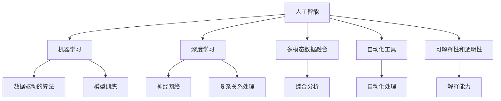

                 

# AI在跨学科研究中的应用前景

> 关键词：人工智能, 跨学科研究, 机器学习, 数据科学, 自然语言处理(NLP), 计算机视觉(CV), 机器人学, 生物信息学, 医疗健康, 智能制造

## 1. 背景介绍

### 1.1 问题由来

随着信息时代的到来，人工智能（AI）技术在各个学科领域的应用已经成为一股不可阻挡的趋势。AI技术的跨学科应用不仅丰富了学科研究的手段和视角，还推动了众多领域的技术进步和产业创新。这一现象背后，是AI技术的高度通用性和可扩展性，使得其能够在多个学科之间自由迁移和应用。

### 1.2 问题核心关键点

AI技术在跨学科研究中的应用，主要基于以下几个核心关键点：

- **多模态数据融合**：不同学科的数据类型和结构差异较大，但AI技术能够高效地融合多种数据源，为跨学科研究提供统一的分析基础。
- **机器学习模型**：AI技术的核心是机器学习，它通过数据驱动的方式，从海量数据中学习规律，为跨学科研究提供强大的分析能力。
- **深度学习算法**：深度学习算法在图像、语音、文本等不同数据形态上的表现优异，为跨学科研究提供了有力的技术支撑。
- **自动化工具**：AI技术的自动化工具和平台，如TensorFlow、PyTorch、scikit-learn等，简化了跨学科研究的数据处理和模型训练过程。
- **可解释性和透明性**：AI技术的可解释性和透明性，使得跨学科研究者能够更好地理解模型的决策过程，提升研究的可信度。

这些关键点共同构成了AI技术在跨学科研究中应用的基石，为学科间的交叉融合和创新突破提供了可能。

### 1.3 问题研究意义

AI技术在跨学科研究中的应用，具有以下重要意义：

- **促进学科创新**：AI技术的跨学科应用，可以为不同学科提供新的研究方法和工具，推动学科知识的边界拓展和技术突破。
- **提高研究效率**：AI技术的高效自动化能力，可以大幅降低研究成本，加速研究进程。
- **提升数据利用率**：AI技术的多模态数据融合能力，能够更好地利用各学科数据，提升数据的利用率。
- **实现知识共享**：跨学科研究利用AI技术，可以实现不同学科知识的高效共享和集成，加速科学发现和创新。
- **推动产业升级**：AI技术的跨学科应用，可以促进相关产业的智能化升级，提升经济社会的数字化水平。

## 2. 核心概念与联系

### 2.1 核心概念概述

为了更好地理解AI在跨学科研究中的应用，本节将介绍几个关键的核心概念：

- **人工智能（AI）**：一种通过模拟人类智能行为，实现信息处理、模式识别、自然语言处理等任务的计算机技术。
- **机器学习（ML）**：一种数据驱动的算法，通过训练模型，使其能够在特定任务上表现出色。
- **深度学习（DL）**：一种基于神经网络的机器学习方法，能够处理复杂的非线性关系，适用于图像、语音、文本等多种数据形态。
- **多模态数据融合**：将不同类型的数据（如图像、文本、语音）进行综合分析，以获得更全面的信息。
- **自动化工具**：用于数据处理、模型训练、结果分析等任务的自动化工具和平台。
- **可解释性和透明性**：AI模型决策过程的解释能力，帮助研究者理解模型的内部工作机制。

这些核心概念之间的逻辑关系可以通过以下Mermaid流程图来展示：



这个流程图展示的核心概念及其之间的关系：

1. 人工智能技术涵盖机器学习、深度学习等算法和技术。
2. 机器学习和深度学习分别针对不同的数据形态和复杂度。
3. 多模态数据融合和自动化工具支持数据处理和模型训练。
4. 可解释性和透明性提升AI模型的可信度和使用效率。

## 3. 核心算法原理 & 具体操作步骤

### 3.1 算法原理概述

AI在跨学科研究中的应用，主要基于机器学习（ML）和深度学习（DL）算法，通过数据驱动的方式，从不同学科的数据中学习规律和知识，支持跨学科的研究和创新。

### 3.2 算法步骤详解

AI在跨学科研究中应用的算法步骤通常包括以下几个关键环节：

**Step 1: 数据收集与预处理**

1. **数据收集**：从不同学科的领域中收集相关的数据集，包括文本、图像、语音、视频等多种类型。
2. **数据预处理**：对收集到的数据进行清洗、归一化、标注等处理，以便后续的模型训练。

**Step 2: 模型训练与优化**

1. **模型选择**：根据研究需求选择合适的机器学习或深度学习模型。
2. **模型训练**：使用预处理后的数据对模型进行训练，调整模型参数以优化性能。
3. **模型评估**：在验证集上评估模型性能，选择表现最优的模型。

**Step 3: 结果分析与应用**

1. **结果分析**：对模型输出结果进行分析，提取有价值的信息和规律。
2. **应用验证**：将分析结果应用到实际问题中，验证其有效性和可靠性。
3. **模型迭代**：根据应用反馈，对模型进行迭代优化，提升性能。

### 3.3 算法优缺点

AI在跨学科研究中的应用具有以下优点：

1. **通用性**：AI技术可以处理不同学科的数据，支持多模态数据的综合分析。
2. **高效性**：AI技术的自动化能力能够大幅降低研究成本，加速研究进程。
3. **可解释性**：AI模型的可解释性和透明性，提高了研究结果的可信度。
4. **应用广泛**：AI技术在多个学科领域都有应用，推动了学科之间的交叉融合。

同时，该方法也存在一定的局限性：

1. **数据质量依赖**：AI模型的性能高度依赖于数据的质量和数量。
2. **模型复杂度高**：深度学习模型的训练和优化过程复杂，需要大量计算资源。
3. **黑盒问题**：某些AI模型的决策过程难以解释，影响了其可信度。
4. **学科特定挑战**：不同学科有其独特的应用场景和问题，AI技术需要针对性地进行调整和优化。

### 3.4 算法应用领域

AI在跨学科研究中的应用非常广泛，涵盖以下多个领域：

- **自然语言处理（NLP）**：利用AI技术处理和分析文本数据，包括情感分析、机器翻译、自动摘要等任务。
- **计算机视觉（CV）**：通过深度学习算法，处理和分析图像数据，包括目标检测、图像分类、人脸识别等任务。
- **机器人学**：利用AI技术控制和优化机器人行为，包括路径规划、动作识别、环境感知等任务。
- **生物信息学**：利用AI技术分析生物数据，包括基因序列分析、蛋白质结构预测、药物发现等任务。
- **医疗健康**：利用AI技术处理医疗数据，包括疾病诊断、健康监测、智能辅助诊疗等任务。
- **智能制造**：利用AI技术优化制造流程，包括质量检测、设备维护、供应链管理等任务。
- **环境科学**：利用AI技术分析环境数据，包括气候预测、污染监控、生态保护等任务。

## 4. 数学模型和公式 & 详细讲解 & 举例说明

### 4.1 数学模型构建

在跨学科研究中，常用的AI模型包括决策树、支持向量机、神经网络等。这里以神经网络模型为例，介绍其数学模型构建和公式推导。

### 4.2 公式推导过程

神经网络模型由多个神经元（或称节点）组成，通过多个层次（或称层）进行信息传递和处理。以一个简单的全连接神经网络为例，其数学模型构建过程如下：

- **输入层**：将原始数据输入神经网络，表示为 $\mathbf{x} = [x_1, x_2, ..., x_n]^T$。
- **隐藏层**：神经元通过权重和偏置进行信息处理，表示为 $\mathbf{h} = \sigma(\mathbf{W} \mathbf{x} + \mathbf{b})$，其中 $\sigma$ 为激活函数，$\mathbf{W}$ 和 $\mathbf{b}$ 分别为权重矩阵和偏置向量。
- **输出层**：对隐藏层的输出进行线性变换和激活函数处理，表示为 $\mathbf{y} = \sigma(\mathbf{W} \mathbf{h} + \mathbf{b})$。

神经网络的训练过程通常采用反向传播算法，通过最小化损失函数来优化模型参数。假设损失函数为 $L(\mathbf{y}, \mathbf{y}^*)$，其中 $\mathbf{y}^*$ 为真实标签。则反向传播算法的步骤如下：

1. **前向传播**：将输入数据通过神经网络，计算出输出结果 $\mathbf{y}$。
2. **计算损失**：计算损失函数 $L(\mathbf{y}, \mathbf{y}^*)$。
3. **反向传播**：通过链式法则计算每个神经元的梯度，更新权重和偏置。

### 4.3 案例分析与讲解

以图像分类任务为例，展示AI技术在跨学科研究中的应用。

**数据收集**：从计算机视觉领域收集图像数据集，如ImageNet。

**数据预处理**：对图像进行预处理，包括尺寸归一化、图像增强等操作。

**模型选择**：选择卷积神经网络（CNN）作为图像分类的模型。

**模型训练**：在预处理后的数据集上训练CNN模型，调整卷积核大小、数量等参数，优化模型性能。

**模型评估**：在验证集上评估模型性能，选择表现最优的模型。

**结果分析**：分析模型输出结果，提取图像分类的规律和特征。

**应用验证**：将分析结果应用到实际问题中，如自动驾驶中的物体检测。

## 5. 项目实践：代码实例和详细解释说明

### 5.1 开发环境搭建

在进行跨学科研究时，需要搭建一个高效的开发环境，以下是使用Python进行TensorFlow开发的环境配置流程：

1. 安装Anaconda：从官网下载并安装Anaconda，用于创建独立的Python环境。

2. 创建并激活虚拟环境：
```bash
conda create -n tf-env python=3.8 
conda activate tf-env
```

3. 安装TensorFlow：从官网获取对应的安装命令，例如：
```bash
conda install tensorflow=2.4
```

4. 安装各类工具包：
```bash
pip install numpy pandas scikit-learn matplotlib tqdm jupyter notebook ipython
```

完成上述步骤后，即可在`tf-env`环境中开始跨学科研究开发。

### 5.2 源代码详细实现

这里以图像分类任务为例，给出使用TensorFlow进行卷积神经网络（CNN）模型开发的PyTorch代码实现。

```python
import tensorflow as tf
from tensorflow.keras import layers

# 构建CNN模型
model = tf.keras.Sequential([
    layers.Conv2D(32, 3, activation='relu', input_shape=(28, 28, 1)),
    layers.MaxPooling2D(),
    layers.Conv2D(64, 3, activation='relu'),
    layers.MaxPooling2D(),
    layers.Flatten(),
    layers.Dense(64, activation='relu'),
    layers.Dense(10, activation='softmax')
])

# 编译模型
model.compile(optimizer='adam', loss='categorical_crossentropy', metrics=['accuracy'])

# 训练模型
model.fit(train_images, train_labels, epochs=10, validation_data=(test_images, test_labels))

# 评估模型
test_loss, test_acc = model.evaluate(test_images, test_labels)
print('Test accuracy:', test_acc)
```

### 5.3 代码解读与分析

让我们再详细解读一下关键代码的实现细节：

- **模型构建**：使用`tf.keras.Sequential`创建卷积神经网络模型，包括卷积层、池化层、全连接层等。
- **编译模型**：使用`model.compile`对模型进行编译，指定优化器、损失函数和评估指标。
- **训练模型**：使用`model.fit`对模型进行训练，指定训练集和验证集。
- **评估模型**：使用`model.evaluate`对模型进行评估，输出测试集上的准确率。

这些代码实现展示了TensorFlow在跨学科研究中的应用，通过定义和训练卷积神经网络，实现了图像分类的任务。

## 6. 实际应用场景

### 6.1 智能医疗

AI在智能医疗中的应用，可以大大提高医疗诊断的效率和准确性。通过跨学科研究，结合医疗数据和AI技术，可以实现疾病的早期诊断、个性化治疗等任务。

**数据收集**：从医疗领域收集患者的电子健康记录、基因数据等。

**数据预处理**：对数据进行清洗、归一化等预处理操作。

**模型训练**：利用AI技术训练疾病诊断模型，如深度学习模型。

**模型评估**：在验证集上评估模型性能，选择表现最优的模型。

**结果分析**：分析模型输出结果，提取疾病诊断的规律和特征。

**应用验证**：将分析结果应用到实际问题中，如早期癌症检测。

### 6.2 环境保护

AI技术在环境保护中的应用，可以帮助监测和分析环境数据，提升环境保护的效率和效果。通过跨学科研究，结合环境数据和AI技术，可以实现环境监测、污染治理等任务。

**数据收集**：从环境科学领域收集大气、水质、噪声等环境数据。

**数据预处理**：对数据进行清洗、归一化等预处理操作。

**模型训练**：利用AI技术训练环境监测模型，如深度学习模型。

**模型评估**：在验证集上评估模型性能，选择表现最优的模型。

**结果分析**：分析模型输出结果，提取环境监测的规律和特征。

**应用验证**：将分析结果应用到实际问题中，如污染源定位。

### 6.3 智能制造

AI技术在智能制造中的应用，可以优化制造流程，提升生产效率和质量。通过跨学科研究，结合制造数据和AI技术，可以实现智能生产、质量检测等任务。

**数据收集**：从智能制造领域收集生产设备、工艺数据等。

**数据预处理**：对数据进行清洗、归一化等预处理操作。

**模型训练**：利用AI技术训练质量检测模型，如深度学习模型。

**模型评估**：在验证集上评估模型性能，选择表现最优的模型。

**结果分析**：分析模型输出结果，提取质量检测的规律和特征。

**应用验证**：将分析结果应用到实际问题中，如故障预测。

## 7. 工具和资源推荐

### 7.1 学习资源推荐

为了帮助开发者系统掌握AI技术在跨学科研究中的应用，这里推荐一些优质的学习资源：

1. 《深度学习》（Deep Learning）书籍：Ian Goodfellow等著，全面介绍了深度学习的基本概念和应用。
2. 《TensorFlow实战Google深度学习》书籍：Google官方出版的TensorFlow实战指南，适合初学者学习。
3. 《动手学深度学习》课程：由李沐教授主讲的深度学习课程，结合Python实现，适合动手实践。
4. Kaggle平台：全球知名的数据科学竞赛平台，提供大量跨学科的数据集和竞赛，适合学习和交流。
5. Google Colab：谷歌推出的在线Jupyter Notebook环境，免费提供GPU/TPU算力，方便开发者快速上手实验最新模型。

通过对这些资源的学习实践，相信你一定能够快速掌握AI技术在跨学科研究中的应用，并用于解决实际的跨学科问题。

### 7.2 开发工具推荐

高效的开发离不开优秀的工具支持。以下是几款用于AI跨学科研究开发的常用工具：

1. TensorFlow：由Google主导开发的开源深度学习框架，生产部署方便，适合大规模工程应用。
2. PyTorch：基于Python的开源深度学习框架，灵活动态的计算图，适合快速迭代研究。
3. scikit-learn：Python的科学计算库，提供多种机器学习算法和工具，适合初学者学习。
4. Weights & Biases：模型训练的实验跟踪工具，可以记录和可视化模型训练过程中的各项指标，方便对比和调优。
5. Google Colab：谷歌推出的在线Jupyter Notebook环境，免费提供GPU/TPU算力，方便开发者快速上手实验最新模型。

合理利用这些工具，可以显著提升跨学科研究开发的效率，加快创新迭代的步伐。

### 7.3 相关论文推荐

AI技术在跨学科研究中的应用源于学界的持续研究。以下是几篇奠基性的相关论文，推荐阅读：

1. 《Deep Learning》（Goodfellow等著）：全面介绍了深度学习的基本概念和应用。
2. 《ImageNet Classification with Deep Convolutional Neural Networks》：AlexNet论文，展示了深度学习在图像分类任务上的强大能力。
3. 《CS231n: Convolutional Neural Networks for Visual Recognition》：斯坦福大学的计算机视觉课程讲义，详细介绍了计算机视觉的基本概念和应用。
4. 《Neural Information Processing Systems》（NIPS）：深度学习领域的重要学术会议，汇集了最新的研究成果和应用案例。
5. 《BERT: Pre-training of Deep Bidirectional Transformers for Language Understanding》：BERT论文，展示了预训练语言模型在跨学科研究中的广泛应用。

这些论文代表了大规模AI跨学科研究的发展脉络。通过学习这些前沿成果，可以帮助研究者把握学科前进方向，激发更多的创新灵感。

## 8. 总结：未来发展趋势与挑战

### 8.1 总结

本文对AI在跨学科研究中的应用进行了全面系统的介绍。首先阐述了AI技术在跨学科研究中的研究背景和意义，明确了AI技术在促进学科创新、提高研究效率等方面的独特价值。其次，从原理到实践，详细讲解了AI技术在跨学科研究中的算法步骤和关键点，给出了跨学科研究任务的完整代码实例。同时，本文还广泛探讨了AI技术在智能医疗、环境保护、智能制造等多个领域的应用前景，展示了AI技术的广阔前景。

通过本文的系统梳理，可以看到，AI技术在跨学科研究中扮演了越来越重要的角色，推动了各个学科的交叉融合和创新突破。AI技术的多模态数据融合、自动化工具和可解释性，使得跨学科研究更加高效和透明。未来，伴随AI技术的不断演进，跨学科研究的边界将被进一步拓展，为科学发现和产业升级提供新的动力。

### 8.2 未来发展趋势

展望未来，AI在跨学科研究中的应用将呈现以下几个发展趋势：

1. **多模态数据融合**：AI技术能够高效融合多种数据形态，支持跨学科研究的综合分析。
2. **自动化工具普及**：更多的跨学科研究将依赖自动化工具，降低研究成本，加速研究进程。
3. **深度学习应用广泛**：深度学习算法在多个学科领域的应用将进一步深入，推动学科的智能化升级。
4. **跨学科模型发展**：结合多个学科的知识，发展更全面、高效的跨学科模型，提升研究效果。
5. **知识图谱融合**：将知识图谱与AI技术结合，提升跨学科研究的系统性和全面性。
6. **个性化研究增强**：利用AI技术进行个性化研究，提升研究的针对性和效率。

以上趋势凸显了AI技术在跨学科研究中的巨大潜力。这些方向的探索发展，必将进一步提升跨学科研究的性能和应用范围，为科学发现和产业升级提供新的动力。

### 8.3 面临的挑战

尽管AI技术在跨学科研究中取得了显著成果，但在迈向更加智能化、普适化应用的过程中，它仍面临着诸多挑战：

1. **数据质量和多样性**：不同学科的数据类型和结构差异较大，数据质量和多样性对AI模型的影响较大。
2. **模型复杂性和可解释性**：深度学习模型的复杂性和黑盒问题，影响了其可信度和透明度。
3. **学科特定挑战**：不同学科有其独特的应用场景和问题，AI技术需要针对性地进行调整和优化。
4. **隐私和安全问题**：跨学科研究涉及大量敏感数据，隐私和安全问题需高度重视。
5. **跨学科团队协作**：跨学科研究需要多学科团队协作，如何协调和合作是重要挑战。

### 8.4 研究展望

面对AI技术在跨学科研究中面临的挑战，未来的研究需要在以下几个方面寻求新的突破：

1. **多模态数据融合技术**：探索更高效的数据融合方法，提升跨学科研究的准确性和全面性。
2. **模型简化和可解释性**：开发更简单、可解释性更强的AI模型，提高研究的可信度和透明度。
3. **跨学科模型发展**：结合多个学科的知识，发展更全面、高效的跨学科模型，提升研究效果。
4. **跨学科协作平台**：建立跨学科协作平台，促进多学科团队的协作和交流。
5. **隐私和安全保护**：加强数据隐私和安全保护，确保跨学科研究的可靠性和安全性。

这些研究方向的探索，必将引领AI技术在跨学科研究中迈向更高的台阶，为科学发现和产业升级提供新的动力。面向未来，AI技术将在跨学科研究中扮演越来越重要的角色，推动人类知识的边界不断拓展。

## 9. 附录：常见问题与解答

**Q1：跨学科研究中如何选择合适的AI模型？**

A: 在跨学科研究中，选择合适的AI模型需要考虑多个因素，如数据类型、任务复杂度、计算资源等。通常，以下步骤可以帮助选择最适合的模型：

1. **需求分析**：明确研究任务的需求和目标，确定所需的模型类型和性能指标。
2. **模型评估**：在类似数据集上进行模型评估，选择表现最优的模型。
3. **实验调整**：根据实验结果和需求，调整模型参数和结构，进一步优化性能。

**Q2：跨学科研究中如何处理不同学科的数据？**

A: 处理不同学科的数据需要考虑多个因素，如数据格式、特征差异、数据预处理等。通常，以下步骤可以帮助处理不同学科的数据：

1. **数据收集**：从不同学科的领域中收集相关的数据集。
2. **数据预处理**：对数据进行清洗、归一化、标注等处理，以便后续的模型训练。
3. **多模态融合**：利用多模态数据融合技术，将不同类型的数据进行综合分析。
4. **特征工程**：根据任务需求，对数据进行特征提取和工程处理，提升数据质量。

**Q3：跨学科研究中如何提高模型的可解释性？**

A: 提高AI模型的可解释性，可以帮助研究者更好地理解模型的决策过程，提升研究的可信度。通常，以下方法可以提高模型的可解释性：

1. **使用可解释模型**：选择基于规则或树结构的模型，如决策树、线性回归等。
2. **可视化工具**：使用可视化工具，如TensorBoard，展示模型的训练过程和输出结果。
3. **特征重要性分析**：分析模型的特征重要性，找出对模型预测有重要影响的特征。
4. **模型解释方法**：使用模型解释方法，如LIME、SHAP等，分析模型输出的原因。

**Q4：跨学科研究中如何保障数据隐私和安全？**

A: 保障跨学科研究中的数据隐私和安全，是研究过程中需要高度重视的问题。通常，以下方法可以帮助保障数据隐私和安全：

1. **数据匿名化**：对数据进行匿名化处理，去除敏感信息。
2. **访问控制**：设置严格的访问控制措施，限制数据的访问和使用。
3. **加密技术**：对数据进行加密处理，防止数据泄露。
4. **隐私保护算法**：使用隐私保护算法，如差分隐私、联邦学习等，保护数据隐私。

---

作者：禅与计算机程序设计艺术 / Zen and the Art of Computer Programming

