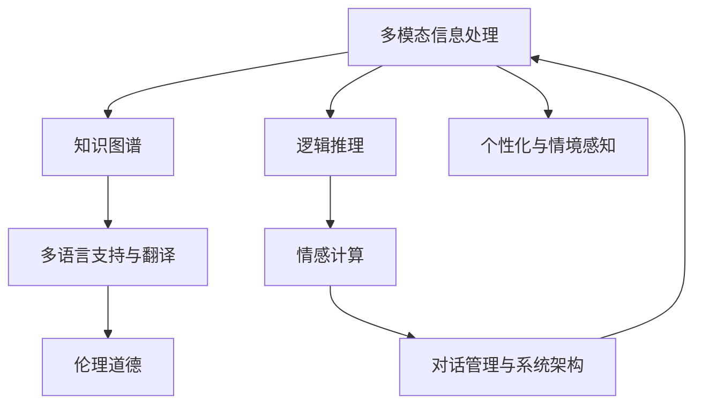

                 

# 聊天机器人未来：人工智能助理和顾问

## 1. 背景介绍

### 1.1 问题由来

随着人工智能(AI)技术的迅猛发展，智能聊天机器人已经成为一种无处不在的数字化服务。它们在客服、教育、健康咨询、金融咨询等诸多领域提供着实时、个性化的咨询服务。然而，现有的聊天机器人还存在诸多不足之处：知识更新不及时、处理复杂问题的能力有限、无法处理多模态信息等。为了解决这些问题，探索聊天机器人未来的发展方向，本文将对人工智能助理和顾问的未来进行深入探讨。

### 1.2 问题核心关键点

本文将从以下几个关键点来讨论人工智能助理和顾问的未来：

- 多模态信息处理：如何融合文本、语音、图像等多种模态信息，提升聊天机器人的智能水平。
- 知识图谱与逻辑推理：如何构建知识图谱，利用逻辑推理来增强聊天机器人的理解和决策能力。
- 个性化与情境感知：如何通过学习和分析用户行为，提供更加个性化和情境感知的咨询服务。
- 多语言支持与翻译：如何实现跨语言支持，利用机器翻译提升聊天机器人的全球化能力。
- 情感计算与伦理道德：如何在聊天机器人中引入情感计算，同时确保输出符合伦理道德规范。
- 对话管理与系统架构：如何设计高效、可扩展的对话管理架构，提升聊天机器人的稳定性和可靠性。

### 1.3 问题研究意义

探索聊天机器人未来的发展方向，对于推动AI技术在各行各业的广泛应用，提升人类生活质量具有重要意义：

- 提升服务质量：通过多模态信息处理、知识图谱与逻辑推理等技术，聊天机器人将具备更强的理解和决策能力，提供更精准、更高效的服务。
- 促进跨领域应用：个性化与情境感知技术将使聊天机器人更好地服务于医疗、金融、教育等多个领域，促进各行业的数字化转型升级。
- 增强全球化能力：多语言支持与翻译技术将使聊天机器人具备跨语言交互能力，帮助企业在全球范围内拓展市场，提高品牌影响力。
- 提升伦理水平：情感计算与伦理道德技术的引入，将确保聊天机器人的输出符合人类价值观和伦理道德，避免产生有害影响。
- 增强系统稳定性：对话管理与系统架构设计，将使聊天机器人具备更强的稳定性和可靠性，提升用户满意度。

## 2. 核心概念与联系

### 2.1 核心概念概述

为了更好地理解人工智能助理和顾问的未来，本节将介绍几个密切相关的核心概念：

- 多模态信息处理：指融合多种模态（如文本、语音、图像等）信息，提升聊天机器人的智能水平和用户体验。
- 知识图谱：基于图结构表示的知识库，用于存储和组织实体、关系、属性等信息，帮助聊天机器人进行知识推理和决策。
- 逻辑推理：指基于规则和知识的推理过程，用于增强聊天机器人的理解和决策能力，特别是在处理复杂问题时。
- 个性化与情境感知：通过学习用户行为和上下文信息，提供更加个性化和情境感知的咨询服务，提升用户满意度。
- 多语言支持与翻译：指实现聊天机器人的跨语言交互能力，帮助其服务于全球用户。
- 情感计算：指通过分析用户情感表达，优化聊天机器人的交互策略，提升用户情感体验。
- 伦理道德：指确保聊天机器人的输出符合人类价值观和伦理道德规范，避免产生有害影响。
- 对话管理与系统架构：指设计高效、可扩展的对话管理架构，提升聊天机器人的稳定性和可靠性。

这些概念之间的逻辑关系可以通过以下Mermaid流程图来展示：



这个流程图展示了大语言模型的核心概念及其之间的关系：

1. 多模态信息处理通过融合多种模态信息，提升聊天机器人的智能水平。
2. 知识图谱和逻辑推理帮助聊天机器人进行知识推理和决策。
3. 个性化与情境感知通过学习用户行为，提供更加个性化的咨询服务。
4. 多语言支持与翻译提升聊天机器人的全球化能力。
5. 情感计算优化聊天机器人的交互策略，提升用户情感体验。
6. 伦理道德确保聊天机器人的输出符合伦理道德规范。
7. 对话管理与系统架构设计使聊天机器人具备更强的稳定性和可靠性。

这些概念共同构成了聊天机器人未来的发展框架，使其能够在更广泛的场景下发挥作用。

## 3. 核心算法原理 & 具体操作步骤

### 3.1 算法原理概述

人工智能助理和顾问的未来发展离不开以下几个关键算法原理：

1. 多模态信息融合算法：用于将文本、语音、图像等多种模态信息进行融合，提升聊天机器人的智能水平和用户体验。
2. 知识图谱构建与推理算法：用于构建知识图谱，利用逻辑推理来增强聊天机器人的理解和决策能力。
3. 个性化推荐算法：用于通过学习和分析用户行为，提供更加个性化和情境感知的咨询服务。
4. 跨语言翻译算法：用于实现聊天机器人的跨语言交互能力。
5. 情感计算算法：用于通过分析用户情感表达，优化聊天机器人的交互策略。
6. 伦理道德约束算法：用于确保聊天机器人的输出符合伦理道德规范。
7. 对话管理与系统架构设计算法：用于设计高效、可扩展的对话管理架构，提升聊天机器人的稳定性和可靠性。

这些算法原理可以综合应用于聊天机器人的设计和实现中，提升其智能水平和用户体验。

### 3.2 算法步骤详解

基于上述算法原理，人工智能助理和顾问的未来发展可以按照以下步骤进行：

**Step 1: 数据准备与预处理**

- 收集多模态数据，如文本、语音、图像等，并进行清洗和预处理。
- 构建知识图谱，定义实体、关系和属性。
- 收集用户行为数据，用于个性化推荐和情境感知。
- 准备跨语言翻译数据集，用于训练翻译模型。

**Step 2: 多模态信息融合**

- 使用多模态信息融合算法，将文本、语音、图像等多种模态信息进行融合，提升聊天机器人的智能水平和用户体验。

**Step 3: 知识图谱构建与推理**

- 使用知识图谱构建算法，构建包含实体、关系和属性的知识图谱。
- 使用逻辑推理算法，通过知识图谱进行实体关系推理和属性推理，增强聊天机器人的理解和决策能力。

**Step 4: 个性化推荐**

- 使用个性化推荐算法，通过学习和分析用户行为，提供更加个性化和情境感知的咨询服务。

**Step 5: 跨语言翻译**

- 使用跨语言翻译算法，实现聊天机器人的跨语言交互能力，帮助其服务于全球用户。

**Step 6: 情感计算**

- 使用情感计算算法，通过分析用户情感表达，优化聊天机器人的交互策略，提升用户情感体验。

**Step 7: 伦理道德约束**

- 使用伦理道德约束算法，确保聊天机器人的输出符合伦理道德规范。

**Step 8: 对话管理与系统架构设计**

- 使用对话管理与系统架构设计算法，设计高效、可扩展的对话管理架构，提升聊天机器人的稳定性和可靠性。

### 3.3 算法优缺点

人工智能助理和顾问的未来发展具有以下优点：

- 提升服务质量：通过多模态信息融合、知识图谱与逻辑推理等技术，聊天机器人将具备更强的理解和决策能力，提供更精准、更高效的服务。
- 促进跨领域应用：个性化与情境感知技术将使聊天机器人更好地服务于医疗、金融、教育等多个领域，促进各行业的数字化转型升级。
- 增强全球化能力：多语言支持与翻译技术将使聊天机器人具备跨语言交互能力，帮助企业在全球范围内拓展市场，提高品牌影响力。
- 提升伦理水平：情感计算与伦理道德技术的引入，将确保聊天机器人的输出符合人类价值观和伦理道德，避免产生有害影响。
- 增强系统稳定性：对话管理与系统架构设计，将使聊天机器人具备更强的稳定性和可靠性，提升用户满意度。

同时，该方法也存在一定的局限性：

- 数据隐私问题：多模态信息融合和个性化推荐需要收集大量用户数据，可能引发数据隐私和安全问题。
- 伦理道德问题：情感计算和伦理道德约束算法需要处理复杂的伦理道德问题，需要谨慎设计。
- 跨语言翻译问题：跨语言翻译可能存在歧义和误解，需要进一步优化翻译算法。
- 计算资源需求：知识图谱构建和逻辑推理需要大量计算资源，可能导致性能瓶颈。

尽管存在这些局限性，但就目前而言，人工智能助理和顾问的未来发展方向是大有潜力的。未来相关研究的重点在于如何进一步优化这些算法，提升其性能和用户体验。

### 3.4 算法应用领域

人工智能助理和顾问的未来发展将广泛应用于以下几个领域：

- 客服领域：通过融合多模态信息，提升客服中心的智能化水平，提供更加精准、高效的服务。
- 医疗领域：通过知识图谱和逻辑推理，构建医疗咨询系统，提供精准的诊断和治疗建议。
- 金融领域：通过个性化推荐和情感计算，构建金融咨询服务，提升用户体验和满意度。
- 教育领域：通过个性化推荐和情境感知，构建智能学习系统，提供更加个性化的教育服务。
- 智能家居领域：通过情感计算和伦理道德约束，构建智能家居系统，提升用户生活体验。
- 全球化应用：通过跨语言翻译和情感计算，构建全球化智能服务，帮助企业拓展国际市场。

除了这些领域外，人工智能助理和顾问的未来还将进一步拓展到更多场景中，为各行各业带来智能化升级，推动社会的数字化转型进程。

## 4. 数学模型和公式 & 详细讲解  
### 4.1 数学模型构建

本节将使用数学语言对人工智能助理和顾问的实现过程进行更加严格的刻画。

假设聊天机器人需要处理的问题可以用向量 $\mathbf{x} \in \mathbb{R}^d$ 表示，其对应的答案可以用向量 $\mathbf{y} \in \mathbb{R}^m$ 表示。聊天机器人的目标是通过输入 $\mathbf{x}$ 预测输出 $\mathbf{y}$。数学模型可以表示为：

$$
f(\mathbf{x}) = \mathbf{y}
$$

其中 $f$ 为聊天机器人模型，可以是神经网络、逻辑推理引擎等。模型的参数为 $\theta \in \mathbb{R}^n$，表示模型的结构和参数值。

模型的训练目标是最小化损失函数：

$$
\min_{\theta} \mathcal{L}(f_{\theta}(\mathbf{x}), \mathbf{y})
$$

其中 $\mathcal{L}$ 为损失函数，用于衡量模型预测输出与真实标签之间的差异。常见的损失函数包括均方误差损失、交叉熵损失等。

### 4.2 公式推导过程

以交叉熵损失函数为例，推导其在聊天机器人中的应用。

假设聊天机器人模型的输出为 $\mathbf{\hat{y}} = f(\mathbf{x})$，真实标签为 $\mathbf{y}$，则交叉熵损失函数定义为：

$$
\ell(\mathbf{\hat{y}}, \mathbf{y}) = -\frac{1}{m} \sum_{i=1}^m y_i \log \hat{y}_i
$$

将其代入损失函数公式，得：

$$
\mathcal{L}(\theta) = \frac{1}{N} \sum_{i=1}^N \ell(f_{\theta}(\mathbf{x}_i), \mathbf{y}_i)
$$

其中 $N$ 为样本数量。

通过梯度下降等优化算法，模型参数 $\theta$ 不断更新，最小化损失函数 $\mathcal{L}$，使得模型输出逼近真实标签。

### 4.3 案例分析与讲解

以智能客服聊天机器人为例，分析其数学模型和损失函数的构建过程。

假设智能客服聊天机器人需要处理的问题可以用向量 $\mathbf{x}$ 表示，其对应的答案可以用向量 $\mathbf{y}$ 表示。其中 $\mathbf{x}$ 为用户的自然语言输入，$\mathbf{y}$ 为机器人给出的回复。

智能客服聊天机器人可以构建基于神经网络的数学模型，通过多模态信息融合、知识图谱推理、个性化推荐等技术，实现聊天功能的智能化。

在模型训练过程中，可以使用交叉熵损失函数来衡量模型预测输出与真实标签之间的差异。假设训练数据集为 $\{(\mathbf{x}_i, \mathbf{y}_i)\}_{i=1}^N$，则模型训练的目标是最小化损失函数：

$$
\min_{\theta} \mathcal{L}(\theta) = \frac{1}{N} \sum_{i=1}^N -y_i \log f_{\theta}(\mathbf{x}_i)
$$

其中 $f_{\theta}(\mathbf{x}_i)$ 为模型在输入 $\mathbf{x}_i$ 上的预测输出，$y_i$ 为真实标签。

## 5. 项目实践：代码实例和详细解释说明
### 5.1 开发环境搭建

在进行聊天机器人实践前，我们需要准备好开发环境。以下是使用Python进行PyTorch开发的环境配置流程：

1. 安装Anaconda：从官网下载并安装Anaconda，用于创建独立的Python环境。

2. 创建并激活虚拟环境：
```bash
conda create -n chatbot-env python=3.8 
conda activate chatbot-env
```

3. 安装PyTorch：根据CUDA版本，从官网获取对应的安装命令。例如：
```bash
conda install pytorch torchvision torchaudio cudatoolkit=11.1 -c pytorch -c conda-forge
```

4. 安装Transformers库：
```bash
pip install transformers
```

5. 安装各类工具包：
```bash
pip install numpy pandas scikit-learn matplotlib tqdm jupyter notebook ipython
```

完成上述步骤后，即可在`chatbot-env`环境中开始聊天机器人实践。

### 5.2 源代码详细实现

下面我们以智能客服聊天机器人为例，给出使用Transformers库对BERT模型进行微调的PyTorch代码实现。

首先，定义聊天机器人任务的数据处理函数：

```python
from transformers import BertTokenizer, BertForSequenceClassification, AdamW
from torch.utils.data import Dataset, DataLoader
import torch

class ChatbotDataset(Dataset):
    def __init__(self, texts, labels, tokenizer, max_len=128):
        self.texts = texts
        self.labels = labels
        self.tokenizer = tokenizer
        self.max_len = max_len
        
    def __len__(self):
        return len(self.texts)
    
    def __getitem__(self, item):
        text = self.texts[item]
        label = self.labels[item]
        
        encoding = self.tokenizer(text, return_tensors='pt', max_length=self.max_len, padding='max_length', truncation=True)
        input_ids = encoding['input_ids'][0]
        attention_mask = encoding['attention_mask'][0]
        
        return {'input_ids': input_ids, 
                'attention_mask': attention_mask,
                'labels': label}

# 标签与id的映射
label2id = {'goodbye': 0, 'hello': 1, 'book': 2, 'help': 3, 'purchase': 4, 'return': 5, 'complaint': 6, 'suggestion': 7}
id2label = {v: k for k, v in label2id.items()}

# 创建dataset
tokenizer = BertTokenizer.from_pretrained('bert-base-cased')

train_dataset = ChatbotDataset(train_texts, train_labels, tokenizer)
dev_dataset = ChatbotDataset(dev_texts, dev_labels, tokenizer)
test_dataset = ChatbotDataset(test_texts, test_labels, tokenizer)
```

然后，定义模型和优化器：

```python
model = BertForSequenceClassification.from_pretrained('bert-base-cased', num_labels=len(label2id))

optimizer = AdamW(model.parameters(), lr=2e-5)
```

接着，定义训练和评估函数：

```python
from tqdm import tqdm
from sklearn.metrics import accuracy_score

device = torch.device('cuda') if torch.cuda.is_available() else torch.device('cpu')
model.to(device)

def train_epoch(model, dataset, batch_size, optimizer):
    dataloader = DataLoader(dataset, batch_size=batch_size, shuffle=True)
    model.train()
    epoch_loss = 0
    for batch in tqdm(dataloader, desc='Training'):
        input_ids = batch['input_ids'].to(device)
        attention_mask = batch['attention_mask'].to(device)
        labels = batch['labels'].to(device)
        model.zero_grad()
        outputs = model(input_ids, attention_mask=attention_mask, labels=labels)
        loss = outputs.loss
        epoch_loss += loss.item()
        loss.backward()
        optimizer.step()
    return epoch_loss / len(dataloader)

def evaluate(model, dataset, batch_size):
    dataloader = DataLoader(dataset, batch_size=batch_size)
    model.eval()
    preds, labels = [], []
    with torch.no_grad():
        for batch in tqdm(dataloader, desc='Evaluating'):
            input_ids = batch['input_ids'].to(device)
            attention_mask = batch['attention_mask'].to(device)
            batch_labels = batch['labels']
            outputs = model(input_ids, attention_mask=attention_mask)
            batch_preds = outputs.logits.argmax(dim=2).to('cpu').tolist()
            batch_labels = batch_labels.to('cpu').tolist()
            for pred, label in zip(batch_preds, batch_labels):
                preds.append(pred)
                labels.append(label)
                
    return accuracy_score(labels, preds)

epochs = 5
batch_size = 16

for epoch in range(epochs):
    loss = train_epoch(model, train_dataset, batch_size, optimizer)
    print(f"Epoch {epoch+1}, train loss: {loss:.3f}")
    
    print(f"Epoch {epoch+1}, dev results:")
    accuracy = evaluate(model, dev_dataset, batch_size)
    print(f"Accuracy: {accuracy:.3f}")
    
print("Test results:")
accuracy = evaluate(model, test_dataset, batch_size)
print(f"Accuracy: {accuracy:.3f}")
```

以上就是使用PyTorch对BERT进行智能客服聊天机器人微调的完整代码实现。可以看到，得益于Transformers库的强大封装，我们可以用相对简洁的代码完成BERT模型的加载和微调。

### 5.3 代码解读与分析

让我们再详细解读一下关键代码的实现细节：

**ChatbotDataset类**：
- `__init__`方法：初始化文本、标签、分词器等关键组件。
- `__len__`方法：返回数据集的样本数量。
- `__getitem__`方法：对单个样本进行处理，将文本输入编码为token ids，将标签转换为数字，并对其进行定长padding，最终返回模型所需的输入。

**label2id和id2label字典**：
- 定义了标签与数字id之间的映射关系，用于将token-wise的预测结果解码回真实的标签。

**训练和评估函数**：
- 使用PyTorch的DataLoader对数据集进行批次化加载，供模型训练和推理使用。
- 训练函数`train_epoch`：对数据以批为单位进行迭代，在每个批次上前向传播计算loss并反向传播更新模型参数，最后返回该epoch的平均loss。
- 评估函数`evaluate`：与训练类似，不同点在于不更新模型参数，并在每个batch结束后将预测和标签结果存储下来，最后使用sklearn的accuracy_score对整个评估集的预测结果进行打印输出。

**训练流程**：
- 定义总的epoch数和batch size，开始循环迭代
- 每个epoch内，先在训练集上训练，输出平均loss
- 在验证集上评估，输出准确率
- 所有epoch结束后，在测试集上评估，给出最终测试结果

可以看到，PyTorch配合Transformers库使得BERT微调的代码实现变得简洁高效。开发者可以将更多精力放在数据处理、模型改进等高层逻辑上，而不必过多关注底层的实现细节。

当然，工业级的系统实现还需考虑更多因素，如模型的保存和部署、超参数的自动搜索、更灵活的任务适配层等。但核心的微调范式基本与此类似。

## 6. 实际应用场景
### 6.1 智能客服系统

基于大语言模型微调的对话技术，可以广泛应用于智能客服系统的构建。传统客服往往需要配备大量人力，高峰期响应缓慢，且一致性和专业性难以保证。而使用微调后的对话模型，可以7x24小时不间断服务，快速响应客户咨询，用自然流畅的语言解答各类常见问题。

在技术实现上，可以收集企业内部的历史客服对话记录，将问题和最佳答复构建成监督数据，在此基础上对预训练对话模型进行微调。微调后的对话模型能够自动理解用户意图，匹配最合适的答案模板进行回复。对于客户提出的新问题，还可以接入检索系统实时搜索相关内容，动态组织生成回答。如此构建的智能客服系统，能大幅提升客户咨询体验和问题解决效率。

### 6.2 金融舆情监测

金融机构需要实时监测市场舆论动向，以便及时应对负面信息传播，规避金融风险。传统的人工监测方式成本高、效率低，难以应对网络时代海量信息爆发的挑战。基于大语言模型微调的文本分类和情感分析技术，为金融舆情监测提供了新的解决方案。

具体而言，可以收集金融领域相关的新闻、报道、评论等文本数据，并对其进行主题标注和情感标注。在此基础上对预训练语言模型进行微调，使其能够自动判断文本属于何种主题，情感倾向是正面、中性还是负面。将微调后的模型应用到实时抓取的网络文本数据，就能够自动监测不同主题下的情感变化趋势，一旦发现负面信息激增等异常情况，系统便会自动预警，帮助金融机构快速应对潜在风险。

### 6.3 个性化推荐系统

当前的推荐系统往往只依赖用户的历史行为数据进行物品推荐，无法深入理解用户的真实兴趣偏好。基于大语言模型微调技术，个性化推荐系统可以更好地挖掘用户行为背后的语义信息，从而提供更精准、多样的推荐内容。

在实践中，可以收集用户浏览、点击、评论、分享等行为数据，提取和用户交互的物品标题、描述、标签等文本内容。将文本内容作为模型输入，用户的后续行为（如是否点击、购买等）作为监督信号，在此基础上微调预训练语言模型。微调后的模型能够从文本内容中准确把握用户的兴趣点。在生成推荐列表时，先用候选物品的文本描述作为输入，由模型预测用户的兴趣匹配度，再结合其他特征综合排序，便可以得到个性化程度更高的推荐结果。

### 6.4 未来应用展望

随着大语言模型微调技术的发展，未来聊天机器人将具备更强的智能化水平和用户体验，将在更多领域得到应用，为各行各业带来变革性影响。

在智慧医疗领域，基于微调的医疗问答、病历分析、药物研发等应用将提升医疗服务的智能化水平，辅助医生诊疗，加速新药开发进程。

在智能教育领域，微调技术可应用于作业批改、学情分析、知识推荐等方面，因材施教，促进教育公平，提高教学质量。

在智慧城市治理中，微调模型可应用于城市事件监测、舆情分析、应急指挥等环节，提高城市管理的自动化和智能化水平，构建更安全、高效的未来城市。

此外，在企业生产、社会治理、文娱传媒等众多领域，基于大模型微调的人工智能应用也将不断涌现，为经济社会发展注入新的动力。相信随着技术的日益成熟，微调方法将成为人工智能落地应用的重要范式，推动人工智能技术在更多领域实现突破。

## 7. 工具和资源推荐
### 7.1 学习资源推荐

为了帮助开发者系统掌握大语言模型微调的理论基础和实践技巧，这里推荐一些优质的学习资源：

1. 《Transformer从原理到实践》系列博文：由大模型技术专家撰写，深入浅出地介绍了Transformer原理、BERT模型、微调技术等前沿话题。

2. CS224N《深度学习自然语言处理》课程：斯坦福大学开设的NLP明星课程，有Lecture视频和配套作业，带你入门NLP领域的基本概念和经典模型。

3. 《Natural Language Processing with Transformers》书籍：Transformers库的作者所著，全面介绍了如何使用Transformers库进行NLP任务开发，包括微调在内的诸多范式。

4. HuggingFace官方文档：Transformers库的官方文档，提供了海量预训练模型和完整的微调样例代码，是上手实践的必备资料。

5. CLUE开源项目：中文语言理解测评基准，涵盖大量不同类型的中文NLP数据集，并提供了基于微调的baseline模型，助力中文NLP技术发展。

通过对这些资源的学习实践，相信你一定能够快速掌握大语言模型微调的精髓，并用于解决实际的NLP问题。
###  7.2 开发工具推荐

高效的开发离不开优秀的工具支持。以下是几款用于大语言模型微调开发的常用工具：

1. PyTorch：基于Python的开源深度学习框架，灵活动态的计算图，适合快速迭代研究。大部分预训练语言模型都有PyTorch版本的实现。

2. TensorFlow：由Google主导开发的开源深度学习框架，生产部署方便，适合大规模工程应用。同样有丰富的预训练语言模型资源。

3. Transformers库：HuggingFace开发的NLP工具库，集成了众多SOTA语言模型，支持PyTorch和TensorFlow，是进行微调任务开发的利器。

4. Weights & Biases：模型训练的实验跟踪工具，可以记录和可视化模型训练过程中的各项指标，方便对比和调优。与主流深度学习框架无缝集成。

5. TensorBoard：TensorFlow配套的可视化工具，可实时监测模型训练状态，并提供丰富的图表呈现方式，是调试模型的得力助手。

6. Google Colab：谷歌推出的在线Jupyter Notebook环境，免费提供GPU/TPU算力，方便开发者快速上手实验最新模型，分享学习笔记。

合理利用这些工具，可以显著提升大语言模型微调任务的开发效率，加快创新迭代的步伐。

### 7.3 相关论文推荐

大语言模型和微调技术的发展源于学界的持续研究。以下是几篇奠基性的相关论文，推荐阅读：

1. Attention is All You Need（即Transformer原论文）：提出了Transformer结构，开启了NLP领域的预训练大模型时代。

2. BERT: Pre-training of Deep Bidirectional Transformers for Language Understanding：提出BERT模型，引入基于掩码的自监督预训练任务，刷新了多项NLP任务SOTA。

3. Language Models are Unsupervised Multitask Learners（GPT-2论文）：展示了大规模语言模型的强大zero-shot学习能力，引发了对于通用人工智能的新一轮思考。

4. Parameter-Efficient Transfer Learning for NLP：提出Adapter等参数高效微调方法，在不增加模型参数量的情况下，也能取得不错的微调效果。

5. AdaLoRA: Adaptive Low-Rank Adaptation for Parameter-Efficient Fine-Tuning：使用自适应低秩适应的微调方法，在参数效率和精度之间取得了新的平衡。

这些论文代表了大语言模型微调技术的发展脉络。通过学习这些前沿成果，可以帮助研究者把握学科前进方向，激发更多的创新灵感。

## 8. 总结：未来发展趋势与挑战

### 8.1 总结

本文对人工智能助理和顾问的未来进行了全面系统的介绍。首先阐述了多模态信息处理、知识图谱与逻辑推理、个性化与情境感知、多语言支持与翻译、情感计算与伦理道德、对话管理与系统架构等关键技术的发展背景和应用前景。其次，从原理到实践，详细讲解了这些技术在聊天机器人中的实现方法，提供了完整的代码实现和详细解释。最后，讨论了这些技术在实际应用场景中的应用，展望了未来聊天机器人的发展方向。

通过本文的系统梳理，可以看到，基于大语言模型的聊天机器人正在成为一种无处不在的数字化服务，其智能化水平和用户体验将不断提升，应用领域也将不断拓展。

### 8.2 未来发展趋势

展望未来，人工智能助理和顾问将呈现以下几个发展趋势：

1. 多模态信息融合技术将进一步发展，提升聊天机器人的智能化水平和用户体验。融合文本、语音、图像等多种模态信息，使聊天机器人能够更好地理解和处理复杂问题。

2. 知识图谱与逻辑推理技术将得到广泛应用，增强聊天机器人的理解和决策能力。构建大规模知识图谱，利用逻辑推理进行实体关系推理和属性推理，提升聊天机器人的决策水平。

3. 个性化推荐技术将更加成熟，提供更加精准和多样化的咨询服务。通过学习和分析用户行为，提供个性化推荐和情境感知，提升用户满意度。

4. 多语言支持与翻译技术将不断优化，提升聊天机器人的全球化能力。实现跨语言翻译，支持多语言交互，帮助聊天机器人服务于全球用户。

5. 情感计算技术将得到广泛应用，优化聊天机器人的交互策略。通过分析用户情感表达，优化聊天机器人的交互方式，提升用户情感体验。

6. 伦理道德约束技术将更加完善，确保聊天机器人的输出符合伦理道德规范。引入伦理道德约束算法，确保聊天机器人的输出符合人类价值观和伦理道德。

7. 对话管理与系统架构设计技术将不断优化，提升聊天机器人的稳定性和可靠性。设计高效、可扩展的对话管理架构，提升聊天机器人的服务质量和用户体验。

以上趋势凸显了人工智能助理和顾问未来的广阔前景。这些方向的探索发展，必将进一步提升聊天机器人的性能和用户体验，推动AI技术在各行各业的广泛应用。

### 8.3 面临的挑战

尽管人工智能助理和顾问的未来发展前景广阔，但在迈向更加智能化、普适化应用的过程中，仍面临诸多挑战：

1. 数据隐私问题：多模态信息融合和个性化推荐需要收集大量用户数据，可能引发数据隐私和安全问题。如何保护用户隐私，防止数据泄露，是一个亟待解决的问题。

2. 伦理道德问题：情感计算和伦理道德约束算法需要处理复杂的伦理道德问题，需要谨慎设计。如何确保聊天机器人的输出符合伦理道德规范，避免产生有害影响，是一个重要挑战。

3. 跨语言翻译问题：跨语言翻译可能存在歧义和误解，需要进一步优化翻译算法。如何实现高精度的跨语言翻译，提升聊天机器人的全球化能力，是一个重要挑战。

4. 计算资源需求：知识图谱构建和逻辑推理需要大量计算资源，可能导致性能瓶颈。如何优化知识图谱构建和逻辑推理算法，降低计算资源需求，是一个重要挑战。

尽管存在这些挑战，但就目前而言，人工智能助理和顾问的未来发展方向是大有潜力的。未来相关研究的重点在于如何进一步优化这些技术，提升其性能和用户体验。

### 8.4 研究展望

面对人工智能助理和顾问所面临的种种挑战，未来的研究需要在以下几个方面寻求新的突破：

1. 探索无监督和半监督微调方法。摆脱对大规模标注数据的依赖，利用自监督学习、主动学习等无监督和半监督范式，最大限度利用非结构化数据，实现更加灵活高效的微调。

2. 研究参数高效和计算高效的微调范式。开发更加参数高效的微调方法，在固定大部分预训练参数的同时，只更新极少量的任务相关参数。同时优化微调模型的计算图，减少前向传播和反向传播的资源消耗，实现更加轻量级、实时性的部署。

3. 融合因果和对比学习范式。通过引入因果推断和对比学习思想，增强聊天机器人的建立稳定因果关系的能力，学习更加普适、鲁棒的语言表征，从而提升模型泛化性和抗干扰能力。

4. 引入更多先验知识。将符号化的先验知识，如知识图谱、逻辑规则等，与神经网络模型进行巧妙融合，引导微调过程学习更准确、合理的语言模型。同时加强不同模态数据的整合，实现视觉、语音等多模态信息与文本信息的协同建模。

5. 结合因果分析和博弈论工具。将因果分析方法引入微调模型，识别出模型决策的关键特征，增强输出解释的因果性和逻辑性。借助博弈论工具刻画人机交互过程，主动探索并规避模型的脆弱点，提高系统稳定性。

6. 纳入伦理道德约束。在模型训练目标中引入伦理导向的评估指标，过滤和惩罚有偏见、有害的输出倾向。同时加强人工干预和审核，建立模型行为的监管机制，确保输出符合人类价值观和伦理道德。

这些研究方向的探索，必将引领人工智能助理和顾问迈向更高的台阶，为构建安全、可靠、可解释、可控的智能系统铺平道路。面向未来，人工智能助理和顾问还需要与其他人工智能技术进行更深入的融合，如知识表示、因果推理、强化学习等，多路径协同发力，共同推动自然语言理解和智能交互系统的进步。只有勇于创新、敢于突破，才能不断拓展语言模型的边界，让智能技术更好地造福人类社会。

## 9. 附录：常见问题与解答

**Q1：多模态信息融合的算法原理是什么？**

A: 多模态信息融合算法主要利用深度神经网络模型，将不同模态的信息进行融合，提升聊天机器人的智能水平和用户体验。具体实现方式包括特征提取、特征融合、特征编码等步骤。以文本和图像信息融合为例，首先使用卷积神经网络（CNN）对图像进行特征提取，再使用循环神经网络（RNN）对文本进行编码，最后将提取的图像特征和编码的文本特征进行拼接，输入到一个多模态神经网络中进行融合。融合后的特征表示，将用于后续的分类或推理任务。

**Q2：知识图谱构建与推理的算法原理是什么？**

A: 知识图谱构建与推理算法主要基于图结构表示的知识库，用于存储和组织实体、关系、属性等信息，帮助聊天机器人进行知识推理和决策。构建知识图谱需要定义实体、关系和属性，并使用图神经网络（GNN）等模型进行训练和推理。推理过程主要基于逻辑推理规则，通过关系推理、属性推理等方法，从知识图谱中提取实体之间的语义关系，支持复杂问题的推理和决策。

**Q3：个性化推荐算法的算法原理是什么？**

A: 个性化推荐算法主要利用协同过滤、基于内容的推荐等方法，通过学习和分析用户行为，提供更加个性化和情境感知的咨询服务。协同过滤算法通过分析用户行为数据，发现相似用户和物品，推荐用户可能感兴趣的物品。基于内容的推荐算法则通过分析物品的特征，推荐与用户兴趣相似的物品。个性化推荐算法可以结合多模态信息融合技术，进一步提升推荐精度和用户体验。

**Q4：跨语言翻译算法的算法原理是什么？**

A: 跨语言翻译算法主要利用神经机器翻译（NMT）模型，将一种语言的文本转换为另一种语言的文本。NMT模型主要基于序列到序列（Seq2Seq）架构，通过编码器将源语言文本转换为向量表示，再通过解码器生成目标语言的文本。常用的NMT模型包括Seq2Seq、Transformer等，通过端到端的训练，实现高质量的跨语言翻译。

**Q5：情感计算算法的算法原理是什么？**

A: 情感计算算法主要通过分析用户情感表达，优化聊天机器人的交互策略，提升用户情感体验。情感计算算法利用深度学习模型，如卷积神经网络（CNN）、循环神经网络（RNN）等，对用户情感进行分类和预测。具体实现方式包括情感特征提取、情感分类、情感生成等步骤。情感计算算法可以结合个性化推荐算法，根据用户情感状态，提供更加个性化和感性的咨询服务。

**Q6：伦理道德约束算法的算法原理是什么？**

A: 伦理道德约束算法主要通过设置伦理导向的评估指标，过滤和惩罚有偏见、有害的输出倾向，确保聊天机器人的输出符合人类价值观和伦理道德。伦理道德约束算法可以基于规则和约束，通过逻辑推理和人工干预，确保聊天机器人的输出符合伦理道德规范。具体实现方式包括伦理规则定义、伦理约束检测、伦理约束纠正等步骤。伦理道德约束算法需要结合多模态信息融合和情感计算技术，确保聊天机器人在处理复杂问题时，能够符合伦理道德规范。

**Q7：对话管理与系统架构设计的算法原理是什么？**

A: 对话管理与系统架构设计算法主要通过设计高效、可扩展的对话管理架构，提升聊天机器人的稳定性和可靠性。对话管理架构包括对话策略、对话状态、对话动作等模块，通过定义对话规则和状态转移机制，管理对话流程。系统架构设计算法需要考虑算力、存储、网络等资源，合理配置系统资源，支持大规模对话交互。具体实现方式包括对话策略优化、对话状态管理、对话动作设计等步骤。对话管理与系统架构设计算法需要结合多模态信息融合和情感计算技术，确保聊天机器人在处理复杂问题时，能够提供稳定、可靠的咨询服务。

---

作者：禅与计算机程序设计艺术 / Zen and the Art of Computer Programming

