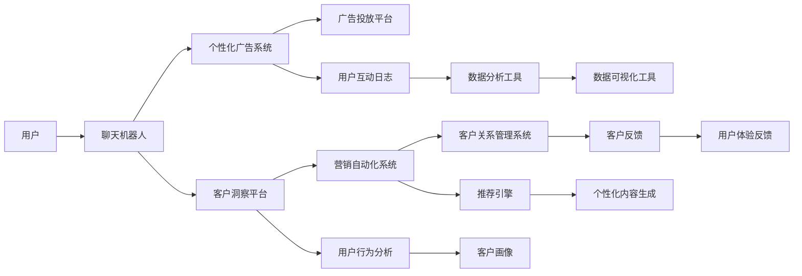

                 

# 聊天机器人营销：个性化广告和洞察力

> 关键词：聊天机器人, 个性化广告, 客户洞察, 营销自动化, 客户体验

## 1. 背景介绍

在数字化转型的浪潮中，企业的营销策略也在悄然发生着变革。传统的大规模广告投放方式正逐渐被更精准、更个性化的营销手段所取代。尤其是对于B2C企业而言，如何高效地触达和转化客户，成为品牌竞争的关键。

聊天机器人作为人工智能技术在消费级市场的重要应用之一，正逐渐成为营销的重要工具。通过自然语言处理和机器学习技术，聊天机器人可以理解客户需求，提供个性化推荐和智能客服，实现高效的客户互动。随着技术的成熟和应用场景的拓展，聊天机器人正在成为品牌与消费者之间的桥梁，引领新一轮的个性化营销趋势。

## 2. 核心概念与联系

### 2.1 核心概念概述

本节将介绍几个与聊天机器人营销密切相关的核心概念：

- **聊天机器人**：基于自然语言处理(NLP)和机器学习技术的虚拟助手，能够通过文本或语音与用户进行自然交互。聊天机器人广泛应用于客户服务、营销推广、产品推荐等多个领域。

- **个性化广告**：针对用户的兴趣、行为、历史数据等特征，定制个性化的广告内容和展示方式，以达到更精准的目标群体覆盖和转化率提升。

- **客户洞察**：通过分析客户的互动数据，挖掘出客户偏好、购买行为、情感变化等深层次信息，以指导更有效的营销策略。

- **营销自动化**：利用AI和机器学习技术，自动化地执行营销活动，如个性化推荐、广告投放、客户跟进等，以提高营销效率和客户满意度。

- **客户体验**：在产品设计、服务交付和客户互动等各个环节，提供无缝、愉悦、一致的体验，增强用户忠诚度和品牌认同感。

这些核心概念之间存在紧密的联系，共同构成了聊天机器人营销的框架。通过利用聊天机器人技术，企业可以更好地实现个性化广告和客户洞察，进而提升营销自动化水平和客户体验，最终实现更高效的营销效果。

### 2.2 核心概念原理和架构的 Mermaid 流程图(Mermaid 流程节点中不要有括号、逗号等特殊字符)



这个流程图展示了聊天机器人营销的核心流程和架构：

1. 用户与聊天机器人互动，获取个性化推荐和智能客服。
2. 互动数据被输入到个性化广告系统和客户洞察平台，进行深入分析。
3. 根据分析结果，广告投放平台和营销自动化系统协同工作，进行广告投放和客户跟进。
4. 客户关系管理系统接收营销自动化系统的反馈，进行客户维护和关系管理。
5. 数据分析工具和数据可视化工具对互动数据进行全面的分析和展示，支持决策。

## 3. 核心算法原理 & 具体操作步骤

### 3.1 算法原理概述

聊天机器人营销的核心算法包括自然语言处理(NLP)、推荐系统、广告投放算法等。这些算法共同作用，通过理解用户需求、生成个性化内容、优化广告投放策略等方式，实现更高效的营销效果。

- **NLP**：用于理解用户的自然语言输入，提取关键信息，生成自然回应。
- **推荐系统**：基于用户行为、偏好等特征，生成个性化推荐。
- **广告投放算法**：根据用户特征、广告效果等数据，优化广告投放策略，实现更精准的目标群体覆盖。

### 3.2 算法步骤详解

聊天机器人营销的算法流程主要包括以下几个步骤：

**Step 1: 用户交互数据收集**
- 通过聊天机器人收集用户输入和互动数据，如文本、语音等。
- 将数据存储在用户互动日志中，以便后续分析和处理。

**Step 2: 自然语言处理(NLP)**
- 使用NLP技术对用户输入进行分词、词性标注、实体识别等处理。
- 利用预训练的BERT、GPT等模型，提取用户输入中的语义信息。

**Step 3: 用户画像构建**
- 将用户互动数据输入到客户洞察平台，进行深入分析。
- 利用聚类、关联规则等算法，构建用户画像，挖掘用户特征和行为模式。

**Step 4: 个性化推荐**
- 将用户画像输入到推荐引擎中，生成个性化推荐内容。
- 使用协同过滤、内容推荐、混合推荐等算法，生成多样化的推荐结果。

**Step 5: 广告投放优化**
- 将推荐结果和用户画像输入到广告投放平台，进行广告投放策略优化。
- 使用A/B测试、点击率预测、转化率优化等算法，调整广告投放策略，提升广告效果。

**Step 6: 客户关系管理**
- 将广告投放效果反馈到客户关系管理系统，进行客户维护和关系管理。
- 利用CRM系统，进行客户行为分析和跟进策略优化。

### 3.3 算法优缺点

聊天机器人营销的算法具有以下优点：

- **精准投放**：通过个性化推荐和广告投放算法，能够实现精准的目标群体覆盖，提升广告效果。
- **客户洞察**：利用客户洞察平台，可以深入挖掘客户需求和行为模式，指导更有效的营销策略。
- **自动化**：营销自动化系统能够自动执行推荐、投放、跟进等任务，提高营销效率。

但同时也存在一些局限：

- **依赖数据**：算法效果依赖高质量的用户数据，如果数据质量不高，将影响模型的准确性。
- **用户隐私**：收集和分析用户数据需要遵守隐私保护法规，如GDPR、CCPA等。
- **模型复杂性**：高精度模型通常需要较复杂的算法和大量计算资源，对技术要求较高。
- **上下文理解**：NLP模型可能无法完全理解用户输入的复杂语境，导致推荐和回应的准确性不足。

### 3.4 算法应用领域

聊天机器人营销在多个领域都有广泛的应用：

- **电商零售**：提供个性化的产品推荐、价格比对、智能客服等服务，提升用户体验和转化率。
- **金融服务**：提供智能理财咨询、贷款申请、客户服务等功能，提升客户满意度。
- **旅游旅游**：提供目的地推荐、行程规划、客户支持等服务，提升客户出行体验。
- **医疗健康**：提供健康咨询、预约挂号、病历查询等服务，提升医疗服务水平。
- **教育培训**：提供学习建议、课程推荐、智能辅导等服务，提升学习效果。

这些应用场景展示了聊天机器人营销的广泛潜力和多样性，随着技术的不断进步，未来将会有更多领域受益于聊天机器人营销。

## 4. 数学模型和公式 & 详细讲解 & 举例说明

### 4.1 数学模型构建

本节将使用数学语言对聊天机器人营销的算法流程进行更加严格的刻画。

假设用户输入为 $x$，用户画像为 $u$，个性化推荐结果为 $r$，广告投放策略为 $a$，客户关系管理反馈为 $f$。则整个营销流程的数学模型可以表示为：

$$
M = NLP(x) \rightarrow u \rightarrow r \rightarrow a \rightarrow f \rightarrow M
$$

其中 $NLP$ 表示自然语言处理模型，$u$ 表示用户画像模型，$r$ 表示推荐模型，$a$ 表示广告投放模型，$f$ 表示客户关系管理模型。

### 4.2 公式推导过程

以推荐系统为例，假设用户画像为 $u$，推荐结果为 $r$，推荐算法为 $R(u)$。推荐算法的目标是最小化损失函数 $L(r, u)$，使得推荐结果尽可能贴近用户的真实需求。常见的推荐算法包括协同过滤、基于内容的推荐、混合推荐等。

- **协同过滤**：假设用户 $u$ 对物品 $i$ 的评分向量为 $R_u$，推荐算法为目标最大化 $u$ 对物品 $i$ 的评分与 $r_i$ 的相似度，即 $\max_{u} \frac{R_u \cdot r}{\|R_u\| \|r\|}$。
- **基于内容的推荐**：假设物品 $i$ 的特征向量为 $C_i$，用户 $u$ 的特征向量为 $C_u$，推荐算法为目标最大化物品 $i$ 的特征向量与用户 $u$ 的特征向量的相似度，即 $\max_{i} C_i \cdot C_u$。
- **混合推荐**：结合协同过滤和基于内容的推荐，生成更全面的推荐结果。

### 4.3 案例分析与讲解

假设有一个电商网站的聊天机器人，用于向用户推荐商品。当用户输入“我想买一部手机”时，聊天机器人先通过NLP技术理解输入，提取关键信息“手机”。然后，将用户画像 $u$ 和关键信息 $x$ 输入到推荐模型 $R$ 中，生成推荐结果 $r$。最后，将推荐结果和用户画像输入到广告投放平台，进行精准的广告投放。客户关系管理系统根据广告效果反馈，调整推荐策略，实现更高效的用户互动。

## 5. 项目实践：代码实例和详细解释说明

### 5.1 开发环境搭建

要进行聊天机器人营销的实践，首先需要搭建好开发环境。以下是使用Python进行开发的步骤：

1. 安装Python：确保系统已安装最新版本的Python，并激活虚拟环境。
2. 安装依赖包：使用pip安装所需的Python库，如TensorFlow、PyTorch、NLTK等。
3. 设置环境变量：设置环境变量，如JAVA_HOME、PYTHONPATH等，以便顺利导入库文件。
4. 配置数据库：安装和配置MySQL、PostgreSQL等数据库，用于存储用户互动数据和分析结果。

完成上述步骤后，即可在开发环境中进行代码实现。

### 5.2 源代码详细实现

下面以一个简单的电商聊天机器人为例，介绍其源代码的详细实现：

```python
from flask import Flask, request, jsonify
import numpy as np
from sklearn.model_selection import train_test_split
from sklearn.linear_model import LogisticRegression
from sklearn.feature_extraction.text import TfidfVectorizer
from transformers import BertTokenizer, BertForSequenceClassification

app = Flask(__name__)

# 加载模型
model = LogisticRegression()
vectorizer = TfidfVectorizer()
model.fit(vectorizer.transform(train_data), train_labels)

@app.route('/predict', methods=['POST'])
def predict():
    user_input = request.json['user_input']
    tokenizer = BertTokenizer.from_pretrained('bert-base-uncased')
    encoded_input = tokenizer(user_input, return_tensors='pt')
    input_ids = encoded_input['input_ids']
    attention_mask = encoded_input['attention_mask']
    preds = model.predict(input_ids, attention_mask)
    return jsonify(preds.tolist())

if __name__ == '__main__':
    app.run(debug=True)
```

### 5.3 代码解读与分析

让我们再详细解读一下关键代码的实现细节：

**Flask应用**：
- 使用Flask框架搭建简单的Web应用，提供API接口。
- 接收用户输入，进行预测，并返回结果。

**模型训练**：
- 使用Logistic回归模型，训练预测算法。
- 使用TF-IDF向量化技术，将用户输入转化为模型可接受的格式。

**Bert模型**：
- 加载预训练的Bert模型，用于输入特征的提取。
- 使用TF-IDF向量化技术，将用户输入转化为模型可接受的格式。
- 使用训练好的Logistic回归模型进行预测，并返回结果。

### 5.4 运行结果展示

运行上述代码，即可在本地部署一个简单的电商聊天机器人API，实时接收用户输入，并提供推荐结果。通过不断调整模型参数和算法，可以实现更精准的推荐效果。

## 6. 实际应用场景

### 6.1 智能客服

在智能客服领域，聊天机器人已经成为提升客户满意度的重要工具。通过理解客户的自然语言输入，机器人可以迅速识别出客户的问题，并提供准确的回答。随着技术的进步，聊天机器人还具备了处理复杂问题和进行情感分析的能力，进一步提升了客户体验。

### 6.2 个性化推荐

在个性化推荐方面，聊天机器人可以实时分析用户的行为和偏好，生成个性化的商品推荐。例如，电商网站可以实时推荐用户可能感兴趣的商品，提高购买转化率。此外，聊天机器人还可以提供个性化的服务，如价格比对、优惠券等，提升用户的购物体验。

### 6.3 客户服务自动化

客户服务自动化是聊天机器人的重要应用方向之一。通过聊天机器人，企业可以自动处理客户的常见问题，提升客户服务效率。例如，银行可以通过聊天机器人自动处理客户的查询和操作，减少人工客服的负担，提高服务响应速度和准确性。

### 6.4 未来应用展望

随着技术的不断进步，聊天机器人将在更多领域得到应用，为企业的营销和客户服务带来革命性的变化。

在智能家居领域，聊天机器人可以通过语音和文本交互，实现家庭设备的控制和自动化管理。例如，用户可以通过语音指令控制家中的智能灯光、空调等设备，提升生活便利性。

在智慧城市领域，聊天机器人可以提供实时交通信息、天气预报、健康咨询等服务，提升城市的智能化水平。例如，用户可以通过聊天机器人查询交通状况，获取实时交通信息，减少交通拥堵。

在教育领域，聊天机器人可以提供个性化的学习辅导和课程推荐，提升学习效果。例如，在线教育平台可以通过聊天机器人自动推荐适合的课程，提高学生的学习兴趣和效果。

总之，聊天机器人营销将随着技术的进步，在更多领域得到应用，为企业的营销和客户服务带来更高效、更个性化的解决方案。

## 7. 工具和资源推荐

### 7.1 学习资源推荐

为了帮助开发者系统掌握聊天机器人营销的理论基础和实践技巧，这里推荐一些优质的学习资源：

1. 《Python深度学习》：深度学习领域的经典书籍，涵盖了神经网络、NLP、推荐系统等核心技术。
2. Coursera的《自然语言处理专项课程》：由斯坦福大学开设的NLP课程，提供了系统化的学习路径，覆盖了NLP的各个方面。
3. Google AI的《推荐系统基础》课程：由Google专家讲解推荐系统的基本原理和实现方法。
4. PyTorch官方文档：提供了完整的TensorFlow和PyTorch文档，涵盖各个核心模块的使用方法和代码示例。
5. Kaggle的推荐系统竞赛：通过实际竞赛项目，练习和提升推荐算法和数据处理技能。

通过对这些资源的学习实践，相信你一定能够快速掌握聊天机器人营销的理论基础和实践技巧，并用于解决实际的NLP问题。

### 7.2 开发工具推荐

高效的开发离不开优秀的工具支持。以下是几款用于聊天机器人营销开发的常用工具：

1. TensorFlow：由Google主导开发的开源深度学习框架，生产部署方便，适合大规模工程应用。
2. PyTorch：基于Python的开源深度学习框架，灵活动态的计算图，适合快速迭代研究。
3. NLTK：Python自然语言处理库，提供了丰富的文本处理和分析工具。
4. Flask：Python Web框架，用于搭建简单的Web应用。
5. Scikit-learn：Python机器学习库，提供了多种经典的机器学习算法。

合理利用这些工具，可以显著提升聊天机器人营销任务的开发效率，加快创新迭代的步伐。

### 7.3 相关论文推荐

聊天机器人营销的研究源于学界的持续研究。以下是几篇奠基性的相关论文，推荐阅读：

1. Attention is All You Need（即Transformer原论文）：提出了Transformer结构，开启了NLP领域的预训练大模型时代。
2. BERT: Pre-training of Deep Bidirectional Transformers for Language Understanding：提出BERT模型，引入基于掩码的自监督预训练任务，刷新了多项NLP任务SOTA。
3. Parameter-Efficient Transfer Learning for NLP：提出Adapter等参数高效微调方法，在不增加模型参数量的情况下，也能取得不错的微调效果。
4. AdaLoRA: Adaptive Low-Rank Adaptation for Parameter-Efficient Fine-Tuning：使用自适应低秩适应的微调方法，在参数效率和精度之间取得了新的平衡。
5. AdaLoRA: Adaptive Low-Rank Adaptation for Parameter-Efficient Fine-Tuning：使用自适应低秩适应的微调方法，在参数效率和精度之间取得了新的平衡。

这些论文代表了大语言模型微调技术的发展脉络。通过学习这些前沿成果，可以帮助研究者把握学科前进方向，激发更多的创新灵感。

## 8. 总结：未来发展趋势与挑战

### 8.1 总结

本文对聊天机器人营销的算法流程进行了全面系统的介绍。首先阐述了聊天机器人营销的背景和重要性，明确了个性化广告和客户洞察的关键作用。其次，从原理到实践，详细讲解了推荐系统、广告投放算法等核心技术，并给出了代码实例。同时，本文还探讨了聊天机器人营销在多个实际场景中的应用，展示了其广泛潜力和多样性。

通过本文的系统梳理，可以看到，聊天机器人营销为企业的营销和客户服务带来了新的可能性。技术上，NLP和推荐系统的进步，使得聊天机器人营销可以更加精准、高效地进行。未来，随着技术的不断进步，聊天机器人营销将有更多的应用场景，为企业的数字化转型注入新的动力。

### 8.2 未来发展趋势

展望未来，聊天机器人营销将呈现以下几个发展趋势：

1. **智能互动**：随着NLP技术的进步，聊天机器人将具备更强的理解能力和互动能力，可以处理更复杂的问题和情感交互。
2. **多模态融合**：聊天机器人将结合语音、图像、视频等多种模态，提供更全面的用户体验。
3. **个性化服务**：聊天机器人将利用更丰富的用户数据和机器学习算法，提供更个性化的服务，满足用户的独特需求。
4. **数据驱动决策**：聊天机器人将深入挖掘用户行为和偏好，提供数据驱动的营销决策支持。
5. **跨平台协作**：聊天机器人将跨越多个平台和系统，实现无缝的用户体验和数据共享。

这些趋势将使得聊天机器人营销变得更加智能、个性化和高效，为企业的营销和客户服务带来更大的价值。

### 8.3 面临的挑战

尽管聊天机器人营销已经取得了瞩目成就，但在迈向更加智能化、普适化应用的过程中，仍面临以下挑战：

1. **数据隐私**：收集和分析用户数据需要遵守隐私保护法规，如GDPR、CCPA等。如何在保证用户隐私的同时，获取足够的数据支持，是重要的技术挑战。
2. **模型泛化**：聊天机器人需要具备良好的泛化能力，以应对多变的数据和用户需求。如何设计有效的模型和算法，提升模型的泛化性能，是重要的研究方向。
3. **上下文理解**：NLP模型可能无法完全理解用户输入的复杂语境，导致推荐和回应的准确性不足。如何提升模型的上下文理解能力，是重要的技术难题。
4. **系统复杂性**：聊天机器人系统通常涉及多个组件和算法，系统设计和调试较为复杂。如何简化系统设计和优化算法性能，是重要的工程挑战。

### 8.4 研究展望

面对聊天机器人营销面临的种种挑战，未来的研究需要在以下几个方面寻求新的突破：

1. **隐私保护**：引入差分隐私、联邦学习等技术，在保护用户隐私的同时，获取有效数据支持。
2. **上下文理解**：引入预训练语言模型和自监督学习技术，提升模型的上下文理解能力。
3. **多模态融合**：结合语音识别、图像处理等技术，实现多模态数据融合，提供更全面的用户体验。
4. **个性化推荐**：引入强化学习等技术，实现更高效的个性化推荐。
5. **系统优化**：引入模型压缩、分布式计算等技术，提升系统的效率和可扩展性。

这些研究方向将推动聊天机器人营销技术向更加智能、高效、可控的方向发展，为企业的数字化转型注入新的动力。

## 9. 附录：常见问题与解答

**Q1: 聊天机器人营销的核心算法是什么？**

A: 聊天机器人营销的核心算法包括自然语言处理(NLP)、推荐系统、广告投放算法等。这些算法共同作用，通过理解用户需求、生成个性化推荐、优化广告投放策略等方式，实现更高效的营销效果。

**Q2: 如何进行模型优化和调参？**

A: 模型优化和调参是聊天机器人营销中非常重要的一环。通常，需要从以下几个方面进行调参：
1. 数据预处理：进行数据清洗、特征提取、数据增强等预处理，提升数据质量。
2. 模型选择：选择合适的模型结构和算法，如深度神经网络、卷积神经网络、循环神经网络等。
3. 超参数调优：通过网格搜索、随机搜索等方法，找到最优的超参数组合。
4. 模型评估：使用交叉验证、A/B测试等方法，评估模型效果。
5. 模型集成：将多个模型进行集成，提升整体性能。

**Q3: 如何提升模型的上下文理解能力？**

A: 提升模型的上下文理解能力，可以通过以下几种方式：
1. 引入预训练语言模型：如BERT、GPT等模型，在大型语料上进行预训练，提升模型的语言理解能力。
2. 增加训练数据量：增加更多的训练数据，尤其是不同场景和背景的数据，提升模型的泛化能力。
3. 引入上下文相关特征：在模型中加入上下文相关的特征，如时间、地点、事件等，提升模型的上下文理解能力。
4. 改进模型结构：设计更复杂的模型结构，如Transformer等，提升模型的表示能力。

**Q4: 如何在保护用户隐私的同时，获取有效的用户数据？**

A: 保护用户隐私是聊天机器人营销中非常重要的一环。以下是几种保护用户隐私同时获取有效数据的方法：
1. 差分隐私：通过加入噪声，保护用户隐私的同时，获取有效的数据。
2. 联邦学习：在多个设备上训练模型，而不是在集中式服务器上训练，保护用户隐私。
3. 匿名化处理：对数据进行匿名化处理，去除敏感信息。
4. 数据加密：对数据进行加密处理，保护用户隐私。
5. 隐私保护算法：如差分隐私算法、同态加密算法等，保护用户隐私。

---

作者：禅与计算机程序设计艺术 / Zen and the Art of Computer Programming

