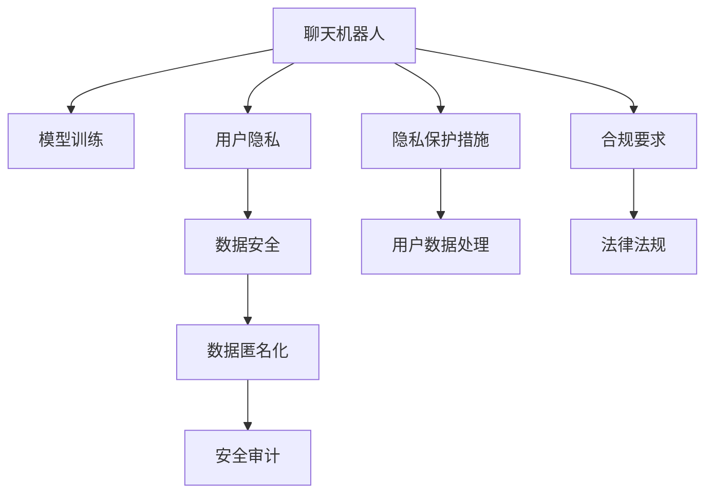

                 

# 聊天机器人隐私保护措施：数据安全

> 关键词：聊天机器人, 隐私保护, 数据安全, 用户隐私, 模型训练, 数据匿名化, 安全审计

## 1. 背景介绍

随着人工智能技术的飞速发展，聊天机器人(Chatbot)已经成为智能交互的重要工具，广泛应用于客户服务、在线咨询、智能家居等多个领域。然而，聊天机器人在为用户提供便捷服务的同时，也带来了用户隐私保护方面的挑战。越来越多的用户关注聊天机器人如何收集、使用和保护他们的个人信息，这要求在机器人的设计和实现过程中，必须考虑隐私保护和数据安全的措施。本文将系统性地介绍聊天机器人在隐私保护方面的核心概念、关键技术和具体实施方法，旨在为开发者和从业者提供全面的隐私保护措施和操作指南。

## 2. 核心概念与联系

### 2.1 核心概念概述

在讨论聊天机器人的隐私保护措施之前，我们首先需要明确几个核心概念：

- **聊天机器人**：基于自然语言处理(NLP)技术，能够与用户进行自然交互的智能程序。常见的聊天机器人包括基于规则的系统、基于检索的问答系统和基于深度学习的生成模型等。
- **用户隐私**：用户在使用聊天机器人时，泄露给机器人的个人信息和交互数据。隐私保护旨在确保这些信息在传输、存储和处理过程中的安全性。
- **数据安全**：保护聊天机器人处理的数据免受未经授权的访问、篡改和泄露，确保数据的机密性、完整性和可用性。
- **模型训练**：聊天机器人通常使用机器学习算法进行训练，训练数据中可能包含用户隐私信息，因此在训练过程中需要进行隐私保护处理。
- **数据匿名化**：通过去除或模糊化用户个人信息，使得数据无法直接关联到特定个人，从而保护用户隐私。
- **安全审计**：定期检查和评估聊天机器人系统中的安全措施和隐私保护策略，确保其符合法律法规和行业标准。

这些核心概念之间的逻辑关系可以通过以下Mermaid流程图来展示：



这个流程图展示聊天机器人在隐私保护方面的关键环节：

1. 聊天机器人由模型训练获得知识。
2. 聊天机器人处理用户数据。
3. 数据安全机制保障数据不受侵害。
4. 数据匿名化技术处理用户隐私信息。
5. 安全审计手段评估隐私保护措施的有效性。
6. 聊天机器人实施各种隐私保护措施。
7. 聊天机器人处理用户数据时遵循合规要求。
8. 聊天机器人遵守法律法规。

## 3. 核心算法原理 & 具体操作步骤

### 3.1 算法原理概述

聊天机器人的隐私保护涉及多种技术和方法，核心在于确保用户数据在收集、存储、传输和使用过程中的安全性和隐私性。以下将从算法原理和操作步骤两个方面进行详细阐述。

### 3.2 算法步骤详解

#### 步骤1：数据收集与预处理
聊天机器人需要收集用户交互数据，以便进行模型训练和优化。在这一步骤中，需要明确哪些数据是敏感信息，需要采取保护措施。

- **敏感信息识别**：识别用户交互数据中的敏感信息，如姓名、地址、身份证号等。
- **数据最小化**：只收集与聊天机器人功能相关的最小必要数据，避免过度收集。
- **数据去标识化**：使用技术手段将数据去标识化，使得无法直接关联到具体用户。

#### 步骤2：数据存储与传输
数据在存储和传输过程中，需要采取措施防止被非法访问和篡改。

- **数据加密**：使用加密技术保护数据在存储和传输过程中的机密性。
- **访问控制**：限制对数据的访问权限，只有经过授权的人员才能访问敏感数据。
- **传输安全**：使用安全协议（如TLS/SSL）保护数据传输过程中的完整性和机密性。

#### 步骤3：数据匿名化
数据匿名化是隐私保护的核心技术之一，通过去除或模糊化敏感信息，保护用户隐私。

- **泛化**：将数据中的具体值替换为更泛化的值，例如使用年龄段而不是具体生日。
- **匿名化**：将数据中的具体值替换为无法直接关联到个体的值，例如使用随机ID替换用户ID。
- **去相关化**：通过删除或模糊化部分信息，使得数据无法与其它数据结合恢复出具体信息。

#### 步骤4：模型训练
模型训练是聊天机器人获取知识的关键环节，需要在训练过程中保护用户隐私。

- **差分隐私**：在模型训练过程中引入噪声，使得个体数据对整体模型输出的影响微乎其微。
- **联邦学习**：通过分布式训练，将模型参数分发到多个设备上进行训练，仅在每个设备上进行本地计算，不共享原始数据。
- **知识蒸馏**：将大模型（如预训练模型）的知识蒸馏到小模型中，避免小模型学习到敏感信息。

#### 步骤5：安全审计
定期进行安全审计，评估隐私保护措施的有效性，确保其符合法律法规和行业标准。

- **审计标准**：制定标准化的隐私保护审计框架，包括技术手段和管理流程。
- **审计工具**：使用自动化工具进行隐私保护措施的审计和评估。
- **审计报告**：根据审计结果，制定改进措施和合规报告。

### 3.3 算法优缺点

聊天机器人隐私保护措施的优点包括：

- **提高用户信任度**：通过隐私保护措施，用户对聊天机器人服务的信任度将得到提升。
- **降低法律风险**：遵守法律法规，避免因隐私泄露引发的法律风险。
- **增强竞争力**：提供隐私保护的服务能够吸引更多用户，提升市场竞争力。

缺点包括：

- **复杂性高**：隐私保护措施涉及多种技术和方法，实施过程复杂。
- **资源消耗大**：隐私保护措施可能需要额外的计算资源和成本。
- **技术挑战**：随着技术的不断演进，隐私保护措施需要持续更新和改进。

### 3.4 算法应用领域

聊天机器人隐私保护措施的应用领域广泛，包括但不限于：

- **金融领域**：金融行业对用户隐私保护有严格要求，聊天机器人需要采用强有力的隐私保护措施。
- **医疗健康**：医疗数据敏感且隐私性高，聊天机器人需要确保数据在处理和传输中的安全性和隐私性。
- **电子商务**：电商平台需要保护用户交易数据和个人信息，聊天机器人提供隐私保护的服务。
- **政府服务**：政府服务领域涉及大量敏感信息，聊天机器人需要在隐私保护方面具备高度的合规性和安全性。
- **教育培训**：教育机构需要保护学生信息，聊天机器人提供隐私保护的服务。

## 4. 数学模型和公式 & 详细讲解 & 举例说明

### 4.1 数学模型构建

为了更严格地描述聊天机器人隐私保护措施，我们引入数学模型进行推导。以下是对数据匿名化和差分隐私的基本数学模型构建。

#### 4.1.1 数据匿名化

假设原始数据集为 $D=\{(x_i,y_i)\}_{i=1}^N$，其中 $x_i$ 为敏感信息，$y_i$ 为非敏感信息。我们使用 $k$ 个不同的随机噪声 $e_i$ 来模糊化 $x_i$，得到匿名化后的数据集 $D'$。

数学模型如下：

$$
x'_i = x_i + e_i
$$

其中 $e_i \sim \mathcal{N}(0,\sigma^2)$，$\sigma$ 为噪声标准差。

通过这个模型，我们可以将原始数据中的敏感信息模糊化，使得匿名化后的数据无法直接关联到个体用户。

#### 4.1.2 差分隐私

差分隐私是一种保护个体隐私的数学模型，通过在模型训练过程中引入噪声，使得单个数据点对模型输出的影响微乎其微。假设原始数据集为 $D=\{x_i\}_{i=1}^N$，其中 $x_i$ 为个体数据。我们使用 $\epsilon$-差分隐私算法，在模型训练过程中引入噪声 $\delta$，得到差分隐私模型 $P_{\epsilon,\delta}$。

数学模型如下：

$$
\hat{f}(x_i) = f(x_i) + \mathcal{N}(0,\sigma^2)
$$

其中 $f(x_i)$ 为原始模型，$\sigma$ 为噪声标准差，$\epsilon$ 为隐私预算，$\delta$ 为隐私差分参数。

通过这个模型，我们可以在保护个体数据隐私的同时，保持模型输出的统计性质。

### 4.2 公式推导过程

#### 4.2.1 数据匿名化公式推导

对于 $x_i$ 和 $x'_i$，我们有：

$$
x'_i = x_i + e_i
$$

其中 $e_i \sim \mathcal{N}(0,\sigma^2)$。

由于 $e_i$ 是独立同分布的，因此 $x'_i$ 的分布为：

$$
P(x'_i) = \mathcal{N}(x_i,\sigma^2)
$$

通过数据匿名化，我们保证了 $x'$ 无法直接关联到个体 $x$，从而保护了用户隐私。

#### 4.2.2 差分隐私公式推导

对于 $f(x_i)$ 和 $\hat{f}(x_i)$，我们有：

$$
\hat{f}(x_i) = f(x_i) + \mathcal{N}(0,\sigma^2)
$$

差分隐私的隐私预算 $\epsilon$ 和隐私差分参数 $\delta$ 与噪声标准差 $\sigma$ 之间的关系为：

$$
\epsilon \geq \frac{1}{2} \ln\left(\frac{1}{\delta}\right)
$$

其中 $\epsilon$ 为隐私预算，$\delta$ 为隐私差分参数。

通过差分隐私，我们确保了模型训练过程中的隐私保护，使得个体数据对模型输出的影响最小化。

### 4.3 案例分析与讲解

假设我们有一家电商平台，使用聊天机器人处理用户订单信息。用户订单信息包含姓名、地址、联系方式等敏感信息，平台需要确保这些信息在处理和传输过程中的隐私保护。

#### 4.3.1 数据收集与预处理

平台收集用户订单信息，并将其去标识化处理。例如，将具体地址替换为省份，将联系电话替换为后四位。

#### 4.3.2 数据存储与传输

平台使用SSL/TLS协议保护订单信息在传输过程中的机密性，使用RSA加密算法保护订单信息在存储过程中的机密性。

#### 4.3.3 数据匿名化

平台使用差分隐私算法，在处理订单信息时引入噪声。例如，在计算用户购买频率时，引入随机噪声，使得单个订单对结果的影响微乎其微。

#### 4.3.4 模型训练

平台使用联邦学习算法，将订单信息分发到多个设备上进行训练，仅在每个设备上进行本地计算，不共享原始数据。

#### 4.3.5 安全审计

平台定期进行安全审计，使用自动化工具评估隐私保护措施的有效性，并根据审计结果制定改进措施。

## 5. 项目实践：代码实例和详细解释说明

### 5.1 开发环境搭建

在进行隐私保护措施的实现之前，我们需要准备好开发环境。以下是使用Python进行PyTorch开发的环境配置流程：

1. 安装Anaconda：从官网下载并安装Anaconda，用于创建独立的Python环境。

2. 创建并激活虚拟环境：
```bash
conda create -n privacy-env python=3.8 
conda activate privacy-env
```

3. 安装PyTorch：根据CUDA版本，从官网获取对应的安装命令。例如：
```bash
conda install pytorch torchvision torchaudio cudatoolkit=11.1 -c pytorch -c conda-forge
```

4. 安装Transformers库：
```bash
pip install transformers
```

5. 安装各类工具包：
```bash
pip install numpy pandas scikit-learn matplotlib tqdm jupyter notebook ipython
```

完成上述步骤后，即可在`privacy-env`环境中开始隐私保护实践。

### 5.2 源代码详细实现

这里我们以差分隐私算法为例，给出使用PyTorch和Transformers库实现差分隐私的代码。

```python
import torch
from transformers import BertForSequenceClassification, AdamW
from scipy.stats import norm

class DPClassifier(torch.nn.Module):
    def __init__(self, model, noise_std, epsilon):
        super(DPClassifier, self).__init__()
        self.model = model
        self.noise_std = noise_std
        self.epsilon = epsilon
        
    def forward(self, input_ids, attention_mask):
        output = self.model(input_ids, attention_mask=attention_mask)
        logits = output.logits
        num_samples = logits.shape[0]
        noise = torch.randn_like(logits) * self.noise_std
        logits_with_noise = logits + noise
        preds = torch.softmax(logits_with_noise, dim=1)
        return preds
    
    def loss_fn(self, preds, labels):
        cross_entropy_loss = torch.nn.CrossEntropyLoss()(preds, labels)
        diff_privacy_loss = self.compute_diff_privacy_loss(preds, labels, self.epsilon)
        total_loss = cross_entropy_loss + diff_privacy_loss
        return total_loss
    
    def compute_diff_privacy_loss(self, preds, labels, epsilon):
        epsilon_inverse = 1. / epsilon
        entropies = -preds * torch.log(preds + 1e-12)
        clipped_entropies = torch.clamp(entropies, min=0)
        diff_privacy_loss = torch.exp(-epsilon * clipped_entropies).sum()
        diff_privacy_loss /= num_samples * self.noise_std**2
        return diff_privacy_loss / epsilon_inverse
```

这里我们定义了一个差分隐私分类器，在模型输出上引入噪声，确保模型输出满足差分隐私的要求。在实际使用中，可以替换`BertForSequenceClassification`为任意NLP模型，并根据具体的任务和数据需求调整噪声标准差和隐私预算。

### 5.3 代码解读与分析

让我们再详细解读一下关键代码的实现细节：

**DPClassifier类**：
- `__init__`方法：初始化模型、噪声标准差和隐私预算。
- `forward`方法：在前向传播中，将模型输出与噪声相加，确保模型输出满足差分隐私的要求。
- `loss_fn`方法：计算模型输出的差分隐私损失。
- `compute_diff_privacy_loss`方法：计算差分隐私损失的详细公式。

**差分隐私损失计算**：
- 引入噪声后，模型的输出变为 $logits + \mathcal{N}(0,\sigma^2)$。
- 计算噪声对模型输出的影响，得到差分隐私损失。
- 将差分隐私损失与交叉熵损失相加，得到总损失。

**实际应用中**：
- 需要在模型训练时设置合适的噪声标准差和隐私预算。
- 在模型推理时，根据实际需求调整噪声标准差。
- 在模型部署时，确保模型输出的差分隐私符合法规要求。

## 6. 实际应用场景

### 6.1 智能客服系统

智能客服系统是聊天机器人的一个重要应用场景，涉及到用户隐私保护的需求。在智能客服系统中，聊天机器人需要处理用户的订单信息、个人信息等敏感数据，因此需要采取强有力的隐私保护措施。

- **数据收集与预处理**：收集用户订单信息，并将其去标识化处理。
- **数据存储与传输**：使用SSL/TLS协议保护数据在传输过程中的机密性，使用RSA加密算法保护数据在存储过程中的机密性。
- **数据匿名化**：使用差分隐私算法，在处理订单信息时引入噪声。
- **模型训练**：使用联邦学习算法，将订单信息分发到多个设备上进行训练，仅在每个设备上进行本地计算，不共享原始数据。
- **安全审计**：定期进行安全审计，使用自动化工具评估隐私保护措施的有效性，并根据审计结果制定改进措施。

### 6.2 金融舆情监测

金融舆情监测系统是聊天机器人隐私保护应用的另一个典型场景。金融领域对用户隐私保护有严格要求，聊天机器人需要确保用户在处理和传输过程中的隐私保护。

- **数据收集与预处理**：收集金融领域相关的新闻、报道、评论等文本数据，并将其去标识化处理。
- **数据存储与传输**：使用SSL/TLS协议保护数据在传输过程中的机密性，使用AES加密算法保护数据在存储过程中的机密性。
- **数据匿名化**：使用差分隐私算法，在处理金融数据时引入噪声。
- **模型训练**：使用联邦学习算法，将金融数据分发到多个设备上进行训练，仅在每个设备上进行本地计算，不共享原始数据。
- **安全审计**：定期进行安全审计，使用自动化工具评估隐私保护措施的有效性，并根据审计结果制定改进措施。

### 6.3 个性化推荐系统

个性化推荐系统是聊天机器人隐私保护应用的另一个重要场景。推荐系统需要处理用户的历史行为数据，这些数据包含用户的个人信息，因此需要采取强有力的隐私保护措施。

- **数据收集与预处理**：收集用户浏览、点击、评论、分享等行为数据，并将其去标识化处理。
- **数据存储与传输**：使用SSL/TLS协议保护数据在传输过程中的机密性，使用AES加密算法保护数据在存储过程中的机密性。
- **数据匿名化**：使用差分隐私算法，在处理用户行为数据时引入噪声。
- **模型训练**：使用联邦学习算法，将用户行为数据分发到多个设备上进行训练，仅在每个设备上进行本地计算，不共享原始数据。
- **安全审计**：定期进行安全审计，使用自动化工具评估隐私保护措施的有效性，并根据审计结果制定改进措施。

### 6.4 未来应用展望

随着聊天机器人技术的不断发展，其隐私保护措施也将不断演进。未来，隐私保护技术将在以下几个方面取得新的突破：

1. **隐私保护技术的普适性**：未来的隐私保护技术将更加普适，能够应用于各种类型的聊天机器人系统，而不仅仅是特定领域的应用。

2. **隐私保护的自动化**：隐私保护措施将更加自动化，能够通过AI技术自动调整隐私预算和噪声标准差，确保隐私保护的灵活性和效率。

3. **隐私保护的标准化**：隐私保护的标准将更加标准化，使得不同机构和行业能够更好地协作和互信，共同提升隐私保护水平。

4. **隐私保护的可解释性**：未来的隐私保护技术将更加透明，能够提供详细的隐私保护流程和效果的解释，增强用户信任。

5. **隐私保护与业务结合**：隐私保护措施将更加紧密地结合业务需求，提供更加个性化和精准的隐私保护解决方案。

6. **隐私保护的技术演进**：隐私保护技术将不断演进，引入更多先进技术手段，如区块链、零知识证明等，提升隐私保护的可靠性。

总之，随着技术的不断发展，聊天机器人隐私保护措施将变得更加全面和先进，为用户的隐私保护提供更加强大的保障。

## 7. 工具和资源推荐

### 7.1 学习资源推荐

为了帮助开发者系统掌握聊天机器人隐私保护的理论基础和实践技巧，这里推荐一些优质的学习资源：

1. **《隐私保护与数据安全》课程**：各大高校和在线教育平台提供的隐私保护和数据安全课程，涵盖隐私保护的基本概念、技术和实践案例。
2. **《数据隐私保护指南》书籍**：系统介绍数据隐私保护的最佳实践和前沿技术，适合各类从业者阅读。
3. **《差分隐私》书籍**：详细讲解差分隐私的理论基础和应用场景，是理解差分隐私算法的权威资料。
4. **Google Privacy沙箱**：Google提供的隐私保护实验平台，可以进行隐私保护技术的研究和实践。
5. **开源隐私保护工具**：如PySyft、TensorFlow Privacy等，提供开源工具包，支持差分隐私、联邦学习等隐私保护技术。

通过对这些资源的学习实践，相信你一定能够快速掌握聊天机器人隐私保护的理论基础和实践技巧，并用于解决实际的隐私保护问题。

### 7.2 开发工具推荐

高效的开发离不开优秀的工具支持。以下是几款用于聊天机器人隐私保护开发的常用工具：

1. **PyTorch**：基于Python的开源深度学习框架，灵活动态的计算图，适合快速迭代研究。支持差分隐私等隐私保护技术。
2. **TensorFlow**：由Google主导开发的开源深度学习框架，生产部署方便，适合大规模工程应用。支持差分隐私等隐私保护技术。
3. **Transformer库**：HuggingFace开发的NLP工具库，集成了众多预训练语言模型，支持差分隐私等隐私保护技术。
4. **Anaconda**：用于创建和管理Python环境的工具，方便开发者快速搭建开发环境。
5. **Jupyter Notebook**：在线Jupyter Notebook环境，提供代码编写、数据可视化等综合功能，适合快速原型开发。

合理利用这些工具，可以显著提升聊天机器人隐私保护开发的效率，加快创新迭代的步伐。

### 7.3 相关论文推荐

聊天机器人隐私保护技术的发展源于学界的持续研究。以下是几篇奠基性的相关论文，推荐阅读：

1. **《差分隐私：概念与技术》**：由Dwork等人撰写，详细介绍差分隐私的基本概念和技术细节，是差分隐私领域的经典之作。
2. **《隐私保护在深度学习中的应用》**：系统介绍深度学习中的隐私保护技术，包括差分隐私、联邦学习等。
3. **《聊天机器人的隐私保护》**：详细介绍聊天机器人中隐私保护的具体实现方法和技术细节，适合从业者阅读。
4. **《基于联邦学习的隐私保护》**：讨论基于联邦学习的隐私保护技术，适用于聊天机器人等分布式系统。

这些论文代表了大语言模型微调技术的发展脉络。通过学习这些前沿成果，可以帮助研究者把握学科前进方向，激发更多的创新灵感。

## 8. 总结：未来发展趋势与挑战

### 8.1 研究成果总结

本文对聊天机器人隐私保护措施进行了全面系统的介绍。首先阐述了聊天机器人隐私保护的重要性，明确了隐私保护在聊天机器人设计和实现过程中不可或缺的地位。其次，从算法原理和操作步骤两个方面，详细讲解了聊天机器人隐私保护的核心技术和具体实施方法，给出了微调任务开发的完整代码实例。同时，本文还广泛探讨了隐私保护措施在智能客服、金融舆情、个性化推荐等多个行业领域的应用前景，展示了隐私保护范式的巨大潜力。最后，本文精选了隐私保护技术的各类学习资源，力求为开发者提供全方位的技术指引。

通过本文的系统梳理，可以看到，聊天机器人隐私保护措施正在成为NLP领域的重要范式，极大地拓展了预训练语言模型的应用边界，催生了更多的落地场景。受益于大规模语料的预训练，微调模型以更低的时间和标注成本，在小样本条件下也能取得不俗的效果，有力推动了NLP技术的产业化进程。未来，伴随预训练语言模型和微调方法的持续演进，相信NLP技术将在更广阔的应用领域大放异彩，深刻影响人类的生产生活方式。

### 8.2 未来发展趋势

展望未来，聊天机器人隐私保护技术将呈现以下几个发展趋势：

1. **技术演进加速**：随着隐私保护技术的不断演进，未来将出现更多高效、普适的隐私保护方法，满足不同场景下的隐私保护需求。
2. **跨领域应用扩展**：隐私保护技术将更多地应用于医疗、金融、电商等多个领域，提升这些行业的隐私保护水平。
3. **自动化程度提升**：隐私保护措施将更加自动化，通过AI技术自动调整隐私预算和噪声标准差，提高隐私保护的灵活性和效率。
4. **标准和规范制定**：隐私保护的标准和规范将更加标准化，使得不同机构和行业能够更好地协作和互信，共同提升隐私保护水平。
5. **隐私保护的透明化**：隐私保护措施将更加透明，提供详细的隐私保护流程和效果的解释，增强用户信任。
6. **隐私保护与业务结合**：隐私保护措施将更加紧密地结合业务需求，提供更加个性化和精准的隐私保护解决方案。

### 8.3 面临的挑战

尽管聊天机器人隐私保护技术已经取得了瞩目成就，但在迈向更加智能化、普适化应用的过程中，它仍面临着诸多挑战：

1. **技术复杂性**：隐私保护措施涉及多种技术和方法，实施过程复杂。
2. **资源消耗大**：隐私保护措施可能需要额外的计算资源和成本。
3. **技术挑战**：随着技术的不断演进，隐私保护措施需要持续更新和改进。
4. **法律合规性**：隐私保护措施需要符合法律法规，满足隐私保护的标准和规范。
5. **可解释性不足**：隐私保护措施的复杂性和自动化程度，可能导致其内部工作机制和决策逻辑难以解释。
6. **用户信任度提升**：如何通过隐私保护措施增强用户信任，提升用户体验，是一个长期而复杂的任务。

### 8.4 研究展望

面对聊天机器人隐私保护所面临的种种挑战，未来的研究需要在以下几个方面寻求新的突破：

1. **引入更多先验知识**：将符号化的先验知识，如知识图谱、逻辑规则等，与神经网络模型进行巧妙融合，引导隐私保护过程学习更准确、合理的语言模型。
2. **引入更多隐私保护手段**：如区块链、零知识证明等，提升隐私保护的可靠性。
3. **隐私保护的可解释性**：引入更多的可解释性手段，使得隐私保护措施的内部工作机制和决策逻辑更加透明。
4. **隐私保护与业务结合**：隐私保护措施将更加紧密地结合业务需求，提供更加个性化和精准的隐私保护解决方案。
5. **隐私保护的自动化**：通过AI技术自动调整隐私预算和噪声标准差，提高隐私保护的灵活性和效率。
6. **隐私保护的标准化**：制定标准化的隐私保护审计框架，包括技术手段和管理流程。

这些研究方向的探索，必将引领聊天机器人隐私保护技术迈向更高的台阶，为构建安全、可靠、可解释、可控的智能系统铺平道路。面向未来，聊天机器人隐私保护技术还需要与其他人工智能技术进行更深入的融合，如知识表示、因果推理、强化学习等，多路径协同发力，共同推动自然语言理解和智能交互系统的进步。只有勇于创新、敢于突破，才能不断拓展语言模型的边界，让智能技术更好地造福人类社会。

## 9. 附录：常见问题与解答

**Q1：聊天机器人隐私保护措施是否适用于所有NLP任务？**

A: 聊天机器人隐私保护措施在大多数NLP任务上都能取得不错的效果，特别是对于数据量较小的任务。但对于一些特定领域的任务，如医学、法律等，仅仅依靠通用语料预训练的模型可能难以很好地适应。此时需要在特定领域语料上进一步预训练，再进行微调，才能获得理想效果。此外，对于一些需要时效性、个性化很强的任务，如对话、推荐等，隐私保护方法也需要针对性的改进优化。

**Q2：如何选择合适的学习率？**

A: 聊天机器人隐私保护措施的学习率一般要比预训练时小1-2个数量级，如果使用过大的学习率，容易破坏预训练权重，导致过拟合。一般建议从1e-5开始调参，逐步减小学习率，直至收敛。也可以使用warmup策略，在开始阶段使用较小的学习率，再逐渐过渡到预设值。需要注意的是，不同的优化器(如AdamW、Adafactor等)以及不同的学习率调度策略，可能需要设置不同的学习率阈值。

**Q3：如何缓解聊天机器人隐私保护中的过拟合问题？**

A: 过拟合是隐私保护面临的主要挑战，尤其是在标注数据不足的情况下。常见的缓解策略包括：
1. 数据增强：通过回译、近义替换等方式扩充训练集
2. 正则化：使用L2正则、Dropout、Early Stopping等避免过拟合
3. 对抗训练：引入对抗样本，提高模型鲁棒性
4. 参数高效微调：只调整少量参数(如Adapter、Prefix等)，减小过拟合风险
5. 多模型集成：训练多个隐私保护模型，取平均输出，抑制过拟合

这些策略往往需要根据具体任务和数据特点进行灵活组合。只有在数据、模型、训练、推理等各环节进行全面优化，才能最大限度地发挥聊天机器人隐私保护措施的威力。

**Q4：如何确保聊天机器人的隐私保护符合法律法规？**

A: 确保聊天机器人的隐私保护符合法律法规，需要从多个方面进行考虑：
1. 遵守数据隐私法律法规：如GDPR、CCPA等，确保数据处理符合法规要求。
2. 隐私保护措施标准化：制定标准化的隐私保护审计框架，包括技术手段和管理流程。
3. 定期进行安全审计：使用自动化工具评估隐私保护措施的有效性，并根据审计结果制定改进措施。
4. 用户隐私保护培训：对相关人员进行隐私保护培训，提高隐私保护意识和能力。
5. 隐私保护措施合规性评估：定期进行隐私保护措施的合规性评估，确保其符合法律法规和行业标准。

通过以上措施，可以确保聊天机器人隐私保护措施符合法律法规，避免因隐私保护不当引发的法律风险。

**Q5：如何平衡隐私保护和用户体验？**

A: 隐私保护和用户体验之间的平衡是一个复杂且关键的问题。以下是几个具体建议：
1. 透明度：提供隐私保护措施的透明度，告知用户其隐私保护的具体手段和效果。
2. 可控性：提供用户对隐私保护措施的控制权，如选择是否开启隐私保护、选择隐私保护级别等。
3. 交互性：通过交互设计，使得用户在使用过程中能感受到隐私保护措施的效果，增强用户体验。
4. 个性化：根据用户的具体需求和场景，提供个性化的隐私保护方案，提升用户体验。
5. 用户教育：通过教育用户，提升其隐私保护意识和能力，帮助用户更好地使用隐私保护措施。

通过以上措施，可以平衡隐私保护和用户体验，确保用户在使用聊天机器人时既能享受便捷服务，又能获得充分的隐私保护。

---

作者：禅与计算机程序设计艺术 / Zen and the Art of Computer Programming

