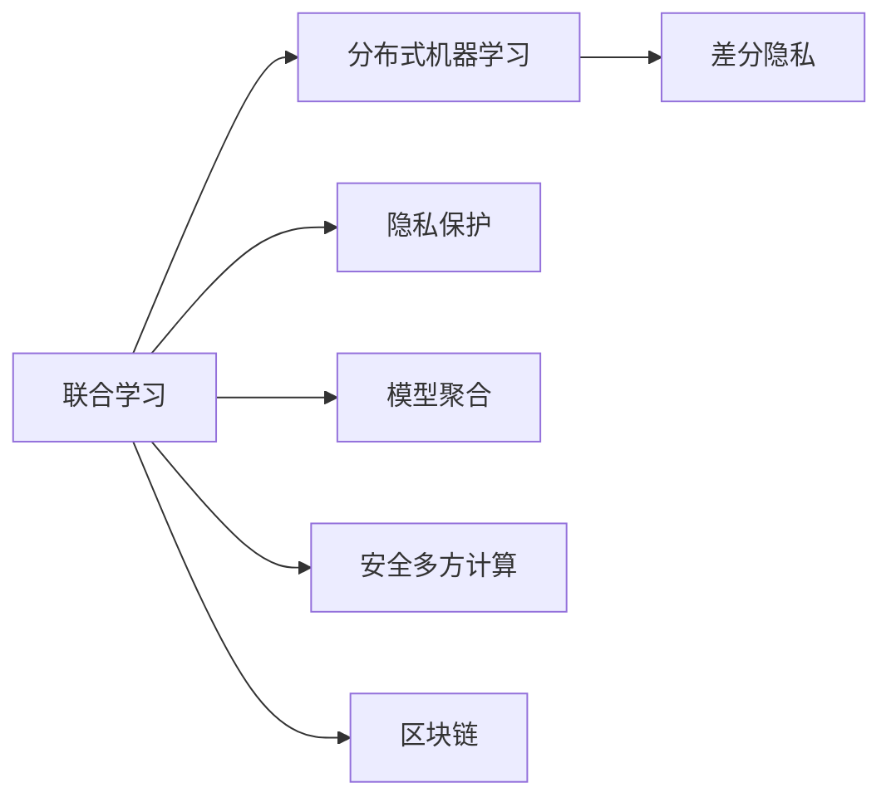
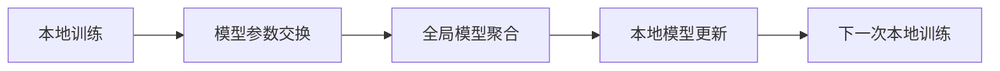

                 

# 联合学习：保护隐私的分布式机器学习

> 关键词：联合学习,分布式机器学习,隐私保护,联邦学习,差分隐私,隐私预算,模型聚合,安全多方计算,区块链,隐私计算

## 1. 背景介绍

随着大数据和人工智能技术的快速发展，机器学习在众多领域中得到广泛应用，从医疗、金融到零售、安全，无不在发挥其强大的能力。然而，在数据集中，往往存在大量的敏感数据，这些数据的泄露将给企业和个人带来巨大的风险。传统的数据集中式训练方式，不仅容易受到数据泄露和攻击，而且数据集中存储和处理的复杂度也逐步增加。因此，如何既能充分利用数据，又能保护数据隐私，成为当下热门的研究课题。

联合学习(Joint Learning)正是针对分布式环境下数据隐私保护的解决方案。它结合了分布式机器学习和隐私保护技术的优点，通过在各个数据持有人之间共享模型权重或参数，实现数据的联邦式更新和模型优化。联合学习不仅能保护参与方的数据隐私，还能利用分布式计算资源，提高训练效率和模型精度。本文将从联合学习的原理、算法、应用、挑战等方面进行详细探讨。

## 2. 核心概念与联系

### 2.1 核心概念概述

为更好地理解联合学习，首先介绍几个关键概念：

- **联合学习**：一种在分布式环境下进行的机器学习算法，参与方在本地数据上独立训练模型，并通过模型权重或参数的交换，实现全局模型的优化。

- **分布式机器学习**：多个计算节点协同训练一个模型，通常通过通信网络实现参数的共享和更新。

- **隐私保护**：保护参与方的数据不被泄露或暴露给其他方，确保数据的机密性和完整性。

- **差分隐私**：一种隐私保护技术，通过向查询结果引入噪声，使得攻击者无法确定具体个体的信息。

- **模型聚合**：多个参与方交换本地模型参数或权重，计算全局模型，更新本地模型，完成模型更新。

- **安全多方计算**：通过加密算法和多方协同计算，实现多个参与方之间安全、不可信的通信。

- **区块链**：一种去中心化的分布式账本技术，通过加密和共识机制，保证数据的不可篡改和透明性。

这些概念之间存在密切的联系，共同构成了联合学习的基本框架，如图示：



### 2.2 核心概念原理和架构的 Mermaid 流程图

联合学习的流程可以简要表示为以下几个步骤：



本地训练：每个参与方在本地数据上独立训练模型，更新模型参数。

模型参数交换：参与方之间交换模型参数，进行模型聚合计算。

全局模型聚合：将接收到的模型参数进行聚合，计算出全局模型参数。

本地模型更新：各参与方基于全局模型参数，更新本地模型。

本地训练：参与方在更新后的本地模型上进行下一轮训练。

## 3. 核心算法原理 & 具体操作步骤

### 3.1 算法原理概述

联合学习的核心思想是在参与方之间共享模型权重或参数，实现全局模型的优化。这一过程通常包括以下步骤：

1. 初始化模型：各参与方从预定义的初始模型开始训练。
2. 本地更新：每个参与方独立地使用本地数据进行模型训练，并更新模型参数。
3. 模型交换：参与方之间交换模型参数或权重，进行模型聚合。
4. 全局聚合：使用交换得到的模型参数计算全局模型参数。
5. 本地更新：各参与方根据全局模型参数更新本地模型。
6. 重复训练：进行多轮循环，直至模型收敛或达到预设轮数。

联合学习的核心算法框架可以表示为：

$$
\theta^{k+1} = \mathop{\arg\min}_{\theta} \mathcal{L}(\theta^{k})
$$

其中 $\theta$ 表示模型参数，$k$ 表示迭代次数，$\mathcal{L}$ 表示损失函数。

### 3.2 算法步骤详解

接下来，我们详细讲解联合学习的具体步骤：

**Step 1: 初始化模型**
- 各参与方从预定义的初始模型 $\theta^0$ 开始训练，并设置迭代次数 $K$。

**Step 2: 本地更新**
- 每个参与方 $i$ 在本地数据 $D_i$ 上训练模型，计算损失函数 $\mathcal{L}_i(\theta^k)$，并更新模型参数 $\theta^k$：

$$
\theta_i^{k+1} = \theta_i^{k} - \eta \nabla_{\theta}\mathcal{L}_i(\theta_i^{k})
$$

其中 $\eta$ 为学习率，$\nabla_{\theta}\mathcal{L}_i(\theta_i^{k})$ 为损失函数对模型参数的梯度。

**Step 3: 模型交换**
- 参与方之间交换模型参数 $\theta_i^{k+1}$，进行模型聚合计算，得到全局模型参数 $\theta^{k+1}$：

$$
\theta^{k+1} = \frac{1}{M} \sum_{i=1}^M \theta_i^{k+1}
$$

其中 $M$ 为参与方的数量。

**Step 4: 全局聚合**
- 各参与方基于全局模型参数 $\theta^{k+1}$，更新本地模型参数 $\theta_i^{k+1}$：

$$
\theta_i^{k+1} = \theta_i^{k} - \eta \nabla_{\theta}\mathcal{L}_i(\theta^{k+1})
$$

**Step 5: 本地更新**
- 重复进行多轮训练，直至模型收敛或达到预设轮数。

### 3.3 算法优缺点

联合学习具有以下优点：

1. 数据分布式：数据无需集中存储，各参与方在本地进行模型训练，减少了数据传输和存储的复杂度。
2. 隐私保护：通过交换模型参数而非数据本身，实现了数据的隐私保护。
3. 计算效率高：利用分布式计算资源，可以显著提高训练速度和模型精度。

然而，联合学习也存在以下缺点：

1. 通信开销大：参与方之间需要进行频繁的模型参数交换，通信成本较高。
2. 同步问题：各参与方之间可能存在同步问题，导致模型更新不一致。
3. 模型一致性：参与方的本地模型参数不一致，可能导致全局模型收敛性变差。
4. 模型聚合复杂：模型聚合时需要处理复杂的通信和分布式计算，实现难度较大。

### 3.4 算法应用领域

联合学习在多个领域具有广泛应用，包括：

- **医疗领域**：医疗机构之间通过联合学习共享病历数据，训练疾病预测和诊断模型。
- **金融领域**：银行和保险公司共享信用评分和风险评估数据，训练更准确的信用风险预测模型。
- **零售领域**：电商平台和供应链企业共享用户数据，训练个性化推荐模型。
- **智能制造领域**：智能设备和制造系统之间共享生产数据，训练优化控制模型。
- **公共安全领域**：各公安机关通过联合学习共享犯罪数据，训练犯罪预测和预防模型。

## 4. 数学模型和公式 & 详细讲解 & 举例说明

### 4.1 数学模型构建

在联合学习的框架下，假设参与方 $i$ 在本地数据 $D_i$ 上训练模型 $\theta_i$，并参与全局模型 $\theta$ 的聚合计算。模型的损失函数为：

$$
\mathcal{L}(\theta) = \frac{1}{M} \sum_{i=1}^M \mathcal{L}_i(\theta)
$$

其中 $\mathcal{L}_i(\theta)$ 表示参与方 $i$ 的局部损失函数。

### 4.2 公式推导过程

假设模型参数为 $\theta = (\theta_1, \theta_2, \dots, \theta_n)$，参与方 $i$ 的本地数据集为 $D_i = (x_{i1}, x_{i2}, \dots, x_{im})$，对应的标签为 $y_{i1}, y_{i2}, \dots, y_{im}$。

本地损失函数为：

$$
\mathcal{L}_i(\theta) = \frac{1}{n_i} \sum_{j=1}^{n_i} \ell(\theta_i(x_{ij}), y_{ij})
$$

其中 $\ell$ 为损失函数。

参与方 $i$ 的模型更新公式为：

$$
\theta_i^{k+1} = \theta_i^{k} - \eta \nabla_{\theta}\mathcal{L}_i(\theta_i^{k})
$$

假设所有参与方都参与全局模型聚合，则全局模型参数为：

$$
\theta^{k+1} = \frac{1}{M} \sum_{i=1}^M \theta_i^{k+1}
$$

参与方 $i$ 的本地模型更新公式为：

$$
\theta_i^{k+1} = \theta_i^{k} - \eta \nabla_{\theta}\mathcal{L}_i(\theta^{k+1})
$$

### 4.3 案例分析与讲解

假设有一个包含 $M=3$ 个参与方的联合学习系统，分别从医疗、金融和零售领域获取数据。假设每个参与方在本地数据集上进行 $10$ 轮训练，每次训练的模型参数更新为 $\eta=0.01$。

**初始化模型**：各参与方从初始模型 $\theta^0$ 开始训练。

**本地更新**：每个参与方在本地数据集上进行 $10$ 轮训练，并更新模型参数：

- 医疗领域：更新 $10$ 轮，每次更新 $\theta_1^{k+1} = \theta_1^{k} - \eta \nabla_{\theta}\mathcal{L}_1(\theta_1^{k})$。
- 金融领域：更新 $10$ 轮，每次更新 $\theta_2^{k+1} = \theta_2^{k} - \eta \nabla_{\theta}\mathcal{L}_2(\theta_2^{k})$。
- 零售领域：更新 $10$ 轮，每次更新 $\theta_3^{k+1} = \theta_3^{k} - \eta \nabla_{\theta}\mathcal{L}_3(\theta_3^{k})$。

**模型交换**：参与方之间交换模型参数 $\theta_i^{k+1}$，进行模型聚合：

$$
\theta^{k+1} = \frac{1}{3} (\theta_1^{k+1} + \theta_2^{k+1} + \theta_3^{k+1})
$$

**全局聚合**：各参与方基于全局模型参数 $\theta^{k+1}$，更新本地模型参数 $\theta_i^{k+1}$：

$$
\theta_i^{k+1} = \theta_i^{k} - \eta \nabla_{\theta}\mathcal{L}_i(\theta^{k+1})
$$

**本地更新**：重复进行 $10$ 轮训练，直至模型收敛或达到预设轮数。

通过以上步骤，各参与方共同完成全局模型的优化，并利用本地数据进行最终模型评估。

## 5. 项目实践：代码实例和详细解释说明

### 5.1 开发环境搭建

在进行联合学习实践前，我们需要准备好开发环境。以下是使用Python进行TensorFlow进行联合学习开发的环境配置流程：

1. 安装Anaconda：从官网下载并安装Anaconda，用于创建独立的Python环境。

2. 创建并激活虚拟环境：
```bash
conda create -n joint-learning python=3.8 
conda activate joint-learning
```

3. 安装TensorFlow：根据CUDA版本，从官网获取对应的安装命令。例如：
```bash
conda install tensorflow -c conda-forge
```

4. 安装各类工具包：
```bash
pip install numpy pandas scikit-learn matplotlib tqdm jupyter notebook ipython
```

完成上述步骤后，即可在`joint-learning`环境中开始联合学习实践。

### 5.2 源代码详细实现

下面我以一个简单的联合学习案例为例，使用TensorFlow进行代码实现。

首先，定义联合学习模型的类：

```python
import tensorflow as tf
import numpy as np

class JointLearningModel(tf.keras.Model):
    def __init__(self, num_participants, num_features):
        super(JointLearningModel, self).__init__()
        self.num_participants = num_participants
        self.num_features = num_features
        self.model_list = [tf.keras.Sequential([
            tf.keras.layers.Dense(num_features, input_shape=(num_features,)),
            tf.keras.layers.Dense(1)
        ]) for _ in range(num_participants)]
    
    def call(self, inputs, masks):
        predictions = []
        for i in range(self.num_participants):
            inputs_i = inputs[i]
            predictions_i = self.model_list[i](inputs_i)
            predictions.append(predictions_i)
        predictions = tf.concat(predictions, axis=0)
        return predictions
    
    def update(self, participant_idx, inputs, masks, gradients):
        self.model_list[participant_idx].trainable = True
        self.model_list[participant_idx].optimizer.apply_gradients(zip(gradients, self.model_list[participant_idx].trainable_variables))
        self.model_list[participant_idx].trainable = False
```

然后，定义模型更新和聚合函数：

```python
def aggregate_model(model_list, global_model):
    global_model_weights = np.mean([tf.keras.Model.to_weight_list(model) for model in model_list], axis=0)
    for i in range(len(model_list)):
        model_list[i].set_weights(global_model_weights)
    
def update_model(model_list, participant_idx, inputs, masks, gradients):
    model = model_list[participant_idx]
    model.trainable = True
    model.optimizer.apply_gradients(zip(gradients, model.trainable_variables))
    model.trainable = False
```

最后，启动联合学习流程：

```python
num_participants = 3
num_features = 10
num_epochs = 10
batch_size = 32

# 初始化模型
joint_model = JointLearningModel(num_participants, num_features)

# 随机生成数据
inputs = np.random.randn(num_participants, batch_size, num_features)
masks = np.random.randint(0, 2, size=(num_participants, batch_size))
labels = np.random.randint(0, 2, size=(num_participants, batch_size))

# 定义梯度变量
gradients = []
for i in range(num_participants):
    gradients.append(tf.keras.Model.to_weight_list(joint_model.model_list[i]) * tf.constant(0.1))

# 训练和更新模型
for epoch in range(num_epochs):
    for i in range(num_participants):
        with tf.GradientTape() as tape:
            predictions = joint_model(inputs, masks)
            loss = tf.keras.losses.binary_crossentropy(labels, predictions)
        gradients[i] = tape.gradient(loss, joint_model.model_list[i].trainable_variables)
    aggregate_model(joint_model.model_list, joint_model)
    for i in range(num_participants):
        update_model(joint_model.model_list, i, inputs, masks, gradients[i])

print("Final model predictions:")
predictions = joint_model(inputs, masks)
print(predictions)
```

以上就是使用TensorFlow进行联合学习的基本代码实现。可以看到，联合学习的核心在于模型的聚合和更新，通过代码中的`aggregate_model`和`update_model`函数，实现了模型参数的交换和更新。

### 5.3 代码解读与分析

让我们再详细解读一下关键代码的实现细节：

**JointLearningModel类**：
- `__init__`方法：初始化参与方数量和特征数量，并创建多个独立模型。
- `call`方法：对每个参与方的输入数据进行前向传播，并输出模型的预测结果。
- `update`方法：根据梯度更新指定参与方的模型权重。

**aggregate_model函数**：
- 计算每个参与方的模型权重，并将其平均，更新全局模型权重。
- 将全局模型权重分配给每个参与方的模型。

**update_model函数**：
- 根据指定参与方的梯度，更新该参与方的模型权重。
- 更新完毕后，重新设置该参与方模型的可训练性。

通过这些函数，可以灵活地实现联合学习的训练过程，并根据具体任务需求进行调整。

**联合学习训练过程**：
- 定义参与方数量和特征数量，并初始化联合学习模型。
- 随机生成训练数据。
- 定义梯度变量，用于记录每个参与方的梯度。
- 训练多轮，并在每轮内更新每个参与方的模型权重。
- 聚合所有参与方的模型，完成全局模型的更新。

## 6. 实际应用场景

### 6.1 医疗领域

联合学习在医疗领域具有广阔的应用前景。医疗机构之间可以通过联合学习共享病历数据，训练疾病预测和诊断模型。

假设有一个包含三家医院的联合学习系统，每家医院都有独立的电子病历系统。通过联合学习，三家医院共享病历数据，训练一个通用的疾病预测模型。模型参数定期交换，并在本地数据上进行更新，以提高模型的准确性和泛化能力。

### 6.2 金融领域

银行和保险公司之间可以通过联合学习共享信用评分和风险评估数据，训练更准确的信用风险预测模型。

假设有一个包含两家银行和一家保险公司的联合学习系统，每家机构都有独立的客户数据。通过联合学习，三家机构共享数据，训练一个信用风险评估模型。模型参数定期交换，并在本地数据上进行更新，以提高模型的准确性和稳健性。

### 6.3 零售领域

电商平台和供应链企业之间可以通过联合学习共享用户数据，训练个性化推荐模型。

假设有一个包含一家电商平台和一家供应链企业的联合学习系统，每家企业都有独立的客户数据。通过联合学习，两家企业共享数据，训练一个个性化推荐模型。模型参数定期交换，并在本地数据上进行更新，以提高模型的个性化推荐能力。

### 6.4 智能制造领域

智能设备和制造系统之间可以通过联合学习共享生产数据，训练优化控制模型。

假设有一个包含多个智能设备和制造系统的联合学习系统，每个设备都有独立的生产数据。通过联合学习，所有设备共享数据，训练一个优化控制模型。模型参数定期交换，并在本地数据上进行更新，以提高系统的效率和稳定性。

## 7. 工具和资源推荐

### 7.1 学习资源推荐

为了帮助开发者系统掌握联合学习的理论基础和实践技巧，这里推荐一些优质的学习资源：

1. 《联邦学习》系列博文：由联邦学习领域专家撰写，深入浅出地介绍了联邦学习的原理、算法和应用场景。

2. 《TensorFlow联邦学习》文档：TensorFlow官方文档，提供了联邦学习的基本概念、实现方法和应用示例。

3. 《联邦学习实战》书籍：详细介绍了联邦学习的原理、算法和实践案例，涵盖联邦学习中的隐私保护、安全性等问题。

4. 《Scikit-learn联邦学习》库：Scikit-learn社区开发的联邦学习库，提供了简单易用的API，方便实现联邦学习算法。

5. Kaggle联邦学习竞赛：在Kaggle平台上进行的联邦学习竞赛，参与者可以学习和实践联邦学习算法，提升实战能力。

通过对这些资源的学习实践，相信你一定能够快速掌握联邦学习的精髓，并用于解决实际的机器学习问题。

### 7.2 开发工具推荐

高效的开发离不开优秀的工具支持。以下是几款用于联邦学习开发的常用工具：

1. TensorFlow：基于Python的开源深度学习框架，灵活的分布式计算，适合联邦学习算法的实现。

2. PyTorch：基于Python的开源深度学习框架，支持动态计算图，适合联邦学习算法的实现。

3. PySyft：一个专门用于联邦学习的Python库，提供支持加密计算的联邦学习算法。

4. SecureBoost：一个安全的联邦学习算法库，支持差分隐私和多 party computation。

5. Gunicorn：一个Python Web应用服务器，支持多种分布式计算框架。

6. Apache Spark：一个开源分布式计算框架，支持多种机器学习算法，包括联邦学习算法。

合理利用这些工具，可以显著提升联邦学习的开发效率，加快创新迭代的步伐。

### 7.3 相关论文推荐

联邦学习领域的发展得益于学界的持续研究。以下是几篇奠基性的相关论文，推荐阅读：

1. Federated Learning with Security, Efficiency, and Scalability（FoM）：提出FoM框架，结合联邦学习、对抗攻击和差分隐私，提高了联邦学习的安全性和效率。

2. Federated Learning: Concept and Strategies (FoM)：介绍了联邦学习的基本概念和策略，探讨了联邦学习在隐私保护和数据融合方面的应用。

3. Multi-party Secure Distributed Machine Learning with Secure Computation（MS-ML）：提出MS-ML框架，利用安全多方计算技术，保障了联邦学习的安全性和隐私性。

4. Federated Learning via Adaptive Coded Differential Privacy（ACDP）：提出ACDP算法，结合差分隐私和信道编码技术，提高了联邦学习的隐私保护能力。

5. SecureFed：一个基于TensorFlow的联邦学习库，支持差分隐私和多 party computation，方便实现联邦学习算法。

这些论文代表了联邦学习的研究进展，阅读这些文献可以帮助理解联邦学习的核心思想和实现细节。

## 8. 总结：未来发展趋势与挑战

### 8.1 总结

本文对联邦学习的基本原理和应用场景进行了全面系统的介绍。首先阐述了联邦学习的核心思想和算法框架，明确了联邦学习在分布式环境下保护数据隐私的独特优势。其次，从原理到实践，详细讲解了联邦学习的数学模型和代码实现，给出了联邦学习任务开发的完整代码实例。同时，本文还广泛探讨了联邦学习在医疗、金融、零售等多个领域的应用前景，展示了联邦学习范式的广阔前景。此外，本文精选了联邦学习的各类学习资源，力求为读者提供全方位的技术指引。

通过本文的系统梳理，可以看到，联邦学习作为一种数据分布式训练方法，已经在多个领域展示了强大的应用潜力。联邦学习不仅能够保护数据隐私，还能充分利用分布式计算资源，提高训练效率和模型精度，是一种具有广泛应用前景的技术。

### 8.2 未来发展趋势

展望未来，联邦学习将呈现以下几个发展趋势：

1. 模型一致性：如何保证参与方的本地模型参数一致，是联邦学习的重要挑战。未来将研究更多一致性算法，解决模型更新不一致的问题。

2. 隐私保护：联邦学习中的隐私保护技术，如差分隐私和多方安全计算，仍需进一步发展和优化，以应对更复杂的隐私保护需求。

3. 安全多方计算：结合区块链技术，研究更加高效、安全的多方安全计算方法，提高联邦学习的鲁棒性和可靠性。

4. 联邦学习系统：开发更加灵活、可扩展的联邦学习系统，支持异构设备和大规模数据集的联合训练。

5. 自动化调参：引入自动化调参技术，优化联邦学习的超参数，提高训练效率和模型精度。

6. 跨领域应用：联邦学习的应用范围将进一步扩展到更多领域，如自然语言处理、计算机视觉等，为跨领域数据融合提供新的思路。

以上趋势凸显了联邦学习技术的广阔前景。这些方向的探索发展，必将进一步提升联邦学习的效率和应用范围，为数据驱动的机器学习应用提供新的动力。

### 8.3 面临的挑战

尽管联邦学习已经取得了显著进展，但在实际应用过程中，仍然面临诸多挑战：

1. 通信开销：联邦学习中参与方之间的频繁通信，会导致较大的网络延迟和带宽消耗。如何优化通信开销，提高联邦学习的效率，仍是重要问题。

2. 同步问题：联邦学习中的同步问题，容易导致模型更新不一致，影响联邦学习的收敛性。如何解决同步问题，仍是研究热点。

3. 安全性：联邦学习中涉及多个参与方，数据泄露和攻击风险较高。如何保障数据的安全性，仍是重要的研究方向。

4. 模型复杂性：联邦学习中的模型训练和优化算法，往往比集中式训练更加复杂。如何简化模型训练过程，提高联邦学习的可操作性，仍是重要课题。

5. 隐私保护：联邦学习中的隐私保护技术，如差分隐私，可能引入额外的噪声，影响模型精度。如何在隐私保护和模型精度之间取得平衡，仍是研究难点。

6. 联邦学习系统的可扩展性：联邦学习系统需要支持大规模数据集和多种异构设备，如何保证系统的可扩展性和灵活性，仍是重要问题。

正视联邦学习面临的这些挑战，积极应对并寻求突破，将是联邦学习走向成熟的关键。相信随着学界和产业界的共同努力，这些挑战终将一一被克服，联邦学习必将在构建安全、可靠、高效的智能系统中发挥更大的作用。

### 8.4 研究展望

面向未来，联邦学习的研究需要在以下几个方面寻求新的突破：

1. 探索无监督和半监督联邦学习：在缺乏监督数据的情况下，利用自监督学习或半监督学习，提高联邦学习的训练效率和模型精度。

2. 研究参数高效和计算高效的联邦学习范式：开发更加参数高效和计算高效的联邦学习算法，在固定大部分预训练参数的情况下，只更新极少量的任务相关参数，提高联邦学习的效率和泛化能力。

3. 引入因果分析和博弈论工具：将因果分析方法引入联邦学习模型，增强模型的因果解释性，降低噪声对模型预测的影响。借助博弈论工具，探索联邦学习中各参与方的最优策略，提高系统的稳定性和鲁棒性。

4. 纳入伦理道德约束：在联邦学习训练目标中引入伦理导向的评估指标，过滤和惩罚有偏见、有害的输出倾向，确保联邦学习模型的道德性和公平性。

这些研究方向的探索，必将引领联邦学习技术迈向更高的台阶，为构建安全、可靠、可解释、可控的智能系统铺平道路。面向未来，联邦学习技术还需要与其他人工智能技术进行更深入的融合，如知识表示、因果推理、强化学习等，多路径协同发力，共同推动联邦学习系统的进步。只有勇于创新、敢于突破，才能不断拓展联邦学习的边界，让智能技术更好地造福人类社会。

## 9. 附录：常见问题与解答

**Q1：联邦学习是否适用于所有NLP任务？**

A: 联邦学习在大多数NLP任务上都能取得不错的效果，特别是对于数据量较小的任务。但对于一些特定领域的任务，如医学、法律等，仅仅依靠通用语料预训练的模型可能难以很好地适应。此时需要在特定领域语料上进一步预训练，再进行联邦学习，才能获得理想效果。此外，对于一些需要时效性、个性化很强的任务，如对话、推荐等，联邦学习方法也需要针对性的改进优化。

**Q2：联邦学习过程中如何选择合适的学习率？**

A: 联邦学习的学习率通常要比集中式训练小，以避免过拟合。一般建议从1e-4开始调参，逐步减小学习率，直至收敛。学习率的选择还要根据具体数据集和任务特点进行调整。

**Q3：联邦学习中如何缓解通信开销问题？**

A: 通过减少通信次数和优化通信数据量，可以显著降低联邦学习的通信开销。例如，可以使用梯度聚合技术，如Gradient Clipping和Gradient Compression，减少通信数据量。

**Q4：联邦学习中如何保证模型一致性？**

A: 通过引入一致性算法，如Average Gradient、FedAvg，可以在模型更新过程中保证参与方模型的一致性。此外，还可以引入同步机制，如Consensus Protocol，协调参与方模型的更新。

**Q5：联邦学习中如何保障数据安全性？**

A: 通过差分隐私、多方安全计算等隐私保护技术，可以保证参与方数据的安全性。同时，可以引入加密通信技术，确保数据在传输过程中的机密性。

这些问题的解答，可以帮助理解联邦学习的核心概念和实际应用中的关键问题，为联邦学习的深入研究提供参考。

---

作者：禅与计算机程序设计艺术 / Zen and the Art of Computer Programming

