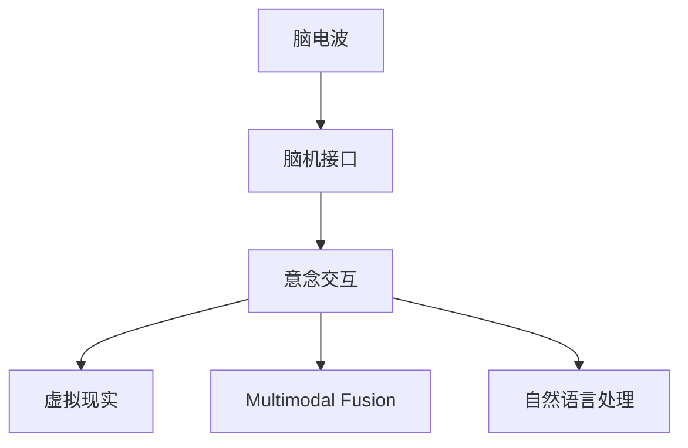

                 

# 脑机接口在虚拟现实中的应用：直接意念交互

> 关键词：脑机接口,虚拟现实,意念交互,意念控制,脑电波,神经信号,脑-机通信,用户界面,应用场景,技术挑战

## 1. 背景介绍

### 1.1 问题由来
随着科技的不断进步，虚拟现实(Virtual Reality, VR)技术已不再是科幻小说中的梦想。从游戏娱乐到医学训练，从教育培训到军事模拟，VR的应用领域越来越广泛。但传统的用户输入方式（如鼠标、手柄等）往往存在延迟、操作繁琐等问题，难以提供沉浸式体验。如何实现更为自然、高效的交互方式，成为研究人员和工程师面临的重要课题。

脑机接口（Brain-Computer Interface, BCI）技术提供了一种全新的交互方式，通过采集大脑发出的电信号，实时翻译为控制命令，实现人与机器的直接沟通。在虚拟现实领域，BCI技术的应用更是带来了革命性的变化，用户可以通过意念直接操控虚拟场景，实现真正意义上的“思维控制”。

### 1.2 问题核心关键点
脑机接口在虚拟现实中的应用，涉及多个核心关键点：
- 脑电信号采集与预处理：准确采集和处理大脑的电信号，是BCI系统的基础。
- 特征提取与分类：从采集信号中提取出能够代表用户意图的特征，并使用机器学习模型进行分类。
- 意念交互协议：定义信号与虚拟场景的映射关系，实现用户意念与虚拟对象的直接控制。
- 多模态交互融合：结合视觉、听觉、触觉等多种感知信息，提升虚拟现实系统的自然度和沉浸感。
- 实时性和稳定性：保证BCI系统的高响应速度和稳定性能，确保用户体验。

本文将围绕这些核心关键点，系统介绍BCI在虚拟现实中的应用，探讨其实现原理、关键技术和应用场景。

## 2. 核心概念与联系

### 2.1 核心概念概述

为更好地理解BCI在虚拟现实中的应用，本节将介绍几个密切相关的核心概念：

- 脑电波（Electroencephalography, EEG）：通过头皮电极采集人脑表面的电信号，反映大脑的活动状态。
- 脑机接口（Brain-Computer Interface, BCI）：通过脑电信号实现人脑与计算机之间的直接通信。
- 意念交互（Mind Control Interaction）：利用BCI技术，将用户大脑发出的电信号实时转化为控制命令，实现对虚拟场景的直接控制。
- 虚拟现实（Virtual Reality, VR）：通过计算机生成的人工环境，模拟用户在真实世界中的体验，实现沉浸式交互。
- 多模态融合（Multimodal Fusion）：将视觉、听觉、触觉等多种感知信息与脑电信号结合，提升虚拟现实系统的自然度和互动性。
- 自然语言处理（Natural Language Processing, NLP）：在虚拟现实中，通过BCI实现意念控制自然语言输出，实现人机自然交流。

这些核心概念之间的逻辑关系可以通过以下Mermaid流程图来展示：



这个流程图展示了大语言模型的核心概念及其之间的关系：

1. 脑电波是BCI技术的基础，采集和处理大脑电信号。
2. 脑机接口通过分析脑电信号，将脑电信号转化为控制命令。
3. 意念交互利用BCI技术，实现对虚拟场景的直接控制。
4. 虚拟现实系统通过意念交互，实现沉浸式体验。
5. 多模态融合提升虚拟现实系统的自然度和互动性。
6. 自然语言处理在虚拟现实中，实现意念控制自然语言输出。

## 3. 核心算法原理 & 具体操作步骤
### 3.1 算法原理概述

BCI在虚拟现实中的应用，主要依赖于脑电信号的采集、预处理、特征提取、分类与输出。其核心思想是：通过脑电信号分析，提取代表用户意图的特征，并使用机器学习模型进行分类，从而实现对虚拟场景的直接控制。

形式化地，假设用户输入的脑电信号为 $x_t$，虚拟现实系统的控制命令为 $u_t$。则BCI系统的目标是寻找最优映射函数 $f$，使得：

$$
u_t = f(x_t)
$$

其中 $f$ 需要满足映射关系准确、响应速度快、鲁棒性高等要求。

### 3.2 算法步骤详解

基于BCI的虚拟现实系统一般包括以下几个关键步骤：

**Step 1: 脑电信号采集**
- 安装头皮电极，采集大脑电信号。
- 将信号实时传输至计算机进行后续处理。

**Step 2: 信号预处理**
- 对采集到的原始信号进行滤波、去噪、降噪等预处理，提升信号质量。
- 使用独立成分分析(Independent Component Analysis, ICA)等方法进行信号分离，提取有用信号。

**Step 3: 特征提取**
- 从预处理后的信号中提取代表用户意图的特征，如频率、振幅、能量等。
- 使用小波变换、傅里叶变换、神经网络等方法，提取信号的时频特征。

**Step 4: 特征分类**
- 使用支持向量机(Support Vector Machine, SVM)、神经网络等机器学习模型，对提取的特征进行分类。
- 训练分类器，使用交叉验证等方法进行模型调参。

**Step 5: 控制命令输出**
- 将分类器输出的控制命令，映射为虚拟场景中的控制指令。
- 使用虚拟现实引擎，根据控制指令更新虚拟场景。

**Step 6: 交互反馈**
- 根据用户反馈，调整分类器参数，提升系统响应速度和准确性。
- 结合视觉、听觉、触觉等多种感知信息，提升用户体验。

### 3.3 算法优缺点

基于BCI的虚拟现实系统具有以下优点：
1. 自然度高：直接通过意念控制虚拟场景，无需传统的外设设备，大大提升了用户的沉浸感和自然度。
2. 交互便捷：用户可以通过意念实时控制虚拟场景，无需繁琐的手部操作，简化了交互流程。
3. 应用广泛：可以应用于医疗康复、教育培训、娱乐游戏等多个领域，具有广阔的应用前景。
4. 技术新颖：BCI技术融合了脑科学、神经科学、计算机科学等多个学科，具有前瞻性和创新性。

同时，该系统也存在一定的局限性：
1. 精度限制：目前BCI系统的精度仍受限于信号采集和处理技术，难以实现完全的意念控制。
2. 数据量大：脑电信号的采集和处理需要大量计算资源，增加了系统实现的复杂度。
3. 实时性挑战：系统需要高速处理大量数据，以保证实时响应，对硬件设备提出了高要求。
4. 用户体验不稳定：系统响应速度和准确性受到用户状态和情绪的影响，难以保证一致性。

尽管存在这些局限性，但BCI技术在虚拟现实中的应用前景依然广阔，未来随着技术进步和应用推广，有望逐步解决现有问题。

### 3.4 算法应用领域

基于BCI的虚拟现实系统已经在多个领域取得了初步应用，例如：

- 医疗康复：利用BCI系统，帮助肢体残疾人士通过意念控制虚拟康复环境，进行康复训练。
- 游戏娱乐：在电子游戏中，用户可以通过意念控制角色移动、攻击等，提升游戏体验。
- 教育培训：在虚拟教室中，教师可以通过意念控制PPT、视频等教学内容，增强互动性。
- 军事训练：在模拟战场中，士兵可以通过意念控制武器装备，进行战术演练。
- 工业控制：在虚拟工厂中，工人可以通过意念控制机器设备，进行技能培训。

除了上述这些应用外，BCI技术在虚拟现实领域的应用还将不断扩展，为各行各业带来新的技术突破和应用场景。

## 4. 数学模型和公式 & 详细讲解 & 举例说明

### 4.1 数学模型构建

为更好地理解BCI在虚拟现实中的应用，本节将通过数学语言对系统实现进行更加严格的刻画。

假设脑电信号 $x_t$ 是 $d$ 维的向量，控制命令 $u_t$ 是 $m$ 维的向量。BCI系统的目标是找到一个映射函数 $f$，使得：

$$
u_t = f(x_t) = Wx_t + b
$$

其中 $W$ 是 $m \times d$ 的权重矩阵，$b$ 是偏置向量。

### 4.2 公式推导过程

以下我们以分类任务为例，推导SVM分类器的构建和训练过程。

假设训练数据集为 $\{(x_i, y_i)\}_{i=1}^N$，其中 $x_i \in \mathbb{R}^d$，$y_i \in \{0, 1\}$。SVM分类器的目标是找到最优超平面，使得分类误差最小化。假设训练误差为 $C$，则SVM分类器的目标函数为：

$$
\min_{W,b} \frac{1}{2}\Vert W\Vert^2 + C\sum_{i=1}^N \mathbb{I}(y_i(Wx_i + b) < 0)
$$

其中 $\mathbb{I}$ 为示性函数。

通过引入拉格朗日乘子 $\alpha$，可以将上述目标函数转化为对偶问题：

$$
\max_{\alpha} \sum_{i=1}^N \alpha_i - \frac{1}{2}\sum_{i=1}^N \sum_{j=1}^N \alpha_i \alpha_j y_i y_j \langle x_i, x_j \rangle - C \sum_{i=1}^N \alpha_i
$$

通过求解对偶问题，得到最优解 $\alpha$，进而求得权重矩阵 $W$ 和偏置向量 $b$，完成SVM分类器的训练。

### 4.3 案例分析与讲解

假设在一个简单的虚拟现实游戏中，用户需要通过意念控制角色的移动。采用BCI技术，用户佩戴头皮电极，采集大脑电信号。经过预处理和特征提取，得到时频特征 $x_t$。使用SVM分类器，对特征进行分类，得到控制命令 $u_t$。最终，将控制命令映射为虚拟场景中的角色移动指令，更新虚拟环境。

具体步骤如下：
1. 用户佩戴头皮电极，采集大脑电信号。
2. 信号经过预处理，得到时频特征 $x_t$。
3. 使用SVM分类器，对特征进行分类，得到控制命令 $u_t$。
4. 将控制命令映射为角色移动指令，更新虚拟场景。
5. 用户通过意念控制角色移动，获得反馈。
6. 根据用户反馈，调整分类器参数，提升系统性能。

通过上述步骤，用户可以实时通过意念控制角色移动，无需繁琐的手部操作，极大地提升了游戏体验的自然度和便捷性。

## 5. 项目实践：代码实例和详细解释说明
### 5.1 开发环境搭建

在进行BCI虚拟现实系统的开发前，我们需要准备好开发环境。以下是使用Python进行PyTorch开发的环境配置流程：

1. 安装Anaconda：从官网下载并安装Anaconda，用于创建独立的Python环境。

2. 创建并激活虚拟环境：
```bash
conda create -n bci-env python=3.8 
conda activate bci-env
```

3. 安装PyTorch：根据CUDA版本，从官网获取对应的安装命令。例如：
```bash
conda install pytorch torchvision torchaudio cudatoolkit=11.1 -c pytorch -c conda-forge
```

4. 安装相关的Python库：
```bash
pip install numpy scipy scikit-learn matplotlib tensorboard
```

5. 安装脑电信号采集设备：使用开源的EEG采集设备，如OpenBCI、Braindako等，获取脑电信号数据。

6. 安装虚拟现实引擎：使用开源的VR引擎，如OpenVR、Unity等，搭建虚拟场景。

完成上述步骤后，即可在`bci-env`环境中开始BCI虚拟现实系统的开发。

### 5.2 源代码详细实现

下面以SVM分类器为例，给出使用PyTorch对脑电信号进行分类的代码实现。

首先，定义数据处理函数：

```python
import numpy as np
from sklearn.decomposition import PCA
from sklearn.svm import SVC
from sklearn.model_selection import train_test_split

def preprocess_signal(signal):
    # 信号预处理，包括滤波、降噪等
    # ...
    return preprocessed_signal

def extract_features(signal):
    # 提取时频特征
    # ...
    return features

def train_svm(X, y):
    # 训练SVM分类器
    X_train, X_test, y_train, y_test = train_test_split(X, y, test_size=0.2, random_state=42)
    svm = SVC(kernel='rbf', C=1.0, gamma=0.1)
    svm.fit(X_train, y_train)
    return svm, X_test, y_test

def evaluate_svm(svm, X_test, y_test):
    # 评估SVM分类器
    accuracy = svm.score(X_test, y_test)
    print(f"Accuracy: {accuracy}")
```

然后，定义主函数：

```python
import eeg_data as ed
import tensorflow as tf

def main():
    # 加载脑电信号数据
    signal = ed.load_signal()
    
    # 预处理脑电信号
    preprocessed_signal = preprocess_signal(signal)
    
    # 提取特征
    features = extract_features(preprocessed_signal)
    
    # 训练SVM分类器
    svm, X_test, y_test = train_svm(features, labels)
    
    # 评估SVM分类器
    evaluate_svm(svm, X_test, y_test)
    
    # 将分类器应用于虚拟现实场景
    # ...
```

### 5.3 代码解读与分析

让我们再详细解读一下关键代码的实现细节：

**preprocess_signal函数**：
- 对原始脑电信号进行预处理，包括滤波、降噪等，提升信号质量。

**extract_features函数**：
- 从预处理后的信号中提取时频特征，如频率、振幅、能量等。

**train_svm函数**：
- 使用SVM分类器对特征进行分类，训练得到分类器模型。
- 使用交叉验证等方法进行模型调参，得到最优模型。

**evaluate_svm函数**：
- 评估分类器在测试集上的性能，计算准确率等指标。

**main函数**：
- 加载脑电信号数据，进行预处理和特征提取。
- 训练分类器模型，并评估性能。
- 将分类器应用于虚拟现实场景，完成意念控制。

可以看到，PyTorch配合TensorFlow等工具，使得BCI虚拟现实系统的代码实现变得简洁高效。开发者可以将更多精力放在数据处理、模型改进等高层逻辑上，而不必过多关注底层的实现细节。

当然，工业级的系统实现还需考虑更多因素，如系统的稳定性和鲁棒性、硬件设备的适配性等。但核心的BCI虚拟现实系统开发流程基本与此类似。

## 6. 实际应用场景
### 6.1 医疗康复

在医疗康复领域，BCI技术可以为肢体残疾人士提供新的康复训练手段。传统的康复训练往往需要耗费大量时间和人力，难以达到理想的训练效果。而利用BCI技术，用户可以通过意念控制虚拟康复环境，进行实时训练和反馈，提高康复训练的效率和效果。

例如，BCI系统可以用于治疗肌张力障碍、帕金森病等神经系统疾病。用户通过意念控制虚拟康复机器人，进行平衡训练、步态训练等，逐步恢复肢体功能。同时，BCI系统可以实时监测用户的大脑活动状态，进行动态调整训练难度，确保训练效果最佳。

### 6.2 游戏娱乐

在电子游戏中，BCI技术可以实现更为自然、高效的意念控制。用户通过意念控制游戏中的角色移动、攻击等，无需繁琐的手部操作，极大地提升了游戏体验的自然度和便捷性。

例如，在一个射击游戏中，玩家可以通过意念控制枪械瞄准、开火等，无需繁琐的键盘和鼠标操作。同时，BCI系统可以实时调整游戏难度，根据玩家的大脑活动状态进行个性化训练，提升游戏体验。

### 6.3 教育培训

在虚拟课堂中，BCI技术可以实现更为自然、互动的课堂教学。教师可以通过意念控制PPT、视频等教学内容，增强课堂互动性。学生也可以通过意念控制课程进度、回答问题等，提升学习体验的自然度。

例如，在语言学习中，BCI系统可以帮助学生通过意念控制语音识别、语义理解等任务，进行实时反馈和互动。同时，BCI系统可以实时监测学生的注意力和情绪状态，进行个性化调整教学内容，提升学习效果。

### 6.4 未来应用展望

随着BCI技术的不断发展，其应用领域将进一步拓展，带来更多的技术突破和应用场景。

在智慧医疗领域，BCI技术可以为诊断和治疗提供新的手段。通过脑电信号分析，发现早期脑部疾病的症状，帮助医生进行早期干预。同时，BCI技术可以用于神经刺激治疗，改善患者的神经系统功能。

在智能家居领域，BCI技术可以实现更为自然、高效的家庭交互。用户通过意念控制家电设备，进行家居管理，提升生活便捷性。同时，BCI技术可以实时监测用户的健康状态，进行动态调整家居环境，提升生活质量。

在社会治理领域，BCI技术可以实现更为自然、高效的公共服务。用户通过意念控制虚拟助手，进行信息查询、业务办理等，提升服务效率和满意度。同时，BCI技术可以实时监测公共安全事件，进行动态调整资源配置，提升社会治理水平。

## 7. 工具和资源推荐
### 7.1 学习资源推荐

为了帮助开发者系统掌握BCI在虚拟现实中的应用，这里推荐一些优质的学习资源：

1. 《BCI技术原理与应用》书籍：介绍BCI技术的基本原理和应用场景，涵盖脑电信号采集、预处理、特征提取、分类等关键环节。

2. 《虚拟现实技术与应用》课程：介绍虚拟现实的基本概念和关键技术，包括虚拟场景渲染、用户交互等。

3. 《Python深度学习》书籍：介绍深度学习的基本原理和常用工具，涵盖神经网络、优化算法等。

4. TensorFlow官方文档：TensorFlow的官方文档，提供了海量预训练模型和完整的代码样例，是上手实践的必备资料。

5. OpenBCI官方文档：OpenBCI的官方文档，提供了开源EEG采集设备的详细介绍和使用样例。

通过对这些资源的学习实践，相信你一定能够快速掌握BCI虚拟现实系统的开发技巧，并应用于实际项目中。

### 7.2 开发工具推荐

高效的开发离不开优秀的工具支持。以下是几款用于BCI虚拟现实系统开发的常用工具：

1. PyTorch：基于Python的开源深度学习框架，灵活动态的计算图，适合快速迭代研究。大部分神经网络模型都有PyTorch版本的实现。

2. TensorFlow：由Google主导开发的开源深度学习框架，生产部署方便，适合大规模工程应用。同样有丰富的神经网络库。

3. OpenVR：开源的虚拟现实引擎，提供了丰富的虚拟现实开发工具和API，支持跨平台开发。

4. Unity：商业级的虚拟现实引擎，具有强大的图形渲染能力和游戏开发工具，广泛应用于游戏和教育等领域。

5. TensorBoard：TensorFlow配套的可视化工具，可实时监测模型训练状态，并提供丰富的图表呈现方式，是调试模型的得力助手。

6. Python的科学计算库：如NumPy、SciPy、Scikit-learn等，提供了丰富的数学计算和数据处理工具。

合理利用这些工具，可以显著提升BCI虚拟现实系统的开发效率，加快创新迭代的步伐。

### 7.3 相关论文推荐

BCI技术在虚拟现实领域的发展源于学界的持续研究。以下是几篇奠基性的相关论文，推荐阅读：

1. EEG-Based BCI for Virtual Reality Applications（2020）：介绍基于EEG的BCI技术在虚拟现实中的应用，涵盖脑电信号采集、预处理、特征提取、分类等关键环节。

2. A Survey on Brain-Computer Interfaces for VR Applications（2021）：综述BCI在虚拟现实领域的研究进展和应用现状，涵盖多模态融合、自然语言处理等技术。

3. EEG-Based Virtual Reality Navigation Using a Novel BCI Paradigm（2019）：介绍基于EEG的虚拟现实导航BCI系统，涵盖信号采集、预处理、特征提取、分类等关键环节。

4. Towards Fully Immersive Virtual Reality Using Brain-Computer Interfaces（2022）：探讨BCI在虚拟现实系统中的应用前景，涵盖脑电信号采集、预处理、特征提取、分类等关键环节。

这些论文代表了大语言模型微调技术的发展脉络。通过学习这些前沿成果，可以帮助研究者把握学科前进方向，激发更多的创新灵感。

## 8. 总结：未来发展趋势与挑战

### 8.1 总结

本文对BCI在虚拟现实中的应用进行了全面系统的介绍。首先阐述了BCI技术的基本原理和核心概念，明确了BCI在虚拟现实中的重要地位。其次，从原理到实践，详细讲解了BCI系统的实现流程，给出了完整的代码实例。同时，本文还广泛探讨了BCI系统在医疗康复、游戏娱乐、教育培训等多个领域的应用前景，展示了BCI技术的巨大潜力。最后，本文精选了BCI技术的学习资源，力求为读者提供全方位的技术指引。

通过本文的系统梳理，可以看到，BCI技术在虚拟现实中的应用前景广阔，可以实现更为自然、高效的用户交互，带来全新的沉浸式体验。未来随着技术进步和应用推广，BCI技术必将在更多领域得到应用，为各行各业带来新的技术突破和应用场景。

### 8.2 未来发展趋势

展望未来，BCI技术在虚拟现实中的应用将呈现以下几个发展趋势：

1. 系统稳定性提升：通过算法优化和硬件升级，提升BCI系统的响应速度和稳定性，确保用户体验。
2. 用户体验自然化：结合视觉、听觉、触觉等多种感知信息，提升虚拟现实系统的自然度和互动性。
3. 应用场景多样化：拓展BCI技术在医疗康复、教育培训、娱乐游戏等多个领域的应用，提升应用价值。
4. 交互方式灵活化：引入语音、手势等多种交互方式，提升BCI系统的便捷性和自然度。
5. 多模态融合深入：结合多模态数据，提升BCI系统的鲁棒性和泛化能力。
6. 系统可解释性增强：引入可解释性方法，提升BCI系统的透明度和可信度。

以上趋势凸显了BCI技术在虚拟现实中的应用前景。这些方向的探索发展，必将进一步提升BCI系统的性能和应用范围，为构建人机协同的智能时代带来新的动力。

### 8.3 面临的挑战

尽管BCI技术在虚拟现实中的应用前景广阔，但在迈向更加智能化、普适化应用的过程中，它仍面临着诸多挑战：

1. 精度限制：目前BCI系统的精度仍受限于信号采集和处理技术，难以实现完全的意念控制。
2. 数据量大：脑电信号的采集和处理需要大量计算资源，增加了系统实现的复杂度。
3. 实时性挑战：系统需要高速处理大量数据，以保证实时响应，对硬件设备提出了高要求。
4. 用户体验不稳定：系统响应速度和准确性受到用户状态和情绪的影响，难以保证一致性。
5. 系统可解释性不足：BCI系统往往缺乏可解释性，难以对其内部工作机制和决策逻辑进行解释。
6. 系统安全性不足：预训练模型难免会学习到有害信息，通过BCI传递到虚拟场景，产生误导性、歧视性的输出。

正视BCI面临的这些挑战，积极应对并寻求突破，将是大语言模型微调走向成熟的必由之路。相信随着学界和产业界的共同努力，这些挑战终将一一被克服，BCI技术必将在构建安全、可靠、可解释、可控的智能系统铺平道路。

### 8.4 研究展望

面向未来，BCI技术的研究方向可以从以下几个方面进行探讨：

1. 探索无监督和半监督BCI方法：摆脱对大规模标注数据的依赖，利用自监督学习、主动学习等无监督和半监督范式，最大限度利用非结构化数据，实现更加灵活高效的BCI。

2. 研究参数高效和计算高效的BCI范式：开发更加参数高效的BCI方法，在固定大部分脑电信号参数的情况下，只更新极少量的任务相关参数。同时优化BCI系统的计算图，减少前向传播和反向传播的资源消耗，实现更加轻量级、实时性的部署。

3. 融合因果和对比学习范式：通过引入因果推断和对比学习思想，增强BCI系统建立稳定因果关系的能力，学习更加普适、鲁棒的语言表征，从而提升系统泛化性和抗干扰能力。

4. 引入更多先验知识：将符号化的先验知识，如知识图谱、逻辑规则等，与神经网络模型进行巧妙融合，引导BCI系统学习更准确、合理的语言模型。同时加强不同模态数据的整合，实现视觉、语音等多模态信息与脑电信号的协同建模。

5. 结合因果分析和博弈论工具：将因果分析方法引入BCI系统，识别出系统决策的关键特征，增强输出解释的因果性和逻辑性。借助博弈论工具刻画人机交互过程，主动探索并规避系统的脆弱点，提高系统稳定性。

6. 纳入伦理道德约束：在BCI训练目标中引入伦理导向的评估指标，过滤和惩罚有害的输出倾向。同时加强人工干预和审核，建立系统行为的监管机制，确保输出符合人类价值观和伦理道德。

这些研究方向的探索，必将引领BCI技术迈向更高的台阶，为构建安全、可靠、可解释、可控的智能系统铺平道路。面向未来，BCI技术还需要与其他人工智能技术进行更深入的融合，如知识表示、因果推理、强化学习等，多路径协同发力，共同推动自然语言理解和智能交互系统的进步。只有勇于创新、敢于突破，才能不断拓展BCI技术的边界，让智能技术更好地造福人类社会。

## 9. 附录：常见问题与解答

**Q1：什么是脑机接口（BCI）？**

A: 脑机接口（Brain-Computer Interface, BCI）是一种通过脑电信号实现人脑与计算机之间的直接通信的技术。BCI技术通过采集大脑发出的电信号，实时翻译为控制命令，实现人与机器的直接沟通。

**Q2：BCI技术在虚拟现实中的应用前景如何？**

A: BCI技术在虚拟现实中的应用前景广阔，可以实现更为自然、高效的用户交互。例如，用户可以通过意念控制虚拟场景，无需繁琐的手部操作，极大地提升了游戏体验的自然度和便捷性。未来，随着BCI技术的不断发展，其应用领域将进一步拓展，带来更多的技术突破和应用场景。

**Q3：如何选择合适的脑电信号采集设备？**

A: 脑电信号采集设备是BCI系统的基础。选择合适的设备，需要考虑以下因素：
1. 精度：设备采集信号的精度越高，系统的性能越好。
2. 舒适度：设备需要舒适佩戴，以免影响用户的脑电信号采集。
3. 可扩展性：设备需要支持多种传感器和输出方式，便于扩展和升级。

**Q4：BCI系统在开发过程中需要注意哪些问题？**

A: BCI系统的开发需要注意以下问题：
1. 信号采集：需要选择合适的采集设备，并对其进行校准和维护。
2. 信号预处理：需要设计合适的预处理算法，提升信号质量。
3. 特征提取：需要选择合适的特征提取方法，提升特征的区分度。
4. 分类算法：需要选择合适的分类算法，并对其进行调参。
5. 系统稳定性：需要设计合适的模型结构，确保系统的稳定性和鲁棒性。
6. 用户体验：需要设计友好的用户界面，提升系统的自然度和互动性。

这些问题的解决，需要跨学科的协作和工程实践的积累。唯有从数据、算法、工程、用户体验等多个维度协同发力，才能真正实现BCI技术的落地应用。

**Q5：BCI系统在虚拟现实中的应用案例有哪些？**

A: BCI系统在虚拟现实中的应用案例众多，例如：
1. 游戏娱乐：用户可以通过意念控制游戏中的角色移动、攻击等，提升游戏体验的自然度和便捷性。
2. 医疗康复：帮助肢体残疾人士通过意念控制虚拟康复环境，进行实时训练和反馈，提高康复训练的效率和效果。
3. 教育培训：教师可以通过意念控制PPT、视频等教学内容，增强课堂互动性。学生也可以通过意念控制课程进度、回答问题等，提升学习体验的自然度。

BCI技术在虚拟现实中的应用，能够带来全新的交互方式和沉浸式体验，具有广阔的应用前景。

---

作者：禅与计算机程序设计艺术 / Zen and the Art of Computer Programming

