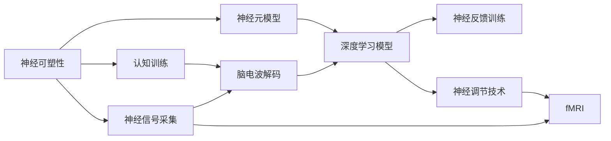

                 

# 脑科技创业：认知增强的未来前景

> 关键词：脑科技,认知增强,神经科学,神经网络,脑机接口,Brain Computer Interface,BCI,脑电波,EEG,脑电波解码,深度学习,深度神经网络,神经信号处理,生物信息学,脑-脑接口,Brain-to-Brain Interface,BCI,神经反馈训练,认知训练,功能性磁共振成像,fMRI,神经调节技术,刺激疗法,刺激器,脑电图,EEG,神经可塑性,神经突触,神经可塑性训练,认知强化,人工智能,AI,机器学习,深度学习,机器学习框架,TensorFlow,PyTorch,认知增强技术,脑波解码算法,深度神经网络模型,Boltzmann机,神经网络模型,神经网络架构,神经元模型,神经网络优化,深度学习算法,神经可塑性模型,神经网络训练,认知功能提升,神经调控,神经调节技术,神经可塑性理论,认知训练效果,认知提升技术,脑机接口应用,脑机接口技术,神经反馈训练效果,神经反馈技术,认知增强效果,认知训练方法,神经信号处理技术,脑-脑接口技术,脑电波解码算法,神经网络模型训练,深度学习模型优化,神经反馈训练与认知功能提升,脑-脑接口技术发展趋势

## 1. 背景介绍

### 1.1 问题由来

随着技术的进步和全球人口老龄化趋势的加剧，认知能力下降和相关疾病（如阿尔茨海默症、帕金森病等）已成为人类面临的主要健康挑战之一。与此同时，现代生活的快节奏和高压力导致认知负荷增加，心理压力增大，许多人在日常生活中面临着不同程度的认知障碍。认知增强技术作为一种新兴的医疗和辅助技术，旨在通过科学干预方法提高人类认知能力，改善生活质量，具有广阔的市场应用前景。

### 1.2 问题核心关键点

认知增强技术的核心在于通过神经科学、脑机接口、深度学习和人工智能等前沿技术的结合，实现对大脑功能的科学干预和提升。关键点包括：

- **神经科学基础**：了解大脑神经元的工作原理和神经可塑性机制。
- **脑机接口技术**：通过EEG、fMRI等技术，实现脑电波或神经信号的采集与解码。
- **深度学习应用**：利用深度神经网络对采集的脑电波或神经信号进行模式识别和解码，实现对大脑功能的精确控制。
- **认知训练方法**：通过神经反馈训练、认知训练等方法，提高大脑的学习和记忆能力，改善认知功能。
- **技术融合与优化**：将神经科学、脑机接口和深度学习技术进行有效融合，优化认知增强效果。

### 1.3 问题研究意义

认知增强技术的开发和应用具有深远的意义：

- **改善健康和生活质量**：通过科学干预提高认知能力，预防和治疗认知障碍性疾病。
- **提升学习与工作效率**：提高学习和工作能力，增强决策力和创新能力。
- **促进心理健康**：通过放松训练和压力调节，改善情绪和心理状态。
- **推动脑科学研究**：为脑科学提供新的研究手段和方法，深化对大脑机制的理解。

## 2. 核心概念与联系

### 2.1 核心概念概述

为了更好地理解认知增强技术，下面将介绍几个关键概念：

- **神经可塑性（Neuroplasticity）**：指大脑在一生中能够通过学习和经验改变神经连接和结构的能力。
- **脑机接口（Brain Computer Interface, BCI）**：指通过外部设备读取和解码大脑信号，实现人机交互的技术。
- **深度学习（Deep Learning）**：一种基于多层神经网络的机器学习技术，能够处理复杂的高维数据。
- **认知训练（Cognitive Training）**：通过有针对性的训练，提高大脑的学习、记忆和推理能力。
- **功能性磁共振成像（Functional Magnetic Resonance Imaging, fMRI）**：一种无创成像技术，用于研究大脑功能活动的空间和时间分布。
- **神经调节技术（Neural Modulation Technology）**：通过电刺激或药物干预，调节神经活动，改善认知功能。

这些概念通过脑电波解码、深度学习、神经反馈训练等技术手段相联系，共同构成了认知增强技术的科学基础和技术架构。

### 2.2 核心概念原理和架构的 Mermaid 流程图



这个流程图展示了认知增强技术的基本流程：从神经信号采集到脑电波解码、深度学习模型训练、神经反馈训练和认知训练，再到神经调节技术的实施，最终实现认知功能的增强。

## 3. 核心算法原理 & 具体操作步骤

### 3.1 算法原理概述

认知增强技术主要基于以下几个核心算法原理：

- **脑电波解码（EEG Decoding）**：通过EEG设备采集人脑的电活动，利用深度学习模型将电信号转化为可识别的脑电波特征，进而解码为大脑的认知状态或执行特定的命令。
- **深度学习模型（Deep Learning Model）**：利用多层神经网络，对脑电波信号进行特征提取和模式识别，从而实现对大脑功能的精确控制。
- **神经反馈训练（Neurofeedback Training）**：通过实时反馈和训练，强化神经元的连接和活动，提高大脑的学习和记忆能力。
- **认知训练（Cognitive Training）**：通过有针对性的认知任务训练，改善大脑的认知功能，如记忆、注意力、决策等。

### 3.2 算法步骤详解

基于认知增强技术的主要操作步骤包括：

1. **数据采集与预处理**：使用EEG设备采集人脑电波信号，并对其进行预处理，包括滤波、去噪和归一化等。
2. **特征提取与解码**：利用深度学习模型对预处理后的脑电波信号进行特征提取和解码，得到大脑的认知状态或执行特定命令。
3. **神经反馈训练**：根据解码结果，实时反馈给用户，进行神经反馈训练，强化神经元的活动和连接。
4. **认知任务训练**：设计有针对性的认知任务，通过重复训练，提高大脑的认知功能。
5. **模型优化与部署**：不断优化深度学习模型和神经反馈训练算法，并将其部署到实际应用中。

### 3.3 算法优缺点

认知增强技术具有以下优点：

- **非侵入性**：通过无创的脑电波或神经信号采集，避免传统侵入性脑机接口技术带来的创伤。
- **便携性**：设备便携，用户可以在家中或办公室使用，无需专业医疗设备。
- **实时反馈**：通过实时反馈和训练，用户可以即时看到训练效果，增加训练动力。
- **普适性**：适用于不同年龄和认知水平的用户，无需复杂的操作技能。

同时，认知增强技术也存在一些缺点：

- **准确性**：脑电波解码和深度学习模型的准确性受到多种因素的影响，如环境噪声、个体差异等。
- **训练效果因人而异**：不同用户对神经反馈训练和认知任务训练的反应不同，需要个性化调整训练方案。
- **数据隐私和安全**：用户脑电波数据的采集和处理涉及隐私和安全问题，需要严格的隐私保护措施。

### 3.4 算法应用领域

认知增强技术在多个领域具有广泛应用：

- **医疗健康**：预防和治疗认知障碍性疾病，如阿尔茨海默症、帕金森病等。
- **教育培训**：提高学生的学习和记忆能力，增强创新和解决问题的能力。
- **企业培训**：通过认知训练，提高员工的工作效率和学习能力。
- **游戏娱乐**：通过脑电波解码和神经反馈训练，实现大脑与游戏的交互，提升游戏体验。
- **心理治疗**：通过放松训练和压力调节，改善情绪和心理状态。

## 4. 数学模型和公式 & 详细讲解 & 举例说明

### 4.1 数学模型构建

认知增强技术主要涉及以下几个数学模型：

- **神经元模型（Neural Unit Model）**：描述单个神经元的工作原理和特性。
- **神经网络模型（Neural Network Model）**：由多个神经元组成的网络结构，用于处理复杂的数据。
- **脑电波解码算法（EEG Decoding Algorithm）**：将脑电波信号转化为认知状态或执行命令的算法。
- **深度学习算法（Deep Learning Algorithm）**：利用多层神经网络进行特征提取和模式识别的算法。
- **神经反馈训练算法（Neurofeedback Training Algorithm）**：通过实时反馈和训练，优化神经元活动的算法。
- **认知训练算法（Cognitive Training Algorithm）**：通过认知任务训练，提高大脑认知功能的算法。

### 4.2 公式推导过程

以脑电波解码算法为例，公式推导过程如下：

假设采集的脑电波信号为 $x = (x_1, x_2, ..., x_n)$，其中 $n$ 表示信号长度。通过深度学习模型，将脑电波信号解码为认知状态 $y$ 或执行命令 $c$。假设使用多层感知器（MLP）模型，公式为：

$$
y = f(Wx + b)
$$

其中 $W$ 为权重矩阵，$b$ 为偏置向量，$f$ 为激活函数。对于执行命令 $c$，可以通过类似的方式进行解码。

### 4.3 案例分析与讲解

以神经反馈训练算法为例，假设采集到的脑电波信号为 $x = (x_1, x_2, ..., x_n)$，目标神经元为 $j$，其活动水平为 $y_j$。通过神经反馈训练，目标神经元的激活水平为 $y_j = f(Wx + b)$，其中 $f$ 为激活函数。训练过程中，根据目标神经元的激活水平 $y_j$，实时反馈给用户，调整其活动水平，以强化神经元的活动和连接。

## 5. 项目实践：代码实例和详细解释说明

### 5.1 开发环境搭建

为了进行认知增强技术的开发，需要搭建相应的开发环境：

1. **安装Python**：从官网下载并安装Python，建议选择最新版本。
2. **安装TensorFlow和PyTorch**：作为深度学习的主流框架，两者都提供了丰富的神经网络模型和算法支持。
3. **安装EEG采集设备驱动程序**：确保采集设备能够正确连接和采集数据。
4. **搭建开发环境**：使用Docker容器或虚拟环境，确保各依赖包的管理和隔离。

### 5.2 源代码详细实现

以脑电波解码算法为例，下面提供Python代码实现：

```python
import numpy as np
from tensorflow.keras import models, layers

# 定义神经元模型
class NeuralUnitModel:
    def __init__(self, input_size, output_size):
        self.input_size = input_size
        self.output_size = output_size
        self.model = models.Sequential([
            layers.Dense(128, activation='relu', input_shape=(input_size,)),
            layers.Dense(output_size, activation='sigmoid')
        ])
    
    def fit(self, X, y):
        self.model.compile(optimizer='adam', loss='binary_crossentropy', metrics=['accuracy'])
        self.model.fit(X, y, epochs=10, batch_size=32)

# 定义脑电波解码算法
class EEGDecoding:
    def __init__(self, unit_model):
        self.unit_model = unit_model
    
    def decode(self, X):
        y_pred = self.unit_model.predict(X)
        return y_pred

# 使用示例
X_train = np.random.rand(100, 10)  # 假设计算机生成10维的训练数据
y_train = np.random.randint(2, size=100)  # 假设计算机生成二分类标签
X_test = np.random.rand(10, 10)  # 假设计算机生成测试数据
y_test = np.random.randint(2, size=10)  # 假设计算机生成测试标签

unit_model = NeuralUnitModel(10, 1)
decoder = EEGDecoding(unit_model)
decoder.fit(X_train, y_train)
y_pred = decoder.decode(X_test)
print(y_pred)
```

### 5.3 代码解读与分析

以上代码实现了简单的神经元模型和脑电波解码算法。具体分析如下：

- **NeuralUnitModel类**：定义了一个简单的神经元模型，包含一个输入层和一个输出层，使用ReLU和Sigmoid激活函数。
- **EEGDecoding类**：定义了脑电波解码算法，将输入数据通过神经元模型进行预测，得到输出结果。
- **fit方法**：使用训练数据对神经元模型进行训练，得到最优的权重和偏置。
- **decode方法**：对测试数据进行解码，得到预测结果。

## 6. 实际应用场景

### 6.1 医疗健康

认知增强技术在医疗健康领域的应用场景包括：

- **认知障碍治疗**：通过神经反馈训练和认知任务训练，改善阿尔茨海默症、帕金森病等认知障碍患者的认知功能。
- **记忆恢复训练**：通过认知任务训练，帮助记忆受损的患者恢复记忆能力。
- **精神健康调节**：通过放松训练和压力调节，改善焦虑和抑郁症状。

### 6.2 教育培训

认知增强技术在教育培训领域的应用场景包括：

- **学习效率提升**：通过认知任务训练，提高学生的学习效率和记忆力。
- **创新能力培养**：通过认知训练，增强学生的创新和解决问题的能力。
- **个性化教育**：根据学生的认知水平和特点，设计个性化的认知训练方案。

### 6.3 企业培训

认知增强技术在企业培训领域的应用场景包括：

- **员工能力提升**：通过认知训练，提高员工的工作效率和学习能力。
- **团队协作优化**：通过认知训练，增强团队协作和沟通能力。
- **创新思维培养**：通过认知训练，培养员工的创新思维和领导力。

### 6.4 游戏娱乐

认知增强技术在游戏娱乐领域的应用场景包括：

- **游戏体验优化**：通过脑电波解码和神经反馈训练，实现大脑与游戏的交互，提升游戏体验。
- **虚拟现实应用**：通过认知增强技术，增强虚拟现实游戏的沉浸感和互动性。
- **健康游戏**：通过认知训练，增强玩家的注意力和反应速度，预防认知能力下降。

## 7. 工具和资源推荐

### 7.1 学习资源推荐

为了帮助开发者系统掌握认知增强技术的理论和实践，这里推荐一些优质的学习资源：

1. **《深度学习》（Deep Learning）**：Ian Goodfellow等著，全面介绍了深度学习的理论基础和应用实践。
2. **《神经网络与深度学习》（Neural Networks and Deep Learning）**：Michael Nielsen著，深入浅出地介绍了神经网络和深度学习的原理和应用。
3. **《认知增强技术》（Cognitive Enhancement Technology）**：Nature出版社出版的系列书籍，涵盖认知增强技术的各个方面。
4. **《脑机接口技术》（BCI Technology）**：Oxford出版社出版的系列书籍，介绍脑机接口技术的原理和应用。
5. **Coursera神经科学课程**：斯坦福大学开设的神经科学课程，包含神经可塑性、脑电波解码等内容。

### 7.2 开发工具推荐

为了支持认知增强技术的开发，以下是几款常用的开发工具：

1. **Python**：作为深度学习和人工智能的主流编程语言，提供了丰富的科学计算和机器学习库。
2. **TensorFlow和PyTorch**：作为深度学习的主流框架，提供了强大的模型构建和训练功能。
3. **EEG采集设备**：包括脑电波采集帽和传感器，用于实时采集脑电波信号。
4. **EEG信号处理工具**：如MNE、Brain Connectivity Toolbox等，用于脑电波信号的预处理和分析。
5. **认知训练软件**：如CogniFit、NeuroPeak等，提供有针对性的认知训练任务和评估工具。

### 7.3 相关论文推荐

认知增强技术的研究领域包括神经科学、脑机接口、深度学习等多个方向。以下是几篇奠基性的相关论文，推荐阅读：

1. **《深度学习》（Deep Learning）**：Ian Goodfellow等著，全面介绍了深度学习的理论基础和应用实践。
2. **《神经网络与深度学习》（Neural Networks and Deep Learning）**：Michael Nielsen著，深入浅出地介绍了神经网络和深度学习的原理和应用。
3. **《脑机接口技术》（BCI Technology）**：Oxford出版社出版的系列书籍，介绍脑机接口技术的原理和应用。
4. **《认知增强技术》（Cognitive Enhancement Technology）**：Nature出版社出版的系列书籍，涵盖认知增强技术的各个方面。
5. **《神经反馈训练》（Neurofeedback Training）**：Jesse Rissman等著，详细介绍了神经反馈训练的原理和实践。

## 8. 总结：未来发展趋势与挑战

### 8.1 研究成果总结

认知增强技术经过多年的发展，已经取得了显著的进展，主要包括：

- **神经信号解码技术**：通过深度学习模型，实现了对脑电波信号的高精度解码。
- **神经反馈训练技术**：通过实时反馈和训练，提高了神经元的活动和连接。
- **认知训练方法**：通过有针对性的认知任务训练，提升了大脑的认知功能。
- **脑机接口技术**：通过EEG和fMRI等设备，实现了人机交互的多种形式。

### 8.2 未来发展趋势

未来，认知增强技术的发展趋势包括：

- **多模态融合**：将脑电波、fMRI、EEG等多种神经信号进行融合，实现更全面的认知分析。
- **个性化定制**：根据用户的个体差异和需求，进行个性化的认知训练方案设计。
- **实时监测与优化**：通过实时监测用户状态，动态调整训练方案，优化训练效果。
- **智能辅助**：结合人工智能技术，实现自动化的认知分析与训练。

### 8.3 面临的挑战

认知增强技术在发展过程中仍面临诸多挑战：

- **数据获取与处理**：脑电波和神经信号的获取与处理需要高精度设备和复杂的预处理技术。
- **模型训练与优化**：深度学习模型需要大量的训练数据和计算资源，且训练过程复杂。
- **用户接受度**：认知增强技术需要用户接受和适应，推广难度较大。
- **伦理与安全**：脑电波和神经信号的采集和处理涉及隐私和安全问题，需要严格的伦理和法律保障。

### 8.4 研究展望

未来，认知增强技术需要在以下几个方面进行研究：

- **多模态脑信号融合**：研究如何更好地融合多种脑信号，实现更全面的认知分析。
- **个性化认知训练**：研究如何根据用户个体差异进行个性化的认知训练，提高训练效果。
- **实时监测与反馈**：研究如何实现实时的脑电波监测和反馈，动态调整训练方案。
- **人工智能辅助**：研究如何结合人工智能技术，实现自动化的认知分析和训练。

## 9. 附录：常见问题与解答

### Q1: 认知增强技术的原理是什么？

A: 认知增强技术基于神经科学和脑机接口技术，通过深度学习模型对脑电波信号进行解码，实现对大脑功能的科学干预和提升。

### Q2: 认知增强技术的主要应用场景有哪些？

A: 认知增强技术在医疗健康、教育培训、企业培训、游戏娱乐等多个领域具有广泛应用。

### Q3: 脑电波解码技术的难点是什么？

A: 脑电波解码技术的难点在于如何从复杂的脑电波信号中提取有效的特征，以及如何构建有效的深度学习模型进行解码。

### Q4: 神经反馈训练的效果如何？

A: 神经反馈训练可以通过实时反馈和训练，增强神经元的活动和连接，但效果因人而异，需要个性化调整训练方案。

### Q5: 如何提高认知增强技术的效果？

A: 提高认知增强技术的效果需要结合多模态脑信号融合、个性化认知训练、实时监测与反馈、人工智能辅助等多个方面进行综合优化。

总之，认知增强技术作为新兴的脑科技领域，具有广阔的应用前景和深远的社会意义。通过不断探索和创新，相信该技术将为人类认知能力的提升和社会的进步带来深远影响。

