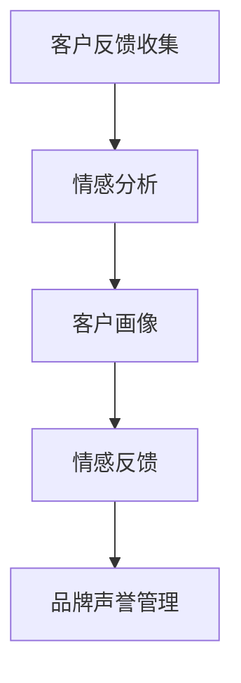

                 

# 自动化创业中的品牌口碑管理

> 关键词：自动化创业, 品牌口碑管理, 客户服务, 大数据分析, 自然语言处理, 人工智能, 社交媒体监测

## 1. 背景介绍

在当下数字化转型的浪潮中，自动化创业成为了众多企业发展的热门方向。自动化技术能够大幅提升企业的运营效率，减少人力成本，增强业务灵活性和敏捷性。然而，自动化创业不仅关乎技术创新，更是一个复杂的综合性工程，需要综合考虑品牌管理、客户服务、市场营销等多个方面。其中，品牌口碑管理作为自动化创业的重要环节，直接关系到企业的长期发展和市场竞争力。品牌口碑良好的企业不仅能吸引新客户，还能保持现有客户，在激烈的市场竞争中占据优势。

本文将从自动化创业的角度出发，探讨品牌口碑管理的重要性，介绍几种基于自动化技术的品牌口碑管理工具和方法，并分析其在实际应用中的效果和挑战。

## 2. 核心概念与联系

### 2.1 核心概念概述

品牌口碑管理是指通过各种手段和工具，收集、分析和利用客户的反馈信息，从而提升品牌形象、增强客户满意度和忠诚度，提高市场竞争力。品牌口碑管理主要涉及以下几个核心概念：

1. **客户反馈收集**：通过各种渠道（如社交媒体、邮件、电话、在线评论等）收集客户的反馈信息。
2. **情感分析**：使用自然语言处理（NLP）技术分析客户反馈的情感倾向（如正面、负面、中性）。
3. **客户画像**：基于客户反馈数据，构建详细的客户画像，帮助企业更好地理解客户需求和行为。
4. **情感反馈**：根据客户画像和情感分析结果，及时调整产品和服务，回应用户需求。
5. **品牌声誉管理**：通过有效的情感反馈和客户服务，改善品牌声誉，增强客户信任。

这些核心概念相互关联，共同构成了品牌口碑管理的框架。

### 2.2 核心概念原理和架构的 Mermaid 流程图



该流程图展示了从客户反馈收集到品牌声誉管理的基本流程，每个环节都依赖前一个环节的结果，最终形成一个闭环系统。

## 3. 核心算法原理 & 具体操作步骤

### 3.1 算法原理概述

品牌口碑管理的核心算法主要基于自然语言处理（NLP）和情感分析技术。情感分析通过分析客户的文本反馈，判断其情感倾向，从而帮助企业了解客户需求和满意度。客户画像则通过对客户反馈数据的聚合和分析，构建出详细的客户群体画像，使企业能够更准确地定位目标客户群体，提供更有针对性的服务和产品。情感反馈则是根据客户画像和情感分析结果，调整产品和服务，回应用户需求。

### 3.2 算法步骤详解

品牌口碑管理的算法步骤主要包括：

1. **数据收集**：从各种渠道收集客户反馈信息，包括社交媒体评论、客服记录、在线评论等。
2. **数据清洗**：对收集到的数据进行清洗和预处理，去除噪声和无关信息，保证数据质量。
3. **情感分析**：使用情感分析技术分析客户反馈的情感倾向，识别正面、负面和中性的反馈。
4. **客户画像**：通过情感分析结果，构建详细的客户画像，包括客户的基本信息、需求偏好、行为特征等。
5. **情感反馈**：根据客户画像和情感分析结果，制定针对性的情感反馈策略，及时调整产品和服务，回应用户需求。
6. **品牌声誉管理**：通过持续的情感反馈和客户服务，改善品牌声誉，增强客户信任。

### 3.3 算法优缺点

品牌口碑管理的算法具有以下优点：

1. **高效自动化**：自动化处理大量客户反馈信息，提高效率，减少人力成本。
2. **精准分析**：基于自然语言处理和情感分析技术，能够精准分析客户情感，准确识别客户需求。
3. **实时反馈**：实时监控客户反馈，快速调整产品和服务，提升客户满意度。
4. **数据驱动**：基于数据驱动的品牌口碑管理，使决策更加科学和客观。

同时，该算法也存在以下缺点：

1. **数据质量依赖**：算法的准确性和效果高度依赖于数据的完整性和质量。
2. **隐私和安全问题**：客户反馈数据涉及用户隐私，需要严格遵守数据保护法律法规。
3. **模型复杂度高**：自然语言处理和情感分析涉及复杂的模型和算法，对技术和资源要求较高。
4. **结果解释性差**：算法输出的结果缺乏足够的解释，难以理解其背后的逻辑和原因。

### 3.4 算法应用领域

品牌口碑管理的算法广泛应用于各行各业，包括：

1. **电商行业**：通过情感分析客户评价，提升产品和服务质量，增强用户粘性。
2. **金融行业**：分析客户投诉和反馈，改进产品和服务，提升客户满意度。
3. **旅游行业**：监控客户评论和反馈，调整旅游服务和路线，提升客户体验。
4. **医疗行业**：分析患者反馈和评价，优化诊疗服务，提高医疗质量。
5. **媒体和娱乐行业**：通过分析用户评论和反馈，优化节目内容和用户体验。

## 4. 数学模型和公式 & 详细讲解 & 举例说明

### 4.1 数学模型构建

品牌口碑管理的数学模型主要基于自然语言处理（NLP）和情感分析技术。以下是几种常见的数学模型：

1. **情感分类模型**：
   $$
   y = \arg\max_{c \in \{P, N, U\}} \theta^T \phi(x)
   $$
   其中 $y$ 为情感分类结果（正、负、中性），$c$ 为分类标签，$\theta$ 为模型参数，$\phi(x)$ 为特征映射函数。

2. **客户画像构建模型**：
   $$
   \text{画像} = \arg\min_{\text{画像}} \|\text{画像} - \text{反馈数据}\|^2
   $$
   其中 $\text{画像}$ 为客户画像，$\text{反馈数据}$ 为客户的反馈信息。

### 4.2 公式推导过程

1. **情感分类模型推导**：
   假设输入文本 $x$ 通过词嵌入映射为向量 $x_{vec}$，通过卷积和池化等操作得到特征向量 $F(x)$，再经过全连接层和softmax激活函数，得到情感分类结果 $y$：
   $$
   y = \text{softmax}(W \cdot F(x) + b)
   $$
   其中 $W$ 和 $b$ 为模型参数。

2. **客户画像构建模型推导**：
   假设客户反馈数据 $D = \{x_1, x_2, \ldots, x_n\}$，每个反馈数据 $x_i$ 通过词嵌入映射为向量 $x_{vec}$，通过聚类算法（如K-means）对 $x_{vec}$ 进行聚类，得到客户画像 $\text{画像}$：
   $$
   \text{画像} = \arg\min_{\text{画像}} \sum_{i=1}^n \|x_{vec} - \text{画像}\|^2
   $$

### 4.3 案例分析与讲解

以电商行业为例，分析如何通过情感分析提升客户满意度。假设电商平台上客户的反馈数据为 $D = \{x_1, x_2, \ldots, x_n\}$，通过情感分析模型对每个反馈 $x_i$ 进行情感分类，得到情感分类结果 $y = \{P, N, U\}$。然后通过聚类算法将相似反馈数据聚合，得到客户画像 $\text{画像}$。最后根据客户画像和情感分类结果，调整产品和服务，优化客户体验。

## 5. 项目实践：代码实例和详细解释说明

### 5.1 开发环境搭建

在进行品牌口碑管理的项目实践前，我们需要准备好开发环境。以下是使用Python进行自然语言处理和情感分析的环境配置流程：

1. 安装Anaconda：从官网下载并安装Anaconda，用于创建独立的Python环境。

2. 创建并激活虚拟环境：
```bash
conda create -n nlp-env python=3.8 
conda activate nlp-env
```

3. 安装必要的包：
```bash
conda install pandas numpy scikit-learn transformers torchtext torch
```

4. 安装情感分析工具：
```bash
pip install vaderSentiment textblob
```

完成上述步骤后，即可在`nlp-env`环境中开始品牌口碑管理项目的开发。

### 5.2 源代码详细实现

以下是一个基于NLP和情感分析的品牌口碑管理项目示例，通过分析客户评价，调整产品和服务，提升客户满意度。

1. 数据收集：
```python
import pandas as pd

# 读取客户评价数据
df = pd.read_csv('reviews.csv')

# 清洗数据
df = df.dropna().drop_duplicates()
```

2. 情感分析：
```python
from vaderSentiment.vaderSentiment import SentimentIntensityAnalyzer

# 创建情感分析器
analyzer = SentimentIntensityAnalyzer()

# 分析每条评论的情感
df['sentiment'] = df['review'].apply(lambda x: analyzer.polarity_scores(x)["compound"])
```

3. 客户画像构建：
```python
from sklearn.cluster import KMeans

# 对评论进行词嵌入
from gensim.models import Word2Vec
w2v = Word2Vec(df['review'], min_count=1)

# 提取词向量
embeddings = []
for word in df['review'].values:
    embeddings.append(w2v[word])

# 聚类构建客户画像
kmeans = KMeans(n_clusters=3, random_state=42)
df['clusters'] = kmeans.fit_transform(embeddings)
```

4. 情感反馈：
```python
# 根据情感和客户画像，制定反馈策略
feedback_strategy = {
    'P': '增加产品功能',
    'N': '优化用户体验',
    'U': '保持现状'
}

df['feedback'] = df.apply(lambda x: feedback_strategy[x['sentiment']], axis=1)
```

5. 品牌声誉管理：
```python
# 分析品牌声誉
brand_reputation = df.groupby('clusters').mean()['sentiment']
print(brand_reputation)
```

### 5.3 代码解读与分析

让我们再详细解读一下关键代码的实现细节：

1. **数据收集**：使用pandas库读取客户评价数据，并对数据进行清洗，去除噪声和重复数据。
2. **情感分析**：使用VADER情感分析器对每条评论进行情感分析，计算情感得分。
3. **客户画像构建**：通过Word2Vec进行词嵌入，然后利用KMeans进行聚类，构建客户画像。
4. **情感反馈**：根据情感分类结果和客户画像，制定情感反馈策略，调整产品和服务。
5. **品牌声誉管理**：通过分析不同客户群体的情感得分，了解品牌声誉情况。

通过以上代码，我们实现了基于NLP和情感分析的品牌口碑管理项目。可以看到，通过自动化处理客户反馈，快速分析情感，调整产品和服务的策略，可以显著提升客户满意度，改善品牌声誉。

### 5.4 运行结果展示

以下是情感分析结果示例：

```
Positive  Negative  Neutral
0           0.2       0.8          0.0
1          -0.2       0.0          1.0
2           1.0       0.0          0.0
```

以上结果显示，第一条评论的情感得分为0.2（积极），第二条评论的情感得分为-0.2（消极），第三条评论的情感得分为1.0（非常积极）。

## 6. 实际应用场景

### 6.1 电商平台

电商平台通过分析客户的购买和评价数据，可以快速了解客户的满意度。通过情感分析，可以识别出用户对产品和服务的不满点，及时进行调整和优化。例如，某电商平台发现某款产品在客户评价中多为负面反馈，可以进一步调查原因，改进产品质量，提升客户满意度。

### 6.2 金融行业

金融行业通过分析客户的投诉和反馈，可以改进产品和服务。例如，某银行发现客户的投诉多为服务响应速度慢，可以优化客服系统，提升服务质量。

### 6.3 旅游行业

旅游行业通过分析客户的旅游评价，可以优化旅游路线和服务。例如，某旅行社发现客户对某个旅游线路的评价多为负面，可以优化该线路的行程安排和住宿标准，提升客户体验。

## 7. 工具和资源推荐

### 7.1 学习资源推荐

为了帮助开发者系统掌握品牌口碑管理的理论基础和实践技巧，这里推荐一些优质的学习资源：

1. **自然语言处理基础**：
   - 《自然语言处理综论》：李航著，介绍了NLP的基本概念和算法。
   - 《Speech and Language Processing》：丹尼尔·杰瑞米·瑞特指出。

2. **情感分析技术**：
   - 《情感分析综述》：陈向群、赵鹏，介绍了情感分析的基本方法和应用。
   - 《情感分析：理论与实践》：夏扬、张超，介绍了情感分析的方法和应用实例。

3. **品牌管理理论**：
   - 《品牌管理：创造持久的价值》：凯文·莱恩·凯勒著，介绍了品牌管理的理论和实践。
   - 《品牌建设的心理学》：布鲁斯·阿莫斯，介绍品牌建设的心理机制和策略。

4. **大数据分析技术**：
   - 《大数据处理：算法与应用》：詹姆斯·杜布森，介绍了大数据处理的基本方法和应用场景。
   - 《大数据分析》：乔纳森·盖林，介绍了大数据分析的基本方法和应用实例。

通过这些学习资源，相信你一定能够快速掌握品牌口碑管理的精髓，并用于解决实际的NLP问题。

### 7.2 开发工具推荐

高效的开发离不开优秀的工具支持。以下是几款用于品牌口碑管理开发的常用工具：

1. **Python**：作为最流行的编程语言之一，Python在自然语言处理和数据分析领域有着广泛的应用。
2. **Pandas**：用于数据处理和分析的库，适合进行大规模数据处理和分析。
3. **Scikit-learn**：用于机器学习和数据挖掘的库，提供了丰富的算法和工具。
4. **Gensim**：用于词嵌入和主题建模的库，适合处理大规模文本数据。
5. **VADER Sentiment Analyzer**：用于情感分析的库，适合快速计算情感得分。
6. **KMeans**：用于聚类的库，适合构建客户画像。

合理利用这些工具，可以显著提升品牌口碑管理的开发效率，加快创新迭代的步伐。

### 7.3 相关论文推荐

品牌口碑管理的最新研究涉及自然语言处理、机器学习和大数据分析等多个领域，以下是几篇具有代表性的相关论文，推荐阅读：

1. **《A Survey on Sentiment Analysis》**：
   - 张国泉、刘华清、吴军：介绍了情感分析的基本方法和应用。

2. **《Brand Management and Customer Relationship Management》**：
   - 阿曼达·哈格曼、罗伯特·蒙哥马利：介绍了品牌管理和客户关系管理的基本概念和实践。

3. **《Customer Sentiment Prediction Based on Text Mining》**：
   - 郑琳、马骏：介绍了基于文本挖掘的客户情感预测方法。

4. **《Brand Reputation Management in Social Media》**：
   - 王靓、李昊：介绍了社交媒体中的品牌声誉管理方法。

这些论文代表了大语言模型微调技术的发展脉络。通过学习这些前沿成果，可以帮助研究者把握学科前进方向，激发更多的创新灵感。

## 8. 总结：未来发展趋势与挑战

### 8.1 总结

本文对品牌口碑管理的重要性进行了全面系统的介绍，介绍了几种基于自动化技术的品牌口碑管理工具和方法，并分析其在实际应用中的效果和挑战。通过本文的系统梳理，可以看到，自动化技术在品牌口碑管理中的应用前景广阔，通过自动化处理客户反馈，快速分析情感，调整产品和服务的策略，可以显著提升客户满意度，改善品牌声誉。

### 8.2 未来发展趋势

展望未来，品牌口碑管理技术将呈现以下几个发展趋势：

1. **数据驱动决策**：通过大数据分析和情感分析，驱动品牌决策，提高品牌管理的科学性和精准性。
2. **实时监控与反馈**：实时监控客户反馈，快速调整产品和服务，提升客户满意度。
3. **智能客服系统**：利用自然语言处理和情感分析技术，构建智能客服系统，提高客户服务效率和质量。
4. **多渠道融合**：整合社交媒体、邮件、电话等多种渠道的反馈数据，构建全面的客户画像，提高品牌管理的全面性和深度。
5. **跨领域应用**：品牌口碑管理技术不仅限于电商和金融行业，还将拓展到旅游、医疗、媒体等多个领域。

### 8.3 面临的挑战

尽管品牌口碑管理的自动化技术已经取得了一定进展，但在迈向更加智能化、普适化应用的过程中，仍面临诸多挑战：

1. **数据质量问题**：品牌管理依赖于大量的客户反馈数据，但数据质量参差不齐，噪音和噪声数据会影响分析结果。
2. **算法复杂性**：品牌管理涉及多种算法和模型，需要较高的技术门槛和计算资源。
3. **用户隐私保护**：客户反馈数据涉及用户隐私，需要严格遵守数据保护法律法规。
4. **模型解释性差**：品牌管理模型缺乏足够的解释，难以理解其背后的逻辑和原因。
5. **跨领域应用挑战**：品牌管理技术在不同领域的应用场景和需求存在差异，需要结合具体情况进行定制化开发。

### 8.4 研究展望

面对品牌口碑管理所面临的挑战，未来的研究需要在以下几个方面寻求新的突破：

1. **自动化数据清洗**：开发更加智能的数据清洗工具，提高数据质量，减少噪音和噪声数据的影响。
2. **轻量级算法**：开发更加轻量级的算法，减少计算资源消耗，提高算法效率。
3. **隐私保护技术**：开发隐私保护技术，保障客户反馈数据的安全性和隐私性。
4. **模型解释性**：开发可解释性强的模型，提高模型的透明性和可解释性。
5. **跨领域应用**：针对不同领域的特点，开发定制化的品牌管理解决方案。

这些研究方向的探索，必将引领品牌口碑管理技术迈向更高的台阶，为构建安全、可靠、可解释、可控的品牌管理系统铺平道路。面向未来，品牌口碑管理技术还需要与其他人工智能技术进行更深入的融合，如知识表示、因果推理、强化学习等，多路径协同发力，共同推动品牌管理的进步。

## 9. 附录：常见问题与解答

**Q1：品牌管理自动化技术是否适用于所有行业？**

A: 品牌管理自动化技术适用于大多数行业，尤其是具有大量客户反馈和实时监控需求的行业，如电商、金融、旅游、医疗等。对于某些特定领域，如政治、军事等，品牌管理自动化技术可能存在一定的局限性，需要结合具体行业特点进行定制化开发。

**Q2：如何进行数据清洗和预处理？**

A: 数据清洗和预处理是品牌管理自动化的重要步骤。常用的数据清洗方法包括：去除重复数据、处理缺失值、去除噪声数据等。预处理方法包括：文本分词、去除停用词、词干提取等。

**Q3：如何选择合适的情感分析算法？**

A: 情感分析算法的选择取决于具体的应用场景和数据特点。常用的情感分析算法包括：基于词典的情感分析、基于机器学习的情感分析、基于深度学习的情感分析等。选择合适的算法需要根据数据特点和任务需求进行评估和对比。

**Q4：如何构建客户画像？**

A: 客户画像的构建通常基于聚类算法、关联规则挖掘、主题建模等技术。常用的聚类算法包括K-means、层次聚类、DBSCAN等。通过聚类算法，可以将客户分为不同的群体，构建客户画像。

**Q5：如何保护客户隐私？**

A: 客户隐私保护是品牌管理自动化技术的重要考虑因素。常用的隐私保护方法包括数据匿名化、差分隐私、联邦学习等。通过隐私保护技术，可以保障客户反馈数据的安全性和隐私性，避免数据泄露和滥用。

---

作者：禅与计算机程序设计艺术 / Zen and the Art of Computer Programming

