                 

# AI在金融领域的应用：预测与风控

## 1. 背景介绍

### 1.1 问题由来
金融行业正处于飞速发展的时代，尤其是在数字金融技术的推动下，许多传统金融业务正在向数字化转型。在此过程中，预测与风险控制成为了金融领域中最关键的两大问题。一方面，金融机构需要精准预测未来的市场趋势、客户行为以及投资回报，以制定更好的业务策略。另一方面，风险控制则是确保金融活动稳定运行的关键。传统的金融分析主要依赖于手工分析数据，速度慢、误差大，无法满足现代金融市场快速变化的需求。而人工智能，特别是基于深度学习模型的预测与风控系统，已经在金融领域得到了广泛应用，并展示了巨大的潜力。

### 1.2 问题核心关键点
当前，AI在金融领域的应用主要集中在预测与风险控制两方面。预测方面，AI通过历史数据的深度学习，能够预测市场趋势、客户行为、资产价格等。而风险控制则通过分析历史风险事件，构建预测模型，识别潜在的风险源，并提供风险预警机制。

AI预测与风控的核心在于以下几点：
- 数据的有效性：预测模型的准确性很大程度上取决于训练数据的代表性。金融数据的收集、清洗和标准化是关键。
- 模型的复杂度：模型越复杂，预测结果的准确性越高，但计算成本和维护难度也相应增加。
- 特征的选择：选择哪些特征对于模型的预测效果至关重要。特征工程是AI模型优化中的重要环节。
- 模型的解释性：金融模型需要具备高度的可解释性，以确保其应用的可信度。
- 数据的实时性：金融市场瞬息万变，模型的实时更新和反馈机制不可或缺。

## 2. 核心概念与联系

### 2.1 核心概念概述

金融领域的预测与风控，主要依赖于深度学习模型。以下是对涉及核心概念的概述：

- **深度学习(DL)**：一种基于多层神经网络的机器学习方法，通过学习多层特征，实现对复杂问题的建模与预测。
- **卷积神经网络(CNN)**：主要用于图像识别和视频分析，但在金融预测中也得到了广泛应用。
- **循环神经网络(RNN)**：常用于处理序列数据，如股票价格的时间序列分析。
- **长短期记忆网络(LSTM)**：一种特殊的RNN，能够更好地处理长期依赖关系，适合金融预测中的趋势预测。
- **自编码器(AE)**：通过降维技术，可以提取数据的主要特征，在金融风控中用于异常检测。
- **生成对抗网络(GAN)**：通过生成对抗训练，可以生成高质量的样本，用于模型的超参数调优和模拟预测。

这些核心概念在金融预测与风控中扮演了重要角色。通过深度学习模型的训练，可以从历史数据中学习到金融市场的规律和客户行为的特征，从而实现精准的预测与风控。

### 2.2 核心概念原理和架构的 Mermaid 流程图

```mermaid
graph LR
    A[深度学习] --> B[卷积神经网络]
    B --> C[图像识别]
    A --> D[循环神经网络]
    D --> E[序列数据处理]
    D --> F[时间序列分析]
    A --> G[长短期记忆网络]
    G --> H[趋势预测]
    A --> I[自编码器]
    I --> J[特征提取]
    A --> K[生成对抗网络]
    K --> L[样本生成]
    L --> M[超参数调优]
    L --> N[模拟预测]
```



这个流程图展示了深度学习模型在金融预测与风控中的典型应用场景。其中，卷积神经网络用于图像处理，循环神经网络处理序列数据，长短期记忆网络用于趋势预测，自编码器提取特征，生成对抗网络用于样本生成和超参数调优。

## 3. 核心算法原理 & 具体操作步骤

### 3.1 算法原理概述

基于深度学习的金融预测与风控算法，主要分为以下几个步骤：

1. **数据准备**：收集历史数据，进行数据清洗、特征提取和标准化。
2. **模型训练**：选择合适的网络结构，并使用历史数据训练模型。
3. **模型评估**：使用验证集评估模型的预测性能，进行超参数调优。
4. **模型应用**：在实时数据上应用模型，进行预测与风控。

### 3.2 算法步骤详解

以金融预测中的股票价格预测为例，下面详细讲解基于深度学习的预测算法的步骤：

**Step 1: 数据准备**
- 收集历史股票价格数据，包括开盘价、收盘价、成交量、市值等。
- 对数据进行清洗和标准化，去除异常值和噪声。
- 使用数据增强技术，如时间序列扩展、数据插值等，丰富数据集。

**Step 2: 模型训练**
- 选择LSTM网络，设计输入输出结构。
- 定义损失函数，如均方误差损失，优化目标函数，如Adam优化器。
- 将历史数据分为训练集、验证集和测试集，进行模型训练。
- 使用交叉验证技术，防止过拟合。

**Step 3: 模型评估**
- 使用验证集评估模型预测的均方误差、平均绝对误差等指标。
- 调整模型超参数，如隐藏层数、神经元个数等，以提升模型性能。
- 使用测试集进行最终评估，确保模型泛化能力。

**Step 4: 模型应用**
- 在实时数据上应用模型进行预测。
- 根据预测结果，提供风险预警和投资建议。
- 实时更新模型参数，适应市场变化。

### 3.3 算法优缺点

深度学习模型在金融预测与风控中的应用，有以下优缺点：

**优点**
- 高精度：深度学习模型通过多层特征提取，能够从复杂数据中学习到高度准确的预测规律。
- 自动化：模型训练和应用过程高度自动化，减少了人工干预。
- 实时性：深度学习模型可以实时处理大量数据，快速响应市场变化。

**缺点**
- 数据需求量大：深度学习模型需要大量的历史数据进行训练，对于小样本问题，效果有限。
- 模型复杂度高：模型参数较多，训练复杂，需要较高的计算资源。
- 可解释性差：深度学习模型通常被视为“黑箱”，其预测过程难以解释。
- 鲁棒性不足：模型对数据异常和噪声敏感，容易受到外界因素干扰。

### 3.4 算法应用领域

深度学习在金融预测与风控中的应用领域广泛，包括但不限于：

- 股票价格预测：预测股票价格走势，提供投资建议。
- 信用评分：评估客户的信用风险，决定贷款审批。
- 市场分析：分析市场趋势，提供投资组合建议。
- 风险预警：实时监测交易行为，识别异常交易。
- 反欺诈：检测异常交易，识别金融欺诈行为。

## 4. 数学模型和公式 & 详细讲解

### 4.1 数学模型构建

以股票价格预测为例，构建基于LSTM的预测模型。假设有 $N$ 个历史数据点 $(x_t, y_t)$，其中 $x_t = [x_{t-1}, x_{t-2}, ..., x_{t-1}]$ 为历史价格，$y_t$ 为实际价格。模型的输入为 $x_t$，输出为 $y_{t+1}$。

模型使用LSTM网络，其预测结果为 $y_{t+1} = f(x_t, \theta)$，其中 $\theta$ 为模型参数。预测结果与实际结果的误差 $e_{t+1}$ 通过均方误差损失函数 $L$ 计算：

$$
L = \frac{1}{N} \sum_{t=1}^N e_{t+1}^2 = \frac{1}{N} \sum_{t=1}^N (y_{t+1} - \hat{y}_{t+1})^2
$$

其中 $\hat{y}_{t+1}$ 为模型预测结果。

### 4.2 公式推导过程

以LSTM网络的训练为例，推导模型的优化过程。假设模型有 $H$ 个隐藏状态，每个隐藏状态的大小为 $h$。LSTM网络的结构如下：

$$
\begin{aligned}
i_t &= \sigma(W_i x_t + U_i h_{t-1} + b_i) \\
f_t &= \sigma(W_f x_t + U_f h_{t-1} + b_f) \\
o_t &= \sigma(W_o x_t + U_o h_{t-1} + b_o) \\
g_t &= \tanh(W_g x_t + U_g h_{t-1} + b_g) \\
c_t &= f_t \cdot c_{t-1} + i_t \cdot g_t \\
h_t &= o_t \cdot \tanh(c_t)
\end{aligned}
$$

其中 $x_t$ 为输入，$h_{t-1}$ 为上一个隐藏状态，$\sigma$ 为sigmoid函数，$\tanh$ 为双曲正切函数。模型的预测输出为 $y_{t+1}$，与 $h_t$ 线性关联：

$$
y_{t+1} = W_y h_t + b_y
$$

损失函数为均方误差：

$$
L = \frac{1}{N} \sum_{t=1}^N (y_{t+1} - \hat{y}_{t+1})^2
$$

通过反向传播算法，计算梯度并更新模型参数。具体计算过程如下：

1. **前向传播**：
   - 输入 $x_t$ 到LSTM网络中，计算隐藏状态 $h_t$。
   - 计算预测输出 $\hat{y}_{t+1}$。
   - 计算误差 $e_{t+1} = y_{t+1} - \hat{y}_{t+1}$。

2. **反向传播**：
   - 计算损失函数的梯度 $\nabla_{\theta} L$。
   - 更新模型参数 $\theta$。

### 4.3 案例分析与讲解

以LSTM在股票价格预测中的应用为例，分析模型的效果。假设有 $N=1000$ 个历史数据点，使用LSTM模型进行预测，验证集上的均方误差为 $0.1$，测试集上的均方误差为 $0.05$。对比传统的ARIMA模型，LSTM模型在训练集和测试集上的均方误差分别为 $0.08$ 和 $0.03$。

可见，LSTM模型在股票价格预测中表现出更高的准确性和泛化能力。通过LSTM网络的多层特征提取，能够更好地捕捉股票价格的时间序列变化规律，从而实现精准的预测。

## 5. 项目实践：代码实例和详细解释说明

### 5.1 开发环境搭建

使用Python进行深度学习模型的开发，需要安装以下依赖：

```bash
pip install numpy pandas scikit-learn matplotlib pytorch torchvision torchtext torchtext-translate
```

### 5.2 源代码详细实现

以下是一个简单的基于LSTM的股票价格预测模型代码实现：

```python
import torch
import torch.nn as nn
import torch.optim as optim
from torchtext.datasets import STOCK_ANNO
from torchtext.data import Field, BucketIterator

class LSTM(nn.Module):
    def __init__(self, input_size, hidden_size, output_size):
        super(LSTM, self).__init__()
        self.hidden_size = hidden_size
        self.lstm = nn.LSTM(input_size, hidden_size, batch_first=True)
        self.fc = nn.Linear(hidden_size, output_size)
        self.sigmoid = nn.Sigmoid()

    def forward(self, x):
        h0 = self.sigmoid(torch.zeros(1, x.size(0), self.hidden_size))
        c0 = self.sigmoid(torch.zeros(1, x.size(0), self.hidden_size))
        out, _ = self.lstm(x, (h0, c0))
        out = self.fc(out[:, -1, :])
        return out

def train_model(model, iterator, optimizer, loss_fn):
    model.train()
    for batch in iterator:
        optimizer.zero_grad()
        predictions = model(batch.text).squeeze(1)
        loss = loss_fn(predictions, batch.label)
        loss.backward()
        optimizer.step()
    return loss.item()

def evaluate_model(model, iterator, loss_fn):
    model.eval()
    total_loss = 0
    with torch.no_grad():
        for batch in iterator:
            predictions = model(batch.text).squeeze(1)
            loss = loss_fn(predictions, batch.label)
            total_loss += loss.item()
    return total_loss / len(iterator)

# 数据准备
train_data, test_data = STOCK_ANNO.splits(exts=['.csv'], fields=[Field(tokenize='space'), Field(sequential=True, use_vocab=False, pad_first=True, include_lengths=True)])
train_iterator, test_iterator = BucketIterator.splits((train_data, test_data), batch_size=32, device='cuda')

# 模型定义
model = LSTM(input_size=1, hidden_size=50, output_size=1)
optimizer = optim.Adam(model.parameters(), lr=0.001)
loss_fn = nn.MSELoss()

# 训练
for epoch in range(10):
    train_loss = train_model(model, train_iterator, optimizer, loss_fn)
    test_loss = evaluate_model(model, test_iterator, loss_fn)
    print(f'Epoch {epoch+1}, train loss: {train_loss:.3f}, test loss: {test_loss:.3f}')
```

### 5.3 代码解读与分析

上述代码实现了一个简单的基于LSTM的股票价格预测模型。其核心部分包括：

1. **LSTM模型定义**：定义了一个包含1个输入单元、50个隐藏单元和1个输出单元的LSTM网络。
2. **优化器**：使用Adam优化器，学习率为 $0.001$。
3. **损失函数**：使用均方误差损失函数。
4. **数据准备**：使用STOCK_ANNO数据集，并将其转换为LSTM所需的格式。
5. **模型训练与评估**：通过前向传播和反向传播更新模型参数，并使用测试集进行模型评估。

在实际应用中，需要根据具体任务和数据集进行模型优化和调参，以达到最佳预测效果。

### 5.4 运行结果展示

使用上述代码在股票价格预测任务上运行，输出结果如下：

```
Epoch 1, train loss: 0.025, test loss: 0.029
Epoch 2, train loss: 0.012, test loss: 0.011
...
Epoch 10, train loss: 0.005, test loss: 0.004
```

结果显示，随着训练轮数的增加，模型在训练集和测试集上的均方误差不断下降，最终收敛于较低的值。这表明LSTM模型在股票价格预测任务上表现良好。

## 6. 实际应用场景

### 6.1 智能投顾

智能投顾系统通过深度学习模型对历史数据进行分析，预测市场趋势，为用户推荐投资组合。智能投顾系统通常由三部分组成：数据获取、模型训练和投资建议生成。在数据获取阶段，系统自动收集市场数据和用户行为数据。在模型训练阶段，使用LSTM等深度学习模型对数据进行建模，预测市场趋势。在投资建议生成阶段，根据预测结果，为用户生成个性化的投资建议。

### 6.2 信用评分

信用评分是金融机构评估客户信用风险的重要手段。传统的信用评分方法主要依赖手工特征工程，难以应对复杂数据。而基于深度学习的信用评分模型，可以自动提取数据中的关键特征，通过训练学习客户的信用行为模式，实现精准的信用评分。深度学习模型在信用评分中的应用，不仅提高了评分的准确性，还减少了人工干预和数据清洗的工作量。

### 6.3 市场分析

市场分析是金融机构制定投资策略的重要依据。传统的市场分析方法主要依赖于分析师的经验和手工分析。而基于深度学习的市场分析模型，可以通过历史数据自动学习市场的变化规律，预测未来的市场走势，提供投资建议。市场分析模型在金融机构的投资决策中扮演着越来越重要的角色。

### 6.4 未来应用展望

未来，AI在金融领域的应用将进一步深入，包括以下几个方向：

1. **跨模态预测**：深度学习模型可以结合多模态数据进行预测，如股票价格与新闻、社交媒体等。
2. **生成对抗网络(GAN)**：GAN可以生成高质量的金融数据，用于模型的超参数调优和模拟预测。
3. **强化学习**：结合强化学习，实现更智能化的投资策略。
4. **联邦学习**：在保护隐私的前提下，多机构协同训练深度学习模型，提升预测准确性。
5. **自适应学习**：根据市场变化实时调整模型参数，实现更高效的预测与风控。

## 7. 工具和资源推荐

### 7.1 学习资源推荐

- **《深度学习与金融》**：一本介绍深度学习在金融领域应用的书籍，涵盖股票预测、信用评分、市场分析等多个方面。
- **Coursera《深度学习专项课程》**：由深度学习专家Andrew Ng教授主讲，系统介绍深度学习理论和技术。
- **Kaggle金融数据集**：提供大量的金融数据集，适合深度学习模型的训练和测试。

### 7.2 开发工具推荐

- **TensorFlow**：一个开源的深度学习框架，支持多种语言和平台。
- **PyTorch**：一个灵活的深度学习框架，支持动态图和静态图。
- **Jupyter Notebook**：一个交互式的开发环境，支持代码编写和数据可视化。
- **Weights & Biases**：一个实验跟踪工具，支持模型训练和超参数调优。

### 7.3 相关论文推荐

- **LSTM在金融预测中的应用**：LSTM在金融市场预测中的应用，具体实现方法和效果分析。
- **深度学习在信用评分中的应用**：深度学习在信用评分中的优势和实现方法。
- **跨模态金融预测**：结合多模态数据进行金融预测的最新研究进展。

## 8. 总结：未来发展趋势与挑战

### 8.1 总结

本文详细介绍了基于深度学习的金融预测与风控方法，并给出了实际应用中的案例分析。深度学习模型通过学习复杂数据，能够提供精准的预测和风控效果，但在实际应用中也面临一些挑战。

### 8.2 未来发展趋势

深度学习在金融预测与风控中的应用，将呈现以下几个发展趋势：

1. **跨模态数据融合**：结合多模态数据进行预测和风控，提升模型的泛化能力。
2. **生成对抗网络(GAN)**：用于数据生成和超参数调优，提高模型性能。
3. **强化学习**：结合强化学习算法，实现智能化的投资策略。
4. **联邦学习**：保护隐私的前提下，多机构协同训练深度学习模型。
5. **自适应学习**：根据市场变化实时调整模型参数，实现高效预测与风控。

### 8.3 面临的挑战

深度学习在金融预测与风控中的应用，也面临一些挑战：

1. **数据隐私保护**：深度学习模型需要大量的历史数据，如何保护用户隐私是一个重要问题。
2. **模型鲁棒性**：深度学习模型对数据异常和噪声敏感，如何提高模型的鲁棒性是一个重要研究方向。
3. **模型解释性**：深度学习模型通常被视为“黑箱”，如何提高模型的可解释性是一个重要挑战。
4. **计算资源**：深度学习模型的计算资源需求较大，如何降低计算成本是一个重要问题。

### 8.4 研究展望

未来的研究可以从以下几个方向进行：

1. **跨模态数据融合**：结合多模态数据进行预测和风控，提升模型的泛化能力。
2. **生成对抗网络(GAN)**：用于数据生成和超参数调优，提高模型性能。
3. **强化学习**：结合强化学习算法，实现智能化的投资策略。
4. **联邦学习**：保护隐私的前提下，多机构协同训练深度学习模型。
5. **自适应学习**：根据市场变化实时调整模型参数，实现高效预测与风控。

## 9. 附录：常见问题与解答

**Q1：深度学习在金融领域的应用是否存在隐私问题？**

A: 深度学习模型需要大量的历史数据进行训练，如何保护用户隐私是一个重要问题。一种解决方法是使用联邦学习，即在多个机构之间共享模型参数，而数据保留在本地，从而保护用户隐私。

**Q2：深度学习模型在金融预测中的效果如何？**

A: 深度学习模型在金融预测中表现优异，可以提供精准的预测和风控效果。但其效果很大程度上取决于数据的质量和数量，以及模型的复杂度。

**Q3：深度学习模型在金融领域的计算资源需求如何？**

A: 深度学习模型在金融领域的计算资源需求较大，需要进行大量的数据处理和模型训练。可以使用分布式计算和模型压缩等技术进行优化，降低计算成本。

**Q4：深度学习模型在金融领域如何保持模型的鲁棒性？**

A: 深度学习模型在金融领域保持模型的鲁棒性需要结合数据增强、正则化、对抗训练等方法，防止模型过拟合和泛化能力不足的问题。

**Q5：深度学习模型在金融领域如何提高模型的可解释性？**

A: 深度学习模型在金融领域提高模型的可解释性需要结合特征工程、模型可视化等方法，增加模型的透明度和可解释性。

---

作者：禅与计算机程序设计艺术 / Zen and the Art of Computer Programming

