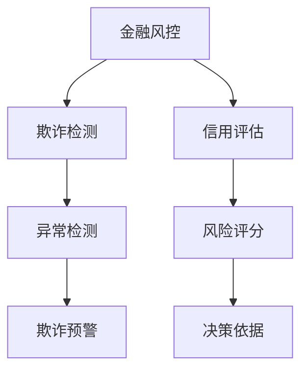

                 

# AI在金融风控中的应用：欺诈检测与信用评估

> 关键词：
- 金融风控
- 欺诈检测
- 信用评估
- 机器学习
- 数据挖掘
- 深度学习

## 1. 背景介绍

### 1.1 问题由来

随着金融科技的迅猛发展，互联网金融服务越来越普及，但也带来了新的风险挑战。在互联网金融交易中，欺诈行为层出不穷，给金融机构带来了巨大的损失。同时，传统的信用评估方法也面临着数据质量参差不齐、模型过时等问题，难以满足实时化、个性化、多维度评估的需求。

为了应对这些挑战，金融机构开始探索利用人工智能(AI)技术，特别是机器学习和深度学习，来提升金融风控和信用评估的精准性和自动化水平。其中，欺诈检测和信用评估是AI在金融风控中的两大核心应用。

### 1.2 问题核心关键点

金融风控中，欺诈检测和信用评估的核心关键点在于：

- 欺诈检测：识别和预防金融交易中的欺诈行为，保障资金和信息安全。
- 信用评估：基于客户的财务和非财务信息，评估其信用风险，为贷款、信用卡等金融产品的审批和定价提供依据。

这两项应用的目标都是为了降低金融风险，提升金融服务的效率和质量，但技术和实现方式有所不同。

## 2. 核心概念与联系

### 2.1 核心概念概述

要深入理解AI在金融风控中的应用，首先需要明确一些核心概念：

- **金融风控**：指金融机构通过各种技术和手段，识别和控制金融风险的过程。包括信用风险、市场风险、操作风险等。
- **欺诈检测**：通过数据分析和模型预测，识别和防范金融交易中的欺诈行为。
- **信用评估**：基于客户的历史和行为数据，评估其信用风险，为金融决策提供依据。
- **机器学习**：利用数据训练模型，让机器自动学习、推理和决策。
- **深度学习**：一种特殊的机器学习方法，通过构建多层神经网络，实现更复杂的特征提取和模式识别。
- **数据挖掘**：从大量数据中发现有用信息和知识的过程。

这些概念之间的逻辑关系可以通过以下Mermaid流程图来展示：



这个流程图展示了金融风控中的两个核心应用：欺诈检测和信用评估。欺诈检测通过识别异常交易，实现对欺诈行为的预警和防范；信用评估则通过对客户信息的综合分析，评估其信用风险，为贷款决策提供依据。两者都依赖于机器学习和深度学习技术的支持，并共享数据挖掘技术的应用。

## 3. 核心算法原理 & 具体操作步骤
### 3.1 算法原理概述

AI在金融风控中的应用，主要基于机器学习和深度学习技术。其中，欺诈检测和信用评估的算法原理和操作步骤有所不同，但都遵循相似的数据预处理、模型训练和模型评估流程。

### 3.2 算法步骤详解

#### 3.2.1 数据预处理

1. **数据收集**：收集金融机构的历史交易数据、客户信息、社交媒体数据、公共记录等，作为模型训练和验证的数据源。
2. **数据清洗**：处理缺失值、异常值和重复数据，确保数据的准确性和完整性。
3. **特征工程**：提取和构造有用的特征，如交易金额、时间、地点、交易方式等，以及客户的年龄、职业、信用记录等。

#### 3.2.2 模型训练

1. **选择模型**：根据应用场景选择合适的模型，如决策树、随机森林、支持向量机(SVM)、神经网络等。
2. **数据划分**：将数据集分为训练集、验证集和测试集，通常比例为70%训练、15%验证、15%测试。
3. **模型训练**：在训练集上训练模型，调整超参数以提高模型性能。
4. **模型验证**：在验证集上评估模型性能，避免过拟合。
5. **模型选择**：选择性能最好的模型，通常基于验证集的指标进行评估。

#### 3.2.3 模型评估

1. **评估指标**：选择适合的应用场景的评估指标，如准确率、召回率、F1分数、AUC等。
2. **模型调优**：根据评估结果调整模型参数，提升模型性能。
3. **模型部署**：将训练好的模型部署到生产环境，实现实时预测和决策。

### 3.3 算法优缺点

AI在金融风控中的应用，具有以下优点和缺点：

#### 优点

1. **高效自动化**：AI可以自动化处理大量数据，实时进行欺诈检测和信用评估，提高金融服务的效率和准确性。
2. **动态适应**：AI模型可以不断学习新的数据，动态适应金融市场的变化，及时发现新的欺诈模式和信用风险。
3. **多维度分析**：AI模型可以综合考虑多维度信息，如客户的交易行为、社交关系、公共记录等，提供更全面的风险评估。

#### 缺点

1. **数据依赖**：AI模型的性能依赖于数据的质量和多样性，需要收集大量高质量的数据。
2. **模型复杂**：构建复杂的AI模型需要较高的技术门槛，需要专业团队的支持。
3. **解释性不足**：AI模型的决策过程往往缺乏可解释性，难以解释模型的内部工作机制。

### 3.4 算法应用领域

AI在金融风控中的应用，主要应用于以下几个领域：

- **信用评估**：基于客户的财务和非财务信息，评估其信用风险，为贷款、信用卡等金融产品的审批和定价提供依据。
- **欺诈检测**：识别和预防金融交易中的欺诈行为，保障资金和信息安全。
- **风险预警**：通过实时监控和分析，及时发现和预警潜在的金融风险，如市场风险、操作风险等。
- **贷前审批**：利用AI技术进行贷前审批，提高审批效率，降低审批成本。
- **贷后管理**：利用AI技术进行贷后管理，监测客户的还款情况，及时发现和处理违约风险。

这些应用场景的实现，有助于提升金融机构的业务效率和风险控制能力，降低金融风险，保护客户权益。

## 4. 数学模型和公式 & 详细讲解  
### 4.1 数学模型构建

AI在金融风控中的应用，主要涉及以下数学模型：

- **分类模型**：如逻辑回归、决策树、随机森林等，用于评估客户的信用风险和识别欺诈行为。
- **回归模型**：如线性回归、支持向量回归等，用于预测客户的还款金额和行为表现。
- **神经网络模型**：如卷积神经网络(CNN)、循环神经网络(RNN)、长短时记忆网络(LSTM)等，用于处理多维度的数据，提取复杂的特征。

### 4.2 公式推导过程

以欺诈检测为例，假设我们有$N$个交易样本，每个样本有$D$个特征。设交易被标记为欺诈的样本为1，否则为0。设$\mathbf{X}$为特征矩阵，$\mathbf{y}$为目标变量。则多分类逻辑回归模型的目标函数为：

$$
\min_{\mathbf{w},b} \frac{1}{N} \sum_{i=1}^N [y_i \log\sigma(\mathbf{w}^T\mathbf{x}_i + b) + (1-y_i) \log(1-\sigma(\mathbf{w}^T\mathbf{x}_i + b))]
$$

其中，$\sigma$为sigmoid函数，$\mathbf{w}$为模型权重，$b$为偏置项。

### 4.3 案例分析与讲解

以信用评估为例，假设我们有一个包含100个客户的样本集，每个客户有5个特征，包括年龄、收入、信用记录、财务状况等。我们希望构建一个回归模型，预测客户的月还款金额。

假设我们的目标是预测客户的月还款金额，因此可以使用线性回归模型：

$$
y_i = \mathbf{w}^T\mathbf{x}_i + b
$$

其中，$y_i$为第$i$个客户的月还款金额，$\mathbf{x}_i$为第$i$个客户特征向量，$\mathbf{w}$为模型权重，$b$为偏置项。

## 5. 项目实践：代码实例和详细解释说明
### 5.1 开发环境搭建

在进行金融风控的AI应用开发前，需要准备好开发环境。以下是使用Python进行PyTorch开发的环境配置流程：

1. 安装Anaconda：从官网下载并安装Anaconda，用于创建独立的Python环境。

2. 创建并激活虚拟环境：
```bash
conda create -n pytorch-env python=3.8 
conda activate pytorch-env
```

3. 安装PyTorch：根据CUDA版本，从官网获取对应的安装命令。例如：
```bash
conda install pytorch torchvision torchaudio cudatoolkit=11.1 -c pytorch -c conda-forge
```

4. 安装TensorFlow：由于TensorFlow支持多平台，使用其提供的安装命令即可。
```bash
pip install tensorflow
```

5. 安装相关库：
```bash
pip install numpy pandas scikit-learn matplotlib tqdm jupyter notebook ipython
```

完成上述步骤后，即可在`pytorch-env`环境中开始金融风控应用的开发。

### 5.2 源代码详细实现

以下是一个使用PyTorch实现的信用评估项目的代码实现。

```python
import torch
import torch.nn as nn
import torch.optim as optim
from sklearn.model_selection import train_test_split
from sklearn.preprocessing import StandardScaler
from sklearn.metrics import mean_squared_error, r2_score

# 加载数据集
data = pd.read_csv('credit_data.csv')
X = data.drop(['amount', 'status'], axis=1)
y = data['amount']

# 特征工程
scaler = StandardScaler()
X_scaled = scaler.fit_transform(X)

# 划分数据集
X_train, X_test, y_train, y_test = train_test_split(X_scaled, y, test_size=0.2, random_state=42)

# 定义模型
class LinearRegression(nn.Module):
    def __init__(self, n_features):
        super(LinearRegression, self).__init__()
        self.linear = nn.Linear(n_features, 1)

    def forward(self, x):
        return self.linear(x)

# 训练模型
model = LinearRegression(X_train.shape[1])
criterion = nn.MSELoss()
optimizer = optim.Adam(model.parameters(), lr=0.01)

for epoch in range(1000):
    optimizer.zero_grad()
    y_pred = model(X_train)
    loss = criterion(y_pred, y_train)
    loss.backward()
    optimizer.step()

    if (epoch+1) % 100 == 0:
        print('Epoch [{}/{}], Loss: {:.4f}, Test MSE: {:.4f}, R^2 Score: {:.4f}'.format(
            epoch+1, 1000, loss.item(), mean_squared_error(y_test, model(X_test)), r2_score(y_test, model(X_test).detach().numpy())))

# 评估模型
mse = mean_squared_error(y_test, model(X_test))
rmse = np.sqrt(mse)
r2 = r2_score(y_test, model(X_test).detach().numpy())
print('Test MSE: {:.4f}, RMSE: {:.4f}, R^2 Score: {:.4f}'.format(mse, rmse, r2))
```

### 5.3 代码解读与分析

以下是代码中关键部分的详细解读：

**加载数据集**：
- `pd.read_csv('credit_data.csv')`：使用pandas库读取信用数据集。
- `X = data.drop(['amount', 'status'], axis=1)`：将数据集中的`amount`和`status`列删除，作为特征。
- `y = data['amount']`：将数据集中的`amount`列作为目标变量。

**特征工程**：
- `StandardScaler()`：对特征进行标准化处理。
- `scaler.fit_transform(X)`：标准化后的特征矩阵。

**模型定义**：
- `class LinearRegression(nn.Module)`：定义线性回归模型。
- `self.linear = nn.Linear(n_features, 1)`：定义线性层，输入特征维度为`n_features`，输出为1。
- `def forward(self, x)`：前向传播过程，计算模型输出。

**模型训练**：
- `criterion = nn.MSELoss()`：定义均方误差损失函数。
- `optimizer = optim.Adam(model.parameters(), lr=0.01)`：定义Adam优化器，学习率为0.01。
- `for epoch in range(1000)`：迭代1000次。
- `optimizer.zero_grad()`：梯度清零。
- `y_pred = model(X_train)`：预测训练集。
- `loss = criterion(y_pred, y_train)`：计算损失。
- `loss.backward()`：反向传播计算梯度。
- `optimizer.step()`：更新模型参数。

**模型评估**：
- `mean_squared_error(y_test, model(X_test))`：计算测试集的均方误差。
- `rmse = np.sqrt(mse)`：计算均方根误差。
- `r2_score(y_test, model(X_test).detach().numpy())`：计算决定系数。

通过这个代码示例，可以初步了解使用PyTorch进行线性回归模型的训练和评估流程。在实际应用中，还需要根据具体问题和数据特点进行更多的模型调整和优化。

## 6. 实际应用场景

### 6.1 智能信用卡

智能信用卡是金融机构常用的金融产品之一，通过AI技术进行欺诈检测和信用评估，可以提升客户体验和防范风险。

在智能信用卡中，AI技术主要用于：
- **欺诈检测**：实时监控和分析每笔交易，识别潜在的欺诈行为，及时预警。
- **信用评估**：通过综合分析客户的交易行为、消费习惯、社交媒体数据等，评估其信用风险，动态调整信用额度。

智能信用卡的应用，不仅提高了信用卡审批和管理的效率，还降低了欺诈和违约的风险，提升了客户满意度。

### 6.2 贷款审批

贷款审批是金融机构的重要业务之一，AI技术可以显著提升审批效率和决策质量。

在贷款审批中，AI技术主要用于：
- **欺诈检测**：通过分析借款人的信用记录、财务状况等，识别潜在的欺诈行为。
- **信用评估**：基于借款人的多维度信息，综合评估其信用风险，提供个性化的贷款方案。

通过AI技术进行贷款审批，可以大大缩短审批时间，降低审批成本，同时提高审批决策的准确性和公平性。

### 6.3 保险欺诈检测

保险欺诈是保险公司面临的重大风险之一，AI技术可以高效地识别和防范欺诈行为，保障公司的利益。

在保险欺诈检测中，AI技术主要用于：
- **欺诈检测**：分析客户的历史保险记录、理赔记录等，识别潜在的欺诈行为。
- **风险预警**：实时监控和分析理赔数据，及时发现和预警欺诈风险。

AI技术在保险欺诈检测中的应用，可以有效减少欺诈行为，降低公司的运营成本，提升客户信任度。

### 6.4 未来应用展望

随着AI技术的不断发展和普及，金融风控领域将迎来更多创新应用。未来，AI在金融风控中的应用将体现在以下几个方面：

1. **多模态数据融合**：将金融交易数据、客户社交媒体数据、公共记录等多模态数据进行融合，提升风险评估的准确性。
2. **实时风险预警**：利用流式计算和大数据技术，实现实时风险预警和分析，及时发现和处理潜在风险。
3. **跨领域应用**：将AI技术应用于其他领域，如供应链金融、消费金融等，提升金融服务的普适性和灵活性。
4. **联邦学习**：通过联邦学习技术，保护数据隐私的同时，实现跨机构间的模型共享和协作。
5. **可解释性AI**：提升AI模型的可解释性，增强模型的透明度和可信度。

这些创新应用将进一步推动金融科技的发展，提升金融服务的智能化水平，保障金融系统的稳定和安全。

## 7. 工具和资源推荐
### 7.1 学习资源推荐

为了帮助开发者系统掌握金融风控的AI技术，这里推荐一些优质的学习资源：

1. 《机器学习实战》书籍：由机器学习专家编写，系统介绍了机器学习的基本概念和实践技巧，适合初学者入门。
2. 《深度学习》课程：由斯坦福大学开设的深度学习课程，涵盖深度学习的基本原理和应用案例，适合进阶学习。
3. 《金融科技》课程：由清华大学开设的金融科技课程，涵盖金融科技的基本概念和应用场景，适合了解金融科技前沿。
4. Kaggle平台：提供大量金融风控相关的数据集和比赛，适合实践学习和数据挖掘。
5. PyTorch官方文档：PyTorch的官方文档，提供详细的API文档和示例代码，适合深入学习和开发。

通过对这些资源的学习实践，相信你一定能够快速掌握金融风控的AI技术，并用于解决实际的金融问题。

### 7.2 开发工具推荐

高效的开发离不开优秀的工具支持。以下是几款用于金融风控AI应用开发的常用工具：

1. PyTorch：基于Python的开源深度学习框架，灵活动态的计算图，适合快速迭代研究。
2. TensorFlow：由Google主导开发的开源深度学习框架，生产部署方便，适合大规模工程应用。
3. Scikit-learn：Python机器学习库，提供各种常用的机器学习算法和工具，适合数据预处理和模型评估。
4. Jupyter Notebook：交互式的Python开发环境，方便快速迭代和数据可视化。
5. H2O.ai：提供一站式的数据科学平台，支持数据预处理、模型训练、模型部署等，适合团队协作。

合理利用这些工具，可以显著提升金融风控AI应用的开发效率，加快创新迭代的步伐。

### 7.3 相关论文推荐

金融风控领域的AI技术研究，源于学界的持续研究。以下是几篇奠基性的相关论文，推荐阅读：

1. 《Deep Learning for Financial Risk Management》：介绍深度学习在金融风控中的应用，涵盖欺诈检测、信用评估等任务。
2. 《A Survey on Deep Learning-Based Credit Scoring and Fraud Detection》：综述深度学习在信用评估和欺诈检测中的应用。
3. 《Fraud Detection in Credit Card Transactions Using Deep Learning Techniques》：介绍使用深度学习进行信用卡欺诈检测的实践。
4. 《Feature Engineering and Model Selection in Credit Scoring Using Deep Learning》：介绍使用深度学习进行信用评估的特征工程和模型选择方法。
5. 《Real-Time Fraud Detection Using Deep Learning》：介绍使用深度学习进行实时欺诈检测的实践。

这些论文代表了大规模应用中的关键技术，通过对这些前沿成果的学习，可以帮助研究者把握学科前进方向，激发更多的创新灵感。

## 8. 总结：未来发展趋势与挑战

### 8.1 研究成果总结

本文对AI在金融风控中的应用，特别是欺诈检测和信用评估的算法原理和操作步骤进行了全面系统的介绍。主要内容包括：

- **算法原理**：介绍金融风控中常用的机器学习和深度学习算法，涵盖分类模型、回归模型和神经网络模型等。
- **操作步骤**：详细讲解数据预处理、模型训练和模型评估的流程，提供完整的代码实现。
- **实际应用**：介绍智能信用卡、贷款审批和保险欺诈检测等实际应用场景，展示AI技术在金融风控中的应用价值。

通过本文的系统梳理，可以看到，AI技术在金融风控中的应用，不仅提升了金融服务的效率和质量，还降低了金融风险，保护了客户权益。

### 8.2 未来发展趋势

展望未来，AI在金融风控中的应用将呈现以下几个发展趋势：

1. **深度学习应用广泛**：随着深度学习算法的不断进步，更多复杂的金融风控任务将得以应用，如金融市场预测、风险管理等。
2. **联邦学习成为主流**：在数据隐私和安全要求日益严格的背景下，联邦学习将成为数据共享和协作的重要技术。
3. **多模态数据融合**：将金融交易数据、客户社交媒体数据、公共记录等多模态数据进行融合，提升风险评估的准确性。
4. **实时风险预警**：利用流式计算和大数据技术，实现实时风险预警和分析，及时发现和处理潜在风险。
5. **可解释性AI**：提升AI模型的可解释性，增强模型的透明度和可信度。

这些趋势凸显了AI技术在金融风控领域的广阔前景，未来将会有更多创新应用，提升金融服务的智能化水平，保障金融系统的稳定和安全。

### 8.3 面临的挑战

尽管AI在金融风控中的应用取得了显著成效，但仍面临以下挑战：

1. **数据质量参差不齐**：金融数据存在数据质量参差不齐、缺失值多等问题，难以构建高质量的模型。
2. **模型复杂度高**：深度学习模型复杂度高，训练和部署成本高，难以快速迭代。
3. **数据隐私保护**：金融数据涉及客户隐私，需要严格的数据隐私保护措施，限制数据共享和协作。
4. **模型可解释性不足**：AI模型的决策过程缺乏可解释性，难以解释模型的内部工作机制，影响用户信任度。
5. **技术门槛高**：AI技术涉及数据预处理、模型训练、模型评估等多个环节，需要专业的技术团队支持。

这些挑战需要未来在技术、法规和实践等方面进行全面突破，才能更好地推动AI在金融风控中的应用。

### 8.4 研究展望

面对未来金融风控领域的技术挑战，未来的研究需要在以下几个方面寻求新的突破：

1. **数据预处理技术**：研发更加高效、准确的数据预处理技术，提升数据质量，构建高质量的模型。
2. **模型简化技术**：研发更加轻量级、实时性的深度学习模型，降低模型复杂度，提高训练和部署效率。
3. **数据隐私保护技术**：研究联邦学习等数据隐私保护技术，实现数据共享和协作，同时保护客户隐私。
4. **可解释性AI**：提升AI模型的可解释性，增强模型的透明度和可信度，提升用户信任度。
5. **跨领域协作**：加强与金融科技、保险、政府等领域的协作，实现跨机构间的模型共享和合作，提升金融风控的整体水平。

这些研究方向的探索，将有助于解决当前金融风控领域的技术难题，推动AI技术在金融风控中的更广泛应用，为金融科技的发展注入新的动力。

## 9. 附录：常见问题与解答

**Q1：在金融风控中，如何处理不平衡数据？**

A: 在金融风控中，数据往往存在不平衡的问题，即欺诈行为占比较小。为了处理不平衡数据，可以采取以下方法：

1. **重采样**：通过欠采样（去掉多数类样本）或过采样（增加少数类样本）来平衡数据分布。
2. **类别权重调整**：在模型训练时，为少数类样本设置更大的权重，提升其在模型中的重要性。
3. **生成合成样本**：使用生成对抗网络（GAN）等生成模型，生成合成少数类样本，增加数据量。

这些方法可以提升模型对少数类样本的识别能力，改善模型的公平性和准确性。

**Q2：在金融风控中，如何选择特征？**

A: 在金融风控中，特征选择非常重要，直接影响到模型的性能和泛化能力。选择特征的方法包括：

1. **相关性分析**：通过计算特征与目标变量之间的相关性，选择与目标变量最相关的特征。
2. **特征重要性排序**：通过树模型、随机森林等算法，计算特征的重要性，选择最重要的特征。
3. **嵌入式方法**：在模型训练过程中，选择对目标变量影响较大的特征。

这些方法可以帮助选择对模型有用的特征，提升模型的预测能力。

**Q3：在金融风控中，如何处理特征缺失？**

A: 在金融风控中，数据往往存在特征缺失的问题，处理缺失值的方法包括：

1. **插值法**：使用均值、中位数、众数等插值方法填补缺失值。
2. **删除法**：删除缺失值较多的样本或特征，避免缺失值对模型产生影响。
3. **多重插补法**：使用多重插补法，通过其他特征预测缺失值，并进行插补。

这些方法可以帮助处理特征缺失问题，提升数据完整性，提升模型性能。

**Q4：在金融风控中，如何评估模型性能？**

A: 在金融风控中，评估模型的性能需要综合考虑多个指标，包括：

1. **准确率（Accuracy）**：模型正确预测的样本占总样本数的比例。
2. **召回率（Recall）**：模型正确预测的正样本占实际正样本的比例。
3. **精确率（Precision）**：模型正确预测的正样本占预测为正样本的样本数的比例。
4. **F1分数（F1 Score）**：精确率和召回率的调和平均数，综合考虑模型的准确性和召回率。
5. **AUC（Area Under Curve）**：ROC曲线下的面积，衡量模型的整体性能。

这些指标可以帮助全面评估模型的性能，选择最适合应用的模型。

**Q5：在金融风控中，如何优化模型？**

A: 在金融风控中，优化模型的方法包括：

1. **超参数调优**：通过网格搜索、随机搜索等方法，寻找最优的超参数组合。
2. **模型集成**：通过集成多个模型，提升模型的泛化能力和稳定性。
3. **模型压缩**：通过剪枝、量化等方法，减小模型大小，提高模型效率。
4. **数据增强**：通过数据增强技术，提升模型的鲁棒性和泛化能力。

这些方法可以帮助提升模型的性能和鲁棒性，提升金融风控的效率和质量。

---

作者：禅与计算机程序设计艺术 / Zen and the Art of Computer Programming

