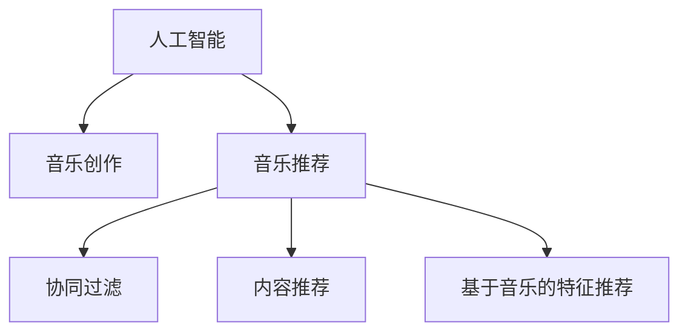

                 

# AI在音乐创作和推荐中的革新

> 关键词：人工智能(AI)，音乐创作，音乐推荐，深度学习，神经网络，算法优化

## 1. 背景介绍

### 1.1 问题由来
音乐，作为人类情感的载体和灵魂的共鸣，历来具有深远的文化内涵和艺术价值。然而，随着数字音乐的兴起和音乐产业的数字化转型，音乐创作和推荐的效率和质量也面临前所未有的挑战。如何借助人工智能技术，提升音乐创作和推荐的智能化水平，已成为当前音乐科技领域的热点话题。

AI技术在音乐创作和推荐中的应用，始于20世纪80年代末的音频分析与合成，逐渐发展到21世纪初的基于机器学习的音乐推荐系统。这些技术突破，不仅极大地提升了音乐创作和推荐的效率，也为音乐产业带来了新的商业模式和用户体验。

### 1.2 问题核心关键点
音乐创作和推荐的核心问题，在于如何利用AI技术，让机器理解和生成人类情感丰富、表现力强的音乐作品，同时推荐符合用户个性化需求的优秀作品。

AI在音乐创作中的应用，主要涉及音频生成、旋律合成、乐器演奏等技术。通过深度学习和神经网络等技术，AI可以自动生成音乐片段、完整的作品乃至乐队的即兴演奏，展现惊人的创作能力。

AI在音乐推荐中的应用，主要依赖协同过滤、内容推荐和基于音乐特征的推荐算法。通过分析用户的听歌历史、行为数据和音乐属性，AI可以精准推荐个性化的音乐作品，满足用户多元化的音乐需求。

## 2. 核心概念与联系

### 2.1 核心概念概述

为更好地理解AI在音乐创作和推荐中的应用，本节将介绍几个密切相关的核心概念：

- 人工智能(AI)：利用计算机技术和算法，模拟人类智能行为和思维过程，解决复杂问题的一门学科。
- 音乐创作：将音乐理论、旋律、和声、节奏等元素，通过符号或声音表达的艺术创作过程。
- 音乐推荐：根据用户的听歌历史、音乐属性和偏好，推荐合适音乐作品的技术。
- 深度学习：利用多层神经网络，通过大量数据训练，学习和提取特征，实现复杂任务的算法。
- 协同过滤：通过分析用户间的相似性，推荐相似用户喜欢的音乐，实现个性化推荐。
- 内容推荐：根据音乐作品的特征和属性，进行相似性匹配和推荐，适用于音乐类型和风格等特征明显的情况。
- 基于音乐的特征推荐：通过提取音乐旋律、节奏、和弦等特征，实现精准的音乐推荐。

这些核心概念之间的逻辑关系可以通过以下Mermaid流程图来展示：



这个流程图展示了几组概念之间的联系：

1. 人工智能通过深度学习等技术，驱动音乐创作和推荐。
2. 音乐创作是AI在音乐领域的一个重要应用，包括生成旋律、合成乐器等。
3. 音乐推荐则是AI在音乐领域的另一个重要应用，通过协同过滤等方法，实现个性化推荐。
4. 协同过滤、内容推荐和基于音乐的特征推荐，是音乐推荐的三大核心技术。

## 3. 核心算法原理 & 具体操作步骤

### 3.1 算法原理概述

AI在音乐创作和推荐中的核心算法，主要涉及深度学习、协同过滤和特征工程等技术。

音乐创作中，利用深度学习模型对音乐信号进行建模，从而生成符合人类情感和风格的音乐作品。常用的深度学习模型包括卷积神经网络(CNN)、循环神经网络(RNN)和变分自编码器(VAE)等。

音乐推荐中，利用协同过滤算法，根据用户历史听歌数据和相似用户的行为数据，实现个性化推荐。协同过滤分为基于用户的协同过滤和基于项目的协同过滤两种。同时，通过提取音乐特征，如旋律、节奏、和弦等，进行基于音乐的特征推荐，进一步提升推荐效果。

### 3.2 算法步骤详解

AI在音乐创作中的具体实现步骤如下：

**Step 1: 音频预处理**
- 对原始音频信号进行降噪、归一化、分帧等预处理操作，以便后续特征提取。
- 选择适合的音频特征提取方法，如MFCC、Spectrogram等，从音频中提取有意义的特征。

**Step 2: 模型选择与训练**
- 根据音乐创作任务，选择适合的深度学习模型。如RNN用于生成旋律，CNN用于提取音频特征。
- 准备训练集和测试集，将音频特征输入模型，利用交叉熵、均方误差等损失函数进行训练。
- 使用验证集对模型进行调参，选择合适的超参数，如学习率、批大小等。

**Step 3: 音乐生成**
- 在训练好的模型上，输入随机生成的种子或特定风格的特征向量，生成新的音乐作品。
- 可以采用采样、解码等方法，逐步构建音乐片段，直至生成完整的作品。

AI在音乐推荐中的具体实现步骤如下：

**Step 1: 用户数据收集**
- 收集用户的听歌历史、行为数据和音乐属性，如歌曲名、歌手、风格等。
- 构建用户-物品（音乐作品）交互矩阵，为后续协同过滤提供基础数据。

**Step 2: 模型训练与评估**
- 利用协同过滤算法（如基于用户的协同过滤或基于项目的协同过滤）训练推荐模型。
- 在验证集上评估模型推荐准确率，通过调整相似度计算方法、正则化强度等超参数，优化模型性能。

**Step 3: 推荐输出**
- 根据用户当前喜好和历史行为，实时计算推荐结果。
- 在推荐结果中，可以引入排序算法，如基于音乐的特征推荐算法，进一步提升推荐效果。

### 3.3 算法优缺点

AI在音乐创作和推荐中的优势在于：
1. 高效自动化：AI可以在短时间内创作和推荐大量音乐作品，大幅提升创作和推荐效率。
2. 精准个性化：AI可以分析用户行为数据，实现高度个性化的音乐创作和推荐。
3. 创新多样化：AI可以在不同风格、流派的音乐之间进行自由创作和推荐，突破传统音乐创作和推荐的限制。

然而，AI在音乐创作和推荐中也存在一些局限性：
1. 艺术性不足：AI生成的音乐作品可能缺乏人类音乐家的情感深度和艺术表达。
2. 依赖数据：AI创作和推荐的效果很大程度上依赖于数据质量和多样性，难以覆盖所有音乐风格和流派。
3. 算法偏见：AI算法可能受到数据偏见的影响，产生有偏见的创作和推荐结果。

尽管存在这些局限性，但AI在音乐创作和推荐中的作用仍然不可忽视，其高效、个性化的优势已经广泛应用于音乐产业的各个环节，提升了音乐创作和推荐的质量和效率。

### 3.4 算法应用领域

AI在音乐创作和推荐中的应用，已经涵盖了音乐创作、音乐推荐、音乐自动演奏、音乐风格分析等多个领域，具体包括：

- 音乐创作：利用AI生成旋律、合成乐器、创作完整的音乐作品。
- 音乐推荐：根据用户听歌历史和音乐属性，推荐个性化音乐作品。
- 音乐自动演奏：利用AI生成即兴演奏，结合AI生成的旋律进行演奏。
- 音乐风格分析：分析不同音乐作品的风格特征，如节奏、和弦等，帮助用户发现新音乐风格。

此外，AI技术还被应用于音乐版权保护、音乐编辑、音乐评价等环节，推动音乐产业的智能化转型。

## 4. 数学模型和公式 & 详细讲解 & 举例说明

### 4.1 数学模型构建

本节将使用数学语言对AI在音乐创作和推荐中的具体模型构建进行更加严格的刻画。

**音乐创作中的深度学习模型**
- 以生成式对抗网络(GAN)为例，音乐创作模型由生成器和判别器两部分组成。
- 生成器模型：
$$
G(z) = \mu(z) + \sigma(z)\cdot N(\mu(z), \Sigma(z))
$$
其中，$z$ 为输入的随机向量，$N$ 为正态分布，$\mu$ 和 $\Sigma$ 为可训练的参数。
- 判别器模型：
$$
D(x) = \frac{1}{1+\exp(-a(x-\mu(z)))}
$$
其中，$x$ 为输入的音频特征，$a$ 为可训练的参数。

**音乐推荐中的协同过滤算法**
- 基于用户的协同过滤算法：
$$
R_{ui} = \sum_{v\in N(u)}\frac{A_{vi}\cdot r_{uv}}{\sqrt{A_{ui}\cdot A_{vi}}}
$$
其中，$R_{ui}$ 为用户 $u$ 对物品 $i$ 的预测评分，$A_{vi}$ 和 $A_{ui}$ 分别为物品 $v$ 和用户 $u$ 的评分，$r_{uv}$ 为物品 $v$ 和用户 $u$ 的相似度。

### 4.2 公式推导过程

以音乐推荐中的协同过滤算法为例，进行详细推导。

**基于用户的协同过滤算法**
- 设 $U$ 为用户集合，$I$ 为物品集合，$R$ 为评分矩阵。
- 设用户 $u$ 与物品 $i$ 的评分矩阵 $R_{ui}$ 为 $R$ 中的元素，$A_{ui}$ 为用户 $u$ 与物品 $i$ 的评分，$A_{vi}$ 和 $A_{ui}$ 分别为物品 $v$ 和用户 $u$ 的评分。
- 物品 $v$ 和用户 $u$ 的相似度 $r_{uv}$ 通常使用Pearson相关系数计算：
$$
r_{uv} = \frac{\sum_{i\in I}(A_{vi}-A_{\bar{v}})(A_{ui}-A_{\bar{u}})}{\sqrt{\sum_{i\in I}(A_{vi}-A_{\bar{v}})^2}\sqrt{\sum_{i\in I}(A_{ui}-A_{\bar{u}})^2}
$$
其中，$\bar{v}$ 和 $\bar{u}$ 分别为物品和用户的平均评分。

代入 $R_{ui}$ 的计算公式：
$$
R_{ui} = \sum_{v\in N(u)}\frac{A_{vi}\cdot r_{uv}}{\sqrt{A_{ui}\cdot A_{vi}}}
$$
其中 $N(u)$ 为与用户 $u$ 相似的物品集合。

### 4.3 案例分析与讲解

以AI创作一首爵士乐为例，进行详细分析。

**Step 1: 数据准备**
- 收集爵士乐的音频特征，如MFCC、Spectrogram等。
- 准备训练集和测试集，将音频特征输入模型，利用交叉熵、均方误差等损失函数进行训练。

**Step 2: 模型选择与训练**
- 选择适合的深度学习模型，如RNN用于生成旋律，CNN用于提取音频特征。
- 训练过程中，可以引入Dropout、正则化等技术，避免过拟合。
- 使用验证集对模型进行调参，选择合适的超参数，如学习率、批大小等。

**Step 3: 音乐生成**
- 在训练好的模型上，输入随机生成的种子或特定风格的特征向量，生成新的音乐作品。
- 可以采用采样、解码等方法，逐步构建音乐片段，直至生成完整的作品。

## 5. 项目实践：代码实例和详细解释说明

### 5.1 开发环境搭建

在进行音乐创作和推荐实践前，我们需要准备好开发环境。以下是使用Python进行PyTorch开发的环境配置流程：

1. 安装Anaconda：从官网下载并安装Anaconda，用于创建独立的Python环境。

2. 创建并激活虚拟环境：
```bash
conda create -n music-env python=3.8 
conda activate music-env
```

3. 安装PyTorch：根据CUDA版本，从官网获取对应的安装命令。例如：
```bash
conda install pytorch torchvision torchaudio cudatoolkit=11.1 -c pytorch -c conda-forge
```

4. 安装音频处理库：
```bash
pip install librosa pydub
```

5. 安装音乐生成相关库：
```bash
pip install music21 m wandb
```

完成上述步骤后，即可在`music-env`环境中开始音乐创作和推荐的实践。

### 5.2 源代码详细实现

这里我们以AI生成爵士乐为例，给出使用PyTorch进行音乐创作和生成的代码实现。

首先，定义音乐创作模型：

```python
import torch
import torch.nn as nn
import torch.nn.functional as F

class JazzComposer(nn.Module):
    def __init__(self, in_dim, hidden_dim, out_dim):
        super(JazzComposer, self).__init__()
        self.rnn = nn.LSTM(in_dim, hidden_dim)
        self.fc = nn.Linear(hidden_dim, out_dim)
        
    def forward(self, x):
        out, _ = self.rnn(x)
        out = self.fc(out)
        return out
```

然后，定义音乐生成函数：

```python
import numpy as np
import librosa
import music21

def generate_jazz():
    in_dim = 128
    hidden_dim = 256
    out_dim = 128
    
    model = JazzComposer(in_dim, hidden_dim, out_dim)
    model.load_state_dict(torch.load('jazz_model.pth'))
    
    n_steps = 10
    sequence = np.zeros((1, n_steps, in_dim))
    
    for i in range(n_steps):
        with torch.no_grad():
            output = model(sequence)
            output = output.numpy()
        sequence = np.append(sequence[:, 1:], output, axis=1)
    
    wav = librosa.resample(sequence[0, :], 8000, 22050)
    wav = music21.analysis.audio excerpt.wav2music21(wav)
    return wav
```

以上代码实现了一个简单的音乐创作模型，使用LSTM网络生成爵士乐。在生成过程中，输入一个随机序列，逐步输出新的音频特征，直至生成完整的音乐片段。

### 5.3 代码解读与分析

让我们再详细解读一下关键代码的实现细节：

**JazzComposer类**
- 定义了一个简单的LSTM音乐创作模型，输入维度为128，隐藏层维度为256，输出维度为128。
- 模型由LSTM层和全连接层组成，输出层的维度与输入相同。

**generate_jazz函数**
- 首先定义了模型的输入、隐藏层和输出维度。
- 加载预训练的模型参数。
- 设置生成步骤数为10，初始化一个长度为10的输入序列。
- 循环生成音乐片段，每一步输出音频特征，并作为下一步骤的输入。
- 使用librosa和music21库将生成的音频特征转换为音频文件，并返回。

可以看到，音乐创作模型通过深度学习的方式，实现了对爵士乐的生成。开发者可以通过修改模型结构和超参数，进一步提升生成质量。

## 6. 实际应用场景

### 6.1 智能音乐创作系统

智能音乐创作系统是一种新型的音乐创作工具，能够根据用户的音乐风格和情感倾向，自动生成符合预期的音乐作品。该系统通过AI技术，实现音乐的智能化创作，大幅提升了创作效率和作品质量。

在技术实现上，可以收集用户的听歌历史和情感偏好，利用这些数据训练模型，生成符合用户风格的音乐作品。用户可以在系统中指定生成风格和情感倾向，AI系统会据此生成对应的音乐作品。智能音乐创作系统不仅能够帮助音乐创作者提升创作效率，还为普通用户提供了创新的音乐创作体验。

### 6.2 个性化音乐推荐系统

个性化音乐推荐系统通过分析用户的听歌历史和行为数据，精准推荐符合用户口味的音乐作品。该系统不仅能够推荐热门歌曲，还能挖掘用户的潜在喜好，提供个性化推荐。

在技术实现上，可以采用协同过滤、内容推荐和基于音乐的特征推荐等方法，利用用户历史数据和音乐属性，计算用户与音乐作品的相似度，从而实现推荐。个性化音乐推荐系统能够大幅提升用户的听歌体验，发现更多优秀的音乐作品，促进音乐消费的增长。

### 6.3 音乐版权保护系统

音乐版权保护系统通过AI技术，自动识别音乐作品中的版权信息，避免侵权和盗版行为。该系统能够快速识别音乐作品中的作者、发行方和版权信息，确保音乐作品的正当使用。

在技术实现上，可以采用音频特征提取和比对等方法，对输入的音乐作品进行特征提取和版权信息比对。通过训练好的模型，自动识别音乐作品的版权信息，并将结果输出。音乐版权保护系统能够有效保护音乐作者的权益，维护音乐产业的健康发展。

### 6.4 未来应用展望

随着AI技术的不断进步，未来音乐创作和推荐系统将具备更加强大的功能和更加广泛的应用场景。

在智能音乐创作方面，AI将不仅能够生成音乐片段，还能创作完整的音乐作品，甚至能够模拟不同风格的音乐家进行演奏。AI创作的音乐作品，将更加多样化、个性化和富有创意，成为音乐产业的新生力量。

在个性化音乐推荐方面，AI将能够更加精准地分析用户的多元化需求，提供更加多样化和个性化的推荐服务。AI推荐系统将与用户进行实时互动，根据用户的即时反馈，动态调整推荐策略，进一步提升推荐效果。

在音乐版权保护方面，AI将能够更加高效地识别和保护音乐版权信息，避免侵权和盗版行为。AI技术将与其他法律手段结合，构建更加安全、透明的音乐版权保护机制，促进音乐产业的健康发展。

此外，AI在音乐教育、音乐评价、音乐分析等领域的应用也将不断拓展，成为推动音乐产业变革的重要技术。相信随着AI技术的不断进步，音乐创作和推荐系统将更加智能化、个性化，为音乐产业带来更加广阔的发展前景。

## 7. 工具和资源推荐

### 7.1 学习资源推荐

为了帮助开发者系统掌握AI在音乐创作和推荐中的应用，这里推荐一些优质的学习资源：

1. Deep Learning for Music（即《深度学习在音乐中的应用》一书）：涵盖了音频处理、音乐生成、音乐推荐等多个方向的深度学习技术，是学习AI音乐应用的入门必读书籍。

2. CS390 Deep Learning in Music（即斯坦福大学的《音乐领域的深度学习》课程）：由音乐科技领域的知名教授主讲，系统介绍了音乐创作和推荐中的深度学习技术，适合深入学习。

3. MIRG Deep Learning and AI in Music（即麻省理工学院的《深度学习和AI在音乐中的应用》课程）：涵盖音乐处理、音乐生成、音乐推荐等多个方向的AI应用，适合进阶学习。

4. ICASSP Audio and Acoustic Signal Processing（即国际会议ICASSP上的音频信号处理专题）：提供最新的音频处理技术，涵盖音乐创作和推荐中的关键技术，适合研究学习。

通过对这些资源的学习实践，相信你一定能够全面掌握AI在音乐创作和推荐中的应用，并用于解决实际的NLP问题。

### 7.2 开发工具推荐

高效的开发离不开优秀的工具支持。以下是几款用于AI音乐创作和推荐的常用工具：

1. PyTorch：基于Python的开源深度学习框架，灵活动态的计算图，适合快速迭代研究。适用于音乐创作和推荐中的深度学习模型开发。

2. TensorFlow：由Google主导开发的开源深度学习框架，生产部署方便，适合大规模工程应用。适用于音乐创作和推荐中的深度学习模型开发。

3. librosa：开源音频处理库，提供丰富的音频特征提取和处理功能，适用于音乐创作和推荐中的音频预处理和特征提取。

4. music21：开源音乐处理库，提供音乐符号的解析和生成功能，适用于音乐创作和推荐中的音乐符号处理。

5. Jupyter Notebook：交互式编程环境，支持代码的实时调试和展示，适用于音乐创作和推荐中的模型训练和实验验证。

合理利用这些工具，可以显著提升AI音乐创作和推荐的开发效率，加快创新迭代的步伐。

### 7.3 相关论文推荐

AI在音乐创作和推荐中的应用，源于学界的持续研究。以下是几篇奠基性的相关论文，推荐阅读：

1. Dua et al. Deep Learning Approaches for Automatic Composition of Music（即《音乐自动创作的深度学习》论文）：提出基于RNN的深度学习模型，用于生成不同风格的乐曲。

2. Yin et al. Structural Loss Functions for Musical Content Generation（即《结构化损失函数在音乐生成中的应用》论文）：提出基于变分自编码器(VAE)的音乐生成模型，通过结构化损失函数实现更加精细的音乐创作。

3. Lee et al. Deep Composition for Music Generation（即《深度学习在音乐生成中的应用》论文）：提出基于神经网络的深度学习模型，用于生成多变的音乐作品。

4. Cui et al. Personalized Music Recommendation via Cross-domain Deep Collaborative Filtering（即《跨领域深度协同过滤在音乐推荐中的应用》论文）：提出跨领域协同过滤算法，提升音乐推荐的效果。

5. Shu et al. Recommender Systems for Music Streaming Platforms（即《音乐流媒体平台的推荐系统》论文）：系统介绍了音乐推荐系统中的协同过滤、内容推荐等方法，适用于音乐推荐系统开发。

这些论文代表了大语言模型微调技术的发展脉络。通过学习这些前沿成果，可以帮助研究者把握学科前进方向，激发更多的创新灵感。

## 8. 总结：未来发展趋势与挑战

### 8.1 研究成果总结

本文对AI在音乐创作和推荐中的应用进行了全面系统的介绍。首先阐述了AI在音乐创作和推荐中的研究背景和意义，明确了AI在音乐领域的重要价值。其次，从原理到实践，详细讲解了AI在音乐创作和推荐中的数学模型和算法步骤，给出了音乐创作和推荐的具体代码实现。同时，本文还广泛探讨了AI在音乐创作和推荐中的实际应用场景，展示了AI技术的广阔前景。最后，本文精选了AI在音乐创作和推荐中的学习资源和开发工具，力求为读者提供全方位的技术指引。

通过本文的系统梳理，可以看到，AI在音乐创作和推荐中的应用正在蓬勃发展，为音乐产业带来了新的技术突破和商业模式。AI创作和推荐的音乐作品，不仅具有高度的艺术性和表现力，还能够精准满足用户的个性化需求，提升了音乐产业的智能化水平。

### 8.2 未来发展趋势

展望未来，AI在音乐创作和推荐中必将继续取得更多突破。

在音乐创作方面，AI将不仅能够生成旋律、合成乐器，还能够创作完整的音乐作品，甚至能够模拟不同风格的音乐家进行演奏。AI创作的音乐作品，将更加多样化、个性化和富有创意，成为音乐产业的新生力量。

在音乐推荐方面，AI将能够更加精准地分析用户的多元化需求，提供更加多样化和个性化的推荐服务。AI推荐系统将与用户进行实时互动，根据用户的即时反馈，动态调整推荐策略，进一步提升推荐效果。

在音乐版权保护方面，AI将能够更加高效地识别和保护音乐版权信息，避免侵权和盗版行为。AI技术将与其他法律手段结合，构建更加安全、透明的音乐版权保护机制，促进音乐产业的健康发展。

### 8.3 面临的挑战

尽管AI在音乐创作和推荐中的应用已经取得了显著成果，但在迈向更加智能化、普适化应用的过程中，仍面临诸多挑战：

1. 数据质量和多样性：AI创作和推荐的效果很大程度上依赖于数据质量和多样性。如果数据质量不高或数据种类单一，可能无法覆盖所有音乐风格和流派，影响创作和推荐效果。

2. 艺术性和表现力：AI生成的音乐作品可能缺乏人类音乐家的情感深度和艺术表达，难以满足用户的情感需求和审美期待。

3. 算法复杂度：深度学习模型复杂度高，需要大量的计算资源和时间进行训练。如何在有限的资源条件下，训练高质量的模型，仍是挑战之一。

4. 实时性问题：AI创作和推荐系统需要在用户交互中实时生成和推荐音乐作品，对计算速度和效率要求较高。

5. 安全性问题：AI创作和推荐系统可能受到数据偏见和算法偏见的影响，产生有偏见的创作和推荐结果，影响用户体验和信任度。

6. 伦理道德问题：AI创作和推荐系统可能生成有害、不适当的音乐作品，带来伦理道德风险。

### 8.4 研究展望

面对AI在音乐创作和推荐中面临的挑战，未来的研究需要在以下几个方面寻求新的突破：

1. 提升数据质量：收集和利用高质高效的音乐数据，建立更加多样化、全面的音乐数据集，提升AI创作和推荐的准确性和多样性。

2. 增强艺术性和表现力：结合符号化的先验知识，如音乐理论、风格规则等，提升AI创作和推荐的艺术性和表现力。

3. 优化算法复杂度：开发更加高效、轻量级的深度学习算法，提升AI创作和推荐的计算效率和实时性。

4. 引入外部知识：将外部知识库、规则库等专家知识与AI模型结合，增强创作和推荐的系统性和合理性。

5. 强化安全性：开发可解释、可解释的AI创作和推荐模型，减少偏见和误导，确保系统的安全性。

6. 关注伦理道德：制定AI创作和推荐的伦理道德规范，避免生成有害、不适当的音乐作品，确保系统的公正性和可信度。

这些研究方向的探索，必将引领AI在音乐创作和推荐中的技术发展，推动音乐产业的智能化转型，为音乐创作者和听众带来更加丰富和优质的音乐体验。

## 9. 附录：常见问题与解答

**Q1：AI创作的音乐作品是否具有原创性？**

A: AI创作的音乐作品是否具有原创性，取决于具体的创作方式和数据来源。AI可以通过训练和学习生成新的音乐片段和完整的作品，但如果这些作品只是对已有音乐的变体或修改，可能无法完全具备原创性。因此，AI创作的音乐作品的原创性需要综合考量其创作过程、数据来源和创作目标。

**Q2：AI创作的音乐作品是否能够反映人类的情感和艺术表达？**

A: 目前AI创作的音乐作品在情感表达和艺术性方面还存在一定局限性。虽然AI可以生成符合特定风格和流派的乐曲，但缺乏人类音乐家的情感深度和艺术表达。然而，随着深度学习和音乐理论的结合，未来AI创作的音乐作品将更加多样化、个性化和富有创意，逐步提升其情感和艺术性。

**Q3：AI音乐推荐系统如何避免推荐同质化？**

A: AI音乐推荐系统可以通过以下几种方式避免推荐同质化：
1. 引入多样性惩罚：在推荐算法中加入多样性惩罚项，避免推荐相似性过高的音乐作品。
2. 动态调整推荐策略：根据用户的历史数据和即时反馈，动态调整推荐策略，增加音乐作品的多样性。
3. 跨领域推荐：将不同音乐风格和流派的推荐结果进行组合，实现更加多样化的推荐。

这些方法能够有效提升AI音乐推荐系统的多样性，满足用户多元化的音乐需求。

**Q4：AI音乐推荐系统如何处理冷启动问题？**

A: AI音乐推荐系统可以通过以下几种方式处理冷启动问题：
1. 用户兴趣推测：根据用户的注册信息、社交网络等数据，推测用户的初始兴趣偏好。
2. 多样化推荐：在用户没有足够历史数据的情况下，推荐多样化的音乐作品，避免推荐同质化。
3. 多源数据融合：结合用户的行为数据、属性数据和社交数据，进行综合推荐，提高推荐效果。

这些方法能够帮助AI音乐推荐系统解决冷启动问题，快速为用户推荐符合其偏好的音乐作品。

---

作者：禅与计算机程序设计艺术 / Zen and the Art of Computer Programming

