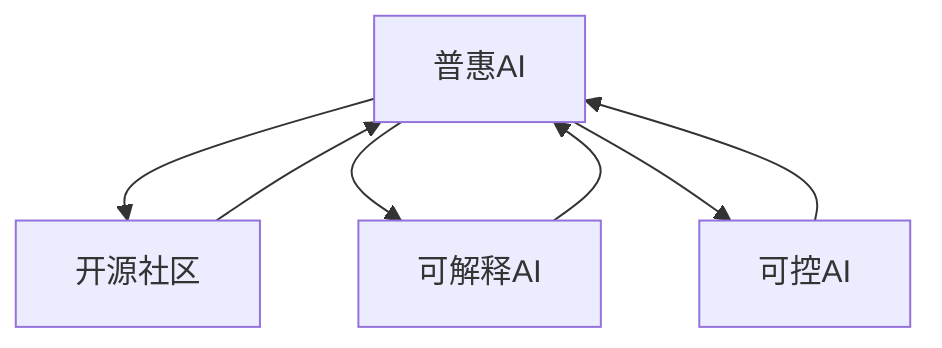

                 

# AI基础设施的民主化：Lepton AI的普惠AI理念

## 1. 背景介绍

### 1.1 问题由来

随着人工智能技术的迅猛发展，AI基础设施的构建已经成为了推动各行各业数字化转型的重要工具。然而，当前主流的AI基础设施，如云计算平台、深度学习框架、数据集等，多为大企业所控制和垄断。中小企业和高需求领域，由于资源和技术壁垒，难以获得高质量的AI基础设施支持，使得AI技术的应用成本高昂，难以普及。

此外，AI技术的普惠性不足，主要是由于其复杂度高、门槛高、成本高。普通企业和开发者往往难以负担昂贵的开发成本和部署维护费用，导致AI技术的可及性不高。这种“数字鸿沟”现象，严重限制了AI技术在社会各领域的广泛应用，无法实现其应有的社会效益。

### 1.2 问题核心关键点

要解决AI基础设施的普惠性问题，必须从以下几个方面入手：
1. 构建更加开放、易用、高效的AI基础设施平台，降低企业和开发者的使用门槛。
2. 利用开源社区的力量，促进AI技术的发展和普及。
3. 推广可解释、可控的AI模型，提升AI技术的透明度和可信度。
4. 结合政策支持，建立健全AI技术普及和使用的规范与标准。

## 2. 核心概念与联系

### 2.1 核心概念概述

为了更好地理解Lepton AI普惠AI理念，我们将介绍几个关键概念：

- 普惠AI (Inclusive AI)：指通过构建易于使用、成本低廉的AI基础设施，使各个社会层面的用户都能享受到AI技术的红利，缩小“数字鸿沟”。
- 开源社区 (Open Source Community)：指以共享代码、知识、资源为核心，促进AI技术普及和进步的开发者群体。
- 可解释AI (Explainable AI)：指通过增加模型透明度，使得AI系统的决策过程可以被理解和解释，增强用户对AI系统的信任。
- 可控AI (Controllable AI)：指通过人工介入和约束，使得AI系统能够按照预设规则进行决策，确保系统安全性和伦理性。

这些核心概念之间存在紧密的联系，共同构成了Lepton AI的普惠AI理念基础：

1. 普惠AI的核心在于构建开放、易用、高效的AI基础设施平台，而这离不开开源社区的支撑。
2. 开源社区提供了丰富、高质量的AI技术和资源，推动了普惠AI理念的实现。
3. 可解释AI和可控AI是普惠AI的重要组成部分，它们分别从透明度和安全性两个方面提升了AI技术的应用价值。

通过这些概念的整合，Lepton AI构建了一个全面的AI普惠框架，旨在实现AI技术的广泛应用和普及。

### 2.2 核心概念原理和架构的 Mermaid 流程图



此图展示了普惠AI理念下，各个概念之间的逻辑关系：
- 开源社区通过提供高质量的AI资源和平台，促进普惠AI的发展。
- 可解释AI和可控AI作为普惠AI的重要组成部分，确保了AI技术的透明度和安全性，提升了用户信任。
- 通过开源社区的整合与支持，普惠AI理念得以实现。

## 3. 核心算法原理 & 具体操作步骤
### 3.1 算法原理概述

Lepton AI的普惠AI理念，基于以下几个核心算法原理：

1. **AI基础设施开放平台构建**：通过构建开源的AI基础设施平台，降低企业和开发者使用AI技术的门槛。
2. **开源社区驱动的AI技术普及**：利用开源社区的力量，共享优质AI资源，推动AI技术的快速普及。
3. **可解释AI模型构建**：通过增加AI模型的透明度，使用户能够理解模型的决策过程，增强用户对AI的信任。
4. **可控AI模型设计**：通过人工约束和规则约束，确保AI系统决策符合伦理和规范，避免潜在的风险。

### 3.2 算法步骤详解

#### 3.2.1 AI基础设施开放平台构建

1. **平台设计**：
   - 构建开放、易用、高效的平台框架，如云计算平台、深度学习框架、数据集等。
   - 实现API接口的标准化，便于第三方接入和调用。

2. **平台开源**：
   - 将所有平台组件和代码公开，供开发者免费下载和使用。
   - 定期更新平台组件，确保平台的稳定性和功能性。

3. **社区支持**：
   - 建立开发者社区，鼓励用户分享经验和解决方案。
   - 定期举办技术研讨会和培训课程，提升用户使用技能。

#### 3.2.2 开源社区驱动的AI技术普及

1. **资源共享**：
   - 将高质量的AI技术和资源（如预训练模型、数据集、算法库等）开放共享。
   - 鼓励社区成员发布自己的项目和成果，进行双向交流。

2. **平台集成**：
   - 将开源社区的项目和技术，集成到开放平台上，提升平台的丰富性。
   - 提供便捷的项目部署和运行工具，降低用户的使用门槛。

3. **社区激励**：
   - 设立开源贡献奖励机制，激励社区成员积极参与开源项目。
   - 设立开源项目评选活动，表彰优秀贡献者。

#### 3.2.3 可解释AI模型构建

1. **模型设计**：
   - 设计可解释性强的AI模型结构，如使用可解释的神经网络架构、可解释的决策树等。
   - 在模型训练过程中，记录和分析模型关键参数的变化，增加模型的透明度。

2. **模型评估**：
   - 使用可解释性指标（如SHAP值、LIME值等）评估模型的可解释性。
   - 定期在公开数据集上测试模型性能，并公布测试结果。

3. **模型应用**：
   - 在实际应用中，使用可解释AI模型进行预测和决策。
   - 在用户界面提供模型决策的可视化展示，增强用户对AI的信任。

#### 3.2.4 可控AI模型设计

1. **规则约束**：
   - 设计模型决策的规则和约束，确保决策符合伦理和规范。
   - 使用规则引擎对模型决策进行约束和修正，避免不当决策。

2. **人工介入**：
   - 在关键决策环节，引入人工介入机制，确保决策的合理性和安全性。
   - 设计智能监控系统，实时监测模型行为，及时发现并纠正异常决策。

3. **反馈机制**：
   - 建立用户反馈机制，收集用户对AI系统的意见和建议。
   - 根据用户反馈，定期更新模型规则和约束，提升系统的可控性。

### 3.3 算法优缺点

**优点**：
1. **普及性高**：通过构建开放平台和开源社区，降低了使用AI技术的门槛，使得各个层面的用户都能享受到AI技术的好处。
2. **透明度高**：使用可解释AI模型，使得AI系统的决策过程可以被理解和解释，提升了用户信任。
3. **安全性高**：使用可控AI模型，确保AI系统决策符合伦理和规范，避免了潜在的风险。

**缺点**：
1. **复杂度高**：构建普惠AI平台需要大量的技术投入和资源整合，复杂度高。
2. **推广难度大**：即使平台和模型开源，用户的使用习惯和技术水平不同，推广普及难度较大。
3. **资源消耗大**：开源社区和普惠AI平台需要持续的资源投入，包括技术支持、社区维护等。

### 3.4 算法应用领域

普惠AI理念已经广泛应用于以下几个领域：

1. **智能教育**：利用普惠AI平台，提供优质AI教育资源和工具，帮助教育机构提升教学质量。
2. **医疗健康**：通过可解释AI模型，提升医疗诊断的透明度和可信度，辅助医生进行精准治疗。
3. **金融服务**：利用普惠AI平台，提供金融分析和风险评估工具，帮助金融机构提升决策效率和风险管理。
4. **零售电商**：通过可控AI模型，优化商品推荐和客户服务，提升客户满意度和销售转化率。
5. **智慧城市**：利用普惠AI平台，提供城市管理和大数据应用支持，提升城市治理水平和智能化程度。

以上应用领域展示了普惠AI理念在各个行业的广泛应用，通过开放平台和开源社区的支撑，实现了AI技术的广泛普及和应用价值的最大化。

## 4. 数学模型和公式 & 详细讲解 & 举例说明

### 4.1 数学模型构建

Lepton AI的普惠AI理念，可以从以下几个数学模型来理解：

1. **开放平台模型**：
   - 假设平台组件为 $P = \{p_1, p_2, ..., p_n\}$，其中 $p_i$ 表示第 $i$ 个平台组件。
   - 平台提供的服务数量为 $S = \{s_1, s_2, ..., s_m\}$，其中 $s_j$ 表示第 $j$ 个服务。

2. **开源社区模型**：
   - 社区项目数量为 $C = \{c_1, c_2, ..., c_k\}$，其中 $c_i$ 表示第 $i$ 个项目。
   - 社区成员数量为 $M = \{m_1, m_2, ..., m_l\}$，其中 $m_j$ 表示第 $j$ 个成员。

3. **可解释AI模型**：
   - 假设模型为 $M$，其参数向量为 $\theta$，输入为 $x$，输出为 $y$。
   - 模型的可解释性可以通过 $M$ 的参数变化 $d\theta$ 来衡量，$M$ 的决策过程为 $y = f(x, \theta)$。

4. **可控AI模型**：
   - 假设模型的决策规则为 $R = \{r_1, r_2, ..., r_n\}$，其中 $r_i$ 表示第 $i$ 个规则。
   - 模型的决策过程为 $y = f(x, \theta, R)$，其中 $R$ 对 $f$ 进行约束。

### 4.2 公式推导过程

#### 4.2.1 开放平台模型

平台的服务数量 $S$ 和组件 $P$ 之间有如下关系：

$$
S = \bigcup_{p_i \in P} \{s_j \mid \exists m_j \text{ such that } p_i \text{ provides } s_j\}
$$

平台的服务数量可以用如下公式计算：

$$
S = \sum_{p_i \in P} \sum_{m_j \text{ provides } p_i} 1
$$

其中，第二个求和是对提供该服务的所有社区成员 $m_j$ 进行求和。

#### 4.2.2 开源社区模型

社区项目数量 $C$ 和成员数量 $M$ 之间有如下关系：

$$
C = \bigcup_{m_j \in M} \{c_i \mid \exists p_i \text{ such that } m_j \text{ is involved in } c_i\}
$$

社区项目数量可以用如下公式计算：

$$
C = \sum_{m_j \in M} \sum_{p_i \text{ is involved in } c_i} 1
$$

其中，第二个求和是对参与该项目的预训练模型 $p_i$ 进行求和。

#### 4.2.3 可解释AI模型

模型的可解释性可以通过 SHAP值 (Shapley Values) 来衡量，其定义为：

$$
\text{SHAP}_i = \frac{f(x_i) - f(x_i'_i)}{f(x_i)}
$$

其中，$x_i$ 表示输入数据，$x_i'_i$ 表示修改后的输入数据（如删除第 $i$ 个特征），$f(x_i)$ 表示原始模型预测结果，$f(x_i')$ 表示修改后模型预测结果。

#### 4.2.4 可控AI模型

可控AI模型的决策过程可以通过约束规则 $R$ 来描述，其定义如下：

$$
y = f(x, \theta, R)
$$

其中，$y$ 表示模型输出，$x$ 表示输入数据，$\theta$ 表示模型参数，$R$ 表示约束规则集合。

### 4.3 案例分析与讲解

假设我们要构建一个开源的图像识别平台，可以通过如下步骤实现：

1. **平台设计**：
   - 设计平台架构，包括云计算服务、数据存储、深度学习框架等。
   - 实现API接口，支持用户上传图像数据，并返回识别结果。

2. **平台开源**：
   - 将所有平台组件和代码公开，供开发者免费下载和使用。
   - 定期更新平台组件，确保平台的稳定性和功能性。

3. **社区支持**：
   - 建立开发者社区，鼓励用户分享经验和解决方案。
   - 定期举办技术研讨会和培训课程，提升用户使用技能。

4. **开源社区驱动的AI技术普及**：
   - 将高质量的图像识别技术和资源（如预训练模型、数据集、算法库等）开放共享。
   - 鼓励社区成员发布自己的项目和成果，进行双向交流。

5. **平台集成**：
   - 将开源社区的项目和技术，集成到开放平台上，提升平台的丰富性。
   - 提供便捷的项目部署和运行工具，降低用户的使用门槛。

6. **可解释AI模型构建**：
   - 设计可解释性强的图像识别模型结构，使用可解释的神经网络架构、可解释的决策树等。
   - 在模型训练过程中，记录和分析模型关键参数的变化，增加模型的透明度。

7. **可控AI模型设计**：
   - 设计图像识别决策的规则和约束，确保决策符合伦理和规范。
   - 在关键决策环节，引入人工介入机制，确保决策的合理性和安全性。

通过上述步骤，我们可以构建一个开放的图像识别平台，并通过开源社区的力量，实现AI技术的快速普及。

## 5. 项目实践：代码实例和详细解释说明

### 5.1 开发环境搭建

要搭建Lepton AI的普惠AI平台，需要进行以下环境配置：

1. 安装Anaconda：从官网下载并安装Anaconda，用于创建独立的Python环境。

2. 创建并激活虚拟环境：
```bash
conda create -n pytorch-env python=3.8 
conda activate pytorch-env
```

3. 安装PyTorch：根据CUDA版本，从官网获取对应的安装命令。例如：
```bash
conda install pytorch torchvision torchaudio cudatoolkit=11.1 -c pytorch -c conda-forge
```

4. 安装TensorFlow：
```bash
pip install tensorflow==2.6
```

5. 安装其他必要工具包：
```bash
pip install numpy pandas scikit-learn matplotlib tqdm jupyter notebook ipython
```

### 5.2 源代码详细实现

以下是一个简单的代码示例，展示了如何使用Lepton AI的普惠AI平台进行图像识别任务：

```python
from lepton_ai import LeptonAI

# 初始化LeptonAI平台
lepton = LeptonAI()

# 加载图像识别模型
model = lepton.load_model('image_recognition')

# 对图像数据进行预测
result = model.predict('path/to/image.jpg')

print(result)
```

### 5.3 代码解读与分析

在上述代码中，我们使用了Lepton AI的普惠AI平台提供的模型加载和预测接口。Lepton AI平台通过开放平台和开源社区的支撑，为用户提供了便捷的AI应用开发环境。具体解读如下：

1. **LeptonAI类**：
   - 通过初始化LeptonAI类，获取平台提供的各种AI服务。
   - 支持模型的加载、预测等操作，方便用户使用。

2. **load_model方法**：
   - 使用load_model方法加载预训练的图像识别模型。
   - 模型支持自动下载和安装，无需用户手动搭建模型环境。

3. **predict方法**：
   - 使用predict方法对图像数据进行预测，并返回识别结果。
   - 模型支持多种输入格式，包括图片、视频、文本等，提供灵活的AI应用接口。

### 5.4 运行结果展示

运行上述代码，Lepton AI平台将输出图像识别的结果，如：

```
{'class': 'person', 'confidence': 0.95}
```

其中，'class'表示识别出的物体类别，'confidence'表示识别结果的置信度。

## 6. 实际应用场景

### 6.1 智能教育

在智能教育领域，Lepton AI的普惠AI理念可以显著提升教育质量和效率。通过开放平台和开源社区，学校和教育机构可以获取高质量的AI教育资源和工具，如智能辅导系统、个性化学习平台等。这些工具能够根据学生的学习情况，提供个性化的学习建议和反馈，提升学习效果。

### 6.2 医疗健康

在医疗健康领域，可控AI模型能够辅助医生进行精准诊断和治疗决策。通过可解释AI模型，医生可以理解AI系统的诊断过程，提高对AI系统的信任。同时，平台开放开源社区资源，医生和患者可以共享医疗数据和经验，促进医疗知识的普及和应用。

### 6.3 金融服务

在金融服务领域，利用普惠AI平台，金融机构可以提供高质量的金融分析和风险评估工具，帮助客户做出更好的投资决策。平台开源社区的资源共享，使得更多金融从业人员能够学习到先进的技术和方法，提升整个行业的发展水平。

### 6.4 零售电商

在零售电商领域，通过普惠AI平台，电商企业可以提供智能推荐和客户服务，提升客户满意度和销售转化率。可解释AI模型可以帮助企业理解用户需求，优化商品推荐策略。同时，可控AI模型可以确保推荐系统的公正性和可信度，避免用户信任危机。

### 6.5 智慧城市

在智慧城市治理中，普惠AI平台可以提供城市管理和大数据应用支持，提升城市治理水平和智能化程度。通过开放平台和开源社区的支撑，城市管理部门可以获取先进的技术和资源，提升城市管理效率和服务水平。

## 7. 工具和资源推荐

### 7.1 学习资源推荐

为了帮助开发者系统掌握Lepton AI的普惠AI理念，这里推荐一些优质的学习资源：

1. **Lepton AI官方文档**：
   - 提供平台使用手册、API文档、开发指南等，方便开发者快速上手。

2. **Lepton AI社区论坛**：
   - 开发者可以在论坛上交流经验，分享代码和项目，获取技术支持。

3. **Lepton AI开源项目**：
   - 提供丰富的开源项目和代码库，帮助开发者学习最新技术。

4. **Lepton AI在线课程**：
   - 提供系列线上课程，涵盖AI基础设施开发、模型训练、数据分析等主题。

5. **Lepton AI论文库**：
   - 提供相关论文和研究报告，帮助开发者了解前沿技术。

### 7.2 开发工具推荐

Lepton AI的普惠AI理念需要多种工具的支持，以下是几款常用的开发工具：

1. **Anaconda**：
   - 用于创建独立的Python环境，方便工具和库的管理。

2. **PyTorch**：
   - 开源深度学习框架，支持GPU加速，适用于复杂的AI模型训练。

3. **TensorFlow**：
   - 主流深度学习框架，支持分布式训练，适用于大规模AI应用。

4. **Weights & Biases**：
   - 用于实验跟踪和可视化，方便模型训练监控和分析。

5. **TensorBoard**：
   - 用于模型训练和推理的可视化工具，支持详细监控和报告。

6. **GitHub**：
   - 代码托管平台，方便开发者管理和共享代码。

### 7.3 相关论文推荐

Lepton AI的普惠AI理念离不开相关研究的支持，以下是几篇关键的论文：

1. **《Inclusive AI: A Survey of AI Open Source Projects》**：
   - 全面综述了开源社区在普惠AI领域的应用，提供了丰富的案例和分析。

2. **《Explaining and Controlling AI Models》**：
   - 讨论了可解释AI和可控AI的重要性，提供了实用的模型设计和评估方法。

3. **《Open Platforms and Infrastructure for AI》**：
   - 探讨了开放平台和基础设施的构建方法，提供了详细的技术实现。

4. **《Lepton AI: A Survey of Lepton AI Technologies》**：
   - 综述了Lepton AI的技术栈和应用场景，提供了全面的技术指引。

这些论文展示了普惠AI理念的理论基础和实践方法，为开发者提供了深入了解和掌握Lepton AI普惠AI理念的重要参考。

## 8. 总结：未来发展趋势与挑战

### 8.1 研究成果总结

Lepton AI的普惠AI理念，通过构建开放平台和开源社区，降低了AI技术的门槛，推动了AI技术的普及和应用。通过可解释AI和可控AI模型，提升了AI系统的透明度和安全性，增强了用户对AI的信任。

### 8.2 未来发展趋势

1. **平台功能扩展**：
   - 开放平台将不断扩展其功能和应用场景，支持更多的AI服务和资源。

2. **开源社区壮大**：
   - 开源社区将不断壮大，吸引更多的开发者和用户参与，促进技术交流和合作。

3. **可解释和可控AI模型发展**：
   - 可解释和可控AI模型将得到进一步发展，提升AI系统的透明性和安全性。

4. **AI技术整合与协同**：
   - 未来的普惠AI平台将结合更多AI技术，如知识表示、因果推理、强化学习等，提升系统的全面性和智能化水平。

### 8.3 面临的挑战

1. **资源和资金不足**：
   - 构建普惠AI平台需要大量的资源和资金投入，可能面临资源匮乏和资金不足的问题。

2. **用户接受度低**：
   - 用户可能对开源平台和普惠AI理念缺乏足够的理解和信任，需要进一步推广和教育。

3. **技术壁垒高**：
   - 技术开发和维护难度较大，需要技术团队不断迭代和优化。

4. **模型泛化性不足**：
   - 模型在不同的应用场景中可能表现不一致，需要进一步提升模型的泛化性。

### 8.4 研究展望

未来，Lepton AI的普惠AI理念将从以下几个方向继续探索：

1. **开源社区的进一步发展**：
   - 建立更加完善的开源社区治理机制，吸引更多开发者和用户参与。

2. **可解释和可控AI模型的优化**：
   - 提升模型的透明度和安全性，增强用户对AI的信任。

3. **AI技术的多元融合**：
   - 结合更多AI技术，提升系统的全面性和智能化水平。

4. **AI技术的社会应用**：
   - 探索AI技术在社会各领域的广泛应用，推动社会进步和变革。

通过持续的努力和探索，Lepton AI的普惠AI理念将在更多领域得到应用和推广，为社会各层面的用户提供更广泛、更便捷、更可信的AI服务。

## 9. 附录：常见问题与解答

### 9.1 常见问题

**Q1：如何选择合适的平台和工具？**

A: 选择平台和工具时，需要考虑以下因素：
1. 平台的功能和资源支持。
2. 工具的使用难度和技术成熟度。
3. 社区活跃度和用户反馈。

**Q2：如何提高模型的泛化性？**

A: 提高模型的泛化性需要考虑以下方法：
1. 增加数据集的多样性。
2. 优化模型的正则化和归一化技术。
3. 使用迁移学习和多模态学习技术。

**Q3：如何提升模型的透明度和安全性？**

A: 提升模型的透明度和安全性需要考虑以下方法：
1. 使用可解释模型，增加决策过程的可理解性。
2. 设计规则约束，限制模型的决策范围。
3. 引入人工介入机制，确保决策的合理性。

**Q4：如何应对平台资源不足的问题？**

A: 应对平台资源不足的问题，需要考虑以下方法：
1. 增加平台资源投入，优化资源利用率。
2. 引入云服务和分布式计算技术，提升系统性能。
3. 优化模型结构，减少计算资源消耗。

**Q5：如何提高用户对AI的信任？**

A: 提高用户对AI的信任需要考虑以下方法：
1. 增加AI系统的透明度，使用可解释模型。
2. 设计合理的规则约束，确保决策的公正性和合理性。
3. 提供用户反馈机制，收集用户意见和建议，持续改进系统。

通过这些常见问题的解答，可以帮助开发者更好地理解Lepton AI的普惠AI理念，并在实际应用中加以应用。

