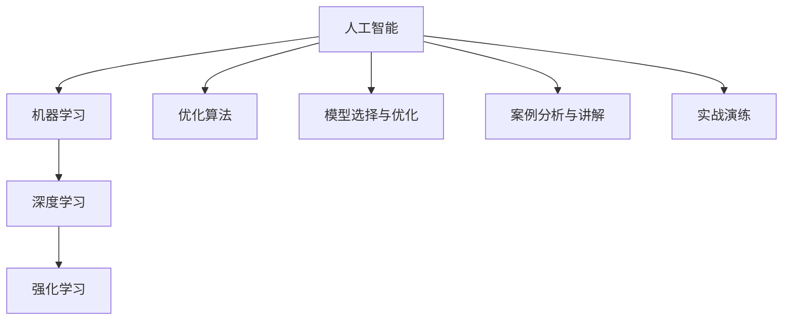

                 

# AI处理复杂问题的能力

> 关键词：人工智能,复杂问题解决,机器学习,深度学习,强化学习,优化算法,模型选择,案例分析,实战演练

## 1. 背景介绍

### 1.1 问题由来
随着科技的迅猛发展和人类社会的日趋复杂，越来越多的问题需要通过先进的技术手段来解决。尤其是在工业、农业、医学、金融、交通等领域，复杂问题的处理需求日益凸显。以往依赖人工经验的方法，难以满足日益增长的效率和精度要求，迫切需要引入新技术来支持复杂问题的解决。

### 1.2 问题核心关键点
1. **复杂问题的定义**：指那些传统方法难以有效解决，需要借助高科技手段，通过数据驱动的方式，实现自动化处理和决策的难题。
2. **人工智能的应用**：包括机器学习、深度学习、强化学习等算法，通过模型训练和优化，提升问题处理的自动化和智能化水平。
3. **算法选择与优化**：根据具体问题的特点，选择合适的算法模型，并结合实际情况，优化算法参数，提升模型性能。
4. **实际应用场景**：在智能制造、医疗诊断、金融预测、交通调度等多个领域，实际应用人工智能技术，处理复杂问题，提升系统效率和决策精度。
5. **技术创新与突破**：随着科技的不断进步，新的算法模型和技术手段不断涌现，推动人工智能技术在复杂问题处理中的持续创新和突破。

### 1.3 问题研究意义
研究AI处理复杂问题的能力，对于提升问题的解决效率，降低人工成本，推动技术进步和产业升级具有重要意义：

1. **提高问题解决效率**：AI技术能够自动化处理海量数据，快速识别关键信息和模式，提供高效解决方案。
2. **降低人工成本**：AI技术替代部分人工决策过程，降低人力成本，提升工作效率。
3. **推动技术进步**：AI技术的不断优化和创新，促进相关领域的技术进步和应用拓展。
4. **产业升级转型**：AI技术的应用，推动传统行业向智能化、自动化转型升级。
5. **应对未来挑战**：随着问题复杂度的增加，AI技术的先进性将直接影响未来的竞争力。

## 2. 核心概念与联系

### 2.1 核心概念概述

为了更好地理解AI处理复杂问题的能力，本节将介绍几个关键概念及其相互联系：

- **人工智能(AI)**：利用计算机技术模拟人类智能行为，包括感知、学习、推理、决策等能力。
- **机器学习(ML)**：一种基于数据驱动的算法，通过学习数据模式，预测未来结果，解决特定问题。
- **深度学习(DL)**：一种特殊类型的机器学习，通过构建多层神经网络模型，进行复杂特征提取和模式识别。
- **强化学习(RL)**：通过智能体与环境交互，不断学习最优策略，实现动态决策和行为优化。
- **优化算法**：用于调整模型参数，最小化损失函数，提升模型性能的一系列算法。
- **模型选择与优化**：根据具体问题，选择合适的模型架构和参数设置，并根据实际数据，不断优化模型。
- **案例分析与讲解**：通过具体案例，展示AI技术在复杂问题处理中的应用和效果。
- **实战演练**：提供实际编程示例，帮助读者深入理解AI技术在复杂问题处理中的具体实现方法。

### 2.2 核心概念原理和架构的 Mermaid 流程图(Mermaid 流程节点中不要有括号、逗号等特殊字符)



### 2.3 核心概念联系

这些核心概念之间的逻辑关系可以通过以下Mermaid流程图来展示：


## 3. 核心算法原理 & 具体操作步骤
### 3.1 算法原理概述

AI处理复杂问题的能力，核心在于构建高效的算法模型，并通过优化算法，提升模型性能。其中，机器学习、深度学习和强化学习是常用的算法框架，用于解决不同类型的复杂问题。

### 3.2 算法步骤详解

AI处理复杂问题的核心步骤如下：

1. **数据收集与预处理**：收集与问题相关的数据，并进行清洗、标注等预处理操作，为后续模型训练做准备。
2. **模型选择与设计**：根据问题的类型和数据特点，选择合适的算法模型，如回归模型、分类模型、神经网络等，并进行初步设计。
3. **模型训练与优化**：使用优化算法，对模型进行训练和参数优化，最小化损失函数，提升模型精度。
4. **模型评估与调参**：使用验证集对模型进行评估，根据性能指标，调整模型参数，提升模型泛化能力。
5. **模型部署与迭代**：将优化后的模型部署到实际应用场景，并根据反馈结果，进行模型迭代优化。

### 3.3 算法优缺点

AI处理复杂问题的算法具有以下优点：

- **自动化与高效性**：能够自动化处理大量数据，快速识别关键信息，提升问题解决效率。
- **泛化能力强**：通过训练，模型能够从已有数据中学习到规律，应用于类似的新问题。
- **适应性强**：可以根据具体问题的特点，灵活调整模型结构，适应不同的数据分布。

同时，这些算法也存在一定的局限性：

- **数据依赖性高**：需要大量高质量的数据进行训练，数据不足可能影响模型效果。
- **模型复杂度高**：深度学习和强化学习模型往往参数众多，训练和优化复杂度较高。
- **计算资源需求高**：复杂模型需要高性能计算资源，如GPU/TPU等，硬件成本较高。
- **解释性不足**：部分模型如深度学习模型，其决策过程缺乏可解释性，难以理解模型的内部逻辑。

### 3.4 算法应用领域

AI处理复杂问题的算法在多个领域都有广泛应用，例如：

1. **工业制造**：通过智能预测和优化调度，提升生产效率和产品质量。
2. **医疗诊断**：利用图像识别和自然语言处理技术，辅助医生进行疾病诊断和治疗方案选择。
3. **金融预测**：使用时间序列分析和深度学习模型，预测股市走势和风险。
4. **交通调度**：通过优化算法和智能预测，提高交通流量管理效率，减少拥堵。
5. **环境保护**：利用数据挖掘和机器学习技术，监测环境变化，预测自然灾害。
6. **电子商务**：通过推荐系统和预测模型，提升用户购物体验和销售效率。
7. **智能家居**：通过语音识别和智能控制，提升家居设备的自动化和智能化水平。

## 4. 数学模型和公式 & 详细讲解 & 举例说明（备注：数学公式请使用latex格式，latex嵌入文中独立段落使用 $$，段落内使用 $)

### 4.1 数学模型构建

构建AI处理复杂问题的数学模型，通常涉及以下几个关键部分：

- **输入数据**：表示为向量 $x \in \mathbb{R}^n$，包含所有相关特征。
- **输出数据**：表示为向量 $y \in \mathbb{R}^m$，表示问题解决的预期结果。
- **损失函数**：表示为 $L(\theta, x, y)$，用于衡量模型预测与真实结果之间的差异。
- **优化目标**：表示为 $\min_{\theta} L(\theta, x, y)$，通过最小化损失函数，提升模型性能。

### 4.2 公式推导过程

以线性回归模型为例，其数学模型和推导过程如下：

- **线性回归模型**：$y = \theta_0 + \theta_1 x_1 + \theta_2 x_2 + ... + \theta_n x_n$
- **损失函数**：$L(\theta) = \frac{1}{2N} \sum_{i=1}^{N} (y_i - \theta_0 - \theta_1 x_{i1} - ... - \theta_n x_{in})^2$
- **梯度下降算法**：$\theta_{j} = \theta_{j} - \alpha \frac{\partial L}{\partial \theta_{j}}$，其中 $\alpha$ 为学习率。

### 4.3 案例分析与讲解

线性回归模型常用于预测连续变量的值，例如房价预测。

假设我们要预测某小区的房价 $y$，已知该小区的面积 $x_1$、地理位置 $x_2$ 和周边学校评分 $x_3$ 等特征，可以使用线性回归模型建立预测模型：

- **模型构建**：$y = \theta_0 + \theta_1 x_1 + \theta_2 x_2 + \theta_3 x_3$
- **数据准备**：收集大量历史房价数据，并进行特征提取和标注。
- **模型训练**：使用随机梯度下降算法，对模型进行训练，最小化损失函数。
- **模型评估**：使用验证集评估模型预测精度，调整模型参数。
- **模型应用**：将优化后的模型部署到实际应用中，进行房价预测。

## 5. 项目实践：代码实例和详细解释说明
### 5.1 开发环境搭建

在进行AI处理复杂问题的项目实践前，我们需要准备好开发环境。以下是使用Python进行PyTorch开发的环境配置流程：

1. 安装Anaconda：从官网下载并安装Anaconda，用于创建独立的Python环境。

2. 创建并激活虚拟环境：
```bash
conda create -n pytorch-env python=3.8 
conda activate pytorch-env
```

3. 安装PyTorch：根据CUDA版本，从官网获取对应的安装命令。例如：
```bash
conda install pytorch torchvision torchaudio cudatoolkit=11.1 -c pytorch -c conda-forge
```

4. 安装TensorFlow：使用pip安装TensorFlow，选择CPU版本。

5. 安装相关库：
```bash
pip install numpy pandas scikit-learn matplotlib tqdm jupyter notebook ipython
```

完成上述步骤后，即可在`pytorch-env`环境中开始项目实践。

### 5.2 源代码详细实现

这里我们以房价预测为例，使用PyTorch实现线性回归模型。

首先，定义数据预处理函数：

```python
import numpy as np
import pandas as pd
from sklearn.model_selection import train_test_split
from sklearn.preprocessing import StandardScaler

def load_data(file_path):
    df = pd.read_csv(file_path)
    X = df.drop(['price'], axis=1)
    y = df['price']
    return X, y

def preprocess_data(X):
    X = StandardScaler().fit_transform(X)
    return X

def train_test_split_data(X, y, test_size=0.2, random_state=42):
    X_train, X_test, y_train, y_test = train_test_split(X, y, test_size=test_size, random_state=random_state)
    return X_train, X_test, y_train, y_test

X, y = load_data('housing.csv')
X_train, X_test, y_train, y_test = train_test_split_data(X, y, test_size=0.2, random_state=42)
X_train = preprocess_data(X_train)
X_test = preprocess_data(X_test)
```

然后，定义模型和优化器：

```python
import torch
import torch.nn as nn
import torch.optim as optim

class LinearRegressionModel(nn.Module):
    def __init__(self, input_size, output_size):
        super(LinearRegressionModel, self).__init__()
        self.linear = nn.Linear(input_size, output_size)

    def forward(self, x):
        return self.linear(x)

model = LinearRegressionModel(input_size=X_train.shape[1], output_size=1)
optimizer = optim.SGD(model.parameters(), lr=0.01)
```

接着，定义训练和评估函数：

```python
def train_model(model, X_train, y_train, X_test, y_test, num_epochs, batch_size, learning_rate):
    criterion = nn.MSELoss()
    for epoch in range(num_epochs):
        for i in range(0, len(X_train), batch_size):
            X_batch = X_train[i:i+batch_size]
            y_batch = y_train[i:i+batch_size]
            optimizer.zero_grad()
            outputs = model(X_batch)
            loss = criterion(outputs, y_batch)
            loss.backward()
            optimizer.step()
        print(f"Epoch {epoch+1}, loss: {loss.item()}")

    return model

def evaluate_model(model, X_test, y_test):
    with torch.no_grad():
        y_pred = model(X_test)
    mse = criterion(y_pred, y_test)
    rmse = np.sqrt(mse)
    return rmse
```

最后，启动训练流程并在测试集上评估：

```python
X_train = torch.from_numpy(X_train).float()
y_train = torch.from_numpy(y_train).float()
X_test = torch.from_numpy(X_test).float()
y_test = torch.from_numpy(y_test).float()

model = train_model(model, X_train, y_train, X_test, y_test, num_epochs=50, batch_size=64, learning_rate=0.01)

mse = evaluate_model(model, X_test, y_test)
rmse = np.sqrt(mse)
print(f"RMSE: {rmse:.2f}")
```

以上就是使用PyTorch实现房价预测的完整代码实现。可以看到，使用PyTorch进行AI处理复杂问题的项目实践，代码实现简洁高效。

### 5.3 代码解读与分析

让我们再详细解读一下关键代码的实现细节：

**load_data函数**：
- 用于加载数据集，并从CSV文件中读取特征和标签。
- 使用`pandas`库处理数据，使用`sklearn`库进行数据分割和标准化处理。

**preprocess_data函数**：
- 对特征数据进行标准化处理，将数据缩放到均值为0，方差为1的正态分布。

**train_test_split_data函数**：
- 使用`sklearn`库的`train_test_split`函数对数据进行划分，将数据集划分为训练集和测试集，并进行打乱。

**LinearRegressionModel类**：
- 定义线性回归模型，继承自`nn.Module`，包含一个线性层。

**train_model函数**：
- 定义训练函数，使用随机梯度下降算法，对模型进行训练，并打印训练过程中的损失值。

**evaluate_model函数**：
- 定义评估函数，使用均方误差损失函数计算模型在测试集上的表现，并计算RMSE指标。

**启动训练流程**：
- 加载数据集，并使用`preprocess_data`函数对数据进行标准化处理。
- 定义模型和优化器，并调用`train_model`函数进行训练。
- 调用`evaluate_model`函数评估模型在测试集上的表现，并输出RMSE指标。

可以看到，通过这些代码示例，读者可以迅速上手使用PyTorch进行复杂问题的处理，并理解其中的关键算法步骤。

## 6. 实际应用场景
### 6.1 智能制造

AI处理复杂问题的能力在智能制造领域具有广泛应用，例如：

- **设备故障预测**：利用时间序列分析和机器学习模型，预测设备故障，提前进行维护，避免生产停滞。
- **供应链优化**：通过优化算法和大数据分析，优化生产计划和物流调度，提升供应链效率。
- **质量检测**：使用图像识别和深度学习模型，检测产品质量缺陷，提升产品质量。

### 6.2 医疗诊断

AI处理复杂问题的能力在医疗诊断领域具有重要应用，例如：

- **疾病诊断**：利用图像识别和自然语言处理技术，辅助医生进行疾病诊断和治疗方案选择。
- **健康管理**：使用机器学习模型，监测患者健康数据，预测疾病发展趋势，进行早期干预。
- **新药研发**：利用数据挖掘和深度学习技术，分析药物效果和副作用，优化药物设计。

### 6.3 金融预测

AI处理复杂问题的能力在金融预测领域具有重要作用，例如：

- **股市预测**：使用时间序列分析和深度学习模型，预测股市走势和风险。
- **信用评分**：通过优化算法和大数据分析，评估用户信用风险，优化贷款审批流程。
- **欺诈检测**：利用异常检测和机器学习模型，识别交易中的异常行为，防止欺诈。

### 6.4 未来应用展望

随着AI技术的不断进步，未来在复杂问题处理中的应用前景更加广阔。例如：

- **自动驾驶**：通过AI技术，实现车辆自主导航和环境感知，提升交通安全性和效率。
- **智能客服**：利用自然语言处理和机器学习技术，实现智能对话系统，提升客户服务体验。
- **城市管理**：通过优化算法和数据挖掘，实现智能交通和城市规划，提升城市管理效率。

## 7. 工具和资源推荐
### 7.1 学习资源推荐

为了帮助开发者系统掌握AI处理复杂问题的能力，这里推荐一些优质的学习资源：

1. **机器学习入门**：
   - 《机器学习》书籍，由Tom Mitchell著，详细介绍了机器学习的理论基础和常见算法。
   - Coursera的《机器学习》课程，由Andrew Ng主讲，涵盖机器学习的基础和进阶内容。

2. **深度学习入门**：
   - 《深度学习》书籍，由Ian Goodfellow、Yoshua Bengio和Aaron Courville合著，全面介绍了深度学习的理论基础和实践技巧。
   - Udacity的《深度学习专项课程》，涵盖深度学习的基础和高级内容。

3. **强化学习入门**：
   - 《强化学习》书籍，由Richard Sutton和Andrew Barto合著，全面介绍了强化学习的理论基础和实践技巧。
   - DeepMind的《强化学习》课程，由David Silver主讲，涵盖强化学习的理论和实践。

4. **优化算法入门**：
   - 《最优化理论》书籍，由Hiri D.C. Maini和Neville P. O'Leary合著，介绍了优化算法的理论基础和实际应用。
   - Coursera的《优化与非线性规划》课程，由Stephan A. Villena主讲，涵盖优化算法的基本知识和应用。

5. **实战编程指南**：
   - 《Python深度学习实战》书籍，由Ganesh Kathiresan著，通过实际编程案例，介绍深度学习的实现方法和技巧。
   - PyTorch官方文档，提供了丰富的教程和示例，帮助读者掌握PyTorch的实际应用。

6. **论文资源推荐**：
   - Arxiv和Google Scholar，提供了丰富的机器学习和深度学习论文资源，是了解最新研究动态的好去处。

通过对这些资源的学习实践，相信读者可以系统掌握AI处理复杂问题的理论基础和实践技巧。

### 7.2 开发工具推荐

高效的开发离不开优秀的工具支持。以下是几款用于AI处理复杂问题开发的常用工具：

1. **Python**：广泛使用的高级编程语言，拥有丰富的第三方库和框架，适合进行机器学习、深度学习和优化算法的开发。
2. **PyTorch**：基于Python的开源深度学习框架，灵活的计算图机制和动态神经网络，适合进行复杂问题的处理。
3. **TensorFlow**：由Google主导开发的开源深度学习框架，适合大规模工程应用。
4. **Jupyter Notebook**：交互式编程环境，支持Python和R语言等编程语言，适合进行数据处理和模型训练。
5. **Google Colab**：免费的Jupyter Notebook环境，支持GPU和TPU计算，适合进行高性能计算。

合理利用这些工具，可以显著提升AI处理复杂问题的开发效率，加快创新迭代的步伐。

### 7.3 相关论文推荐

AI处理复杂问题的研究源于学界的持续研究。以下是几篇奠基性的相关论文，推荐阅读：

1. **深度学习**：
   - 《ImageNet Classification with Deep Convolutional Neural Networks》（AlexNet论文）：提出了深度卷积神经网络，展示了深度学习在图像分类任务上的优越性能。
   - 《Convolutional Neural Networks for Visual Recognition》（GoogLeNet论文）：提出了Inception模块，进一步提升了卷积神经网络在图像识别上的效果。
   - 《Deep Residual Learning for Image Recognition》（ResNet论文）：提出了残差网络，解决了深度神经网络训练过程中的梯度消失问题，提升了模型深度和性能。

2. **强化学习**：
   - 《Human-level Control through Deep Reinforcement Learning》（AlphaGo论文）：利用深度强化学习技术，开发了AlphaGo程序，在围棋比赛中击败了人类冠军。
   - 《Playing Atari with Deep Reinforcement Learning》（DQN论文）：利用深度Q网络，实现了在Atari游戏中的智能决策。
   - 《Dueling Network Architectures for Deep Reinforcement Learning》：提出了Dueling网络架构，提升了深度强化学习模型的性能和稳定性。

3. **优化算法**：
   - 《Gradient-Based Methods for Solving Large-Scale Optimization Problems》：由Nesterov著，全面介绍了各种优化算法，如梯度下降、牛顿法、共轭梯度法等。
   - 《Stochastic Gradient Descent Tricks》：由Bengio、Simard和Fraser合著，介绍了梯度下降算法的变体，如随机梯度下降、动量梯度下降等。
   - 《Adaptive Subgradient Methods for Online Learning and Stochastic Optimization》：由Duchi、Hazan和Wainwright合著，提出了Adagrad算法，并证明了其收敛性。

这些论文代表了AI处理复杂问题的研究前沿，通过学习这些经典研究成果，可以帮助研究者把握学科发展方向，激发更多的创新灵感。

## 8. 总结：未来发展趋势与挑战
### 8.1 总结

本文对AI处理复杂问题的能力进行了全面系统的介绍。首先阐述了复杂问题的定义、AI技术的应用及其在实际中的重要性，明确了AI技术在提升问题解决效率、降低人工成本等方面的价值。其次，从原理到实践，详细讲解了机器学习、深度学习和强化学习的基本算法，并给出了具体的代码实现。同时，本文还广泛探讨了AI技术在多个行业领域的应用前景，展示了AI技术的广阔应用空间。此外，本文精选了AI处理复杂问题的各类学习资源，力求为读者提供全方位的技术指引。

通过本文的系统梳理，可以看到，AI处理复杂问题的能力正在成为现代问题解决的重要手段，显著提升了问题的处理效率和决策精度。未来，随着AI技术的不断进步，将会在更多领域得到应用，为人类认知智能的进化带来深远影响。

### 8.2 未来发展趋势

展望未来，AI处理复杂问题的能力将呈现以下几个发展趋势：

1. **自动化与智能化程度提升**：AI技术将进一步提升自动化和智能化水平，解决更多复杂问题。
2. **跨领域融合发展**：AI技术将与大数据、物联网、区块链等技术深度融合，形成更强大的综合能力。
3. **应用场景更加广泛**：AI技术将在更多行业和领域得到应用，提升效率和决策精度。
4. **伦理道德与安全性**：随着AI技术的广泛应用，如何确保技术的伦理性和安全性，成为一个重要研究方向。
5. **量子计算与AI结合**：量子计算与AI技术的结合，将进一步提升AI处理复杂问题的能力。

以上趋势凸显了AI处理复杂问题的技术的广阔前景。这些方向的探索发展，必将进一步推动AI技术的进步和应用。

### 8.3 面临的挑战

尽管AI处理复杂问题的能力已经取得了显著成就，但在迈向更加智能化、普适化应用的过程中，仍面临诸多挑战：

1. **数据质量与数量**：需要高质量、大数量数据进行训练，但数据收集和标注成本较高。
2. **模型复杂性与资源需求**：深度学习模型参数众多，计算资源需求高，硬件成本较高。
3. **解释性与可解释性**：部分模型如深度学习模型，缺乏可解释性，难以理解模型的内部逻辑。
4. **安全与隐私问题**：AI模型在处理敏感数据时，可能存在隐私泄露和安全风险。
5. **伦理与道德问题**：AI模型在决策过程中可能存在偏见和歧视，影响模型公正性。

这些挑战需要研究者和开发者共同努力，不断改进AI技术，提升系统的稳定性和可靠性。

### 8.4 研究展望

未来，研究需要从以下几个方面寻求新的突破：

1. **数据增强与数据合成**：利用数据增强和数据合成技术，提升数据质量与数量，解决数据瓶颈问题。
2. **模型简化与优化**：开发更高效、更轻量级的模型架构，降低计算资源需求。
3. **模型可解释性**：研究可解释性强的模型架构和算法，提升模型的透明度和可理解性。
4. **隐私保护与安全机制**：设计隐私保护和数据安全机制，确保数据的机密性和安全性。
5. **公平性与伦理约束**：引入公平性约束和伦理导向的评估指标，确保AI技术的公平性和道德性。

这些研究方向将推动AI技术在复杂问题处理中的持续创新和突破，为构建安全、可靠、可解释、可控的智能系统铺平道路。面向未来，AI处理复杂问题的技术还需要与其他人工智能技术进行更深入的融合，如知识表示、因果推理、强化学习等，多路径协同发力，共同推动自然语言理解和智能交互系统的进步。只有勇于创新、敢于突破，才能不断拓展AI技术在复杂问题处理中的边界，让智能技术更好地造福人类社会。

## 9. 附录：常见问题与解答

**Q1：AI处理复杂问题的能力是否适用于所有领域？**

A: AI处理复杂问题的能力适用于大多数领域，但不同领域的问题复杂度和数据特点可能存在差异。例如，金融领域的数据通常需要高精度和高安全性，医疗领域的数据通常需要高可靠性和高隐私性。因此，需要根据具体问题，选择适合的AI技术进行优化。

**Q2：在实际应用中，如何选择适合的AI算法？**

A: 在选择AI算法时，需要考虑以下几个因素：
1. **问题类型**：不同类型的问题需要不同的算法，如回归问题适合线性回归，分类问题适合逻辑回归。
2. **数据特点**：数据的分布、规模、特征等影响算法的表现，需要根据数据特点选择算法。
3. **模型复杂度**：复杂度高的模型可能需要更多计算资源，需要根据实际环境选择合适模型。
4. **应用场景**：不同应用场景对算法的实时性、准确性、可解释性等有不同的要求，需要综合考虑。

**Q3：如何评估AI算法的性能？**

A: 评估AI算法的性能通常使用以下几个指标：
1. **准确率**：预测正确的样本数占总样本数的比例。
2. **精确率**：预测为正样本中真正为正样本的比例。
3. **召回率**：真正为正样本中预测为正样本的比例。
4. **F1值**：精确率和召回率的调和平均数，综合评估模型性能。
5. **ROC曲线**：以假正率（False Positive Rate）为横坐标，真正率（True Positive Rate）为纵坐标，评估模型在不同阈值下的表现。

**Q4：在实际应用中，如何提高AI算法的效率？**

A: 提高AI算法的效率可以通过以下几个方法：
1. **算法优化**：使用更高效的算法，如剪枝、量化等，减少模型复杂度。
2. **模型压缩**：通过模型压缩技术，如剪枝、量化等，减少模型大小和计算量。
3. **并行计算**：使用分布式计算和并行计算，提高计算效率。
4. **硬件加速**：使用GPU/TPU等高性能计算设备，加速模型推理和训练。
5. **数据增强**：通过数据增强技术，提高数据利用率，减少过拟合。

**Q5：AI处理复杂问题时，如何保护数据隐私与安全？**

A: 保护数据隐私与安全可以通过以下几个方法：
1. **数据加密**：对数据进行加密处理，防止数据泄露。
2. **差分隐私**：在数据处理过程中引入噪声，保护用户隐私。
3. **匿名化处理**：对数据进行匿名化处理，防止用户被识别。
4. **访问控制**：对数据进行严格的访问控制，防止未授权访问。
5. **安全机制**：设计安全机制，如安全多方计算等，确保数据安全。

这些方法可以帮助保护数据隐私与安全，确保AI技术在实际应用中的安全性。

---

作者：禅与计算机程序设计艺术 / Zen and the Art of Computer Programming

