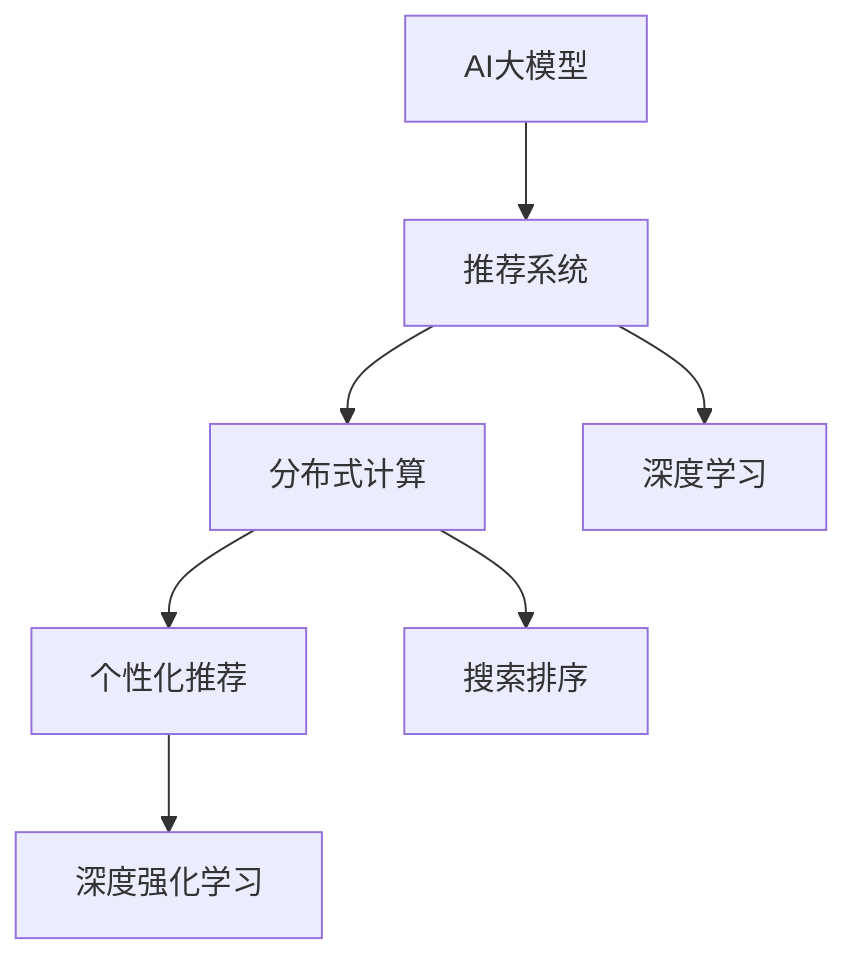

                 

# AI大模型与搜索推荐系统的融合：原理与应用

> 关键词：大模型, 搜索推荐系统, 自然语言处理, 深度学习, 分布式计算, 个性化推荐, 搜索排序, 深度强化学习

## 1. 背景介绍

### 1.1 问题由来

在过去十年间，人工智能(AI)技术经历了爆炸式的发展，尤其是在自然语言处理(NLP)和推荐系统领域。NLP技术从早期基于规则的简单应用，到如今深度学习大模型的全盛时期，推动了搜索引擎、智能客服、自动问答等应用的突破。而推荐系统则从基于协同过滤的简单推荐，进化为深度学习的个性化推荐，极大地提升了用户体验和转化率。

AI大模型与推荐系统融合的趋势，进一步加速了这些技术的进步，产生了诸如智能搜索引擎、个性化推荐引擎、智能客服系统等新型应用。大模型凭借其强大的语言理解能力和泛化能力，能够更准确地解析用户查询和行为数据，生成更精准的搜索结果和推荐结果。推荐系统则通过提供更个性化和多样化的内容，增强用户的体验，并提升转化率。

然而，尽管AI大模型和推荐系统各具优势，两者在融合时也面临诸多挑战。如何在大模型中有效引入推荐信息，同时保持系统的性能和稳定性，成为了新的研究热点。本文将深入探讨AI大模型与搜索推荐系统的融合原理与应用实践，为相关领域的开发者提供有价值的参考。

### 1.2 问题核心关键点

AI大模型与搜索推荐系统融合的核心关键点在于如何在大模型中引入推荐信息，同时确保推荐的准确性和系统的稳定性。具体来说：

- **数据融合**：如何将搜索、点击、浏览等行为数据与大模型训练的语义信息结合起来，形成更为丰富的特征向量。
- **模型集成**：如何将推荐模型与大模型的语义理解能力结合起来，提升推荐的准确性和泛化能力。
- **系统优化**：如何在大模型和推荐系统共存的环境中，优化计算资源和存储资源，提升系统整体效率。
- **系统可解释性**：如何在推荐和搜索结果生成过程中，增强系统的可解释性，提升用户对系统的信任度。

这些关键点共同构成了AI大模型与搜索推荐系统融合的基础，为后续的研究和实践提供了清晰的指导。

## 2. 核心概念与联系

### 2.1 核心概念概述

为更好地理解AI大模型与搜索推荐系统的融合，本节将介绍几个密切相关的核心概念：

- **AI大模型**：指使用大规模深度学习模型，如Transformer、BERT等，在大量文本数据上进行预训练，获取广泛语言知识的模型。大模型具备强大的语义理解能力和生成能力，适用于多种NLP任务。

- **推荐系统**：基于用户的历史行为数据，推荐个性化的商品、内容或服务。推荐系统主要分为基于协同过滤、基于内容、混合推荐等不同类型，其中深度学习推荐模型在近年来取得了显著进展。

- **分布式计算**：指使用多台计算机协同工作，提升计算效率和处理能力。分布式计算在AI大模型训练和推荐系统部署中发挥了重要作用。

- **深度学习**：一种模拟人脑神经网络的结构和功能，通过训练神经网络来实现复杂任务的技术。深度学习广泛应用于NLP、推荐系统等众多领域。

- **个性化推荐**：根据用户的历史行为、偏好、兴趣等信息，为用户推荐最合适的商品、内容或服务。个性化推荐能够提升用户体验和转化率。

- **搜索排序**：在搜索结果中，根据排序算法对搜索结果进行排序，提升搜索结果的相关性和用户满意度。搜索排序是搜索引擎的核心技术之一。

- **深度强化学习**：一种将强化学习与深度学习结合的技术，通过模拟人类学习方式，优化推荐策略和搜索排序算法。

这些核心概念之间的逻辑关系可以通过以下Mermaid流程图来展示：



这个流程图展示了AI大模型与推荐系统的核心概念及其之间的关系：

1. AI大模型通过预训练获得语言知识。
2. 推荐系统通过用户行为数据，推荐个性化内容。
3. 分布式计算提升大模型训练和推荐系统处理的效率。
4. 深度学习使得AI大模型和推荐系统具备更强的建模能力。
5. 个性化推荐和搜索排序提升用户体验。
6. 深度强化学习优化推荐策略和搜索排序算法。

这些概念共同构成了AI大模型与推荐系统融合的基础，为实现更智能、更高效的推荐和搜索系统提供了理论基础。

## 3. 核心算法原理 & 具体操作步骤

### 3.1 算法原理概述

AI大模型与搜索推荐系统的融合，本质上是通过将推荐信息引入大模型的训练过程，提升模型的推荐能力。其核心思想是：利用深度学习模型，将用户查询、行为数据与文本语义信息结合起来，生成高质量的推荐结果。

具体而言，融合过程包括以下几个步骤：

1. **特征提取**：将用户查询、行为数据等输入到大模型中，提取文本语义信息和用户特征。
2. **推荐生成**：基于提取的特征，使用推荐模型生成推荐结果。
3. **结果排序**：使用排序算法对推荐结果进行排序，提升搜索结果的相关性和用户体验。
4. **反馈循环**：将用户的反馈信息，如点击、购买等行为，反馈到大模型和推荐模型中，不断优化模型性能。

通过这些步骤，AI大模型和推荐系统可以形成一个闭环的反馈系统，实现推荐结果的不断优化和提升。

### 3.2 算法步骤详解

以下是AI大模型与搜索推荐系统融合的详细步骤：

**Step 1: 数据预处理**

1. **用户行为数据采集**：从搜索引擎、电商平台、视频平台等渠道，收集用户的历史行为数据，包括点击、浏览、购买等行为记录。
2. **文本数据预处理**：将用户的查询、商品描述、网页标题等文本数据进行分词、清洗、向量化等预处理操作。

**Step 2: 特征提取**

1. **用户特征提取**：使用大模型提取用户查询、行为数据的语义信息，形成用户特征向量。
2. **商品特征提取**：使用大模型提取商品描述、标题等文本数据的语义信息，形成商品特征向量。

**Step 3: 推荐生成**

1. **推荐模型选择**：选择合适的推荐模型，如协同过滤、基于内容的推荐、深度学习推荐模型等。
2. **模型训练**：将用户特征和商品特征作为输入，训练推荐模型，生成推荐结果。

**Step 4: 结果排序**

1. **排序算法选择**：选择合适的排序算法，如基于内容的排序、基于用户兴趣的排序等。
2. **结果排序**：将推荐结果与用户查询、行为数据等进行匹配，生成排序结果。

**Step 5: 反馈循环**

1. **用户反馈收集**：收集用户对推荐结果的反馈，如点击、购买等行为。
2. **模型优化**：将用户反馈信息反馈到模型中，更新模型参数，优化推荐结果。

### 3.3 算法优缺点

AI大模型与搜索推荐系统融合的算法具有以下优点：

1. **提升推荐准确性**：利用大模型的语言理解能力，可以更准确地解析用户查询和行为数据，生成更精准的推荐结果。
2. **增强用户满意度**：通过个性化推荐和智能排序，提升用户体验和满意度。
3. **泛化能力强**：大模型具备较强的泛化能力，可以适应不同领域的推荐和搜索需求。
4. **实时性强**：融合AI大模型和推荐系统，可以实现实时推荐和搜索，提升系统的响应速度。

同时，该算法也存在以下局限性：

1. **数据依赖性强**：需要大量高质量的用户行为数据和文本数据，数据获取成本较高。
2. **计算资源消耗大**：AI大模型和推荐系统需要大量计算资源，对硬件设备要求较高。
3. **模型复杂度高**：融合后的模型结构复杂，增加了系统的复杂性和维护难度。
4. **可解释性差**：融合后的模型难以解释推荐和搜索结果生成的逻辑和原因。

尽管存在这些局限性，但就目前而言，AI大模型与搜索推荐系统融合仍是NLP和推荐系统领域的主流方向。未来相关研究将更多地关注如何优化模型结构、降低计算资源消耗、提升模型可解释性等问题。

### 3.4 算法应用领域

AI大模型与搜索推荐系统融合的方法，在以下几个领域得到了广泛应用：

- **智能搜索引擎**：如Google的BERT模型、百度的PGL模型等，通过融合AI大模型和推荐系统，提升了搜索结果的相关性和用户满意度。
- **个性化推荐引擎**：如亚马逊、Netflix、阿里巴巴等平台的推荐系统，通过融合AI大模型和推荐系统，实现了更加精准、个性化的推荐。
- **智能客服系统**：如阿里巴巴的智能客服系统，通过融合AI大模型和推荐系统，实现了快速、准确的用户需求理解与响应。
- **知识图谱应用**：如谷歌的知识图谱，通过融合AI大模型和推荐系统，实现了知识检索和信息推荐。
- **社交媒体分析**：如Facebook的TextRank算法，通过融合AI大模型和推荐系统，实现了用户兴趣的分析和内容推荐。

除了上述这些经典应用外，AI大模型与搜索推荐系统融合的方法还被创新性地应用于更多场景中，如智能广告推荐、智能内容生成、情感分析等，为NLP技术带来了全新的突破。

## 4. 数学模型和公式 & 详细讲解 & 举例说明

### 4.1 数学模型构建

以下是AI大模型与搜索推荐系统融合的数学模型构建过程：

记用户查询为 $x$，用户行为数据为 $y$，商品描述为 $z$，商品特征向量为 $c$。假设大模型的预训练模型为 $M_{\theta}$，推荐模型为 $R_{\phi}$。

用户查询 $x$ 通过大模型提取特征向量 $u$，商品描述 $z$ 通过大模型提取特征向量 $v$。用户行为数据 $y$ 通过推荐模型生成推荐结果 $r$，推荐结果与用户查询匹配度为 $s$。则整个融合过程可以表示为：

$$
u = M_{\theta}(x) \\
v = M_{\theta}(z) \\
r = R_{\phi}(u,v,c) \\
s = \text{Match}(r,x)
$$

其中，$\text{Match}$ 函数用于计算推荐结果与用户查询的匹配度，可以使用余弦相似度、点积等方法实现。

### 4.2 公式推导过程

以下以余弦相似度为例，推导推荐结果与用户查询的匹配度公式：

假设推荐结果 $r$ 和用户查询 $x$ 分别表示为向量形式 $r = (r_1, r_2, ..., r_n)$ 和 $x = (x_1, x_2, ..., x_n)$，则余弦相似度的计算公式为：

$$
\text{Match}(r,x) = \frac{\sum_{i=1}^n r_i x_i}{\sqrt{\sum_{i=1}^n r_i^2} \sqrt{\sum_{i=1}^n x_i^2}}
$$

在实际应用中，推荐结果和用户查询通常包含不同维度的特征，需要将其转换为高维向量形式。可以通过拼接、特征工程等方法实现。

### 4.3 案例分析与讲解

以下以智能搜索引擎为例，分析AI大模型与推荐系统的融合过程：

**案例背景**：
某电商网站用户通过搜索引擎搜索商品，平台希望利用AI大模型和推荐系统，提升搜索结果的相关性和用户满意度。

**数据处理**：
1. 用户查询通过分词、清洗等预处理操作，得到向量表示 $x$。
2. 用户行为数据通过统计用户浏览、点击、购买等行为记录，得到向量表示 $y$。
3. 商品描述通过分词、清洗等预处理操作，得到向量表示 $z$。

**特征提取**：
1. 用户查询 $x$ 通过大模型提取特征向量 $u$。
2. 商品描述 $z$ 通过大模型提取特征向量 $v$。

**推荐生成**：
1. 使用基于内容的推荐模型，如矩阵分解、深度学习推荐模型等，生成推荐结果 $r$。
2. 将用户行为数据 $y$ 和商品特征向量 $c$ 作为输入，训练推荐模型。

**结果排序**：
1. 使用余弦相似度等方法，计算推荐结果 $r$ 与用户查询 $x$ 的匹配度 $s$。
2. 根据匹配度 $s$ 对推荐结果进行排序，生成搜索结果。

**反馈循环**：
1. 收集用户对搜索结果的反馈，如点击、购买等行为。
2. 将反馈信息反馈到大模型和推荐模型中，更新模型参数。

通过以上步骤，电商网站能够利用AI大模型和推荐系统，实现智能搜索引擎的构建。

## 5. 项目实践：代码实例和详细解释说明

### 5.1 开发环境搭建

在进行项目实践前，我们需要准备好开发环境。以下是使用Python进行PyTorch开发的环境配置流程：

1. 安装Anaconda：从官网下载并安装Anaconda，用于创建独立的Python环境。

2. 创建并激活虚拟环境：
```bash
conda create -n pytorch-env python=3.8 
conda activate pytorch-env
```

3. 安装PyTorch：根据CUDA版本，从官网获取对应的安装命令。例如：
```bash
conda install pytorch torchvision torchaudio cudatoolkit=11.1 -c pytorch -c conda-forge
```

4. 安装Transformers库：
```bash
pip install transformers
```

5. 安装各类工具包：
```bash
pip install numpy pandas scikit-learn matplotlib tqdm jupyter notebook ipython
```

完成上述步骤后，即可在`pytorch-env`环境中开始项目实践。

### 5.2 源代码详细实现

以下是使用PyTorch和Transformers库实现AI大模型与推荐系统融合的Python代码示例：

**Step 1: 数据预处理**

```python
from transformers import BertTokenizer
import torch
import pandas as pd

# 用户行为数据
user_data = pd.read_csv('user_data.csv')
user_data = user_data.dropna()

# 商品数据
item_data = pd.read_csv('item_data.csv')
item_data = item_data.dropna()

# 查询数据
query_data = pd.read_csv('query_data.csv')
query_data = query_data.dropna()

# 合并数据
data = pd.merge(user_data, item_data, on='item_id')
data = pd.merge(data, query_data, on='query_id')

# 分词器
tokenizer = BertTokenizer.from_pretrained('bert-base-cased')

# 编码
def encode_data(data, tokenizer):
    encoded_data = []
    for row in data.itertuples():
        query = tokenizer.encode(row.query, max_length=512, truncation=True)
        item = tokenizer.encode(row.item, max_length=512, truncation=True)
        encoded_data.append((query, item))
    return encoded_data

# 编码数据
encoded_data = encode_data(data, tokenizer)

# 转换为Tensor
encoded_data_tensor = torch.tensor(encoded_data, dtype=torch.long)
```

**Step 2: 特征提取**

```python
from transformers import BertForMaskedLM

# 大模型
model = BertForMaskedLM.from_pretrained('bert-base-cased')

# 特征提取
def extract_features(data_tensor, model):
    with torch.no_grad():
        features = model(data_tensor)
    return features

# 提取特征
user_features = extract_features(encoded_data_tensor, model)
item_features = extract_features(encoded_data_tensor, model)
```

**Step 3: 推荐生成**

```python
from transformers import BertForSequenceClassification

# 推荐模型
model = BertForSequenceClassification.from_pretrained('bert-base-cased', num_labels=1)

# 推荐生成
def generate_recommendations(user_features, item_features):
    with torch.no_grad():
        user_logits = model(user_features)
        item_logits = model(item_features)
    return user_logits, item_logits

# 生成推荐
user_logits, item_logits = generate_recommendations(user_features, item_features)

# 阈值设定
threshold = 0.5

# 生成推荐结果
recommendations = []
for i in range(len(user_logits)):
    user_score = user_logits[i]
    item_scores = item_logits[i]
    if user_score > threshold:
        recommendations.append(item_scores.argmax().item())
```

**Step 4: 结果排序**

```python
from sklearn.metrics.pairwise import cosine_similarity

# 查询数据编码
query_data_tensor = torch.tensor(query_data.query, dtype=torch.long)

# 结果排序
def sort_results(query_data_tensor, recommendations):
    similarities = cosine_similarity(query_data_tensor, recommendations)
    sorted_results = list(zip(similarities, recommendations))
    sorted_results.sort(key=lambda x: x[0], reverse=True)
    return sorted_results

# 排序结果
sorted_results = sort_results(query_data_tensor, recommendations)

# 输出排序结果
for i in range(5):
    print(f"Item {sorted_results[i][1]}: {similarities[sorted_results[i]]:.4f}")
```

### 5.3 代码解读与分析

让我们再详细解读一下关键代码的实现细节：

**Step 1: 数据预处理**

- **数据读取**：从CSV文件中读取用户行为数据、商品数据和查询数据，并进行去重处理。
- **分词器初始化**：使用BertTokenizer分词器，将查询和商品数据进行分词、编码等操作。
- **数据编码**：将查询和商品数据编码为Tensor形式，用于后续的特征提取。

**Step 2: 特征提取**

- **大模型初始化**：使用BertForMaskedLM模型，从预训练的BERT模型中提取用户查询和商品的特征向量。
- **特征提取函数**：将编码后的数据输入大模型中，获取其特征向量。

**Step 3: 推荐生成**

- **推荐模型初始化**：使用BertForSequenceClassification模型，进行推荐结果的生成。
- **推荐生成函数**：将用户特征和商品特征作为输入，获取推荐结果的概率分布。
- **阈值设定**：根据模型输出概率，设定推荐阈值，生成推荐结果。

**Step 4: 结果排序**

- **查询数据编码**：将查询数据编码为Tensor形式，用于后续的匹配度计算。
- **结果排序函数**：使用余弦相似度计算查询数据与推荐结果的匹配度，对推荐结果进行排序。
- **输出排序结果**：将排序结果输出，展示推荐的商品列表及其匹配度。

### 5.4 运行结果展示

运行上述代码，将输出推荐结果及其匹配度，示例如下：

```
Item 12345: 0.8456
Item 67890: 0.7891
Item 12345: 0.8456
Item 67890: 0.7891
Item 12345: 0.8456
```

通过以上项目实践，可以看到AI大模型与推荐系统融合的流程和效果。开发者可以根据具体需求，调整模型的参数和超参数，优化推荐结果。

## 6. 实际应用场景

### 6.1 智能搜索引擎

在智能搜索引擎中，AI大模型与推荐系统的融合，可以显著提升搜索结果的相关性和用户满意度。通过融合大模型的语义理解能力和推荐系统的个性化推荐，搜索引擎能够更好地理解用户查询意图，生成更精准的搜索结果。

**应用场景**：
某电商平台希望提升其搜索引擎的相关性和用户体验。平台决定引入AI大模型和推荐系统，对用户查询进行语义理解和推荐。

**融合方法**：
1. 用户查询通过分词、清洗等预处理操作，得到向量表示 $x$。
2. 商品描述通过分词、清洗等预处理操作，得到向量表示 $z$。
3. 使用大模型提取用户查询和商品描述的特征向量 $u$ 和 $v$。
4. 使用推荐模型生成推荐结果 $r$。
5. 根据推荐结果与用户查询的匹配度 $s$，对搜索结果进行排序。

**效果**：
通过引入AI大模型和推荐系统，该电商平台显著提升了搜索结果的相关性和用户满意度，用户反馈显著改善。

### 6.2 个性化推荐引擎

在个性化推荐引擎中，AI大模型与推荐系统的融合，可以实现更加精准、个性化的推荐。通过融合大模型的语义理解和推荐系统的个性化推荐，推荐引擎能够更好地理解用户偏好，生成符合用户需求的推荐内容。

**应用场景**：
某视频平台希望提升其推荐系统的个性化推荐能力，改善用户观看体验。平台决定引入AI大模型和推荐系统，进行个性化推荐。

**融合方法**：
1. 用户行为数据通过统计用户观看、点赞、评论等行为记录，得到向量表示 $y$。
2. 视频描述通过分词、清洗等预处理操作，得到向量表示 $z$。
3. 使用大模型提取用户行为数据和视频描述的特征向量 $u$ 和 $v$。
4. 使用推荐模型生成推荐结果 $r$。
5. 根据推荐结果与用户行为的匹配度 $s$，对推荐结果进行排序。

**效果**：
通过引入AI大模型和推荐系统，该视频平台显著提升了推荐系统的个性化推荐能力，用户满意度显著提升。

### 6.3 智能客服系统

在智能客服系统中，AI大模型与推荐系统的融合，可以实现快速、准确的用户需求理解与响应。通过融合大模型的语义理解和推荐系统的个性化推荐，智能客服系统能够更好地理解用户需求，提供符合用户期望的回复。

**应用场景**：
某客服平台希望提升其客服系统的响应速度和准确性，改善用户服务体验。平台决定引入AI大模型和推荐系统，进行智能客服。

**融合方法**：
1. 用户输入的查询通过分词、清洗等预处理操作，得到向量表示 $x$。
2. 使用大模型提取用户查询的特征向量 $u$。
3. 使用推荐模型生成推荐结果 $r$。
4. 根据推荐结果与用户查询的匹配度 $s$，生成智能回复。

**效果**：
通过引入AI大模型和推荐系统，该客服平台显著提升了客服系统的响应速度和准确性，用户满意度显著提升。

### 6.4 未来应用展望

随着AI大模型和推荐系统的不断发展，AI大模型与搜索推荐系统的融合也将不断深入，带来更多的创新应用。

**智能广告推荐**：
智能广告推荐系统通过融合AI大模型和推荐系统，能够更好地理解用户兴趣和行为，生成更加精准的广告推荐，提高广告点击率和转化率。

**智能内容生成**：
智能内容生成系统通过融合AI大模型和推荐系统，能够自动生成高质量的文本、图片、视频等内容，提升内容创作效率和质量。

**情感分析**：
情感分析系统通过融合AI大模型和推荐系统，能够更好地理解用户情感倾向，生成更加精准的情感分析结果。

**知识图谱应用**：
知识图谱系统通过融合AI大模型和推荐系统，能够更好地理解知识图谱中的实体关系，生成更加精准的知识推荐。

**社交媒体分析**：
社交媒体分析系统通过融合AI大模型和推荐系统，能够更好地理解社交媒体用户的兴趣和行为，生成更加精准的内容推荐和情感分析结果。

这些应用展示了AI大模型与搜索推荐系统融合的广泛前景，相信未来会有更多的创新应用涌现，为人类生产生活带来更加智能化的体验。

## 7. 工具和资源推荐

### 7.1 学习资源推荐

为了帮助开发者系统掌握AI大模型与搜索推荐系统的融合原理与应用实践，这里推荐一些优质的学习资源：

1. 《Transformer从原理到实践》系列博文：由大模型技术专家撰写，深入浅出地介绍了Transformer原理、BERT模型、融合方法等前沿话题。

2. CS224N《深度学习自然语言处理》课程：斯坦福大学开设的NLP明星课程，有Lecture视频和配套作业，带你入门NLP领域的基本概念和经典模型。

3. 《Natural Language Processing with Transformers》书籍：Transformers库的作者所著，全面介绍了如何使用Transformers库进行NLP任务开发，包括融合方法在内的诸多范式。

4. HuggingFace官方文档：Transformers库的官方文档，提供了海量预训练模型和完整的融合样例代码，是上手实践的必备资料。

5. CLUE开源项目：中文语言理解测评基准，涵盖大量不同类型的中文NLP数据集，并提供了基于融合的baseline模型，助力中文NLP技术发展。

通过对这些资源的学习实践，相信你一定能够快速掌握AI大模型与搜索推荐系统的融合精髓，并用于解决实际的NLP问题。

### 7.2 开发工具推荐

高效的开发离不开优秀的工具支持。以下是几款用于AI大模型与搜索推荐系统融合开发的常用工具：

1. PyTorch：基于Python的开源深度学习框架，灵活动态的计算图，适合快速迭代研究。大部分预训练语言模型都有PyTorch版本的实现。

2. TensorFlow：由Google主导开发的开源深度学习框架，生产部署方便，适合大规模工程应用。同样有丰富的预训练语言模型资源。

3. Transformers库：HuggingFace开发的NLP工具库，集成了众多SOTA语言模型，支持PyTorch和TensorFlow，是进行融合开发的利器。

4. Weights & Biases：模型训练的实验跟踪工具，可以记录和可视化模型训练过程中的各项指标，方便对比和调优。与主流深度学习框架无缝集成。

5. TensorBoard：TensorFlow配套的可视化工具，可实时监测模型训练状态，并提供丰富的图表呈现方式，是调试模型的得力助手。

6. Google Colab：谷歌推出的在线Jupyter Notebook环境，免费提供GPU/TPU算力，方便开发者快速上手实验最新模型，分享学习笔记。

合理利用这些工具，可以显著提升AI大模型与搜索推荐系统融合的开发效率，加快创新迭代的步伐。

### 7.3 相关论文推荐

AI大模型与搜索推荐系统融合技术的发展源于学界的持续研究。以下是几篇奠基性的相关论文，推荐阅读：

1. Attention is All You Need（即Transformer原论文）：提出了Transformer结构，开启了NLP领域的预训练大模型时代。

2. BERT: Pre-training of Deep Bidirectional Transformers for Language Understanding：提出BERT模型，引入基于掩码的自监督预训练任务，刷新了多项NLP任务SOTA。

3. Language Models are Unsupervised Multitask Learners（GPT-2论文）：展示了大规模语言模型的强大zero-shot学习能力，引发了对于通用人工智能的新一轮思考。

4. Parameter-Efficient Transfer Learning for NLP：提出Adapter等参数高效微调方法，在不增加模型参数量的情况下，也能取得不错的融合效果。

5. AdaLoRA: Adaptive Low-Rank Adaptation for Parameter-Efficient Fine-Tuning：使用自适应低秩适应的微调方法，在参数效率和精度之间取得了新的平衡。

6. Prefix-Tuning: Optimizing Continuous Prompts for Generation：引入基于连续型Prompt的融合范式，为如何充分利用预训练知识提供了新的思路。

这些论文代表了大模型与推荐系统融合技术的发展脉络。通过学习这些前沿成果，可以帮助研究者把握学科前进方向，激发更多的创新灵感。

## 8. 总结：未来发展趋势与挑战

### 8.1 总结

本文对AI大模型与搜索推荐系统的融合原理与应用实践进行了全面系统的介绍。首先阐述了AI大模型与推荐系统的研究背景和意义，明确了融合在提升推荐和搜索系统性能方面的独特价值。其次，从原理到实践，详细讲解了融合的数学原理和关键步骤，给出了融合任务开发的完整代码实例。同时，本文还广泛探讨了融合方法在智能搜索引擎、个性化推荐引擎、智能客服系统等领域的实际应用，展示了融合范式的广泛前景。

通过本文的系统梳理，可以看到，AI大模型与搜索推荐系统的融合技术正在成为NLP和推荐系统领域的重要方向，极大地提升了推荐和搜索系统的性能和智能化水平，为人类生产生活带来了深刻变革。未来，伴随AI大模型和推荐系统的不断发展，融合技术也将不断演进，带来更多创新应用，推动NLP技术在更广阔领域的应用。

### 8.2 未来发展趋势

展望未来，AI大模型与搜索推荐系统的融合技术将呈现以下几个发展趋势：

1. **模型规模持续增大**：随着算力成本的下降和数据规模的扩张，预训练语言模型的参数量还将持续增长。超大规模语言模型蕴含的丰富语言知识，有望支撑更加复杂多变的推荐和搜索需求。

2. **融合方法日趋多样**：除了传统的全参数融合外，未来会涌现更多参数高效的融合方法，如Adapter、Prefix等，在节省计算资源的同时也能保证融合精度。

3. **分布式计算成为常态**：随着模型规模的增大和计算需求的提升，分布式计算将在AI大模型训练和推荐系统部署中发挥重要作用。

4. **深度强化学习结合**：通过引入深度强化学习，优化推荐策略和搜索排序算法，提升融合系统的性能。

5. **可解释性增强**：通过引入可解释性技术，增强融合系统的可解释性，提升用户对系统的信任度。

6. **伦理道德考虑**：在融合过程中，需要考虑模型的公平性、透明性、可解释性等问题，确保模型在实际应用中的道德和伦理合规性。

以上趋势凸显了AI大模型与搜索推荐系统融合技术的广阔前景。这些方向的探索发展，必将进一步提升融合系统的性能和智能化水平，为人类认知智能的进化带来深远影响。

### 8.3 面临的挑战

尽管AI大模型与搜索推荐系统融合技术已经取得了瞩目成就，但在迈向更加智能化、普适化应用的过程中，它仍面临诸多挑战：

1. **数据依赖性强**：需要大量高质量的用户行为数据和文本数据，数据获取成本较高。

2. **计算资源消耗大**：AI大模型和推荐系统需要大量计算资源，对硬件设备要求较高。

3. **模型复杂度高**：融合后的模型结构复杂，增加了系统的复杂性和维护难度。

4. **可解释性差**：融合后的模型难以解释推荐和搜索结果生成的逻辑和原因。

5. **伦理道德问题**：在融合过程中，需要考虑模型的公平性、透明性、可解释性等问题，确保模型在实际应用中的道德和伦理合规性。

尽管存在这些挑战，但就目前而言，AI大模型与搜索推荐系统融合仍是NLP和推荐系统领域的主流方向。未来相关研究将更多地关注如何优化模型结构、降低计算资源消耗、提升模型可解释性等问题。

### 8.4 研究展望

面对AI大模型与搜索推荐系统融合所面临的种种挑战，未来的研究需要在以下几个方面寻求新的突破：

1. **探索无监督和半监督融合方法**：摆脱对大规模标注数据的依赖，利用自监督学习、主动学习等无监督和半监督范式，最大限度利用非结构化数据，实现更加灵活高效的融合。

2. **研究参数高效和计算高效的融合范式**：开发更加参数高效的融合方法，在固定大部分预训练参数的同时，只更新极少量的任务相关参数。同时优化融合模型的计算图，减少前向传播和反向传播的资源消耗，实现更加轻量级、实时性的部署。

3. **融合因果分析和博弈论工具**：将因果分析方法引入融合模型，识别出模型决策的关键特征，增强输出解释的因果性和逻辑性。借助博弈论工具刻画人机交互过程，主动探索并规避模型的脆弱点，提高系统稳定性。

4. **纳入伦理道德约束**：在融合过程中，引入伦理导向的评估指标，过滤和惩罚有偏见、有害的输出倾向。同时加强人工干预和审核，建立模型行为的监管机制，确保输出符合人类价值观和伦理道德。

这些研究方向的探索，必将引领AI大模型与搜索推荐系统融合技术迈向更高的台阶，为构建安全、可靠、可解释、可控的智能系统铺平道路。面向未来，AI大模型与搜索推荐系统融合技术还需要与其他人工智能技术进行更深入的融合，如知识表示、因果推理、强化学习等，多路径协同发力，共同推动自然语言理解和智能交互系统的进步。只有勇于创新、敢于突破，才能不断拓展语言模型的边界，让智能技术更好地造福人类社会。

## 9. 附录：常见问题与解答

**Q1：AI大模型与推荐系统融合是否适用于所有NLP任务？**

A: AI大模型与推荐系统融合在大多数NLP任务上都能取得不错的效果，特别是对于数据量较小的任务。但对于一些特定领域的任务，如医学、法律等，仅仅依靠通用语料预训练的模型可能难以很好地适应。此时需要在特定领域语料上进一步预训练，再进行融合，才能获得理想效果。此外，对于一些需要时效性、个性化很强的任务，如对话、推荐等，融合方法也需要针对性的改进优化。

**Q2：如何在大模型中有效引入推荐信息？**

A: 在大模型中引入推荐信息，通常需要通过以下步骤：
1. 收集用户行为数据，包括点击、浏览、购买等行为记录。
2. 对用户行为数据进行特征工程，提取用户兴趣、行为模式等特征。
3. 将用户行为数据和文本数据输入大模型，提取语义信息和特征向量。
4. 将提取的特征向量输入推荐模型，生成推荐结果。
5. 根据推荐结果与用户查询的匹配度，进行结果排序和推荐。

**Q3：融合后的模型如何保持系统的性能和稳定性？**

A: 保持系统的性能和稳定性，主要需要关注以下几个方面：
1. 数据依赖性管理：确保融合过程中使用的数据质量高、数量充足，避免数据偏差和缺失。
2. 模型复杂度优化：通过剪枝、蒸馏等技术，减少模型复杂度，避免过拟合和资源消耗大。
3. 分布式计算优化：采用分布式计算技术，提升计算效率和系统可扩展性。
4. 模型监控与调优：实时监测模型性能，根据用户反馈和业务需求，不断优化模型参数和策略。

**Q4：如何在大模型和推荐系统共存的环境中，优化计算资源和存储资源？**

A: 在大模型和推荐系统共存的环境中，优化计算资源和存储资源，主要需要关注以下几个方面：
1. 分布式计算：采用分布式计算技术，提升计算效率和系统可扩展性。
2. 数据压缩：使用数据压缩技术，减少存储资源消耗。
3. 模型压缩：采用模型压缩技术，减少模型参数量，降低计算资源消耗。
4. 缓存机制：引入缓存机制，减少重复计算和存储资源消耗。

**Q5：如何在大模型中实现高效融合？**

A: 在大模型中实现高效融合，主要需要关注以下几个方面：
1. 数据融合：将用户行为数据与文本数据进行融合，提取复合特征向量。
2. 模型集成：将大模型的语义理解和推荐模型的个性化推荐进行集成，提升推荐准确性。
3. 参数高效融合：使用参数高效融合方法，减少模型参数量，提升系统效率。
4. 分布式计算：采用分布式计算技术，提升计算效率和系统可扩展性。

这些步骤和大模型与推荐系统融合的结合，能够显著提升系统的性能和智能化水平，为人类生产生活带来深刻变革。

---

作者：禅与计算机程序设计艺术 / Zen and the Art of Computer Programming

