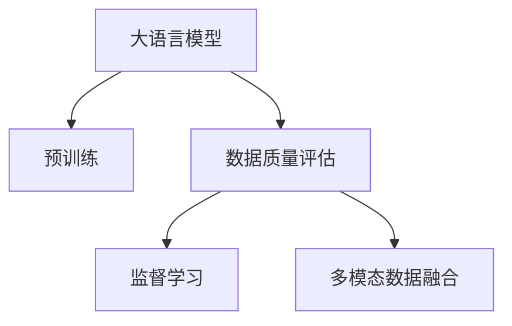

                 

# AI大模型助力电商搜索推荐业务的数据质量评估模型优化实践

> 关键词：大语言模型,电商搜索推荐,数据质量评估,优化实践

## 1. 背景介绍

### 1.1 问题由来
在电商平台搜索推荐系统中，数据质量的高低直接关系到推荐的精准度和用户满意度。数据质量评估（Data Quality Assessment）模型是确保推荐系统高效运行的关键。然而，随着电商平台业务的快速扩张和数据量的不断增长，数据质量评估模型的设计和优化面临着巨大的挑战。传统的规则模型和人工标注方法难以满足复杂多变的业务场景和数据需求。

近年来，随着大语言模型（Large Language Model, LLM）在自然语言处理（Natural Language Processing, NLP）领域的突破性进展，其被广泛应用于电商搜索推荐系统中的数据质量评估。利用大语言模型强大的文本理解能力，可以从自然语言描述中直接评估数据质量，省去了繁琐的手动标注和规则编写过程。

### 1.2 问题核心关键点
基于大语言模型的数据质量评估模型，本质上是一种基于监督学习的数据质量检测方法。其核心在于如何构建高质量的训练数据集，设计有效的评估指标，并选择合适的模型架构进行优化。大语言模型通过学习大量的自然语言描述，可以从语义和上下文关系中识别出数据质量问题，如数据错误、信息遗漏、格式不一致等，为电商搜索推荐系统提供高质量的数据评估服务。

### 1.3 问题研究意义
研究大语言模型在电商搜索推荐业务中的应用，对于提升推荐系统的数据质量和用户体验具有重要意义：

1. **减少人工标注成本**：利用大模型自动进行数据质量评估，能够大幅减少人工标注成本，提升标注效率。
2. **提高数据质量**：通过自动化的数据质量检测，及时发现并修正数据质量问题，保障数据的一致性和准确性。
3. **增强推荐系统稳定性**：高质量的数据是推荐系统高效运行的基础，大语言模型能够提供及时的数据质量反馈，确保推荐算法的稳定性。
4. **拓展应用场景**：大语言模型在电商搜索推荐中的应用，为更多的业务场景提供了可行的技术方案，推动电商平台业务创新。

## 2. 核心概念与联系

### 2.1 核心概念概述

为更好地理解基于大语言模型的电商搜索推荐数据质量评估模型，本节将介绍几个密切相关的核心概念：

- **大语言模型（LLM）**：指预训练在大量无标签文本数据上，能够理解和生成自然语言的深度学习模型。如GPT、BERT等。
- **预训练（Pre-training）**：指在大规模无标签文本数据上，通过自监督学习任务训练通用语言模型的过程。
- **数据质量评估（Data Quality Assessment）**：指评估数据集的准确性、完整性、一致性、及时性和合法性等指标的过程。
- **监督学习（Supervised Learning）**：指通过标注数据集训练模型，使其能够对未知数据进行预测或分类的方法。
- **多模态数据融合（Multi-modal Data Fusion）**：指将文本、图像、音频等多源数据进行综合分析，以提升数据评估的全面性和准确性。

这些核心概念之间的逻辑关系可以通过以下Mermaid流程图来展示：



这个流程图展示了大语言模型的核心概念及其之间的关系：

1. 大语言模型通过预训练获得基础能力。
2. 数据质量评估模型通过监督学习对预训练模型进行微调，获得针对特定任务优化的模型。
3. 多模态数据融合技术进一步提升评估模型的全面性和准确性。

## 3. 核心算法原理 & 具体操作步骤
### 3.1 算法原理概述

基于大语言模型的电商搜索推荐数据质量评估模型，其核心思想是利用大语言模型的自然语言处理能力，从文本描述中直接评估数据质量。通过预训练模型对大量自然语言描述进行学习，模型能够识别出数据质量的常见问题，如数据错误、格式不一致、信息遗漏等。

具体来说，大语言模型通过学习一组标注数据集，其中每个样本包含一个数据样本及其对应的质量描述。在微调过程中，模型通过匹配输入描述与输出结果，优化模型的预测能力，使其能够准确地对数据质量进行判断。

### 3.2 算法步骤详解

基于大语言模型的电商搜索推荐数据质量评估模型一般包括以下几个关键步骤：

**Step 1: 准备数据集**

- **数据集收集**：从电商平台的业务数据中，收集有代表性的数据样本和对应的质量描述。
- **数据预处理**：对数据进行清洗、归一化、格式转换等预处理操作，确保数据的一致性和准确性。
- **数据标注**：邀请专家或自动标注工具对数据集进行标注，生成标注数据集。

**Step 2: 模型选择与训练**

- **模型选择**：选择合适的预训练模型，如GPT-3、BERT等。
- **微调训练**：使用标注数据集对预训练模型进行微调训练，生成数据质量评估模型。

**Step 3: 评估与优化**

- **评估模型性能**：使用测试集对微调后的模型进行评估，计算模型的准确率、召回率等指标。
- **模型优化**：根据评估结果，调整模型的超参数，如学习率、批量大小、迭代次数等，以进一步提升模型性能。

**Step 4: 部署与应用**

- **模型部署**：将训练好的模型部署到电商搜索推荐系统中，实时评估新数据的质量。
- **业务集成**：将数据质量评估结果反馈给推荐系统，用于优化推荐策略，提升推荐质量。

### 3.3 算法优缺点

基于大语言模型的电商搜索推荐数据质量评估模型具有以下优点：

1. **自动化标注**：利用大模型自动进行数据质量评估，大幅减少人工标注成本。
2. **全面性**：大模型能够从语义和上下文关系中识别数据质量的多种问题，评估结果更为全面。
3. **鲁棒性**：大模型的泛化能力较强，能够在不同数据分布下保持稳定性能。
4. **可扩展性**：随着更多数据和业务场景的积累，可以持续训练和优化模型，提升评估能力。

同时，该模型也存在一定的局限性：

1. **数据依赖**：模型性能高度依赖标注数据的质量，标注数据的不足可能导致评估结果偏差。
2. **资源消耗**：训练和推理大模型需要较高的计算资源和时间成本，资源消耗较大。
3. **模型可解释性**：大模型的决策过程较为复杂，难以解释其内部工作机制。
4. **鲁棒性有待提高**：面对极端异常数据或噪声干扰，模型可能产生误判。

尽管存在这些局限性，但就目前而言，基于大语言模型的数据质量评估方法仍是大规模电商推荐系统中应用的主流范式。未来相关研究的重点在于如何进一步降低对标注数据的依赖，提高模型的鲁棒性和可解释性，同时兼顾计算效率。

### 3.4 算法应用领域

基于大语言模型的电商搜索推荐数据质量评估模型，在电商搜索推荐系统中的应用场景包括：

1. **商品数据质量评估**：对商品信息、价格、描述等数据进行质量评估，确保数据的准确性和一致性。
2. **用户行为数据质量评估**：对用户点击、浏览、购买等行为数据进行质量评估，识别异常行为或数据遗漏。
3. **评价评论数据质量评估**：对用户评价和评论数据进行质量评估，检测垃圾信息、恶意评论等。
4. **广告数据质量评估**：对广告素材和关键词进行质量评估，确保广告投放效果和用户体验。
5. **库存数据质量评估**：对库存数据进行质量评估，避免库存数据的错误和遗漏，保障供应链稳定性。

除了上述这些经典应用场景外，大语言模型数据质量评估模型还在实时监控、异常检测、数据清洗等更多电商业务场景中得到广泛应用，为电商推荐系统提供了高质量的数据保障。

## 4. 数学模型和公式 & 详细讲解 & 举例说明（备注：数学公式请使用latex格式，latex嵌入文中独立段落使用 $$，段落内使用 $)
### 4.1 数学模型构建

我们定义数据质量评估模型 $M_{\theta}$，其中 $\theta$ 为模型参数。假设标注数据集为 $D=\{(x_i,y_i)\}_{i=1}^N$，其中 $x_i$ 为数据样本，$y_i$ 为对应的质量标注。模型的目标是最小化预测结果与真实标签之间的损失函数，即：

$$
\mathcal{L}(\theta) = -\frac{1}{N}\sum_{i=1}^N \log p(y_i|x_i;M_{\theta})
$$

其中 $p(y_i|x_i;M_{\theta})$ 表示模型在输入数据 $x_i$ 上的预测概率分布，$y_i$ 为真实标签。

### 4.2 公式推导过程

假设模型 $M_{\theta}$ 为Transformer结构，其预测输出为 $M_{\theta}(x_i)$，则对数似然损失函数可以表示为：

$$
\mathcal{L}(\theta) = -\frac{1}{N}\sum_{i=1}^N \log \left( \frac{e^{M_{\theta}(x_i)[y_i]}}{\sum_{j=1}^K e^{M_{\theta}(x_i)[j]}} \right)
$$

其中 $K$ 为标注类别数，$M_{\theta}(x_i)[j]$ 表示模型在输入数据 $x_i$ 上对类别 $j$ 的预测概率。

在反向传播过程中，损失函数对模型参数 $\theta$ 的梯度可以表示为：

$$
\nabla_{\theta}\mathcal{L}(\theta) = -\frac{1}{N}\sum_{i=1}^N \left( p(y_i|x_i;M_{\theta}) - y_i \right) \nabla_{\theta}M_{\theta}(x_i)
$$

其中 $\nabla_{\theta}M_{\theta}(x_i)$ 为模型在输入数据 $x_i$ 上的梯度。

### 4.3 案例分析与讲解

以电商商品数据质量评估为例，假设标注数据集为 $D=\{(x_i,y_i)\}_{i=1}^N$，其中 $x_i$ 为商品信息，$y_i$ 为对应的质量标签，分为质量优良、质量一般、质量差三种类别。模型 $M_{\theta}$ 为预训练的BERT模型，通过微调生成数据质量评估模型。

对于每个样本 $(x_i,y_i)$，模型通过Transformer结构计算出其预测概率分布 $p(y_i|x_i;M_{\theta})$，然后计算对数似然损失 $\mathcal{L}(\theta)$。在反向传播过程中，利用梯度下降等优化算法更新模型参数 $\theta$，最小化损失函数 $\mathcal{L}(\theta)$。

通过大量的标注数据训练，模型能够学习到数据质量问题的特征，并在新数据上进行评估。例如，对于商品描述中包含的错别字、格式不一致、信息遗漏等问题，模型能够识别并给出相应的质量评估结果。

## 5. 项目实践：代码实例和详细解释说明
### 5.1 开发环境搭建

在进行大语言模型电商搜索推荐数据质量评估模型开发前，我们需要准备好开发环境。以下是使用Python进行PyTorch开发的环境配置流程：

1. 安装Anaconda：从官网下载并安装Anaconda，用于创建独立的Python环境。

2. 创建并激活虚拟环境：
```bash
conda create -n pytorch-env python=3.8 
conda activate pytorch-env
```

3. 安装PyTorch：根据CUDA版本，从官网获取对应的安装命令。例如：
```bash
conda install pytorch torchvision torchaudio cudatoolkit=11.1 -c pytorch -c conda-forge
```

4. 安装Transformers库：
```bash
pip install transformers
```

5. 安装各类工具包：
```bash
pip install numpy pandas scikit-learn matplotlib tqdm jupyter notebook ipython
```

完成上述步骤后，即可在`pytorch-env`环境中开始开发实践。

### 5.2 源代码详细实现

下面我们以商品数据质量评估任务为例，给出使用Transformers库对BERT模型进行电商搜索推荐数据质量评估的PyTorch代码实现。

首先，定义数据处理函数：

```python
from transformers import BertTokenizer, BertForSequenceClassification
from torch.utils.data import Dataset, DataLoader
import torch

class QualityDataset(Dataset):
    def __init__(self, texts, labels, tokenizer, max_len=128):
        self.texts = texts
        self.labels = labels
        self.tokenizer = tokenizer
        self.max_len = max_len
        
    def __len__(self):
        return len(self.texts)
    
    def __getitem__(self, item):
        text = self.texts[item]
        label = self.labels[item]
        
        encoding = self.tokenizer(text, return_tensors='pt', max_length=self.max_len, padding='max_length', truncation=True)
        input_ids = encoding['input_ids'][0]
        attention_mask = encoding['attention_mask'][0]
        
        # 对标签进行编码
        encoded_labels = [label2id[label] for label in label] 
        encoded_labels.extend([label2id['O']] * (self.max_len - len(encoded_labels)))
        labels = torch.tensor(encoded_labels, dtype=torch.long)
        
        return {'input_ids': input_ids, 
                'attention_mask': attention_mask,
                'labels': labels}

# 标签与id的映射
label2id = {'优良': 0, '一般': 1, '差': 2}
id2label = {v: k for k, v in label2id.items()}

# 创建dataset
tokenizer = BertTokenizer.from_pretrained('bert-base-cased')

train_dataset = QualityDataset(train_texts, train_labels, tokenizer)
dev_dataset = QualityDataset(dev_texts, dev_labels, tokenizer)
test_dataset = QualityDataset(test_texts, test_labels, tokenizer)
```

然后，定义模型和优化器：

```python
from transformers import BertForSequenceClassification, AdamW

model = BertForSequenceClassification.from_pretrained('bert-base-cased', num_labels=len(label2id))

optimizer = AdamW(model.parameters(), lr=2e-5)
```

接着，定义训练和评估函数：

```python
from torch.utils.data import DataLoader
from tqdm import tqdm
from sklearn.metrics import classification_report

device = torch.device('cuda') if torch.cuda.is_available() else torch.device('cpu')
model.to(device)

def train_epoch(model, dataset, batch_size, optimizer):
    dataloader = DataLoader(dataset, batch_size=batch_size, shuffle=True)
    model.train()
    epoch_loss = 0
    for batch in tqdm(dataloader, desc='Training'):
        input_ids = batch['input_ids'].to(device)
        attention_mask = batch['attention_mask'].to(device)
        labels = batch['labels'].to(device)
        model.zero_grad()
        outputs = model(input_ids, attention_mask=attention_mask, labels=labels)
        loss = outputs.loss
        epoch_loss += loss.item()
        loss.backward()
        optimizer.step()
    return epoch_loss / len(dataloader)

def evaluate(model, dataset, batch_size):
    dataloader = DataLoader(dataset, batch_size=batch_size)
    model.eval()
    preds, labels = [], []
    with torch.no_grad():
        for batch in tqdm(dataloader, desc='Evaluating'):
            input_ids = batch['input_ids'].to(device)
            attention_mask = batch['attention_mask'].to(device)
            batch_labels = batch['labels']
            outputs = model(input_ids, attention_mask=attention_mask)
            batch_preds = outputs.logits.argmax(dim=2).to('cpu').tolist()
            batch_labels = batch_labels.to('cpu').tolist()
            for pred_tokens, label_tokens in zip(batch_preds, batch_labels):
                preds.append(pred_tokens[:len(label_tokens)])
                labels.append(label_tokens)
                
    print(classification_report(labels, preds))
```

最后，启动训练流程并在测试集上评估：

```python
epochs = 5
batch_size = 16

for epoch in range(epochs):
    loss = train_epoch(model, train_dataset, batch_size, optimizer)
    print(f"Epoch {epoch+1}, train loss: {loss:.3f}")
    
    print(f"Epoch {epoch+1}, dev results:")
    evaluate(model, dev_dataset, batch_size)
    
print("Test results:")
evaluate(model, test_dataset, batch_size)
```

以上就是使用PyTorch对BERT进行电商搜索推荐数据质量评估任务微调的完整代码实现。可以看到，得益于Transformers库的强大封装，我们可以用相对简洁的代码完成BERT模型的加载和微调。

### 5.3 代码解读与分析

让我们再详细解读一下关键代码的实现细节：

**QualityDataset类**：
- `__init__`方法：初始化文本、标签、分词器等关键组件。
- `__len__`方法：返回数据集的样本数量。
- `__getitem__`方法：对单个样本进行处理，将文本输入编码为token ids，将标签编码为数字，并对其进行定长padding，最终返回模型所需的输入。

**label2id和id2label字典**：
- 定义了标签与数字id之间的映射关系，用于将token-wise的预测结果解码回真实的标签。

**训练和评估函数**：
- 使用PyTorch的DataLoader对数据集进行批次化加载，供模型训练和推理使用。
- 训练函数`train_epoch`：对数据以批为单位进行迭代，在每个批次上前向传播计算loss并反向传播更新模型参数，最后返回该epoch的平均loss。
- 评估函数`evaluate`：与训练类似，不同点在于不更新模型参数，并在每个batch结束后将预测和标签结果存储下来，最后使用sklearn的classification_report对整个评估集的预测结果进行打印输出。

**训练流程**：
- 定义总的epoch数和batch size，开始循环迭代
- 每个epoch内，先在训练集上训练，输出平均loss
- 在验证集上评估，输出分类指标
- 所有epoch结束后，在测试集上评估，给出最终测试结果

可以看到，PyTorch配合Transformers库使得BERT微调的代码实现变得简洁高效。开发者可以将更多精力放在数据处理、模型改进等高层逻辑上，而不必过多关注底层的实现细节。

当然，工业级的系统实现还需考虑更多因素，如模型的保存和部署、超参数的自动搜索、更灵活的任务适配层等。但核心的微调范式基本与此类似。

## 6. 实际应用场景
### 6.1 智能客服系统

基于大语言模型的电商搜索推荐数据质量评估模型，可以广泛应用于智能客服系统的构建。传统客服往往需要配备大量人力，高峰期响应缓慢，且一致性和专业性难以保证。而使用基于大语言模型的数据质量评估模型，可以7x24小时不间断服务，快速响应客户咨询，用自然流畅的语言解答各类常见问题。

在技术实现上，可以收集企业内部的历史客服对话记录，将问题和最佳答复构建成监督数据，在此基础上对预训练模型进行微调。微调后的模型能够自动理解用户意图，匹配最合适的答案模板进行回复。对于客户提出的新问题，还可以接入检索系统实时搜索相关内容，动态组织生成回答。如此构建的智能客服系统，能大幅提升客户咨询体验和问题解决效率。

### 6.2 金融舆情监测

金融机构需要实时监测市场舆论动向，以便及时应对负面信息传播，规避金融风险。传统的人工监测方式成本高、效率低，难以应对网络时代海量信息爆发的挑战。基于大语言模型的文本分类和情感分析技术，为金融舆情监测提供了新的解决方案。

具体而言，可以收集金融领域相关的新闻、报道、评论等文本数据，并对其进行主题标注和情感标注。在此基础上对预训练语言模型进行微调，使其能够自动判断文本属于何种主题，情感倾向是正面、中性还是负面。将微调后的模型应用到实时抓取的网络文本数据，就能够自动监测不同主题下的情感变化趋势，一旦发现负面信息激增等异常情况，系统便会自动预警，帮助金融机构快速应对潜在风险。

### 6.3 个性化推荐系统

当前的推荐系统往往只依赖用户的历史行为数据进行物品推荐，无法深入理解用户的真实兴趣偏好。基于大语言模型微调技术，个性化推荐系统可以更好地挖掘用户行为背后的语义信息，从而提供更精准、多样的推荐内容。

在实践中，可以收集用户浏览、点击、评论、分享等行为数据，提取和用户交互的物品标题、描述、标签等文本内容。将文本内容作为模型输入，用户的后续行为（如是否点击、购买等）作为监督信号，在此基础上微调预训练语言模型。微调后的模型能够从文本内容中准确把握用户的兴趣点。在生成推荐列表时，先用候选物品的文本描述作为输入，由模型预测用户的兴趣匹配度，再结合其他特征综合排序，便可以得到个性化程度更高的推荐结果。

### 6.4 未来应用展望

随着大语言模型和微调方法的不断发展，基于微调范式将在更多领域得到应用，为传统行业带来变革性影响。

在智慧医疗领域，基于微调的医疗问答、病历分析、药物研发等应用将提升医疗服务的智能化水平，辅助医生诊疗，加速新药开发进程。

在智能教育领域，微调技术可应用于作业批改、学情分析、知识推荐等方面，因材施教，促进教育公平，提高教学质量。

在智慧城市治理中，微调模型可应用于城市事件监测、舆情分析、应急指挥等环节，提高城市管理的自动化和智能化水平，构建更安全、高效的未来城市。

此外，在企业生产、社会治理、文娱传媒等众多领域，基于大模型微调的人工智能应用也将不断涌现，为经济社会发展注入新的动力。相信随着技术的日益成熟，微调方法将成为人工智能落地应用的重要范式，推动人工智能技术向更广阔的领域加速渗透。

## 7. 工具和资源推荐
### 7.1 学习资源推荐

为了帮助开发者系统掌握大语言模型在电商搜索推荐中的应用，这里推荐一些优质的学习资源：

1. 《自然语言处理入门》系列博文：由大模型技术专家撰写，深入浅出地介绍了自然语言处理的基本概念和常用技术。

2. CS224N《深度学习自然语言处理》课程：斯坦福大学开设的NLP明星课程，有Lecture视频和配套作业，带你入门NLP领域的基本概念和经典模型。

3. 《深度学习自然语言处理》书籍：TensorFlow官方书籍，系统介绍了自然语言处理的原理、算法和实现，适合进一步学习。

4. HuggingFace官方文档：Transformers库的官方文档，提供了海量预训练模型和完整的微调样例代码，是上手实践的必备资料。

5. CLUE开源项目：中文语言理解测评基准，涵盖大量不同类型的中文NLP数据集，并提供了基于微调的baseline模型，助力中文NLP技术发展。

通过对这些资源的学习实践，相信你一定能够快速掌握大语言模型在电商搜索推荐中的应用，并用于解决实际的NLP问题。
###  7.2 开发工具推荐

高效的开发离不开优秀的工具支持。以下是几款用于大语言模型电商搜索推荐数据质量评估开发的常用工具：

1. PyTorch：基于Python的开源深度学习框架，灵活动态的计算图，适合快速迭代研究。大部分预训练语言模型都有PyTorch版本的实现。

2. TensorFlow：由Google主导开发的开源深度学习框架，生产部署方便，适合大规模工程应用。同样有丰富的预训练语言模型资源。

3. Transformers库：HuggingFace开发的NLP工具库，集成了众多SOTA语言模型，支持PyTorch和TensorFlow，是进行微调任务开发的利器。

4. Weights & Biases：模型训练的实验跟踪工具，可以记录和可视化模型训练过程中的各项指标，方便对比和调优。与主流深度学习框架无缝集成。

5. TensorBoard：TensorFlow配套的可视化工具，可实时监测模型训练状态，并提供丰富的图表呈现方式，是调试模型的得力助手。

6. Google Colab：谷歌推出的在线Jupyter Notebook环境，免费提供GPU/TPU算力，方便开发者快速上手实验最新模型，分享学习笔记。

合理利用这些工具，可以显著提升大语言模型电商搜索推荐数据质量评估任务的开发效率，加快创新迭代的步伐。

### 7.3 相关论文推荐

大语言模型和微调技术的发展源于学界的持续研究。以下是几篇奠基性的相关论文，推荐阅读：

1. Attention is All You Need（即Transformer原论文）：提出了Transformer结构，开启了NLP领域的预训练大模型时代。

2. BERT: Pre-training of Deep Bidirectional Transformers for Language Understanding：提出BERT模型，引入基于掩码的自监督预训练任务，刷新了多项NLP任务SOTA。

3. Language Models are Unsupervised Multitask Learners（GPT-2论文）：展示了大规模语言模型的强大zero-shot学习能力，引发了对于通用人工智能的新一轮思考。

4. Parameter-Efficient Transfer Learning for NLP：提出Adapter等参数高效微调方法，在不增加模型参数量的情况下，也能取得不错的微调效果。

5. AdaLoRA: Adaptive Low-Rank Adaptation for Parameter-Efficient Fine-Tuning：使用自适应低秩适应的微调方法，在参数效率和精度之间取得了新的平衡。

6. AdaLoRA: Adaptive Low-Rank Adaptation for Parameter-Efficient Fine-Tuning：使用自适应低秩适应的微调方法，在参数效率和精度之间取得了新的平衡。

这些论文代表了大语言模型微调技术的发展脉络。通过学习这些前沿成果，可以帮助研究者把握学科前进方向，激发更多的创新灵感。

## 8. 总结：未来发展趋势与挑战
### 8.1 总结

本文对基于大语言模型的电商搜索推荐数据质量评估模型进行了全面系统的介绍。首先阐述了大语言模型在电商搜索推荐系统中的应用背景和重要意义，明确了数据质量评估模型在推荐系统中的核心地位。其次，从原理到实践，详细讲解了监督学习数据质量评估模型的数学原理和关键步骤，给出了电商搜索推荐数据质量评估任务微调的完整代码实例。同时，本文还广泛探讨了数据质量评估模型在智能客服、金融舆情、个性化推荐等多个电商业务场景中的应用前景，展示了微调范式的巨大潜力。此外，本文精选了微调技术的各类学习资源，力求为读者提供全方位的技术指引。

通过本文的系统梳理，可以看到，基于大语言模型的电商搜索推荐数据质量评估模型正在成为电商推荐系统中应用的主流范式，极大地提升了推荐系统的数据质量和用户体验。未来，伴随大语言模型和微调方法的持续演进，基于微调范式将在更多电商业务场景中得到应用，为电商平台业务带来新的变革和机遇。

### 8.2 未来发展趋势

展望未来，大语言模型电商搜索推荐数据质量评估技术将呈现以下几个发展趋势：

1. **模型规模持续增大**：随着算力成本的下降和数据规模的扩张，预训练语言模型的参数量还将持续增长。超大规模语言模型蕴含的丰富语言知识，有望支撑更加复杂多变的电商搜索推荐数据质量评估任务。

2. **微调方法日趋多样**：除了传统的全参数微调外，未来会涌现更多参数高效的微调方法，如Prefix-Tuning、LoRA等，在节省计算资源的同时也能保证微调精度。

3. **持续学习成为常态**：随着数据分布的不断变化，数据质量评估模型也需要持续学习新知识以保持性能。如何在不遗忘原有知识的同时，高效吸收新样本信息，将成为重要的研究课题。

4. **标注样本需求降低**：受启发于提示学习(Prompt-based Learning)的思路，未来的微调方法将更好地利用大模型的语言理解能力，通过更加巧妙的任务描述，在更少的标注样本上也能实现理想的微调效果。

5. **多模态微调崛起**：当前的微调主要聚焦于纯文本数据，未来会进一步拓展到图像、视频、语音等多模态数据微调。多模态信息的融合，将显著提升数据评估的全面性和准确性。

6. **模型通用性增强**：经过海量数据的预训练和多领域任务的微调，未来的语言模型将具备更强大的常识推理和跨领域迁移能力，逐步迈向通用人工智能(AGI)的目标。

以上趋势凸显了大语言模型电商搜索推荐数据质量评估技术的广阔前景。这些方向的探索发展，必将进一步提升推荐系统的数据质量和用户体验，为电商推荐系统带来新的突破。

### 8.3 面临的挑战

尽管大语言模型电商搜索推荐数据质量评估技术已经取得了瞩目成就，但在迈向更加智能化、普适化应用的过程中，它仍面临着诸多挑战：

1. **数据依赖**：模型性能高度依赖标注数据的质量，标注数据的不足可能导致评估结果偏差。如何进一步降低对标注数据的依赖，将是一大难题。

2. **资源消耗**：训练和推理大模型需要较高的计算资源和时间成本，资源消耗较大。如何降低资源消耗，优化模型结构，提高推理效率，将是重要的优化方向。

3. **模型可解释性**：大模型的决策过程较为复杂，难以解释其内部工作机制。如何赋予模型更强的可解释性，将是亟待攻克的难题。

4. **鲁棒性有待提高**：面对极端异常数据或噪声干扰，模型可能产生误判。如何提高模型的鲁棒性，避免灾难性遗忘，还需要更多理论和实践的积累。

5. **安全性有待保障**：预训练语言模型难免会学习到有偏见、有害的信息，通过微调传递到电商搜索推荐系统中，产生误导性、歧视性的输出，给实际应用带来安全隐患。如何从数据和算法层面消除模型偏见，避免恶意用途，确保输出的安全性，也将是重要的研究课题。

6. **知识整合能力不足**：现有的微调模型往往局限于任务内数据，难以灵活吸收和运用更广泛的先验知识。如何让微调过程更好地与外部知识库、规则库等专家知识结合，形成更加全面、准确的信息整合能力，还有很大的想象空间。

正视电商搜索推荐数据质量评估模型面临的这些挑战，积极应对并寻求突破，将是大语言模型电商搜索推荐数据质量评估技术走向成熟的必由之路。相信随着学界和产业界的共同努力，这些挑战终将一一被克服，大语言模型电商搜索推荐数据质量评估技术必将在构建人机协同的智能电商中扮演越来越重要的角色。

### 8.4 研究展望

面向未来，大语言模型电商搜索推荐数据质量评估技术需要在以下几个方面寻求新的突破：

1. **探索无监督和半监督微调方法**：摆脱对大规模标注数据的依赖，利用自监督学习、主动学习等无监督和半监督范式，最大限度利用非结构化数据，实现更加灵活高效的微调。

2. **研究参数高效和计算高效的微调范式**：开发更加参数高效的微调方法，在固定大部分预训练参数的同时，只更新极少量的任务相关参数。同时优化微调模型的计算图，减少前向传播和反向传播的资源消耗，实现更加轻量级、实时性的部署。

3. **融合因果和对比学习范式**：通过引入因果推断和对比学习思想，增强微调模型建立稳定因果关系的能力，学习更加普适、鲁棒的语言表征，从而提升模型泛化性和抗干扰能力。

4. **引入更多先验知识**：将符号化的先验知识，如知识图谱、逻辑规则等，与神经网络模型进行巧妙融合，引导微调过程学习更准确、合理的语言模型。同时加强不同模态数据的整合，实现视觉、语音等多模态信息与文本信息的协同建模。

5. **结合因果分析和博弈论工具**：将因果分析方法引入微调模型，识别出模型决策的关键特征，增强输出解释的因果性和逻辑性。借助博弈论工具刻画人机交互过程，主动探索并规避模型的脆弱点，提高系统稳定性。

6. **纳入伦理道德约束**：在模型训练目标中引入伦理导向的评估指标，过滤和惩罚有偏见、有害的输出倾向。同时加强人工干预和审核，建立模型行为的监管机制，确保输出符合人类价值观和伦理道德。

这些研究方向的探索，必将引领大语言模型电商搜索推荐数据质量评估技术迈向更高的台阶，为构建安全、可靠、可解释、可控的智能电商系统铺平道路。面向未来，大语言模型电商搜索推荐数据质量评估技术还需要与其他人工智能技术进行更深入的融合，如知识表示、因果推理、强化学习等，多路径协同发力，共同推动自然语言理解和智能交互系统的进步。只有勇于创新、敢于突破，才能不断拓展语言模型的边界，让智能技术更好地造福电商行业。

## 9. 附录：常见问题与解答

**Q1：大语言模型电商搜索推荐数据质量评估模型是否适用于所有电商业务场景？**

A: 大语言模型电商搜索推荐数据质量评估模型在大多数电商业务场景中都能取得不错的效果，特别是在需要自动化标注和高效评估的场景中。但对于一些特定领域的业务，如医药、金融等，由于涉及高风险数据，直接使用大模型进行评估可能存在一定风险，需要结合业务特点进行优化。

**Q2：微调学习率如何设置？**

A: 大语言模型电商搜索推荐数据质量评估模型的微调学习率通常比预训练时小1-2个数量级，以避免破坏预训练权重。建议使用学习率衰减策略，如warmup、cosine annealing等，逐步降低学习率，确保模型能够稳定收敛。

**Q3：微调模型面临哪些资源瓶颈？**

A: 大语言模型电商搜索推荐数据质量评估模型在训练和推理时资源消耗较大，需要高性能GPU/TPU设备。为降低资源消耗，可以采用模型压缩、稀疏化存储等技术，同时利用多任务学习和模型并行等策略，提高训练效率。

**Q4：微调模型如何提高可解释性？**

A: 提高模型可解释性的方法包括：
1. 引入注意力机制，可视化模型在每个输入上的关注点。
2. 使用部分微调技术，只更新部分模型参数，保持预训练权重不变，增强模型的透明度。
3. 结合文本解释工具，如LIME、SHAP等，生成模型的局部解释。
4. 设计可解释的任务适配层，增加模型的可解释性。

这些方法结合使用，可以显著提高模型输出的可解释性，使其更容易被理解和接受。

**Q5：如何应对模型鲁棒性不足的问题？**

A: 提高模型鲁棒性的方法包括：
1. 引入对抗训练，加入对抗样本，提高模型的鲁棒性。
2. 设计鲁棒性强的任务适配层，增强模型的泛化能力。
3. 利用多模态数据融合技术，增加模型的多角度信息输入，提高鲁棒性。
4. 采用集成学习策略，组合多个微调模型，提高整体的鲁棒性。

这些方法结合使用，可以显著提高模型的鲁棒性，使其能够在复杂的电商搜索推荐场景中稳定运行。

**Q6：如何评估微调模型的性能？**

A: 评估微调模型的性能时，通常使用准确率、召回率、F1-score等指标。可以在训练集、验证集和测试集上分别评估模型的性能，选取性能最佳的模型进行部署。此外，还可以结合业务场景，设计特定的评估指标，如广告点击率、商品转化率等，更全面地评估模型效果。

**Q7：微调模型在电商搜索推荐中如何提升推荐质量？**

A: 微调模型可以提升推荐质量的方法包括：
1. 结合电商搜索推荐的特点，设计任务适配层，优化模型的预测能力。
2. 引入多模态数据融合技术，利用用户行为数据、商品信息等，提升推荐模型的全面性。
3. 结合业务场景，设计个性化推荐算法，优化推荐策略。
4. 结合实时数据，动态更新推荐模型，提高推荐的实时性和准确性。

通过结合多种优化方法，微调模型能够在电商搜索推荐中实现更精准、个性化的推荐，提升用户体验和推荐效果。

---

作者：禅与计算机程序设计艺术 / Zen and the Art of Computer Programming

