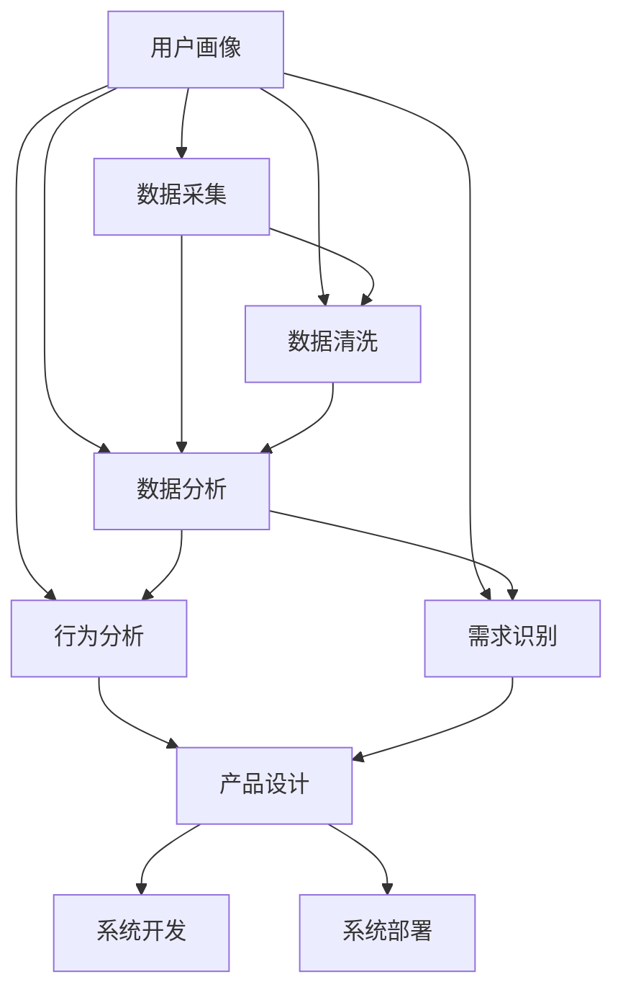

                 

# 自动化创业中的用户画像分析

## 1. 背景介绍

### 1.1 问题由来

随着人工智能和大数据技术的迅速发展，自动化创业成为了一个热门话题。自动化技术能够帮助企业大幅提升效率、降低成本，推动企业数字化转型。然而，自动化创业的成功不仅依赖于技术本身，更需要全面、深入的用户画像分析来指导产品设计和市场策略。

用户画像分析（User Persona Analysis）是一种基于数据驱动的、系统化的方法，用于构建和理解目标用户的行为、需求、偏好等信息，为自动化系统的开发和运营提供科学依据。本文将详细探讨用户画像分析在自动化创业中的重要性、核心概念及其构建方法。

### 1.2 问题核心关键点

- 用户画像分析（User Persona Analysis）
- 数据驱动（Data-Driven）
- 自动化创业（Automated Startup）
- 行为分析（Behavioral Analysis）
- 需求识别（Demand Identification）

这些关键点构成了用户画像分析在自动化创业中的核心框架，通过深入理解这些概念，可以帮助我们构建科学的用户画像，指导自动化系统的设计和运营。

## 2. 核心概念与联系

### 2.1 核心概念概述

为更好地理解用户画像分析在自动化创业中的运用，本节将介绍几个密切相关的核心概念：

- **用户画像（User Persona）**：一种抽象化的用户模型，通过收集和分析用户数据，描绘出具有典型特征的用户群像。用户画像通常包括用户的年龄、性别、职业、兴趣、行为习惯等信息。
- **数据驱动（Data-Driven）**：基于大量数据进行决策，强调数据的重要性，通过数据挖掘和分析，发现用户行为和需求的规律，指导产品的开发和优化。
- **自动化创业（Automated Startup）**：利用自动化技术，如机器学习、自然语言处理等，构建自动化系统，快速响应市场需求，提升企业竞争力的创业模式。

这些概念之间的关系可以简单归纳为：用户画像分析作为数据驱动方法的核心，通过对用户数据的深入分析，为自动化创业提供科学的用户洞察，指导系统开发和运营策略。

### 2.2 核心概念原理和架构的 Mermaid 流程图



这个流程图展示了用户画像分析的基本流程：

1. 数据采集：从不同渠道收集用户行为数据和反馈信息。
2. 数据清洗：处理数据中的噪音和异常值，确保数据质量。
3. 数据分析：使用统计分析、机器学习等技术，挖掘用户行为和需求的规律。
4. 行为分析：深入理解用户的活动模式和行为特征。
5. 需求识别：根据用户行为和反馈，识别出用户的具体需求和偏好。
6. 产品设计：基于用户画像，设计符合用户需求的产品功能和服务。
7. 系统开发：开发相应的自动化系统，实现产品功能。
8. 系统部署：将自动化系统部署到实际应用环境中，进行实时监控和优化。

## 3. 核心算法原理 & 具体操作步骤

### 3.1 算法原理概述

用户画像分析的原理基于数据驱动和行为分析。其核心在于：

- **数据驱动**：通过大量的用户数据，发现用户行为的规律和趋势，构建科学的用户画像。
- **行为分析**：从用户行为中提取有价值的信息，如用户偏好、行为习惯等，以指导产品设计和运营策略。

数据驱动的用户画像分析流程如下：

1. **数据采集**：从多个渠道收集用户数据，包括在线行为、交易记录、用户反馈等。
2. **数据清洗**：处理数据中的噪音和异常值，确保数据质量。
3. **数据分析**：使用统计分析、机器学习等技术，挖掘用户行为和需求的规律。
4. **行为分析**：深入理解用户的活动模式和行为特征。
5. **需求识别**：根据用户行为和反馈，识别出用户的具体需求和偏好。
6. **应用优化**：基于用户画像，优化产品功能和运营策略。

### 3.2 算法步骤详解

用户画像分析的具体操作步骤如下：

**Step 1: 数据采集**
- 从多个渠道收集用户数据，包括在线行为、交易记录、用户反馈等。
- 确保数据的全面性和真实性，覆盖不同的用户群体。

**Step 2: 数据清洗**
- 处理数据中的噪音和异常值，确保数据质量。
- 清洗掉重复数据、不完整数据和无关数据。

**Step 3: 数据分析**
- 使用统计分析、机器学习等技术，挖掘用户行为和需求的规律。
- 计算用户行为频率、持续时间、转换率等关键指标。

**Step 4: 行为分析**
- 深入理解用户的活动模式和行为特征。
- 分析用户在不同时间、不同场景下的行为规律。

**Step 5: 需求识别**
- 根据用户行为和反馈，识别出用户的具体需求和偏好。
- 识别用户的关键需求和痛点，提供解决方案。

**Step 6: 应用优化**
- 基于用户画像，优化产品功能和运营策略。
- 提供个性化推荐和服务，提升用户体验。

### 3.3 算法优缺点

用户画像分析具有以下优点：
- **科学依据**：基于数据驱动，提供了客观、科学的用户洞察。
- **精准度提升**：通过数据分析和行为分析，提升了用户画像的精准度。
- **策略优化**：指导产品设计和运营策略，提升企业竞争力。

同时，用户画像分析也存在以下局限性：
- **数据质量依赖**：依赖于数据采集和清洗的全面性和准确性，数据质量差将影响分析结果。
- **用户多样性**：难以全面覆盖多样化的用户群体，不同用户群体的需求可能存在较大差异。
- **隐私保护**：收集和使用用户数据可能涉及到隐私问题，需要严格遵守相关法律法规。

### 3.4 算法应用领域

用户画像分析在自动化创业中具有广泛的应用场景，包括但不限于：

- **智能客服系统**：通过用户画像，构建智能客服系统，提升客户满意度。
- **智能推荐系统**：根据用户画像，提供个性化推荐服务，提升用户粘性。
- **营销自动化**：基于用户画像，进行精准营销，提高营销效率和转化率。
- **风险管理**：识别高风险用户，采取预防措施，降低运营风险。
- **产品迭代**：通过用户反馈，快速识别用户需求，指导产品迭代和优化。

## 4. 数学模型和公式 & 详细讲解 & 举例说明

### 4.1 数学模型构建

用户画像分析的数学模型构建主要包括以下几个步骤：

1. **数据矩阵构建**：将用户行为数据表示为数据矩阵 $X \in \mathbb{R}^{n \times m}$，其中 $n$ 为用户数量，$m$ 为特征数量。
2. **特征选择**：从原始数据中选择最有代表性的特征，构建特征向量。
3. **聚类分析**：使用聚类算法，如K-Means、层次聚类等，将用户分为不同的群体。
4. **特征权重计算**：计算每个特征对用户行为的贡献度。
5. **画像构建**：综合所有用户的特征权重，构建用户画像。

### 4.2 公式推导过程

以聚类分析为例，推导K-Means算法的核心公式：

$$
\begin{aligned}
&\min_{C,\mu} \sum_{i=1}^{k} \sum_{j=1}^{n} \|x_j - \mu_i\|^2 \\
&s.t. \quad \sum_{j=1}^{n} \delta_{i,j} = 1, \quad \delta_{i,j} \in \{0,1\}
\end{aligned}
$$

其中，$C=\{\mu_1, \mu_2, ..., \mu_k\}$ 为聚类中心，$\delta_{i,j}$ 为指派函数，表示用户 $j$ 分配到簇 $i$ 中。

### 4.3 案例分析与讲解

假设我们收集到一份电商网站的用户行为数据，包括浏览次数、购买次数、购买金额等特征。使用K-Means算法，将用户分为高价值用户、中等价值用户和低价值用户三类。

1. 构建数据矩阵 $X \in \mathbb{R}^{10000 \times 3}$，其中10000为样本数，3为特征数。
2. 使用K-Means算法，聚类数为3，得到三个聚类中心 $\mu_1, \mu_2, \mu_3$。
3. 计算每个用户与聚类中心的距离，将用户分配到最近的聚类中心。
4. 统计每个聚类的用户数量和特征权重，构建用户画像。

## 5. 项目实践：代码实例和详细解释说明

### 5.1 开发环境搭建

在进行用户画像分析项目实践前，我们需要准备好开发环境。以下是使用Python进行PyTorch开发的环境配置流程：

1. 安装Anaconda：从官网下载并安装Anaconda，用于创建独立的Python环境。

2. 创建并激活虚拟环境：
```bash
conda create -n user persona python=3.8 
conda activate user persona
```

3. 安装PyTorch：根据CUDA版本，从官网获取对应的安装命令。例如：
```bash
conda install pytorch torchvision torchaudio cudatoolkit=11.1 -c pytorch -c conda-forge
```

4. 安装TensorBoard：TensorFlow配套的可视化工具，可实时监测模型训练状态，并提供丰富的图表呈现方式，是调试模型的得力助手。

```bash
pip install tensorboard
```

5. 安装Weights & Biases：模型训练的实验跟踪工具，可以记录和可视化模型训练过程中的各项指标，方便对比和调优。

```bash
pip install weightsandbiases
```

完成上述步骤后，即可在`user persona`环境中开始用户画像分析实践。

### 5.2 源代码详细实现

以下是用户画像分析的Python代码实现：

```python
import pandas as pd
import numpy as np
from sklearn.cluster import KMeans
from sklearn.preprocessing import StandardScaler

# 数据加载
df = pd.read_csv('user_behavior.csv')

# 特征选择
features = ['浏览次数', '购买次数', '购买金额']

# 数据标准化
scaler = StandardScaler()
scaled_features = scaler.fit_transform(df[features])

# 聚类分析
kmeans = KMeans(n_clusters=3, random_state=0)
kmeans.fit(scaled_features)

# 用户画像构建
clusters = kmeans.labels_
labels = pd.Series(clusters).value_counts().to_dict()
persona = {i: f'用户{k}({v})' for i, k in enumerate(labels)}
```

代码解读与分析：

- 数据加载：使用Pandas库加载用户行为数据，选择浏览次数、购买次数、购买金额等特征。
- 数据标准化：使用StandardScaler对特征进行标准化处理，避免不同特征之间量纲不一致。
- 聚类分析：使用KMeans算法进行聚类分析，将用户分为三个群体。
- 用户画像构建：根据聚类结果，构建用户画像，并将聚类标签转化为更易理解的描述。

### 5.3 代码解读与分析

通过上述代码，我们可以实现基本的用户画像分析。具体解读如下：

- 数据加载：使用Pandas库读取用户行为数据，并将其存储为DataFrame对象。
- 特征选择：选择具有代表性的特征，如浏览次数、购买次数、购买金额等，构建数据矩阵。
- 数据标准化：使用StandardScaler对特征进行标准化处理，避免不同特征之间量纲不一致。
- 聚类分析：使用KMeans算法进行聚类分析，将用户分为三个群体。
- 用户画像构建：根据聚类结果，构建用户画像，并将聚类标签转化为更易理解的描述。

## 6. 实际应用场景

### 6.1 智能客服系统

智能客服系统在自动化创业中发挥着重要作用，通过用户画像分析，可以构建更精准、更高效的客服系统，提升客户满意度。

具体实现如下：

1. 收集历史客服记录，提取用户的交互数据。
2. 使用用户画像分析方法，构建用户画像。
3. 根据用户画像，设计智能客服对话模板和回复策略。
4. 部署智能客服系统，实时监控和优化客户互动效果。

### 6.2 智能推荐系统

智能推荐系统通过用户画像分析，提供个性化的推荐服务，提升用户粘性。

具体实现如下：

1. 收集用户的行为数据，如浏览记录、购买记录等。
2. 使用用户画像分析方法，构建用户画像。
3. 根据用户画像，设计推荐算法，提供个性化的推荐服务。
4. 部署智能推荐系统，实时监控和优化推荐效果。

### 6.3 营销自动化

营销自动化通过用户画像分析，进行精准营销，提高营销效率和转化率。

具体实现如下：

1. 收集用户的交互数据，如在线行为、广告点击等。
2. 使用用户画像分析方法，构建用户画像。
3. 根据用户画像，设计营销策略，进行精准投放。
4. 部署营销自动化系统，实时监控和优化营销效果。

### 6.4 未来应用展望

随着用户画像分析技术的不断发展，其应用场景将不断扩展，推动自动化创业的进一步发展。

未来，用户画像分析将在以下方面发挥更大作用：

- **动态更新**：实时更新用户画像，反映用户行为的变化，提升用户画像的实时性。
- **多模态融合**：结合用户的多模态数据，如文本、图像、音频等，构建更全面的用户画像。
- **个性化推荐**：根据用户画像，提供更个性化、精准的推荐服务。
- **实时监控**：实时监控用户行为，及时发现和解决用户问题。
- **智能决策**：基于用户画像，进行智能决策，提升自动化系统的智能化水平。

## 7. 工具和资源推荐

### 7.1 学习资源推荐

为了帮助开发者系统掌握用户画像分析的理论基础和实践技巧，这里推荐一些优质的学习资源：

1. 《数据科学导论》（Introduction to Data Science）：一本全面的数据科学入门书籍，涵盖数据收集、数据清洗、数据分析等基本概念和常用技术。

2. 《Python数据分析》（Python Data Analysis）：一本以Python为工具，介绍数据分析和可视化的实用书籍。

3. 《机器学习实战》（Machine Learning in Action）：一本实战性较强的机器学习书籍，通过具体案例，展示机器学习算法在数据处理和预测中的应用。

4. 《用户画像分析》（User Persona Analysis）在线课程：由数据科学专家开设的在线课程，系统介绍用户画像分析的方法和应用。

5. Kaggle平台：一个数据科学竞赛平台，提供丰富的数据集和实战项目，帮助开发者积累实践经验。

通过对这些资源的学习实践，相信你一定能够快速掌握用户画像分析的精髓，并用于解决实际的自动化创业问题。

### 7.2 开发工具推荐

高效的开发离不开优秀的工具支持。以下是几款用于用户画像分析开发的常用工具：

1. Jupyter Notebook：一个交互式的开发环境，支持Python等语言的开发和调试。

2. Python：一种高层次的编程语言，支持大量的数据处理和分析库，如Pandas、NumPy、Scikit-Learn等。

3. TensorFlow：由Google主导开发的开源深度学习框架，支持各种复杂的数据处理和机器学习算法。

4. PyTorch：一个动态计算图框架，支持高效的深度学习模型构建和训练。

5. Weights & Biases：模型训练的实验跟踪工具，可以记录和可视化模型训练过程中的各项指标，方便对比和调优。

6. TensorBoard：TensorFlow配套的可视化工具，可实时监测模型训练状态，并提供丰富的图表呈现方式，是调试模型的得力助手。

合理利用这些工具，可以显著提升用户画像分析任务的开发效率，加快创新迭代的步伐。

### 7.3 相关论文推荐

用户画像分析技术的研究源于学界的持续探索。以下是几篇奠基性的相关论文，推荐阅读：

1. "A Survey on User Profiling and Its Applications"：一篇综述性论文，全面介绍用户画像分析的理论基础和应用场景。

2. "User Profiling for Recommendation Systems: A Survey and Taxonomy"：一篇关于用户画像在推荐系统中的应用的综述性论文。

3. "User Profiling in E-Commerce"：一篇针对电子商务领域用户画像分析的论文，展示了用户画像在电商中的应用。

4. "Data-Driven User Profiling"：一篇探索数据驱动用户画像分析方法的论文。

5. "Personalized Recommendation Using User Profiling"：一篇介绍用户画像在个性化推荐系统中的应用的论文。

这些论文代表了大用户画像分析技术的发展脉络。通过学习这些前沿成果，可以帮助研究者把握学科前进方向，激发更多的创新灵感。

## 8. 总结：未来发展趋势与挑战

### 8.1 研究成果总结

本文对用户画像分析在自动化创业中的重要性、核心概念及其构建方法进行了全面系统的介绍。首先阐述了用户画像分析的重要性和核心关键点，明确了其在大规模自动化创业中的作用。其次，从原理到实践，详细讲解了用户画像分析的数学模型和具体步骤，提供了完整的代码实例。最后，探讨了用户画像分析在智能客服、智能推荐、营销自动化等领域的实际应用场景，展示了其广泛的应用前景。

### 8.2 未来发展趋势

展望未来，用户画像分析技术将呈现以下几个发展趋势：

1. **动态更新**：实时更新用户画像，反映用户行为的变化，提升用户画像的实时性。
2. **多模态融合**：结合用户的多模态数据，如文本、图像、音频等，构建更全面的用户画像。
3. **个性化推荐**：根据用户画像，提供更个性化、精准的推荐服务。
4. **实时监控**：实时监控用户行为，及时发现和解决用户问题。
5. **智能决策**：基于用户画像，进行智能决策，提升自动化系统的智能化水平。

### 8.3 面临的挑战

尽管用户画像分析技术已经取得了一定进展，但在迈向更加智能化、普适化应用的过程中，仍面临以下挑战：

1. **数据质量问题**：依赖于数据采集和清洗的全面性和准确性，数据质量差将影响分析结果。
2. **用户隐私保护**：收集和使用用户数据可能涉及到隐私问题，需要严格遵守相关法律法规。
3. **模型复杂性**：随着数据量和特征数的增加，模型复杂度也会增加，计算资源和训练时间成为瓶颈。
4. **多模态数据融合**：不同模态的数据特征和表示方式不同，需要开发有效的多模态融合方法。
5. **数据隐私和安全性**：如何保护用户数据隐私和安全，防止数据泄露和滥用。

### 8.4 研究展望

为了应对这些挑战，未来研究需要在以下几个方面寻求新的突破：

1. **数据预处理技术**：开发更加高效、准确的数据清洗和特征选择技术，提升数据质量。
2. **模型简化技术**：开发更加高效、轻量级的模型，降低计算资源消耗，提升训练速度。
3. **多模态融合技术**：开发更加有效的多模态数据融合方法，提升用户画像的全面性和准确性。
4. **隐私保护技术**：开发更加安全的用户数据保护技术，确保数据隐私和安全。
5. **智能决策技术**：开发更加智能的决策支持系统，提升自动化系统的智能化水平。

这些研究方向的探索，必将引领用户画像分析技术迈向更高的台阶，为自动化创业带来新的突破。面向未来，用户画像分析技术还需要与其他人工智能技术进行更深入的融合，如知识表示、因果推理、强化学习等，多路径协同发力，共同推动自动化创业的进步。只有勇于创新、敢于突破，才能不断拓展用户画像分析的边界，让自动化创业更好地造福人类社会。

## 9. 附录：常见问题与解答

**Q1：用户画像分析是否适用于所有自动化创业项目？**

A: 用户画像分析在大多数自动化创业项目中都能取得不错的效果，特别是对于数据量较大的项目。但对于一些无需用户交互的项目，如物理自动化系统，用户画像分析可能不适用。需要根据具体项目特点，评估其适用性。

**Q2：用户画像分析是否需要高精度的数据？**

A: 用户画像分析需要高精度的数据，以确保分析结果的准确性和可靠性。数据质量直接影响用户画像的准确度，因此在数据采集和清洗过程中需要格外注意。

**Q3：用户画像分析的周期是多长？**

A: 用户画像分析的周期取决于数据采集和处理的频率。一般情况下，用户画像需要定期更新，以反映用户行为的变化。具体周期需要根据项目需求和数据量确定。

**Q4：用户画像分析如何应对数据隐私问题？**

A: 用户画像分析在数据采集和处理过程中，需要严格遵守相关法律法规，确保用户数据的隐私和安全。可以采用数据脱敏、加密等技术，保护用户隐私。同时，需要建立用户数据的使用规范和权限管理机制，确保数据使用的透明性和合法性。

**Q5：用户画像分析如何实现动态更新？**

A: 实现动态更新需要实时收集用户数据，并使用增量更新算法，如在线K-Means、在线PCA等，对用户画像进行更新。同时，需要设计合理的数据更新策略，确保动态更新的实时性和准确性。

---

作者：禅与计算机程序设计艺术 / Zen and the Art of Computer Programming

