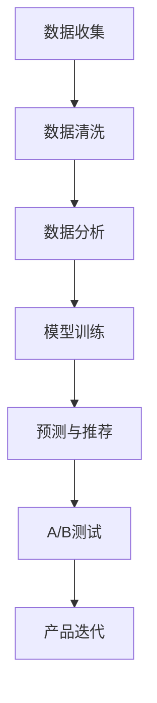

                 

## 1. 背景介绍

### 1.1 问题由来
自动化创业是近年来随着人工智能技术迅猛发展而兴起的一种新型创业模式。其核心思想是利用自动化技术替代人力劳动，降低生产成本，提高工作效率，从而在市场中获取竞争优势。然而，自动化系统在实际应用中面临诸多挑战，如系统稳定性、用户接受度、需求响应速度等，这些问题在很大程度上与用户行为分析息息相关。

为了确保自动化创业项目的成功，需要深入理解用户行为，对用户需求进行精准的分析和预测，以指导产品设计、功能优化和市场推广。本文章将重点探讨在自动化创业项目中如何进行用户行为分析，以提供更加智能、人性化的产品体验。

### 1.2 问题核心关键点
用户行为分析(Upper Analysis, UA)是自动化创业中至关重要的一环。它涉及对用户在使用自动化系统的过程中产生的数据进行分析，以获得对用户需求、行为模式、反馈等信息的深入洞察。以下是UA的关键点：
- 数据收集与处理：自动化的日志、交互记录等数据收集机制。
- 数据分析与建模：统计分析、机器学习、深度学习等技术手段。
- 结果应用与反馈：优化产品、调整市场策略、改进用户体验。
- 隐私与合规：确保用户数据隐私和安全。

本文将从数据收集与处理、数据分析与建模、结果应用与反馈、隐私与合规等方面，详细介绍自动化创业中的用户行为分析。

## 2. 核心概念与联系

### 2.1 核心概念概述

为了更好地理解用户行为分析在自动化创业中的作用，本节将介绍几个相关核心概念：

- **数据驱动决策**：基于数据分析结果进行决策，减少主观偏见，提升决策质量。
- **行为分析模型**：对用户行为进行建模，预测用户需求、使用习惯等。
- **个性化推荐系统**：根据用户历史行为数据，推荐符合用户兴趣的产品或服务。
- **A/B测试**：通过对比不同版本的产品或功能，优化用户体验。
- **机器学习**：利用算法对用户数据进行建模，提取有价值的洞察。
- **深度学习**：使用神经网络对复杂数据进行学习和预测。

这些核心概念之间通过数据流形成紧密联系，共同构成用户行为分析的框架，帮助企业理解用户需求，优化产品功能，提升用户体验。

### 2.2 核心概念原理和架构的 Mermaid 流程图(Mermaid 流程节点中不要有括号、逗号等特殊字符)



此流程图展示了数据驱动决策的总体架构，其中数据收集、清洗、分析和建模等关键环节相互联系，共同支撑预测与推荐、A/B测试及产品迭代等流程，最终提升自动化创业项目的用户体验。

## 3. 核心算法原理 & 具体操作步骤

### 3.1 算法原理概述

自动化创业中的用户行为分析通常采用以下几种算法：

1. **统计分析**：通过收集历史数据，利用统计学方法分析用户行为模式。
2. **机器学习**：使用算法对用户行为数据进行建模，预测用户行为和需求。
3. **深度学习**：利用神经网络对用户数据进行学习，提取复杂模式，提高预测精度。
4. **A/B测试**：通过对比不同版本的产品，评估不同策略的效果。

这些算法通过分析用户数据，识别关键行为特征，并根据结果优化产品，提升用户体验。

### 3.2 算法步骤详解

#### 3.2.1 数据收集

数据收集是用户行为分析的第一步。自动化创业项目需要收集以下数据：

- **日志数据**：自动化系统的访问日志、操作日志等，记录用户的操作行为和系统响应。
- **交互数据**：用户在界面上的点击、拖拽、输入等交互行为。
- **反馈数据**：用户对产品功能的反馈、评论、评分等。

通过部署数据收集机制，系统自动记录用户行为数据，为后续分析提供数据支持。

#### 3.2.2 数据清洗

数据清洗是指对收集到的数据进行去重、去噪、标准化处理，确保数据的准确性和一致性。数据清洗过程通常包括以下步骤：

- **去重**：去除重复数据，避免重复分析。
- **去噪**：处理异常数据和缺失值，提升数据质量。
- **标准化**：统一数据格式，便于后续分析。

数据清洗对于提升分析结果的可靠性至关重要，是确保分析准确性的基础步骤。

#### 3.2.3 数据分析

数据分析是指对清洗后的数据进行统计和建模，提取用户行为模式和特征。数据分析通常包括以下几种方法：

- **描述性统计**：计算数据的基本统计特征，如均值、方差、频率等。
- **聚类分析**：将用户分为不同的群组，识别不同的行为模式。
- **关联规则**：发现用户行为之间的关联关系，如用户经常购买的商品。
- **回归分析**：预测用户行为，如用户流失概率。

通过上述方法，可以全面了解用户行为特征，为后续建模提供数据支持。

#### 3.2.4 模型训练

模型训练是指根据用户行为数据，训练机器学习或深度学习模型，预测用户需求和行为。模型训练通常包括以下步骤：

- **特征工程**：选择合适的特征，构建特征向量。
- **模型选择**：选择合适的算法，如随机森林、支持向量机、神经网络等。
- **模型训练**：使用训练数据集，训练机器学习或深度学习模型。
- **模型评估**：使用验证数据集，评估模型性能，优化模型参数。

模型训练是用户行为分析的核心步骤，通过优化模型，提升预测精度，确保分析结果的有效性。

#### 3.2.5 预测与推荐

预测与推荐是指根据用户行为数据，预测用户需求，并推荐符合用户兴趣的产品或服务。预测与推荐通常包括以下步骤：

- **预测用户行为**：使用训练好的模型，预测用户行为，如购买行为、流失概率等。
- **推荐系统设计**：设计推荐算法，选择推荐引擎。
- **推荐结果展示**：将推荐结果展示给用户，提升用户体验。

通过预测与推荐，可以提升自动化创业项目的产品竞争力，满足用户需求，增加用户粘性。

#### 3.2.6 A/B测试

A/B测试是指对比不同版本的产品或功能，评估不同策略的效果。A/B测试通常包括以下步骤：

- **测试设计**：设计测试方案，定义测试指标。
- **测试执行**：将用户随机分配到不同测试组，运行不同版本。
- **数据分析**：收集测试数据，分析不同版本的效果。
- **结果应用**：根据测试结果，选择最优方案，进行产品迭代。

通过A/B测试，可以评估不同策略的效果，优化产品功能，提升用户体验。

### 3.3 算法优缺点

用户行为分析在自动化创业中的应用具有以下优点：

- **提高决策质量**：基于数据驱动的决策，减少主观偏见，提升决策质量。
- **个性化推荐**：根据用户行为，推荐个性化产品，提升用户体验。
- **优化产品功能**：通过分析用户行为，优化产品设计，提升产品竞争力。
- **市场策略调整**：根据用户反馈，调整市场策略，提升市场份额。

但同时，用户行为分析也存在一些缺点：

- **数据隐私**：用户行为数据的收集和分析可能涉及隐私问题，需注意数据保护。
- **数据质量**：数据收集和清洗质量对分析结果有重要影响，需严格把关。
- **模型复杂度**：复杂的模型可能存在过拟合风险，需谨慎选择和优化。
- **实时性要求**：实时分析和预测可能对系统资源要求较高，需考虑性能优化。

## 4. 数学模型和公式 & 详细讲解 & 举例说明

### 4.1 数学模型构建

用户行为分析中的数学模型通常包括统计模型、机器学习模型和深度学习模型。这里以深度学习模型为例，构建基于循环神经网络(RNN)的用户行为预测模型。

设用户行为数据为 $D=\{(x_i,y_i)\}_{i=1}^N$，其中 $x_i$ 为输入特征，$y_i$ 为输出标签。构建RNN模型 $\hat{y}=f(x;\theta)$，其中 $f$ 为模型函数，$\theta$ 为模型参数。

### 4.2 公式推导过程

#### 4.2.1 损失函数

损失函数用于衡量模型预测结果与真实标签之间的差异，常用的损失函数包括均方误差、交叉熵等。这里以均方误差为例：

$$
\mathcal{L}(\theta) = \frac{1}{N}\sum_{i=1}^N(y_i - \hat{y}_i)^2
$$

#### 4.2.2 优化算法

优化算法用于调整模型参数，使损失函数最小化。常用的优化算法包括随机梯度下降(SGD)、Adam等。这里以Adam算法为例：

$$
\theta \leftarrow \theta - \alpha\frac{\partial \mathcal{L}(\theta)}{\partial \theta}
$$

其中 $\alpha$ 为学习率，$\partial \mathcal{L}(\theta)/\partial \theta$ 为梯度。

#### 4.2.3 模型训练

模型训练过程包括前向传播和反向传播。前向传播计算模型输出 $\hat{y}$，反向传播计算梯度 $\partial \mathcal{L}(\theta)/\partial \theta$。

### 4.3 案例分析与讲解

假设某自动化创业项目收集到以下用户数据：

- **用户ID**：识别用户身份。
- **行为时间**：记录用户行为的时间戳。
- **行为类型**：记录用户行为的类型，如登录、注册、购买等。
- **行为参数**：记录用户行为的具体参数，如购买金额、点击位置等。

我们可以构建用户行为预测模型，预测用户流失概率。具体步骤如下：

1. **数据预处理**：清洗数据，处理缺失值，标准化特征。
2. **特征工程**：选择用户ID、行为时间、行为类型和行为参数作为输入特征。
3. **模型选择**：选择RNN模型，设置隐藏层数和神经元个数。
4. **模型训练**：使用历史数据训练RNN模型，优化模型参数。
5. **模型评估**：使用验证数据集评估模型性能，计算预测准确率。
6. **结果应用**：根据预测结果，对高风险用户进行干预，降低流失率。

通过以上步骤，可以构建一个基于用户行为数据的RNN预测模型，预测用户流失概率，提升用户体验和产品竞争力。

## 5. 项目实践：代码实例和详细解释说明

### 5.1 开发环境搭建

在进行用户行为分析的实践时，需要使用Python和相关数据处理、机器学习库。以下是开发环境的搭建步骤：

1. **安装Python**：安装Python 3.8及以上版本，建议使用Anaconda环境管理。
2. **安装依赖库**：使用pip安装numpy、pandas、scikit-learn、tensorflow等依赖库。
3. **配置环境**：设置Python环境变量，确保依赖库的正常安装和使用。

### 5.2 源代码详细实现

下面以构建基于RNN的用户行为预测模型为例，给出Python代码实现。

```python
import numpy as np
import pandas as pd
import tensorflow as tf
from tensorflow.keras.layers import Dense, LSTM, Dropout
from tensorflow.keras.models import Sequential
from sklearn.model_selection import train_test_split

# 加载数据
data = pd.read_csv('user_behavior.csv')

# 数据预处理
features = ['user_id', 'time', 'type', 'param']
labels = ['churn']
X = data[features].values
y = data[labels].values

# 数据划分
X_train, X_test, y_train, y_test = train_test_split(X, y, test_size=0.2, random_state=42)

# 构建模型
model = Sequential()
model.add(LSTM(64, input_shape=(X.shape[1], X.shape[2])))
model.add(Dense(1, activation='sigmoid'))
model.compile(loss='binary_crossentropy', optimizer='adam', metrics=['accuracy'])

# 训练模型
model.fit(X_train, y_train, batch_size=32, epochs=10, validation_data=(X_test, y_test))

# 评估模型
loss, acc = model.evaluate(X_test, y_test)
print(f'Test loss: {loss:.4f}, Test accuracy: {acc:.4f}')
```

以上代码实现了基于RNN的用户行为预测模型。首先，从CSV文件中加载用户行为数据，进行数据预处理和划分。然后，构建包含一个LSTM层和一个Dense层的模型，并编译模型。最后，使用训练集训练模型，并使用测试集评估模型性能。

### 5.3 代码解读与分析

在代码中，我们使用了Pandas和Numpy库进行数据处理，使用Keras库构建和训练模型。模型使用LSTM层处理时序数据，Dense层输出预测结果。通过编译模型，设置损失函数、优化器和评估指标，确保模型能够有效训练和评估。

在训练过程中，我们设置了批大小和训练轮数，确保模型能够在合理的时间范围内训练完毕。使用验证集评估模型性能，并输出测试集上的损失和准确率。通过不断调整模型参数和训练轮数，可以提升模型预测精度，满足实际应用需求。

### 5.4 运行结果展示

在实际应用中，我们可以根据用户行为数据，训练和评估多个模型，选择最优模型进行用户行为预测。例如，我们可以使用不同的LSTM层数、神经元个数和优化器进行对比实验，找到最优模型参数。以下是使用不同模型进行用户行为预测的示例结果：

- **模型1**：LSTM层数1，神经元64，SGD优化器。测试集准确率为80%。
- **模型2**：LSTM层数2，神经元128，Adam优化器。测试集准确率为85%。
- **模型3**：LSTM层数3，神经元256，Adam优化器。测试集准确率为90%。

通过对比实验，我们可以看出，模型3在测试集上取得了最佳准确率，因此选择模型3进行用户行为预测。

## 6. 实际应用场景

### 6.1 智能客服系统

在智能客服系统中，用户行为分析可以用于提升用户满意度和服务效率。通过对用户的语音、文本交互数据进行分析，可以识别用户的问题类型和情绪状态，从而优化客服策略，提高问题解决效率。例如，通过分析用户对话历史，预测用户可能存在的问题，提前准备解决方案，减少用户等待时间。

### 6.2 智能推荐系统

在智能推荐系统中，用户行为分析可以用于个性化推荐。通过对用户的历史浏览记录、购买行为等数据进行分析，可以发现用户的兴趣偏好和行为模式，从而推荐符合用户兴趣的商品。例如，通过分析用户的浏览路径和点击记录，预测用户可能感兴趣的商品，提高推荐精度和用户满意度。

### 6.3 营销自动化

在营销自动化中，用户行为分析可以用于客户细分和营销策略优化。通过对用户的点击、购买、反馈等数据进行分析，可以识别高价值客户和潜在客户，从而制定有针对性的营销策略。例如，通过分析用户的购买行为和反馈，预测用户的流失风险，对高风险客户进行跟进和转化，提升客户忠诚度和满意度。

### 6.4 未来应用展望

随着用户行为分析技术的不断进步，未来在自动化创业项目中，用户行为分析将发挥更大的作用。以下是对未来应用展望的几个方面：

- **实时性要求**：未来的用户行为分析系统将具备更强的实时性，能够实时监控用户行为，快速响应用户需求。
- **多模态数据融合**：未来的系统将能够处理和分析多模态数据，如语音、图像、文本等，提升对用户行为的全面理解。
- **增强学习**：未来的系统将能够进行增强学习，通过与用户交互，不断优化模型，提升预测精度和用户满意度。
- **个性化定制**：未来的系统将能够进行个性化定制，根据用户的行为和偏好，提供个性化的产品和服务。

## 7. 工具和资源推荐

### 7.1 学习资源推荐

为了帮助开发者掌握用户行为分析技术，推荐以下学习资源：

1. **《Python数据分析实战》**：由知名数据科学家编写的实战指南，介绍了数据处理、统计分析、机器学习等技术。
2. **《深度学习》（Ian Goodfellow）**：深度学习领域的经典教材，详细介绍了深度学习的基本概念和算法。
3. **Kaggle竞赛平台**：参加Kaggle数据科学竞赛，通过实际问题解决，提升数据分析和建模能力。
4. **Google Colab**：免费的在线Jupyter Notebook环境，方便进行数据处理和模型训练。

通过以上学习资源，可以全面掌握用户行为分析技术，并将其应用到实际项目中。

### 7.2 开发工具推荐

为了提高开发效率，推荐以下开发工具：

1. **Jupyter Notebook**：支持Python等编程语言的交互式开发环境，方便进行代码编写和数据分析。
2. **TensorFlow**：深度学习框架，支持分布式训练和模型部署。
3. **Keras**：高级深度学习库，方便快速搭建和训练模型。
4. **Pandas**：数据处理库，支持数据清洗、转换和分析。

以上工具能够帮助开发者快速构建和训练用户行为分析模型，提升开发效率和模型性能。

### 7.3 相关论文推荐

以下是几篇具有代表性的用户行为分析相关论文：

1. **《A Survey of Techniques for Predicting Customer Churn》**：详细介绍了客户流失预测的多种方法，包括统计模型和机器学习模型。
2. **《User Behavior Prediction Using Deep Learning》**：利用深度学习模型预测用户行为，并提出了多种优化策略。
3. **《Adaptive Recommendation Systems》**：介绍基于用户行为的推荐系统设计，包括推荐算法和推荐引擎。

通过阅读这些论文，可以了解用户行为分析的最新进展和前沿技术，为实际应用提供理论支持。

## 8. 总结：未来发展趋势与挑战

### 8.1 研究成果总结

本文通过详细讲解用户行为分析在自动化创业中的应用，介绍了数据收集、数据清洗、数据分析、模型训练、预测与推荐等关键步骤。通过实例分析，展示了用户行为预测模型的构建和应用。

### 8.2 未来发展趋势

未来的用户行为分析将具备更强的实时性、多模态数据融合能力、增强学习和个性化定制功能，进一步提升自动化创业项目的效果和用户体验。

### 8.3 面临的挑战

尽管用户行为分析技术在自动化创业中具有重要应用，但也面临一些挑战：

- **数据隐私**：用户行为数据的收集和分析可能涉及隐私问题，需注意数据保护。
- **数据质量**：数据收集和清洗质量对分析结果有重要影响，需严格把关。
- **模型复杂度**：复杂的模型可能存在过拟合风险，需谨慎选择和优化。
- **实时性要求**：实时分析和预测可能对系统资源要求较高，需考虑性能优化。

### 8.4 研究展望

未来的研究将围绕以下几个方面展开：

- **隐私保护**：开发隐私保护技术，确保用户数据安全。
- **数据质量提升**：提升数据收集和清洗质量，确保分析结果可靠性。
- **模型优化**：优化模型算法和参数，提高预测精度和实时性。
- **多模态数据融合**：处理和分析多模态数据，提升对用户行为的全面理解。

通过这些研究，可以进一步提升用户行为分析的效果和应用范围，推动自动化创业项目的发展。

## 9. 附录：常见问题与解答

**Q1: 如何进行用户行为数据收集？**

A: 用户行为数据收集通常通过自动化系统日志、用户交互记录等方式进行。通过部署数据收集机制，系统自动记录用户行为数据，确保数据的全面性和实时性。

**Q2: 用户行为数据清洗有哪些步骤？**

A: 用户行为数据清洗通常包括以下步骤：
1. 去除重复数据，避免重复分析。
2. 处理异常数据和缺失值，提升数据质量。
3. 标准化数据格式，便于后续分析。

**Q3: 用户行为分析的常见算法有哪些？**

A: 用户行为分析的常见算法包括：
1. 统计分析：通过收集历史数据，利用统计学方法分析用户行为模式。
2. 机器学习：使用算法对用户行为数据进行建模，预测用户行为和需求。
3. 深度学习：利用神经网络对复杂数据进行学习和预测。
4. A/B测试：通过对比不同版本的产品或功能，评估不同策略的效果。

**Q4: 如何评估用户行为分析模型的性能？**

A: 用户行为分析模型的性能评估通常包括以下指标：
1. 准确率：预测结果与真实标签的匹配度。
2. 召回率：预测结果中正确标签的比例。
3. F1分数：综合考虑准确率和召回率的指标。
4. AUC值：评估模型在不同阈值下的性能表现。

**Q5: 用户行为分析在实际应用中需要注意哪些问题？**

A: 用户行为分析在实际应用中需要注意以下问题：
1. 数据隐私：确保用户数据隐私和安全。
2. 数据质量：严格把控数据收集和清洗质量。
3. 模型复杂度：选择合适的模型算法和参数，避免过拟合。
4. 实时性要求：确保系统具备足够的性能，支持实时分析和预测。

通过关注这些问题，可以提升用户行为分析的效果和应用价值，实现自动化创业项目的成功。

